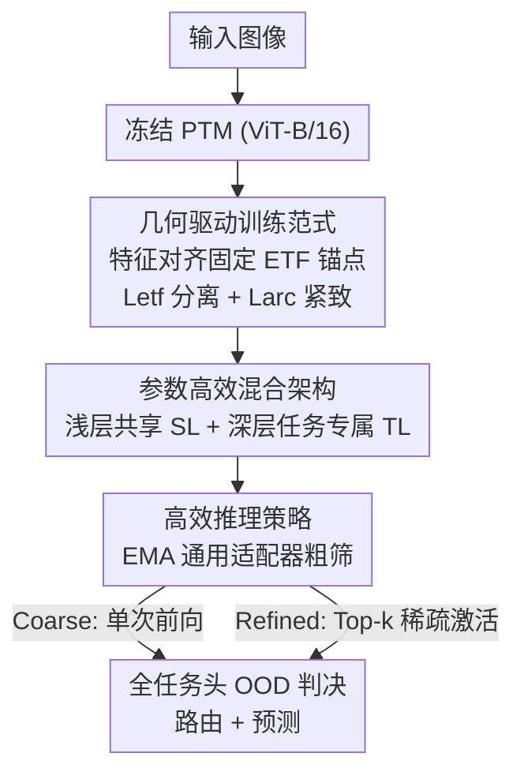

# Geometry-driven OOD Detectors Are Class-Incremental Learners

**会议**: CVPR 2026  
**论文**: [CVF Open Access](https://openaccess.thecvf.com/content/CVPR2026/html/Jia_Geometry-driven_OOD_Detectors_Are_Class-Incremental_Learners_CVPR_2026_paper.html)  
**代码**: https://github.com/Wangwang-Jia/GOD  
**领域**: 持续学习 / 类增量学习  
**关键词**: 类增量学习, OOD检测, 等角紧框架(ETF), 神经坍缩, LoRA  

## 一句话总结
GOD 把"每个任务的分类头同时具备 IND 识别 + OOD 拒识能力"作为类增量学习的充分条件，用固定的等角紧框架(ETF)锚点替换可学习分类头，配合 ETF loss(类间分离)与 ArcFace loss(类内紧致)在统一几何空间里把"分类"和"不确定度估计"合二为一，使跨任务路由从脆弱的 Task-ID 预测器变成天然涌现的 OOD 判决，在 4 个 benchmark 上达到 SOTA。

## 研究背景与动机

**领域现状**：类增量学习(CIL)要在不断到来的新类上学习而不遗忘旧类。近来主流做法是冻结预训练模型(PTM)骨干、只用轻量模块(prompt / 表示调整 / 架构扩展)适配增量任务，借 PTM 的泛化力抑制灾难性遗忘。

**现有痛点**：这些方法几乎都在优化特征提取器，却忽视了分类头的设计。而分类头恰恰是 CIL 的关键瓶颈，现有两种设计都有硬伤：(i) **单一扩张分类头**——一个头随类别增长，会引发表示遗忘和决策层的"近因偏置"(recency bias)，预测被拉向新类；(ii) **多固定分类头**——每个任务一个独立头划分不相交决策空间，缓解了近因偏置，但必须依赖一个 Task-ID 预测器做路由，而这个预测器本身会遗忘、成为新瓶颈。

**核心矛盾**：理想的分类头不仅要识别自己任务的 IND 类，还要拒识没见过的 OOD 样本(给出可用的 OOD 信号)。但标准 softmax / cosine 头是为闭集分类优化的，本质上缺这个能力——softmax 对 OOD 过度自信，cosine 只学到局部决策边界而非全局锚点。于是路由不得不外挂一个易遗忘的 Task-ID 预测器。

**本文目标**：让每个任务头自身就成为一个可靠的 IND/OOD 检测器，从而把跨任务路由变成"哪个头认为输入是 IND 就接收、否则拒绝"的天然判决，CIL 由此自然涌现——加新任务就加新头，旧头各自维持决策区域，不相交决策空间和无共享头扩张同时成立。

**切入角度**：作者从几何角度分析了"什么样的分类头才有可用 OOD 信号"，给出严格理论:这个能力由**类间分离(Inter-class Separation)**和**类内紧致(Intra-class Compactness)**两条几何性质刻画。而神经坍缩(Neural Collapse)理论指出,终极训练阶段特征与分类器权重会收敛到对称的 ETF 结构——这正好是一个"天生满足类间分离"的几何。

**核心 idea**：与其让模型自己去学这个理想几何，不如**先把理想几何写死(固定 ETF 锚点)，再训练特征去对齐它**。特征到锚点的距离就成为统一信号:既支撑 IND 分类，又是可靠的 OOD 拒识不确定度分数。

## 方法详解

### 整体框架
GOD 是一个基于 PTM、无样本回放(exemplar-free)的 CIL 方法。骨干是冻结的 ViT-B/16,所有适配都靠 LoRA。整条管线分三块:**几何驱动训练**把每个任务的特征对齐到固定 ETF 锚点,使分类头天生具备 OOD 拒识;**参数高效混合架构**把 LoRA 拆成"浅层共享 + 深层任务专属",避免参数随任务线性膨胀;**高效推理策略**用一个 EMA 聚合的通用适配器做粗筛、再对 Top-k 候选任务稀疏激活做精修,给出可调的速度-精度折中。

训练时对任务 $t$:输入经冻结 PTM,先过共享 LoRA(SL)和任务专属 LoRA(TL$_t$),再经共享随机投影(RP)和任务专属投影头(TP$_t$),最后 $\ell_2$ 归一化得到特征,用 ETF + ArcFace 双损失把特征"焊"到该任务的 ETF 锚点上;TL$_{ema}$ 同步用 EMA 更新。推理时所有任务头的 logit 拼成全局向量,谁的得分最高(且不被拒识)就路由给谁。

### 关键设计

**1. 几何驱动训练范式：把分类头写死成 ETF 锚点，让"分类距离"直接当 OOD 分数**

针对"标准头给不出可用 OOD 信号"这个根本痛点,GOD 不再联合学习特征空间和分类器权重,而是**先固定一个理想几何、再学特征去对齐**。对任务 $t$ 的 $C_t$ 个类,构造一组归一化 ETF 锚点 $E_t=\{e_{t,1},\dots,e_{t,C_t}\}$,满足 $\langle e_{t,i},e_{t,j}\rangle = 1\ (i=j)$、$-\frac{1}{C_t-1}\ (i\neq j)$,即在单位超球面上形成最大且均匀的角间隔——这正是理论要求的"类间分离"。类 $c$ 的 logit 定义为特征与锚点的余弦相似度 $s_{t,c}(x)=\langle z_t(x),e_{t,c}\rangle$,测试时所有任务头拼成全局 logit $s(x)=\text{concat}_{t=1}^{T}(s_t(x))$,天然实现多头 OOD 检测器。

为什么有效:把分类器硬编码成 ETF + 最近锚点决策,GOD 直接满足了神经坍缩四条件里的三条(NC2 ETF 几何、NC3 自对偶、NC4 最近类心决策),训练只需补 NC1——把同类特征压向各自锚点。双损失正好分头负责理论里的两条假设:ETF loss(温度缩放交叉熵)$L_{etf}=-\log\frac{\exp(s_{t,y_i}(x_i)/\tau)}{\sum_j \exp(s_{t,j}(x_i)/\tau)}$ 强化**类间分离**;ArcFace loss $L_{arc}=-\log\frac{e^{s\cos(\theta_{y_i}+m)}}{e^{s\cos(\theta_{y_i}+m)}+\sum_{j\neq y_i}e^{s\cdot s_{t,j}(x_i)}}$ 在每个锚点周围加角间隔 $m$,收紧**类内紧致**,总目标 $L_{total}=L_{etf}+L_{arc}$。

特征到锚点的 Mahalanobis 距离由此既是分类依据又是 OOD 不确定度——这是 GOD 把分类和拒识统一进单一几何空间的关键。此外,特征提取用两段线性投影:共享冻结的随机投影 RP 先把特征升维以增强跨任务线性可分,任务专属 TP$_t$ 再学着对齐锚点,$z_t(x)=\frac{TP_t(RP(f_t(x)))}{\|TP_t(RP(f_t(x)))\|}$。

> ⚠️ 理论部分给出 Theorem 1:分离度 $D_t$ 的上界由"IND 类间距离最大化 + 类内协方差最小化"共同抬升,据此把"最大化 ETF 角间隔"论证为 Mahalanobis 目标的有效代理。具体证明在补充材料,此处以原文为准。

**2. 共享-专属 LoRA 分解：把"参数随任务线性增长"按网络深度拆开**

多分类头 CIL 的代价是参数和推理量随任务数线性增长。作者实测各任务原型的逐层余弦相似度(Fig. 3)发现一个规律:**浅层 transformer block 的任务原型跨任务高度相似**(LoRA 在浅层学的多是任务无关的通用特征),而**深层 block 的原型差异很大**(任务专属变化集中在深层)。这个深度异质性直接启发了混合共享方案。

具体在深度 $k$ 处切分 $L$ 个 block:$l\le k$ 的 LoRA 合成单一 **Shared LoRA(SL)**,只在第一个任务训练后冻结、之后所有任务复用;$l>k$ 的 LoRA 保留为**任务专属 TL**,每来一个新任务只加一个轻量 TL$_t$(从 TL$_{t-1}$ 暖启动)。实现里 ViT-B/16 共 12 块,前 9 块作 SL 冻结、后 3 块作 TL 适配。好处是把任务专属容量集中放在最需要的深层,浅层共享通用表示,参数开销大幅下降——可训练参数仅 2.64M(对比基线普遍 4.7M+)。

**3. EMA 通用适配器 + 粗-精双模推理：避免激活全部任务头**

推理时若激活所有 TL$_t$ 会带来 $O(T)$ 计算量,长序列下不可接受。GOD 引入一个 EMA 聚合的通用适配器 TL$_{ema}$,用 TL$_1$ 初始化,之后每个 epoch 按 $\Theta_{ema}\leftarrow\alpha\Theta_{ema}+(1-\alpha)\Theta_t$ 更新,累积成一个低方差、稳定的任务知识近似,充当全局路由器。

由此给出两种模式实现速度-精度可调:**Coarse(粗模式)**——用 PTM+SL+TL$_{ema}$ 单次前向得到共享特征,过 RP 和全部 TP$_t$ 一次性算出所有任务头 logit,直接出预测,只需一次前向就已有很强 IND/OOD 表现;**Refined(精模式)**——先用 Coarse 的 EMA logit 选出 Top-k 类及其对应任务 ID(默认 $k=3$),复用 SL 之后的中间特征,只对这几个候选任务的 TL$_t$ 重新编码、再过 RP/TP$_t$ 得精修 logit。精模式以适度延迟换得接近"激活全部头"(All)的精度。

### 损失函数 / 训练策略
总损失 $L_{total}=L_{etf}+L_{arc}$:温度缩放交叉熵(ETF loss)管类间分离,ArcFace(带角间隔 $m$、缩放 $s$)管类内紧致。骨干 ViT-B/16(ImageNet-21K 预训练)全程冻结,LoRA 只加在 self-attention(MLP 不动)。SL 只在 $t=1$ 训练后冻结,后续仅训练新增的 TL$_t$ 与 TP$_t$,TL$_{ema}$ 用 EMA 动量更新。无回放、不访问旧数据。

## 实验关键数据

### 主实验
4 个 benchmark(CIFAR-100 / ImageNet-A / ImageNet-R / Stanford Cars),$T=5$ 与 $T=10$ 两种增量设置,指标为平均增量精度 $\bar A$ 与末任务精度 $A_T$。下表为平均增量精度 $\bar A(\%)$ 节选:

| 方法 | ImageNet-R (T=5) | ImageNet-R (T=10) | Stanford Cars (T=5) | Stanford Cars (T=10) |
|------|------|------|------|------|
| EASE (CVPR'24) | 82.28 | 81.38 | 56.30 | 50.53 |
| NC-CIPM (AAAI'25) | 81.50 | 78.56 | 72.98 | 71.42 |
| LORA-DRS (CVPR'25) | 82.56 | 81.76 | 68.91 | 63.22 |
| SD-LoRA (ICLR'25) | 83.68 | 82.88 | 79.59 | 73.05 |
| **GOD (Refined)** | **86.90 (+3.22)** | **85.41 (+2.53)** | **85.23 (+5.64)** | **77.10 (+4.05)** |

GOD 在细粒度、复杂 benchmark 上优势最明显:Stanford Cars(5 任务)比次优高 +5.64%;CIFAR-100 这类简单集上因 PTM 本身泛化强,提升较小(92.87% $\bar A$,优势微弱)。Fig. 4 还显示随任务数增加,GOD 与强基线的差距持续拉大,说明它在长序列上更鲁棒。

### 计算与显存对比
| 指标 | EASE | LORA-DRS | SD-LoRA | GOD(Coarse) | GOD(Refined) |
|------|------|------|------|------|------|
| 可训练参数 (M) | 4.73 | 4.73 | 4.91 | **2.64** | **2.64** |
| 推理时间 (s) | 10.45 | 3.76 | 4.69 | 3.79 | 9.24 |

GOD 可训练参数只有 2.64M(混合架构共享浅层、只加轻量深层 TL),Coarse 模式推理时间与最快基线相当,Refined 用适度延迟换精度。

### 消融实验
Fig. 5 的 t-SNE 渐进消融(逐步开启三组件):

| 配置 | 几何效果 |
|------|---------|
| 仅 $L_{etf}$ | 类区域粗分但弥散,仍有重叠 |
| $L_{etf}+L_{arc}$ | 簇收紧但类间混淆仍在(单靠紧致不够) |
| $L_{etf}+RP$ | 全局分离改善但簇仍松散 |
| $L_{etf}+L_{arc}+RP$ (Full) | 既紧致又分离 |

Top-k 敏感性(Table 3):$k$ 从 2 到 5 时 $\bar A$ 变化很小,$k=3\sim5$ 最佳,默认取 $k=3$ 平衡效率与精度。

### 关键发现
- **ETF loss/RP 主管类间分离,ArcFace 主管类内紧致**,三者合一才进入"高类内凝聚、低类间耦合"区,这正是理论保证可靠 IND/OOD 的几何条件。
- 单靠 ArcFace 收紧类内不足以消除类间混淆——必须配 ETF 锚点提供的全局结构。
- GOD 的优势随任务数和数据集难度增大而增大,印证"几何驱动头在 PTM 通用特征不够用时收益最大"。

## 亮点与洞察
- **把"分类"和"OOD 拒识"统一进同一几何空间**:特征到 ETF 锚点的距离一物两用,既做 IND 分类又做 OOD 不确定度,从根上去掉了脆弱的 Task-ID 预测器——这是 CIL 路由思路的一次转向。
- **"先固定理想几何、再对齐特征"**这个反转很巧妙:借神经坍缩理论把 NC2/NC3/NC4 直接写死,训练只剩 NC1 一件事,学习问题被极大简化。
- **按深度拆 LoRA** 的实证观察(浅层共享、深层专属)可直接迁移到其他 PTM 增量/多任务场景,是即插即用的省参 trick。
- **EMA 通用适配器当全局路由器 + Top-k 稀疏激活**给出一个干净的"粗筛-精修"折中范式,适配长任务序列。

## 局限与展望
- 方法的有效性高度依赖 PTM 提供的强骨干特征;在 CIFAR-100 这类 PTM 已很强的简单集上,GOD 相对基线的增益微弱,说明几何头的收益主要来自"PTM 通用特征不够用"的难场景。
- 关键定理(Theorem 1)与"完美 IND/OOD 保证"的证明都放在补充材料,正文只给上界结构,严格性需查补充。
- ETF 锚点数随任务/类别确定,深层切分点 $k$、随机投影维度、ArcFace 间隔等超参在不同骨干/数据上的可迁移性还需更多验证(正文只在 ViT-B/16 上充分实验)。
- Refined 模式仍需对 Top-k 候选重编码,延迟比 Coarse 明显增加,极长序列下的稀疏激活成本值得进一步压缩。

## 相关工作与启发
- **vs 单一扩张分类头 (L2P / CODA-Prompt 等)**:他们用一个随类增长的共享头,易表示遗忘和近因偏置;GOD 每任务一个固定 ETF 头,决策空间不相交,从结构上避免共享头扩张。
- **vs 多固定头 + Task-ID 预测器**:多固定头思路相近,但依赖一个会遗忘的 Task-ID 路由器;GOD 让每个头自带 OOD 拒识,路由从 OOD 判决天然涌现,去掉了这个脆弱组件。
- **vs NC-CIPM (AAAI'25)**:同样借神经坍缩/几何先验,但 NC-CIPM 未能在无 oracle Task-ID 下同时做到鲁棒 OOD 估计与遗忘抑制;GOD 用固定 ETF + 双损失显式构造并保持跨任务稳定的全局 OOD-aware 度量空间。
- **vs LoRA 系增量法 (LORA-DRS / SD-LoRA)**:他们聚焦特征侧的 LoRA 适配;GOD 把重心放回分类头几何,并额外用"浅共享/深专属 + EMA 路由"把参数和推理开销压到更低。

## 评分
- 新颖性: ⭐⭐⭐⭐⭐ 把 CIL 重新表述为"每任务头即 OOD 检测器",并用固定 ETF 几何统一分类与拒识,视角清新且有理论支撑。
- 实验充分度: ⭐⭐⭐⭐ 4 数据集×2 设置 + 参数/延迟 + t-SNE/敏感性消融较完整,但多数关键证明与 20 任务结果放在补充材料。
- 写作质量: ⭐⭐⭐⭐⭐ 理论→假设→设计→实验逻辑闭环,图 1/3/5 把动机与几何讲得清楚。
- 价值: ⭐⭐⭐⭐ 在难/长序列上 SOTA 且省参,"几何头当 OOD 门"的思路对持续学习与开放世界学习有迁移价值。

<!-- RELATED:START -->

## 相关论文

- [\[CVPR 2026\] DGS: Dual Gradient and Semantic-Shift Guided Low-Rank Adaptation for Class Incremental Learning](dgs_dual_gradient_and_semantic-shift_guided_low-rank_adaptation_for_class_increm.md)
- [\[CVPR 2026\] Exemplar-Free Class Incremental Learning via Preserving Class-Discriminative Structure](exemplar-free_class_incremental_learning_via_preserving_class-discriminative_str.md)
- [\[CVPR 2025\] Order-Robust Class Incremental Learning: Graph-Driven Dynamic Similarity Grouping](../../CVPR2025/self_supervised/order-robust_class_incremental_learning_graph-driven_dynamic_similarity_grouping.md)
- [\[CVPR 2026\] An Optimal Transport-driven Approach for Cultivating Latent Space in Online Incremental Learning](an_optimal_transport_driven_approach_for_cultivating_latent_space_in_online_incr.md)
- [\[CVPR 2026\] Beyond Myopic Alignment: Lookahead Optimization for Online Class-Incremental Learning](beyond_myopic_alignment_lookahead_optimization_for_online_class-incremental_lear.md)

<!-- RELATED:END -->
