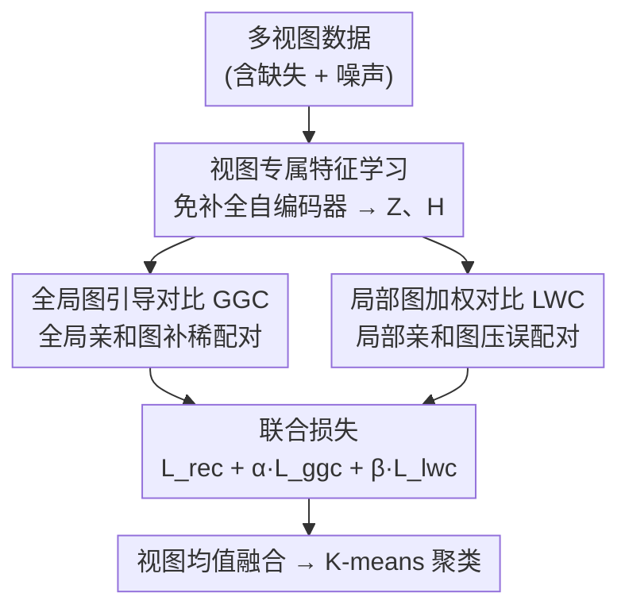

# Global-Graph Guided and Local-Graph Weighted Contrastive Learning for Unified Clustering on Incomplete and Noise Multi-View Data

**会议**: CVPR 2026  
**论文**: [CVF Open Access](https://openaccess.thecvf.com/content/CVPR2026/html/He_Global-Graph_Guided_and_Local-Graph_Weighted_Contrastive_Learning_for_Unified_Clustering_CVPR_2026_paper.html)  
**代码**: https://github.com/hhq-sr/GLGC  
**领域**: 多视图聚类 / 对比学习  
**关键词**: 多视图聚类, 对比学习, 不完整数据, 噪声鲁棒, 亲和图

## 一句话总结
GLGC 在不依赖数据补全的前提下，用一张**全局亲和图**为不完整多视图数据补出新的正负样本对（治"稀配对"），再用一张**局部亲和图**给每个跨视图样本对打自适应权重（治"误配对"），把两者塞进统一的对比学习框架，在不完整 + 噪声多视图聚类上全面超过 SOTA。

## 研究背景与动机

**领域现状**：多视图聚类（MVC）想从同一样本的多个视图里挖互补信息，得到聚类友好的表示。近年主流是**基于对比学习的 MVC**——把同一样本的不同视图当正对、不同样本的视图当负对，最大化视图间互信息，天然契合 MVC 目标。

**现有痛点**：真实多视图数据常常**既不完整又含噪声**。对比学习在这两种污染下会崩：
- 大量样本因缺视图而无法成对，对比学习只能在"完整的那部分"里挑正对，可用正对急剧变少；
- 噪声视图和正常视图配成对，喂给对比损失的是错误监督，把模型往错方向拉。

**核心矛盾**：现有路线要么先**补全缺失数据**再做完整 MVC（COMPLETER、DCG 等），但补出来的数据不可靠、反而注入额外噪声；要么用**视图粒度（view-grained）加权**压制噪声视图，但粒度太粗，分辨不出"哪几个具体样本对是误配的"。两条路都没正面解决"配对本身"的问题。

**本文目标**：在**不做任何数据补全**（imputation-free）的前提下，同时解决两个被前人忽视的问题——作者命名为：
- **稀配对问题（rare-paired）**：不完整数据里其实还藏着没被利用的语义关联，但缺视图导致它们配不上对；
- **误配对问题（mis-paired）**：噪声视图与正常视图配成的样本对是错误监督。

**切入角度**：作者借图学习的思路，认为"配对"这件事不该只看是否物理成对，而该看**特征空间里的语义亲和度**。于是用图来重新定义"谁该和谁配"以及"这一对该信几分"。

**核心 idea**：用一张**全局图**给稀配对补正负对、用一张**局部图**给每个对算可信权重——全局图治"配不上"，局部图治"配错了"，二者合成一个统一的 global-local 图引导对比学习框架。

## 方法详解

### 整体框架
GLGC（Global-Local Graph based Contrastive learning）分两个阶段。**阶段一·视图专属特征学习**：每个视图各训练一个自编码器，用重构损失抽取视图专属隐表示 $\{Z^v\}_{v=1}^V$，全程**不补全缺失数据**；隐表示之上再叠一个 MLP 对比头得到对比特征 $H^v=\mathrm{MLP}(Z^v)$。**阶段二·全局-局部图引导对比学习**：在所有视图的对比特征上，(a) 用**全局图引导对比（GGC）**构造跨全部视图的新正负对以补稀配对，(b) 用**局部图加权对比（LWC）**给每个跨视图对算自适应权重以压误配对。训练时三项损失（重构 + GGC + LWC）联合优化；测试时对每个样本的可用视图特征取均值，再用 K-means 出聚类结果。

### 关键设计

**1. 免补全的视图专属特征学习：不冒险补数据，先把每个视图的表示学干净**

针对"补全路线注入额外噪声"这一痛点，GLGC 干脆放弃补全。每个视图 $v$ 配一对编码器/解码器 $f^v_{\theta_v}/g^v_{\phi_v}$，只在**该视图实际可用的样本**上做重构，损失为 $\mathcal{L}_{rec}=\sum_{v=1}^V\sum_{i=1}^{N_v}\big\|x_i^v-g^v_{\phi_v}(f^v_{\theta_v}(x_i^v))\big\|_2^2$，其中 $N_v$ 是第 $v$ 视图的可用样本数。隐表示 $Z^v=f^v_{\theta_v}(X^v)$ 上再接对比头得到 $H^v=\mathrm{MLP}(Z^v)$。这一步看似常规，但"免补全"是后续两个模块成立的前提——它把"缺失"从需要被填的窟窿，转化为后面用图去重新建立关联的对象，避免了"先补出假数据再在假数据上对比"的错误叠加。

**2. 全局图引导对比学习（GGC）：用一张全局亲和图给配不上对的样本补正负对**

针对**稀配对**痛点：传统对比损失（下式 Eq.2）只把物理成对的 $\{h_i^v,h_i^u\}$ 当正对，缺视图样本直接被排除在外，可用正对太少。

$$\mathcal{L}^{v,u}_{con}=-\sum_{P_{ii}\in\mathcal{P}}\Big[\log\frac{e^{P_{ii}/\tau}}{\sum_{P_{ij}\in\mathcal{N}}e^{P_{ij}/\tau}}\Big]$$

GGC 的做法是：把**所有视图的所有可用样本**的对比特征汇到一起，构造一张全局亲和图 $G\in\mathbb{R}^{N_c\times N_c}$（$N_c$ 为可用样本总数），边权用余弦相似度 $G_{ij}=\frac{\langle h_i,h_j\rangle}{\|h_i\|\cdot\|h_j\|}$。然后**按相似度自适应选对**：对每个节点 $h_i$，取它所在行中相似度排前 $pos\%$ 的节点组成正对、排后 $neg\%$ 的组成负对，

$$\begin{cases}\{h_i,h_j\}\in\mathcal{P}_{ggc}, & \text{if } G_{ij}>\text{top-}pos\%\text{ of row }i\\ \{h_i,h_j\}\in\mathcal{N}_{ggc}, & \text{if } G_{ij}<\text{bottom-}neg\%\text{ of row }i\end{cases}$$

再在这套新对上算 GGC 损失 $\mathcal{L}_{ggc}=-\sum_{P_{ii}\in\mathcal{P}_{ggc}}\big[\log\frac{e^{P_{ii}/\tau}}{\sum_{P_{ij}\in\mathcal{N}_{ggc}}e^{P_{ij}/\tau}}\big]$。关键在于：正对不再要求"物理成对"，而是"特征空间里语义最近"，于是缺视图样本只要和别的样本语义相近就能被配上正对——这等于跨越直接配对，挖出了藏在全部视图里的间接语义关联，把稀配对的正对集合补厚。

**3. 局部图加权对比学习（LWC）：用局部亲和图给每个对打可信权重，自适应强化/削弱**

针对**误配对**痛点：噪声视图与正常视图配成的对是错误监督，而 Eq.2 对所有对一视同仁。LWC 不删对，而是给每个对算一个**自适应权重**来决定"信几分"。在每个 mini-batch（$n\le N$）内，基于两视图特征 $\{H^u,H^v\}$ 构局部亲和图 $W^{(u,v)}_{ij}=\exp\!\big(-\frac{\|h_i^u-h_j^v\|^2}{\sigma}\big)$（$\sigma$ 控制距离尺度），它刻画两视图间的几何亲和。为捕捉间接语义关联，再做一次高阶传播得到 $\hat{W}^{(u,v)}=W^{(u,v)}(W^{(v,v)})^{T}$，让相似度经中间节点传递、丰富局部结构上下文。最后把这个权重塞进对比损失的正对分子上：

$$\mathcal{L}^{u,v}_{lwc}=-\sum_{P_{ii}\in\mathcal{P}_{lwc}}\Big[\log\frac{\hat{W}^{(u,v)}_{ii}\,e^{P_{ii}/\tau}}{\sum_{P_{ij}\in\mathcal{N}_{lwc}}e^{P_{ij}/\tau}}\Big]$$

对全部视图对求和即 $\mathcal{L}_{lwc}=\sum_{u=1}^{V}\sum_{v=u+1}^{V}\mathcal{L}^{(u,v)}_{lwc}$。直观看：$\hat{W}^{(u,v)}_{ii}$ 大说明这个跨视图对在局部邻域里语义一致、可信，正对项被放大（强化吸引）；反之噪声造成的不可靠对权重小，吸引被削弱。比起只能区分"哪个视图整体差"的视图粒度加权，LWC 做到了**样本对粒度**的细分辨，正面压住误配对带来的反向优化。

### 损失函数 / 训练策略
总损失把三项联合：$\mathcal{L}_{GLGC}=\mathcal{L}_{rec}+\alpha\mathcal{L}_{ggc}+\beta\mathcal{L}_{lwc}$，$\alpha,\beta$ 为权衡系数。训练先用 $\mathcal{L}_{rec}$ 预训练得到 $\{Z^v\}$，再迭代：随机取 mini-batch → 推理出 $\{\hat{X}^v,H^v\}$ → 算全局图 $G$ 与 $\mathcal{P}_{ggc}/\mathcal{N}_{ggc}$、高阶局部图 $\hat{W}^{(u,v)}$ 与 $\mathcal{P}_{lwc}/\mathcal{N}_{lwc}$ → 联合损失反传更新。测试时对每个样本按可用视图取均值 $\hat{h}_i=\frac{1}{\sum_v M_{iv}}\sum_v h_i^v$（$M_{iv}=1$ 表示该视图可用），再 K-means。复杂度方面，每 batch 跨视图对算相似度与高阶图为 $O(V^2|B|^2)$，整体训练复杂度约 $O(N)+(EN/|B|)\,O(V^2|B|^2)$，关于样本数 $N$ 线性。实现上编码器结构为 $X^v\to500\to500\to2000\to Z^v$，$\dim Z^v=512$、$\dim H^v=128$，batch=256，$\tau=0.5$，Adam 优化。

## 实验关键数据

四个数据集：DHA（483 样本/2 视图/23 类）、LandUse-21（2100/2/21）、ProteinFold（694/12/27）、ALOI（10800/4/100）。三种设置：**不完整**（随机删视图，保证每样本至少留 1 视图）、**噪声**（加均值 0、标准差 0.4 的高斯噪声）、**不完整 + 噪声**。指标 ACC / NMI，对比 DSIMVC、CPSPAN、RPCIC、SCSL、DCG、GHICMC、FreeCSL，报 5 次均值。

### 主实验

不完整设置下 ACC（节选，缺失率 0.5 / 0.7 / 1.0；GLGC vs 次优 FreeCSL）：

| 数据集 | 缺失率 | FreeCSL | GLGC | 提升 |
|--------|--------|---------|------|------|
| DHA | 0.5 | 67.2 | **75.5** | +8.3 |
| DHA | 1.0 | 32.0 | **39.4** | +7.4 |
| ProteinFold | 0.7 | 20.8 | **28.7** | +7.9 |
| ALOI | 0.7 | 75.5 | **85.4** | +9.9 |
| ALOI | 1.0 | 48.1 | **82.8** | +34.7 |

作者报告：ALOI 上 GLGC 比 FreeCSL 平均 ACC 高 11.7%；缺失率达 1.0（极端不完整）时仍高出 34.7%——印证 GGC 靠全局语义关联补稀配对，在重度缺失下尤其救命。噪声设置下，ProteinFold 噪声率从 0.1 升到 1.0，次优方法 ACC 掉 9.1%，而 GLGC 只掉 2.3%，体现 LWC 的抗噪。不完整 + 噪声双重扰动下，DHA 在缺失率与噪声率都为 0.5 时，GLGC 比次优高 7.6% ACC。

### 消融实验

损失组件消融（ACC，节选 I = 不完整 / N = 噪声 / I+N，LandUse-21 与 ProteinFold）：

| 设置 | 配置 | LandUse-21 | ProteinFold | 说明 |
|------|------|-----------|-------------|------|
| I | 仅 $\mathcal{L}_{rec}$ | 15.1 | 17.0 | 只重构 |
| I | + $\mathcal{L}_{ggc}$ | 23.3 | 17.1 | LandUse +8.2 |
| I | 全 | **26.9** | **30.6** | 三项齐全 |
| N | 仅 $\mathcal{L}_{rec}$ | 22.0 | 17.4 | 只重构 |
| N | + $\mathcal{L}_{lwc}$ | 25.6 | 19.7 | ProteinFold +4.9（论文口径） |
| N | 全 | **27.4** | **31.5** | 三项齐全 |

### 关键发现
- **GGC 主治不完整、LWC 主治噪声**，分工清晰：不完整设置下加 $\mathcal{L}_{ggc}$ 让 LandUse-21 的 ACC +8.2%；噪声设置下加 $\mathcal{L}_{lwc}$ 让 ProteinFold +4.9%（论文文字口径）。
- **加权机制（带高阶局部图 $\hat W$）有效**：去掉/加上权重 $W$ 的对比中，DHA 不完整设置 ACC 从 64.2% 升到 75.5%，ProteinFold 噪声设置从 26.8% 升到 31.5%，说明对样本对粒度的自适应加权确实压住了不可靠对应。
- 越极端越能拉开差距：缺失率 1.0 时 ALOI 领先 34.7%，说明全局图补对的收益随稀配对加剧而放大。

## 亮点与洞察
- **把"缺失/噪声"从数据问题重定义成"配对问题"**：不去补数据，而是用图重新决定"谁配谁、信几分"，绕开了补全路线"假数据→假监督"的恶性叠加，这个视角切换很干净。
- **全局图 vs 局部图分工互补**：全局图（全样本）负责"补正负对治稀配对"，局部图（batch 内、带高阶传播）负责"算可信权重治误配对"，一个加对、一个调权，刚好对上不完整与噪声两类污染。
- **可迁移 trick**：把局部亲和度 $\hat W_{ii}$ 直接乘到 InfoNCE 正对分子上做软加权，是个轻量、即插即用的"对级置信度"做法，可迁到任意有噪声对应（noisy correspondence）的跨模态对比学习里。

## 局限与展望
- **跨视图对的二次复杂度**：每 batch 算所有视图对的亲和与高阶图是 $O(V^2|B|^2)$，视图数 $V$ 大（如 ProteinFold 的 12 视图）时开销可观；虽对 $N$ 线性，但 $V$ 维度上偏重。
- **多个超参需调**：$pos\%/neg\%$ 阈值、$\sigma$、$\alpha/\beta$ 都要设，论文未充分给出跨数据集的敏感性曲线，实际迁移时调参成本待评。⚠️ 高阶局部图 $\hat W^{(u,v)}=W^{(u,v)}(W^{(v,v)})^{T}$ 中 $W^{(v,v)}$ 为视图 $v$ 自身的亲和图，具体传播语义以原文为准。
- **噪声类型受限**：实验的"噪声"是特征加高斯扰动（对应关系仍保留），不同于会引入假正对的 noisy correspondence；对后者的鲁棒性未直接验证。
- 数据集规模偏小（最大 ALOI 1.08 万样本），更大规模下全局图的可扩展性待考。

## 相关工作与启发
- **vs 补全式不完整 MVC（COMPLETER / DCG / CPSPAN）**：它们先恢复缺失视图再聚类，本文 imputation-free，用全局图直接补对，避开补全引入的额外噪声。
- **vs 视图粒度加权抗噪（Wang et al. / Xu et al.）**：它们给整个视图赋权、粒度粗，本文 LWC 做到样本对粒度的自适应加权，能分辨具体哪几个对是误配的。
- **vs FreeCSL 等对比式不完整 MVC**：前人对比学习仍只在物理成对样本上做，忽视稀配对与误配对，本文正面把这两个问题作为优化对象。

## 评分
- 新颖性: ⭐⭐⭐⭐ 把不完整/噪声重铸为稀配对/误配对，并用全局图补对 + 局部图加权统一解决，视角清晰
- 实验充分度: ⭐⭐⭐⭐ 四数据集 × 三设置 × 多比例的系统对比，消融到位；但数据集规模偏小、超参敏感性展示不足
- 写作质量: ⭐⭐⭐⭐ 问题命名（rare/mis-paired）和框架图清楚，公式完整
- 价值: ⭐⭐⭐⭐ imputation-free + 对级软加权可迁到更广的噪声对应对比学习

<!-- RELATED:START -->

## 相关论文

- [\[CVPR 2026\] Semantic-Guided Global-Local Collaborative Prompt Learning for Few-Shot Class Incremental Learning](semantic-guided_global-local_collaborative_prompt_learning_for_few-shot_class_in.md)
- [\[CVPR 2026\] UniGeoCLIP: Unified Geospatial Contrastive Learning](unigeoclip_geospatial_contrastive.md)
- [\[ICML 2026\] Learning Graph Foundation Models on Riemannian Graph-of-Graphs](../../ICML2026/self_supervised/learning_graph_foundation_models_on_riemannian_graph-of-graphs.md)
- [\[ICML 2026\] Data Augmentation of Contrastive Learning is Estimating Positive-incentive Noise](../../ICML2026/self_supervised/data_augmentation_of_contrastive_learning_is_estimating_positive-incentive_noise.md)
- [\[CVPR 2026\] Dual-Estimator: Decoupling Global and Local Semantic Shift for Drift Compensation in Class-Incremental Learning](dual-estimator_decoupling_global_and_local_semantic_shift_for_drift_compensation.md)

<!-- RELATED:END -->
