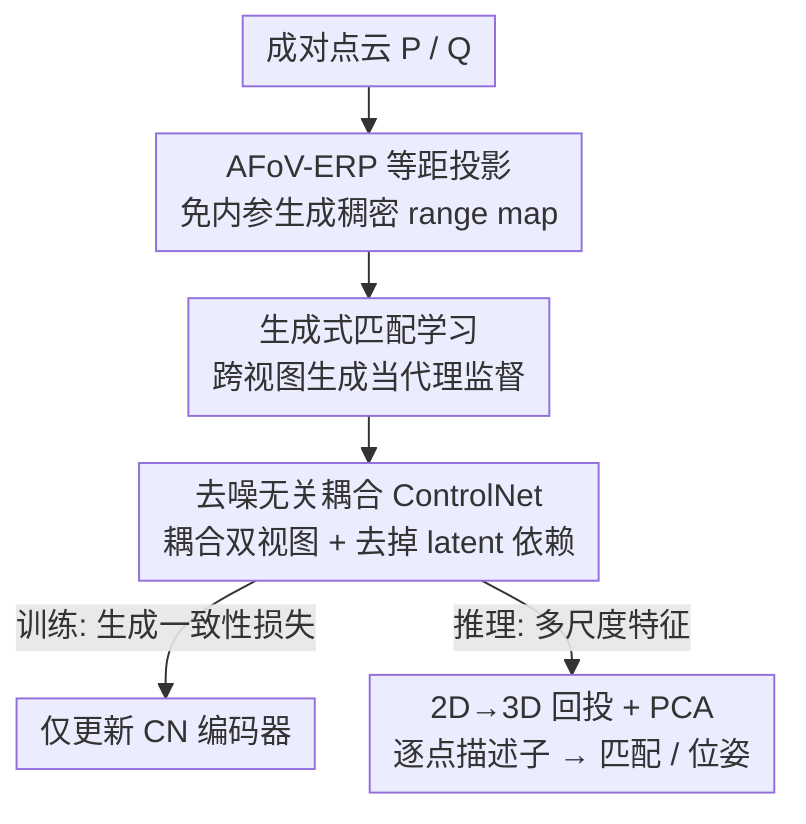

# GM-R²: Generative Matching Learning for Unsupervised Geometric Representation and Registration

**会议**: CVPR 2026  
**论文**: [CVF Open Access](https://openaccess.thecvf.com/content/CVPR2026/html/Jiang_GM-R2_Generative_Matching_Learning_for_Unsupervised_Geometric_Representation_and_Registration_CVPR_2026_paper.html)  
**代码**: 无  
**领域**: 3D视觉 / 自监督表示学习  
**关键词**: 点云配准, 无监督几何描述子, 生成式监督, ControlNet, 跨视图生成  

## 一句话总结
把"学几何描述子"重新表述成"用几何条件生成跨视图图像"这个代理任务——只有当两片点云的几何特征是对应一致的，被它们条件化的生成器才能合成出一致的跨视图图像；GM-R² 用这个生成一致性当隐式监督训练 ControlNet 编码器，在 3DMatch / ScanNet 上做到无监督配准 SOTA，甚至超过部分全监督方法。

## 研究背景与动机
**领域现状**：点云配准的核心是学一组判别性强的逐点几何描述子，靠它在两片点云间找对应。当前主流是深度描述子（FCGF、Predator、GeoTrans、PARE-Net 等），它们绝大多数依赖**真值刚性变换标注**来构造可靠对应、再用对比损失训练。

**现有痛点**：真值变换标注在大规模场景里采集既难又贵，严重拉高训练成本、限制 scale up。已有的无监督路线大致三类——合成伪对应/伪变换标签、引入对齐损失（如 Chamfer distance）当间接监督、用点/特征级重建损失学表示——但它们在**部分重叠、重复结构、复杂真实场景**下容易失效，且常陷入局部最优。

**核心矛盾**：要么花钱买精确监督信号（全监督），要么用弱/间接信号但在难场景里不够鲁棒（现有无监督）。问题根子在于：缺一个**既不需要标注、又足够强**的监督信号来约束"特征跨视图一致"。

**切入角度**：作者借鉴生成式 AI 的成功，观察到一个事实——**只有"对应一致"的几何条件，才能驱动生成器合成出跨视图一致的图像**。于是反过来用"能不能生成一致图像"来反推"特征是不是对应一致"，把生成质量当作免标注的代理监督。

**核心 idea**：用 **geometry-conditioned 跨视图图像生成**这个代理任务取代真值位姿标注，迫使 ControlNet 编码器学出对应一致的几何特征；训练完直接拿这个编码器抽逐点描述子做匹配。

## 方法详解

### 整体框架
GM-R²（Generative Matching Learning for Robust Registration）把无监督描述子学习建模成一个最大似然问题：给定同一场景不同视角拍到的成对点云 $(P, Q)$ 及其 RGB 图像 $(I_P, I_Q)$，优化逐点几何特征提取器 $g_\theta$，使得几何条件生成器 $p(\cdot)$ 能从几何特征里复原出一致的跨视图图像：

$$\max_\theta\ \mathbb{E}_{(I_P, I_Q, P, Q)\sim \mathcal{D}}\big[\log p\big(I_P, I_Q \mid g_\theta(P), g_\theta(Q)\big)\big]$$

关键洞察是：**range map 条件的 ControlNet 天然就能当这个生成器**——把 ControlNet 编码器 $\mathrm{CN}_{enc}$ 复用成几何特征提取器 $g_\theta$，让冻结的 Stable Diffusion 在它提供的几何条件下生成跨视图图像。但直接用 ControlNet 撞上三个工程现实：(i) 点云投 range map 需要精确相机内参，实际常拿不到；(ii) 原版 ControlNet 是单视图生成，不支持 GM-R² 要的跨视图成对合成；(iii) ControlNet 编码器依赖去噪过程、需要噪声 latent 输入，而推理阶段只有几何、没有 latent。下面三个关键设计正是逐一拆掉这三道坎。

整条 pipeline 分训练 / 推理两个相位：训练时点云经 AFoV-ERP 投成 range map → 喂入 Denoising-Agnostic Coupled ControlNet 条件化 SD 生成跨视图图像 → 用生成一致性损失反传，只更新 ControlNet 编码器；推理时丢掉去噪分支，只跑编码器抽多尺度特征 → 回投到 3D → 拼成描述子做匹配和位姿估计。

### 关键设计

**1. 生成式匹配学习：用"能否生成一致图像"反推"特征是否对应一致"**

这一设计直击"无监督缺强监督信号"的核心矛盾。传统对比学习需要真值对应来告诉模型哪些点该相似，GM-R² 换了个思路：把跨视图图像生成当代理任务，让一个几何条件生成器去合成图像，**生成质量本身就是监督**。其合理性建立在一个事实上——若两片点云的几何特征不是对应一致的，生成器拿到的条件就是"打架"的，合不出跨视图一致的图像；反之，要让生成器吐出一致图像，就必须逼 $g_\theta$ 抽出对应一致的特征。实例化时，作者把 ControlNet 编码器 $\mathrm{CN}_{enc}$ 直接当 $g_\theta$，输入 range map 条件，让它把 3D 结构注入冻结的 SD 主干（公式 $y_t = \mathrm{SD}_{enc}(x_t) + Z(\mathrm{CN}_{enc}(x_t + Z(c)))$）。这样监督信号绕开了真值位姿，完全来自"同场景的成对视图应该生成一致"这个免费约束。和最相关的 GenerativePCR 相比，后者推理时要反复条件去噪、很慢，而 GM-R² 推理只需编码器单次前向。

**2. AFoV-ERP 等距投影：免内参、且把窄视场点云"放大铺满"换取高分辨率 range map**

针对挑战 (i)——投 range map 依赖内参。普通透视投影离不开相机内参，作者改用等距投影（ERP）：对每个点 $p_i=(x_i,y_i,z_i)$ 算其球面方位角和俯仰角 $\theta_i=\mathrm{arctan2}(x_i,z_i),\ \phi_i=\arcsin(y_i/\|p_i\|_2)$，再线性映射到 $H\times W$ 网格、每个像素存欧氏距离 $r_i=\|p_i\|_2$，整个过程不需要内参。但原版 ERP 假设 $360^\circ\times180^\circ$ 全视场，而真实传感器只覆盖一小块角度区域，直接离散化会让 range map 大片空白、有效点挤在窄角域里浪费分辨率。AFoV-ERP 的改法是**自适应缩放**：先求出包住所有有效点的角度边界 $(\theta_{min},\theta_{max}),(\phi_{min},\phi_{max})$ 和跨度 $\Delta\theta,\Delta\phi$，再把坐标在这个边界内归一化重离散：

$$\tilde u_i = \Big\lfloor \frac{\theta_i-\theta_{min}}{\Delta\theta}W \Big\rfloor,\quad \tilde v_i = \Big\lfloor \frac{\phi_i-\phi_{min}}{\Delta\phi}H \Big\rfloor$$

相当于把实际占据的视场"拉大铺满"整张 ERP 分辨率，最大化像素利用率、保住几何保真度，产出稠密高分辨率 range map 当几何条件。消融里它把 Chamfer@1 从 ERP 的 66.5 拉到 86.2，是关键涨点来源。

**3. 去噪无关耦合 ControlNet：把单视图改成跨视图、再切掉对噪声 latent 的依赖以对齐推理**

这一设计同时解决挑战 (ii)(iii)。**耦合（Coupled）**部分：为了不改 ControlNet 架构（改了会毁掉预训练生成先验），把源/目标 range map 沿竖直方向拼成统一输入 $\tilde d_{PQ}=[\tilde D_P;\tilde D_Q]\in\mathbb{R}^{2H\times W}$，对应的 latent 也耦合成 $\tilde x_t^{PQ}=[\tilde x_t^P;\tilde x_t^Q]$，这样单图输入自然扩成跨视图输入、隐式逼出"对应感知"的条件特征。**去噪无关（Denoising-Agnostic）**部分针对一个训练-推理鸿沟：原版 ControlNet 编码器同时吃噪声 latent $\tilde x_t^{PQ}$ 和几何条件 $\tilde d_{PQ}$，但 3D 匹配推理时根本没有 latent、只有 range map。作者干脆把 latent 从编码器输入里摘掉，让生成只条件于耦合几何：

$$\tilde y_t^* = \mathrm{SD}_{enc}(\tilde x_t^{PQ}) + \mathrm{CN}^*(\tilde d_{PQ}) = \mathrm{SD}_{enc}(\tilde x_t^{PQ}) + Z\big(\mathrm{CN}_{enc}(Z(\tilde d_{PQ}))\big)$$

这带来两个好处：其一，监督信号被锚定到 3D 结构一致性上，生成从"像素级目标"变成"几何感知的监督机制"，天然学出判别性对应特征；其二，编码器在训练和推理走**完全相同的通路**（都只看几何、不看 latent），彻底消除训练-推理不一致，正好匹配 3D 匹配的"纯几何推理"要求。

### 损失函数 / 训练策略
训练把最大似然目标改写成标准 latent diffusion 去噪损失，**只优化 ControlNet 编码器 $\theta$，冻结去噪器 $\omega$**：

$$\mathcal{L}=\mathbb{E}\Big[\big\|\epsilon_\omega(\tilde x_t^{PQ}, t, \mathrm{CN}_{enc}(\tilde d_{PQ};\theta)) - \epsilon\big\|_2^2\Big]$$

其中 $\tilde x_t^{PQ}$ 是耦合真值图像 $\tilde I_{PQ}=[\tilde I_P;\tilde I_Q]$ 的 $t$ 步噪声 latent，$\epsilon\sim\mathcal{N}(0,I)$。因为生成图像在球面域、而数据集真值图是透视图，作者还加了 **Image Spherical Mapping** 把透视真值图反投到球面（按公式 $d(\theta,\phi)=[\sin\theta\cos\phi,\sin\phi,\cos\theta\cos\phi]$ 算相机射线再用内参投回透视平面做双线性逆采样），保证像素级对齐。训练数据是从 ScanNet 随机采的 48,000 对点云+RGB（无任何变换标注），range map 分辨率 $512\times1024$，AdamW，学习率 $1\times10^{-5}$，训 15 epoch，单张 L20。推理时编码器产出 $L=13$ 层特征图，选第 (2,5,8) 三个尺度上采到 ERP 分辨率、把每个 2D 像素特征回投到对应 3D 点，再拼上传统 FPFH 描述子、过 PCA 蒸馏成紧凑描述子，最后用空间兼容性驱动的鲁棒位姿估计器求变换。

## 实验关键数据

### 主实验
两个室内 RGB-D 数据集，关键设定是**故意拉大采样间隔造低重叠难场景**（3DMatch 隔 40 帧、ScanNet 隔 50 帧，远比常用的 20 帧更难）。△ = 无监督，♢ = 全监督。

3DMatch 主要指标（节选，Acc↑ / Err↓）：

| 方法 | 监督 | Rot Acc@5↑ | Rot Mean Err↓ | Trans Mean Err↓ | Chamfer Mean↓ |
|------|------|-----------|---------------|------------------|----------------|
| FPFH | 传统 | 69.1 | 15.0 | 37.4 | 57.6 |
| PPFFoldNet | 无监督 | 40.3 | 49.5 | 129.9 | 96.0 |
| FCGF | 全监督 | 90.4 | 9.4 | 19.2 | 40.3 |
| Generative-FCGF | 全监督 | 94.3 | 4.5 | 12.5 | 37.7 |
| PARE-Net | 全监督 | 93.0 | 6.6 | 15.8 | 12.8 |
| **GM-R² (Ours)** | **无监督** | **96.2** | **2.0** | **6.4** | **4.2** |

相比最强 baseline PARE-Net，平均旋转误差降 2.5、平均平移误差降 8.6，几乎所有指标都最好——而且它是无监督。ScanNet 上 GM-R² 同样达到与全监督 SOTA 相当甚至更优的精度（Rot Acc@45 95.8 居首，Rot Mean Err 7.3 最低）。

### 消融实验
3DMatch 上的消融（默认配置标 *）：

| 配置 | Rot Mean Err↓ | Trans Mean Err↓ | Chamfer@1↑ | 说明 |
|------|---------------|------------------|------------|------|
| ERP | 3.4 | 10.9 | 66.5 | 普通全视场 ERP |
| **AFoV-ERP\*** | **2.0** | **6.4** | **86.2** | 自适应缩放投影 |
| Map Scale (256,512) | 2.0 | 6.5 | 84.0 | 低分辨率 |
| Map Scale (384,768) | 2.0 | 6.4 | 84.3 | 中分辨率 |
| Map Scale (512,1024)\* | 2.0 | 6.4 | 86.2 | 默认高分辨率 |

### 关键发现
- **AFoV-ERP 是涨点主力**：换回普通 ERP 后 Chamfer@1 从 86.2 暴跌到 66.5、平移误差从 6.4 升到 10.9，说明"把窄视场放大铺满 + 免内参"对几何条件质量至关重要。
- **range map 分辨率敏感性低**：从 (256,512) 到 (512,1024) 各指标只是小幅波动，高分辨率主要在 Chamfer@1 上有约 2 点提升（84.0→86.2），作者据此选大分辨率当默认。
- **无监督反超全监督**：在低重叠高外点比的难场景里 GM-R² 全面领先，说明大规模生成基础模型（ControlNet/SD）里编码的几何先验 + 生成一致性监督，确实比真值位姿监督更鲁棒。

## 亮点与洞察
- **"生成质量即监督"是个可迁移的范式**：用"只有正确的条件才能生成一致输出"把判别任务转成生成代理任务，免掉昂贵标注。这套思路（生成一致性当隐式监督）有望迁移到其他需要对应/对齐但标注贵的任务，如跨模态配准、光流自监督。
- **Denoising-Agnostic 这一刀切得漂亮**：识别出"训练有 latent、推理没 latent"这个常被忽略的训练-推理鸿沟，直接把 latent 从编码器输入摘掉，让编码器两相位走同一通路——既对齐了推理、又把监督锚定到几何而非像素，一举两得。
- **复用基础模型而非从零训**：冻结 SD 去噪器、只调 ControlNet 编码器，等于白嫖了 SD 里的强视觉/几何先验，这也是它能无监督反超全监督的底气。

## 局限与展望
- ⚠️ 训练只在 ScanNet 上做、评测限 3DMatch/ScanNet 两个**室内 RGB-D** 数据集，对室外 LiDAR、无 RGB 配对的纯几何场景是否成立未验证——而方法**强依赖成对 RGB 图像**当生成目标，没有 RGB 的场景直接不适用。
- ⚠️ Image Spherical Mapping 这一步把透视真值图反投球面时**仍用到相机内参**，与正文反复强调的"免内参"卖点存在张力（免内参只体现在点云→range map 投影侧，监督端的图像对齐仍需内参，以原文为准）。
- 推理要跑 SD/ControlNet 编码器 + 多尺度回投 + PCA + 拼 FPFH，流程偏重；虽然比 GenerativePCR 的反复去噪快，但相比纯几何描述子（FCGF 等）的开销代价仍值得评估。
- 改进方向：探索无 RGB 监督的变体（如用几何自洽性替代图像一致性）、扩到室外大场景、把多尺度特征选择 (2,5,8) 做成可学习的。

## 相关工作与启发
- **vs GenerativePCR (Generative-FCGF/Predator/GeoTrans)**：都用 ControlNet 驱动 3D→2D 生成来增强匹配，但 GenerativePCR 是**全监督**、且推理要反复条件去噪很慢；GM-R² 是**无监督**、推理只需编码器单次前向，且通过 Denoising-Agnostic 设计让编码器纯几何条件化。
- **vs 全监督描述子 (FCGF / Predator / GeoTrans / PARE-Net)**：它们靠真值变换 + 对比损失，标注成本高、难 scale；GM-R² 用生成一致性当免标注监督，却在低重叠难场景反超它们。
- **vs 传统无监督路线（伪标签 / Chamfer 对齐损失 / 重建损失，如 FMR、RIENet、PPFFoldNet）**：这些在部分重叠、重复结构下易陷局部最优；GM-R² 借大规模生成基础模型的几何先验显著提升了难场景鲁棒性。

## 评分
- 新颖性: ⭐⭐⭐⭐⭐ 把描述子学习重述成几何条件跨视图生成、用生成一致性当隐式监督，范式层面的新意。
- 实验充分度: ⭐⭐⭐⭐ 两数据集 + 充分 baseline + 关键消融到位，但仅限室内 RGB-D、缺跨域/室外验证。
- 写作质量: ⭐⭐⭐⭐⭐ 三个挑战→三个设计一一对应，动机与公式都讲得清楚。
- 价值: ⭐⭐⭐⭐⭐ 无监督反超全监督，为免标注大规模 3D 匹配提供了有说服力的新路线。

<!-- RELATED:START -->

## 相关论文

- [\[CVPR 2026\] D2Dewarp: Dual Dimensions Geometric Representation Learning Based Document Image Dewarping](d2dewarp_dual_dimensions_geometric_representation_learning_based_document_image_.md)
- [\[CVPR 2026\] Residual Connections Harm Generative Representation Learning](residual_connections_harm_generative_representation_learning.md)
- [\[CVPR 2026\] OpenVision 2: A Family of Generative Pretrained Visual Encoders for Multimodal Learning](openvision_2_a_family_of_generative_pretrained_visual_encoders_for_multimodal_le.md)
- [\[CVPR 2026\] From Feature Learning to Spectral Basis Learning: A Unifying and Flexible Framework for Efficient and Robust Shape Matching](from_feature_learning_to_spectral_basis_learning_a_unifying_and_flexible_framewo.md)
- [\[ACL 2025\] Magnet: Augmenting Generative Decoders with Representation Learning and Infilling Capabilities](../../ACL2025/self_supervised/magnet_augmenting_generative_decoders_with_representation_learning_and_infilling.md)

<!-- RELATED:END -->
