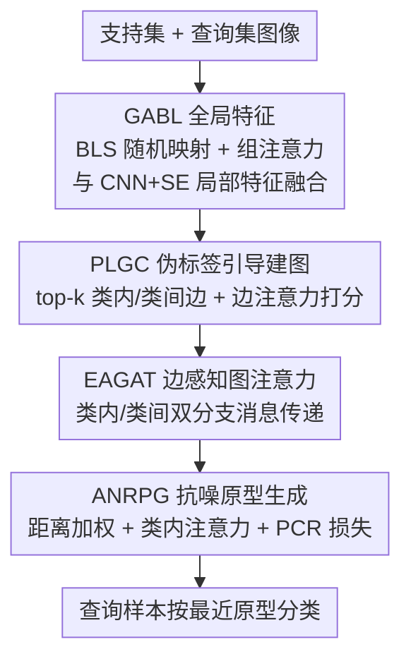

# Graph Attention Prototypical Network for Robust Few-Shot Classification

**会议**: CVPR 2026  
**论文**: [CVF Open Access](https://openaccess.thecvf.com/content/CVPR2026/html/Liu_Graph_Attention_Prototypical_Network_for_Robust_Few-Shot_Classification_CVPR_2026_paper.html)  
**代码**: 未开源（论文未提供代码链接）  
**领域**: 少样本学习 / 图神经网络  
**关键词**: 少样本分类, 标签噪声, 原型网络, 图注意力, 鲁棒学习

## 一句话总结
针对原型网络在支持集含错误标签时"原型漂移"导致精度骤降的问题，GAPNet 用"全局+局部双特征 → 伪标签引导建图 → 边感知图注意力 → 自适应抗噪原型生成"四步流水线显式建模类内/类间关系并动态压低噪声样本权重，在 4 个数据集 5-way 5-shot 任务上比 SOTA 高 3%~8%，且在 40% 标签噪声下衰减明显更慢。

## 研究背景与动机
**领域现状**：少样本学习（FSL）里基于度量的方法是强 baseline，其中原型网络（ProtoNet）的做法最直接——把每个类的支持样本特征取平均得到"类原型"，查询样本按到各原型的距离来分类。

**现有痛点**：这套做法对支持集里的**标签噪声极度敏感**。FSL 每类只有 K 个样本（如 5-shot 只有 5 个），只要混进一个被错标的样本，类原型就会被拉向错误类的特征中心——论文称之为"原型漂移"（prototype shift）。原型一漂，决策边界跟着扭曲，查询样本就被分错。噪声比例越高问题越严重：40% 噪声意味着每类 5 个里有 2 个标错。

**核心矛盾**：现有抗噪方法大多面向大规模数据集，靠样本多来"洗"掉噪声，在每类仅几样本的 FSL 场景失效；而基于图的 FSL 虽然能用样本间流形结构（比标签更可靠）来缓解，却普遍**用名义标签或固定 k-NN 规则建图**，结果是把噪声样本错连到它的名义类（错误边）、又把同名义类里距离很远的样本硬连（冗余边），反而把真实的类内/类间关系建坏了。

**本文目标**：在支持集有标签噪声的前提下，让模型既能从少量样本提取够用的判别特征，又能建出"只保留真正相似样本之间连接"的可靠关系图，还能在生成原型时主动把噪声样本的贡献压下去。

**切入角度**：作者的观察是——特征嵌入里"同类样本距离更小、噪声样本远离其名义类的干净样本"这一性质，比标签本身更可信。于是与其相信标签，不如相信特征相似度去建图、去加权。

**核心 idea**：用"伪标签引导的类感知图 + 边可靠性打分 + 距离自适应的原型加权"三件套，把噪声样本在关系建模和原型生成两个环节同时削弱，从根上阻止原型漂移。

## 方法详解

### 整体框架
GAPNet（Graph Attention Prototypical Network）整体是一条串行流水线，输入是一个 episode 的支持集 $S$ 与查询集 $Q$ 图像，输出是查询样本的类别预测。它由三大核心模块串起来：先做**特征提取**（CNN+SE 抽局部判别特征，GABL 抽全局特征，注意力融合），再做**动态类感知关系建模**（PLGC 伪标签引导建图 + EAGAT 边感知图注意力，分类内/类间两路），最后用 **ANRPG** 从图精炼后的特征生成抗噪原型，按查询样本到各原型的负欧氏距离 softmax 出类别。三个模块分别从"特征—关系—原型"三个层次抑制噪声，环环相扣。

### 关键设计

**1. GABL：用"广度学习 + 组注意力"补一路抗噪的全局特征**

在标签噪声下，单靠 ConvNet-4 抽的局部特征容易"特征稀疏"、判别力不够，噪声一来更不稳。GABL（Group Attention Broad Learning）的作用是再补一路全局特征。它基于广度学习系统（BLS）——一个结构扁平、参数少的网络：先把展平的局部特征 $\mathbf{F}_{\text{local}}$ 经随机初始化并固定的权重映射成 $p$ 组"特征映射节点" $\mathbf{Z}_i = \varphi_i(\mathbf{F}_{\text{local}}\mathbf{W}_f^i + \beta_f^i)$，再扩展成 $q$ 组"增强节点" $\mathbf{H}_j = \phi_j(\mathbf{Z}\mathbf{W}_e^j + \beta_e^j)$，拼接后投影出全局特征。作者在两处做了改动让它适配 FSL：一是把部分变换权重设为**可训练**、部分**固定**（固定比例由 $\gamma$ 控制），在"表达能力"与"过拟合风险"间取平衡（消融显示去掉 GABL 后干净场景反而跌 >10%，正是过拟合所致）；二是加了组级注意力 $\mathbf{a}_f^i = \mathcal{F}_{GA}(\mathbf{Z}_i)$，对每组节点动态放大有用、压制噪声，使全局特征写成 $\mathbf{F}_{\text{global}} = [\mathbf{a}_f^1\mathbf{Z}_1, \cdots, \mathbf{a}_e^q\mathbf{H}_q]\mathbf{W}_{\text{bls}}$。局部与全局特征最后用一个 softmax 注意力的融合模块按可靠性加权拼成 $\mathbf{F}_{\text{ff}}$。

**2. PLGC：用伪标签 + top-k + 边注意力建"只连真相似"的类内/类间图**

关系建模在标签噪声下的核心难点是"区分名义类关系与真实类关系"。PLGC（Pseudo-Label Guided Graph Constructor）不直接信标签。由于查询样本无标签，它先按到初始支持原型的距离给查询样本打**伪标签** $\hat{y}_q^i = \arg\max_c \mathcal{A}(\mathbf{f}_q^i, \mathbf{p}_c)$（相似度 $\mathcal{A}(x,y)=x^\top y$，$\mathbf{p}_c$ 为类 $c$ 支持特征均值），从而能做"类感知"的连边。为避免把噪声样本乱连，它**只对最相似的 top-k 个样本建边**（类内、类间各取 $\eta_{\text{intra}}=\eta_{\text{inter}}=5$），得到类内、类间邻接矩阵 $\mathbf{R}_{\text{intra}}$、$\mathbf{R}_{\text{inter}}$，从源头滤掉错误边与冗余边。再进一步，一个边注意力模块对每条边算可靠性：以边两端特征拼接 $\mathbf{E}_f^t = [\mathbf{F}_{\text{ff}}(I_{\text{src}}^t) \mid \mathbf{F}_{\text{ff}}(I_{\text{tgt}}^t)]$ 加上边类型嵌入（类内=0、类间=1），过两层 FC + sigmoid 得 $\alpha^t = \mathcal{F}_{EA}(\mathbf{E}_f^t, \mathbf{E}_t^t)$——$\alpha$ 高表示特征距离小、关系可靠，$\alpha$ 低则大概率是噪声边。

**3. EAGAT：把"边类型 + 可靠性"喂进图注意力，双分支分别传播**

普通 GAT 对所有边一视同仁，忽略了"类内边该强调一致性/平滑、类间边该强调判别性/边界"这一本质差异，在噪声场景尤其吃亏。EAGAT（Edge-Aware Graph Attention）把 PLGC 给出的边可靠性 $\alpha_t$ 和类内/类间邻接矩阵 $\mathbf{R}_t$ 注入标准 GAT，并用**两路并行分支**分别处理类内图和类间图，让可靠边主导消息传递、噪声边被忽略：$\mathbf{F}_{\text{gf}}^t = \text{ReLU}(\text{LN}(\text{GAT}(\mathbf{F}_{\text{ff}}, \mathbf{R}_t, \alpha_t) + \mathbf{F}_{\text{ff}}))$（残差 + LayerNorm 稳训练）。两分支输出再用与第 1 步同款的注意力融合模块动态加权，平衡"类内相似"与"类间不相似"两种信号。消融里去掉 PLGC+EAGAT 掉点最猛（CIFAR-FS 干净从 75.71→65.96），说明显式建可靠类内/类间关系是 GAPNet 抗噪的最关键一环。

**4. ANRPG：距离加权 + 类内注意力 + 对比正则，三招防原型漂移**

即便特征和关系都处理过，简单平均生成原型仍会被残留噪声带偏。ANRPG（Adaptive Noise-Robust Prototype Generator）三管齐下。其一**距离自适应加权**：先用类内均值算初始原型 $\mathbf{p}_c^{\text{init}}$，量每个样本到类心的欧氏距离 $d_i = \|\mathbf{f}_i - \mathbf{p}_c^{\text{init}}\|_2$，用指数函数 $\varpi_i = \exp(-\kappa d_i / d_{\max})$ 给近类心的样本更高权重（$\kappa$ 控制衰减速度，离群的噪声样本距离大、权重被压低）。其二**类内注意力聚合**：把每个样本特征按类内相似度对邻居加权重组 $\dot{\mathbf{f}}_i = \sum_{\mathbf{f}_j \in \mathcal{S}_c} \text{Softmax}(\mathcal{A}(\mathbf{f}_i, \mathbf{f}_j))\,\mathbf{f}_j$，让干净样本进一步主导原型，精炼后取均值得 $\mathbf{p}_c^*$。其三**原型对比正则（PCR）损失**：鼓励不同类原型互相可分

$$\mathcal{L}_{\text{PCR}} = -\frac{1}{C}\sum_{c=1}^C \log \frac{\exp(\mathcal{A}(\mathbf{p}_c^*, \mathbf{p}_c^*)/\tau)}{\sum_{k=1}^C \exp(\mathcal{A}(\mathbf{p}_c^*, \mathbf{p}_k^*)/\tau)}$$

（⚠️ 分子写成原型自相似 $\mathcal{A}(\mathbf{p}_c^*,\mathbf{p}_c^*)$，形式以原文为准；直觉是 InfoNCE 式地把同类原型当正、其他原型当负来拉开类间距离。）即便标签有噪声，这一项也能强化原型的语义区分度。

### 损失函数 / 训练策略
总损失为交叉熵加上原型对比正则：$\mathcal{L} = \mathcal{L}_{\text{CE}} + \lambda \mathcal{L}_{\text{PCR}}$，$\lambda=0.01$。优化器 AdamW（weight decay 0.02，初始学习率 $10^{-4}$），训 300 epoch、每 epoch 200 个随机 episode，统一在 5-way 5-shot、15 query 设置下、单张 RTX 3070 Ti 训练。关键超参：GABL 固定节点率 $\gamma=0.5$、输出维 $u=200$；PLGC 类内/类间近邻数均为 5；ANRPG 衰减因子 $\kappa=5$。论文还把标签噪声细分为三类：IE（同 episode 不同类的错标）、OOE（同数据集不同 episode）、OOD（来自外部数据集），分布漂移依次加重，分别在训练与评估阶段以 20%/40% 比例注入。

## 实验关键数据

### 主实验
4 个基准（CIFAR-FS、miniImageNet、tieredImageNet、CUB-200-2011）、5-way 5-shot、对比 8 个方法，每个精度由 10000 个随机 episode 平均。干净数据集结果（Acc.%）：

| 数据集 | ProtoNet | APPN（次优梯队） | BiFRN | GAPNet | 对次优提升 |
|--------|----------|------|-------|--------|------|
| CIFAR-FS | 68.62 | 71.21 | 70.56 | **75.71** | +4.5% |
| miniImageNet | 60.01 | 58.45 | 63.15 | **65.16** | +1.99% |
| tieredImageNet | 63.62 | 66.82 | 67.58 | **69.22** | +2.4% |
| CUB-200-2011 | 71.51 | 76.67 | 80.02 | **80.63** | +0.41% |

标签噪声下（5-way 5-shot，部分代表值 Acc.%）：

| 噪声设置 | ProtoNet | APPN | GAPNet |
|----------|----------|------|--------|
| CIFAR-FS · IE-40% | 44.76 | 50.49 | **58.04** |
| miniImageNet · IE-40% | 40.57 | 43.73 | **47.33** |
| CUB-200-2011 · IE-40% | 48.80 | 52.96 | **64.26** |
| CIFAR-FS · OOE-40% | 56.24 | 60.08 | **67.91** |
| CIFAR-FS · OOD-40% | 59.36 | 66.24 | **70.26** |

在 CIFAR-FS 40% IE 噪声下 GAPNet 比 ProtoNet 高 13.28 个百分点（58.04 vs 44.76）；用鲁棒性分数 $\zeta(R)=\text{Acc}(R)/\text{Acc}(0)$ 衡量，CIFAR-FS 20% IE 时 GAPNet 95.15% vs ProtoNet 91.90%、APPN 92.53%，CUB 40% IE 时 GAPNet 79.70% vs ProtoNet 68.24%、APPN 69.08%，衰减明显更慢。（⚠️ 原文正文一处把这 13.28% 提升记到 miniImageNet 名下，但按表 2 数值实为 CIFAR-FS，此处以表格为准。）

### 消融实验
CIFAR-FS 上去掉各模块（Acc.%，clean / IE-20%；映射依原文表 5 与描述对应，个别行归属为近似）：

| 配置 | clean | IE-20% | 说明 |
|------|-------|--------|------|
| Full model | 75.71 | 72.04 | 完整模型 |
| w/o SE | 74.26 | 72.04 | SE 仅辅助，波动轻微 |
| w/o GABL | 62.98 | 69.37 | 干净场景暴跌 >12%（过拟合）|
| w/o ANRPG | 75.57 | 70.92 | 噪声场景约掉 1% |
| w/o PLGC+EAGAT | 65.96 | 61.84 | 掉点最猛，关系建模最关键 |

### 关键发现
- **关系建模是抗噪主力**：去掉 PLGC+EAGAT 在所有数据集掉点最大，作者结论是"显式建可靠的类内/类间关系"是 GAPNet 的核心。
- **GABL 主要防过拟合**：去掉它噪声场景掉得不多，干净场景却跌 >10%，说明全局特征是在缓解 FSL 的特征稀疏与过拟合。
- **三类噪声破坏力 IE > OOE > OOD**：IE 噪声与目标共享域、上下文与特征分布，最容易误导决策边界；OOD 来自完全不同域、纹理差异大，几乎不影响原型，破坏最小；噪声比例升到 40% 时这种趋势进一步放大。
- **超参敏感性**：$\lambda$ 在 0.01 最优，>0.1 会因过度约束原型对比关系而骤降；固定节点率 $\gamma>0.5$ 后精度更明显下滑；类内/类间近邻数取 5 最优。

## 亮点与洞察
- **"不信标签、信特征相似度"贯穿全程**：从 PLGC 用 top-k 相似度建边、到 ANRPG 用到类心距离加权，整套设计的统一哲学是把标签当弱信号、把特征几何当强信号，这正切中 FSL 标签噪声的命门。
- **类内/类间边分两路处理**很巧妙：类内边求平滑一致、类间边求判别边界，本就该用不同的注意力对待，EAGAT 把这点显式化，比一刀切的标准 GAT 更契合任务结构。
- **把噪声压制拆到三个层次**（特征 GABL / 关系 PLGC+EAGAT / 原型 ANRPG）是可迁移的设计范式：任何"对脏样本敏感"的度量学习任务，都可以照此在多个环节冗余地削弱噪声，而非寄望单点解决。
- **细分三类标签噪声（IE/OOE/OOD）**并给出破坏力排序，为后续抗噪 FSL 提供了更细的评测协议。

## 局限与展望
- **骨干较弱**：固定用 ConvNet-4 以便公平对比，未验证在 ResNet 等更强骨干或大模型特征下，这套图+原型抗噪机制是否仍有同等增益。
- **模块偏重、超参偏多**：GABL、PLGC、EAGAT、ANRPG 串起来引入 $\gamma$、$\kappa$、$\eta$、$\lambda$、$\tau$ 等多个超参，论文也显示对 $\lambda$、$\gamma$ 较敏感，实际部署调参成本不低；论文未报告推理/训练开销。
- **仅验证 5-way 5-shot**：1-shot（无法做类内加权/类内注意力，因每类仅 1 样本）等更极端低样本设置未覆盖，PCR 损失的自相似分子写法也值得核实。
- **PCR 损失形式存疑**：分子 $\mathcal{A}(\mathbf{p}_c^*,\mathbf{p}_c^*)$ 为原型自相似，与常见对比损失的"正样本对"写法不同，建议对照原文公式确认（⚠️ 以原文为准）。

## 相关工作与启发
- **vs ProtoNet**: 同样用 CNN 骨干 + 均值原型，但 ProtoNet 简单平均极易被噪声带偏；GAPNet 在原型生成前加图精炼、生成时加距离加权与类内注意力，40% IE 噪声下在 CIFAR-FS 上高出 13.28 个点。
- **vs APPN**: APPN 也用伪标签 + 图上标签传播，但建图仍易受名义标签误导；GAPNet 用边注意力显式给边打可靠性分、分类内/类间双分支，各噪声设置下普遍高 3% 以上。
- **vs HGNN 等图式 FSL**: 它们多用固定 k-NN 或名义标签建图，会产生错误边/冗余边；GAPNet 的 PLGC 用 top-k 相似度 + 伪标签 + 边注意力，从源头滤噪。
- **vs TraNFS / RNNP（抗噪原型类）**: 它们靠中位数、相似度加权或混合特征改原型；GAPNet 不止改原型，还在关系图层面建模噪声，是"特征—关系—原型"三层联合抗噪。

## 评分
- 新颖性: ⭐⭐⭐⭐ 把伪标签引导建图、边可靠性打分与距离自适应原型加权三件套系统组合，专攻 FSL 标签噪声，组合创新清晰。
- 实验充分度: ⭐⭐⭐⭐ 4 数据集 × 3 类噪声 × 2 比例 + 消融 + 超参敏感性，覆盖全面；但仅 ConvNet-4 / 5-way 5-shot，缺更强骨干与 1-shot。
- 写作质量: ⭐⭐⭐⭐ 动机与模块职责讲得清楚；个别数值归属（13.28% 记错数据集）与 PCR 公式写法需读者核对。
- 价值: ⭐⭐⭐⭐ 抗噪 FSL 是实用刚需，三层抗噪范式可迁移，鲁棒性提升明显。

<!-- RELATED:START -->

## 相关论文

- [\[CVPR 2026\] From Few-way to Many-way: Rethinking Few-shot Fine-grained Image Classification](from_few-way_to_many-way_rethinking_few-shot_fine-grained_image_classification.md)
- [\[ICLR 2026\] Exploiting Low-Dimensional Manifold of Features for Few-Shot Whole Slide Image Classification](../../ICLR2026/self_supervised/exploiting_low-dimensional_manifold_of_features_for_few-shot_whole_slide_image_c.md)
- [\[CVPR 2026\] Semantic-Guided Global-Local Collaborative Prompt Learning for Few-Shot Class Incremental Learning](semantic-guided_global-local_collaborative_prompt_learning_for_few-shot_class_in.md)
- [\[CVPR 2026\] Quantized Residuals to Continuous Prompts for Few-Shot Class Incremental Learning in Vision-Language Models](quantized_residuals_to_continuous_prompts_for_few-shot_class_incremental_learning.md)
- [\[CVPR 2026\] Few-Shot Hybrid Incremental Learning: Continually Learning under Data Scarcity and Task Uncertainty](few-shot_hybrid_incremental_learningcontinually_learning_under_data_scarcity_and.md)

<!-- RELATED:END -->
