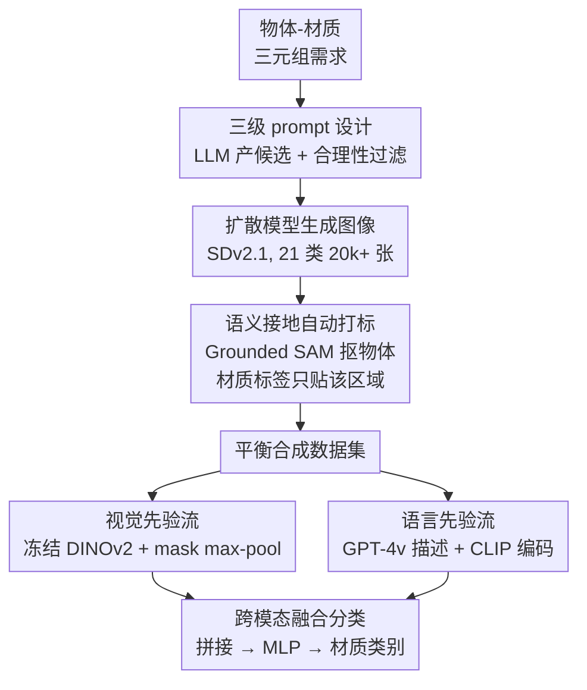

# Harnessing the Power of Foundation Models for Accurate Material Classification

**会议**: CVPR 2026  
**论文**: [CVF Open Access](https://openaccess.thecvf.com/content/CVPR2026/html/Lin_Harnessing_the_Power_of_Foundation_Models_for_Accurate_Material_Classification_CVPR_2026_paper.html)  
**代码**: 无  
**领域**: 自监督 / 表示学习  
**关键词**: 材质分类, 视觉基础模型, 合成数据, 双流融合, DINOv2

## 一句话总结
针对材质分类标注稀缺的问题，本文用「扩散模型生成 + 语义接地自动打标」造了一个 21 类平衡合成数据集，再用「冻结的 DINOv2 视觉流 + GPT-4v/CLIP 语言流」双流融合做分类，在 FMD 上达到 89% 准确率，比专用 SOTA（MatSim）高出 33%。

## 研究背景与动机
**领域现状**：材质分类（判断一个表面是金属、木头、塑料还是陶瓷）是渲染、仿真、3D 内容生成等下游任务的基础环节——比如先识别材质，再去材质库里检索对应的程序化材质参数。传统做法把它当成一个普通图像分类任务，在带材质标注的数据集（FMD、OpenSurfaces、MINC、DMS）上训练 CNN/Transformer 分类器。

**现有痛点**：这条路有两个卡点。其一，**标注数据稀缺且类别极不平衡**——即便是最大的 DMS（320 万 segment、52 类），木头、金属这类常见材质样本远多于蜡、橡胶等稀有材质，模型很难均匀泛化。其二，**直接用 VLM 零样本也不行**：CLIP、GPT-4v 这种网络规模预训练的模型，在材质识别上准确率明显低于它们在物体识别上的表现（DMS-test 上 CLIP 仅 38%、GPT-4v 仅 43%），因为材质是一种细粒度的外观属性，VLM 的文本 prompt 太笼统、对小领域数据适配不足。

**核心矛盾**：材质分类既需要**细粒度的视觉外观线索**（纹理、反射、次表面散射），又需要**语义先验**来消歧那些看起来像、但属于不同材质的表面。单独的视觉特征或单独的文本描述都不够，而且没有足够的、干净标注的材质数据去监督训练。

**本文目标**：拆成两个子问题——(1) 如何不靠人工标注就造出多样、高质量、标签可靠的材质训练集；(2) 如何在适配材质任务的同时，保住基础模型本身的泛化能力。

**切入角度 + 核心 idea**：作者发现一个不对称性——**"先有语义、再标材质"远比直接做材质识别容易**。生成图像时已经知道前景物体是什么（"陶瓷花瓶"），用零样本分割把这个物体抠出来，材质标签就只贴到正确区域，从而绕开"图里有多种材质、不知道标哪块"的死结。配合一个双流网络把 DINOv2 的视觉先验和 CLIP 编码的语言先验融合起来，就能既造数据又做分类。

## 方法详解

### 整体框架
整个框架是「先造数据、再训分类器」两段式。第一段（数据合成）：用三级 prompt 让 LLM 产出合理的「物体-材质-子材质」三元组，喂给扩散模型生成图像，再用 Grounding DINO / Grounded SAM 把目标物体分割出来，**只给这块区域贴材质标签**，得到 21 类、2 万多张的平衡合成数据集。第二段（双流分类）：对一张带 mask 的图，视觉流用冻结的 DINOv2 抽 patch 特征、在 mask 区域内 max-pooling 成 768 维向量；语言流让 GPT-4v 描述这块区域的材质外观、再用 CLIP 文本编码器编成 512 维向量；两路拼接后过一个轻量 MLP 输出材质类别。

下面用 Mermaid 把两段 pipeline 串起来：

### 关键设计

**1. 三级 prompt + 合理性过滤：让生成的物体和材质天然搭配**

直接拿"一个木头物体"这种自由文本去喂扩散模型，生成的图往往材质对不上、或者前景背景材质冲突。本文用**三层结构化 prompt**——物体（vase）、材质大类（ceramic）、子材质或形容词（porcelain / polished）——先让 ChatGPT 批量产出候选三元组，再用人工校验滤掉离谱组合（如"海绵, 金属"）。这一步看似简单，但它的真正价值是**为后续的语义分割埋好锚点**：因为 prompt 里明确带了物体名（"vase"），生成出来的图里这个物体是确定存在、可被分割的，材质标签才能精准地贴到它身上。相比自由文本，这种"物体名可被分割器识别"的约束直接决定了自动打标能不能做。

**2. 语义接地自动打标：用"物体语义"当中介，绕开材质区域识别难题**

生成的图常常一张里有多种材质（陶瓷花瓶摆在木桌上），如果把整张图配上"陶瓷"标签直接训练，会严重污染学习。而"直接识别哪块区域是哪种材质"恰恰是本文要解决的核心难题——不能用它来打标，否则是循环依赖。作者的破局点是：**材质和语义在生成过程中本就是绑定的，而语义分割是成熟技术**。于是用 Grounded SAM 拿 prompt 里的物体名（"Cake-pan"）作为提示，把该物体在图中分割出来，材质标签**只赋给这个分割区域**、过滤掉背景里的冲突材质。这套做法在人工核验样本上达到 **98% 的标签准确率**——一个纯材质识别远达不到、但反过来能用来训练材质识别器的精度。这正是本文最巧的杠杆：用容易的语义任务撬动难的材质标注。

**3. 双流跨模态融合：视觉外观 + 语言先验互补消歧**

材质识别既要看细粒度纹理/反射，又要靠语义知识去区分"看起来像但不是同一种"的表面，单一模态不够。本文设计**双流架构**：视觉流以冻结的 DINOv2 为骨干，对输入图产出 $32\times32\times768$ 的 dense patch 特征 $\{f_{(i,j)}\}=E_{\text{DINOv2}}(I)$，把二值 mask 下采样到 $32\times32$、只保留 $M_{(i,j)}>0$ 的位置，再 max-pooling 聚合成 $f_{\text{vis}}=\max_{i,j}(\{f_{(i,j)}\}\circ M)\in\mathbb{R}^{768}$；语言流让 GPT-4v 对这块区域生成外观描述 $T$（如"appears polished and shines with reflections"），再用 CLIP 文本编码器编成 $f_{\text{txt}}=\phi_{\text{txt}}(T)\in\mathbb{R}^{512}$。两路直接拼接 $f_{\text{fuse}}=f_{\text{vis}}\oplus f_{\text{txt}}\in\mathbb{R}^{768+512}$，过 MLP 得到类别概率：

$$l=\underset{k\in\{1,\dots,K\}}{\arg\max}\ \mathrm{MLP}(f_{\text{vis}}\oplus f_{\text{txt}})_k$$

这样视觉线索被语义先验"语境化"，模型能消歧那些视觉上相似、但靠语义可分的材质。语言流蒸馏的是"从视觉特征里看不出来的材质属性知识"，这是它和纯视觉分类器的本质区别。

**4. 冻结骨干 + 只训轻量头：适配材质又不灾难性遗忘**

如果把 DINOv2、CLIP 整体放开微调，反而会破坏它们网络规模预训练学到的通用先验。本文**冻结 $\phi_{\text{vis}}$ 和 $\phi_{\text{txt}}$，只训练聚合层和 MLP**（AdamW，lr=5e-5），用交叉熵 $L=-\sum_k \hat l_k \log p_k$ 在合成数据上监督。消融（Table 5）佐证了这个选择：DINOv2 在"head 模式"（只调 MLP）下达到 0.88 mAcc，而"full 模式"（全放开）反而暴跌到 0.38——强大的预训练特征一旦被小数据全量微调就被冲垮。⚠️ 这里有个口径不一致：摘要和引言提到"finetune the head of DINOv2 together with the MLP"，而 3.3 节 Training Protocol 明确写"freeze DINOv2 and CLIP and train only MLP parameters"，以原文 Method 节为准、即只训 MLP。

## 实验关键数据

### 主实验
三个测试集：FMD（经典 10 类）、DMS-test（从 DMS 构造的 21 类子集）、Google-test（从 Google Images 收集的 21 类，质量更高、更贴近真实/艺术创作内容）。

| 数据集 | CLIP | GPT-4v | MatSim (SOTA) | 本文 |
|--------|------|--------|---------------|------|
| FMD（10 类, Acc） | 0.80 | 0.74 | 0.56 | **0.89** |
| DMS-test（21 类, Acc） | 0.38 | 0.43 | 0.41 | **0.64** |
| Google-test（21 类, Acc） | 0.81 | 0.74 | 0.63 | **0.92** |

本文在 FMD 上比专用 SOTA 方法 MatSim 高 33 个百分点、在 Google-test 上高 29 个百分点；零样本 CLIP/GPT-4v 在 DMS-test 上只有 38%/43%，印证了基础模型零样本做材质识别的不足。

合成数据集质量对比（同一视觉分支分别在 DMS 与本文合成集上训练，mIoU|mAcc）：

| 训练数据 | DMS-test | Google-test | FMD |
|----------|----------|-------------|-----|
| DMS（真实, 320 万 segment） | **0.52\|0.67** | 0.57\|0.71 | 0.67\|0.79 |
| 本文合成集 | 0.46\|0.60 | **0.81\|0.89** | **0.79\|0.88** |

关键结论：DMS 在自己的 in-domain 测试上略优，但**跨数据集泛化时本文合成集大幅反超**（Google-test +18 mAcc、FMD +9 mAcc）。PCA 可视化显示合成样本既与 DMS 重叠、又更贴近 FMD，相当于在分布上"架桥"，解释了它跨域更强的原因。

### 消融实验

双流模块消融（mIoU|mAcc）：

| GPT-4v+CLIP | DINOv2 | Google-test | DMS-test | FMD |
|:---:|:---:|---|---|---|
| ✓ | ✗ | 0.83\|0.90 | 0.49\|0.64 | 0.74\|0.85 |
| ✗ | ✓ | 0.81\|0.89 | 0.46\|0.60 | 0.79\|0.88 |
| ✓ | ✓ | **0.86\|0.92** | **0.50\|0.64** | **0.81\|0.89** |

视觉骨干对比（FMD, mIoU|mAcc）：

| 训练方式 | ResNet-101 | ViT-L/16 | DINOv2 |
|----------|-----------|----------|--------|
| head（只调 MLP） | 0.48\|0.64 | 0.50\|0.66 | **0.79\|0.88** |
| full（全放开） | 0.44\|0.61 | 0.34\|0.51 | 0.23\|0.38 |

### 关键发现
- **两路模态各贡献约 3-4%**：去掉语言先验或去掉视觉先验，准确率最多各掉约 4%，完整双流在所有测试集都最优——验证融合的有效性。
- **DINOv2 必须冻结骨干**：DINOv2 在 head 模式 0.88 mAcc、full 模式 0.38，是所有骨干里 full 模式最差的；轻量的 ResNet 反而在 full 模式相对最好。说明强预训练特征经不起小数据全量微调，"冻结 + 只训头"是用好基础模型的关键。
- **自动打标语义带来 +4% mIoU / +3% mAcc**：用空 mask、全图 patch 直接 max-pool 的变体只有 0.75|0.85，加上语义接地标签后升到 0.79|0.88。
- **数据规模收益在 2× 后趋于饱和**：从 0.2×（2448 张）到 1×（12240 张）mIoU/mAcc 快速上升，2× 后（0.80|0.89）增益放缓，但仍单调上升，说明生成管线有进一步扩规模的潜力。

## 亮点与洞察
- **"反向打标"的杠杆思想最妙**：直接做材质区域识别很难（本就是要解决的问题），但"语义分割容易 + 生成时材质与语义已绑定"两个事实一组合，就能用 98% 精度的语义 mask 反过来给材质打标。这种"用容易的代理任务撬动难任务"的思路可迁移到很多缺标注的细粒度识别场景。
- **合成数据的价值不在量而在分布覆盖**：本文合成集只有 2 万张，却在跨域上打败 320 万 segment 的 DMS，PCA 显示它同时贴近两个真实分布。说明造数据时"刻意制造多样性 + 类别平衡"比单纯堆量更重要。
- **冻结基础模型 + 训轻量头是稳妥范式**：Table 5 把"全量微调 vs 只训头"的差距摆得很清楚，对任何想在小领域复用 DINOv2/CLIP 的人都是直接可用的经验。

## 局限与展望
- **依赖 GPT-4v 在线生成文本描述**：语言流推理时需要为每张测试图调 GPT-4v 产描述，成本和可复现性受限；且因涉及 GPT-4v，部分实验只能报 Acc 不能报 mIoU。
- **DMS-test 上绝对精度仍不高**（本文 0.64）：合成集在 DMS 这种自然场景密集分割测试上仍不及 in-domain 训练，说明合成-真实分布差距没完全消除。
- ⚠️ **训练口径表述前后不一致**（见关键设计 4），论文在"是否微调 DINOv2 head"上摘要/引言与 Method 节说法相左，复现时需谨慎。
- 自动打标精度依赖 Grounding DINO/Grounded SAM 的分割质量，对透明、镜面、混合材质等分割困难物体可能失效，本文未充分讨论这类失败case。

## 相关工作与启发
- **vs MatSim [9]**：MatSim 也用合成物理渲染图 + 对比学习做材质分类、输出 512 维描述向量做检索式分类，号称能与 CLIP 媲美。本文区别在于用"扩散生成 + 语义接地打标"造数据、并用双流融合显式引入语言先验，FMD 上 0.89 vs 0.56、Google-test 0.92 vs 0.63 大幅领先。
- **vs 零样本 CLIP / GPT-4v**：MAPA、Make-It-Real 等直接用 VLM 零样本对齐材质描述，免标注但细粒度精度差（DMS-test 仅 38%/43%）。本文不绕开训练，而是把 VLM 当作"先验来源"蒸馏进双流网络再微调，把领域适配补上。
- **vs DMS [39] 等真实数据集**：DMS 量大但类别不平衡、跨域泛化弱；本文用平衡合成集在跨域测试上反超，给"合成数据替代昂贵真实标注"提供了一个具体可行的样例。

## 评分
- 新颖性: ⭐⭐⭐⭐ "反向语义打标"撬动材质标注的思路巧妙，双流融合本身较常规
- 实验充分度: ⭐⭐⭐⭐ 三数据集 + 数据质量/双流/骨干/规模/语义五组消融，较完整
- 写作质量: ⭐⭐⭐ 思路清晰，但训练口径前后不一致、个别图表说明略乱
- 价值: ⭐⭐⭐⭐ 为缺标注的细粒度识别提供了可复用的"造数据 + 用基础模型"范式

<!-- RELATED:START -->

## 相关论文

- [\[CVPR 2026\] Chain-of-Models Pre-Training: Rethinking Training Acceleration of Vision Foundation Models](com_pt_chain_of_models_pretraining.md)
- [\[CVPR 2026\] Robustness of Vision Foundation Models to Common Perturbations](robustness_of_vision_foundation_models_to_common_perturbations.md)
- [\[CVPR 2026\] Scaling Parallel Sequence Models to Vision Foundation Models](scaling_parallel_sequence_models_to_vision_foundation_models.md)
- [\[CVPR 2026\] Scaling Dense Event-Stream Pretraining from Visual Foundation Models](scaling_dense_event-stream_pretraining_from_visual_foundation_models.md)
- [\[CVPR 2026\] How Much 3D Do Video Foundation Models Encode?](how_much_3d_do_video_foundation_models_encode.md)

<!-- RELATED:END -->
