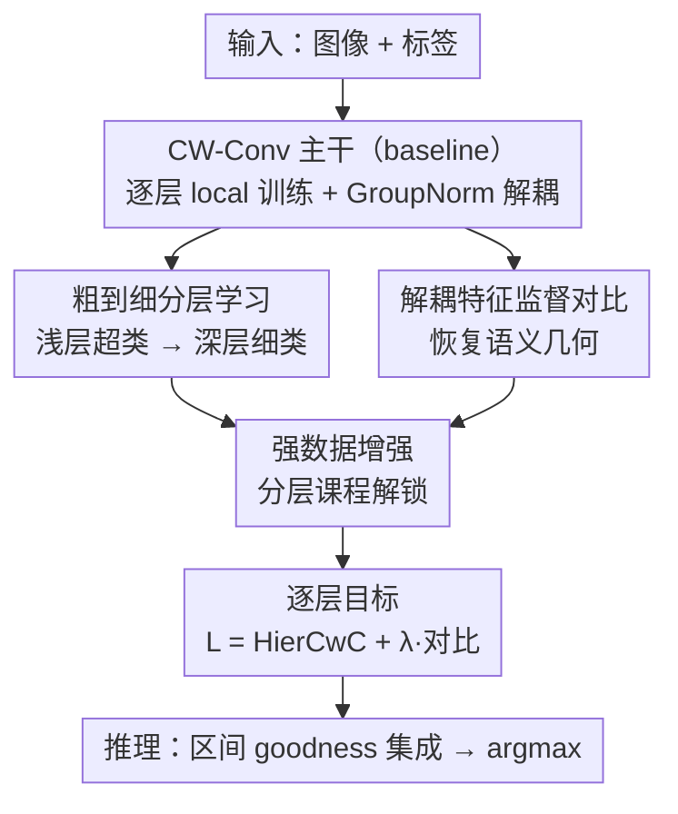

# HCL-FF: Hierarchical and Contrastive Learning for Forward-Forward Algorithm

**会议**: CVPR 2026  
**arXiv**: [2605.24797](https://arxiv.org/abs/2605.24797)  
**代码**: 无  
**领域**: 自监督 / 非反向传播训练 / 表示学习  
**关键词**: Forward-Forward、分层学习、监督对比、goodness 解耦、生物可信训练

## 一句话总结
针对 Forward-Forward（FF）算法"逐层独立训练缺乏跨层协调"和"goodness 解耦后特征语义崩塌"两大顽疾，HCL-FF 给每层加上「粗到细的分层监督」和「在解耦特征上的监督对比」两个 local 目标，在不破坏 FF 逐层独立性的前提下，把 CIFAR-100 准确率从 53.09% 拉到 70.09%（+17.00%），刷新 FF 类方法 SOTA。

## 研究背景与动机
**领域现状**：反向传播（BP）是现代深度学习的基石，但它被诟病生物不可信（大脑没有证据会把误差信号逐层反传、也不会缓存所有激活等待更新）、显存开销大、内部表示不透明。Forward-Forward（FF）算法是近年最受关注的替代范式之一：它给每层定义一个局部的 goodness 目标（goodness 即该层激活的"强度"），正样本（正确的图像-标签对）拉高 goodness、负样本压低 goodness，每层独立优化、不跨层传梯度，因此天然并行、省显存、可解释。

**现有痛点**：FF 的贪心逐层训练带来两个结构性问题。其一是**缺乏分层协调**——BP 训练的 CNN 会自然形成"浅层抓低级线索、深层抓高级语义"的层级，而 FF 逼着浅层直接去区分全部 $K$ 个细类，目标过难，导致早期层表示糟糕。其二是 **goodness 解耦困境（decoupling dilemma）**——为防止深层"白嫖"前一层的 goodness 信号，FF 必须对激活做归一化（向量长度归一或层归一），把幅度信息抹掉、只留相对激活模式；但局部目标只优化 goodness（即幅度），一旦幅度被抹掉，剩下的解耦特征就完全不受约束、语义模糊。

**核心矛盾**：这构成一个两难——严格解耦能防深层过拟合于旧 goodness，却把"激活幅度里编码的语义信息"（恰恰是 goodness 目标唯一直接优化的那部分）一并丢掉。近期工作（CwComp/Trifecta 用 BatchNorm、SCFF 用 triangle 激活）放松解耦来缓解信息损失，但代价是 goodness 信号跨层泄漏、深层只会过拟合旧信号而非学新模式，导致只能堆很浅的网络。

**本文目标 / 切入角度**：在保留 FF 逐层独立的前提下，同时治"无协调"和"解耦困境"。作者的观察是：goodness 管的是激活的**尺度**，那语义其实可以由激活的**方向（相对几何）**来另外承载——于是分两路下手：用课程式的粗到细监督修复跨层协调，用解耦特征上的对比目标把丢掉的语义"方向"重新约束回来。

**核心 idea**：给每个 CW-Conv 层叠加两个 local 目标——浅层学超类、深层学细类的 HierCwC 损失，以及作用在 goodness-解耦特征上的监督对比损失，让"尺度归 goodness、方向归对比"，从而在不泄漏 goodness 的同时保住语义。

## 方法详解

### 整体框架
HCL-FF 的骨干直接继承自 DeeperForward：一个 CW-Conv（Channel-Wise Convolution）stem 接 4 个残差块、每块 4 层 CW-Conv，共 17 层，**每层独立训练、不跨层回传梯度**。每个 CW-Conv 层把激活张量沿通道切成 $K$ 个子集（$K$=类别数），每个子集对应一个类，用 Eq.4 的均值 goodness 公式算出每类 goodness $g^{(\ell)}\in\mathbb{R}^K$；baseline 用 GroupNorm（组数=$K$，等价于子集内独立归一）抹掉全局幅度、做 goodness 解耦后传给下一层；推理时用 Signal Integrating and Pruning 模块在验证集上选最优层区间 $[s,e]$，把区间内 goodness 平均 $\tilde g=\frac1{e-s+1}\sum_{\ell=s}^{e}g^{(\ell)}$ 再取 argmax。

HCL-FF 在这套逐层流水线上，给**每一层**叠加两个新的 local 目标：把原本"区分全部 $K$ 类"的 CwC 损失换成"浅层超类、深层细类"的 HierCwC，并在解耦特征上再加一个监督对比损失；分层课程顺带解锁了浅层的强数据增强。三者都是层局部的，不破坏 FF 的并行性。

### 关键设计

**1. 粗到细分层学习：让浅层只学"大类"、把难度往深层推**

直接针对"FF 逼浅层区分全部细类、目标过难"的痛点。作者把 $K$ 个细类组织成一棵层级树，每层 $\ell$ 对应一组超类划分 $\{G^{(\ell)}_1,\dots,G^{(\ell)}_{K_\ell}\}$（是 $\mathcal{Y}=\{1,\dots,K\}$ 的一个分割），并令超类数随深度单调不减 $K_1\le K_2\le\dots\le K_L=K$，最后一层落到叶子级做细分类。超类 goodness 由组内每类 goodness 取平均得到 $\hat g^{(\ell)}_j=\frac1{|G^{(\ell)}_j|}\sum_{i\in G^{(\ell)}_j}g^{(\ell)}_i$，再把 Eq.5 的细类标签/goodness 换成超类版本，就得到 HierCwC 损失：

$$L^{(\ell)}_{\text{HierCwC}}=-\sum_{i=1}^{K_\ell}\hat y^{(\ell)}_i\log\frac{\exp(\hat g^{(\ell)}_i)}{\sum_{j=1}^{K_\ell}\exp(\hat g^{(\ell)}_j)}$$

层级树用"数据驱动"方式构造：先用 CwC 目标预训练，冻结后在末层特征上训一个线性分类器，把权重矩阵每一行当作类原型，$\ell_2$ 归一后做层次凝聚聚类成树；17 层按 $\text{level}(i)=\lceil i(D-1)/16\rceil$（$D$ 为树最大深度）映射到树深，保证浅层粗、深层细。提前终止的节点用"自我复制为子节点"（图中虚线）补齐，保证每一级都是 $\mathcal{Y}$ 的合法分割。这样早期层只需把语义结构理顺，跨层协调和梯度自由的层间衔接都更稳

**2. 解耦特征上的监督对比：把 goodness 抹掉后丢失的语义"方向"重新约束回来**

直接破解 decoupling dilemma。痛点在于 FF 只优化 goodness（激活幅度），归一化抹掉幅度后，相对激活模式完全不受约束、特征语义崩塌。作者的关键判断是：goodness 管"尺度"，那就让对比目标来管"方向"。具体做法是在每个 CW-Conv 层，对 **goodness-解耦后的特征** $z^{(\ell)}$ 做全局平均池化、经线性投影头得到嵌入 $\mathbf{h}^{(\ell)}$，再施加监督对比损失：

$$L^{(\ell)}_{\text{Con}}=\sum_{i=1}^{N}\frac{-1}{|\mathcal{P}(i)|}\sum_{p\in\mathcal{P}(i)}\log\frac{\exp(\mathrm{sim}(\mathbf{h}^{(\ell)}_i,\mathbf{h}^{(\ell)}_p)/\tau)}{\sum_{a\in A(i)}\exp(\mathrm{sim}(\mathbf{h}^{(\ell)}_i,\mathbf{h}^{(\ell)}_a)/\tau)}$$

其中 $\mathcal{P}(i)$ 是 batch 内与 $i$ 同类的样本集、$\mathrm{sim}$ 为余弦相似度、$\tau$ 为温度。关键区别在"作用对象"：以往的对比 FF 变体（SCFF 等）把对比目标加在**原始激活**或 goodness 上，没解决解耦后崩塌；HCL-FF 偏偏作用在**解耦后**的 $z^{(\ell)}$ 上——它显式约束同类聚拢、异类推开的关系几何，恰好补上 goodness 归一化抹掉的那块语义。注意对比损失**始终用细类标签**，因为换成超类会把组内有意义的细粒度区分压平掉

**3. 强数据增强：被分层课程"解锁"的免费午餐**

这是分层设计的连带收益，而非独立 trick。痛点是：以往 FF 里浅层被压着做细粒度区分、目标已经过载，再叠强增强只会雪上加霜，所以增强基本没用。把浅层目标换成粗超类后，早期层负担骤减，增强带来的样本多样性才真正能"喂得进去"、丰富特征并提升鲁棒性。于是 HCL-FF 实际启用了随机裁剪、水平翻转、色彩抖动、随机灰度等强增强。消融里这点对得很实——单加增强（V1→V2）几乎没用，但有了分层后再加增强（V5→V6）CIFAR-10/100 分别多涨 +3.39%/+5.54%，印证"先简化浅层目标，增强才有效"

### 损失函数 / 训练策略
每层的总目标把两个 local 损失相加：$L^{(\ell)}_{\text{total}}=L^{(\ell)}_{\text{HierCwC}}+\lambda L^{(\ell)}_{\text{Con}}$，所有实验 $\lambda=1$。两者互补：分层损失提供跨深度的结构化粗到细监督，对比损失保住解耦特征的语义几何。训练用 Adam（weight decay $1\times10^{-4}$）+ 余弦退火（学习率 $8\times10^{-2}\to2\times10^{-4}$）；CIFAR/Tiny-ImageNet 训 1000 epoch、MNIST/F-MNIST 训 150 epoch；Tiny-ImageNet/CIFAR-100 batch 512，其余 128；单卡 RTX A6000。

## 实验关键数据

### 主实验
五个 benchmark，5 次运行取均值。HCL-FF 在所有 FF 类方法里都拿到 SOTA，CIFAR-10/100 甚至超过标准 BP ResNet-20。

| 数据集 | 指标 | HCL-FF（本文） | DeeperForward（前 FF SOTA） | 提升 |
|--------|------|------|----------|------|
| CIFAR-10 | Top-1 Acc | **91.68±0.19** | 86.22±0.17 | +5.46% |
| CIFAR-100 | Top-1 Acc | **70.09±0.15** | 53.09±0.79 | +17.00% |
| MNIST | Top-1 Acc | **99.65±0.04** | 99.63±0.04 | +0.02% |
| F-MNIST | Top-1 Acc | **93.87±0.24** | 93.13±0.13 | +0.74% |
| Tiny-ImageNet | Top-1 Acc | **48.46** | 35.95 | +12.51% |

对照点：标准 BP ResNet-20 在 CIFAR-10/100 是 91.25/67.20，HCL-FF（91.68/70.09）已经反超；Tiny-ImageNet 上 ResNet-BP 为 64.40，FF 类与 BP 仍有较大差距，但 HCL-FF（48.46）已远超其他 FF（SCFF 35.67 / DeeperForward 35.95）。

### 消融实验
Hier.=分层学习，Con.=对比学习，Aug.=强增强（CIFAR-10 / CIFAR-100 Acc）：

| 配置 | Hier. | Con. | Aug. | CIFAR-10 | CIFAR-100 | 说明 |
|------|------|------|------|----------|-----------|------|
| V1 | × | × | × | 86.22 | 53.09 | baseline（=DeeperForward） |
| V2 | × | × | ✓ | 88.80 | 54.65 | 只加增强，涨幅有限 |
| V3 | × | ✓ | ✓ | 91.05 | 63.77 | 对比单独贡献大（CIFAR-100 +9.12%） |
| V4 | ✓ | × | ✓ | 88.20 | 61.61 | 分层单独贡献大（CIFAR-100 +6.96%） |
| V5 | ✓ | ✓ | × | 88.44 | 65.22 | 去掉增强，CIFAR 明显掉 |
| V6 | ✓ | ✓ | ✓ | 91.83 | 70.76 | 完整模型 |

> ⚠️ 完整模型在消融表（单次）为 91.83/70.76，主表（5 次均值）为 91.68/70.09，数字略有差异，以各自语境为准。

线性探针（末层特征 归一化前 / 归一化后 Acc），用来量化"解耦后还剩多少语义"：

| 方法 | CIFAR-10（前/后） | CIFAR-100（前/后） |
|------|------|------|
| CwComp | 76.29 / 76.64 | 41.98 / 36.41 |
| DeeperForward | 84.46 / 76.93 | 48.38 / 35.47 |
| **Ours** | **91.93 / 91.91** | **67.42 / 65.85** |

### 关键发现
- **对比是 CIFAR-100 的主功臣**：V2→V3 单加对比，CIFAR-100 暴涨 +9.12%、CIFAR-10 +2.25%；类别越多、解耦后特征崩得越狠，对比的约束越关键。
- **分层在大类空间上更有用**：V2→V4 单加分层，CIFAR-100 +6.96%，但 CIFAR-10 反而轻微 -0.60%——粗到细课程的收益随标签空间增大而放大。
- **增强必须配分层才生效**：单独加增强几乎无用（V1→V2 仅 +2.58%/+1.56%），有分层后再加增强收益翻倍（V5→V6 +3.39%/+5.54%），印证"浅层目标先简化、增强才喂得进"。
- **解耦后语义是否保住，一测便知**：线性探针里 DeeperForward 归一化后从 84.46→76.93、48.38→35.47 大跌，说明它的判别力大半压在幅度里、抹掉就崩；HCL-FF 几乎不掉（91.93→91.91、67.42→65.85），证明对比目标真把语义搬到了解耦特征的"方向"上。
- **层级构造方式不敏感**：CIFAR-100 上 WordNet 71.01 / Word2Vec 69.59 / 数据驱动 70.76，数据驱动无需外部先验也能逼近人类语义层级，方法对层级来源鲁棒。

## 亮点与洞察
- **"尺度归 goodness、方向归对比"是全文最漂亮的拆解**：把 FF 解耦困境重新表述为"幅度承载尺度、相对模式承载语义方向"，于是用两个正交的 local 目标分别管两件事，既不泄漏 goodness 又保住语义——这个视角可迁移到任何"归一化抹掉幅度后语义流失"的局部学习场景。
- **对比目标作用在"解耦后"特征是点睛之笔**：以往对比 FF 都加在原始激活/goodness 上，本文把它精准下放到 $z^{(\ell)}$，线性探针实验直接证明这一步把语义从"幅度"搬到了"方向"，是别人没解决而它解决的关键差异。
- **课程式分层顺带解锁强增强**：一个设计（粗到细）连带激活了另一个本来无效的手段（强增强），这种"降低早期目标复杂度 → 释放数据多样性红利"的因果链，对其他逐层/局部训练范式也有借鉴价值。
- **全程保持 FF 逐层独立**：HierCwC 和对比都是层局部目标，没有引入跨层回传或全局信号（不像 Trifecta 的 block-wise BP、Collaborative FF 的全局 goodness），因此保住了 FF 的并行与省显存优势。

## 局限与展望
- **与 BP 在难数据上仍有明显差距**：Tiny-ImageNet 上 HCL-FF 48.46 vs ResNet-BP 64.40，FF 范式在高分辨率/大标签空间的天花板还远没到 BP 水平。
- **依赖一棵预先构造的层级树**：分层课程需要先用 CwC 预训练 + 聚类得到类层级，多了一道离线流程；层级质量（WordNet vs 数据驱动）虽不敏感但仍影响上限。
- **层到树深的映射是启发式**：$\text{level}(i)=\lceil i(D-1)/16\rceil$ 与"提前终止节点自我复制补齐"都是手工规则，是否最优、对更深网络是否还适用，文中未深究。
- **仅在小/中分辨率分类上验证**：未涉及检测/分割/大规模 ImageNet-1k；对比损失需要 batch 内同类样本，超大类别空间下 batch 里同类样本稀疏可能削弱对比效果。

## 相关工作与启发
- **vs DeeperForward**：DeeperForward 用均值 goodness + LayerNorm 实现严格解耦、首次训到 17 层 CNN，但解耦后特征语义流失（线性探针归一化后大跌）。HCL-FF 直接沿用它的骨干，再叠分层 + 对比补上语义，CIFAR-100 从 53.09 提到 70.09。
- **vs CwComp / Trifecta**：它们用 BatchNorm 放松解耦来缓解信息损失，但 goodness 跨层泄漏导致深层过拟合（CwComp 第 8 层后准确率饱和），只能堆浅网络。HCL-FF 坚持严格解耦、靠对比另外注入语义，跨层准确率能持续提升。
- **vs SCFF / 其他对比 FF 变体**：它们把对比加在原始激活或 goodness 上，没触及解耦后的语义崩塌；HCL-FF 把对比精准作用在 goodness-解耦特征上，才真正破解 decoupling dilemma。
- **vs Collaborative FF**：后者加全局 goodness 目标改善协调但牺牲了 FF 的并行性（层要等全局信号）；HCL-FF 的分层协调全程是 local 的，不牺牲并行。

## 评分
- 新颖性: ⭐⭐⭐⭐⭐ 把 FF 解耦困境重述为"尺度 vs 方向"并用两个正交 local 目标分治，视角清晰且别人没做到。
- 实验充分度: ⭐⭐⭐⭐⭐ 5 benchmark + 完整消融 + 线性探针 + 层级敏感性 + 逐层准确率，证据链扎实。
- 写作质量: ⭐⭐⭐⭐ 问题动机（decoupling dilemma）讲得透彻，公式与图配合清楚，部分实现细节压在附录。
- 价值: ⭐⭐⭐⭐ 把 FF 类方法在 CIFAR-100 上推进 17 个点、反超同级 BP，对生物可信/边缘训练方向有实质推动。

<!-- RELATED:START -->

## 相关论文

- [\[CVPR 2026\] MemFlow: A Lightweight Forward Memorizing Framework for Quick Domain Adaptive Feature Mapping](memflow_a_lightweight_forward_memorizing_framework_for_quick_domain_adaptive_fea.md)
- [\[CVPR 2026\] TeFlow: Enabling Multi-frame Supervision for Self-Supervised Feed-forward Scene Flow Estimation](teflow_enabling_multi-frame_supervision_for_self-supervised_feed-forward_scene_f.md)
- [\[CVPR 2026\] Free-Grained Hierarchical Visual Recognition](free-grained_hierarchical_visual_recognition.md)
- [\[CVPR 2026\] CHEEM: Continual Learning by Reuse, New, Adapt and Skip -- A Hierarchical Exploration-Exploitation Approach](cheem_continual_learning_by_reuse_new_adapt_and_skip_--_a_hierarchical_explorati.md)
- [\[CVPR 2026\] UniGeoCLIP: Unified Geospatial Contrastive Learning](unigeoclip_geospatial_contrastive.md)

<!-- RELATED:END -->
