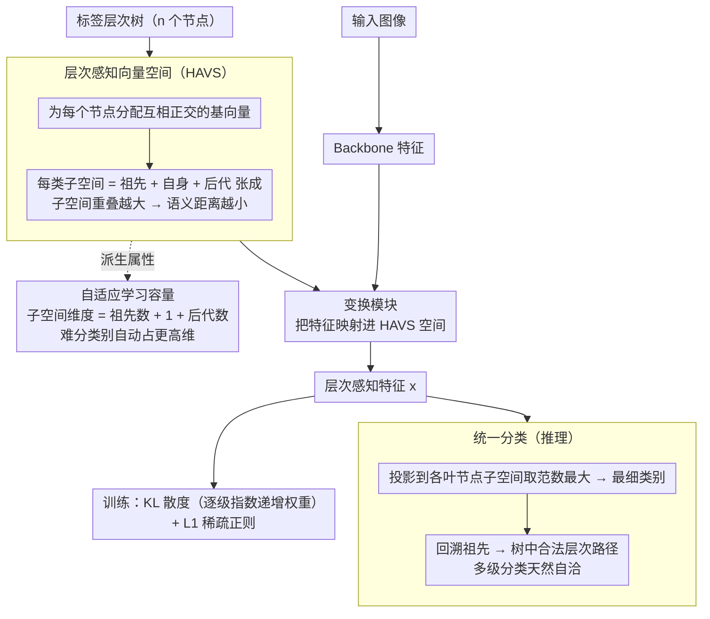

# Hier-COS: Making Deep Features Hierarchy-aware via Composition of Orthogonal Subspaces

**会议**: CVPR 2026  
**arXiv**: [2503.07853](https://arxiv.org/abs/2503.07853)  
**代码**: [项目页面](https://sites.google.com/iiitd.ac.in/hier-cos)  
**领域**: 自监督  
**关键词**: 层次分类, 正交子空间, 层次感知特征, 评估指标, 标签层次

## 一句话总结
提出 Hier-COS 框架，通过为层次树中每个节点分配正交基向量，构造理论上保证层次一致性的层次感知向量空间(HAVS)，首次统一了"层次感知细粒度分类"和"层次多级分类"，同时提出新评估指标HOPS，在4个数据集上全面超越SOTA。

## 研究背景与动机

**领域现状**：传统分类器将所有类别视为互斥，忽略了类别间的语义层次结构。层次感知表征学习旨在使语义相似的类别在特征空间中更接近，减少错误的严重性。

**现有痛点**：(a) 现有方法的特征表示被限制在权重向量方向的一维空间中导致角分离度不足；(b) 不同类别的分类复杂度不同但现有方法分配相同的学习容量；(c) 现有评估指标（MS, AHD@k）有严重缺陷——AHD是排列不变量，无法区分最优和最差的top-k预测顺序。

**核心矛盾**：现有方法要么只做层次感知多类分类（不能做多级分类），要么需要额外分类器+约束才能做多级分类（增加训练复杂度且不保证一致性）。

**本文目标** 构建一个理论上保证层次一致的特征空间，同时统一两种分类模式，并自适应分配学习容量。

**切入角度**：用正交基向量构建子空间，每个节点的子空间由其所有祖先和后代的基向量组成。距离定义为到子空间的正交投影距离——共享祖先越多的类别子空间重叠越大→距离越小。

**核心 idea**：每个类别对应一个由其祖先+自身+后代基向量张成的正交子空间，子空间组合天然编码层次结构。

## 方法详解

### 整体框架
Hier-COS 想解决的核心问题是：让深度特征"看得见"类别之间的语义层次——把一只哈士奇错认成狼，应该比错认成卡车付出更小的代价。它的做法是把标签层次树$\mathcal{T}$（共$n$个节点）整体搬进一个$n$维正交向量空间：给树里每个节点配一个互相正交的基向量$\mathcal{E}$，然后让每个类别对应一个由"它的祖先 + 自己 + 它的后代"这些基向量张成的子空间$V_i = \text{span}(\mathcal{E}_i^a \cup \{e_i\} \cup \mathcal{E}_i^d)$。一个轻量变换模块负责把 backbone 抽出的普通特征映射进这个空间$V_\mathcal{T}$，分类时再看特征落在哪个类别的子空间里。整条链路的巧妙之处在于：层次关系不是靠额外的 loss 去"逼"出来的，而是被几何结构天然编码进了子空间的重叠程度里。

### 关键设计

**1. 层次感知向量空间（HAVS）：用子空间重叠直接编码"语义远近"**

要让特征空间"懂层次"，关键是让距离度量服从树距离——两个类别共享的祖先越多，它们在特征空间里就该越近。Hier-COS 用正交子空间的几何关系来满足这一点：一个类别的子空间维度越高（祖先越多），它和兄弟类别共享的基向量就越多，子空间重叠越大。论文把"特征到类别的距离"定义成到该类别子空间正交补的投影范数，计算上只需把不属于该子空间的那些基方向上的分量平方求和，$d_S^2(\mathbf{x}, V_{y_j}) = \sum_{e \in \neg\mathcal{E}_{y_j}} x_e^2$——补空间越小，距离越小。Theorem 1 把这件事钉成了理论保证：只要特征$\mathbf{x} \in V_{y_i}$且在所有基方向上投影非零，$V_\mathcal{T}$ 就是一个 HAVS，即树距离上的序关系$D_\mathcal{T}(y_i, y_j) < D_\mathcal{T}(y_i, y_k)$一定蕴含特征距离上的同序$|D_i - D_j| < |D_i - D_k|$。换句话说，层次一致性是这个空间的内在性质，而不是训练时祈祷得到的副产品。

**2. 自适应学习容量：让难分的类别自动拿到更大的表示空间**

现实里的层次树往往不平衡——有的子树枝繁叶茂、类别间区别很细，有的只有寥寥几个粗粒度类。现有方法对所有类别一视同仁地分配一维表示空间，难分的细粒度类被挤在同样狭窄的角度里，分离度严重不足。Hier-COS 借子空间的构造方式顺手解决了这个问题：每个类别的子空间维度直接等于"祖先数 + 1 + 后代数"。一个位于深层、兄弟众多的复杂类别（如$\{D6,\dots,D10\}$这样共享大量祖先的一组）自然落进高维子空间，有足够的方向去编码细致的区分特征；而一个浅层、孤立的简单类别（如$\{A2,A3\}$）只占低维子空间就够了。学习容量随类别复杂度自动伸缩，既不用手工设计也没有额外超参。

**3. 统一分类：一个模型同时给出"最细类别"和"整条层次路径"，且天然自洽**

过去要同时做层次感知的细粒度分类和逐级的多级分类，通常得为每一级各挂一个分类头，再加一项一致性 loss 把各级预测"粘"成合法路径——训练繁琐，而且约束只是软的、并不保证结果落在树里。Hier-COS 不需要这些。推理时它只做一件事：把特征投影到各叶节点子空间，取范数最大的那个$\hat{y} = \arg\max_{y_i \in \mathcal{V}_\ell} \|\mathbb{P}_{\mathcal{E}_{y_i}} \mathbf{x}\|$。Proposition 1 保证由此回溯出的路径$\{\hat{y}^{(1)}, \dots, \hat{y}^{(H)}\}$必然是树中的一条有效路径，于是多级分类的一致性是免费送的——不存在"叶节点说是哈士奇、中间级却说是猫科"这种自相矛盾。一个模型、一次前向，两种分类任务同时达成且天然不冲突。

### 损失函数 / 训练策略
训练目标为$\mathcal{L}_{total} = \mathcal{L}_{kl} + \alpha \mathcal{L}_{reg}$。$\mathcal{L}_{kl}$用 KL 散度把特征在各基向量上的分布拉向目标分布，并对各级方向施加指数递增的权重，让叶节点方向获得最大权重（细粒度区分最受重视）；$\mathcal{L}_{reg}$是 L1 正则，强制特征稀疏，使每一级只激活一个基方向，从而落在合法的层次路径上。变换模块沿用 HAFrame 的设计，既可端到端训练整个网络，也可冻结 backbone、只训练这个轻量模块。

## 实验关键数据

### 主实验

**CIFAR-100 (5级层次)**

| 方法 | Accuracy↑ | MS↓ | AHD@20↓ | HOPS↑ | HOPS@5↑ |
|------|----------|-----|---------|-------|---------|
| Cross Entropy | 77.77 | 2.33 | 3.19 | 0.54 | 0.05 |
| HAFrame | 80.55 | 2.00 | 2.45 | 0.86 | 0.81 |
| **Hier-COS** | **81.75** | 2.09 | **2.44** | **0.89** | **0.84** |

**iNaturalist-19 (7级层次)**:  Hier-COS在HOPS上显著优于HAFrame，体现深层次大类别数场景的优势。

### 消融实验

| 配置 | FPA↑ | Accuracy↑ | 说明 |
|------|------|----------|------|
| Cross Entropy | 77.11 | 77.77 | Accuracy-FPA差距大=不一致 |
| HAFrame | 77.0 | 80.55 | FPA反而低于CE |
| **Hier-COS** | **82.91** | **81.75** | FPA>Accuracy!极强一致性 |

### 关键发现
- Hier-COS的FPA (Full Path Accuracy)在所有数据集上比HAFrame提升1.36-3.64%，且Accuracy-FPA差距最小，确认了层次一致性的理论保证
- HOPS指标有效区分了AHD无法区分的场景：AHD@20对最优和最差排序给出相同分数（2.06），HOPS则差异显著
- 在ViT冻结backbone上仅训练变换模块，top-1提升2.42%，说明Hier-COS可以高效地将预训练特征转化为层次感知特征
- 随着K增大，现有方法的正确排序比例急剧下降；Hier-COS在K=20时仍维持64-74%（远超其他方法的~0%）

## 亮点与洞察
- **理论与实践的优雅统一**：正交子空间组合天然编码层次结构，Theorem 1提供了严格的理论保证，Proposition 1保证推理时层次一致性。这比现有方法用额外loss项"逼近"一致性远为优雅
- **HOPS评估指标**：揭示了AHD@k的排列不变性缺陷，提出的HOPS同时考虑top-1准确率和错误严重性的排序偏好。HOPS@1=top-1 accuracy是一个优美的特殊情况
- **"子空间维度=学习容量"的insight**：通过层次树的拓扑结构自动分配每个类别的表示空间维度，无需手动设计或超参调节

## 局限与展望
- 特征空间维度$n$等于层次树节点数，对于极大的层次（如数万节点）可能导致维度过高
- 仅在图像分类上验证，未扩展到NLP/多模态的层次分类场景
- HOPS指标虽然优于AHD，但权重函数$\eta_j$的选择（多步指数线性衰减）有一定任意性
- 正交基的分配（bijective但arbitrary）对结果的影响未深入分析

## 相关工作与启发
- **vs HAFrame**: HAFrame也用固定frame做层次感知分类，但特征被限制在权重向量的一维方向上。Hier-COS引入子空间组合，提供多维表示空间和自适应容量
- **vs Flamingo**: Flamingo用label embedding学习层次相似性，但不保证层次一致性
- **vs 超双曲嵌入**: 超双曲空间天然编码层次但需要流形优化。Hier-COS在欧氏空间中通过正交子空间达到类似效果，更简单

## 评分
- 新颖性: ⭐⭐⭐⭐⭐ 正交子空间组合编码层次结构的思路原创且优雅，理论保证完备
- 实验充分度: ⭐⭐⭐⭐ 4个数据集、多指标对比，但缺少NLP/大规模场景
- 写作质量: ⭐⭐⭐⭐⭐ 理论推导严谨，问题驱动清晰，评估指标的批判分析尤为出色
- 价值: ⭐⭐⭐⭐ 对层次分类领域有方法论和评估指标的双重贡献

<!-- RELATED:START -->

## 相关论文

- [\[CVPR 2026\] Nonparametric Deep Fine-grained Clustering with Low-Rank Guided Vision-Language Model](nonparametric_deep_fine-grained_clustering_with_low-rank_guided_vision-language_.md)
- [\[CVPR 2026\] TAR: Token-Aware Refinement for Fine-grained Generalized Category Discovery](tar_token-aware_refinement_for_fine-grained_generalized_category_discovery.md)
- [\[CVPR 2026\] PAF: Perturbation-Aware Filtering for Open-Set Semi-Supervised Learning](paf_perturbation-aware_filtering_for_open-set_semi-supervised_learning.md)
- [\[AAAI 2026\] Expandable and Differentiable Dual Memories with Orthogonal Regularization for Exemplar-free Continual Learning](../../AAAI2026/self_supervised/expandable_and_differentiable_dual_memories_with_orthogonal_regularization_for_e.md)
- [\[ICLR 2026\] Exploiting Low-Dimensional Manifold of Features for Few-Shot Whole Slide Image Classification](../../ICLR2026/self_supervised/exploiting_low-dimensional_manifold_of_features_for_few-shot_whole_slide_image_c.md)

<!-- RELATED:END -->
