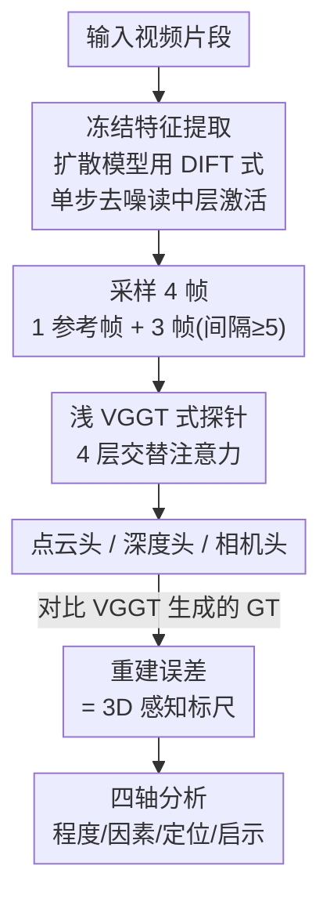

# How Much 3D Do Video Foundation Models Encode?

**会议**: CVPR 2026  
**论文**: [CVF Open Access](https://openaccess.thecvf.com/content/CVPR2026/html/Huang_How_Much_3D_Do_Video_Foundation_Models_Encode_CVPR_2026_paper.html)  
**代码**: https://vidfm-3d-probe.github.io/ (项目页)  
**领域**: 自监督 / 表示分析（探针研究）  
**关键词**: 视频基础模型, 3D 感知, 探针, 视频扩散模型, 几何重建

## 一句话总结
作者提出第一个**模型无关**的探针框架，用「冻结视频基础模型特征 + 浅层前馈头预测 3D 点云/深度/相机位姿」来量化各类视频模型内部隐含了多少 3D 理解，结论是：只在 2D 视频上训练的前沿视频生成模型（如 WAN2.1-14B）涌现出强 3D 感知，在跨域场景上甚至超过专门用 3D 数据训练的专家模型 Fast3R。

## 研究背景与动机
**领域现状**：从 2D 视觉恢复 3D 结构是计算机视觉的老问题，但高质量 3D 数据始终稀缺，限制了 3D 基础模型的 scaling。相比之下视频海量易得，且视频本身就是 3D 世界的 2D 投影，于是「用视频先验做 3D」成了热门路线——要么给视频模型加 3D 控制条件，要么让它额外吐 3D 缓存。

**现有痛点**：这些工作几乎都要在 3D 数据上**微调**视频模型，再加各种任务特定工程（显式 3D 记忆、后处理优化、对生成结果再跑前馈模型）才能压住 3D 不一致伪影。这些 confound 把「视频数据本身到底带来了多少 3D 能力」和「微调+工程补出来的能力」搅在了一起，谁也说不清基座视频模型**原生**就编码了多少 3D。

**核心矛盾**：要回答「视频预训练能否原生诱导出强 3D 感知」，必须把微调和工程的贡献剥离掉，做一次**直接、模型无关、可量化**的评测。而已有探针工作（Probe3D、Feat2GS）只探**图像模型**，且主要测深度/法向或跨视图一致性这类 2.5D 代理指标，并不直接探全局 3D 属性，也没覆盖视频模型这一大家族。

**本文目标**：在统一探针下测量多种视频基础模型（VidFM）的 3D 感知，并沿四条轴回答——① **程度（Extent）**：视频模型 vs 图像模型 vs 专家 3D 模型差多少？② **因素（Factor）**：时序推理、3D 微调、模型规模各有什么影响？③ **定位（Localization）**：3D 信息集中在哪一层、扩散模型的哪个时间步？④ **启示（Implication）**：在 3D 数据/算力受限时，VidFM 特征实用吗？

**核心 idea**：如果一个视频模型真懂 3D，那么仅用一个**浅层、前馈、不优化基座**的读出头就应当能从它的冻结特征里解出准确的 3D 属性；读出误差越低，说明原生 3D 感知越强。把「探针重建误差」当作 3D 感知的统一标尺，就能在不同模型家族间做公平横评。

## 方法详解

### 整体框架
方法是一个两阶段的「冻结特征 → 浅探针 → 3D 误差」流水线：先把待测视频模型当作**冻结的特征提取器**，在视频片段上跑一遍取出逐帧时空特征；再在这些特征之上训练一个轻量前馈探针，让它预测每帧的稠密 3D 点图、深度图和相机位姿；**只训练探针，绝不动基座**。基座在同样的探针容量、同样的训练集、同样的监督下，谁能让探针达到更低重建误差，就说明谁原生编码了更强的 3D。GT 则用 VGGT 跑全帧生成（比数据集自带标注更准）。

### 关键设计

**1. 冻结特征提取 + 扩散模型的 DIFT 式读取：把任意视频模型变成统一可探的特征源**

不同视频模型架构差异巨大（自监督编码器、隐扩散生成器），要做模型无关横评，第一步是把它们都规约成「逐帧时空特征图 $F_t \in \mathbb{R}^{C\times H_f\times W_f}$」。对自监督/确定性模型（V-JEPA、DINOv2、Fast3R）直接前向取末层空间特征即可。难点在**扩散视频生成器**——它没有现成的「特征」，作者借鉴 DIFT：选一个去噪时间步 $\tau$，对输入加噪，做**一步**去噪，然后读出指定网络层的隐藏激活当作特征；文本用空 embedding，图生视频模型则以首帧为条件。层号和 $\tau$ 作为超参全程固定。对于上下文窗口受限的模型，把长视频切成短 chunk、每个 chunk 都拼上首帧作为共同参考，并维护帧到特征的索引 $\pi(t)$，探针时据此 gather 对应特征。这一步的价值在于：它让生成式扩散模型也能被纳入同一把尺子，且「冻结 + 浅读出」保证了测到的是基座原生信息而非读出头补出来的。

**2. 浅 VGGT 式前馈探针：用最小读出容量逼出「原生」3D，而非训练一个新 3D 模型**

探针刻意做得很浅：对每段视频取 $S{=}4$ 帧（首帧为参考，另 3 帧按最小时间间隔 5 采样），取出逐帧 token，叠 4 个**交替注意力**块——每块含一个帧内注意力（混合单帧内 token）和一个全局注意力（跨帧混合 token），结构上镜像 VGGT 但浅得多。后接三个读出头：两个 DPT 头出稠密点图 $\hat{X}_{t_i}\in\mathbb{R}^{H\times W\times 3}$（在首帧坐标系下）和深度图 $\hat{D}_{t_i}$，一个相机头预测各帧相对首帧的位姿。设计哲学是：探针容量被故意压到很低，逼得「全局一致的 3D」必须由基座特征供给而非探针自行推断——所以读出误差才能干净地反映基座的原生 3D 感知。训练目标是 VGGT 式多任务损失 $L = \lambda_{p}L_{pmap} + \lambda_{d}L_{depth} + \lambda_{c}L_{cam}$（默认权重全为 1）：点图/深度用置信度加权的 $\ell_2$（GT 场景先归一化去除尺度歧义），相机位姿用 Huber 损失。

**3. 上下参考对照组：给「视频特征强」这个结论钉死可信区间**

裸视频本身就能解出一部分 3D，单看 VidFM 之间的排名可能虚高。作者设两个对照把结论框住。**下界（逐帧图像对照）**：对视频每帧**独立**抽 DINOv2 特征喂同一探针——因为特征是逐帧孤立提取的，任何「公共坐标系下的全局 3D」都只能由探针自己凑，而非基座供给；为让任务良定义，追加一个标记首帧的参考 token，其余超参与 VidFM 设定完全一致。**上界（原生 3D 对照）**：探 Fast3R 特征——它本就被直接训练来从多视图预测 3D 点图，在同样探针架构与监督下提供强参考。妙处还在于 CO3D 在 Fast3R 训练集内、DL3DV 不在，于是这组对照顺带还能观察专家模型的**泛化行为**。有了下界（图像孤立）和上界（3D 专家），VidFM 的数值就有了可解释的标尺。

### 损失函数 / 训练策略
多任务损失 $L = \lambda_{pmap}L_{pmap} + \lambda_{depth}L_{depth} + \lambda_{cam}L_{cam}$，三项权重默认均为 1。点图与深度用置信度加权 $\ell_2$，GT 场景先归一化消除全局尺度；相机位姿用 Huber 损失。整个训练只更新探针参数，基座视频模型始终冻结。

## 实验关键数据

### 主实验：3D 感知横评（CO3Dv2 / DL3DV）

CO3Dv2 是物体中心的转台视频（筛后 11k 段），DL3DV 是大而杂乱的场景（更难）。GT 用 VGGT 全帧生成。点图误差已乘 10 便于阅读。

| 探测特征 | CO3D 点误差↓ | CO3D 深度↓ | CO3D AUC@30↑ | DL3DV 点误差↓ | DL3DV 深度↓ | DL3DV AUC@30↑ |
|---|---|---|---|---|---|---|
| DINOv2（逐帧图像，下界） | 0.559 | 0.209 | 0.508 | 2.814 | 0.534 | 0.245 |
| V-JEPA（自监督视频） | 0.439 | 0.214 | 0.619 | 1.576 | 0.613 | 0.558 |
| CogVideoX | 0.485 | 0.231 | 0.569 | 1.748 | 0.608 | 0.486 |
| Aether（CogVideoX+3D 微调） | 0.501 | 0.249 | 0.571 | 1.566 | 0.574 | 0.527 |
| Open-Sora2.0 | 0.391 | 0.196 | 0.643 | 1.306 | 0.445 | 0.607 |
| **WAN2.1-14B** | **0.284** | **0.151** | 0.736 | **1.051** | **0.323** | **0.660** |
| Fast3R（3D 专家，上界） | 0.262 | 0.145 | 0.769 | 1.379 | 0.514 | 0.637 |

关键看点：在 Fast3R 训练分布内的 CO3D 上，WAN2.1-14B 各项仅次于 Fast3R（点 0.284 vs 0.262）；而在 Fast3R **没见过**的 DL3DV 上，WAN2.1-14B **全面超过** Fast3R（点 1.051 vs 1.379，深度 0.323 vs 0.514，AUC@30 0.660 vs 0.637）——只用 2D 视频训练的生成器，跨域 3D 反而比 3D 专家更稳。

### 消融：模型规模 / 定位 / VidFM 特征替换 DINO

| 实验 | 配置 | 关键指标 | 说明 |
|---|---|---|---|
| 规模（消融集点误差） | WAN 1.3B → 14B | 0.0468 → 0.0360（−23%） | 放大显著变好 |
| 规模（消融集点误差） | CogVideoX 2B → 5B | 0.0576 → 0.0590（+2%） | 反而略变差 |
| 定位 | 中层 + 早但非首步时间步 | 点误差最低 | 跨所有扩散模型一致 |

VidFM 特征替换 DINO（VGGT 实战，限 3D 数据场景）：

| 方法 | CO3D 点误差↓ | CO3D 深度↓ | DL3DV 点误差↓ | DL3DV 深度↓ |
|---|---|---|---|---|
| 原始 VGGT（DINO 特征） | 0.476 | 0.205 | 2.751 | 0.518 |
| **VidFM-VGGT（冻结 WAN2.1-14B 特征）** | **0.289** | **0.145** | **1.034** | **0.319** |

### 关键发现
- **程度**：前沿视频生成器（WAN2.1-14B、Open-Sora2.0）3D 感知强到能逼近甚至跨域超越 3D 专家 Fast3R，尽管它们从未见过任何 3D 数据。
- **因素①时序推理是关键**：逐帧 DINOv2 在 CO3D 上深度尚可（0.209），但全局 3D（点 0.559、AUC@30 0.508）显著差于所有视频模型——视频模型多了「沿时间轴交换信息」这一条，差距在更难的 DL3DV 上进一步拉大；说明深度这类 2.5D 代理指标无法真正反映全局 3D 感知。
- **因素②3D 微调是双刃剑**：Aether（CogVideoX 加 3D 目标微调）在大场景 DL3DV 上提升明显，但在物体中心 CO3D 上反而略逊基座，作者归因于其训练数据多为游戏/仿真合成大场景——微调能提分但可能损害跨域泛化。
- **因素③规模影响混合**：参数量不保证更强 3D；WAN 放大伴随更多高质量高分辨率数据所以变好，CogVideoX 单纯放大架构反而略退，提示数据才是关键变量。
- **定位**：扩散模型里 3D 信息最集中在**中层 + 早但非首个时间步**，跨模型惊人一致——末层被逐帧 RGB 合成任务占用而压制高层 3D 特征，太早层高层特征尚未成形；时间步上噪声太多/太少都会让去噪任务退化，中等偏早能在「保留全局 3D 线索」与「少受大噪声干扰」间取得平衡。
- **启示**：在 3D 数据受限时，用冻结 WAN 特征替换 DINO 训 VGGT（VidFM-VGGT）全面大幅超过原始 VGGT，说明视频模型特征更适合小数据下的前馈 3D 重建。

## 亮点与洞察
- **把「3D 感知」操作化为一把可量化的统一标尺**：固定探针容量+训练集，用重建误差直接横评不同家族模型，绕开了「不同模型不可比」的老大难；这套协议本身就可复用到任何新视频/图像基座。
- **DIFT 式特征读取 + 上下界对照的组合很扎实**：前者解决了扩散模型「没有现成特征」的问题，后者（逐帧图像下界 + 3D 专家上界）把结论钉在可解释区间内，避免「视频模型看起来强」的虚高解读。
- **「跨域才见真章」的实验设计**：故意挑一个 Fast3R 没训过的 DL3DV，让视频生成器超过 3D 专家——这个对比比同分布内的微弱领先更有说服力，直指「2D 视频先验的泛化优势」。
- **可迁移的工程结论**：中层 + 早期时间步是扩散视频模型抽 3D 特征的甜点位，且跨模型一致——任何想从视频扩散模型蹭 3D 先验的下游工作都能直接套用这个选层/选步经验。

## 局限与展望
- **只能用公开 checkpoint，无法做受控实验**：算力/数据约束下作者无法在精确受控的变量下从头训视频生成器，因此不能严格把 3D 感知差异归因到「数据 vs 训练策略 vs 规模」中的某一项；尤其没有「仅训练数据规模不同」的开源多版本模型，数据规模的独立影响无法隔离。
- **未在大规模数据上验证 VidFM-VGGT 的天花板**：Implication 部分只在 CO3D/DL3DV 这种小数据下验证，受资源限制没法用 VidFM 特征从头训大规模 3D 重建模型——而这恰是「视频先验能否撑起可 scale 的 3D 基础模型」这一核心命题最该回答的部分。
- **GT 依赖 VGGT 自动生成**：所有点图/深度/位姿 GT 都来自 VGGT 全帧推理，等于把 VGGT 当真值，可能对与 VGGT 同源的特征（如同样偏几何的模型）有系统性偏好，结论的绝对数值需谨慎看待。
- **探针仍是有监督的读出**：虽然刻意做浅，但「shallow 到什么程度才算只测原生信息」缺乏理论界定，探针容量本身就是一个隐含旋钮。

## 相关工作与启发
- **vs Probe3D / Feat2GS**：它们也用稠密探针测 3D 感知，但目标是**图像模型**，且评测偏深度/法向或跨视图一致性这类 2.5D 代理；本文直接探**视频模型**并用点云/深度/位姿三类**真·3D 属性**，还论证了深度/多视图一致性并非衡量 3D 感知的最佳指标。
- **vs VBench / WorldScore**：它们 benchmark 视频生成器，但评的是**生成视频**的 3D 一致性（用现成先验打分）；本文评的是模型**内部表征**里编码了多少 3D，关注点从「输出像不像 3D」转到「内部懂不懂 3D」。
- **vs 视频→3D 微调工作（Aether 等）**：主流是把视频模型在 3D 数据上微调/加 3D 控制以输出 3D；本文反其道而行，**不微调**、用冻结特征直接探，从而把「原生视频先验」与「微调补出来的能力」干净分离——并用实验说明微调有时反伤泛化。
- **vs 经典 SfM/MVS 与前馈 3D（Fast3R/VGGT）**：前者靠特征匹配、难处理无纹理/宽基线；后者靠 3D 标注数据前馈预测、难 scale 与泛化到动态/真实杂乱场景。本文给出第三条线索：现成视频生成器的特征可能是比 DINO 更适合小数据前馈 3D 的「免费 3D 先验」。

## 评分
- 新颖性: ⭐⭐⭐⭐⭐ 首个模型无关、面向视频模型的直接 3D 探针框架，问题切口（剥离微调看原生 3D）和「视频生成器跨域胜过 3D 专家」的结论都很新。
- 实验充分度: ⭐⭐⭐⭐ 两数据集、四轴、上下界对照齐全，规模/定位消融到位；但只用公开 checkpoint、无法隔离数据规模变量，大规模验证缺位。
- 写作质量: ⭐⭐⭐⭐⭐ 四轴结构清晰，结论与表格/定性图对得上，protocol 和对照组动机交代得很透。
- 价值: ⭐⭐⭐⭐⭐ 给「用视频做可 scale 的 3D」提供了量化证据与现成评测协议，选层/选步与「VidFM 特征替 DINO」结论可直接被下游 3D 工作复用。

<!-- RELATED:START -->

## 相关论文

- [\[CVPR 2026\] TALO: Pushing 3D Vision Foundation Models Towards Globally Consistent Online Reconstruction](talo_pushing_3d_vision_foundation_models_towards_globally_consistent_online_reco.md)
- [\[AAAI 2026\] From Pretrain to Pain: Adversarial Vulnerability of Video Foundation Models without Finetuning](../../AAAI2026/self_supervised/from_pretrain_to_pain_adversarial_vulnerability_of_video_foundation_models_witho.md)
- [\[ICML 2026\] How 'Neural' is a Neural Foundation Model?](../../ICML2026/self_supervised/how_neural_is_a_neural_foundation_model.md)
- [\[CVPR 2026\] Scaling Parallel Sequence Models to Vision Foundation Models](scaling_parallel_sequence_models_to_vision_foundation_models.md)
- [\[CVPR 2026\] Chain-of-Models Pre-Training: Rethinking Training Acceleration of Vision Foundation Models](com_pt_chain_of_models_pretraining.md)

<!-- RELATED:END -->
