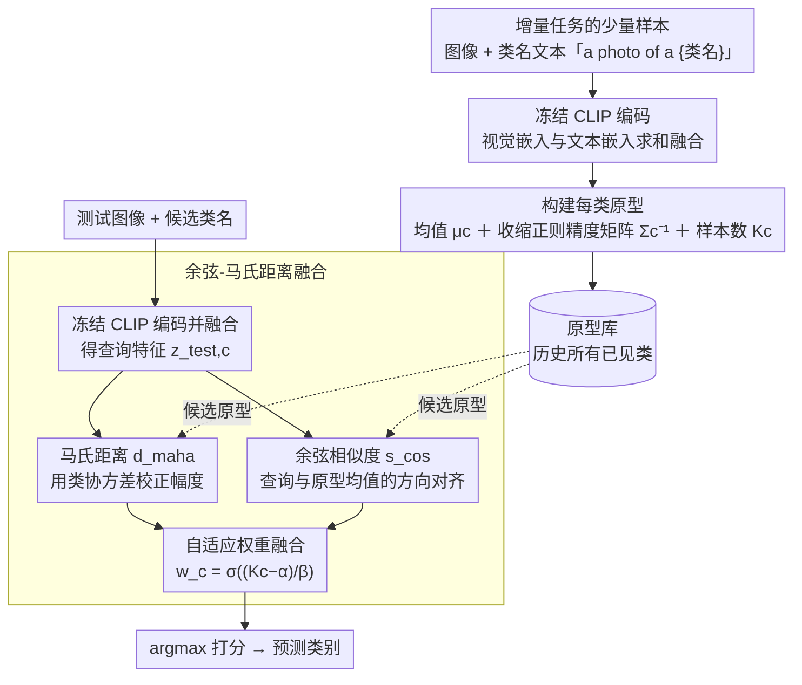

# HyCal: A Training-Free Prototype Calibration Method for Cross-Discipline Few-Shot Class-Incremental Learning

**会议**: CVPR 2026  
**arXiv**: [2604.15678](https://arxiv.org/abs/2604.15678)  
**代码**: 无  
**领域**: 自监督  
**关键词**: 持续学习, 少样本增量学习, 跨域适应, 原型校准, 域引力

## 一句话总结
本文识别了异质域持续学习中的"域引力"（Domain Gravity）偏差——数据丰富或低熵域在共享嵌入空间中产生不成比例的影响，并提出 HyCal，一种无训练方法，通过融合余弦相似度和马氏距离进行原型校准，在跨学科不平衡少样本增量学习中实现稳健分类。

## 研究背景与动机

1. **领域现状**：预训练视觉-语言模型（如 CLIP）在持续学习中表现出色。少样本类增量学习（FSCIL）通过限制每类样本数来模拟真实场景，近期已扩展到跨域设置，利用 VLM 的零样本能力跨域保留知识。
2. **现有痛点**：现有跨域 FSCIL 方法仍假设固定的少样本配置和平衡数据分布。实际中，异质域之间在视觉熵、特征几何和数据可用性上差异巨大。基于投影或核方法的方案（如 RanPAC）虽丰富了特征表示，但加剧了向数据丰富域的漂移。基于协方差的方法在少样本异质域下协方差估计不稳定。
3. **核心矛盾**：异质域的数据不平衡导致"域引力"——过度代表或低熵域在共享嵌入空间中产生不成比例的影响力，使弱表示域的原型发生漂移，决策边界模糊。现有方法隐式假设同质特征分布，无法对抗这种非对称表征力。
4. **本文目标**：(1) 定义跨学科可变少样本增量学习（XD-VSCIL）基准；(2) 提出无训练的原型校准方法来缓解域引力。
5. **切入角度**：余弦相似度和马氏距离捕获高维空间中互补且统计独立的几何信息——方向对齐和协方差感知的大小。
6. **核心 idea**：将余弦相似度（全局方向稳定性）与马氏距离（域特定协方差校正）动态融合，无需修改主干网络即可实现稳健的原型匹配。

## 方法详解

### 整体框架
HyCal 要解决的是跨学科持续学习里"数据丰富或低熵的域把共享嵌入空间往自己方向拽"的问题，而它的做法是把校准全部放到推理端、完全不碰主干网络。整条流程是这样转的：主干用一个冻结的 CLIP（图像、文本编码器都不更新），每来一个增量任务，就把每张样本的视觉嵌入和类名文本（"a photo of a {类名}"）嵌入求和融合成一个统一嵌入，再从这个任务的少量样本里为每个新类算出一份"原型"——包括类均值嵌入 $\mu_c$、一份收缩正则化后的精度矩阵 $\Sigma_c^{-1}$（协方差的逆）和样本数 $K_c$。等到分类一张测试图时，HyCal 先把测试图像和候选类名文本同样融合成查询特征，再对每个候选原型同时算两件事：查询特征与原型均值方向有多对齐（余弦相似度）、以及考虑了该类协方差之后离原型有多近（马氏距离），最后用一个随样本数自适应的权重把两个分数融合成最终打分、取最大者为预测类别。整个过程没有任何训练、反向传播或参数更新，只是把"用什么距离匹配原型"这一步做得更稳。

### 关键设计

**1. 域引力（Domain Gravity）：先把"不平衡导致掉点"讲成一个结构性偏差**

这篇论文没有一上来就堆方法，而是先回答"异质域持续学习为什么会掉点"。它的回答是：每个域会根据自己的视觉一致性和数据密度，在共享嵌入空间里产生一种"表征势"——低熵（图像高度规整，如 MNIST）或样本量大的域势能更高，会不成比例地主导嵌入几何，把弱表示域的原型往自己这边拽偏，决策边界因此变模糊。作者把这种偏差拆成两个来源：一是**预训练偏差**，CLIP 从大规模语料里就继承了分布偏差，常见域天然主导几何；二是**增量累积**，随着任务一个个进来，原型和嵌入会持续朝视觉一致的域漂移。论文用 t-SNE 可视化直接展示了 RanPAC 这类方法中欠表示域原型的漂移轨迹。这个概念的价值在于把"数据不平衡所以效果差"这句现象描述，升级成一个可定位、可对抗的结构性目标——后面两个设计都是冲着"抵消域引力"去的。

**2. 余弦-马氏距离融合：用两种几何独立的距离互相补盲区**

域引力的直接后果是单一距离不够用：余弦相似度只看方向、完全无视域特定的方差，碰到几何被拽偏的域就失准；马氏距离虽然吃进了协方差，但在 few-shot 下协方差估计本身就不可靠。HyCal 的关键论证是这两者其实在度量正交的信息——在各向同性高斯假设下，特征的方向向量 $U$ 和幅度 $R$ 统计独立（$R \perp U$），所以依赖 $U$ 的余弦项和依赖 $R$ 与协方差的马氏项捕获的是不重叠的信息，二者熵可加 $H(C, M) = H(C) + H(M)$；进一步的互信息分析说明合用严格不亏：$I(L; C, M) \geq \max\{I(L; C), I(L; M)\}$，即融合后的判别信息至少不低于单用任一项。具体融合时，对每个候选类 $c$ 把两个分数加权求和取最大：

$$c_{pred} = \arg\max_c \left[\, w_c \cdot d_{\text{maha}} + (1-w_c) \cdot s_{\text{cos}} \,\right]$$

权重并非固定，而是随每类样本数自适应：$w_c = \sigma\big((K_c^t - \alpha)/\beta\big)$。其含义很直白——某类样本越多（$K_c^t$ 越大），协方差估得越可信，$w_c$ 就越大、越偏向马氏距离；样本越少则权重退回余弦相似度这个更稳的全局方向信号。这样就让"信不信协方差"这件事随数据量自动调档，而不是在异质域上一刀切。

**3. XD-VSCIL 基准与 CDE 评估指标：把"可变 few-shot + 异质域"做成可比的测试场**

前面的方法要成立，得先有一个能暴露域引力的评测场景，但现有 FSCIL 基准默认固定 few-shot、同质域，根本测不出不平衡下的塌陷。作者因此构造了**跨学科可变少样本增量学习（XD-VSCIL）**基准：选 8 个学科跨度极大的数据集（Aircraft、ArtBench、DTD、EuroSAT、Galaxy、MNIST、OrganMNIST、OxfordFlowers）排成序列任务，且允许类数和每类样本数在任务之间变化，刻意制造视觉熵和数据量的失衡。配套提出 **Cross-Discipline Efficiency (CDE)** 指标，用调和均值把适应性 $S_{\text{adapt}}$ 和最终准确率 $S_{\text{last}}$ 揉成一个数，并按 $w^t \propto 1/\sqrt{K^t}$ 加权——样本越少的任务权重越高，从而奖励"用更少样本也能学好"的数据效率，而不是被样本多的域刷高平均分。

### 损失函数 / 训练策略
HyCal 完全无训练，不涉及损失函数或反向传播，只需为每类存储均值嵌入、正则化精度矩阵和样本数。为了让 few-shot 下的协方差估计不至于退化，精度矩阵来自一个收缩正则化的协方差 $\Sigma_c^{reg} = (1-\lambda)\Sigma_c + \lambda\gamma I$——往对角线方向掺入 $\gamma I$，避免少样本时协方差矩阵接近奇异、马氏距离爆掉。

## 实验关键数据

### 主实验

**高规模域不平衡（8 个域）**：

| 方法 | 平均准确率 | 最终准确率 | 标准差 |
|------|-----------|-----------|--------|
| Primal-RAIL | 53.49% | 59.86% | 22.04 |
| RanPAC | 49.98% | 61.13% | 21.57 |
| KLDA | 41.06% | 61.43% | 24.61 |
| **HyCal** | **54.48%** | **63.50%** | **19.50** |

**域不平衡初步分析（2 个域）**：

| 设置 | HyCal | RanPAC | 域间差距 |
|------|-------|--------|---------|
| 一般 (10-shot) | 65.26% | 63.57% | **0.45** vs 2.06 |
| 平衡 (20/5-shot) | 64.98% | 60.77% | 8.80 vs 11.49 |
| 不平衡 (5/10-shot) | 62.84% | 59.23% | 4.94 vs 6.83 |

### 消融实验

| 配置 | 最终准确率 | 说明 |
|------|-----------|------|
| HyCal (余弦+马氏) | 63.50% | 完整方法 |
| 仅余弦相似度 | ~61% | 缺少协方差信息 |
| 仅马氏距离 | ~60% | 少样本下不稳定 |
| FeCAM (协方差方法) | 5.69% | 异质域下严重崩溃 |

### 关键发现
- **HyCal 的标准差最低（19.50 vs 21-24）**：说明方法在不同域间表现更均衡，有效缓解了域引力导致的性能不对称
- **FeCAM 在异质域下完全崩溃（5.69%）**：说明纯协方差方法在异质少样本下不可行
- **域间差距最小化**：在一般 10-shot 设置下，HyCal 的两域差距仅 0.45%（RanPAC 为 2.06%），直接验证了融合策略对域引力的缓解效果

## 亮点与洞察
- **"域引力"概念**是本文最有价值的贡献：将异质域持续学习中的性能退化归因为一种结构性偏差，而非简单的数据不足，为这一领域的后续研究提供了清晰的分析框架
- **信息论证明**（Theorem 1 & 2）为余弦-马氏融合提供了坚实的理论基础，特别是独立性证明和互信息不等式，使方法不仅仅是经验性的"试了有效"
- **无训练设计**的实用性很强：无需额外参数、无需反向传播、无需修改主干网络，可直接嵌入现有 CLIP 持续学习流程

## 局限与展望
- 互补性的理论分析基于各向同性高斯假设，与实际 VLM 嵌入的高度各向异性分布有差距
- 融合权重 $w_c$ 的 sigmoid 函数中的超参数 $\alpha, \beta$ 需要手动设定
- 仅在 CLIP 上验证，未扩展到其他 VLM（如 SigLIP、EVA-CLIP）
- 8 个域的序列顺序可能影响结果，未充分探讨顺序敏感性
- 未来可探索自适应协方差正则化强度和基于元学习的融合权重

## 相关工作与启发
- **vs RanPAC**: RanPAC 使用随机投影丰富原型表示，但在异质域下原型漂移严重（t-SNE 可视化直接展示）。HyCal 的双距离融合不修改特征空间，而是在推理端校准
- **vs Primal-RAIL**: Primal-RAIL 通过参数化方法适应新域，但在不平衡下性能波动大。HyCal 的无训练特性使其天然对样本数变化更鲁棒

## 评分
- 新颖性: ⭐⭐⭐⭐ 域引力概念有启发性，余弦-马氏融合虽简单但理论扎实
- 实验充分度: ⭐⭐⭐⭐ 多种不平衡设置、多个基线对比，但域数量（8个）较少
- 写作质量: ⭐⭐⭐⭐ 问题定义清晰，理论推导严谨，但某些部分过于冗长
- 价值: ⭐⭐⭐⭐ XD-VSCIL 基准和域引力概念对持续学习社区有长期价值

<!-- RELATED:START -->

## 相关论文

- [\[CVPR 2025\] SEC-Prompt: SEmantic Complementary Prompting for Few-Shot Class-Incremental Learning](../../CVPR2025/self_supervised/sec-promptsemantic_complementary_prompting_for_few-shot_class-incremental_learni.md)
- [\[AAAI 2026\] Improving Sustainability of Adversarial Examples in Class-Incremental Learning](../../AAAI2026/self_supervised/improving_sustainability_of_adversarial_examples_in_class-incremental_learning.md)
- [\[CVPR 2026\] Temporal Imbalance of Positive and Negative Supervision in Class-Incremental Learning](temporal_imbalance_of_positive_and_negative_supervision_in_class-incremental_lea.md)
- [\[CVPR 2026\] Free-Grained Hierarchical Visual Recognition](free-grained_hierarchical_visual_recognition.md)
- [\[CVPR 2026\] Chain-of-Models Pre-Training: Rethinking Training Acceleration of Vision Foundation Models](com_pt_chain_of_models_pretraining.md)

<!-- RELATED:END -->
