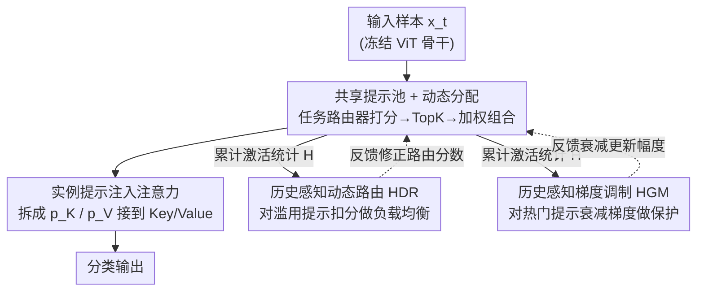

# Is Parameter Isolation Better for Prompt-Based Continual Learning?

**会议**: CVPR 2026  
**论文**: [CVF Open Access](https://openaccess.thecvf.com/content/CVPR2026/html/Li_Is_Parameter_Isolation_Better_for_Prompt-Based_Continual_Learning_CVPR_2026_paper.html)  
**代码**: 待确认（作者声明将开源）  
**领域**: 持续学习 / 表示学习  
**关键词**: 持续学习, 提示学习, Mixture-of-Experts, 类增量学习, 灾难性遗忘

## 一句话总结
针对主流"每个任务独占一组提示"的提示式持续学习范式，本文提出共享提示池 + 任务感知稀疏门控路由的 Hash 框架，再用一个基于历史激活统计的调制器同时压制被滥用的提示并保护重要提示，在 4 个类增量基准上一致超过静态分配方法且参数量更省。

## 研究背景与动机
**领域现状**：提示式持续学习（prompt-based continual learning）是当前缓解灾难性遗忘的主流方向之一——冻结预训练骨干（如 ViT-B/16），只为每个新任务优化少量提示（prompt），既参数高效又天然支持知识隔离。DualPrompt、HiDe-Prompt、NoRGa 等方法都沿用"给每个任务分配一组固定提示"的设定。

**现有痛点**：作者把这种做法称作"参数隔离"（parameter isolation），并指出它有两个硬伤。其一，刚性分配虽简化了任务管理，却彻底切断了相关任务之间的参数共享，面对容量需求各异的异构任务序列缺乏弹性，难以支撑长序列的终身学习。其二，静态分配导致模型容量利用低效——不同任务的相关性和复杂度差异很大，固定数量、固定归属的提示无法自适应地匹配这种差异。

**核心矛盾**：问题根子在于"知识隔离"和"知识复用"被对立起来。完全隔离保证了不遗忘，却牺牲了相关任务间的正向迁移和参数效率；可一旦放开共享，又会因为某些提示被反复复用、过度更新而重新引入遗忘。

**本文目标**：构造一个既能跨任务共享、又不会因共享而遗忘的提示框架，分解为两个子问题——(i) 如何让提示在任务间灵活复用而非各占山头；(ii) 共享之后如何防止热门提示被过度更新导致旧知识被覆盖。

**切入角度**：作者把提示池看作一组"专家"（每个提示专精某类特征模式或任务属性），用 Mixture-of-Experts（MoE）的稀疏路由思路动态组合提示，从而在"专精"与"泛化"之间连续过渡，而不是非此即彼地隔离。

**核心 idea**：用"全局共享提示池 + 任务感知稀疏门控"替代"每任务固定提示"，并引入历史激活统计来调制路由分数和梯度幅度，让被频繁使用的提示既被均衡掉、又被保护住。

## 方法详解

### 整体框架
方法名 Hash（History-Aware prompt-SHaring）面向非样本回放的类增量学习（non-exemplar CIL）：模型按序学习一串分类任务 $\{T_1,\dots,T_T\}$，每个任务引入一组不相交的新类，训练时只能看当前任务数据，测试时要在所有已见类的并集上分类且**不提供任务标识**。

整体管线是：输入样本先经任务专属路由器在全局提示池里打分，TopK 选出少量提示并加权组合成实例级提示，注入到冻结 ViT 各注意力层的 Key/Value，最终输出分类。与之并行的是一条反馈回路——训练中累计记录每个提示的历史激活次数，再把这些统计量反馈给路由（压低被滥用提示的分数）和梯度（衰减热门提示的更新幅度），形成"用得越多、越受约束"的动态平衡。

### 关键设计

**1. 共享提示池 + 任务感知稀疏门控：把"每任务独占"换成"全局按需组合"**

这一设计直接针对"参数隔离切断了跨任务共享"的痛点。提示池 $P=\{p_1,\dots,p_K\}$ 是全局共享的，每个提示 $p_k\in\mathbb{R}^{L_p\times d}$ 当作一个专家；为每个任务配一个专属路由器 $R_t$ 做选择。对样本 $x_i^{(t)}$，路由器用权重矩阵 $W_r$ 算相关性分数 $\tilde{s}^{(t)}=x_i^{(t)}W_r/\sqrt{d}$，沿序列维平均得到长度为 $K$ 的分数向量 $s$，TopK 选出子集 $\mathcal{K}(s)$，对被选提示做 softmax 归一化得权重 $\omega_k=\exp(s_k)/\sum_{j\in\mathcal{K}(s)}\exp(s_j)$，加权组合出实例级提示 $\tilde{p}=\sum_{k\in\mathcal{K}(s)}\omega_k p_k$。$\tilde{p}$ 被拆成 $\tilde{p}_K,\tilde{p}_V$ 分别拼接到每个注意力层的 Key/Value 矩阵前面。

与静态分配相比，本设计把"为每个任务优化一个固定子集 $P_t$"的孤立目标，换成在共享池上构造输入自适应提示 $\tilde{p}(x)$ 的目标，从而得到一个平滑、可组合的提示空间，促进提示复用、扩展表征容量、提升对新类的泛化。作者用激活权重的熵 $H(\omega)=-\sum_k\omega_k\log\omega_k$ 刻画激活多样性：熵高说明面对复杂输入时模型把注意力分散到多个提示，熵低则对简单输入选择性激活，实现容量的弹性分配。一个附带好处是，即便算上路由器，总参数量仍低于 HiDe-Prompt。

**2. 历史感知动态路由（HDR）：用累计激活做负载均衡，防止少数提示被滥用**

共享池虽提升了新类泛化，却会让某些提示因被反复复用而过度更新，长期看反而加剧遗忘。HDR 记录每个提示到任务 $t$ 为止的累计激活次数 $H_e^t$，对其相关性分数施加惩罚函数 $\varphi$：$\tilde{s}_e=s_e-\varphi(H_e^t)$。$\varphi$ 可取对数 $\log(1+H_e^t)$、多项式 $(H_e^t)^\alpha$ 等；默认实现用一个对 TopK 高频专家的分段扣分——若 $e$ 属于累计激活最高的集合 $A_t$ 则 $\tilde{s}_e=s_e-\delta$（$\delta>0$ 为固定扣减量），否则不变。这相当于以贪心方式对路由施加稀疏正则，把过热的提示主动"降温"，逼迫路由去激活更均衡的子集。论文 Fig.1(c) 显示该机制让专家激活频率分布更均衡。

**3. 历史感知梯度调制（HGM）：对频繁激活的提示衰减梯度，把重要知识"焊死"**

负载均衡解决"选择"问题，但被频繁选中的提示在反向传播时仍会被大幅更新、覆盖旧知识。HGM 从"更新"侧补刀：用单调衰减函数 $\psi:\mathbb{R}^+\to(0,1]$ 调制梯度 $\tilde{g}_e=\psi(H_e^t)\cdot g_e$，可取倒数缩放 $1/(1+\zeta h)$ 或指数衰减 $\exp(-\zeta h)$；实践用对 TopK 专家的分段常数 $\psi(H_e^t)=\beta$（$0<\beta<1$）、其余为 1，等价于给高频专家降学习率，隐式施加参数稳定性约束。

作者还从正则化视角统一了 HDR 与 HGM：路由可写成"最大化分数同时惩罚滥用"的简约最小化 $\min_p \sum_e p_e(-s_e)+\sum_e p_e\varphi(H_e^t)$，TopK 即熵正则下的稀疏近似；梯度调制则近似最小化一个历史感知正则项 $R_e(\theta_e;H_e^t)=\tfrac{1}{2}H_e^t\lVert\theta_e-\theta_e^t\rVert^2$——激活越多、对偏离旧参数的惩罚越重，自然对应"选择性冻结被高度依赖的专家"的直觉。两者都不改动核心架构，只在激活策略层面调节，兼顾适应性与稳定性。

### 损失函数 / 训练策略
任务 $T_t$ 阶段以监督分类损失 $L_{cls}$ 在当前数据 $D_t$ 上优化，同时维持对历史任务 $T_{1:t-1}$ 的性能。提示选择在训练和推理都按实例级进行。实现上：ViT-B/16 骨干（默认 Sup-21K 预训练），Adam（$\beta_1=0.9,\beta_2=0.999$），batch size 128，沿用 HiDe-Prompt 的 epoch 配置，单张 A100，结果对 3 个随机种子取平均；实验验证测试结果对 batch size 不敏感。

## 实验关键数据

> 评测指标：**FAA**（Final Average Accuracy，学完最后一个任务后在所有任务上的平均准确率）、**CAA**（Cumulative Average Accuracy，对各阶段历史性能的累计平均）、**FM**（Forgetting Measure，遗忘度，越低越好）。

### 主实验
Split CIFAR-100 与 Split ImageNet-R（均 10 任务，Sup-21K 预训练 ViT-B/16）主结果：

| 数据集 | 方法 | FAA↑ | CAA↑ | FM↓ |
|--------|------|------|------|-----|
| CIFAR-100 | HiDe-Prompt | 92.61 | 94.03 | 1.50 |
| CIFAR-100 | NoRGa | 94.48 | 95.83 | 1.44 |
| CIFAR-100 | **Hash（本文）** | **95.02** | **95.97** | 1.67 |
| ImageNet-R | CPG | 78.63 | 81.04 | 7.18 |
| ImageNet-R | NoRGa | 75.40 | 79.52 | 4.59 |
| ImageNet-R | **Hash（本文）** | **79.02** | **82.96** | **2.63** |

CIFAR-100 上 FAA 比 NoRGa 高 0.54%，ImageNet-R 上高 3.66%；在共享类（"Shared"列标记）方法里 Hash 把 FM 压到 2.63，明显优于同为共享池的 CPG（7.18）和 OVOR（7.16），说明历史感知调制在放开共享后仍能控住遗忘。

补充基准：Split CUB-200 FAA 91.34（最强基线 90.90，+0.44）、5-Datasets FAA 95.12（+0.96）、CORe50 在 0 buffer 下 AN 87.94（超过 PINA 86.74）。长序列（20 任务）下 CIFAR-100 FAA 94.07 / ImageNet-R 76.57，仍居首，验证长程稳定性。

### 消融实验
三大组件在 CIFAR-100 / ImageNet-R 上的 FAA：

| 配置 | CIFAR-100 FAA | ImageNet-R FAA | 说明 |
|------|---------------|----------------|------|
| 仅 MoE 共享池 | 88.56 | 76.99 | 只有动态分配，无历史感知 |
| MoE + HDR | 94.15 | 78.10 | 加路由惩罚做负载均衡 |
| MoE + HGM | 93.86 | 77.56 | 加梯度衰减保护提示 |
| Full（MoE+HDR+HGM） | 95.02 | 79.02 | 完整模型 |

### 关键发现
- 贡献最大的是历史感知调制：从仅 MoE 的 88.56 到加 HDR 的 94.15，CIFAR-100 上单加路由惩罚就拉升约 5.6%，说明负载均衡是放开共享后控住遗忘/提升精度的主力；HDR 与 HGM 互补，二者齐上才到 95.02。
- 提示注入位置敏感性（Table 6）：默认注入浅层 1–4 层效果最好（CIFAR 95.02），全层 1–12（94.81）或仅深层 5–12（94.67）略逊，单层注入（93.28/93.01）明显掉点，说明少数浅层提示已足够、过度注入反而稀释。
- 跨数据集、跨预训练范式（附录含 iBOT/DINO/MoCo）一致领先，表明共享提示学习的优势不依赖特定预训练。

## 亮点与洞察
- 把"参数隔离 vs 参数共享"这一持续学习老问题，重新框定为"路由选择 + 更新约束"两个可独立调控的旋钮：HDR 管"选谁"、HGM 管"怎么更新"，二者都靠同一份累计激活统计驱动，设计上干净且可解释。
- 历史感知正则视角 $R_e=\tfrac{1}{2}H_e^t\lVert\theta_e-\theta_e^t\rVert^2$ 给出了"用得越多越该冻结"的形式化解释——这其实把 EWC 式的重要性加权正则迁移到了提示池的专家粒度，是个可迁移的思路：任何 MoE/路由系统想防止专家退化都能借用"激活历史→更新约束"这一套。
- 共享池在算上路由器后参数量仍低于 HiDe-Prompt，说明"共享 + 稀疏激活"在精度和参数效率上同时占优，而非用参数换性能。

## 局限与展望
- HDR/HGM 的默认实现都是对 TopK 专家的**分段常数**惩罚（固定扣减 $\delta$、固定缩放 $\beta$），属于连续惩罚的离散近似；这些阈值/系数是超参，论文未充分展示其对不同序列长度的敏感性，自适应化是自然的改进点。
- 评测集中在图像分类类增量（CIFAR/ImageNet-R/CUB/CORe50），未覆盖检测/分割等更复杂的持续学习场景，跨任务类型的可迁移性待验证。
- 历史激活统计随任务数单调累积，超长序列下早期高频提示可能被长期压制，是否会造成"早学的提示被边缘化"值得进一步分析。⚠️ 这是笔者推测，原文未专门讨论。

## 相关工作与启发
- **vs HiDe-Prompt / DualPrompt（静态分配）**：它们给每个任务分配固定提示子集、彻底隔离知识；本文用全局共享池 + 稀疏门控做输入自适应组合，既能正向迁移又更省参，正面回答了标题"参数隔离是否更好"——不是。
- **vs CPG / L2P / CODA-Prompt（共享池）**：同样用共享池 + 动态选择，但 CPG 靠正交投影约束防漂移、OVOR 用单一共享提示 + 虚拟离群正则；本文的差异在于显式引入"历史激活统计"同时驱动路由惩罚和梯度调制，在共享池方法里把 FM 压得最低。
- **vs NoRGa**：NoRGa 把提示视作隐式专家、用非线性残差门控增强灵活性但仍是每任务分配；本文把 MoE 真正落到共享池上并补了遗忘控制，长序列和 ImageNet-R 上优势更明显。

## 评分
- 新颖性: ⭐⭐⭐⭐ 共享提示池本身非首创，但"历史激活统计同时驱动路由惩罚 + 梯度调制"并给出正则化统一解释，是扎实的增量创新。
- 实验充分度: ⭐⭐⭐⭐⭐ 4+ 基准、长序列、多预训练范式、组件/位置消融齐全，统计严谨。
- 写作质量: ⭐⭐⭐⭐ 动机清晰、正则视角加分；公式符号偶有冗余。
- 价值: ⭐⭐⭐⭐ 对提示式持续学习社区给出"放开共享 + 历史约束"的可复用范式，工程上参数更省。

<!-- RELATED:START -->

## 相关论文

- [\[ECCV 2024\] PromptCCD: Learning Gaussian Mixture Prompt Pool for Continual Category Discovery](../../ECCV2024/self_supervised/promptccd_learning_gaussian_mixture_prompt_pool_for_continual_category_discovery.md)
- [\[CVPR 2026\] Semantic-Guided Global-Local Collaborative Prompt Learning for Few-Shot Class Incremental Learning](semantic-guided_global-local_collaborative_prompt_learning_for_few-shot_class_in.md)
- [\[CVPR 2026\] CHEEM: Continual Learning by Reuse, New, Adapt and Skip -- A Hierarchical Exploration-Exploitation Approach](cheem_continual_learning_by_reuse_new_adapt_and_skip_--_a_hierarchical_explorati.md)
- [\[CVPR 2026\] Decouple Your Discovery and Memory in Continual Generalized Category Discovery](decouple_your_discovery_and_memory_in_continual_generalized_category_discovery.md)
- [\[AAAI 2026\] CATFormer: When Continual Learning Meets Spiking Transformers With Dynamic Thresholds](../../AAAI2026/self_supervised/catformer_when_continual_learning_meets_spiking_transformers_with_dynamic_thresh.md)

<!-- RELATED:END -->
