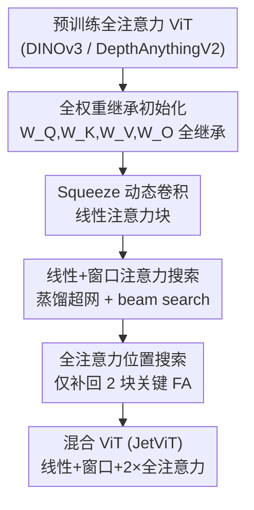

# JetViT: Efficient High-Resolution Vision Transformer with Post-Training Attention Search

**会议**: CVPR 2026  
**arXiv**: [2605.26636](https://arxiv.org/abs/2605.26636)  
**代码**: 待确认（作者称将开源）  
**领域**: 自监督 / 表示学习 · 高效 ViT  
**关键词**: 混合注意力, 线性注意力, 后训练搜索, 视觉基础模型, 高分辨率推理

## 一句话总结
JetViT 提出 **Post-Training Attention Search**：不从头训练，而是把已预训练好的全注意力 ViT（DINOv3、DepthAnythingV2）通过权重继承 + 蒸馏 + beam search，转换成由「线性 + 窗口 + 极少量全注意力」混合而成的高效 ViT，在 H100 上把高分辨率推理吞吐提升至 $1.79\times$、延迟降低 $44.81\%$，且精度不掉。

## 研究背景与动机
**领域现状**：以 DINOv3、DepthAnythingV2 为代表的视觉基础模型靠全注意力 ViT 拿到了密集预测（分割、深度）的 SOTA，特征质量极高——DINOv3 只要接一个线性头就能跨任务迁移。但自注意力对序列长度是 $\mathcal{O}(N^2)$ 复杂度，处理高分辨率图（如 $1024\times2048$）时 token 数巨大，推理又慢又吃显存。

**现有痛点**：为提升效率，社区设计了大量高效注意力（线性注意力、窗口注意力）和新架构（Vision Mamba 等）。但这些高效架构几乎只在 ImageNet-1K 这类小基准上验证过，很少被搬到大规模视觉基础模型上。原因很现实——这些基础模型要在海量（往往是私有）数据上从头预训练，成本高到普通研究者根本玩不起，于是「换个高效架构重训一遍」这条路被堵死。

**核心矛盾**：高效架构的探索 和 基础模型的预训练成本 之间存在死结——想用更快的注意力，就得重新预训练；而重新预训练既缺数据又烧不起算力。

**本文目标**：在**不重新预训练、不需要私有数据**的前提下，把现成的全注意力基础模型变成高效混合模型，同时保住原模型的精度。

**切入角度**：作者观察到——预训练 ViT 里大量全注意力块其实是冗余的，真正需要全局建模能力的只有少数几层。那么与其设计新架构从头训，不如**继承原模型的全部权重**，把冗余的全注意力块替换成线性/窗口注意力，只保留少数关键的全注意力块。

**核心 idea**：把「设计高效 ViT」从 pre-training 阶段挪到 **post-training 阶段**——用一个两阶段的蒸馏 + 搜索流程，逐块判定每个全注意力块该换成线性还是窗口注意力、哪几块必须保留全注意力。

## 方法详解

### 整体框架
JetViT 的核心是 **Post-Training Attention Search**：输入是一个预训练好的全注意力 ViT（teacher），输出是一个精度对齐、推理更快的混合 ViT（线性 + 窗口 + 2 个全注意力块）。整个流程靠三件事支撑——一个低开销的线性注意力块、一个把全部注意力权重也继承下来的初始化策略、以及两阶段 beam search 逐步把全注意力替换掉再补回最关键的几块。

具体地，先用「Squeeze Dynamic Convolution 线性注意力块」作为高效注意力的基础模块；然后 **Step 1** 在「线性 vs 窗口」之间搜索最优组合，得到一个 $\mathcal{O}(N)$ 复杂度、但精度还差一截的纯高效 ViT；**Step 2** 再在这个高效 ViT 上搜索「该把哪几块换回全注意力」，发现只需补 2 块全注意力就能把精度拉回 teacher 水平。全程用 teacher 做特征蒸馏，且高效块的 $W_Q, W_K, W_V, W_O$ 全部从原模型继承。

### 关键设计

**1. JetViT 线性注意力块：用 Squeeze 动态卷积补回局部信息又几乎零开销**

痛点是：朴素 ReLU 线性注意力虽然把复杂度降到 $\mathcal{O}(N)$，但精度掉得很惨。线性注意力用核函数 $\phi(\cdot)$ 把相似度 $\text{Sim}(Q,K)=\exp(QK^\top/\sqrt{d})$ 近似成 $\phi(Q)\phi(K)^\top$，靠重排计算顺序避开 $N\times N$ 矩阵；但 ReLU 这种简单核会损失表达力。前人有两招补救：在 $V$ 上加深度可分卷积（DWC）补局部信息，以及用带 focusing factor $p$ 的核 $\phi(x)=\frac{\|x\|}{\|x\|^p}x^p$ 锐化注意力图，整体写成 $O=\phi(Q)\phi(K)^\top V + \text{DWC}(V)$。作者的消融发现：DWC 带来的提升最大，而花哨的核函数收益微乎其微却让训练慢 37%。

于是作者借鉴 LLM 里的动态卷积，但发现「逐 token 生成卷积核」开销爆炸（吞吐掉 40%）。他们改成 **Squeeze Dynamic Convolution**：不给每个 token 各生成一个核，而是对 $V$ 做平均池化得到全局特征，用一个两层 SiLU 的轻量 MLP 作为核生成器，**产生一个全局共享的动态卷积核**去替换 DWC 的静态权重。这样既保留了 ReLU 核（几乎零额外开销），又用动态核拿到了比静态 DWC 更好的表达。Tab.1 显示它把 mIoU 从 65.17 提到 73.12，而训练步时间只从 212ms 略升，远好于 token-wise 动态卷积（120ms 训练步、吞吐反而高但精度无法对齐）。相比 Vision Mamba 需要前后双向扫描（计算翻倍）、且其状态空间参数化无法直接继承全注意力权重，这个块是单次前向、且天生支持权重继承

**2. 全权重继承初始化：让高效块直接吃下 teacher 的注意力知识**

前人把全注意力转线性/混合时，通常只继承 MLP 权重，而把高效注意力块的 $W_Q, W_K, W_V, W_O$ 随机初始化——理由是结构变了权重「没法对应」。作者反其道而行：**把全部注意力权重 $W_Q, W_K, W_V, W_O$ 也一并继承过来**。直觉是线性/窗口注意力和全注意力共享同一套 QKV 投影语义，硬随机初始化等于扔掉 teacher 在投影矩阵里编码的知识。

实验上这一步是收敛速度和最终精度的关键：在纯线性注意力 ViT 上，继承全部权重比只继承 MLP 权重在 Cityscapes 分割上高出约 **+3% mIoU**，且训练 loss 收敛明显更快。正是因为权重能直接继承，整个搜索才能在 post-training 阶段低成本完成，而不必从头预训练

**3. 线性+窗口注意力搜索（Step 1）：先用两种高效注意力把骨架搭到尽量好**

窗口注意力（WA）把特征图切成不重叠窗口、窗口内各算自注意力，通常要和全注意力交替才能补全局上下文。作者要问：线性注意力（LA）能不能替掉昂贵的全注意力来做全局聚合，从而搭出一个**只含 LA + WA**的骨架？做法是从预训练全注意力 ViT 出发，构建一个**每层含两个候选注意力块的超网（supernetwork）**，用 teacher 做特征蒸馏训练超网（每步随机采一条子网做前后向）；训完用 **beam search** 找 LA/WA 的最优组合。

搜索是 stage-wise 贪心的，利用「线性 > 窗口 > 全注意力」的已知效率序：从全线性配置出发，逐步把线性块替成窗口块直到精度收益见顶。Tab.2 显示，搜出的 LA+WA 混合（mIoU 66.43）明显优于纯线性（61.48）和纯窗口（65.14），把全注意力（68.74）的大部分性能找了回来，但仍差一截——这正是 Step 2 要补的

**4. 全注意力位置搜索（Step 2）：只补回 2 块关键全注意力就追平 teacher**

Step 1 的高效骨架和 teacher 之间还有 gap。借鉴混合语言模型的经验——保留少数全注意力块对精度至关重要——作者在 Step 1 的骨架上再建一个超网：每层含「Step 1 搜到的高效块」和「全注意力块」两个候选，同样蒸馏 + beam search，从全高效配置出发逐步把高效块换回全注意力，直到精度收敛到 teacher。结论很反直觉：**只需 2 块全注意力**就足以恢复性能。

更妙的是位置有规律：全注意力该放哪取决于下游怎么用特征。DepthAnythingV2 从 4 个中间层取特征喂 DPT 头，搜索就把全注意力放在中-深层（第 13、17 层）；DINOv3 直接用最后一层训线性头做分割，搜索就选靠后的层（第 14、22 层）。而且**第一个注意力块永远是线性注意力**，说明线性注意力在浅层扮演了类似 CNN 卷积的「提取基础特征」角色。Fig.4 还验证：先做 Step 1（三种注意力都用）比直接「线性+全」或「窗口+全」两类搜索更省全注意力块、结构更高效

### 损失函数 / 训练策略
全程用预训练全注意力 ViT 作为 teacher 做**特征蒸馏**：蒸馏对齐的是下游任务实际用到的特征——线性头分割只蒸最后一层，DPT 头深度估计则蒸 4 个中间层。超网训练采用 single-path 采样（每步随机激活一条子网做前后向）。搜索目标直接用下游指标（分割 mIoU、深度 DA2K）做 beam search 的评分。对 DepthAnythingV2，两阶段搜索完后还按其原训练策略微调：用最大的 DepthAnythingV2（纯合成数据训练）给无标注真实图（SA1B、BDD100K、COCO 等）生成伪深度标签，仅在伪标签上训练。

## 实验关键数据

### 主实验：语义分割（DINOv3 骨架，Cityscapes / ADE20K）

| 模型 | 规格 | 延迟(ms)↓ | 吞吐(samples/s)↑ | Cityscapes mIoU↑ | ADE20K mIoU↑ |
|------|------|-----------|------------------|------------------|--------------|
| DINOv3 (teacher) | Base | 12.86 | 81.52 | 74.56 | 50.32 |
| JetViT-DINOv3 | Base (0 FA) | 7.37 | 153.94 | 71.87 | 48.84 |
| JetViT-DINOv3 | Base (2 FA) | 8.27 | 133.68 | 75.01 | 49.85 |
| DINOv3 | Large | 35.07 | 29.53 | 79.84 | 52.57 |
| JetViT-DINOv3 | Large (2 FA) | 18.77 | 57.90 | 79.88 | 52.31 |
| DINOv3 | 7B | 316.79 | 3.26 | 81.92 | 54.72 |
| JetViT-DINOv3 | 7B (2 FA) | 221.08 | 4.80 | 81.92 | 54.86 |

补 2 块全注意力（2 FA）后，JetViT-DINOv3 在各规格上 mIoU 与 teacher 持平甚至略高（Base 75.01 vs 74.56），而 Base 延迟从 12.86ms 降到 8.27ms、吞吐近乎翻倍。

### 主实验：单目深度估计（DepthAnythingV2 骨架）

| 模型 | 规格 | 延迟(ms)↓ | 吞吐↑ | DA2K Acc↑ | CityScapes $\delta_1$↑ |
|------|------|-----------|-------|-----------|------------------------|
| DepthAnythingV2 (teacher) | Large | 60.76 | 14.20 | 97.60 | 0.872 |
| JetViT-DepthAnything | Large (2 FA) | 32.63 | 32.13 | 97.84 | 0.876 |
| DepthAnythingV2 | Giant | 164.25 | 6.35 | 97.94 | 0.876 |
| JetViT-DepthAnything | Giant (2 FA) | 90.65 | 11.39 | 98.03 | 0.879 |

Large 规格延迟从 60.76ms 砍到 32.63ms（约 $1.79\times$ 吞吐、$44.81\%$ 延迟下降），DA2K、$\delta_1$ 等指标反而略优于 teacher。

### 消融实验

| 配置（DINOv3 蒸馏，Cityscapes） | mIoU | 说明 |
|---------------------------------|------|------|
| 纯全注意力 (teacher) | 68.74 | 精度上限，但最慢 |
| 纯线性注意力 | 61.48 | 最快但掉点严重 |
| 纯窗口注意力 | 65.14 | 居中 |
| LA + WA（Step 1 搜索） | 66.43 | 恢复大部分性能，仍有 gap |

| 线性块设计（DINOv3 teacher 蒸馏） | mIoU | 训练步时间(s) | 说明 |
|----------------------------------|------|---------------|------|
| Baseline: ReLU 线性注意力 | 65.17 | 0.198 | 起点 |
| + 静态 DWC on V | 71.82 | 0.227 | DWC 提升最大 |
| + DWC + Focusing Factor | 72.48 | 0.312 | 花哨核收益小、慢 37% |
| + Squeeze Dynamic DWC（本文） | **73.12** | 0.232 | 最佳精度且几乎零额外开销 |

### 关键发现
- **冗余远超想象**：24 层 ViT-Large 只保留 2 块全注意力就能追平 teacher，说明绝大多数全注意力块是冗余的。
- **全注意力放哪取决于下游用法**：DPT 头（取中间层）→ 全注意力放中-深层（13、17）；线性头（取末层）→ 放靠后层（14、22）。第一个块永远是线性注意力，类似 CNN 浅层卷积。
- **权重继承是关键**：继承全部注意力权重比只继承 MLP 权重高约 +3% mIoU，且收敛更快。
- **成本极低**：Post-Training Attention Search 仅需 DINOv3-7B 预训练成本的约 1/68。

## 亮点与洞察
- **把高效架构探索从 pre-training 挪到 post-training**：这是最核心的范式转换——不再「设计新架构 → 从头预训练」，而是「继承现成基础模型 → 逐块搜索替换」，绕开了私有数据和天价算力的门槛，让普通研究者也能改造 SOTA 基础模型。
- **Squeeze Dynamic Convolution 的「全局共享核」折中很巧**：逐 token 动态核太贵、静态 DWC 又表达不足，对 $V$ 池化后生成一个全局共享动态核，恰好卡在「比静态强、比逐 token 便宜得多」的甜点上。
- **两阶段搜索的顺序有讲究**：先在两种高效注意力间搭好骨架（Step 1）再补全注意力（Step 2），比一上来就「高效+全」两类搜索更省全注意力块——先把便宜的能力榨干，再用昂贵的能力补缺口。
- **搜出的结构本身是可迁移的设计经验**：「全注意力放在靠近特征抽取层」「浅层用线性」这些规律可直接指导未来手工设计混合 ViT。

## 局限与展望
- **线性注意力块未做 kernel 优化**：作者明确说线性块纯 PyTorch 实现、无自定义 kernel，实际加速可能被低估，反过来也意味着工程上还有提速空间。
- **依赖一个高质量 teacher**：整个流程的精度上界就是 teacher，本质是「无损压缩 + 加速」而非超越，遇到本身就弱的基础模型收益有限。
- **搜索仍需蒸馏训练超网**：虽然比从头预训练便宜 ~68×，但每个新骨架/新下游任务都要重训超网 + beam search，不是即插即用的零成本转换。
- **任务覆盖偏密集预测**：主实验集中在分割与深度，分类/检测/视频仅在补充材料给出，跨任务普适性还需更系统验证。

## 相关工作与启发
- **vs 从头设计高效 ViT（线性注意力 / 窗口注意力 / Vision Mamba）**：它们在 pre-training 阶段换架构，受限于算力和数据只能在小基准验证；本文在 post-training 阶段改造现成基础模型，直接在高分辨率密集预测任务上对齐 SOTA。Vision Mamba 还因双向扫描翻倍计算、状态空间参数化无法继承全注意力权重而吃亏。
- **vs 全注意力转线性/混合（仅继承 MLP 权重）**：前人把高效注意力块的 QKVO 随机初始化、架构高度受限，无法充分利用 teacher 知识；本文继承全部注意力权重（+3% mIoU）、且用搜索自动决定结构。
- **vs 细粒度 NAS**：传统 ViT NAS 在极细搜索粒度上展开，搜索空间巨大、成本高；本文只在「注意力块类型」这一粗粒度上搜，配合权重继承大幅简化搜索、实现有效知识迁移。
- **vs MiDaS V3（Swin 骨架）**：MiDaS 用窗口化的 Swin 更高效但深度精度明显下降；JetViT-DepthAnything 用更少的全局全注意力层，在精度和效率上同时反超。

## 评分
- 新颖性: ⭐⭐⭐⭐⭐ 把高效架构探索从 pre-training 迁到 post-training，权重继承 + 两阶段注意力搜索的组合很有原创性
- 实验充分度: ⭐⭐⭐⭐ 覆盖分割/深度两大任务、多规格（Base→7B/Giant）、多消融，但分类检测仅在补充材料
- 写作质量: ⭐⭐⭐⭐ pipeline 与消融讲得清晰，图表充分；部分实现细节（kernel、搜索预算）较略
- 价值: ⭐⭐⭐⭐⭐ 让任意现成视觉基础模型低成本变快且不掉点，工程落地价值高

<!-- RELATED:START -->

## 相关论文

- [\[CVPR 2026\] Chain-of-Models Pre-Training: Rethinking Training Acceleration of Vision Foundation Models](com_pt_chain_of_models_pretraining.md)
- [\[ICML 2025\] PDE-Transformer: Efficient and Versatile Transformers for Physics Simulations](../../ICML2025/self_supervised/pde-transformer_efficient_and_versatile_transformers_for_physics_simulations.md)
- [\[CVPR 2026\] Graph Attention Prototypical Network for Robust Few-Shot Classification](graph_attention_prototypical_network_for_robust_few-shot_classification.md)
- [\[NeurIPS 2025\] Spend Wisely: Maximizing Post-Training Gains in Iterative Synthetic Data Bootstrapping](../../NeurIPS2025/self_supervised/spend_wisely_maximizing_post-training_gains_in_iterative_synthetic_data_bootstra.md)
- [\[ECCV 2024\] Efficient Image Pre-Training with Siamese Cropped Masked Autoencoders](../../ECCV2024/self_supervised/efficient_image_pre-training_with_siamese_cropped_masked_autoencoders.md)

<!-- RELATED:END -->
