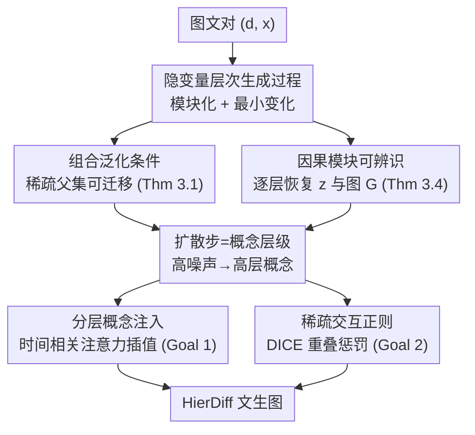

# Learning by Analogy: A Causal Framework for Compositional Generalization

**会议**: CVPR 2026  
**论文**: [CVF Open Access](https://openaccess.thecvf.com/content/CVPR2026/html/Kong_Learning_by_Analogy_A_Causal_Framework_for_Compositional_Generalization_CVPR_2026_paper.html)  
**代码**: 无  
**领域**: 自监督 / 因果表示学习 / 扩散模型  
**关键词**: 组合泛化, 因果模块化, 隐变量层次模型, 可辨识性, 文生图扩散

## 一句话总结
本文用因果语言（模块化 + 最小变化原则）把"靠类比做组合泛化"这一人类认知形式化成一个隐变量层次生成过程，证明了该结构既能支撑复杂概念交互的组合泛化、又可从图文对中可辨识地恢复，并据此把扩散时间步解读为概念层级、做出 HierDiff，在 DPG-Bench 上从 ELLA 的 74.91 提升到 79.28。

## 研究背景与动机
**领域现状**：组合泛化（compositional generalization）——把学过的概念重新组合成训练中没见过的新组合（如只见过"孔雀"和"米"，要生成"孔雀吃米"）——被视为人类智能的标志，也是文生图模型最常翻车的地方。近年因果表示学习开始为它寻找"可证明"的条件。

**现有痛点**：已有的可证明框架对概念之间的交互方式做了过强的假设。一类工作（Brady 等、Wiedemer 等）假设不同概念作用在互不重叠的像素区域、彼此不交互；Lachapelle 等假设概念在像素空间是**加性**叠加 $x:=\sum_i g_i(z_i)$；Brady 等后续放宽到二阶多项式。这些参数化形式都无法刻画"喙 & 米"这种真实世界里被学习和迁移的复杂非参数交互。

**核心矛盾**：组合泛化的真正难点不在于"学了哪些概念"，而在于**概念之间因果交互的稀疏结构**有没有被正确建模并可辨识地恢复。加性/多项式假设既丢掉了概念的层次性，又把交互锁死在固定函数形式里。

**本文目标**：（1）找出数据生成过程中到底什么样的隐结构能让组合泛化成立；（2）证明这种结构能从可观测的图文对里被唯一恢复（可辨识）；（3）把抽象理论落到一个能跑的扩散模型上。

**切入角度**：从人类"画类比"的认知出发——没见过孔雀吃米，但能把它关联到"鸡吃米"，因为孔雀和鸡共享喙、翅膀等底层概念，而"喙 & 米 = 啄"这个交互模块可以从鸡迁移到孔雀。这对应因果里的两条原则：**模块化**（系统可拆成自治、可迁移的模块）和**最小变化**（高层概念之间只在少量底层概念上有差异）。

**核心 idea**：用一个隐变量层次因果模型同时编码"概念分层"和"交互模块"，证明*稀疏的层次结构 ⇒ 组合泛化*且*该结构可辨识*，再把扩散去噪链当成这个层次过程来实现。

## 方法详解

### 整体框架
本文是"理论 + 实现"两段式。理论侧定义了一个隐变量层次数据生成过程：文本描述 $d$（离散，控制"孔雀/米"是否出现）→ 高层概念 $z_1$ → 逐层往下的连续隐概念 $z_2,\dots,z_L$（喙、尾巴、"喙&米"等）→ 图像 $x$，整体是一条马尔可夫链 $d\to z_1\to\cdots\to z_L\to x$，每个非根变量 $v:=g_v(\mathrm{Pa}(v),\epsilon_v)$ 由父节点加独立外生噪声生成。两个核心定理：组合条件（Thm 3.1，什么时候新组合可生成）和因果模块辨识（Thm 3.4，这套隐结构能否从 $p(d,x)$ 唯一恢复）。

实现侧把抽象的"层级"对应到扩散时间步：高噪声步 $t$ 大 → 只保留高层概念，低噪声步 → 注入底层细节。由此做出 HierDiff，包含两件事：按步注入不同粒度的概念（时间相关交叉注意力插值）、对底层概念的注意力图施加稀疏正则。

### 关键设计

**1. 隐变量层次生成过程：把"分层 + 模块化交互"写进数据假设**

针对加性/多项式假设丢掉层次和复杂交互的痛点，本文不再假设图像由概念**像素相加**得到，而是定义一棵因果图 $G:=(V,E)$，$V:=d\cup z\cup x$，变量按层 $z:=[z_1,\dots,z_L]$ 排列，文本 $d$ 直接决定高层概念 $z_1$（$d_i=0$ 表示该概念缺席、对应退化分布；不同非零值表示同一概念的不同变体），其余变量按 $v:=g_v(\mathrm{Pa}(v),\epsilon_v)$ 逐层生成。关键在于**底层模块可被多个高层概念共享**（"喙"同时是"孔雀"和"鸡"的孩子），而"喙 & 米"这类交互被建成一个**非参数**的可迁移模块 $g_z$。这样既保留了概念的层次性，又不把交互锁死成加法或多项式，才能表达"啄"这种真实交互。

**2. 组合泛化条件与稀疏性：新组合何时可生成**

针对"什么时候能外推到训练里没出现的组合"，Thm 3.1 给出充要式条件：离散组合 $d$ 可组合（$d\in\Omega_{\text{comp}}$），当且仅当对每个连续隐变量 $z$，其父节点在 $d$ 下的支撑被某个**训练支撑里**的组合 $\tilde d\in\Omega_{\text{supp}}$ 覆盖，即 $\mathrm{supp}(\mathrm{Pa}(z)|d)\subseteq\mathrm{supp}(\mathrm{Pa}(z)|\tilde d)$。直觉是：只要每个隐变量需要的输入都在某个训练样本里见过（且 $\tilde d$ 对不同 $z$ 可以不同），就能把"喙&米"从"鸡吃米"、"彩色尾巴"从"孔雀"各自拿来拼出新组合——这正是类比的形式化。由此推出**稀疏性是关键**：父集 $\mathrm{Pa}(z)$ 越小，越容易在训练支撑里找到覆盖它的 $\tilde d$，所以图越稀疏、组合能力越强。最小变化原则进一步保证高层概念只在少量模块上不同，需要迁移的模块更少，组合更可行。这条洞察直接给出了"训练时应鼓励稀疏"的理论依据。

**3. 因果模块可辨识：层次结构能从图文对里唯一恢复**

光有"稀疏层次能泛化"还不够，得能从数据里学出来，否则模型可能学到纠缠的非模块表示。Thm 3.4 在一组辨识条件（Condition 3.3：可逆性、密度光滑、同层条件独立 $p(z_{l+1}|z_l)=\prod_n p(z_{l+1,n}|z_l)$、以及"充分变化性"——对每个 $z_{l+1}$ 存在 $2n(z_{l+1})+1$ 个 $z_l$ 值使式 (2) 中由一阶/二阶对数密度导数构成的向量差线性无关）下，证明隐变量 $z_l$ 与图结构 $G$ 可被**逐分量辨识**（component-wise，每个 $\hat z_i=h_i(z_{\pi(i)})$ 只含单个真概念的信息），且只差每层内的排列。证明思路是自顶向下：先用文本 $d$ 作为变化源辨识 $z_1$，再用已辨识的 $z_1$ 辨识其孩子 $z_2$，逐层递推。相比 Kong 等只能做到"子空间辨识"（同层多个概念会被混进一个子空间，破坏可迁移性），本文利用隐变量间的非平凡交互（Condition 3.3-iv）做到了**单个概念级别**的辨识，这对组合泛化至关重要。

**4. HierDiff：把扩散步当层级 + 分层注入 + 稀疏正则**

理论怎么落地？本文把扩散模型 $\{f_t\}_{t=1}^T$ 看成一族模型，高噪声步 $t$ 大只保留高层概念、低噪声步注入底层细节，于是"时间步 ⟷ 概念层级"自然对齐（对应 Eq.1 的层次过程）。在此之上做两件事。**Goal 1 分层概念注入**：先用 LLM 把高层描述 $y$（"孔雀吃米"）拆成 $M$ 个底层局部描述 $\{y_0^{(m)}\}$，把全局交叉注意力 $A_{T-1}=\mathrm{XAttn}(x_t,u)$ 和底层注意力均值按步插值
$$A_t=(1-s(t))\cdot A_{T-1}+\frac{s(t)}{M}\sum_{m=1}^{M}A_0^{(m)},$$
其中 $s(t)$ 单调递减、$s(0)=1,s(T-1)=0$（实验取 $s(t)=\cos(\pi t/2(T-1))$），让注入信息的粒度随扩散步从粗到细平滑过渡。**Goal 2 稀疏交互正则**：用 DICE 损失惩罚底层概念注意力图之间的空间重叠
$$\mathcal L_n=\sum_{m\neq n}D\big(H_0^{(m)},H_0^{(n)}\big),\quad D(H_1,H_2)=\frac{2\,\mathrm{tr}(H_1H_2)}{\|H_1\|_1+\|H_2\|_1},$$
对应 Thm 3.1 里"稀疏父集"的实践代理。总目标 $\mathcal L=\mathcal L_d+\lambda\mathcal L_n$（$\mathcal L_d$ 为扩散 ELBO，$\lambda=10^{-4}$，$M=3$）。

## 实验关键数据

### 主实验
基线 HierDiff 从 Stable Diffusion v1.5 微调，CLIP 文本编码器换成冻结的 FLAN-T5-xl，在 LayoutSAM 数据集上训练，DPG-Bench（1065 条多概念提示，五个维度指标）上评测，结果取三个随机种子。

| 模型 | DPG 总分 | Global | Entity | Attribute | Relation | Other |
|------|---------|--------|--------|-----------|----------|-------|
| SD v1.5 | 63.18 | 74.63 | 74.23 | 75.39 | 73.49 | 67.81 |
| PixArt-α | 71.11 | 74.97 | 79.32 | 78.60 | 82.57 | 76.96 |
| Playground v2 | 74.54 | 83.61 | 79.91 | 82.67 | 80.62 | 81.22 |
| ELLA | 74.91 | 84.03 | 84.61 | 83.48 | 84.03 | 80.79 |
| **HierDiff** | **79.28** | **85.77** | **85.15** | **86.98** | **86.82** | **87.77** |

HierDiff 在全部五个维度上都领先，相对最强基线 ELLA 总分 +4.37。定性上，对"键盘躺在米色地毯上"这类提示，只有 HierDiff 正确画出"键盘"概念及其"黑色/光滑"属性，基线常整体漏掉该概念。

把实现从 U-Net 扩展到 48 亿参数的扩散 Transformer（HierDiff-DiT），DPG 达 84.9，与 DALLE 3（83.5）、FLUX-schnell（84.8）、SANA-1.5（84.7）等大模型相当，说明框架可扩展。

### 消融实验
依次去掉稀疏正则（w/o SR）与时间相关注入（w/o TD），DPG-Bench 三种子结果：

| 配置 | Global | Relation | Other | 说明 |
|------|--------|----------|-------|------|
| w/o TD | 85.15 ± 2.26 | 86.29 ± 1.03 | 85.64 ± 0.90 | 去时间依赖，退化为单一全局提示喂所有步 |
| w/o SR | 83.09 ± 2.49 | 87.14 ± 0.59 | 85.56 ± 0.60 | 去稀疏正则 |
| **HierDiff** | 85.77 ± 1.21 | 86.82 ± 0.86 | **87.77 ± 1.45** | 完整模型 |

⚠️ 缓存中各维度数字有 OCR 错位，上表已尽量按原文对齐，个别小数以原文为准。

### 关键发现
- **时间依赖帮关系理解**：去掉时间相关注入后，"Relation" 维度从 87.14 掉，模型把"菠萝"和"啤酒"混成一团，说明把概念按层级在不同步注入有助于组织多概念关系。
- **稀疏正则帮概念分离**：无稀疏约束时模型把两个瓶子的注意力图糊到一起；加上 DICE 重叠惩罚后两个局部提示的注意力图重叠区显著减小，能分别控制各概念。
- **理论 ⟷ 实践对账**：作者逐条把实现对应回条件——扩散链对应层次过程（Cond 3.3-iii），$\mathcal L_n$ 对应稀疏连通（Thm 3.1），时间索引模型提供层级相关变换（Eq.1），去噪重建目标促可逆性（Cond 3.3-i）。
- 跨步可视化"鸡""米"两个局部注意力随去噪从分散全局逐渐聚焦到局部、交集始终很小，印证"分解—再组合、相互干扰最小"。

## 亮点与洞察
- **把"画类比"翻译成可证明的因果条件**：用模块化 + 最小变化两条原则，把"为什么人能想象没见过的组合"落成 Thm 3.1 那种关于父集支撑覆盖的精确条件，比"加性叠加"假设解释力强得多。
- **辨识性做到单概念级别**：相比前人只能子空间辨识，本文借助隐变量间交互把同层概念逐个分开，这是组合可迁移的前提，理论贡献扎实。
- **"扩散步 = 概念层级"是个可迁移的接口**：把抽象的层次结构对应到时间步、再用注意力插值实现，这个映射不依赖特定网络，U-Net 和 48 亿 DiT 都能用——值得迁移到其他条件生成任务。
- **稀疏正则用 DICE 惩罚注意力重叠**：把"图稀疏"这一理论量转成可直接优化的注意力图重叠损失，是理论指导工程的干净范例。

## 局限与展望
- **隐图无法直接验证**：作者承认在真实数据上直接核验潜在因果图很困难，理论条件（如充分变化性）是对数据分布的假设，只能靠 HierDiff 的实证表现间接支撑。
- **依赖 LLM 拆解底层描述**：测试时用 QWEN-v2.5 生成局部文本，虽然作者称可换成简单启发式且性能相当，但拆解质量仍是潜在风险点。
- **底层概念数固定**：实验取 $M=3$ 个局部概念，对概念更密集的场景是否够用、如何自适应选 $M$ 未充分讨论。
- 评测主要在 DPG-Bench 一个基准，跨基准、跨风格的鲁棒性还有待更多验证。

## 相关工作与启发
- **vs 加性/多项式组合（Lachapelle、Brady 等）**：他们假设概念在像素空间加性叠加或二阶多项式交互，本文用非参数模块 $g_z$ 建模任意复杂交互（如"喙&米"），表达力更强，加性/不交互假设只是本文的特例。
- **vs 子空间辨识（Kong 等）**：他们在非线性层次模型上只能保证子空间可辨识，同层多个概念会被混进一个子空间；本文利用隐变量交互做到逐分量辨识并恢复完整图结构，可迁移性更好。
- **vs ELLA / 全局提示扩散**：ELLA 等用单一全局文本条件喂所有扩散步，本文按步注入不同粒度概念并加稀疏约束，对多概念、多关系的复杂提示更稳，DPG 总分高出约 4.4。

## 评分
- 新颖性: ⭐⭐⭐⭐⭐ 把类比认知形式化为可辨识的隐层次因果模型，并给出组合泛化的精确条件，角度新颖。
- 实验充分度: ⭐⭐⭐⭐ DPG-Bench 主实验 + 消融 + 大模型扩展较完整，但只在单一基准上评测，跨基准验证偏少。
- 写作质量: ⭐⭐⭐⭐ 理论到实现的对账清晰，但符号密集、部分推导需对照附录。
- 价值: ⭐⭐⭐⭐⭐ 既给组合泛化提供了可证明的理论框架，又落地成可扩展的文生图方法，理论与工程双重价值。

<!-- RELATED:START -->

## 相关论文

- [\[CVPR 2026\] From Feature Learning to Spectral Basis Learning: A Unifying and Flexible Framework for Efficient and Robust Shape Matching](from_feature_learning_to_spectral_basis_learning_a_unifying_and_flexible_framewo.md)
- [\[ICML 2026\] Statistical Consistency and Generalization of Contrastive Representation Learning](../../ICML2026/self_supervised/statistical_consistency_and_generalization_of_contrastive_representation_learnin.md)
- [\[CVPR 2026\] MemFlow: A Lightweight Forward Memorizing Framework for Quick Domain Adaptive Feature Mapping](memflow_a_lightweight_forward_memorizing_framework_for_quick_domain_adaptive_fea.md)
- [\[ICML 2026\] A Refined Generalization Analysis for Extreme Multi-class Supervised Contrastive Representation Learning](../../ICML2026/self_supervised/a_refined_generalization_analysis_for_extreme_multi-class_supervised_contrastive.md)
- [\[AAAI 2026\] HiLoMix: Robust High- and Low-Frequency Graph Learning Framework for Mixing Address Association](../../AAAI2026/self_supervised/hilomix_robust_high-_and_low-frequency_graph_learning_framework_for_mixing_addre.md)

<!-- RELATED:END -->
