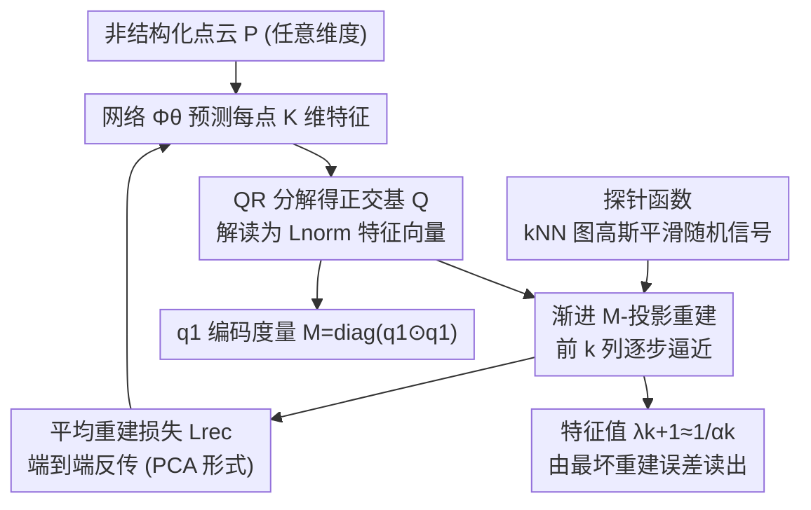

# Learning Eigenstructures of Unstructured Data Manifolds

**会议**: CVPR 2026  
**论文**: [CVF Open Access](https://openaccess.thecvf.com/content/CVPR2026/html/Velich_Learning_Eigenstructures_of_Unstructured_Data_Manifolds_CVPR_2026_paper.html)  
**代码**: https://github.com/royvelich/learning-eigenstructures  
**领域**: 自监督 / 几何处理 / 流形学习 / 谱方法  
**关键词**: 谱基, 拉普拉斯算子, 最优逼近理论, 点云, 流形学习

## 一句话总结
本文不再"先选算子、再离散化、再做特征分解"，而是用一个神经网络直接从任意维度的非结构化数据（点云、图像流形）里学出谱基——以最优逼近理论为根基，让网络通过最小化探针函数在所学基上的重建误差，一次性同时拿到谱基、隐式度量（采样密度）和特征值，在 3D 曲面上逼近 cotangent 拉普拉斯 oracle、又能扩展到高维图像流形。

## 研究背景与动机
**领域现状**：几何处理的核心是给流形定义算子（拉普拉斯-Beltrami 算子 LBO、Hamilton 算子、双调和算子等），再用它们的**谱分解**（特征值/特征向量）做滤波、扩散、热核/波核、特征描述子、functional maps 等下游任务。社区实际上几乎从不直接用算子矩阵，而是用它前几个特征向量。

**现有痛点**：标准流程是"选一个保持 PSD/对称/一致性的离散近似 → 显式拼出离散算子矩阵 → 用经典数值求解器解广义特征值问题"。这套为二维曲面设计的管线在 3D 网格上有效，但（1）依赖良好三角化的网格（cotangent 权重要求 Delaunay，否则负边违反极值原理），点云得先做复杂的鲁棒重网格化；（2）**不能优雅地扩展到高维流形**——高维只能退而用图拉普拉斯，而图拉普拉斯强烈依赖连通性/局部密度，和我们真正想要的光滑 LBO 行为有偏差。

**核心矛盾**：算子的"选择—离散化—特征分解"三步每一步都引入对数据结构（网格、维度、度量）的强假设和数值敏感性，可靠地把 LBO 推广到高维本身就是难题。

**本文目标**：跳过"选算子 + 构造离散矩阵 + 调特征求解器"，直接从数据学谱分解，让所学的基**隐式地**对应某个算子（事后可从基和特征值重构），且不假设网格、不假设流形维度。

**切入角度**：从最优逼近理论出发——给定一类信号，"最优正交基"恰好是某个 SPD 算子的特征向量；反过来，只要让网络学到"能最优逼近一类探针函数的基"，这组基就隐式是某算子的特征基。算子的选择被转嫁成**探针函数分布**的选择，而后者（比如 kNN 图上做高斯平滑的随机函数）比离散化算子容易得多，尤其在高维。

**核心 idea**：用网络预测每点特征、QR 正交化得到基 $Q$，把它解读成归一化拉普拉斯 $L_{\text{norm}}$ 的特征向量，仅以"探针函数的渐进重建误差"为损失端到端训练；第一根特征向量天然编码度量，特征值由最坏重建误差直接读出。

## 方法详解

### 整体框架
方法建立在最优逼近理论的两条对偶定理上：Min-Max 最优性（Thm 3.1）说对信号类 $\mathcal C_L=\{f:\|f\|_L\le1\}$，渐进 $k$ 项逼近的最优正交基唯一地是 SPD 算子 $L$ 的特征向量，且前 $k$ 项最坏重建误差恰为 $1/\lambda_{k+1}$；Operator-Bounded PCA（Thm 3.2）说对 $\mathcal C_L$ 上均匀分布信号做 PCA 得到同一组基（协方差 $R_L=L^{-1}$）。本文据此设计：网络 $\Phi_\theta:\mathbb R^{n\times d}\to\mathbb R^{n\times K}$ 给点云每点预测 $K$ 维特征 → QR 分解 $\Phi_\theta(P)=QR$ 得正交基 $Q=[q_1,\dots,q_K]$，把它当作归一化算子 $L_{\text{norm}}$ 的前 $K$ 个特征向量；用一批高斯平滑的随机探针函数做渐进重建，平均重建误差作为唯一损失反传训练。训练完一次前向就得到谱基，特征值、度量、隐式算子都可在推理时从基里读出。

### 关键设计

**1. 用最优逼近理论把"谱基"变成"可学的重建目标"**

针对"必须先显式造算子才能特征分解"的痛点，本文不直接逼近算子，而是逼近它的**基**。理论支点是 Thm 3.1：对任意 SPD 算子 $L$，使渐进 $k$ 项逼近误差
$$\alpha_k=\min_{b}\max_{\|f\|_L\le1}\Big\|f-\sum_{i=1}^k\langle f,b_i\rangle b_i\Big\|^2$$
最小的正交基唯一地是 $L$ 的特征向量（按特征值升序），且最优值 $\alpha_k=1/\lambda_{k+1}$。这意味着只要找到"能最优逼近 $\mathcal C_L$ 中信号的基"，就等于找到了 $L$ 的特征基——把"分解算子"这个显式问题换成了"学一组最优重建基"这个可微问题。算子的身份完全由信号类 $\mathcal C_L$（即约束 $\|f\|_L\le1$）决定，于是选算子 = 选信号约束 = 选探针分布。

**2. 网络预测 + QR 正交化，第一根特征向量直接编码度量**

针对"高维流形上度量/质量矩阵难以单独估计"的痛点，本文让 $\Phi_\theta(P)\in\mathbb R^{n\times K}$ 输出每点特征后做 QR 得正交列 $Q$，并按归一化拉普拉斯 $L_{\text{norm}}=M^{-1/2}SM^{-1/2}$ 的视角解读：其零空间是 $M^{1/2}\mathbf 1$，故第一根特征向量 $q_1\propto M^{1/2}\mathbf 1$ **直接编码采样密度权重**。于是网络只要学基，就**顺带学到了度量**——质量矩阵对角直接取 $M=\mathrm{diag}(q_1\odot q_1)$，无需额外模块预测质量矩阵，架构因此简化、又保持几何一致。这是选归一化（而非非归一化）形式的关键好处。所学非归一化基可由 $v_i=M^{-1/2}q_i$ 得到，下游更采样不变（如 $v_1$ 在不同采样下恒为常数）。

**3. 探针函数定义隐式算子 + 渐进重建损失**

针对"算子离散化在高维不可靠"的痛点，本文把算子选择转嫁给**探针函数分布**。要逼近 LBO，探针应是光滑、Dirichlet 能量有界、在该有界集上均匀的函数（因 $\|\nabla f\|^2=\|f\|_\Delta$）；但高维点云上算梯度需要度量、不可得，于是放宽为：对随机信号在 kNN 图上反复做高斯核平滑，得到"近似服从受约束拉普拉斯分布"的探针。训练时不用 Min-Max（每个 $k$ 只用一条最坏探针，优化不稳），而用其等价的 PCA 形式（Thm 3.2，对所有探针求平均），损失为
$$\mathcal L_{\text{rec}}=\frac1{mK}\sum_{i=1}^m\sum_{k=1}^K\big\|f^{(i)}-f^{(i)}_{\text{proj},k}\big\|_2^2,$$
其中 $f^{(i)}_{\text{proj},k}$ 是第 $i$ 条探针在前 $k$ 个基上的 M-加权投影（投影用 M-范数、误差用欧氏 2-范数的混合策略提升稳定性）。训练全程**从不显式计算算子或特征值**。换探针族（分段常数、光滑多项式、Schrödinger 型）就对应非 LBO 的其他算子——把"选算子"的负担换成"选探针族"，后者在高维更容易。

**4. 特征值由最坏重建误差直接读出**

针对"特征值通常要另解一遍"的问题，本文借 Thm 3.1 里 $\alpha_k=1/\lambda_{k+1}$ 的关系，在推理时对每个分辨率 $k$ 取所有探针上的最坏重建误差直接估计 $\lambda_{k+1}\approx 1/\max_i\|f^{(i)}-f^{(i)}_{\text{proj},k}\|_2^2$，无需额外网络参数，也无需并行解特征值。需要时还可显式重构隐式归一化算子 $Q_K\Lambda_K Q_K^\top$（或非归一化非对称版 $M^{-1/2}Q_K\Lambda_K Q_K^\top M^{1/2}$），但实践中算子矩阵几乎用不上（连它的作用都在谱基里算），实验中从未真正重构。

### 损失函数 / 训练策略
唯一训练目标是平均渐进重建损失 $\mathcal L_{\text{rec}}$（式 1），端到端反传。前向流程（Algorithm 1）：对点云生成 $m$ 条探针 → 前向 $\Phi_\theta(P)$ → QR 得 $Q$ → 对每个 $k$ 把每条探针 M-投影到前 $k$ 列、记录误差，渐进累加。采用"M-加权投影 + 欧氏 2-范数误差"的混合范数，是一种无监督地学密度相关质量矩阵、同时稳定训练的机制。提取器 $\Phi_\theta$ 在单点云过拟合设定下用小 MLP 即可，泛化设定下用 Transformer。

## 实验关键数据

### 主实验
在 3D 曲面上把所学基与"oracle cotangent 拉普拉斯"（带真实网格连通性）对比，测特征向量的平均余弦相似度和特征值相对误差（过拟合设定，丢掉网格连通性只用点云）。

| 形状 | $k\le10$ | $k\le20$ | $k\le50$ | $\lambda$ 相对误差 |
|------|----------|----------|----------|--------------------|
| Armadillo | 0.968 | 0.967 | 0.773 | 0.200 ± 0.126 |
| Bimba | 0.964 | 0.945 | 0.822 | 0.093 ± 0.145 |
| Botijo | 0.972 | 0.955 | 0.813 | 0.153 ± 0.092 |
| Kitten | 0.993 | 0.988 | 0.981 | 0.088 ± 0.104 |
| Lion | 0.951 | 0.908 | 0.822 | 0.067 ± 0.086 |
| Laurent Hand | 0.823 | 0.696 | 0.568 | 0.066 ± 0.078 |

在不知道网格、纯无监督的情况下，低频特征向量与 oracle 的余弦相似度常接近 1，特征值也很接近 oracle。⚠️ Pegaso 等形状上高频基（大 $k$）会与 oracle 略偏（如 $k\le50$ 降到 0.544），但用前 $k$ 个谱向量重建 xyz 时，本文模型反而能保留 oracle 丢掉的细节，部分形状上给出**信息压缩更好的**前 $k$ 项逼近。

### 高维流形与流形学习
把每张图当作数据流形上一个点，用 DINOv2/CLIP 特征（$d=768/512$）作坐标，在 STL10、Imagenette、CIFAR100、Caltech256 上做流形学习。本文用非归一化基 $v_i$ 给出低维嵌入，命名为 **Optimal-Approximation Eigenmaps**（拉普拉斯 Eigenmaps 的推广，用所学谱基代替图拉普拉斯谱基），对比 PCA、Isomap、Laplacian Eigenmaps、t-SNE、UMAP。

| 设定 | 评测方式 | 关键结论 |
|------|---------|---------|
| 1D 玩具 [0,1] | 可视化前 5 个基向量 | 恢复出频率递增的傅里叶式谐波（$v_1$ 常数），印证学到类拉普拉斯谱 |
| 3D 曲面（过拟合） | 与 oracle cotangent LBO 比 | 基/特征值高度吻合，余弦相似度近 1 |
| 3D 曲面→体（泛化） | 训曲面、测未见曲面与 3D 体 | 泛化到新形状乃至训练没见过的"体"流形，精度略降但具基础模型级泛化 |
| 高维图像流形 | NMI / ARI 聚类（DINOv2 特征，50 次平均） | 嵌入质量持平或优于各基线，尤其优于同源的 Laplacian Eigenmaps |

### 关键发现
- **无监督逼近 oracle 甚至更好**：纯靠最优逼近目标、不看网格，就能逼近 cotangent LBO 的特征结构；某些形状上前 $k$ 项重建比 oracle 保留更多细节，说明所学隐式算子的谱压缩性可能更优。
- **第一根基自动给出度量**：从 $q_1$ 估出的面积权重 $M$ 与直觉一致，验证"度量被免费学到"的设计。
- **优于图拉普拉斯**：高维上比同样思路的 Laplacian Eigenmaps 更好，提示所学谱基/隐式算子优于强依赖连通性的图拉普拉斯——这正是高维场景最需要的。
- **探针族 = 算子族**：换分段常数 / 多项式 / Schrödinger 型探针即可得到非 LBO 算子的谱（Schrödinger 型能学到带势 $V(x)$ 的基），验证"把选算子换成选探针"的可行性。

## 亮点与洞察
- **把"选算子—离散化—特征分解"整条管线换成一个端到端重建目标**：理论上由 Min-Max/PCA 对偶撑住，工程上只需一次前向，干净利落。
- **第一根特征向量编码度量**：选归一化拉普拉斯形式，让 $q_1$ 直接给出质量矩阵，省掉单独估度量的模块——这个"免费午餐"是设计的点睛之笔。
- **特征值从最坏重建误差读出**：$\lambda_{k+1}=1/\alpha_k$ 把特征值和逼近误差统一起来，零额外参数，理论与实现高度自洽。
- **算子选择转嫁为探针分布**：在高维"生成简单探针族"远比"可靠离散化算子"容易，这个 trade-off 的转移思路可迁移到其他需要谱/算子的高维任务。

## 局限与展望
- **高频/泛化精度下降**：过拟合设定下高频基（大 $k$）在部分形状上偏离 oracle；泛化设定整体精度低于过拟合设定，作为"基础模型"还有提升空间。
- **探针分布只是 LBO 的松弛近似**：kNN 高斯平滑得到的探针只"loosely 类似"受约束拉普拉斯分布，并非精确复现，隐式算子与目标 LBO 的偏差缺乏定量刻画。
- **依赖特征嵌入与 kNN 图**：高维实验在 DINOv2/CLIP 特征空间上用 kNN 度量距离，结果对预训练特征和邻居数的敏感性未充分分析。
- 评测以无监督谱质量/聚类为主，下游具体几何任务（匹配、描述子）上的端到端收益还有待展开。

## 相关工作与启发
- **vs cotangent 拉普拉斯 / 鲁棒拉普拉斯**：经典方法要良好三角化网格、对点云需先重网格化且难超出曲面；本文丢掉连通性直接学基，过拟合设定下与 oracle 几乎一致，还能扩到高维。
- **vs 图拉普拉斯（高维默认）**：图拉普拉斯强依赖连通性/局部密度，与光滑 LBO 有偏；本文所学谱基在高维流形学习上优于同源的 Laplacian Eigenmaps。
- **vs 神经特征函数方法（Rayleigh 商 / 半群不动点）**：那些方法需显式域参数化、假设欧氏平坦几何、且每个域要从头训、无法跨几何泛化；本文直接吃点云、不需坐标参数化，并能跨形状泛化。
- **vs 学拉普拉斯矩阵的工作**：前人多数仍显式拼质量/刚度矩阵再调特征求解器、且限于三角化曲面；本文既不构造算子也不调求解器，可扩展到任意维度。

## 评分
- 新颖性: ⭐⭐⭐⭐⭐ 用最优逼近理论把谱分解整条管线替换成端到端学基，并让度量/特征值自然涌现，思路新颖。
- 实验充分度: ⭐⭐⭐⭐ 从 1D 玩具到 3D 曲面/体再到高维图像流形覆盖广，但多为无监督谱质量与聚类，下游几何任务验证偏少。
- 写作质量: ⭐⭐⭐⭐ 理论铺陈清晰、定理与实现对应明确，但符号与几何处理背景较重。
- 价值: ⭐⭐⭐⭐⭐ 为高维非结构化数据的谱分析提供了可扩展、免算子构造的新范式，几何处理与流形学习都受益。

<!-- RELATED:START -->

## 相关论文

- [\[CVPR 2026\] Few-Shot Hybrid Incremental Learning: Continually Learning under Data Scarcity and Task Uncertainty](few-shot_hybrid_incremental_learningcontinually_learning_under_data_scarcity_and.md)
- [\[CVPR 2026\] Global-Graph Guided and Local-Graph Weighted Contrastive Learning for Unified Clustering on Incomplete and Noise Multi-View Data](global-graph_guided_and_local-graph_weighted_contrastive_learning_for_unified_cl.md)
- [\[NeurIPS 2025\] Manifolds and Modules: How Function Develops in a Neural Foundation Model](../../NeurIPS2025/self_supervised/manifolds_and_modules_how_function_develops_in_a_neural_foundation_model.md)
- [\[ICML 2026\] Data Augmentation of Contrastive Learning is Estimating Positive-incentive Noise](../../ICML2026/self_supervised/data_augmentation_of_contrastive_learning_is_estimating_positive-incentive_noise.md)
- [\[NeurIPS 2025\] TabArena: A Living Benchmark for Machine Learning on Tabular Data](../../NeurIPS2025/self_supervised/tabarena_a_living_benchmark_for_machine_learning_on_tabular_data.md)

<!-- RELATED:END -->
