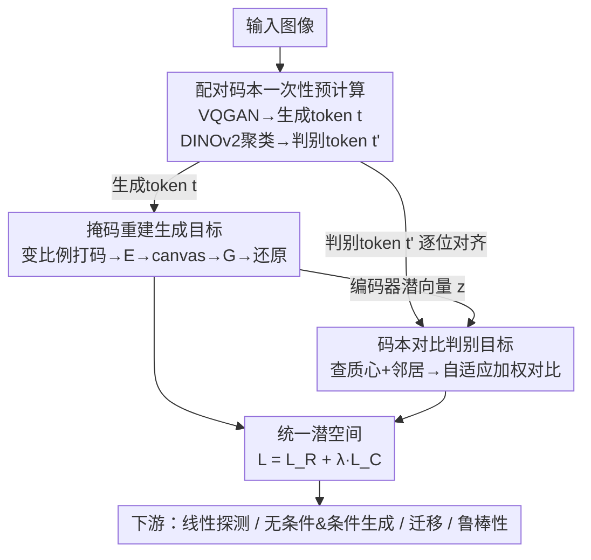

# Learning from Semantic Dictionaries: Discriminative Codebook Contrastive Learning for Unified Visual Representation and Generation

**会议**: CVPR 2026  
**论文**: [CVF Open Access](https://openaccess.thecvf.com/content/CVPR2026/html/Estepa_Learning_from_Semantic_Dictionaries_Discriminative_Codebook_Contrastive_Learning_for_Unified_CVPR_2026_paper.html)  
**代码**: https://github.com/ImaGonEs/LEASE  

**领域**: 自监督 / 统一视觉表示与生成  
**关键词**: 自监督学习, 码本对比, 统一表示, 掩码重建, VQGAN

## 一句话总结
LEASE 用一对「生成码本 + 判别码本」把图像一次性离线编码成两串对齐的离散 token，再用「掩码重建」和「码本对比」两个目标共同训练一个编码器，让同一套潜空间既能高质量生成又有强判别力——不用数据增广、不用在线 tokenizer、不用蒸馏冻结的教师模型，在 ImageNet-1K 上拿到统一 SSL 的新 SoTA，且训练比 MAGE 快 48.7%、比 Sorcen 快 8.75%。

## 研究背景与动机

**领域现状**：视觉自监督预训练长期分裂成两条线。判别派（SimCLR、MoCo、DINO、MAE 等对比/掩码方法）学到的特征擅长分类、检索这类「理解」任务；生成派（VQGAN、扩散模型、MaskGIT）则擅长把图像「画」出来。近年 MAGE、Sorcen 这类「统一 SSL」方法想让一个模型同时干好两件事，做法是借助 VQGAN 把图像离散化后重建。

**现有痛点**：统一派虽然路子对，但代价高。MAGE 在训练时要跑**在线 tokenizer**，每一步都要现场把图像量化一遍，开销巨大；Sorcen 改成预计算输入缓解了这点，但又引入**双编码器**架构，每步要多做一次前向来算对比目标。另一类 REPA、VFMTok、MergeVQ、SVG 则靠**蒸馏冻结的 VFM（如 DINOv2）**当教师，训练时要一直挂着大模型，效率同样被拖累。

**核心矛盾**：判别表示和生成表示本质上是**语义错位**的——生成 token 关心「这块像素长什么样」的细粒度外观，判别特征关心「这是什么概念」的高层语义，两者不在同一个语义坐标系里。现有方法要么牺牲一方迁就另一方（MAGE-C 加对比目标提了判别但掉了生成质量），要么靠堆算力（在线 tokenizer / 双编码器 / 冻结教师）硬把两套信号塞进一个模型。

**本文目标**：用一个**单编码器、单次前向**的轻量框架，直接调和生成与判别两种语义，而不依赖增广、在线量化或外部教师。

**切入角度**：作者的观察是——判别语义其实可以被「字典化」。把一个自监督 VFM 的特征空间聚类成 K 个质心，每个质心就是一个「语义概念词」，整套质心就是一本**判别语义词典**（codebook）。同理 VQGAN 是一本**生成词典**。既然图像的每个 patch 都能在这两本词典里查到对应的词，那就可以让它们**逐位置对齐**，把判别词当成生成词的「正样本」，直接在离散 token 空间里做对比，根本不需要在线编码或第二个网络。

**核心 idea**：用一对位置对齐的「生成码本 + 判别码本」把数据一次性预计算成离散 token，再用「掩码 token 重建（学生成）+ 码本对比（学判别）」双目标训练单个编码器，把两种语义统一进同一潜空间。

## 方法详解

### 整体框架
LEASE 是一个 Transformer 编码器 $E$ + 解码器 $G$ 的架构，但它不像常规 MIM 那样在像素上工作，而是**直接在离散 token 上工作**。训练前先做一次性预计算：用**生成码本**（一个无监督 VQGAN）把每张图编码成生成 token 序列 $t=(t_1,\dots,t_{SS})$，用**判别码本**（对 DINOv2 特征做 k-means 得到的 $K$ 个质心）把同一张图编码成判别 token 序列 $t'$。两串 token **逐位置对齐**：$t$ 的第 $i$ 个和 $t'$ 的第 $i$ 个对应同一个 patch。其中 $t$ 是网络的真正输入，$t'$ 只是用来给每个生成 token 挂上它的判别语义、构成正样本对。

训练时两条目标并行跑：一条是**掩码重建**——把 $t$ 大比例打码后送进 $E$，再用解码器 $G$ 还原被遮的 token；另一条是**码本对比**——把编码器输出的潜向量和它对应的判别质心（及邻居质心）拉近、和码本里其余质心推远。最终总损失是两者加权和 $L_{\text{LEASE}}=L_R+\lambda L_C$。整套流程只需一次前向、两个目标都只查轻量码本，所以又快又不依赖外部教师。

### 关键设计

**1. 配对的生成-判别码本 + 一次性预计算：把两种语义对齐进同一串离散 token**

痛点直接对准前面说的「语义错位」和「算力浪费」：以往要么没有现成机制让生成信号和判别信号对齐，要么为了对齐得在训练中现算（在线 tokenizer / 蒸馏教师）。LEASE 的做法是把两种语义都「字典化」再逐位置挂钩。生成码本是一个事先训好的无监督 VQGAN，负责把图像每个 patch 量化成生成 token $t_i\in[0,v_{max}]$，编码的是有利于重建的细粒度外观。判别码本则不训练，而是对一个自监督 VFM（DINOv2）的 patch 特征做 k-means，聚成 $K$ 个质心，每个质心 $C$ 代表一个语义概念。关键在于两串 token **位置对齐**：第 $i$ 个生成 token 和第 $i$ 个判别 token 是同一个 patch，于是顺着 $e_i \to t_i \to t'_i \to C_{t'_i}$ 这条查表链，就能为每个生成 token 现成地取到它的判别正样本。

这一设计的高效性来自「一次性预计算」：整个数据集在训练**之前**就用两本码本各编码一遍存好，训练时不再有任何在线量化开销。和 MAGE（每步在线 tokenizer）、Sorcen（双编码器多一次前向）、蒸馏方法（训练时挂着冻结 VFM）相比，LEASE 训练时只需查两张静态码本，这正是它训练快 48.7%/8.75% 的根本原因。

**2. 掩码 token 重建：在离散空间里学到细粒度生成语义**

这一支负责「生成」那半边语义。痛点是：只靠对比目标的模型在复杂下游任务（尤其全量微调）上会力不从心，而细粒度外观信息正是生成质量的来源。LEASE 用**变掩码比例**策略——单步遮蔽比例在 50%–100% 间浮动、平均 69%——兼顾「高比例利好生成、低比例利好表示」两端；打码 token 用一个词表外的整数 `[MASK]` 表示，序列前再拼一个 `[CLS]`。为省显存还会丢弃被遮 token、只保留原序列一半长度（丢弃后约 19% 仍是掩码状态）。

重建本身被建模成**离散 token 预测**：编码器把打码序列 $t_{masked}$ 投到统一潜空间 $E(t_{masked})=(e_0,\dots,e_L)$，然后用 `[CLS]` 潜向量 $e_0$ 铺一张大小 $2L$ 的「画布」canvas，把 $t_{masked}$ 各位置的潜向量填回对应坑位，最后整张 canvas 过解码器 $G$ 预测原始 token $t$。损失只在被遮位置上算交叉熵：

$$L_R = -\mathbb{E}_{t\sim D}\left[\sum_{i=1}^{CS} m_i \log p(t_i \mid cv_i)\right]$$

其中 $p$ 是解码器输出、$CS$ 是 canvas 大小、$m_i$ 标记该位是否被遮。这等价于在 VQGAN 离散空间里做 MAE，比在像素上重建更省算力。

**3. 码本对比 + 自适应质心加权：用码本级负样本学到稳定的判别语义**

这一支负责「判别」那半边，也是本文最核心的创新。常规对比学习（如 InfoNCE）的负样本来自当前 batch，既受 batch 大小限制、又带采样噪声。LEASE 改成**从判别码本里直接取正负样本**。先做「质心收集」：对每个输入 token，顺着对齐链查到它的判别质心 $C_{t'_i}$，再用余弦相似度 $sim_{ik}=C_{t_i}^\top C_k$ 从全部 $K$ 个质心里 TopK 检索出 $K_{sel}$ 个最相似的**邻居质心** $N_{t'_i}$（公式 2）。这样每个 token 就有了 $1+|N_{t'_i}|$ 个正样本（自己的质心 + 邻居），天然带语义多样性，不靠增广。

但邻居和查询质心的相似度参差不齐，一刀切当正样本不合理，所以引入**自适应加权**：

$$w_{ij} = \frac{\exp(sim_{ij}/\tau)}{\sum_{k\in C_{t'_i}\cup N_{t'_i}}\exp(sim_{ik}/\tau)}$$

温度 $\tau=0.1$ 让目标保持尖锐、又给近邻保留有意义的权重。最终的码本对比损失只在未遮 token 上算：

$$L_C = -\frac{1}{N_u}\sum_{i\in U}\sum_{j\in C_{t'_i}\cup N_{t'_i}} w_{ij}\log\frac{\exp(z_i^\top C_j/\alpha)}{\sum_{k=1}^{K}\exp(z_i^\top C_k/\alpha)}$$

$N_u$ 是未遮 token 数、$\alpha$ 是对比温度。**负样本是码本里其余全部质心**（没被选作邻居或查询的），而不是 batch 内样本——这就把 batch 依赖的噪声和不稳定性彻底去掉了。消融还揭示一个关键点：这个对比目标必须加在**编码器**潜空间上（统一才发生在编码器侧）；若加到解码器特征上，判别精度提升但生成质量受损，加在编解码两侧也不比只加编码器更好。所以最终 LEASE = 重建损失 + **编码器侧**码本对比。

### 损失函数 / 训练策略
总目标是重建与对比的加权和 $L_{\text{LEASE}}=L_R+\lambda L_C$，$\lambda$ 控制判别信号的强度。架构统一用 ViT-Base（沿用 MAGE 配置），生成码本来自无监督 VQGAN，判别码本由 DINOv2 特征 k-means 而来（沿用 DiGIT 的构造法）。默认在 ImageNet-1K 上预训练 1600 epoch。条件生成则是冻结编码器、只用重建损失微调解码器，外加一个来自 CLIP 的类别 embedding token 和一段由判别码本质心拼成的序列尾。

## 实验关键数据

### 主实验

ImageNet-1K 上的统一评测（线性探测 LP% 衡量判别、FID/IS 衡量无条件生成）。LEASE 在 VQGAN 系统一模型里全面领先，并逼近甚至超过单领域专精模型：

| 方法 | 类型 | LP% | FID↓ | IS↑ |
|------|------|-----|------|-----|
| ADDP | 生成 | 11.5 | **8.9** | 95.32 |
| MAGE-C | 对比 | **78.2** | 31.8 | 37.40 |
| MAE | MIM | 68.0 | - | - |
| Sorcen | 统一(VQGAN) | 75.1 | 9.61 | 90.96 |
| MAGE | 统一(VQGAN) | 74.7 | 11.1 | 81.17 |
| **LEASE** | 统一(VQGAN) | 76.7 | 9.62 | **91.78** |

关键发现：LEASE 的 LP 76.7% 高于 Sorcen/MAGE，FID 9.62 与 Sorcen 持平、显著好于 MAGE，IS 91.78 为统一模型最高。纯生成模型 ADDP 的 FID 更低但判别只有 11.5%，纯对比的 MAGE-C 判别 78.2% 但生成质量崩塌（FID 31.8）——只有 LEASE 在两边都站得住，体现「统一」的真正价值。效率上，相同 H100/batch 128 设定下，LEASE 训练比 MAGE 快 **48.7%**、比 Sorcen 快 **8.75%**（单次前向 + 轻量码本）。

补充几个跨设定的判别优势（vs 两个最强统一基线）：

| 评测 | MAGE | Sorcen | LEASE |
|------|------|--------|-------|
| 少样本平均 (5/10/13/25-shot) | 57.33 | 59.09 | **59.65** |
| 微调 Top-1 | 82.5 | 82.4 | **82.7** |
| 迁移平均 (7 数据集, 16-shot) | 61.75 | 61.61 | **62.50** |
| 鲁棒性 k-NN 平均 (8 变体) | 13.69 | 14.42 | **20.39** |

鲁棒性提升尤其明显——在 ImageNet-S/R/A、ObjectNet、ImageNet-C(severity 4/5) 等分布偏移基准上，LEASE 的 k-NN 精度大幅甩开两个基线（如 IN-A 上 8.51 vs 5.47/4.19，C-severity5 上 30.24 vs 22.15/21.96），说明码本对比学到的特征更稳更抗扰。

### 消融实验

各目标组件对线性探测/生成的贡献（Rec=重建，DC=解码器侧对比，EC=编码器侧对比）：

| 配置 | LP% | FID↓ | IS↑ | 说明 |
|------|-----|------|-----|------|
| 仅 Rec | 73.62 | 10.62 | 79.59 | 纯重建基线 |
| Rec + DC | 74.20 | 10.97 | 78.73 | 对比加在解码器：判别小升，生成反降 |
| Rec + EC + DC | 76.07 | 10.36 | 84.33 | 两侧都加，无额外判别收益 |
| **LEASE (Rec + EC)** | **76.11** | **10.35** | **86.71** | 只在编码器侧对比，最佳 |

### 关键发现
- **码本对比贡献最大且必须落在编码器侧**：加上编码器对比后 LP 从 73.62→76.11、IS 从 79.59→86.71，生成判别双升；但同样的对比放到解码器（DC）会拖累生成（IS 78.73<79.59），两侧都加也不如只加编码器——证明「统一」这件事只发生在编码器潜空间。
- **判别码本来源**：DINOv2 是最强的判别码本来源（IN200 上 LP 85.86），DINOv3 次之，再 CLIP、FRANCA；且 DINOv2 用 IN200 子集构造的码本甚至略胜用全 IN-1K 构造的。
- **码本越大越好**：从 8K 增到 16K 质心，LP 75.20→76.70、FID 10.13→9.62、IS 85.87→91.78，更细的 patch 语义提供更细粒度的对比。
- **条件生成也具竞争力**：仅冻结编码器、微调小解码器，LEASE 条件生成 FID 3.72/IS 179.09，FID 优于 MAGE(6.93)、DiGIT、REPA，参数量也更省，仅次于 MergeVQ。

## 亮点与洞察
- **「把语义字典化再逐位对齐」是很漂亮的统一思路**：生成 token 和判别质心本是两套坐标系，作者用一条 $e_i\to t_i\to t'_i\to C_{t'_i}$ 的查表链零成本把它们绑成正样本对，既不需要增广也不需要在线编码——这个对齐机制可迁移到任何「想让两种预训练信号互相监督」的场景。
- **负样本来自码本而非 batch，是对对比学习的实质改进**：用整个码本的其余质心当负样本，绕开了 batch 大小限制和采样噪声，得到更稳定的判别信号；自适应权重 $w_{ij}$ 又解决了「多正样本质量不齐」的问题。这套「码本级多正样本对比」可单独拿去改造其他对比框架。
- **「统一只发生在编码器」是有价值的经验结论**：消融清楚显示对比目标加在解码器会害了生成，这提示后续做多目标统一时要想清楚监督信号该注入网络的哪一层。
- **效率不是靠砍模型而是靠改范式**：一次性预计算 + 单次前向 + 轻量码本，把在线 tokenizer / 双编码器 / 冻结教师的开销全省了，思路对资源受限的预训练很有借鉴意义。

## 局限与展望
- **下游仍需在线 tokenizer**：预计算只省了训练阶段，做下游任务时图像还是得现场量化，推理侧的 tokenizer 开销没消除；作者把「彻底绕开 tokenizer 的架构」列为未来方向。
- **超参对域敏感**：码本对比的邻居数 $K_{sel}$、温度 $\tau$ 是为通用数据集调的，换到特定领域可能要重调。
- **完全无监督的天花板**：框架坚持自监督设定，引入弱监督（文本引导）虽能提升条件生成但会破坏 SSL 纯度，是个 trade-off。
- **依赖外部 VFM 的质量**：判别码本由 DINOv2 聚类而来，码本来源消融显示换成 CLIP/FRANCA 会明显掉点，方法的上限被现成 VFM 的特征质量锁定（虽然训练时不挂教师，但码本本身仍源自 VFM）。

## 相关工作与启发
- **vs MAGE / Sorcen（统一 SSL SoTA）**：三者都基于 VQGAN 做统一重建。MAGE 靠在线 tokenizer，开销最大；Sorcen 预计算输入但用双编码器、每步多一次前向。LEASE 单编码器单前向、两目标都只查静态码本，判别全面更强、生成持平 Sorcen，且训练分别快 48.7%/8.75%。
- **vs MAGE-C（对比增强版）**：MAGE-C 加对比目标把 LP 推到 78.2% 但 FID 崩到 31.8，偏向判别牺牲生成。LEASE 用码本对比同时提升两边，统一性更好。
- **vs REPA / VFMTok / SVG / MergeVQ（蒸馏 DINOv2 教师）**：这些方法训练时挂着冻结 VFM 做蒸馏，效率受拖累。LEASE 把 DINOv2 知识「离线压成码本」再用对比利用，训练时无需教师在场，判别+生成综合更优（仅 MergeVQ 在个别指标更高但微调更差）。
- **vs DiGIT（也用判别码本当输入）**：DiGIT 把 VFM 特征离散化后做 next-token 预测，LEASE 则把判别码本用于**对比**而非输入序列，在 LP 和 IS 上领先，且不需训练时的 VFM。
- **vs 标准对比 (SimCLR/MoCo/NNCLR)**：它们靠增广构造正样本、靠 batch/队列取负样本。LEASE 的正样本来自码本邻居（无增广）、负样本来自码本其余质心（无 batch 依赖），从机制上去掉了采样噪声。

## 评分
- 新颖性: ⭐⭐⭐⭐ 「配对码本逐位对齐 + 码本级对比」是对统一 SSL 的清晰且实用的新范式，但每个零件（VQGAN 离散、DINOv2 码本、掩码重建、对比）都有前作，胜在组合与对齐机制
- 实验充分度: ⭐⭐⭐⭐⭐ 覆盖统一评测、少样本、微调、迁移、鲁棒性、条件生成、效率，外加目标/码本来源/码本大小/对比位置多组消融，非常完整
- 写作质量: ⭐⭐⭐⭐ 动机清楚、公式与流程交代到位，对齐链和码本对比讲得明白；个别符号（如 canvas 与 drop 比例）需对照原文细读
- 价值: ⭐⭐⭐⭐ 给「又快又统一」的视觉预训练提供了可复现的实用配方，对资源受限场景和后续统一模型设计有明确借鉴价值

<!-- RELATED:START -->

## 相关论文

- [\[CVPR 2026\] UniGeoCLIP: Unified Geospatial Contrastive Learning](unigeoclip_geospatial_contrastive.md)
- [\[CVPR 2026\] Franca: Nested Matryoshka Clustering for Scalable Visual Representation Learning](franca_nested_matryoshka_clustering_for_scalable_visual_representation_learning.md)
- [\[CVPR 2026\] Exemplar-Free Class Incremental Learning via Preserving Class-Discriminative Structure](exemplar-free_class_incremental_learning_via_preserving_class-discriminative_str.md)
- [\[CVPR 2026\] Global-Graph Guided and Local-Graph Weighted Contrastive Learning for Unified Clustering on Incomplete and Noise Multi-View Data](global-graph_guided_and_local-graph_weighted_contrastive_learning_for_unified_cl.md)
- [\[CVPR 2026\] Exploring Visual Pretraining for Learning Language Intelligence](exploring_visual_pretraining_for_learning_language_intelligence.md)

<!-- RELATED:END -->
