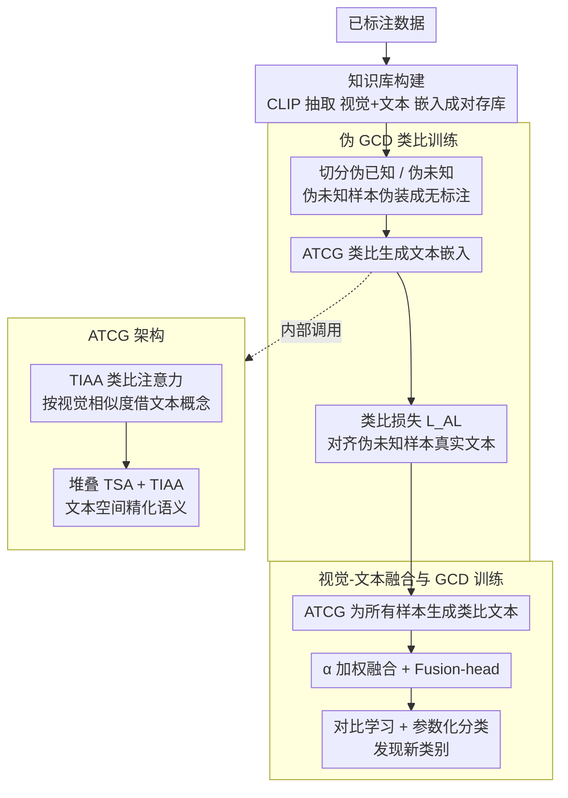

# Learning Like Humans: Analogical Concept Learning for Generalized Category Discovery

**会议**: CVPR 2026  
**arXiv**: [2603.19918](https://arxiv.org/abs/2603.19918)  
**代码**: [GitHub](https://github.com/zhou-9527/AnaLogical-GCD)  
**领域**: 自监督  
**关键词**: 广义类别发现, 类比学习, 视觉-语言模型, 跨模态推理, CLIP

## 一句话总结

提出 AL-GCD 框架，通过模拟人类类比推理机制设计"类比文本概念生成器"（ATCG）——从已知类别的视觉-文本知识库中类比生成未知样本的文本概念，将类别发现转化为视觉-文本联合推理任务，在六个基准上平均提升 5.0%，细粒度数据集提升 7.1%。

## 研究背景与动机

广义类别发现（GCD）要求模型在保持已知类别识别能力的同时，从无标注数据中发现新类别。现有方法面临的核心挑战：

**纯视觉流水线的局限**：多数 GCD 方法仅依赖视觉信息，在细粒度数据集（如 CUB-200 鸟类、Stanford Cars 汽车）上表现不佳——视觉相似但语义不同的类别难以区分

**监督学习与类别发现的松耦合**：已知类别的标注信息未被有效迁移到新类别的发现过程中

**缺乏先验知识迁移机制**：即使使用了 CLIP 等视觉-语言模型，现有方法也未建立从已知到未知的显式知识桥梁

作者从**认知科学中的类比推理**中获得启发：人类在学习新概念时，会从大脑的知识库（长期记忆）中检索相关概念，通过类比推理构建新概念。例如，看到"BMW Coupe"时，会联想"Audi S5 Coupe"（同为 coupe 车型）和"BMW X5 SUV"（同为 BMW 品牌），通过类比快速理解新类别。

## 方法详解

### 整体框架

AL-GCD 想解决的是：纯视觉的 GCD 在细粒度数据集上分不开"长得像但语义不同"的类别，而即便引入了 CLIP，已知类别的文本知识也没能迁移到未知样本上。它的做法是让模型像人一样"类比"——看到一个不认识的样本，先从已知类别的视觉-文本知识库里找到视觉相似的概念，再借用它们的文本语义"拼"出当前样本应有的文本概念，最后把这条文本通道和视觉通道融合起来做类别发现。

整套系统由视觉编码器 $f_v$、文本编码器 $f_t$、融合模块（Fusion-head）$g$，以及核心的**类比文本概念生成器（ATCG）** $\varphi_{ATCG}$ 组成。训练分两阶段：第一阶段先用已标注数据建知识库，并通过"伪 GCD"任务把 ATCG 的类比能力练出来；第二阶段才进入真正的 GCD 训练，让 ATCG 为所有无标注样本生成文本概念，与视觉特征融合后做对比学习和参数化分类。

### 关键设计

**1. 知识库构建：把已知类别的视觉-文本对存成可检索的"长期记忆"**

要做类比，先得有可供检索的"经验池"。作者用预训练 CLIP 对每个已标注样本同时抽取图像嵌入 $\mathbf{v}_i^l = f_v(x_i^l)$ 和类别名文本嵌入 $\mathbf{t}_i^l = f_t(\text{text}(y_i^l))$，成对存进知识库 $\mathcal{K} = \{(\mathbf{v}_i^l, \mathbf{t}_i^l)\}$。这一步对应人脑里海马体把短期经验固化为皮层长期记忆的过程——后续所有类比都从这个库里"调取"视觉相似的已知概念，因此知识库的覆盖面直接决定了类比能借到多贴切的文本语义。

**2. 伪 GCD 与类比训练：用"已知模拟未知"造出监督信号，让 ATCG 真正学会类比**

最棘手的问题是：真实未知类别没有文本标签，怎么训练一个"给未知样本生成文本概念"的模块？作者的巧招是每轮训练随机把已知类别 $\mathcal{Y}^l$ 切成"伪已知"和"伪未知"两半：从伪未知类别取 $n$ 个样本伪装成无标注数据 $\mathcal{D}_P^u$，伪已知类别留 $m$ 个带标注样本 $\mathcal{D}_P^l$ 当知识库。ATCG 以伪未知样本的图像嵌入为查询，从伪已知样本的视觉-文本对里类比出一条文本嵌入：

$$\tilde{\mathbf{t}}_j = \varphi_{ATCG}(\mathbf{v}_j^l, \{\mathbf{v}_i\}_{i \in \mathcal{D}_P^l}, \{\mathbf{t}_i\}_{i \in \mathcal{D}_P^l})$$

关键在于这些"伪未知"样本其实有真实文本嵌入 $\mathbf{t}_j^l$，于是就能用类比损失直接监督生成结果：

$$\mathcal{L}_{AL} = \frac{1}{n}\sum_{j=1}^n\big(1 - \cos(\tilde{\mathbf{t}}_j, \mathbf{t}_j^l)\big)$$

也就是说，模型在一个完全有监督的环境里反复演练"看到陌生样本→借已知概念→还原它的文本语义"，等真正面对未知类别时这套类比能力就能迁移过去，绕开了未知类别无真值的死结。

**3. ATCG 架构：用类比注意力先"借概念"再逐层精化语义**

ATCG 的内部要回答"怎么从视觉相似的已知样本里把文本概念取出来"。它的初始层是文本-图像类比注意力（TIAA）：查询用未标注样本的图像嵌入 $\mathbf{v}_j^u$，键是已标注样本的图像嵌入集 $\{\mathbf{v}_i^l\}$，值则是对应的文本嵌入集 $\{\mathbf{t}_i^l\}$。这样注意力按视觉相似度加权，从最像的已知样本那里"借"出文本概念——视觉越像，借得越多。之后再堆叠多个文本自注意力（TSA）+ TIAA 层迭代：TIAA 负责持续对齐视觉相似的已知概念，TSA 则在文本空间内部抚平语义、让生成的文本嵌入更连贯一致，避免初次借来的概念互相冲突。

**4. 视觉-文本融合与 GCD 训练：把类比出的文本概念真正用进分类**

有了文本通道，最后要让它对类别发现起作用。训练时 ATCG 对所有样本（标注和未标注）都生成类比文本嵌入 $\tilde{\mathbf{t}}_i$，与视觉嵌入按系数 $\alpha$ 加权融合 $\mathbf{h}_i = \alpha \cdot \mathbf{v}_i + (1-\alpha) \cdot \tilde{\mathbf{t}}_i$，再经 Fusion-head 投影成最终嵌入 $\mathbf{f}_i = g(\mathbf{h}_i)$，用它做对比学习和参数化分类。这与 GET 这类双分支方法的区别正在于此——AL-GCD 真正拿融合嵌入去分类，文本语义被注入了决策，而不是只当辅助分支摆设。

### 一个完整示例

以一张未标注的"BMW Coupe"图片走一遍。ATCG 先用它的图像嵌入查询知识库，按视觉相似度命中两类已知概念：和它同为 coupe 车型的"Audi S5 Coupe"、以及同为 BMW 品牌的"BMW X5 SUV"。TIAA 层据此从这些已知样本的文本嵌入里加权借用——"coupe 车型""BMW 品牌"等语义被融进一条类比文本嵌入；堆叠的 TSA 层再把这两股有点冲突的语义（一个偏车型、一个偏品牌）精化成连贯的文本概念。这条文本嵌入与原图的视觉嵌入按 $\alpha$ 融合后，模型就同时握有"长这样"和"属于这种语义"两份证据，从而把视觉上和别的轿跑高度相似、但语义独立的"BMW Coupe"从无标注数据里区分出来。

### 损失函数 / 训练策略

- **表征学习损失**：
    - 无监督对比损失 $\mathcal{L}_{rep}^u$：所有样本的增强视图一致性
    - 监督对比损失 $\mathcal{L}_{rep}^s$：同类样本聚集
    - $\mathcal{L}_{rep} = (1-\lambda)\mathcal{L}_{rep}^u + \lambda\mathcal{L}_{rep}^s$
- **参数化分类损失**：
    - 初始化类别原型 $\mathcal{C} = \{c_1, ..., c_K\}$
    - 自蒸馏生成伪标签：用增强视图的 sharpened 预测作为软标签
    - $\mathcal{L}_{cls} = (1-\lambda)\mathcal{L}_{cls}^u + \lambda\mathcal{L}_{cls}^s$
- 总损失：$\mathcal{L} = \mathcal{L}_{rep} + \mathcal{L}_{cls}$

## 实验关键数据

### 主实验

**以 SimGCD-CLIP 为基础 pipeline，已知类别数 K 已知**

| 数据集 | 指标 (All) | SimGCD-CLIP | +AL-GCD | 提升 |
|--------|-----------|------------|---------|------|
| CUB-200 | Accuracy | 69.6 | **74.7** | +5.1 |
| Stanford Cars | Accuracy | 69.4 | **78.3** | +8.9 |
| FGVC Aircraft | Accuracy | 53.5 | **58.6** | +5.1 |
| CIFAR-100 | Accuracy | 81.1 | **84.7** | +3.6 |
| ImageNet-100 | Accuracy | 89.9 | **92.6** | +2.7 |
| Herbarium19 | Accuracy | 47.9 | **50.3** | +2.4 |

**跨所有基线的平均提升**

| 指标 | 平均提升 |
|------|---------|
| All | +7.7 |
| Old (已知类) | +5.9 |
| New (新类) | +8.6 |

**与 SOTA 对比（K 已知）**

| 方法 | CUB All | Cars All | Aircraft All |
|------|---------|----------|-------------|
| GET (CVPR 25) | 77.0 | 78.5 | 58.9 |
| SelEx-CLIP + AL-GCD | **84.1** | **79.0** | **66.6** |

### 消融实验

作者将 AL-GCD 插入了 3 个不同的 GCD pipeline（CMS-CLIP、SimGCD-CLIP、SelEx-CLIP），均获得一致提升，证明了**即插即用**的特性。

| 基线 Pipeline | CUB 提升 | Cars 提升 | 说明 |
|--------------|---------|----------|------|
| CMS-CLIP → +AL-GCD | +8.0 | +2.1 | 聚类式方法 |
| SimGCD-CLIP → +AL-GCD | +5.1 | +8.9 | 参数化方法 |
| SelEx-CLIP → +AL-GCD | +9.9 | +10.2 | 最大提升在细粒度任务 |

### 关键发现

1. **细粒度数据集获益最大**：CUB、Cars、Aircraft 上的平均提升为 7.1%，远超通用数据集的 2.5%
2. **新类别提升更显著**：New 类提升（+8.6）大于 Old 类（+5.9），说明类比推理确实帮助发现新类别
3. **普适性强**：在 DINO 骨干和 CLIP 骨干、参数化和聚类式 pipeline 上均有效
4. **在 K 未知设定下同样有效**：CMS-CLIP + AL-GCD 在 K 未知时仍有 +8.1 提升

## 亮点与洞察

1. **认知科学启发的优雅设计**：将人类类比推理过程（知识检索→跨模态类比→概念构建）系统化为可训练的神经网络模块，理论动机扎实
2. **伪 GCD 训练策略精妙**：通过在已知类别中模拟"已知→未知"的划分，使 ATCG 在有监督信号的条件下学会类比，解决了真实未知类别无真值的困难
3. **即插即用的模块化设计**：ATCG 不改变任何 GCD pipeline 的整体架构，仅添加文本嵌入通道，实用性极强
4. **视觉-文本融合的正确打开方式**：不是简单拼接 CLIP 特征，而是通过类比生成"语义对齐"的文本概念，使融合更有意义

## 局限与展望

1. **依赖 CLIP 质量**：文本嵌入的质量依赖于 CLIP 文本编码器和类别名称的描述质量
2. **知识库规模限制**：知识库仅包含已标注的样本，如果已知类别与未知类别差异过大，类比可能失效
3. **计算开销增加**：ATCG 需要对每个样本进行知识库检索和注意力计算，推理成本增加
4. **类别名称依赖**：text(y) 的定义可能影响性能，但论文未深入讨论不同文本模板的影响
5. **未探索更大规模**：仅在中小规模数据集上实验，百万级类别的场景中知识库检索效率待验证

## 相关工作与启发

- **与 GET (CVPR 2025) 的区别**：GET 也用双分支视觉+文本设计，但最终分类仍仅依赖视觉嵌入；AL-GCD 真正使用融合嵌入做分类
- **与 CPT 的区别**：CPT 通过 prompt tuning 适配 CLIP，但未建立已知→未知的知识迁移路径
- **启发**：类比推理的思路可推广到其他开集问题，如开放词汇检测、零样本识别等

## 评分

- **新颖性**: ⭐⭐⭐⭐⭐ — 认知科学启发+伪 GCD 训练+ATCG 架构，原创性很强
- **实验充分度**: ⭐⭐⭐⭐ — 6 个数据集、3 种 pipeline、K 已知/未知设定完整
- **写作质量**: ⭐⭐⭐⭐ — 动机清晰，方法描述详细
- **实用价值**: ⭐⭐⭐⭐ — 即插即用设计，适配性好

<!-- RELATED:START -->

## 相关论文

- [\[CVPR 2026\] Seeing Through the Shift: Causality-Inspired Robust Generalized Category Discovery](seeing_through_the_shift_causality-inspired_robust_generalized_category_discover.md)
- [\[CVPR 2026\] TAR: Token-Aware Refinement for Fine-grained Generalized Category Discovery](tar_token-aware_refinement_for_fine-grained_generalized_category_discovery.md)
- [\[CVPR 2026\] Decouple Your Discovery and Memory in Continual Generalized Category Discovery](decouple_your_discovery_and_memory_in_continual_generalized_category_discovery.md)
- [\[CVPR 2026\] The Devil Is in Gradient Entanglement: Energy-Aware Gradient Coordinator for Robust Generalized Category Discovery](the_devil_is_in_gradient_entanglement_energy-aware_gradient_coordinator_for_robu.md)
- [\[CVPR 2026\] OmniGCD: Abstracting Generalized Category Discovery for Modality Agnosticism](omnigcd_abstracting_generalized_category_discovery_for_modality_agnosticism.md)

<!-- RELATED:END -->
