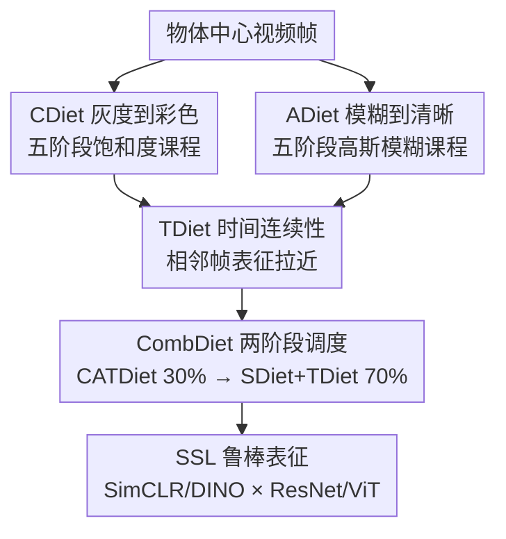

# Learning to See Through a Baby's Eyes: Early Visual Diets Enable Robust Visual Intelligence in Humans and Machines

**会议**: CVPR 2026  
**论文**: [CVF Open Access](https://openaccess.thecvf.com/content/CVPR2026/html/Cai_Learning_to_See_Through_a_Babys_Eyes_Early_Visual_Diets_CVPR_2026_paper.html)  
**代码**: 有（论文称代码/数据/模型在 GitHub 开源，⚠️ 具体地址以原文为准）  
**领域**: 自监督学习 / 发展心理学启发 / 鲁棒视觉表征  
**关键词**: 自监督学习, 视觉发育, 课程学习, 鲁棒性, 时间连续性

## 一句话总结
作者把婴儿视觉发育的三条规律——灰度到彩色、模糊到清晰、保持时间连续——编成自监督训练的"视觉食谱"CATDiet，仅用物体中心视频训练就让 SSL 模型在十个数据集上的损坏图识别、形状偏好、深度感知都更鲁棒，还自发涌现出与猕猴 V1 突触密度、婴儿视崖行为一致的发育信号；进一步提出两阶段的 CombDiet，把它当 warm-up 接上标准 SSL，全面超过常规 SSL。

## 研究背景与动机

**领域现状**：新生儿看到的世界是低分辨率、低饱和度、随时间连续展开的，第一年里视力和色觉才逐渐成熟。发展心理学认为这种"早期受限"不是缺陷，而是把感官经验组织成稳定、可泛化表征的发育脚手架。而 AI 视觉系统恰恰相反——通常直接用全细节、静态图像训练，并靠大量随机数据增强提鲁棒性。

**现有痛点**：标准训练范式"生态无效"（ecologically invalid），忽视了自然视觉是通过结构化、时间连贯的经验逐步发育的，于是现代视觉模型在损坏/遮挡图像上泛化很差。已有受发展心理学启发的工作也有短板：(1) 在婴儿头戴相机视频上预训练的方法只抓了视角统计，没建模低视力、低色觉等关键属性；(2) 建模"模糊到清晰/灰到彩"转变的方法大多是**全监督**、需要成千上万标注样本，生态不合理；(3) 直接在原始视频流上训练难以拆解究竟哪个因素带来了可泛化表征；(4) 多数评测只看干净图识别，忽略鲁棒性。

**核心矛盾**：人类靠"受限且自然"的早期经验长出鲁棒视觉，机器却靠"全细节 + 人工增强"硬凑鲁棒性——前者生态有效但没人在自监督框架里系统建模，后者性能强但脆。

**本文目标**：(1) 把婴儿视觉的关键规律嵌入**自监督**（无标签）训练，做到生态有效；(2) 建一套能系统量化"单个视觉食谱及其组合如何改善鲁棒性"的 benchmark；(3) 看这种发育式训练会不会自发涌现出与生物视觉一致的发育信号；(4) 把它转化成可用于真实 CV 的实用方案。

**切入角度**：逆向工程婴儿视觉发育——不去模仿成熟视觉，而是复刻"受限输入逐步解禁"的发育轨迹，并把它做成数据课程 + 训练目标。

**核心 idea**：用 CATDiet（灰→彩 + 模糊→清晰 + 时间连续）做自监督训练的"视觉食谱"，再用 CombDiet 把它当 warm-up 接标准 SSL。

## 方法详解

### 整体框架
CombDiet 是一个两阶段自监督框架，把人类视觉发育原则同时嵌入"数据课程"和"学习目标"。**第一阶段（前 30% epoch）= CATDiet**，作为模拟婴儿第一年快速视觉发育的 warm-up：它把两条数据课程 CDiet（灰度到彩色）与 ADiet（模糊到清晰）交错叠加，再加一个时间正则目标 TDiet（时间连续性）。**第二阶段（后 70% epoch）= SDiet + TDiet**：SDiet 即常规 SSL 的标准数据增强流水线（对应成熟视觉），同时**保留 TDiet** 让时间连续性贯穿全程。整套框架用两种代表性 SSL 方法（SimCLR、DINO）× 两种骨干（ResNet、ViT）共 4 个变体验证。

### 关键设计

**1. CDiet 灰度到彩色：用五阶段饱和度课程复刻色觉成熟**

针对"现有方法没建模婴儿低色觉"的痛点，CDiet 设计了一个五阶段饱和度调度：每阶段给定一个混合比 $s$，把全彩图 $I_c$ 和其灰度版 $I_g$ 按 $sI_c + (1-s)I_g$ 混合。从第一到第五阶段，$s$ 分别在 $(0.20,0.36)$、$(0.36,0.52)$、$(0.52,0.68)$、$(0.68,0.84)$、$(0.84,1.0)$ 内随机采样；阶段时长（epoch）为 $[10,7,6,5,2]$，逐段缩短，对应婴儿早期色觉敏感度的快速上升。这样模型早期被迫先从亮度/结构而非颜色学起，得到的是更稳的形状型表征而非脆弱的颜色捷径。

**2. ADiet 模糊到清晰：用五阶段高斯模糊课程复刻视力发育**

对应"低视力"这条规律。ADiet 定义五阶段高斯模糊调度，标准差 $\omega \in [4,3,2,1,0]$（对应 $224\times224$ 图像的核大小 $[25,19,13,7,1]$ 像素），阶段时长 $[10,6,6,3,5]$ 逐段递减，呼应"第一年视力近似指数增长"。在 CATDiet 里，ADiet 的模糊调度与 CDiet 的饱和度调度**交错融合**，各自保留自己的阶段时长。先模糊后清晰迫使模型先抓全局轮廓再补细节，避免一开始就被高频纹理带偏。

**3. TDiet 时间连续性：把"相邻帧是同一物体"当成免费监督**

相邻视频帧通常是同一物体在视角上的小幅连续变化，这种时间连贯性提供了一个内在的、免费的监督信号。TDiet 引入时间对齐目标，把相邻帧（及它们经 CDiet/ADiet 增强后的版本）组成正样本集，训练目标是拉近相邻帧表征、鼓励视角不变性。它会按 SSL 方法自适应：在 SimCLR 里把相邻帧及其增强视图在嵌入空间拉近、同时保留原有负样本把非相邻帧推开；在 DINO 里则通过 student/teacher 演化的聚类原型对齐相邻帧特征。和只拉同一帧裁剪视图的 Non-Smooth 基线相比，TDiet 用"跨帧"而非"跨裁剪"的一致性带来更鲁棒的表征。

**4. CombDiet 两阶段调度：让发育食谱当 warm-up 再接成熟视觉**

CATDiet 本身只是受限食谱，单靠它不足以匹敌成熟训练。CombDiet 把训练切成 30% / 70% 两段（比例由网格搜索定）：前段用 CATDiet 模拟第一年发育，后段切到 SDiet（标准 SSL 增强）逼近成人视觉，且**TDiet 在第二阶段继续保留**以维持全程时间连贯。这种"先生态受限、后高效成熟"的混合既保住了早期发育带来的归纳偏置，又拿到了成熟视觉的效率，是把心理学洞察落地成可用 CV 方案的关键一步。

### 损失函数 / 训练策略
所有模型 batch size 64、分辨率 $224\times224$，用 AdamW（学习率 $5\times10^{-4}$、权重衰减 $1\times10^{-4}$）+ 余弦退火 + 10 epoch warm-up，在 RTX A6000 / RTX 6000 Ada 上训练。SSL 目标沿用 SimCLR / DINO 各自的对比/聚类损失，TDiet 作为附加的相邻帧对齐项叠加其上。

## 实验关键数据

Benchmark 覆盖 10 个数据集，主文展示 SimCLR-ResNet，其余变体见附录、结论一致。指标含：**mCE**（mean Corruption Error，损坏图上各类型/各强度归一化误差均值，越低越鲁棒）、**Acc**（top-1）、**S-Bias**（形状偏好，TSCC 上判为形状一致的比例，越高越依赖全局形状）、**dAcc**（深度顺序二分类精度，0.5 为随机）、**FIM**（Fisher 信息矩阵迹，刻画网络对扰动的敏感度/连接性）。

### 主实验

CATDiet 各食谱在 CO3D / CO3D-C 上的对比（SimCLR-ResNet，越低越好的 mCE / 越高越好的 Acc）：

| 食谱 | mCE↓ | Acc↑ | 说明 |
|------|------|------|------|
| CDiet | 84.8 | 68.5 | 单色觉课程 |
| ADiet | 86.9 | 55.8 | 单视力课程 |
| TDiet | 86.2 | 60.9 | 单时间连续性 |
| **CATDiet** | **72.0** | **72.9** | 三者融合，明显优于各单项 |

CombDiet vs 基线（节选，SAY=干净 Acc↑，SAY-C=mCE↓，3D-PC=dAcc↑）：

| 变体 | 配置 | SAY Acc↑ | SAY-C mCE↓ | 3D-PC dAcc↑ |
|------|------|---------|-----------|-------------|
| SimCLR-ResNet | STD | 54.9 | 85.7 | 63.9 |
| SimCLR-ResNet | **CombDiet** | **63.0** | **77.1** | **68.6** |
| DINO-ViT | STD | 54.6 | 79.6 | 74.5 |
| DINO-ViT | **CombDiet** | **55.1** | **76.0** | **78.9** |

（⚠️ CombDiet 大表数字来自 OCR 缓存，个别小数位可能有误，以原文为准。）

### 消融实验

CATDiet 的课程顺序消融——通过改变各阶段课程的顺序构造 REV（反序）、SHF（打乱）、FO（只用第一阶段）、LO（只用原图）四种基线：

| 配置 | 关键指标 | 说明 |
|------|---------|------|
| CDiet（正序） | mCE 84.8 | 完整灰→彩课程 |
| C-LO（只用原图） | mCE 90.8 | 去掉早期受限，掉 6 点 |
| C-SHF（打乱） | mCE 87.3 | 比正序差 2.5% |
| C-REV（反序） | mCE 94.1 | 错误顺序甚至比打乱更差 |

### 关键发现
- **顺序是关键，错序有害**：正序 CDiet 比最佳基线 C-SHF 还低 2.5% mCE；反序 C-REV（94.1）甚至比打乱 C-SHF（87.3）更糟，说明"由受限到解禁"的正确发育顺序提供了正确的归纳偏置。
- **早期受限是脚手架但不能只停在早期**：只用原图的 LO 不如完整课程（C-LO 90.8 vs CDiet 84.8），但只用第一阶段的 FO 也不行——早期约束帮助起步，仍需后续阶段才能长出鲁棒表征。
- **融合 > 各部分之和**：CATDiet 的 mCE 72.0 / Acc 72.9 明显优于 CDiet、ADiet、TDiet 任一单项，三条食谱有协同效应。
- **自发涌现生物发育信号**：CATDiet 的 FIM 在第 5 个 epoch 左右先升后降，与猕猴 V1 突触密度的"先增后减"曲线吻合（CAT-SHF 则单调下降、过早收敛）；深度精度 dAcc 也在第 5 epoch 附近骤升，标志深度敏感性涌现；视崖范式下行为与婴儿一致。

## 亮点与洞察
- **把发展心理学三条规律工程化成"数据课程 + 训练目标"**：CDiet/ADiet 是数据侧课程、TDiet 是损失侧正则，三者正交可拆解，benchmark 能逐一量化贡献——这种"可控变量"式设计让"哪个因素带来鲁棒性"第一次能被定量回答。
- **零监督却涌现生物信号**：模型只看物体中心视频、没用任何婴儿行为或猴脑神经数据，却复现出 V1 突触密度曲线、视崖行为，这种"逆向工程发育"的 aha 点很强，暗示鲁棒性可能是发育轨迹的副产品而非显式优化目标。
- **TDiet 这条"免费监督"可迁移**：把"相邻帧=同物体"当正样本的思路几乎可加到任何视频 SSL 框架上，且对 SimCLR/DINO 都能自适应，迁移成本低。

## 局限与展望
- **SSL 方法与骨干覆盖有限**：因算力只选了 SimCLR、DINO × ResNet、ViT 四种组合，生成式 SSL（如 MAE）被作者以"生态无效"为由排除，是否成立仍可议。
- **课程超参靠手工/网格搜索**：五阶段时长、混合比区间、30%/70% 切分都是经验设定，跨数据集的可迁移性和敏感性未充分展开。
- **数据规模偏小**：SAYCam 仅用 child S 约 3.5 万帧、CO3D 选 10 类，结论能否扩到大规模、更多类目待验证。⚠️ 部分实验数字源自 OCR 缓存，复现前请核对原文。

## 相关工作与启发
- **vs 婴儿头戴视频预训练（SAYCam 类）**：它们抓视角统计但忽略低视力/低色觉；本文显式建模这些属性，并用 benchmark 拆解各因素贡献。
- **vs 监督式"模糊→清晰/灰→彩"方法**：那些工作需大量标注、生态不合理；本文把同样的发育转变放进**自监督**框架，做到完全无标签。
- **vs 标准鲁棒性方法（强数据增强 / 域不变学习）**：它们靠人工增强或非生态目标提 ImageNet-C 鲁棒性；本文转而靠"有限+自然"的早期经验让鲁棒性自发涌现，路径上互补。

## 评分
- 新颖性: ⭐⭐⭐⭐⭐ 把婴儿视觉发育系统编码进自监督课程，并验证涌现生物信号，角度新颖且自洽。
- 实验充分度: ⭐⭐⭐⭐⭐ 10 数据集 + 多任务 + 4 类顺序消融 + 生物对照，覆盖面很全。
- 写作质量: ⭐⭐⭐⭐ 动机与生物动机讲得清楚，但 CombDiet 大表信息密度高、略难读。
- 价值: ⭐⭐⭐⭐ 为"生态有效的鲁棒视觉"提供了可落地范式，对机器人/自驾等高风险场景有启发。

<!-- RELATED:START -->

## 相关论文

- [\[CVPR 2026\] Exploring Visual Pretraining for Learning Language Intelligence](exploring_visual_pretraining_for_learning_language_intelligence.md)
- [\[CVPR 2026\] Free-Grained Hierarchical Visual Recognition](free-grained_hierarchical_visual_recognition.md)
- [\[CVPR 2026\] Franca: Nested Matryoshka Clustering for Scalable Visual Representation Learning](franca_nested_matryoshka_clustering_for_scalable_visual_representation_learning.md)
- [\[CVPR 2026\] Seeing Through the Shift: Causality-Inspired Robust Generalized Category Discovery](seeing_through_the_shift_causality-inspired_robust_generalized_category_discover.md)
- [\[CVPR 2026\] OpenVision 2: A Family of Generative Pretrained Visual Encoders for Multimodal Learning](openvision_2_a_family_of_generative_pretrained_visual_encoders_for_multimodal_le.md)

<!-- RELATED:END -->
