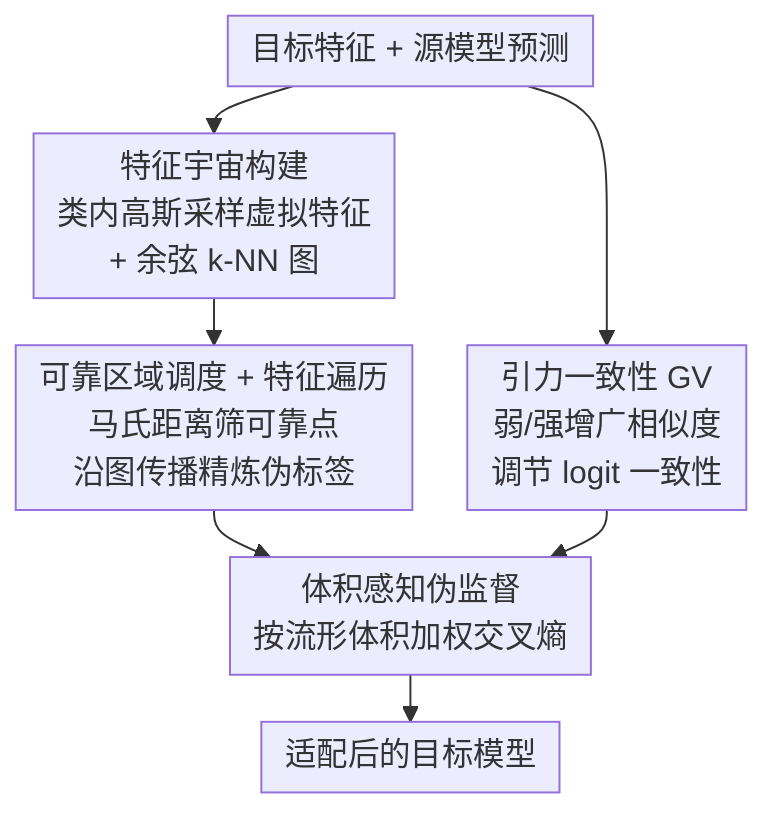

# Measure The Feature Universe: Topology-based Pseudo Labeling and Gravity Consistency for Source-Free Domain Adaptation

**会议**: CVPR 2026  
**论文**: [CVF Open Access](https://openaccess.thecvf.com/content/CVPR2026/html/Lee_Measure_The_Feature_Universe_Topology-based_Pseudo_Labeling_and_Gravity_Consistency_CVPR_2026_paper.html)  
**代码**: 待确认  
**领域**: 自监督 / 表示学习 / 源域无关域适应  
**关键词**: 源域无关域适应, 伪标签, 流形拓扑, 一致性正则, 特征遍历

## 一句话总结
针对源域无关域适应（SFDA），本文把目标特征空间建模成一个带虚拟特征填充的"特征宇宙"，沿余弦 k-NN 图做特征遍历来传播可靠伪标签，并提出"引力一致性"正则——用弱/强增广特征的相似度来调节 logit 一致性的强度，在 Office-Home、DomainNet-126、VisDA-C 上稳定超过此前 SFDA 方法。

## 研究背景与动机
**领域现状**：源域无关域适应（Source-Free Domain Adaptation, SFDA）只给一个预训练好的源模型和一批无标注的目标域数据，不允许访问源数据。主流做法是自训练：用模型自己产生伪标签，再配合一致性正则（Consistency Regularization, CR）来缓解伪标签噪声。

**现有痛点**：作者指出两个被忽视的问题。其一，现有伪标签方法（SHOT、GKD、R-SFDA 等）都在嵌入空间里用欧氏/余弦距离量"样本到类中心"的远近，但它们**假设类簇结构在目标域被良好保持**，而域偏移会让目标嵌入变得稀疏、松散，导致距离估计不可靠、伪标签持续出错——作者称之为"流形无感知伪标签"（manifold-unaware pseudo labeling）。其二，传统 CR 只作用在输出 logit 上，对"特征层面到底可不可靠"是盲的；当它和含噪伪标签的监督一起训练时，反而会强化噪声标签（确认偏置），作者称之为"logit 锚定的虚假正则"（logit-anchored spurious regularization）。如表 1 所示，简单给 SHOT/GKD 加 KL 散度的 CR 只能涨不到 1%。

**核心矛盾**：伪标签的好坏取决于对嵌入流形几何结构的刻画，而 CR 的有效性取决于能否区分"哪些样本的一致性信号可信"——两者都被现有方法用过于粗糙的距离/logit 度量糊弄过去了。

**本文目标**：(1) 建一个能反映目标特征分布几何结构的流形空间来产生伪标签；(2) 让一致性正则对特征级可靠性敏感，避免在不确定样本上过度正则。

**切入角度**：作者观察到——弱增广和强增广提取出的特征越相似，模型对该样本的预测就越可靠（表 2 验证：弱-强特征余弦相似度越高，分类准确率越高）。这给"该信任哪条一致性信号"提供了一个可测量的指标。

**核心 idea**：用虚拟特征把稀疏嵌入空间"填满"成一个可遍历的特征宇宙，让伪标签只从统计上可靠的区域沿图传播；再借物理引力的隐喻，用特征相似度去加权 logit 一致性，把正则集中到结构上真正可靠的样本。

## 方法详解

### 整体框架
方法只用无标注目标数据 $X_t$ 和预训练源模型（编码器 $g$ + 分类器 $f$）。整条流程分两条线：**伪标签精炼线**先把目标特征建模成特征宇宙，再沿图遍历产出精炼伪标签；**一致性正则线**对弱/强增广做引力一致性。最后用体积感知的加权交叉熵把伪标签监督与两类正则一起优化。

### 关键设计

**1. 特征宇宙构建：用虚拟特征把稀疏嵌入填成可建模的流形**

直接在域偏移后的目标嵌入上建余弦 k-NN 图不靠谱——特征太稀疏、簇内不紧致。作者先对所有目标特征 $z_i=g(x_i)$ 做 k-means，得到每类质心 $\mu^{(k)}$ 和概率加权协方差 $\Sigma^{(k)}=\sum_i p_i^{(k)}(z_i-\mu^{(k)})(z_i-\mu^{(k)})^T$；再从类内高斯 $\mathcal{N}(\mu^{(k)},\Sigma^{(k)})$ 中为每类采样 $\lambda$ 个虚拟特征 $v_j^{(k)}$，把空隙补上。真实特征 $Z_t$ 与虚拟特征 $V_t$ 合并成 $Z'_t$ 后再建余弦 k-NN 图 $G=(V,E)$，这张"真实 + 虚拟"特征围绕类高斯排布的图就是**特征宇宙**。它的意义在于：单靠真实点很难捕捉的流形结构，被虚拟特征"撑"出了连续性，让后续标签传播有路可走。

**2. 可靠区域调度 + 特征遍历：只从统计可靠的节点传播标签**

特征宇宙里有些节点本就处于分布外、不可信。作者对每个合并特征 $z'_i$ 算到其伪标签类中心的平方马氏距离 $d_i^2=(z'_i-\mu^{(\bar y_i)})^\top\Sigma^{(\bar y_i)-1}(z'_i-\mu^{(\bar y_i)})$，按类内分布取下 $\rho\%$ 分位作为可靠掩码 $M_i=\mathbb{1}[d_i^2\le \text{Percentile}(D_{\bar y_i},\rho)]$，且分位阈值随训练进度从 $\rho_{\min}$ 渐增到 $\rho_{\max}$（$\tau(e)=\rho_{\min}+(\rho_{\max}-\rho_{\min})\sqrt{e/E}$）——早期只信最可靠的核心点，后期逐步放宽。**特征遍历**则以每个真实目标特征为起点，沿 k-NN 邻居搜索第一个 $M=1$ 的可靠节点，用它的类别作为精炼伪标签 $\hat y_i$；若直接邻居都不可靠就逐跳外扩，超过最大跳数 $H$ 则取最后访问节点的标签。这样标签只会从"密集可靠区"流向边缘样本，避免了距离度量直接打标签的误判。

**3. 引力一致性 GV：用特征相似度给 logit 一致性加权**

传统 CR 只看 logit，无法分辨哪条一致性信号可信。作者借引力隐喻——两个增广图像间的"引力"取决于它们在嵌入空间的几何接近度。GV 把弱/强增广特征的余弦相似度与两者预测的 KL 散度相乘：$L_{GV}=\sqrt{\mathbb{E}_i[\cos(z_i^\alpha,z_i^A)\cdot D_{KL}(p_i^A\|p_i^\alpha)]}$。特征对齐得好时，这一项让 logit 一致性约束更强；开根号则压缩乘积尺度、避免大 KL 值带来的不稳定。本质上是把"结构上是否可靠"直接注入一致性信号，让正则集中在弱-强特征都一致的可靠样本（论文图 1 中的 A 区），而对不可靠区域（C/D 区）减弱约束，从而抑制确认偏置。该模块即插即用，加到 SHOT/GKD/TPDS 上都能涨点。

**4. 体积感知伪监督：按类流形体积平衡交叉熵**

为缓解类别不平衡学习，作者用每类在嵌入空间占据的"流形体积"来加权交叉熵。复用协方差 $\Sigma^{(k)}$ 算归一化感知流形体积 $\tilde V^{(k)}=V^{(k)}/\sum_j V^{(j)}$，其中 $V^{(k)}=\tfrac{1}{2}\log_2\log\det(I+\tfrac{1}{\bar p^{(k)}}\Sigma^{(k)})$，再把它作为权重用在弱/强增广平均预测上的加权交叉熵 $L_{CE}$。直觉是：体积大的类在特征空间分布更广、更易被淹没，给它更高权重能平衡各类学习强度。

### 损失函数 / 训练策略
总目标是三项加权和：体积感知交叉熵 $L_{CE}$、引力一致性 $L_{GV}$、以及 SFDA 常用的信息最大化损失 $L_{IM}$：$L_{total}=\alpha L_{CE}+\beta L_{GV}+\gamma L_{IM}$。消融显示 $L_{IM}$ 不可或缺——单独加 $L_{GV}$ 而无 $L_{IM}$ 时模型会过早收敛、反而掉点（DomainNet-126 上 68.6%→66.3%），因为 $L_{IM}$ 通过平衡逐样本熵与最大化批级熵来防止早熟收敛、维持预测多样性。

## 实验关键数据

### 主实验
在三个标准域适应基准上评测，骨干分别为 ResNet50（Office-Home/DomainNet-126）和 ResNet101（VisDA-C）。完整框架（UP + GV）记为 Ours，灰行表示只把 GV 接到已有方法上。

| 数据集 | 指标 | 本文 (Ours) | 之前 SOTA | 提升 |
|--------|------|------|----------|------|
| Office-Home | 平均准确率 | 74.4% | R-SFDA 74.1% | +0.3% |
| DomainNet-126 | 平均准确率 | 73.6% | 超过现有方法 | — |
| VisDA-C (Sy→Re) | 准确率 | 87.7% ⚠️ | UCON 89.6% | 受显存限制未发挥全部 UP 增益 |

> ⚠️ VisDA-C 上 UP 需对全部特征算类内协方差，显存开销大；作者因实验环境显存受限、跨多 GPU 并行协方差估计，未能完全发挥 UP，故该数据集结果偏保守（仍达 87.7%）。

把 GV 单独接到已有方法上能稳定额外涨点：Office-Home 上 SHOT/GKD/TPDS 分别 +1.1%/+0.6%/+0.4%；DomainNet-126 上 SHOT w/GV、GKD w/GV 平均涨 +5.0%。下表是早期动机实验（表 1）中 GV 与普通 KL 散度 CR 的对比：

| 方法 | A→P | A→R | P→A | R→P |
|------|-----|-----|-----|-----|
| SHOT | 78.8 | 81.3 | 68.0 | 81.3 |
| SHOT + KL | 80.2 (+1.4) | 81.5 (+0.2) | 68.6 (+0.6) | 81.5 (+0.2) |
| SHOT + GV | 80.9 (+2.1) | 82.1 (+0.8) | 68.9 (+0.9) | 82.1 (+0.8) |

可见 GV 在每个迁移任务上都比单纯 KL 的 CR 涨得更多。

### 消融实验
在 Office-Home 上以 SHOT 为基线做逐组件消融：

| 配置 | 平均准确率 | 说明 |
|------|---------|------|
| SHOT 基线 | 71.9% | 不含本文组件 |
| + UP（特征宇宙伪标签） | 72.5% | 拓扑近似 + 标签传播提升伪标签质量 |
| + GV（引力一致性） | +1.1% | 联合特征/logit 级一致性 |
| Full（UP + GV） | 74.4% | 两者协同，最佳 |

### 关键发现
- UP 和 GV 有协同效应：单加各有 0.6%/1.1% 量级收益，合起来到 74.4%，说明"对齐嵌入结构"与"对齐一致性信号"两条线互补。
- GV 离不开 $L_{IM}$：缺 $L_{IM}$ 时单加 GV 会因早熟收敛掉点（66.3% < 68.6%），加回 $L_{IM}$ 后 GV 才稳定增益。
- GV 即插即用：接到 SHOT/GKD/TPDS 等不同 SFDA 框架上都能涨，DomainNet-126 上增益（最高 +5.0%）甚至大于 Office-Home。

## 亮点与洞察
- **"测不准就填满它"的思路很巧**：与其在稀疏嵌入上硬算距离，不如用类内高斯采样的虚拟特征把流形撑成可遍历的图，把"度量问题"转成"图上传播问题"，绕开了欧氏距离假设不成立的难题。
- **用可测量的特征相似度去标定一致性信号的可信度**：表 2 先验证"弱-强特征越像、预测越准"，再据此构造 GV，把一个经验观察直接落成损失项，逻辑闭环且可迁移到任何用弱/强增广 CR 的自训练框架。
- **GV 作为通用插件的价值高于整体框架**：它对已有 SFDA 方法的提升幅度（最高 +5%）甚至超过本文完整框架相对 SOTA 的 +0.3%，这种"低成本即插即用"的设计更可能被后续工作复用。

## 局限与展望
- 作者承认 UP 的协方差估计在大类数/大样本（VisDA-C）下显存开销大，需多 GPU 并行，导致该数据集未发挥全部潜力——可扩展性是现实瓶颈。
- 在 Office-Home 上相对最新 SOTA 只 +0.3%，完整框架的绝对增益有限，主要价值落在 GV 插件而非伪标签部分。
- 虚拟特征采样依赖"类内单高斯"假设，对多模态/长尾类分布是否成立、$\lambda$（每类虚拟特征数）和 $H$（最大跳数）等超参的敏感性，正文未充分展开。
- 改进方向：用更省显存的低秩/对角协方差近似缓解 UP 的内存问题；探索高斯混合替代单高斯以刻画更复杂的类内结构。

## 相关工作与启发
- **vs SHOT / GKD**：它们都在嵌入空间按余弦距离到类中心打伪标签，假设类簇结构被保持；本文指出域偏移下该假设失效，改用虚拟特征 + 图遍历来"流形感知"地传播标签。
- **vs R-SFDA**：R-SFDA 用分类器采样与类中心采样的交集做课程式伪标签；本文同样追求"只标可靠样本"，但靠马氏距离分位调度 + 图遍历实现，且把可靠性沿拓扑连续外扩。
- **vs 传统 KL 一致性正则（AdaContrast 等）**：传统 CR 只锚定 logit、易被噪声伪标签带偏；GV 把特征级相似度乘进 logit 一致性，对特征可靠性敏感，是对 CR 的一次"几何加权"升级。

## 评分
- 新颖性: ⭐⭐⭐⭐ 特征宇宙 + 图遍历伪标签、引力一致性都是新颖且自洽的视角
- 实验充分度: ⭐⭐⭐⭐ 三个标准基准 + 多基线插件验证，但 VisDA-C 因显存未跑满、消融偏轻
- 写作质量: ⭐⭐⭐⭐ 动机—观察—方法闭环清晰，公式完整
- 价值: ⭐⭐⭐⭐ GV 即插即用、对已有 SFDA 普遍涨点，实用价值突出

<!-- RELATED:START -->

## 相关论文

- [\[CVPR 2026\] GaussianMatch: Semi-Supervised Regression with Pseudo-Label Filtering via Multi-View Gaussian Consistency](gaussianmatch_semi-supervised_regression_with_pseudo-label_filtering_via_multi-v.md)
- [\[CVPR 2026\] MemFlow: A Lightweight Forward Memorizing Framework for Quick Domain Adaptive Feature Mapping](memflow_a_lightweight_forward_memorizing_framework_for_quick_domain_adaptive_fea.md)
- [\[CVPR 2026\] Weight Space Representation Learning via Neural Field Adaptation](weight_space_representation_learning_via_neural_field_adaptation.md)
- [\[CVPR 2026\] Free-Grained Hierarchical Visual Recognition](free-grained_hierarchical_visual_recognition.md)
- [\[CVPR 2026\] DGS: Dual Gradient and Semantic-Shift Guided Low-Rank Adaptation for Class Incremental Learning](dgs_dual_gradient_and_semantic-shift_guided_low-rank_adaptation_for_class_increm.md)

<!-- RELATED:END -->
