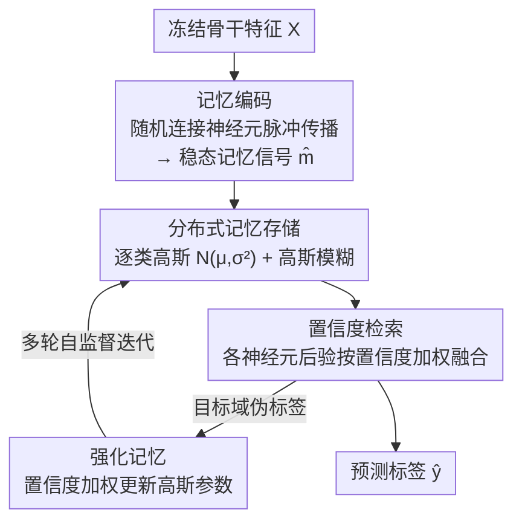

# MemFlow: A Lightweight Forward Memorizing Framework for Quick Domain Adaptive Feature Mapping

**会议**: CVPR 2026  
**论文**: [CVF Open Access](https://openaccess.thecvf.com/content/CVPR2026/html/Lv_MemFlow_A_Lightweight_Forward_Memorizing_Framework_for_Quick_Domain_Adaptive_CVPR_2026_paper.html)  
**代码**: https://github.com/so-link/MemFlow  
**领域**: 自监督 / 迁移学习 / 域适应  
**关键词**: 源域无关域适应, 无梯度学习, 前向记忆, 脉冲传播, 边缘设备

## 一句话总结
MemFlow 提出一个受大脑记忆机制启发、完全不用反向传播的"前向记忆框架"：冻结骨干网络，只用随机连接神经元把特征-标签关联记成高斯分布并按置信度检索融合，实现端侧可用的快速域适应——在四个跨域数据集上最高提升约 10%，而耗时不到传统域适应方法的 1%。

## 研究背景与动机
**领域现状**：把预训练视觉模型部署到真实环境，常因测试场景多样而显著掉点。源域无关无监督域适应（SFUDA）用目标域无标注数据持续优化模型，主流是伪标签法和聚类法。

**现有痛点**：这些 SFUDA 方法都要对深层网络做基于梯度反向传播的优化，而反向传播比前向推理慢得多（Fig. 1a），在算力受限的边缘设备上做在线持续学习几乎不可行。一个更轻量的折中是只重训分类器最后的全连接层（Fig. 1b），但可训练参数太少、效果次优。

**核心矛盾**：要在边缘设备上快速适应新域，就得既冻结深层骨干、又让"特征→预测"的映射足够灵活——但传统做法要么靠昂贵的全网络反传，要么用参数太少的末层重训，二者无法兼得高效率与强适应力。本文把这个被忽视的问题正式定义为**域适应特征映射（DAMap）**：冻结特征提取器 $f$，只用目标域无标注数据优化轻量分类器 $c$。

**切入角度**：作者从大脑生物神经网络（BNN）取经——BNN 能快速适应新域且无需大量标注，且如 Hinton 所言并无显式梯度反传的证据。BNN 靠的是"记忆":结构上分布在大量互联神经元中，功能上经编码-存储-检索三阶段、依赖神经可塑性来快速捕获、保留、检索信号关联。

**核心 idea**：用"分布式记忆的存储与检索"取代"梯度拟合函数"——让随机连接的神经元以脉冲方式把特征-标签关联记成高斯分布，预测时按置信度融合各神经元记忆，并支持用无标注数据做强化记忆，从而无梯度、即插即用地完成快速域适应。

## 方法详解

### 整体框架
MemFlow 接在冻结骨干 $f$ 之后，把分类建模成"在随机连接神经元上的分布式记忆存储-检索"过程，包含四个记忆相关环节：① **记忆编码**——输入特征经随机连接网络以脉冲方式多轮传播，得到每个神经元的稳态记忆信号，实现非线性投影；② **分布式记忆存储**——每个神经元把"记忆信号-标签"关联建模成逐类高斯分布，并用高斯模糊得到"模糊记忆"以防过拟合；③ **置信度检索**——每个神经元据自身记忆给出类别后验与置信度，整网按置信度加权融合出最终决策；④ **强化记忆**——把目标域伪标签喂回去、按置信度加权更新各神经元的高斯参数，多轮自监督迭代完成域适应。整个过程只有前向传播、没有任何反向传播。

### 关键设计

**1. 脉冲式随机投影的记忆编码：用无需学习的随机网络做非线性特征变换**

针对"如何在不训练权重的情况下得到判别性表示"。MemFlow 借鉴脑网络"既有高连接 hub、又有稀疏节点"的拓扑，设三类节点：入口节点（接收输入特征、密连 hub）、hub 节点、桥接节点（稀疏随机连到所有节点），所有边有向、权重在 $[-1,1]$ 随机初始化且不再学习。特征喂入后信号多轮传播，每个节点累积输入并间歇激活形成脉冲：$h_{i,t+1} = h_{i,t} + \sum_{j\in N_i} o_{j,t} W_{ji}$，当 $h_{i,t+1}>0$ 时以该值激活并清零隐状态、否则输出 0，输出再累积成记忆信号 $m_{i,t+1} = m_{i,t} + o_{i,t+1}$，跑满 $T$ 轮得稳态 $\widehat{m}_i = m_{i,T}$。与传统脉冲网络不同，它的输出幅度与正隐状态大小动态挂钩（而非固定二值脉冲），并用显式累积记忆信号把瞬时脉冲转成持久痕迹，从而更细粒度、更可靠。

**2. 高斯分布式记忆存储 + 模糊记忆：把特征-标签关联压成逐类高斯并防过拟合**

针对"逐像素记联想表会爆内存、且小样本下易过拟合"。每个神经元本要存一张二维记忆图 $M_i$（一维是类别 $y$、一维是记忆信号 $\widehat{m}$），但论文用 Theorem 1 证明第 $k$ 类在第 $i$ 个神经元上的记忆信号服从高斯 $P(\widehat{m}_i^k \mid y=k) \sim N(\mu_i^k, (\sigma_i^k)^2)$，于是每个记忆单元只需 $2C$ 个可学习参数（$C$ 为类别数），按批增量更新 $\mu$、$\sigma^2$（$\beta$ 为批间温度）。由于小样本或类别不均会让分布拟合过拟合，作者再引入高斯模糊核 $g(x_1,x_2) = \exp(-\frac{(x_1-x_2)^2}{2\sigma_1^2})$ 对存储分布做卷积，得到模糊记忆 $Q(\widehat{m}_i\mid y=k) = \frac{\sigma_1}{2\sqrt{2(\sigma_i^k)^2+\sigma_1^2}}\exp(-\frac{(\widehat{m}_i-\mu_i^k)^2}{2(\sigma_i^k)^2+\sigma_1^2})$。消融显示高斯模糊带来 >10% 的最大单项增益——它防止输出被单个神经元主导、平衡了各神经元贡献。

**3. 置信度加权的分布式记忆检索：让"记得清"的神经元说话更算数**

针对"如何把分散在大量神经元里的局部记忆融合成一个稳健决策"。检索时第 $i$ 个神经元据模糊记忆给出后验 $\Pr(y=k\mid\widehat{m}_i) = \frac{Q(\widehat{m}_i\mid y=k)}{\sum_c Q(\widehat{m}_i\mid y=c)}$，其最可能类 $K_i$ 的似然作为该节点置信度 $c_i = Q(\widehat{m}_i\mid y=K_i)$。全网决策是各神经元后验按置信度归一化加权 $\Pr(y=k\mid X) = \frac{\sum_i c_i \Pr(y=k\mid\widehat{m}_i)}{\sum_j c_j}$，取 $\arg\max$ 为预测。这样记忆模糊、不确定的神经元自动被降权，比简单投票更稳。

**4. 强化记忆机制：无梯度地用目标域伪标签做域适应**

这是把框架从"静态分类器"变成"会自适应"的关键。目标域样本经前向得到伪标签 $\widehat{y}$ 后，直接喂回去更新高斯参数即可完成适应——无需任何反传。但伪标签有噪声、会累积误差，作者在更新里加入逐节点置信度 $E_i(\widehat{m}_i,\widehat{y}) = Q(\widehat{m}_i\mid y=\widehat{y})$，把 $\mu$、$\sigma^2$ 的批更新改成按 $E_i$ 加权（与伪标签一致性高的节点权重大），抑制噪声引起的震荡。如此可多轮自监督迭代，让学到的分布逼近目标域真实分布。论文用 Theorem 2 给出收敛性：在置信度权有界、真实分布存在的假设下参数几乎必然收敛到有界集，误差界 $\|\Theta^\dagger - \Theta^*\| \le O(\frac{\epsilon E}{1-\beta})$ 正比于伪标签错误率 $\epsilon$，$\epsilon\to 0$ 时以几何速率收敛到真值。

### 一个完整示例
以 Office31 的一次适应为例：一张目标域图先过冻结 ResNet 得特征向量 → 喂入 MemFlow 入口节点，信号在随机网络里传播 $T{=}3$ 轮，各神经元累出稳态记忆信号 $\widehat{m}_i$ → 每个神经元查自己的逐类高斯模糊记忆给出后验和置信度 → 全网按置信度加权融合出预测 $\widehat{y}$；该 $\widehat{y}$ 作为伪标签按 $E_i$ 加权回灌、更新对应类别的 $\mu/\sigma^2$。整个推理+适应每实例仅 0.160ms，是末层重训（retrain@last, 1.397ms）的约 12.5%、PFC 的约 0.3%。

## 实验关键数据

### 主实验
四个跨域数据集，准确率（%，越高越好）与每实例适应耗时（ms，越低越好）。DAMap 设定下与各类轻量分类器替换方案对比：

| 数据集 | retrain@last | retrain@BLS | retrain@KNN | MemFlow (本文) |
|------|------|------|------|------|
| Office-Home (Acc) | 61.6 | 62.6 | 61.9 | **66.0** |
| Office-Home (Time) | 0.082 | 0.088 | 0.305 | **0.057** |
| Office31 (Acc) | 80.4 | 80.4 | 82.3 | **86.1** |
| Digits (Acc) | 86.9 | 89.0 | 87.1 | **89.1** |
| VisDA-C (Acc) | 65.0 | 67.2 | 62.7 | **72.1** |
| VisDA-C (Time) | 0.096 | 0.045 | 0.210 | **0.012** |

MemFlow 在四个数据集上 DAMap 精度全面最高，且耗时最低：VisDA-C 上相对只重训末层提升超 10%。与重型 SFUDA 方法相比，MemFlow 用不到 1% 的适应时间（如 VisDA-C 上）就达到可比精度；它还能作为即插即用模块接入 SHOT/AaD/PFC/TPDS，进一步把这些方法各项指标小幅推高（如 Office-Home 平均 Acc：SHOT 72.9→SHOT+MemFlow 72.3⚠️ 以原文为准，PFC 73.2→73.7，TPDS 73.5→73.9）。

### 消融实验
逐组件消融（准确率 %）。CU=置信度更新、GB=高斯模糊模糊记忆、SM=脉冲机制：

| CU | GB | SM | Office-31 | Office-Home | Digits | VisDA-C |
|----|----|----|-----------|-------------|--------|---------|
| ✗ | ✗ | ✗ | 73.46 | 42.54 | 60.68 | 35.94 |
| ✓ | ✗ | ✗ | 84.97 | 55.57 | 64.17 | 42.60 |
| ✗ | ✓ | ✗ | 84.59 | 65.04 | 89.00 | 70.96 |
| ✓ | ✓ | ✗ | 85.52 | 65.84 | 89.07 | 71.14 |
| ✓ | ✓ | ✓ | **86.08** | **66.00** | **89.14** | **72.08** |

### 关键发现
- 高斯模糊（GB）贡献最大，单加它就在所有数据集带来 >10% 提升——它防止决策被单个神经元主导、平衡各神经元贡献。
- 置信度更新（CU）保证伪标签噪声下的稳定更新；脉冲机制（SM）提供更稳健、可靠的长期记忆，二者各自再带来一致的正向增益。
- 参数分析显示性能对 hub/桥接节点数量（10～200）不敏感（精度均在 85.6～86.1 区间小幅波动），默认 hub=桥接=50、桥接入度 30、传播轮数 $T{=}3$ 即可。

## 亮点与洞察
- 最"啊哈"的是用"记忆存储-检索"彻底替换"梯度拟合函数"：把适应新域从"重训参数"变成"往高斯记忆里多记几笔"，于是无梯度、可增量、端侧友好——这条路线对算力受限的持续学习场景很有想象空间。
- 用 $2C$ 个高斯参数压缩"特征-标签联想表"+ 高斯模糊防过拟合，是把生物记忆抽象成可计算模块的巧妙工程化；置信度加权融合与置信度加权更新两处复用同一个"似然即置信度"思想，简洁自洽。
- 即插即用属性强：既能当独立 DAMap 分类器，又能接在 SHOT/AaD/PFC/TPDS 后面提升它们，迁移成本低。

## 局限与展望
- 与重型 SFUDA（SHOT/AaD/PFC/TPDS）相比，MemFlow 单独使用时绝对精度仍有差距（如 VisDA-C 72.1 vs AaD 88.0），它换来的是数量级的速度优势，而非精度 SOTA。
- 高斯存储假设"逐类记忆信号服从高斯"，在强多峰或长尾分布下是否成立存疑；Theorem 1/2 的证明依赖补充材料，⚠️ 收敛界等推导细节以原文为准。
- 随机网络拓扑、权重范围 $[-1,1]$、传播轮数等设计偏经验，缺乏对随机连接为何有效的更深机理分析。
- 强化记忆依赖伪标签质量，误差率 $\epsilon$ 直接抬高误差下界；目标域极端漂移时伪标签崩坏的风险未充分讨论。

## 相关工作与启发
- **vs SFUDA（SHOT/AaD/PFC/TPDS）**: 它们靠梯度反传优化深层网络，精度高但慢、只适合服务器端；MemFlow 冻结骨干、无梯度记忆更新，精度略低但快几个数量级，且可作为插件增强它们。
- **vs retrain@last 及各类轻量分类器替换（KNN/SVM/RF/BLS/XGB 等）**: 这些在 Fig. 1c 框架里替换末端分类器，要么参数太少效果差、要么重训慢；MemFlow 在同框架下精度与速度同时领先。
- **vs 无梯度网络（ELM/BLS/ESN/Forward-Forward）**: 这些本质仍是"拟合一个输入→输出的函数"，而 MemFlow 是把输入-输出关联**记忆**在分布式神经元里，并能在无标注目标域上做强化记忆——这是范式上的根本差异。

## 评分
- 新颖性: ⭐⭐⭐⭐⭐ 以分布式记忆替代梯度拟合、无反传完成域适应，并正式提出 DAMap 问题，范式新颖。
- 实验充分度: ⭐⭐⭐⭐ 四数据集、丰富 DAMap/SFUDA 对比与组件消融、参数分析到位；但单独使用精度未达 SFUDA SOTA。
- 写作质量: ⭐⭐⭐⭐ 生物动机—四阶段方法—两条定理脉络清晰，部分证明与集成细节压在补充材料。
- 价值: ⭐⭐⭐⭐⭐ 不到 1% 耗时的端侧快速适应、即插即用，对边缘持续学习实用价值高。

<!-- RELATED:START -->

## 相关论文

- [\[CVPR 2026\] Measure The Feature Universe: Topology-based Pseudo Labeling and Gravity Consistency for Source-Free Domain Adaptation](measure_the_feature_universe_topology-based_pseudo_labeling_and_gravity_consiste.md)
- [\[CVPR 2026\] HCL-FF: Hierarchical and Contrastive Learning for Forward-Forward Algorithm](hcl-ff_hierarchical_and_contrastive_learning_for_forward-forward_algorithm.md)
- [\[CVPR 2026\] From Feature Learning to Spectral Basis Learning: A Unifying and Flexible Framework for Efficient and Robust Shape Matching](from_feature_learning_to_spectral_basis_learning_a_unifying_and_flexible_framewo.md)
- [\[CVPR 2026\] Learning by Analogy: A Causal Framework for Compositional Generalization](learning_by_analogy_a_causal_framework_for_compositional_generalization.md)
- [\[CVPR 2026\] TeFlow: Enabling Multi-frame Supervision for Self-Supervised Feed-forward Scene Flow Estimation](teflow_enabling_multi-frame_supervision_for_self-supervised_feed-forward_scene_f.md)

<!-- RELATED:END -->
