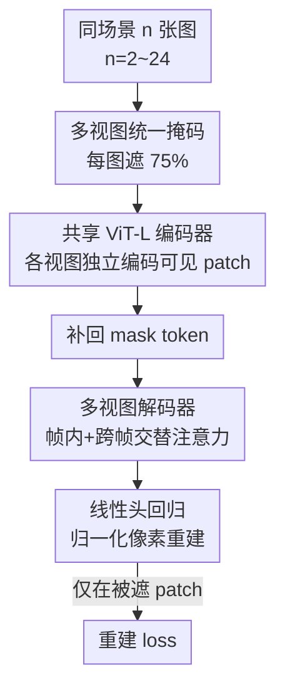

# MuM: Multi-View Masked Image Modeling for 3D Vision

**会议**: CVPR 2026  
**论文**: [CVF Open Access](https://openaccess.thecvf.com/content/CVPR2026/html/Nordstrom_MuM_Multi-View_Masked_Image_Modeling_for_3D_Vision_CVPR_2026_paper.html)  
**代码**: https://github.com/davnords/mum  
**领域**: 3D视觉 / 自监督预训练  
**关键词**: 掩码图像建模, 多视图自监督, 3D特征学习, MAE, CroCo

## 一句话总结
MuM 把 MAE 的「掩码-重建」目标从单图直接推广到同一场景的任意多视图（最多 24 张），用一个轻量的多视图解码器在帧间做交替注意力，预训练出几何感强的特征编码器；在前馈三维重建、稠密匹配、相对位姿等 3D 任务上，用约 1/30 的训练算力超过了 DINOv3 和 CroCo v2。

## 研究背景与动机

**领域现状**：图像自监督学习（SSL）现在主要走两条路。一条是掩码自编码（MAE）家族——把图像随机遮一大半，让网络重建被遮的像素；另一条是自蒸馏/实例判别的 DINO 家族，DINOv3 是当下语义特征的 SOTA。3D 视觉的主流管线（VGGT、MapAnything、RoMa 等）越来越喜欢拿一个强预训练编码器当 backbone，再接几何头。

**现有痛点**：DINO 系列学到的特征被普遍认为偏「语义」而非「几何」，且训练极贵——DINOv3-7B 要 161,440 H100 小时，还得靠 Sinkhorn-Knopp 居中这类精心设计的启发式避免坍塌，外加几十亿张图的数据量，学术界基本玩不起。MAE 派里专门为 3D 设计的是 CroCo：它给重建任务额外条件化一张「未遮挡的参考视图」来逼网络学几何对应，但这要求两张图有大量共视区域，采样很脆弱；后续把任务改成共视分割又得依赖真值几何，反过来削弱了「自监督」的纯粹性。

**核心矛盾**：想要几何特征，CroCo 的双视图条件重建在「数据采样灵活性」和「几何监督强度」之间被卡死——参考视图必须共视、还很难自然推广到两张以上；想要省算力又拿不出 DINO 那种语义+几何兼顾的强度。

**本文目标**：设计一个简单、可扩展、对采样宽容的 SSL 目标，专门学 3D 任务要的几何特征，并且训练成本能压到学术可承受的量级。

**切入角度**：作者发现 CroCo 的「双视图」其实是个不必要的约束。既然 MAE 已经能从单图重建里学到不少东西，那干脆把「同场景多视图 + 统一掩码」喂进去，让网络在重建每张图时被迫去借助其他视图的可见信息——几何对应关系就在「跨视图帮忙补全」这个任务里自然涌现，而且 $n=1$ 时无缝退化回标准 MAE，采样彻底不依赖共视。

**核心 idea**：把 MAE 重建目标从「一张图」扩展到「同场景任意多张图」，所有视图统一掩码、用一个带帧间交替注意力的轻量解码器联合解码，用极简的像素重建 loss 学几何特征。

## 方法详解

### 整体框架
MuM 是一个 ViT 编码器-解码器结构的自监督预训练框架。输入是同一场景的一串图像 $I=(I_1,\dots,I_n)$（训练时 $n$ 在 2~24 间随机），每张图切成不重叠的 patch，按统一掩码率 75% 遮掉一部分；可见 patch 各自独立过一个**共享权重的 ViT-L 编码器**；编码后给每张图补回可学习的 mask token，所有视图的 token 一起送进一个**轻量 ViT-B 多视图解码器**，解码器用交替注意力让同一视图内部和跨视图之间都能通信；最后线性头把每个 patch 回归成归一化的 RGB 像素值，只在被遮位置算重建误差。整个目标在 $n=1$ 时恰好等于原版 MAE，因此天然支持单图/多图混合训练。

### 关键设计

**1. 多视图掩码图像建模：把 MAE 从单图推广到任意多视图**

CroCo 的痛点在于它只接受「双视图 + 一张当参考的未遮图」，采样脆弱又难推广。MuM 直接把问题一般化：给定同场景序列 $I=(I_1,\dots,I_n)$，每张图按二值掩码 $M_i\in\{0,1\}^N$（masking ratio $\omega_i$）遮一部分，网络 $\varepsilon_\vartheta$ 从可见部分预测目标表示，损失（去掉归一化常数）为

$$L(\vartheta)=\sum_{i=1}^{n}\big\|M_i\odot(\varepsilon_\vartheta(\tilde I_i)-f(I_i))\big\|^2$$

其中 $f$ 指定重建目标，MuM 取最简单的「patch 内像素按均值方差归一化」，所以单视图时 $L$ 完全退化成 MAE。关键差异是：MuM 统一用 $\omega_i=0.75$、不留任何未遮参考视图，$n$ 在 2~24 间均匀采样。这样做有两个直接好处：一是采样彻底不依赖共视，实在采不到共视也能退回标准 MAE，不会像 CroCo 那样卡住；二是「向多视图扩展」是自然的，而 CroCo 一旦超过两视图，各视图掩码率该怎么配根本不明确。几何对应在这里不是靠显式条件化逼出来的，而是「重建被遮 patch 时不得不去其他视图找线索」自然涌现的。

**2. 对称的帧间交替注意力解码器：在解码端做跨视图通信，且不指定参考帧**

要让多视图真正互相帮忙，必须有跨视图的信息流，但放在哪、怎么放有讲究。MuM 把通信放在解码器：编码阶段各视图的可见 patch **独立**过共享 ViT-L 编码器（互不干扰、可并行），补回 mask token 后，所有视图 token 一起进 ViT-B 解码器的 $L=6$ 个**交替注意力块**，每块先做 (i) 帧内注意力（注意力限制在单视图内），再做 (ii) 全局注意力（token 跨所有视图互相 attend）。这套交替注意力沿用自 VGGT，但 MuM 用在 SSL 语境里，并刻意做成**对称**结构——不像 CroCo / DUSt3R 那样要钦定一张参考帧，所有视图地位平等。消融显示通信必须放解码器：放编码器里 EPE 从 10.6 恶化到 16.7，因为过早跨帧混合反而干扰了各视图自身可见 patch 的表示学习；而「加一张未遮参考视图」不但没收益，还让 EPE 从 10.6 略微变差到 11.9，等于白白增加架构复杂度。

**3. 极简像素重建目标 + 现代 ViT 组件：用最便宜的监督学到最强几何特征**

这篇最反直觉的发现是：在多视图 3D 数据上，朴素的像素重建竟然打过了 DINOv2 那套自蒸馏。作者把三个主流 SSL 目标（DINOv2、CroCo v2、MAE）在同等数据和训练预算下对照（ViT-B、MegaDepth、100K 步），结果 MAE 改成多视图后 EPE 从 18.7 降到 12.5，而 DINOv2 改多视图几乎没动（28.9→28.4）；更关键的是 MAE 目标在概念和算力上都简单得多，训练快 3 倍以上。作者也试过把重建目标从像素换成更高层表示，语义任务确实变好，但几何性能反而变差——这说明像素级、低层的重建恰好是几何特征要的「信号」。在此之上 MuM 还套了一批已被验证有效的现代组件：轴向 RoPE 位置编码（消融里 RoPE 的 EPE 10.6 优于绝对位置编码的 12.1）、75% 掩码率（65%/75%/85% 里 75% 最优）、归一化像素目标（带归一化 10.6 优于不带的 13.4）。这些单项收益不大，但叠起来让一个「便宜」的目标稳稳超过昂贵的 DINOv3。

### 损失函数 / 训练策略
预训练用 AdamW 跑 500K 步，25K 步线性 warmup + 余弦衰减，base lr $1\times10^{-4}$，按线性缩放规则在 batch size 6144 下峰值 lr 达 $2.4\times10^{-3}$。每个 batch 在 2~24 间随机选序列长度，再在不超过每 GPU 96 帧的约束下尽量多塞场景；图像 resize 到 $256\times256$，按帧随机水平翻转。训练数据混了约 2000 万帧的 11 个 3D 数据集（3DStreetView、ARKitScenes、CO3D、MegaDepth、ScanNet++、RealEstate10K 等），并以 10% 概率掺入纯单视图的 ImageNet-1K——这正是对称目标支持单/多视图混训带来的便利。预训练在 64×A100 上约三天。在做前馈重建评测时，还提供一种蒸馏微调：保留解码器、接上相机/深度/点云头，用无权 L2 loss 蒸馏 VGGT：$L(\vartheta)=\sum_i\|P_t-P_s\|^2+\|C_t-C_s\|^2+\|D_t-D_s\|^2$（$P,C,D$ 为世界点、相机参数、深度图）。

## 实验关键数据

### 主实验
MuM 在多视图 3D 任务上全面超过 DINOv3 和 CroCo v2。多视图相机位姿与点云估计（冻结编码器）结果：

| 任务 | 指标 | CroCo v2 | DINOv3 | MuM |
|------|------|----------|--------|-----|
| 相机位姿 CO3Dv2 | AUC@30 ↑ | 58.2 | 66.9 | **71.5** |
| 相机位姿 Re10K | AUC@30 ↑ | 27.7 | 36.7 | **50.8** |
| 相机位姿 MegaDepth | AUC@30 ↑ | 60.7 | 59.3 | **73.0** |
| 点云 DTU | Acc. ↓ | 8.5 | 6.4 | **3.7** |
| 点云 ETH3D | Acc. ↓ | 0.9 | 0.9 | **0.8** |

稠密特征匹配线性探针（EPE 越低越好）对比一众 backbone：

| 方法 | 架构 | MegaDepth EPE ↓ | MegaDepth R ↑ | ScanNet EPE ↓ |
|------|------|-----------------|---------------|----------------|
| DINOv3 | ViT-L/16 | 19.0 | 86.4 | 28.7 |
| CroCo v2 (DUSt3R 微调) | ViT-L/16 | 22.0 | 80.9 | 29.0 |
| MAE | ViT-L/16 | 29.7 | 73.4 | 35.0 |
| **MuM** (32×A100) | ViT-L/16 | **12.0** | **93.7** | 30.2 |
| **MuM** (64×A100) | ViT-L/16 | **10.2** | **94.2** | **27.9** |

两视图相对位姿上 MuM 也领先：MegaDepth AUC@5° 达 26.7，远超 DINOv3 的 15.6 和 CroCo v2 的 13.9。值得注意的是，MuM 用约 4,608 A100 小时训练，对照 DINOv3-7B 的 161,440 H100 小时，算力约低 30 倍。

### 消融实验
ViT-B/16 在 MegaDepth 训 100K 步，报线性探针的 EPE（↓）与分类 Acc（↑）：

| 配置 | EPE ↓ | 说明 |
|------|-------|------|
| 默认 (75% mask, 2~24 帧, 解码器通信, RoPE, 归一化) | 10.6 | 完整设置 |
| 序列长度 2,6 → 2,24 | 12.8 → 10.6 | 序列越长匹配越好 |
| mask 65% / 85% | 13.3 / 12.7 | 75% 最优 |
| 加未遮参考视图 | 11.9 | 反而变差，且复杂化架构 |
| 通信放编码器 | 16.7 | 必须放解码器 |
| 绝对位置编码 | 12.1 | RoPE 更优 |
| 不做像素归一化 | 13.4 | 归一化重要 |

同等预算下的目标对比（ViT-B、100K 步）：MAE 单图 18.7 → 多视图 **12.5**，而 DINOv2 多视图仅从 28.9 微动到 28.4，且 MAE 训练快 3 倍以上。

### 关键发现
- **最反直觉的点**：在多视图几何数据上，朴素像素重建（多视图 MAE）打过了昂贵的 DINOv2 自蒸馏；把重建目标换成高层表示会提升语义、却损害几何，说明几何特征要的是低层像素信号。
- **跨视图通信必须放解码器**：放编码器会过早干扰各视图自身表示（EPE 16.7 vs 10.6）。
- **CroCo 的参考视图是负担**：去掉它反而更好（10.6 vs 11.9），并且简化架构、让单/多视图混训成为可能。
- **序列越长越好、深层特征越好**：2→24 帧单调提升匹配；线性探针取最后一层特征优于中间层。
- **代价分布**：MuM 强在所有多视图/两视图几何任务；单视图语义任务（分类、分割、单目深度）仍落后 DINOv3，因为后者的实例判别 loss 专门偏向语义。

## 亮点与洞察
- **「少即是多」的范式宣言**：用最朴素的像素重建 + 多视图扩展，以约 1/30 算力超过 DINOv3，强有力地说明几何特征不必靠昂贵的自蒸馏堆出来——对算力有限的学术界是很实在的解放。
- **对称设计去掉参考帧**：CroCo/DUSt3R 都要钦定一张参考视图，MuM 让所有视图平权，既简化架构又支持单/多视图无缝混训，$n=1$ 自动退回 MAE 这个性质非常优雅。
- **「编码独立、解码通信」的分工**可迁移：编码端各视图独立过共享权重便于并行与扩展，把跨视图交互推迟到解码端，这套思路对任何「多输入 + 需要交互」的预训练都有借鉴价值。
- **目标决定特征性质**：像素目标利几何、表示目标利语义这一观察，给「先想清楚下游要什么再设计预训练目标」提供了具体证据。

## 局限与展望
- **作者承认**：受算力限制无法把预训练规模继续推大，也没资源完整复现 VGGT/MapAnything 那种大规模前馈重建管线，所以多视图重建的优势是「强烈暗示」而非端到端验证。
- **语义任务偏弱**：单视图分类/分割/单目深度仍不及 DINOv3，纯几何目标牺牲了语义归纳偏置；作者把「融合 DINO 语义 + 多视图几何」列为未来方向。
- **自己的观察**：消融主要在 ViT-B/MegaDepth/100K 步的轻量设定下做，结论是否在更大模型、更杂数据上同样稳健还需更多验证；24 帧上限和 96 帧/GPU 的约束也意味着超长序列的行为尚未被探索。
- **改进思路**：作者提到引入等变性提升效率、以及用完整 MuM 替换 RoMa v2 编码器和多视图 transformer，都是值得做的工程化延伸。

## 相关工作与启发
- **vs CroCo / CroCo v2**: 都想学 3D 几何特征。CroCo 用「双视图 + 未遮参考视图」条件重建，依赖共视、难推广到多视图；MuM 改成「任意多视图统一掩码、无参考帧」，采样更宽容、$n=1$ 退回 MAE，且在匹配、位姿、点云上全面领先。
- **vs DINOv3**: DINOv3 靠 student-teacher 自蒸馏 + 实例判别学到强语义特征，但算力极贵且偏语义。MuM 用约 1/30 算力、纯像素重建，在几何任务上超过它，但单视图语义任务仍落后——两者各擅胜场。
- **vs MAE**: MuM 是 MAE 的直接多视图推广，单视图时完全等价；多视图扩展把 EPE 从 18.7 拉到 12.5，证明「多视图 + 帧间通信」是把 MAE 用于 3D 的关键升级。
- **vs VGGT**: 借用了 VGGT 的帧间交替注意力和 2~24 帧均匀采样，但 VGGT 是大规模有监督前馈重建，MuM 把这套注意力机制搬进自监督预训练，并做成对称无参考帧结构。

## 评分
- 新颖性: ⭐⭐⭐⭐ 思路简单但精准——把 MAE 推广到多视图并去掉 CroCo 的参考帧约束，是「简化即创新」的好范例。
- 实验充分度: ⭐⭐⭐⭐⭐ 覆盖前馈重建/匹配/位姿/深度/法线/分类分割六类任务，目标与架构消融详尽，对照 backbone 全面。
- 写作质量: ⭐⭐⭐⭐ 动机推导清晰、消融讲得透，公式与符号规范；个别下游协议细节压在附录。
- 价值: ⭐⭐⭐⭐⭐ 用 1/30 算力超 DINOv3，几何预训练对学术界的可复现性意义重大，且代码开源。

<!-- RELATED:START -->

## 相关论文

- [\[CVPR 2026\] Suppressing Non-Semantic Noise in Masked Image Modeling Representations](suppressing_non-semantic_noise_in_masked_image_modeling_representations.md)
- [\[CVPR 2026\] GeoBridge: A Semantic-Anchored Multi-View Foundation Model for Geo-Localization](geobridge_semantic-anchored_multi-view_foundation_model_for_geo-localization.md)
- [\[CVPR 2026\] GaussianMatch: Semi-Supervised Regression with Pseudo-Label Filtering via Multi-View Gaussian Consistency](gaussianmatch_semi-supervised_regression_with_pseudo-label_filtering_via_multi-v.md)
- [\[CVPR 2025\] From Prototypes to General Distributions: An Efficient Curriculum for Masked Image Modeling](../../CVPR2025/self_supervised/from_prototypes_to_general_distributions_an_efficient_curriculum_for_masked_imag.md)
- [\[CVPR 2026\] TALO: Pushing 3D Vision Foundation Models Towards Globally Consistent Online Reconstruction](talo_pushing_3d_vision_foundation_models_towards_globally_consistent_online_reco.md)

<!-- RELATED:END -->
