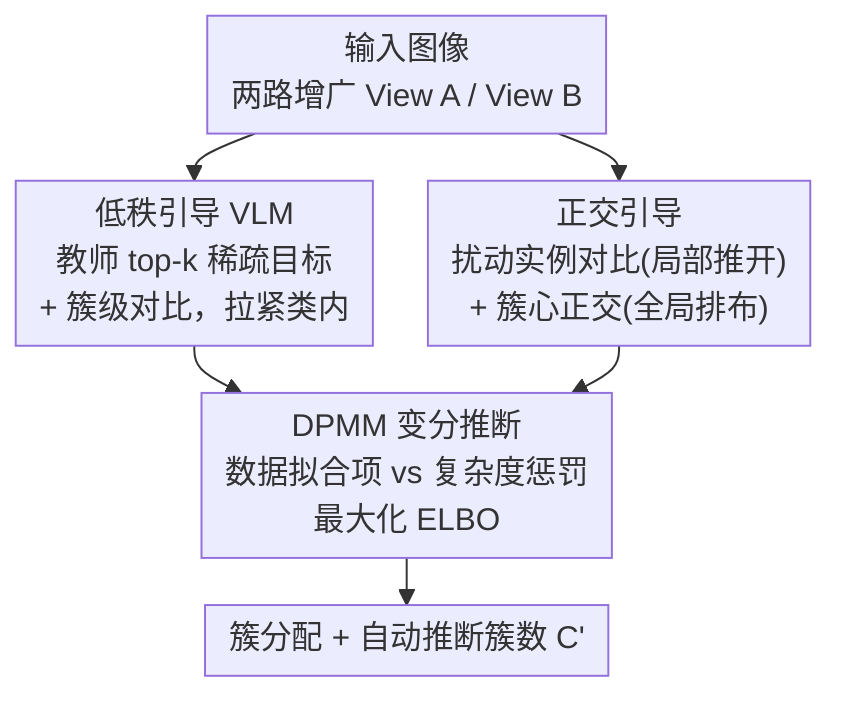

# Nonparametric Deep Fine-grained Clustering with Low-Rank Guided Vision-Language Model

**会议**: CVPR 2026  
**论文**: [CVF Open Access](https://openaccess.thecvf.com/content/CVPR2026/html/Ye_Nonparametric_Deep_Fine-grained_Clustering_with_Low-Rank_Guided_Vision-Language_Model_CVPR_2026_paper.html)  
**代码**: https://github.com/HenryWells02/VLMFine-Clustering  
**领域**: 自监督 / 深度聚类 / 多模态VLM  
**关键词**: 细粒度聚类, 低秩引导, VLM 教师, 正交约束, 狄利克雷过程

## 一句话总结
用冻结 VLM 当"教师"把无监督细粒度聚类的低秩压缩重写成 top-k 选择，再叠加扰动实例对比 + 簇心正交约束，最后塞进狄利克雷过程变分推断里同时学表征并自动推断簇数，在 CUB/Dogs/Flower/Pet 等细粒度基准上刷出 SOTA。

## 研究背景与动机
**领域现状**：深度聚类靠神经网络端到端地同时学表征和簇分配；近年的主流是用大模型（CLIP 这类 VLM、甚至 LLM）的先验知识来"辅助聚类"，在通用粗粒度数据上效果显著。

**现有痛点**：把这套搬到**细粒度聚类**上会双重翻车。其一，通用大模型几乎都在**粗粒度**数据上预训练——粗粒度数据"类间方差大、类内方差小"，而细粒度数据恰好相反（同属不同种的鸟长得几乎一样、同一种鸟姿态颜色却变化很大），导致大模型抓不住区分子类所需的细微语义差异。其二，几乎所有深度聚类方法都要**预先指定簇数 $C$**，这在真实数据探索里根本不现实；少数在细粒度数据上微调过的大模型又都是有监督分类模型，依赖聚类场景下拿不到的标签。

**核心矛盾**：细粒度聚类要同时治两个病——**类内松散**（类内方差大导致同类样本散开）和**类间模糊**（类间差异小导致不同簇粘连），还得在**不知道簇数**的前提下做。

**本文目标**：在无细粒度标签、无预设簇数的条件下，让 VLM 适配细粒度聚类，动态发现反映子类的簇。

**切入角度**：作者从一个理论观察出发——若模型完美，同一语义类所有样本的预测向量应当一致，那么这些预测堆成的矩阵 $P$ 的**秩应为 1**。低秩 = 类内紧凑。但"哪些样本同类"恰恰未知，无法直接构造 $P$，于是借自监督思路把目标转移到"单样本的多个增广版本预测应趋于同一稀疏原型"。

**核心 idea**：把低秩压缩重写成"向 VLM 给的 top-k 稀疏目标对齐"（可微代理），配上正交化拉开簇间，再用狄利克雷过程变分推断把表征学习和簇数推断统一进一个 ELBO 目标里。

## 方法详解

### 整体框架
方法围绕一个学生模型 $F(\cdot)$（共享编码器 $f_\theta$ + 预测头 $g_\theta$）和一个冻结 VLM 教师 $f_{teacher}$ 展开，对每张输入图做两路非对称增广 View A（$T_A$）和 View B（$T_B$）：学生处理两路，教师只看 View B 生成稀疏目标。整条管线由三块拼成——**低秩引导**负责把同类拉紧（类内紧凑），**正交引导**负责把异类推开（类间可分），二者作为"数据拟合项"被嵌进**DPMM 变分推断**的 ELBO 里，而 DPMM 先验天然带的"复杂度惩罚项"在训练中动态正则掉多余簇，使有效簇数 $C'$ 在收敛时自动浮现，无需预设。

### 关键设计

**1. 低秩引导 VLM：把"矩阵秩为 1"重写成对 VLM top-k 目标的可微对齐**

针对"类内松散"这一痛点。理想中同类样本预测矩阵 $P$ 应满足 $\mathrm{Rank}(P)=1$，但同类样本未知、且直接最小化矩阵秩是 NP-hard 且不可微。作者用自监督做转移：对单样本 $x_i$ 生成多个增广 $\{\hat{x}_{i,m}\}$，要求其预测矩阵 $D=[F(\hat{x}_{i,1}),\dots]^T$ 的秩趋近 1（定理 1 把它松弛为"所有行向量 $c_m$ 收敛到同一个 $k$-稀疏原型 $t$，$\|t\|_0\le k$"）。落地时引入教师：教师对 View B 做 $T^B_i=\mathrm{TopK}(f_{teacher}(T_B(x_i)))$ 给出高置信、无梯度的稀疏目标，再用低秩引导损失 $L_{guidance}=-\frac{1}{N}\sum_i\sum_j \mathbb{I}(j\in T^B_i)\log(p^A_{\theta,i,j})$ 逼学生（View A 预测）向它对齐。这样就把"求秩"换成了"选 top-k 类索引"这一高效可微任务——VLM 的语义先验充当低秩信号源。另配簇级对比损失 $L_{clu\_con}$（用 View A 的软分配 $p^A_{\theta,i}$ 同时聚合两路特征算簇心、拉近同簇正对）做几何压缩：$L_{guidance}$ 当"语义锚"保证簇低秩且语义正确，$L_{clu\_con}$ 当"几何压实器"保证物理紧致，合成 $L_{cluster}=L_{clu\_con}+\lambda_{guide}L_{guidance}$。

**2. 正交引导：局部"推"实例 + 全局"排"簇心，治类间模糊**

仅靠紧凑还不够——细粒度里常出现多个紧凑簇却彼此纠缠相邻。作者设计"自底向上局部推 + 自顶向下全局导"的组合。局部用带扰动的实例对比 $L_{ins\_con}$（InfoNCE 形式）：对输入加可学习微扰，这个扰动对正对（同类）语义无关紧要，却**放大负对（异类）间被掩盖的细微差异**，把对比任务变难、逼模型学出更宽的类间间隔。全局则在一个**共享可学习原型矩阵** $M=[m_1,\dots,m_C]$ 上加正交损失 $L_{ortho}=\|M^TM-I\|_F^2$，强迫各簇原型张成互相正交的一维子空间。妙处在于 $M$ 不是随机向量：因为学生靠比对特征与 $M$ 来产生预测 $p^A_{\theta,i}$，$L_{cluster}$ 在训练它对齐教师语义的同时也把 $M$ 灌满了从教师间接继承的高层概念，所以正交约束作用在一个"语义已落地"的参数矩阵上才有意义。两者协同成 $L_{separability}=L_{ins\_con}+\lambda_{ortho}L_{ortho}$。

**3. DPMM 变分推断：用复杂度惩罚自动推断簇数 $C$**

针对"必须预设簇数"的硬约束。作者把整个聚类嵌进狄利克雷过程混合模型（DPMM）的非参贝叶斯框架，目标从"最小化启发式损失"改成"最大化证据下界 ELBO"。ELBO 可分解为两项：**数据拟合项** $\mathbb{E}_{q(Z)}[\log p(X|Z)]$ 衡量簇结构对数据的解释力（通过最小化前两块 $L_{cluster}+L_{separability}$ 来最大化它，倾向更多簇），与**复杂度惩罚项** $\mathrm{KL}(q(Z,V)\|p(Z,V))$（来自 stick-breaking 先验，天然偏好少簇）。混合权重由 $\pi_l=V_l\prod_{j<l}(1-V_j)$ 生成。两项相互拉扯：只有当新增一个簇带来的拟合增益**显著超过**复杂度代价时，模型才会"激活"并使用该簇；收敛后真正承载非可忽略样本量的有效簇数，就是模型从数据本身动态推断出的最优 $C'$。整框架端到端最大化 ELBO，复杂度惩罚作为 DPMM-VI 的固有部分被隐式最小化，不需额外平衡超参。

### 损失函数 / 训练策略
总目标是最大化 ELBO（Eq.14），实践中由最小化数据拟合损失 $L_{DataFitting}=L_{cluster}+L_{separability}$ 驱动，复杂度惩罚 $\mathrm{KL}(q\|p)$ 在变分优化中隐式最小化。学生用 ResNet-50 主干，教师用冻结的 ResNet-50 或 CLIP（ViT-B/16）。训练 500 epoch、batch 64、Adam、lr 3e-4；$\tau_i=0.1$、$\tau_c=0.5$、$\lambda_{guide}=1.2$、$\lambda_{ortho}=0.8$、DPMM 浓度参数 $\alpha=0.4$、top-$k$ 取 3。单卡 RTX 4080。

## 实验关键数据

> **指标说明**：NMI（Normalized Mutual Information，归一化互信息，衡量预测簇与真实标签的信息一致性，越高越好）；ACC（Clustering Accuracy，最优匹配后的聚类准确率，越高越好）。两者均以百分数报告。

### 主实验
四个细粒度数据集（CUB-200-2011 鸟、Stanford Dogs 狗、Oxford Flower 花、Oxford-IIIT Pet 宠物）上，配 CLIP 教师的版本（Ours+CLIP）在全部数据集刷新 SOTA；即便用普通 ResNet 教师也已超过多数 VLM 引导方法。

| 数据集 | 指标 | Ours+CLIP | 之前最好 | 提升 |
|--------|------|-----------|----------|------|
| CUB-200-2011 | NMI / ACC | 70.9 / 41.8 | 64.6 / 34.7 (TAC) | +6.3 / +7.1 |
| Stanford Dogs | NMI / ACC | 69.1 / 53.2 | 64.8 / 48.7 (TAC) | +4.3 / +4.5 |
| Oxford Flower | NMI / ACC | 88.4 / 72.6 | 81.5 / 69.7 (CLUDI) | +6.9 / +2.9 |
| Oxford-IIIT Pet | NMI / ACC | 88.0 / 82.2 | 87.3 / 74.1 (CLUDI) | +0.7 / +8.1 |

在大规模通用数据集（ImageNet-50/100/200）上同样有竞争力：ImageNet-50 达 92.4/84.2（NMI/ACC），ImageNet-100 达 87.8/77.1，均超 CLUDI；ImageNet-200 的 ACC（72.3）略逊 CLUDI（73.7）。

**簇数推断（Table 2）**：预测簇数与真实类别数高度吻合——CUB 200→210.4、Dogs 120→127.1、Flower 102→104.6、Pet 37→39.3，验证 DPMM 框架能自动逼近真实簇数而非靠预设。

### 消融实验
在 Oxford Flower 上逐组件拆解（基线 = DPMM + 标准实例/簇对比损失）：

| 配置 | NMI | ACC | 说明 |
|------|-----|-----|------|
| (a) Baseline | 52.1 | 24.4 | DPMM + 普通对比 |
| (b) + $L_{guidance}$ | 75.8 | 39.6 | 加低秩引导 |
| (c) + 扰动 Pert. | 76.6 | 42.1 | 再加输入扰动 |
| (d) + $L_{ortho}$ | 81.7 | 57.5 | 在 (a) 上加正交引导 |
| (e) Ours (Full) | 84.7 | 65.5 | 全部组件协同 |

### 关键发现
- **低秩引导贡献最大**：单加 $L_{guidance}$ 就把 ACC 从 24.4 拉到 39.6（NMI 52.1→75.8），是涨幅最猛的单一组件；正交引导单加（d）也能把 ACC 提到 57.5，两者协同（e）才到 65.5，印证"类内紧凑 + 类间正交"的协同效应。
- **top-k 稀疏度 $k$ 要小**：Stanford Dogs 上 $k=3$ 峰值（ACC 40.3），Flower 上 $k\in[3,5]$ 近最优；$k$ 过大会引入教师的噪声信号反而掉点，故全局默认 $k=3$。
- **温度鲁棒**：$\tau_i=0.1$、$\tau_c=0.5$ 附近性能稳定见顶。
- t-SNE 显示特征空间从 Epoch 0 的混沌纠缠演化到 Epoch 300 的紧凑可分簇，直观佐证双引导机制。

## 亮点与洞察
- **把不可微的"求秩"翻译成可微的"选 top-k"**：定理 1 用增广版本预测收敛到共享 $k$-稀疏原型来代理 $\mathrm{Rank}(D)\to1$，再让 VLM 当稀疏目标供给者——这一步把抽象低秩优化变成可端到端训练的选择任务，是全文最巧的转译。
- **正交约束作用在"语义已充电"的原型矩阵上**：单看 $L_{ortho}=\|M^TM-I\|_F^2$ 平平无奇，但因 $M$ 同时被 $L_{cluster}$ 灌入教师语义，正交才真正在排布有意义的簇心而非随机向量，这个耦合设计值得借鉴到其他"原型 + 几何约束"的方法里。
- **扰动的非对称效应**：对正对无害、对负对放大差异，等于免费把对比任务调难，专治细粒度的低类间方差，是个轻量可迁移的 trick。
- **非参贝叶斯优雅解决"未知簇数"**：用 stick-breaking 复杂度惩罚自然奖励少簇，避免了 HDBSCAN 这类密度启发式的脆弱性。

## 局限与展望
- 依赖一个强 VLM 教师：教师质量直接决定 top-k 目标质量，弱教师或域外数据上 top-k 可能给错信号（论文 ImageNet-200 ACC 略逊或与此相关 ⚠️ 仅为笔者推测）。
- 评测沿用"不分训练/测试集，全量当聚类集"的惯例，泛化到真正未见样本上的表现未直接验证。
- 推断簇数虽接近真值但普遍**略多于** GT（如 CUB 210.4 vs 200），过分裂在更细域是否会放大值得关注；$\alpha$、$T$ 的敏感性放在补充材料，正文未充分展开。
- 多损失（$L_{guidance}/L_{clu\_con}/L_{ins\_con}/L_{ortho}$ + DPMM）+ 多超参（$\lambda_{guide},\lambda_{ortho},\tau_i,\tau_c,k,\alpha$）调参成本不低。

## 相关工作与启发
- **vs TAC / TEMI（VLM 引导聚类）**：它们同样借 CLIP 先验，但仍需预设簇数且未显式治理细粒度的类内/类间双重病；本文用低秩 top-k + 正交 + DPMM 三件套同时解决紧凑、可分、簇数三问题，细粒度上全面领先。
- **vs CLUDI（扩散特征生成聚类）**：CLUDI 用扩散模型生成特征，本文用 VLM 教师 + 非参贝叶斯，在 Flower/Pet/ImageNet-50/100 上超过它，且能显式输出推断簇数。
- **vs 传统 DPMM 深度聚类**：以往把 DPMM 先验塞进生成模型；本文创新在于让判别式对比学习损失直接对应 ELBO 的数据拟合项，给损失函数一个概率解释，并把 VLM 语义注入原型矩阵。

## 评分
- 新颖性: ⭐⭐⭐⭐⭐ "秩为 1→top-k 选择"的转译 + 把对比损失映射到 ELBO 数据拟合项，思路确实新。
- 实验充分度: ⭐⭐⭐⭐ 四细粒度 + 三 ImageNet 子集 + 簇数推断 + 逐组件消融到位，但 ImageNet-200 略逊、敏感性多藏补充材料。
- 写作质量: ⭐⭐⭐⭐ 定理—代理—损失链条讲得清楚，公式较密但自洽。
- 价值: ⭐⭐⭐⭐ 无监督无预设簇数的细粒度聚类有实际探索价值，代码开源。

<!-- RELATED:START -->

## 相关论文

- [\[CVPR 2026\] DGS: Dual Gradient and Semantic-Shift Guided Low-Rank Adaptation for Class Incremental Learning](dgs_dual_gradient_and_semantic-shift_guided_low-rank_adaptation_for_class_increm.md)
- [\[CVPR 2026\] TAR: Token-Aware Refinement for Fine-grained Generalized Category Discovery](tar_token-aware_refinement_for_fine-grained_generalized_category_discovery.md)
- [\[CVPR 2026\] From Few-way to Many-way: Rethinking Few-shot Fine-grained Image Classification](from_few-way_to_many-way_rethinking_few-shot_fine-grained_image_classification.md)
- [\[CVPR 2026\] Global-Graph Guided and Local-Graph Weighted Contrastive Learning for Unified Clustering on Incomplete and Noise Multi-View Data](global-graph_guided_and_local-graph_weighted_contrastive_learning_for_unified_cl.md)
- [\[CVPR 2026\] Quantized Residuals to Continuous Prompts for Few-Shot Class Incremental Learning in Vision-Language Models](quantized_residuals_to_continuous_prompts_for_few-shot_class_incremental_learning.md)

<!-- RELATED:END -->
