# OmniGCD: Abstracting Generalized Category Discovery for Modality Agnosticism

**会议**: CVPR 2026 Findings  
**arXiv**: [2604.14762](https://arxiv.org/abs/2604.14762)  
**代码**: [github.com/Jordan-HS/OmniGCD](https://github.com/Jordan-HS/OmniGCD)  
**领域**: 自监督学习/表示学习  
**关键词**: generalized category discovery, modality-agnostic, zero-shot, transformer, synthetic training

## 一句话总结

提出 OmniGCD，首个模态无关的广义类别发现方法，利用合成数据训练的 GCDformer 在测试时将任意模态的 GCD 潜空间变换为更适合聚类的表示，在 16 个跨四种模态的数据集上实现零样本 GCD。

## 研究背景与动机

广义类别发现 (GCD) 模拟人类的类别学习能力，在部分标注数据下同时识别已知类和发现新类。神经科学研究表明人类的类别形成是独立于感觉输入的抽象过程。然而现有 GCD 方法都在单一模态内操作并需要数据集特定的微调，忽视了类别学习的根本抽象性。这促使设计模态无关的方案——训练一次即可跨视觉、文本、音频、遥感等模态的零样本 GCD。

## 方法详解

### 整体框架

OmniGCD 想做"模态无关"的广义类别发现：训练一次，就能在视觉、文本、音频、遥感等任意模态上零样本地同时识别已知类、发现新类。整体流程是——用各模态特定编码器把输入映射到特征空间，经 t-SNE 降维到一个低维 GCD 潜空间，再把每个点的数据 token 拼上标签嵌入（已知类）或掩码 token（未知类）后送进 GCDformer；GCDformer 在测试时（不更新梯度）把潜空间变换成更适合聚类的表示，最后用 k-means 给出已知类与新类的标签。而 GCDformer 本身只在离线阶段用合成数据训练一次。

```mermaid
%%{init: {'flowchart': {'rankSpacing': 24, 'nodeSpacing': 28, 'padding': 6, 'wrappingWidth': 400}}}%%
flowchart TD
    A["任意模态输入<br/>图像 / 文本 / 音频 / 遥感"] --> B["模态特定编码器<br/>DINOv2 / E5 / MERT / DOFA"]
    B --> C["t-SNE 降维<br/>映射到低维 GCD 潜空间"]
    C --> D["Token 化<br/>数据 token + 标签嵌入 / 掩码 token"]
    SYN["合成数据训练<br/>随机簇 + 对比损失，离线训一次"] -.->|"冻结权重"| E
    D --> E["GCDformer<br/>非因果自注意力，测试时变换潜空间"]
    E --> F["k-means 聚类<br/>输出已知类 + 新类标签"]
```

### 关键设计

**1. GCDformer：把类别发现抽象成潜空间的集合变换**

GCD 的本质是"给一堆点找到合理的分组"，和具体模态无关。本文据此用一个基于 GPT-2 架构的非因果自注意力 Transformer 来处理：输入是数据 token（降维后的 $d$ 维特征）和标签 token（正弦位置编码或可学习掩码，$d_l$ 维）的拼接，且**不编码位置信息**——因为 GCD 面对的是集合而非序列。训练目标是对比损失，把同类点拉近、异类点推远，等于让 GCDformer 学会"无论什么模态，都把可聚类的结构整理出来"。

**2. 合成数据训练：用合成点云换取真正的模态无关性**

只要 GCDformer 见过任何真实模态的数据，就会沾上那个模态的偏好，破坏模态无关性。本文干脆完全用合成数据训练：随机生成至多 200 个簇，簇心与簇内点从高斯（正态/拉普拉斯/von Mises）或均匀分布采样，每个簇随机赋一个整数标签，再随机遮掉部分点和部分整簇，以此模拟标注/未标注混合的 GCD 潜空间。这些合成数据要同时满足两个条件才有用：一是充分覆盖整个 GCD 潜空间，二是分布要和真实数据对齐。为此选了低维（实验中取 2D）潜空间让采样可控，配合合适的降维方法，使训出来的同一个 GCDformer 能直接套到所有 16 个数据集上。

**3. 降维方法选择：t-SNE 让合成与真实分布对得上**

合成训练能不能成，关键看降维后合成分布和真实分布像不像。本文对比 PCA、UMAP、t-SNE，t-SNE 在合成–真实 KL 散度（1.41）以及簇分离度/扩展度/重叠度等指标上整体最优。原因在于 t-SNE 的非线性映射和重尾 t 分布更能保留局部结构、缓解拥挤问题，使合成潜空间真正贴近真实潜空间。

### 损失函数 / 训练策略

对比损失带 margin：同类对用 L2 距离拉近，异类对用 margin 约束推远。GCDformer 只训练一次，16 个数据集共用同一个模型。

## 实验关键数据

### 主实验

在 16 个数据集、4 种模态上的平均准确率提升（pp）：

| 模态 | 已知类提升 | 新类提升 |
|------|-----------|---------|
| 视觉 | +6.2pp | +6.2pp |
| 文本 | +17.9pp | +17.9pp |
| 音频 | +1.5pp | +1.5pp |
| 遥感 | +12.7pp | +12.7pp |

首次在音频模态上实现 GCD。

### 消融实验

- t-SNE 降维优于 PCA 和 UMAP（KL 散度最低、簇质量最优）
- GCDformer 在合成数据上快速过拟合，需要足够的采样多样性
- 编码器质量直接影响最终 GCD 性能

### 关键发现

- 将 GCD 抽象为表示空间变换问题的视角新颖
- 合成数据训练实现了真正的模态无关性
- 编码器质量是性能瓶颈——更好的"眼睛"直接带来更好的 GCD

## 亮点与洞察

- 受人脑前额叶皮层抽象类别形成启发的研究动机自然
- 将表示学习与类别发现解耦的设计使模态编码器和 GCD 能力可独立进步
- 零样本 GCD 的新设定填补了文献空白

## 局限与展望

- t-SNE 降维的非参数性质限制了对新数据的即时推理
- 低维潜空间可能丢失对某些细粒度区分关键的信息
- 合成数据的生成策略仍需人工设计

## 相关工作与启发

- Transformer 作为通用集合处理器的思路可推广到其他需要分组/聚类的任务
- 合成训练+零样本推理的范式对跨域泛化有启发
- 模态无关 GCD 的基准为后续工作提供了评测框架

## 评分

7/10 — 问题定义新颖，跨模态泛化令人印象深刻，但 t-SNE 依赖和低维限制需解决。

<!-- RELATED:START -->

## 相关论文

- [\[CVPR 2026\] Decouple Your Discovery and Memory in Continual Generalized Category Discovery](decouple_your_discovery_and_memory_in_continual_generalized_category_discovery.md)
- [\[CVPR 2026\] Seeing Through the Shift: Causality-Inspired Robust Generalized Category Discovery](seeing_through_the_shift_causality-inspired_robust_generalized_category_discover.md)
- [\[CVPR 2026\] Learning Like Humans: Analogical Concept Learning for Generalized Category Discovery](learning_like_humans_analogical_concept_learning_for_generalized_category_discov.md)
- [\[CVPR 2026\] TAR: Token-Aware Refinement for Fine-grained Generalized Category Discovery](tar_token-aware_refinement_for_fine-grained_generalized_category_discovery.md)
- [\[NeurIPS 2025\] Consistent Supervised-Unsupervised Alignment for Generalized Category Discovery](../../NeurIPS2025/self_supervised/consistent_supervised-unsupervised_alignment_for_generalized_category_discovery.md)

<!-- RELATED:END -->
