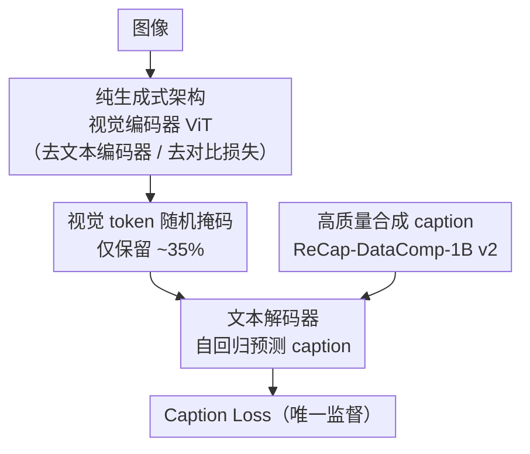

# OpenVision 2: A Family of Generative Pretrained Visual Encoders for Multimodal Learning

**会议**: CVPR 2026  
**论文**: [CVF Open Access](https://openaccess.thecvf.com/content/CVPR2026/html/Liu_OpenVision_2_A_Family_of_Generative_Pretrained_Visual_Encoders_for_CVPR_2026_paper.html)  
**代码**: https://github.com/UCSC-VLAA/OpenVision  
**领域**: 自监督 / 表示学习  
**关键词**: 视觉编码器预训练, 生成式预训练, caption-only, token掩码, 多模态

## 一句话总结
OpenVision 2 把上一代 OpenVision 里的文本编码器和对比损失全删掉，只留"图像编码器 + 文本解码器"做 caption-only 的纯生成式预训练，再随机掩掉约 2/3 视觉 token，在几乎不掉点的前提下把 ViT-L/14 训练时间砍掉 ~1.5×、显存砍掉 ~1.8×，并得以把视觉编码器一路扩到 10 亿参数。

## 研究背景与动机
**领域现状**：多模态基础模型的视觉模块长期依赖 OpenAI CLIP、Google SigLIP 这类不完全开源的方案。上一代 OpenVision 提供了一个完全开源替代品——只用公开数据和代码，训出一族从 5.9M 到 632M 参数的高竞争力视觉编码器。

**现有痛点**：OpenVision 的配方比原始 CLIP **重得多**。它给每张图配两条 caption（网络爬取 + 合成）做"双对比损失"，意味着文本编码器要处理双倍 caption；又额外加了一个文本解码器去自回归预测合成 caption（生成损失）。虽然靠 CLIPA 式低分辨率预训练 + 短高分辨率微调把开销部分藏起来了，但**文本编码器 + 双对比 + 额外解码器**这套多分支结构仍然吃 FLOPs 和显存，限制了普通算力研究者使用，也卡住了进一步扩规模。

**核心矛盾**：社区长期相信"CLIP 式对比学习是训可扩展通用视觉编码器不可或缺的"，但对比分支恰恰是计算瓶颈的主要来源。能不能**只靠生成式信号**就训出同样强的编码器？

**本文目标**：在 OpenVision 基础上，找一条更简单、更高效的训练配方，既保住下游多模态性能，又大幅降本、并能扩到十亿参数。

**切入角度**：沿着 CapPa、AIMv2 等"caption 即监督"的前作，以及 LLaVA 这类"编码器直接喂解码器"的现代多模态设计，作者押注一个极简主义假设——**彻底去掉文本编码器**，连带去掉图文对比损失。

**核心 idea**：把多分支管线塌缩成"图像编码器 + 文本解码器"两模块，纯靠 caption 损失学视觉表征；再随机掩掉大部分视觉 token 进一步降本——证明纯生成式、caption-only 目标足以媲美对比方法。

## 方法详解

### 整体框架
OpenVision 2 的训练循环极其精简：一张图过视觉编码器得到一串视觉 token，**随机掩掉约 2/3**，剩下约 1/3 直接拼进文本解码器，让解码器自回归地把这张图对应的合成 caption 预测出来——整个监督信号就只有这条 caption 损失，没有文本编码器、没有对比损失。这个结构刻意和下游多模态微调（如 LLaVA：编码器输出直接喂语言模型）对齐，消除了"预训练用对比、微调用生成"的目标错配，理论上利于知识平滑迁移。

### 关键设计

**1. 纯生成式 caption-only 架构：删掉文本编码器与对比损失，把多分支塌缩成两模块**

这是 OpenVision 2 的核心简化。上一代为了用好合成 caption 同时背了两个包袱：文本编码器要为双对比目标处理每图两条 caption，外加一个文本解码器自回归预测合成 caption——两者一起大幅推高训练 FLOPs 和 GPU 显存。OpenVision 2 直接**丢掉文本编码器，连同整个图文对比损失一起删**，训练循环只剩"编码器出视觉 token → 解码器预测 caption"两步，唯一监督是 caption 损失。这样不仅省算力，还让预训练结构与下游 LLaVA 式微调天然一致，消除目标错配。它和 CapPa 的区别在于：用更高质量的合成 caption、用简单拼接代替 cross-attention 融合、纯自回归解码（不用 CapPa 的并行+自回归混合）；和 AIMv2 的区别在于：只用文本生成信号、不做像素重建，且骨干用普通 ViT 而非 prefix-ViT。

**2. 视觉 token 随机掩码：保留约 35% token，既降本又当正则**

在生成式架构之上，作者再加一招效率 tweak——预训练时**随机掩掉约 2/3 的视觉 token**，只把剩下约 1/3 喂给文本解码器。直觉上这只是为了减轻解码器负担，但消融发现它还**提升了多模态性能**：keep ratio 在 25%–35% 时综合最佳，比 100%（不掩）和 10%（掩太狠）两个极端都好。原因是适度掩码强迫模型靠更少、更有信息量的视觉 token 完成 caption 生成，反而强化了局部语义表征。默认设 35% keep。

**3. 高质量合成 caption 数据（ReCap-DataComp-1B v2）：给纯生成式目标喂"长而扎实"的监督**

caption-only 把全部宝押在 caption 质量上，所以数据是命门。作者不用 CapPa 那种又短又噪的网络 alt-text，而是用 Llama-3 驱动的 LLaVA 把 DataComp-1B 整体重写成合成 caption，再做一版增强：让 captioner **以原始 alt-text 为条件**并用加权 top-k 采样，产出更长、更 grounded、更多样的描述，命名为 ReCap-DataComp-1B v2。消融显示 caption 质量影响巨大：相比 alt-text，合成 caption 在 TextVQA +5.1、OCR-Bench +53；v2 在 OCR 类任务上更强，故设为默认。

### 损失函数 / 训练策略
- **唯一损失**：文本解码器对合成 caption 的自回归（next-token）caption 损失，loss 权重设为 2。
- **多阶段课程**：84px 长预训练（10,000 个 ImageNet-scale epoch）→ 224px 微调（800 epoch）→ 可选 336/448px 高分辨率扩展（各 200 epoch）。
- **优化**：AdamW（$\beta_1{=}0.9,\beta_2{=}0.95$，weight decay 0.2）+ cosine schedule，学习率随全局 batch 线性缩放；混合精度（float32 参数 + bfloat16 优化器状态）；caption 截/补到 128 token；默认 keep 35% token。⚠️ 缓存中部分超参字符串有 LaTeX/OCR 转义残留，具体数值以原文为准。

## 实验关键数据

### 主实验
在 LLaVA-1.5 与 Open-LLaVA-Next 两套框架下评测多模态下游任务。下表为 LLaVA-1.5 框架、ViT-L/14 设置下与上一代及主流 CLIP 的对比（OCR. 指 OCR-Bench 分数，MME 为感知/认知双分；数值越高越好）：

| 方法 | 分辨率 | TextVQA | ChartQA | OCR. | SEED | POPE |
|------|--------|---------|---------|------|------|------|
| OpenAI-CLIP L/14 | 224 | 56.1 | 13.2 | 177 | 66.0 | 85.0 |
| OpenVision L/14 | 224 | 57.7 | 13.9 | 315 | 69.5 | 86.4 |
| **OpenVision 2 L/14** | 224 | **59.0** | 13.7 | **327** | 69.3 | **87.1** |
| OpenVision L/14 | 336 | 61.2 | 15.7 | 339 | 70.5 | 87.2 |
| **OpenVision 2 L/14** | 336 | **63.0** | 14.5 | **357** | 70.1 | **87.7** |

总体上 OpenVision 2 与 OpenVision 打平或略胜，在 **OCR 类任务上提升尤其明显**（得益于合成 caption + token 掩码强化了细粒度文字识别）；并能扩到 SoViT-400M、H/14、乃至 g/14（1.01B 参数）等更大规模仍稳定提升。

### 消融实验

| 维度 | 配置 | 关键指标 | 说明 |
|------|------|----------|------|
| 训练效率 | OpenVision → OV2（L/14@224） | 83h → 57h；24.5GB → 13.8GB | ~1.5× 提速、~1.8× 省显存，batch 2k→8k |
| 训练效率 | OpenVision → OV2（SoViT-400M@384） | 241h → 121h；27.4GB → 14.5GB | ~2× 提速；OV 在 batch 1k 直接 OOM |
| 拆解来源 | CapPa → +掩码 → +CLIPA → 两者 | 217h → 190h → 67h → 55h | CLIPA 与掩码各自有效、叠加最优 |
| caption 类型 | alt-text / ReCap / ReCap v2 | TextVQA 51.8 / 56.9 / 56.5 | 合成 caption 远胜 alt-text |
| token keep 比例 | 100% / 35% / 10% | OCR 254 / 291 / 276 | 25–35% 最佳，过掩或不掩都差 |

### 关键发现
- **掩码不只是省算力，还涨点**：keep ratio 25–35% 在 OCR-Bench、TextVQA 上同时优于"全保留"和"只留 10%"两个极端，说明适度掩码起到正则作用。
- **caption 质量是上限**：从 alt-text 换到合成 caption，OCR-Bench 直接 +53，印证纯生成式目标对监督质量极度敏感。
- **效率红利可再投资于扩规模**：在等算力下，提分顺序是"提分辨率 > 延长训练 > 扩模型"，其中分辨率收益最大，说明 OpenVision 2 特别吃高空间保真度。
- **对比损失并非必需**：纯 caption-only 即可媲美 CLIP 式对比方法，挑战了"对比学习不可或缺"的长期共识。

## 亮点与洞察
- **做减法做出效率**：删掉文本编码器 + 对比损失这一刀，把多分支塌缩成两模块，是简洁又有力的工程决断——证明"少即是多"在视觉编码器预训练上成立。
- **预训练-下游对齐**：caption-only 架构天然贴合 LLaVA 式下游微调，消除目标错配，这个"结构对齐"思路可迁移到其他需要预训练-微调一致性的场景。
- **掩码当正则**的发现很可复用：在生成式视觉预训练里，主动丢一部分视觉 token 既降本又提表征质量。
- **可扩到 10 亿参数**：省下的算力让它把开源视觉编码器推到了 g/14（1.01B），为完全开源的大视觉骨干立了新基线。

## 局限与展望
- **作者自承"初步结果"**：很多结论标注为 preliminary，纯生成式范式在更大数据/更长训练下能否持续不掉点仍需验证。
- **评测仍偏 VQA/感知类基准**：虽比 CapPa 扩到了 MME、ChartQA，但对检索、细粒度定位、组合推理等任务覆盖有限，"媲美对比方法"的结论有任务范围 caveat。
- **依赖高质量合成 caption 管线**：整套方法的上限被 ReCap-DataComp-1B v2 的 caption 质量锁死，换到 caption 质量更差的领域可能失效。
- **改进方向**：进一步研究 caption 长度/多样性对学习行为的影响、把掩码比例做成自适应、以及在更大规模数据上检验生成式范式的可扩展性边界。

## 相关工作与启发
- **vs OpenVision（v1）**：v1 用双对比 + 生成多分支、更重；v2 删掉文本编码器与对比损失只留生成，性能打平/略胜而训练成本大降，是直接的"瘦身"后继。
- **vs CapPa**：同走 caption-only 路线，但 v2 用更高质量合成 caption、用拼接代替 cross-attention 融合、加随机 token 掩码、纯自回归解码，并扩到 1.01B 参数、上更难的多模态基准。
- **vs AIMv2**：AIMv2 同时做像素重建 + 文本生成、用 prefix-ViT；v2 只用文本生成信号、用普通 ViT，并靠掩掉 ~2/3 token 同时提效率与性能。
- **vs CLIP / SigLIP**：作为完全开源、纯生成式替代品，在多个 OCR 类基准上反超这些对比式闭源/半开源方案。

## 评分
- 新颖性: ⭐⭐⭐⭐ 不是全新范式（承袭 CapPa/AIMv2），但"彻底删对比 + 掩码当正则 + 高质量合成 caption"的组合干净有力。
- 实验充分度: ⭐⭐⭐⭐ 两框架多规模主实验 + 效率/caption/掩码消融完整；但作者自承多为初步结果、任务覆盖偏 VQA。
- 写作质量: ⭐⭐⭐⭐ 动机与简化逻辑讲得清楚，前作对比（CapPa/AIMv2）梳理到位。
- 价值: ⭐⭐⭐⭐⭐ 完全开源、训得起、可扩到 10 亿参数，对算力受限的视觉编码器研究极有用。

<!-- RELATED:START -->

## 相关论文

- [\[CVPR 2026\] GM-R²: Generative Matching Learning for Unsupervised Geometric Representation and Registration](gm-r2_generative_matching_learning_for_unsupervised_geometric_representation_and.md)
- [\[CVPR 2026\] Residual Connections Harm Generative Representation Learning](residual_connections_harm_generative_representation_learning.md)
- [\[CVPR 2026\] Exploring Visual Pretraining for Learning Language Intelligence](exploring_visual_pretraining_for_learning_language_intelligence.md)
- [\[CVPR 2026\] Learning to See Through a Baby's Eyes: Early Visual Diets Enable Robust Visual Intelligence in Humans and Machines](learning_to_see_through_a_babys_eyes_early_visual_diets_enable_robust_visual_int.md)
- [\[CVPR 2026\] Stabilizing Feature Geometry in Noisy Pretrained Models for Robust Downstream Tasks](stabilizing_feature_geometry_in_noisy_pretrained_models_for_robust_downstream_ta.md)

<!-- RELATED:END -->
