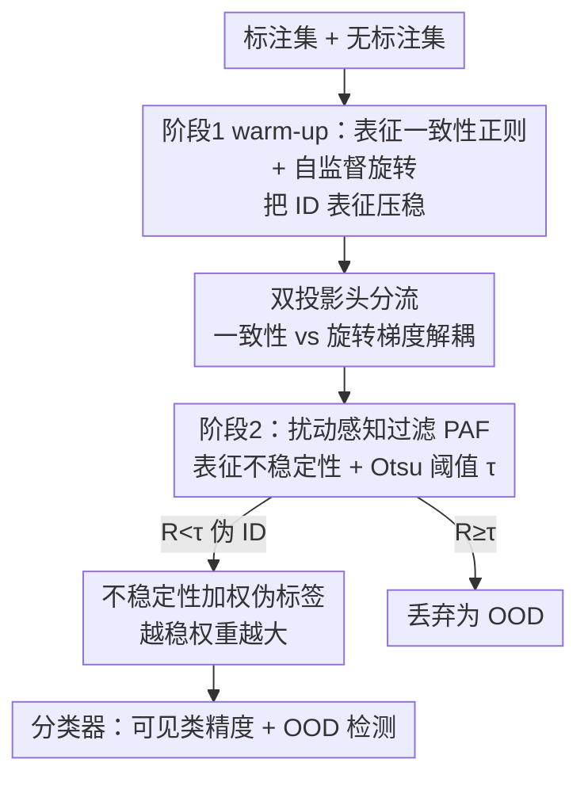

# PAF: Perturbation-Aware Filtering for Open-Set Semi-Supervised Learning

**会议**: CVPR 2026  
**论文**: [CVF Open Access](https://openaccess.thecvf.com/content/CVPR2026/html/Han_PAF_Perturbation-Aware_Filtering_for_Open-Set_Semi-Supervised_Learning_CVPR_2026_paper.html)  
**代码**: https://github.com/njustkmg/CVPR26-PAF  
**领域**: 自监督 / 半监督学习  
**关键词**: 开集半监督, OOD 检测, 表征不稳定性, 一致性正则, 伪标签  

## 一句话总结
PAF 把"OOD 样本在语义保持扰动下表征更不稳定"这一现象提炼成一个表征级过滤信号，用 Otsu 自适应阈值动态剔除无标注数据里的开集（OOD）样本，再配合一个两阶段训练框架，在 MNIST/CIFAR/TinyImageNet 等开集半监督基准上同时把可见类分类精度和 OOD 检测 AUC 刷到了 SOTA。

## 研究背景与动机
**领域现状**：半监督学习（SSL）靠少量标注 + 大量无标注数据逼近全监督性能，主流是一致性正则和伪标签两条路线。但传统 SSL 默认无标注数据和标注数据共享同一套类别。

**现有痛点**：现实中无标注数据几乎一定混入"训练时没见过的类别"，即 OOD 样本。这些 OOD 样本会污染伪标签、把决策边界拉歪。开集半监督（OSSL）的核心就是要从无标注集里把 ID（in-distribution，与标注集同分布）样本和 OOD 样本分开。现有 OSSL 方法——OVA 决策边界（OpenMatch）、加一个"unknown"类（IOMatch）、证据/贝叶斯不确定性建模——都依赖**单视图预测的置信度**，是一种"静态"判据。

**核心矛盾**：作者指出关键观察是 ID 和 OOD 样本在"语义保持扰动"（如翻转、轻微色彩抖动）下的敏感度不同——OOD 样本的最大 softmax 置信度会剧烈波动，ID 样本则相对稳定（前人称之为 confidence mutation）。但置信度只是深层表征不稳定性的一个**浅层投影**：表征变化小一定导致置信度变化小，反过来却不成立。所以直接测置信度漏掉了很多细微的表征变化，区分力不够。论文的预实验（Figure 1）量化了这点：置信度突变的 ID/OOD 分离分数只有 0.0462，而表征不稳定性的分离分数高达 0.1386。

**核心 idea**：用**表征级不稳定性**（penultimate 层表征在多扰动视图下的 L2 变化）代替置信度突变作为 OOD 过滤信号，并用 Otsu 自适应阈值把无标注集动态二分为 ID/OOD；同时设计两阶段训练，先把 ID 表征对扰动的稳定性"练"出来，再用这个稳定性去过滤和加权。

## 方法详解

### 整体框架
PAF 的输入是少量标注集 $\mathcal{D}_l$ 和大量含 OOD 的无标注集 $\mathcal{D}_u$，输出是一个既能准确分类可见类、又能滤掉 OOD 的分类器。整套方法围绕一个因果链转：要可靠地用"表征不稳定性"判 OOD，前提是模型已经学到了对语义保持扰动稳定的 ID 表征——所以训练必须分两阶段。

- **第一阶段（warm-up）**：在标注数据上用监督交叉熵 $\mathcal{L}_{ce}$，同时用表征一致性正则 $\mathcal{L}_{con}$ 把 ID 样本在扰动下的表征"压稳"，再加一个自监督旋转预测任务 $\mathcal{L}_{rot}$ 给骨干网络（WideResNet28-2）补充语义结构。这一阶段不碰无标注数据的过滤，只为后续 PAF 打好"表征稳定"的底子。
- **第二阶段**：载入第一阶段 checkpoint，每隔 20 个 epoch 用 PAF 把无标注集按表征不稳定性二分一次，对滤出的伪 ID 子集 $\mathcal{X}_u^{ID}$ 施加"不稳定性加权伪标签"损失 $\mathcal{L}_u$，并继续在伪 ID 样本上施加 $\mathcal{L}_{con}$、在全体样本上施加 $\mathcal{L}_{rot}$。

为避免一致性损失（要把同图不同扰动视图的表征**对齐**）和旋转损失（要把不同旋转角度的表征**分开**）梯度打架，骨干后面挂两个独立的投影头/分类头，各走各的子空间，梯度互不干扰。

### 关键设计

**1. 扰动感知过滤 PAF：用表征不稳定性而非置信度判 OOD**

这是论文的核心。针对"置信度只是表征不稳定性的浅层投影、区分力弱"这个痛点，PAF 直接在 penultimate 层表征空间度量样本对语义保持扰动的敏感度。给定无标注样本 $\mathbf{x}^u$，用扰动算子 $A$（弱增广，如翻转、轻色抖动）生成 $K_a$ 个扰动视图，令 $\varphi(\cdot)$ 为骨干表征、$\phi_{con}(\cdot)$ 为一致性投影头，表征不稳定性定义为：

$$R(\mathbf{x}^u) = \frac{1}{K_a d}\sum_{k=1}^{K_a} \left\| \phi_{con}\bigl(\varphi(\mathbf{x}^u)\bigr) - \phi_{con}\bigl(\varphi(\mathbf{x}^u_{(k)})\bigr) \right\|_2^{2}$$

其中 $d$ 是表征维度，$\mathbf{x}^u_{(k)}$ 是第 $k$ 个扰动视图（实际为效率取 $K_a=1$）。然后不靠人工设阈值，而是用 **Otsu 准则**根据当前 batch 内 $R$ 的分布自动算一个自适应阈值 $\tau$，把无标注集二分：

$$\mathcal{X}_u^{ID} = \{\mathbf{x}^u \mid R(\mathbf{x}^u) < \tau\},\quad \mathcal{X}_u^{OOD} = \{\mathbf{x}^u \mid R(\mathbf{x}^u) \ge \tau\}$$

为什么有效：作者从 Lipschitz-margin 角度证明了，扰动诱导的预测方差随决策间隔 $m(\mathbf{x})$ 指数衰减（$\mathrm{Var}_\delta[s(\mathbf{x}+\delta)] \le \beta^2(K-1)^2 e^{-2m(\mathbf{x})}\sigma^2$）——间隔大的 ID 样本天然稳定，靠近边界的 OOD 样本则对扰动高度敏感。更进一步，置信度变化被表征变化上界控制（$|s(\mathbf{x})-s(\mathbf{x}')| \le \beta(K-1)e^{-m(\mathbf{x})}\|\varphi(\mathbf{x})-\varphi(\mathbf{x}')\|_2$），所以检测表征不稳定性是比检测置信度更**严格**的判据，能抓到置信度看不见的细微差异。

**2. 表征一致性正则：先把"扰动下表征要稳"这件事学进骨干**

PAF 用表征稳定性判 OOD 的前提是模型本身得对扰动不变，否则连 ID 样本都不稳，判据失效。所以作者对一张图 $\mathbf{x}$ 生成两个弱增广视图 $\mathbf{x}'=A_1(\mathbf{x})$、$\mathbf{x}''=A_2(\mathbf{x})$，用一致性投影头把它们映到紧凑嵌入空间，最小化两视图嵌入的均方差：

$$\mathcal{L}_{con} = \frac{1}{d\,|\mathcal{D}_l|}\sum_{\mathbf{x}\in\mathcal{D}_l}\bigl\|\phi_{con}\bigl(\varphi(\mathbf{x}')\bigr) - \phi_{con}\bigl(\varphi(\mathbf{x}'')\bigr)\bigr\|_2^{2}$$

第一阶段先在标注数据上施加，第二阶段再施加到 PAF 滤出的伪 ID 样本上。这步显式地把"语义保持扰动下表征应当稳定"这条性质刻进表征空间，正是 PAF 后续度量 $R$ 能区分 ID/OOD 的基础。

**3. 不稳定性加权伪标签：把过滤信号复用进伪标签训练**

对 PAF 滤出的伪 ID 子集，作者不像 vanilla UDA 那样平等对待所有样本，而是用每个样本的扰动不稳定性 $\delta(\mathbf{x}^u)$ 去调制它的贡献。对每个 $\mathbf{x}^u\in\mathcal{X}_u^{ID}$ 生成弱增广视图 $x^w$ 和强增广视图 $x^s$，软预测为 $p^w, p^s$，当 $\max(p^w)\ge\alpha$ 才采纳伪标签，最小化加权 KL 散度：

$$\mathcal{L}_u = \frac{1}{|\mathcal{X}_u^{ID}|}\sum_{\mathbf{x}^u\in\mathcal{X}_u^{ID}}\bigl(1-\hat{\delta}(\mathbf{x}^u)\bigr)\,\mathds{1}\!\bigl[\max(p^w)\ge\alpha\bigr]\,\mathrm{KL}\bigl(p^w\,\Vert\,p^s\bigr)$$

其中 $\hat{\delta}$ 是 min-max 归一化的不稳定性分数，越稳（$\hat{\delta}\to0$）权重越大。这样"既自信又稳定"的样本主导决策边界，不稳定样本被自动降权或丢弃——把第一关 PAF 的过滤判据延续到第二关的训练加权，前后一致。

**4. 自监督旋转 + 双投影头：补语义结构、解梯度冲突**

标注数据少时骨干学不到足够判别性的表征，作者引入旋转预测自监督任务（把图随机转 $\{0°,90°,180°,270°\}$ 让模型判角度），两阶段都对全体样本施加：

$$\mathcal{L}_{rot} = -\frac{1}{4|\mathcal{D}_l\cup\mathcal{D}_u|}\sum_{\mathbf{x}}\sum_{r\in\pi}\log p(r\mid\phi_{rot}(\mathbf{x}^r))$$

但旋转任务要把不同朝向的表征**分开**，和一致性任务要把同图视图**对齐**正好冲突，共享投影空间时梯度反向打架。作者为一致性和自监督分支各配一个专属投影头/分类头，映到独立子空间，保证梯度独立流动——消融显示这是掉点最狠的设计（去掉掉近 16%）。

### 损失函数 / 训练策略
- **阶段一（5 万次迭代）**：$\mathcal{L} = \mathcal{L}_{ce} + \mathcal{L}_{con} + \mathcal{L}_{rot}$。
- **阶段二（20 万次迭代）**：$\mathcal{L} = \mathcal{L}_{ce} + \mathcal{L}_u + \mathcal{L}_{con} + \mathcal{L}_{rot}$，每 20 个 epoch 用 PAF 重新过滤一次 ID 样本。
- 骨干：MNIST 用两层 CNN，其余用 WideResNet28-2；SGD，初始学习率 0.03、动量 0.9，标注/无标注 batch 为 64/128；三次随机种子取均值方差。

## 实验关键数据

### 主实验
内部 OOD 场景下（无标注集里掺入同数据集未见类，mismatch ratio 即 OOD 占比），可见类分类精度（%）：

| 数据集 (mismatch) | 本文 | BDMatch | SCOMatch | ANEDL |
|------|------|---------|----------|-------|
| MNIST 0.3 / 0.6 | **99.4 / 99.2** | 99.1 / 99.1 | 99.0 / 99.0 | 98.9 / 98.6 |
| CIFAR-10 0.3 / 0.6 | **93.1 / 90.8** | 92.5 / 90.4 | 92.2 / 90.2 | 91.8 / 90.1 |
| CIFAR-100 0.3 / 0.6 | **77.7 / 75.9** | 75.9 / 73.7 | 75.3 / 73.5 | 75.4 / 73.8 |
| TinyImageNet 0.3 / 0.6 | **58.1 / 54.6** | 56.7 / 52.9 | 54.2 / 52.3 | 47.6 / 45.8 |

OOD 检测 AUC（%）提升更明显，且在更难的数据集上 gap 更大：

| 数据集 (mismatch) | 本文 | ProSub | OSP |
|------|------|--------|-----|
| CIFAR-10 0.3 / 0.6 | **96.1 / 93.6** | 89.1 / 84.5 | 88.3 / 83.6 |
| CIFAR-100 0.3 / 0.6 | **84.5 / 76.7** | 73.2 / 67.0 | 71.8 / 65.2 |
| TinyImageNet 0.3 / 0.6 | **64.8 / 61.1** | 56.2 / 52.0 | 54.4 / 50.1 |

外部 OOD 场景（CIFAR-10 全类为 ID，外接 TinyImageNet/LSUN/高斯/均匀噪声为 OOD）下本文在 12 个配置上几乎全面领先；PAF 还能即插即用进 CLIP 驱动的细粒度 OSSL 框架 CFSG-CLIP，在 CUB-200-2011 上把可见类精度从 84.73 提到 85.16。

### 消融实验
CIFAR-100、mismatch 0.3：

| 配置 | Acc | AUC | 说明 |
|------|-----|-----|------|
| Full PAF | 77.7 | 84.5 | 完整模型 |
| w/o 扰动感知过滤 | 71.2 | 74.8 | 去掉核心 PAF，Acc 掉 6.5、AUC 掉近 10 |
| w/o 独立投影头 | 61.8 | 70.2 | 梯度冲突，掉近 16%，最致命 |
| w/o 表征一致性损失 | 75.1 | 81.3 | Acc 掉约 3 |
| w/o 自监督旋转损失 | 75.6 | 81.2 | Acc/AUC 同步下降 |
| 置信度过滤（替换 PAF） | 74.5 | 78.2 | 比表征过滤明显差 |

### 关键发现
- **独立投影头贡献最大**：去掉它掉近 16 个点，印证一致性损失和旋转损失梯度确实冲突，必须分子空间隔离。
- **表征过滤 > 置信度过滤**：同为扰动判据，PAF 的 Acc/AUC 都高于置信度过滤；进一步看 CIFAR-100 上 PAF 的 ID 样本保留率比置信度过滤高 +9.9%、OOD 滤除率高 +12.2%，监督信号更干净。
- **任务越难收益越大**：AUC 提升在 CIFAR-100、TinyImageNet 上远大于 MNIST/CIFAR-10，说明分离越难时表征级信号越有价值。

## 亮点与洞察
- **把"置信度突变"升级为"表征不稳定性"**：核心洞察是置信度被表征变化上界控制（小表征变化⇒小置信度变化，反之不成立），所以表征级判据更严格、抓得更细——这个"浅层 vs 深层信号"的论证很有迁移价值，凡是用 logit/置信度做检测的任务都可以反问一句"是不是该退回表征空间度量"。
- **Otsu 阈值做动态二分**：把经典图像二值化的 Otsu 准则搬来对 batch 内不稳定性分布自动切阈，省掉人工调阈且自适应数据分布，是个轻巧好用的 trick。
- **过滤信号复用进伪标签加权**：同一个不稳定性 $\delta$ 既当过滤判据又当伪标签权重，前后判据一致、实现简洁，避免"过滤一套标准、训练又一套标准"的割裂。

## 局限与展望
- 表征不稳定性 $R$ 依赖第一阶段先把 ID 表征压稳，若 warm-up 不充分或标注极少时，判据本身可能不可靠（论文用旋转自监督缓解，但根上仍受标注量约束）。⚠️ 论文未给出标注量极端稀缺下判据失效的边界分析。
- 为效率默认 $K_a=1$（单扰动视图），多视图是否能进一步提升分离度、代价几何，文中未充分展开。
- 评测集中在 MNIST/CIFAR/TinyImageNet/CUB 等标准基准，更大规模、更真实的开放世界 OOD（如长尾、域偏移叠加）下的鲁棒性仍待验证。
- Lipschitz-margin 理论建立在"每个 logit β-Lipschitz"假设上，作者称补充材料经验证实合理，但实际深网的 Lipschitz 常数难以精确刻画，理论与实践仍有 gap。

## 相关工作与启发
- **vs OpenMatch / IOMatch**：它们用 OVA 决策边界或额外 "unknown" 类、依赖单视图置信度做静态判别；本文用扰动下的表征动态不稳定性做判据，并理论证明其严格性，区分力更强。
- **vs confidence mutation（前人 [48]）**：前人首先发现 OOD 置信度在扰动下波动大，但停留在置信度层面；本文指出置信度是表征的浅层投影，把信号下沉到表征空间，分离分数从 0.0462 提到 0.1386。
- **vs UDA**：本文的不稳定性加权伪标签是 UDA 的扩展，把 vanilla UDA"平等对待所有无标注样本"改为按表征稳定性加权，让稳定样本主导决策边界。

## 评分
- 新颖性: ⭐⭐⭐⭐ 把置信度突变升级为表征不稳定性并配 Lipschitz-margin 理论，视角清晰但属于现象→信号的自然延伸。
- 实验充分度: ⭐⭐⭐⭐⭐ 内部/外部 OOD、4 数据集、AUC+Acc 双指标、5 项消融、即插 CLIP 框架，覆盖很全。
- 写作质量: ⭐⭐⭐⭐ 动机—观察—理论—方法链条连贯，公式与图示清楚。
- 价值: ⭐⭐⭐⭐ OSSL 上稳定刷 SOTA，且 PAF 可即插即用进现有框架，实用性好。

<!-- RELATED:START -->

## 相关论文

- [\[CVPR 2026\] SECOS: Semantic Capture for Rigorous Classification in Open-World Semi-Supervised Learning](secos_semantic_capture_for_rigorous_classification_in_open-world_semi-supervised.md)
- [\[AAAI 2026\] Let the Void Be Void: Robust Open-Set Semi-Supervised Learning via Selective Non-Alignment](../../AAAI2026/self_supervised/let_the_void_be_void_robust_open-set_semi-supervised_learning_via_selective_non-.md)
- [\[CVPR 2026\] GaussianMatch: Semi-Supervised Regression with Pseudo-Label Filtering via Multi-View Gaussian Consistency](gaussianmatch_semi-supervised_regression_with_pseudo-label_filtering_via_multi-v.md)
- [\[CVPR 2026\] Measure The Feature Universe: Topology-based Pseudo Labeling and Gravity Consistency for Source-Free Domain Adaptation](measure_the_feature_universe_topology-based_pseudo_labeling_and_gravity_consiste.md)
- [\[CVPR 2026\] CUE: Concept-Aware Multi-Label Expansion to Mitigate Concept Confusion in Long-Tailed Learning](cue_concept-aware_multi-label_expansion_to_mitigate_concept_confusion_in_long-ta.md)

<!-- RELATED:END -->
