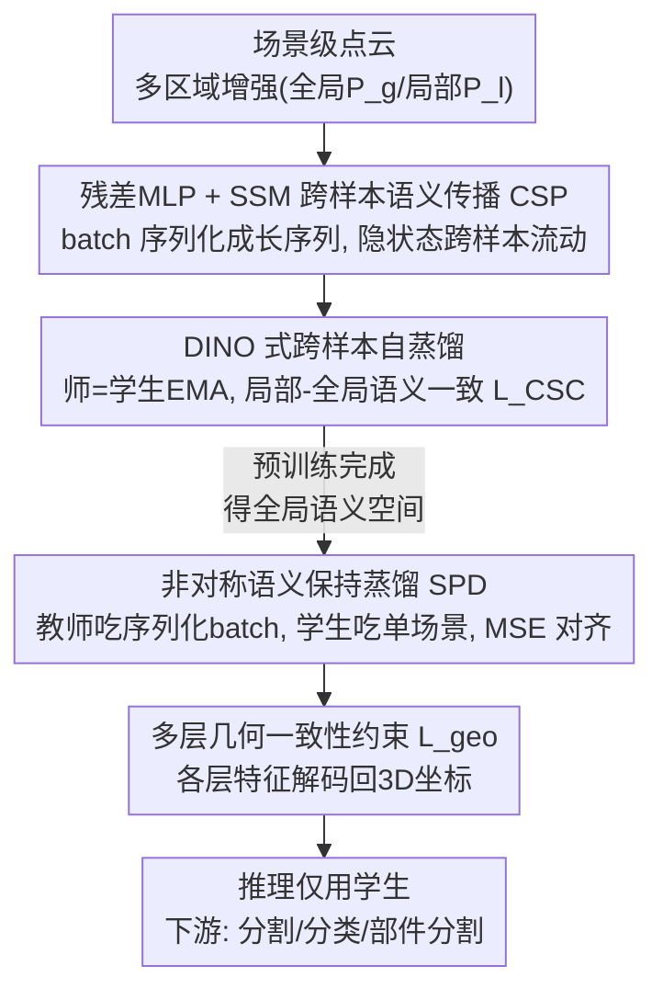

# PointCSP: Cross-Sample Semantic Propagation and Stability Preservation in Self-Supervised Point Cloud Learning

**会议**: CVPR 2026  
**论文**: [CVF Open Access](https://openaccess.thecvf.com/content/CVPR2026/html/Yu_PointCSP_Cross-Sample_Semantic_Propagation_and_Stability_Preservation_in_Self-Supervised_Point_CVPR_2026_paper.html)  
**代码**: 待确认  
**领域**: 自监督学习  
**关键词**: 点云自监督, 状态空间模型, 跨样本传播, 自蒸馏, 语义一致性

## 一句话总结
PointCSP 针对场景级点云自监督"逐样本独立建模导致跨场景语义不一致"的问题，用状态空间模型把一个 batch 内的样本串成长序列做**跨样本语义传播（CSP）**建立全局一致语义空间，再用非对称师生**语义保持蒸馏（SPD）**消除单场景测试时的批依赖偏移，在 S3DIS、3DSES、ScanObjectNN、ModelNet40、ShapeNetPart 上全面刷新 SOTA。

## 研究背景与动机
**领域现状**：场景级点云自监督学习（PC-SSL）是从原始 3D 数据学可迁移几何/语义表示的主流范式。现有方法沿三条路线推进——多视图聚合（PointContrast、SSPL）、上下文重建（MSP、MSC）、对比学习——都在增强局部几何与视图级对齐。

**现有痛点**：这些方法几乎都建立在**逐样本独立建模**（sample-independent）假设上，即每个场景被孤立编码、样本之间没有语义交互。结果是不同场景里**同一语义类别**（如两个房间里的"椅子""墙"）在嵌入空间里散落在互不相连的区域（论文 Fig.1a 的 t-SNE 显示同类特征跨场景无法聚成一致簇），难以构建统一、可迁移的全局语义空间，跨场景泛化受限。

**核心矛盾**：场景级点云存在两个内在难点——(1) 跨场景的空间/语义变异极大，导致特征分布碎片化；(2) 样本之间缺乏显式的语义连续性或依赖。朴素解法是扩大数据规模靠统计 scaling 抹平差异，但场景级点云的采集与标注昂贵低效，不现实。于是问题变成：**如何在有限/不平衡数据下也能建立连贯的全局语义**。

**本文目标**：(1) 在预训练阶段显式建模样本间语义依赖、建立全局一致语义空间；(2) 解决预训练用 batch 序列、而下游单场景测试时的"批依赖"导致的结构错位与语义漂移。

**切入角度**：作者借鉴状态空间模型（SSM / Mamba）擅长长序列建模的能力——既然 SSM 能沿序列递归传播隐状态，那就把一个 batch 的多个样本**序列化成一条长序列**喂进 SSM，让隐状态在样本之间流动，从而把"逐样本独立"变成"跨样本连续传播"。

**核心 idea**：用 SSM 做跨样本语义传播（CSP）在预训练里建全局语义空间，再用非对称师生蒸馏（SPD）在微调里把这套语义稳稳迁到单场景推理，弥合预训练与下游的鸿沟。

## 方法详解

### 整体框架
PointCSP 建立在 DINO 式自蒸馏框架上，分预训练与微调两阶段，核心是两个机制：

- **预训练（CSP）**：把一个 batch 的 $B$ 个点云样本各自的特征序列 $\mathbf{F}_i$ 拼成一条统一长序列 $\mathbf{F}'$，喂进 SSM，让隐状态沿序列化维度递归传播，每个状态同时编码场景内上下文与跨样本语义关联。配合多区域增强 + DINO 师生（教师为学生的 EMA），用局部-全局语义一致性损失训练。
- **微调（SPD）**：预训练用了 batch 序列化，直接迁到单场景测试会因缺批级上下文而语义漂移。SPD 让**教师**继续吃序列化 batch 以保住预训练建立的全局语义拓扑，**学生**吃标准单场景输入并通过特征对齐约束向教师靠拢；推理时只用学生，无需批级上下文。

整体是"两阶段 + 两机制"的串行流水线，适合用框架图呈现：

### 关键设计

**1. 跨样本语义传播 CSP：用 SSM 把 batch 串成长序列、让语义跨样本流动**

这是直击"逐样本独立建模导致跨场景语义碎片化"痛点的核心机制。给定 batch 内每个样本的特征序列 $\mathbf{F}_i = [\mathbf{f}_{i,1},\dots,\mathbf{f}_{i,L}] \in \mathbb{R}^{L\times C}$（$L$ 个点、$C$ 维），CSP 把整 batch reshape 成一条统一序列 $\mathbf{F}' = [\mathbf{f}_{1,1},\dots,\mathbf{f}_{1,L},\mathbf{f}_{2,1},\dots,\mathbf{f}_{B,L}] \in \mathbb{R}^{(B\times L)\times C}$，喂进 SSM。SSM 维护隐状态 $\mathbf{h}_t$ 沿序列递归演化：$\mathbf{h}_t = f_\theta(\mathbf{A}\mathbf{h}_{t-1} + \mathbf{B}\mathbf{f}'_t),\ \mathbf{y}_t = \mathbf{C}\mathbf{h}_t$，其中 $\mathbf{A},\mathbf{B},\mathbf{C}$ 为可学习投影。由于序列横跨多个样本，隐状态会把"前面样本"的语义带到"后面样本"，于是把"局部实例对齐"提升为"全局上下文推理"。值得注意：每个 SSM block 处理**随机打乱**的 token（不依赖空间排序），强迫模型学到与空间先验无关的序列语义依赖，增强无序点集上的鲁棒性。

**2. DINO 式跨样本自蒸馏 + 多区域增强：给 CSP 套上稳定的自监督训练壳**

CSP 需要一个自监督目标来训练。作者用多区域增强构造视图：从输入点云选约 60% 的候选区 $P^r$ 并归一化，再采 $n$ 个空间覆盖率约 $[40\%,80\%]$ 的全局子区 $P^g$ 和 $m$ 个覆盖率约 $[10\%,30\%]$ 的局部子区 $P^l$。学生网络吃 $P^g$ 与 $P^l$，教师只吃 $P^g$；两者结构相同，教师是学生的 EMA（$N_\varphi \leftarrow \gamma N_\varphi + (1-\gamma)N_\omega$）。用局部-全局语义一致性损失把每个学生视图对齐到全局教师输出：

$$\mathcal{L}_{\text{CSC}} = -\frac{1}{n(m+n)}\sum_{i=1}^{n}\sum_{j=1}^{(m+n)} \mathbf{p}_i^t \cdot \log \mathbf{p}_j^s$$

这套"多尺度视图 + 师生一致"让 CSP 在预训练里既学到层次语义，又通过 EMA 教师获得稳定监督。

**3. 语义保持蒸馏 SPD：用非对称师生消除"预训练靠 batch、测试靠单场景"的鸿沟**

CSP 虽建立了强语义连续性，但序列化的 batch 组织引入了**跨样本结构依赖**——直接把预训练模型迁到单场景测试会因缺批级上下文而出现语义结构退化、表示漂移，尤其在小样本微调下。SPD 用非对称设计解决：教师网络聚合批级特征以保住预训练的全局语义分布，学生网络在标准单场景输入下学习重建这些语义结构，用 MSE 强制两者特征对齐：

$$\mathcal{L}_{\text{SPD}} = \frac{1}{N}\sum_{i=1}^{N}\|\mathbf{f}_i^s - \mathbf{f}_i^t\|_2^2$$

教师同样以 EMA 更新形成"时间平滑的语义锚点"，学生则快速优化下游目标；推理只用学生，部署高效。这种"教师守全局拓扑、学生适配单场景"的非对称结构，正是让批级语义稳稳迁到无批上下文推理的关键。实验里把 SPD 单独插进 CamPoint 也能涨 2.0% mIoU，验证其通用性。

**4. 多层几何一致性约束：让浅层到深层特征都保持几何可逆**

为增强中间特征跨语义深度的几何可逆性，作者从多个编码层随机采样特征子集 $\{f_k^{(l)}\}$，经轻量坐标解码器 $D_\phi^{(l)}$ 解回 3D 坐标 $\hat{\mathbf{x}}_k^{(l)} = D_\phi^{(l)}(f_k^{(l)})$，逐层约束 $\mathcal{L}_{\text{geo}}^{(l)} = \frac{1}{K_s^{(l)}}\sum_k \|\hat{\mathbf{x}}_k^{(l)} - \mathbf{x}_k^{(l)}\|_2^2$，再加权聚合 $\mathcal{L}_{\text{geo}} = \sum_l \alpha_l \mathcal{L}_{\text{geo}}^{(l)}$。这迫使浅层和深层特征都保留与原始 3D 结构的几何一致性，使表示层次既结构连贯又语义一致，是语义传播之外的几何正则补充。

### 损失函数 / 训练策略
预训练目标合并语义一致与多层几何约束：$\mathcal{L}_{\text{pretrain}} = \mathcal{L}_{\text{CSC}} + \lambda_{\text{geo}}\mathcal{L}_{\text{geo}}$；微调目标整合任务损失、语义保持蒸馏与几何约束：$\mathcal{L}_{\text{fine-tune}} = \mathcal{L}_{\text{task}} + \lambda_{\text{SPD}}\mathcal{L}_{\text{SPD}} + \lambda_{\text{geo}}\mathcal{L}_{\text{geo}}$。在 ScanNetV2（1513 个室内场景）上预训练，每个实例切 2 全局 + 8 局部区，全局区用体素均匀采样、局部区用最远点采样，最终都降到 1024 点。主干采用 Mamba2 的增强版 Gated DeltaNet，SSM block 处理随机打乱 token。AdamW + 余弦学习率 + warm-up；评测用"输入受限推理"（每次只处理一个场景/实例），防止跨场景信息泄漏。

## 实验关键数据

### 主实验
在 5 个数据集上验证。语义分割（mIoU，越高越好）：

| 数据集 | 协议/指标 | PointCSP | 之前SOTA | 提升 |
|--------|----------|----------|----------|------|
| S3DIS | Area5 mIoU | **88.2** | CamPoint 83.3 | +4.9 |
| S3DIS | 6-fold mIoU | **93.1** | Sonata 82.3 | +10.8 |
| 3DSES Silver | OA(伪标签) | **96.41** | Swin3D 93.46 | +2.95 |
| 3DSES Silver | OA(真标签) | **95.78** | PointNeXt-S 94.63 | +1.15 |

实例级任务（分类 OA / 部件分割 Ins.mIoU，越高越好）：

| 数据集 | 指标 | PointCSP | 之前SOTA |
|--------|------|----------|----------|
| ScanObjectNN(PB_T50_RS) | OA | **92.8** | CamPoint 92.1 |
| ModelNet40 | OA | **93.9** | PointSD 93.7 |
| ShapeNetPart | Ins. mIoU | **86.8** | Point-MoDE 86.5 |

S3DIS 6-fold 上 93.1% 的 mIoU 大幅领先此前方法；ScanObjectNN（真实噪声/遮挡）的提升尤其说明场景级预训练的上下文知识能有效迁到实例级识别。

### 消融实验
S3DIS 上逐组件消融（基线 = 仅主干、无传播/蒸馏）：

| 配置 | mIoU | mAcc | OA | 说明 |
|------|------|------|----|------|
| Baseline | 84.7 | 87.7 | 96.8 | 仅主干 |
| + CSP | 86.8 | 89.1 | 97.8 | 跨样本传播 +2.1 |
| + SPD | 87.8 | 90.3 | 97.5 | 语义保持蒸馏 +3.1 |
| + CSP + SPD (Full) | **88.2** | **90.6** | **98.1** | 完整模型 |

> ⚠️ 论文 Tab.6 的基线 mIoU 为 84.7%，而正文另一处提到"仅含主干的 baseline 为 83.8% mIoU"，两数略有出入，以原文表格为准。

SPD 通用性（插入 CamPoint）：

| 方法 | mIoU | mAcc | OA |
|------|------|------|----|
| CamPoint | 83.3 | 86.9 | 96.0 |
| CamPoint + SPD | 85.3(+2.0) | 87.9(+1.0) | 96.2(+0.2) |

### 关键发现
- **CSP 与 SPD 协同**：CSP 在预训练里促语义连续与全局对齐，SPD 在微调里保住这套结构，二者叠加才达 88.2% mIoU，缺一明显掉点。
- **SPD 可即插即用**：单独把 SPD 插进 CamPoint 就涨 2.0% mIoU，说明"非对称师生保语义"是通用增益而非依赖本文主干。
- **批大小不敏感**：微调对 batch size 高度稳定（Fig.5），说明 SPD 成功把模型从序列化预训练的批依赖中解耦，能在实例级有效适配。
- **打乱 token 仍有效**：SSM 处理随机打乱的点 token 也能学到序列语义依赖，证明传播靠的是语义而非空间排序先验。

## 亮点与洞察
- **把 batch 当序列**：用 SSM 沿"样本拼接出的长序列"传播隐状态，把跨样本依赖显式建模出来——这是把"逐样本独立"假设打破的巧妙一招，可迁移到任何"想让 batch 内样本互相通信"的自监督场景。
- **非对称师生治"训练/部署不一致"**：CSP 带来的批依赖是把双刃剑，SPD 用"教师守全局、学生适配单输入"化解，思路对所有"预训练用全局上下文、部署只有局部输入"的范式都有借鉴意义。
- **多层几何可逆约束**：让每层特征都能解码回 3D 坐标，是一种简单有效的几何正则，可作为点云表示学习的通用 plug-in。
- **跨场景同类聚簇**：t-SNE 可视化直观展示同语义类别跨场景从"散落"变"紧致对齐"，把抽象的"统一语义空间"落到可见的现象。

## 局限与展望
- **预训练计算/内存成本**：把整个 batch 序列化成长度 $B\times L$ 的序列喂 SSM，序列随 batch 增大而线性变长，大 batch 下显存与吞吐可能受限（⚠️ 论文未给出训练开销分析）。
- **依赖 SSM 主干**：核心机制绑定 Gated DeltaNet/Mamba2 类 SSM，能否迁到纯 Transformer 主干未验证。
- **基线数值小幅不一致**：消融表与正文的 baseline mIoU 有 84.7 vs 83.8 的出入，需以表格为准。
- **几何约束的层选择**：多层几何损失的层权重 $\alpha_l$ 与监督层数 $L$ 如何选未充分消融，可能需任务相关调参。
- **代码未确认开源**。

## 相关工作与启发
- **vs PointContrast / SSPL / MSP（场景级 PC-SSL）**：它们靠多视图聚合/上下文重建/对比学习，但都是逐样本独立建模，跨场景语义不连续；本文用 CSP 显式建样本间依赖，建立全局一致语义空间。
- **vs Point Mamba 系列（PointMamba/PCM/CamPoint）**：同样把 SSM 用于点云，但聚焦单样本内的长程几何依赖与高效 token 交互；本文把 SSM 的序列建模能力用到**跨样本**维度，目标是语义一致性而非单形状几何。
- **vs DINO 自蒸馏**：本文基于 DINO 师生框架，但把 CSP 嵌入其中做跨样本一致性，并额外设计 SPD 解决下游单场景的批依赖偏移——这是 DINO 直接用于场景级点云时不会遇到、本文新引入的问题。

## 评分
- 新颖性: ⭐⭐⭐⭐⭐ "把 batch 序列化交给 SSM 做跨样本语义传播"是对逐样本独立假设的新颖突破，SPD 对应的批依赖问题也是自己引入又自洽解决
- 实验充分度: ⭐⭐⭐⭐ 覆盖场景级/实例级 5 数据集 + 组件消融 + SPD 通用性 + batch 敏感性，较全面；但缺训练开销/大 batch 可扩展性分析
- 写作质量: ⭐⭐⭐⭐ 动机—机制—实验逻辑清晰、公式完整；个别基线数值前后小幅不一致
- 价值: ⭐⭐⭐⭐ 为场景级点云自监督提供了"跨样本一致语义 + 稳定迁移"的实用范式，SPD 可即插即用是额外加分

<!-- RELATED:START -->

## 相关论文

- [\[CVPR 2026\] SECOS: Semantic Capture for Rigorous Classification in Open-World Semi-Supervised Learning](secos_semantic_capture_for_rigorous_classification_in_open-world_semi-supervised.md)
- [\[CVPR 2026\] A Stitch in Time: Learning Procedural Workflow via Self-Supervised Plackett-Luce Ranking](a_stitch_in_time_learning_procedural_workflow_via_self_supervised_plackett_luce_r.md)
- [\[CVPR 2026\] Progressive Mask Distillation for Self-supervised Video Representation](progressive_mask_distillation_for_self-supervised_video_representation.md)
- [\[ECCV 2024\] SCPNet: Unsupervised Cross-modal Homography Estimation via Intra-modal Self-supervised Learning](../../ECCV2024/self_supervised/scpnet_unsupervised_cross-modal_homography_estimation_via_intra-modal_self-super.md)
- [\[CVPR 2026\] Finding Distributed Object-Centric Properties in Self-Supervised Transformers](finding_distributed_object-centric_properties_in_self-supervised_transformers.md)

<!-- RELATED:END -->
