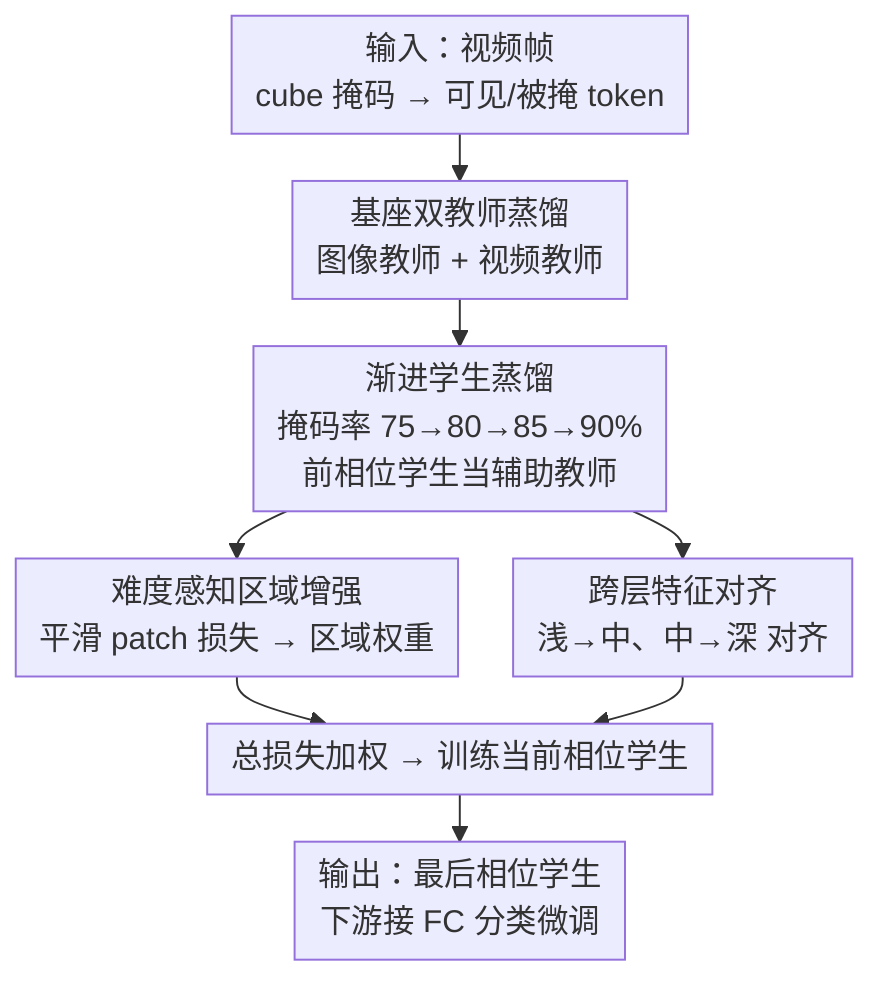

# Progressive Mask Distillation for Self-supervised Video Representation

**会议**: CVPR 2026  
**论文**: [CVF Open Access](https://openaccess.thecvf.com/content/CVPR2026/html/Wu_Progressive_Mask_Distillation_for_Self-supervised_Video_Representation_CVPR_2026_paper.html)  
**代码**: 待确认  
**领域**: 自监督学习 / 视频理解  
**关键词**: 自监督视频表示、掩码视频建模、渐进蒸馏、动态掩码率、知识蒸馏

## 一句话总结
PMD 针对掩码视频自监督"单一掩码率学不全复杂语义"的问题，用四个逐步升高掩码率（75%→80%→85%→90%）的学生做渐进蒸馏，让低掩码率学生先学好低层语义、再当辅助教师引导高掩码率学生学高层语义，并辅以难度感知区域增强和跨层特征对齐，在 SSv2/K400/UCF-101/HMDB-51 上取得 SOTA。

## 研究背景与动机
**领域现状**：掩码视频建模（masked visual modeling）是一种不依赖标注的自监督任务——从可见 patch 重建被掩码的 patch 来学表示。主流做法用固定的高掩码率（如 VideoMAE 的 tube masking、90%），或用多尺度/图像-视频/非对称掩码教师做蒸馏（DMAE、MVD、AMD）。

**现有痛点**：一个固定掩码率下，可见 patch 数量是定死的，但不同语义需要不同数量的上下文 patch 才能重建好——高掩码率（90%）逼模型从极少 patch 推高层语义，某些关键局部区域（如被抛出的物体）重建误差始终很大，模型读不出物体状态，下游动作识别的判别力受损。

**核心矛盾**：单一掩码率无法兼顾"低层细节（需要多 patch 邻域）"和"高层语义（少 patch 强推理）"两种语义粒度。现有蒸馏方法忽略了这种**语义粒度对表示学习的影响**，导致表示语义不足。

**本文目标**：让语义学习"由易到难"地展开，同时补上两个伴生缺陷——关键区域学不充分、网络浅层与深层语义不一致。

**切入角度**：作者从"课程学习/由易到难"的直觉出发——先用低掩码率学好简单的低层语义，把这份知识当作脚手架去引导高掩码率下难的高层语义学习。

**核心 idea**：把单一掩码率扩展成多相位动态掩码率，让前一相位学生当后一相位学生的额外教师，实现渐进蒸馏。

## 方法详解

### 整体框架
PMD 建在 MVD 式的掩码视频蒸馏基座上：一个掩码视频学生由图像教师和视频教师双路监督（基损失 $\mathcal{L}_{base}=\mathcal{L}^{img}_{base}+\mathcal{L}^{vid}_{base}$，各为学生与教师解码特征的 L2 距离）。在此之上，PMD 针对三个挑战——单一掩码率语义不足、关键区域建模不足、跨层语义不一致——加三个模块。训练分四个相位串行进行，掩码率逐相位升高，后一相位学生用前一相位的参数初始化、并额外接受前一相位学生的引导；每个相位内再把若干 epoch 分成 stage 来平滑估计区域损失。最终输出最后一个相位的学生网络。

### 关键设计

**1. 渐进学生蒸馏（PSD）：用逐相位升高的掩码率，让低层语义引导高层语义**

痛点是固定高掩码率掩掉关键 patch 时，教师给不出准确表示，复杂语义往往依赖更多可见 patch 的上下文。PMD 用多相位、掩码率从低到高的学生序列来覆盖不同语义粒度：早相位用低掩码率保留更多可见 patch，学邻域间的低层语义（边缘等）；晚相位用高掩码率剔除冗余 patch，靠有限 patch 学高层语义。为保证"由易到难"，**晚相位学生用早相位学生的预训练参数初始化**，继承低层语义；除了原始掩码教师，**早相位学生还作为额外教师**引导晚相位。第一相位无前序教师，渐进损失取默认值 0；之后相位用前一相位 $ph-1$ 的学生解码特征 $\{x^{ph-1}_p\}$ 监督当前学生：
$$\mathcal{L}_{pg}=\begin{cases}0 & ph=1\\ \frac{1}{N_M}\sum_{p\in M}\lVert x^{ph-1}_p-x^{st}_p\rVert_2^2 & ph>1\end{cases}$$
这样高掩码率学生在学高层语义时还能借早相位的低层语义保住细节、降低关键区域重建误差。实现上用四相位（每相 100 epoch），掩码率 75%→80%→85%→90%。

**2. 难度感知区域增强（DARE）：用重建损失找出"难区域"并加权重学**

痛点是关键 patch 往往语义复杂、重建损失大，但单 epoch 里掩码随机、只覆盖部分区域，难以直接估计某个 patch 的重建准确度。DARE 先把 patch 损失（被掩 patch 取学生与教师解码特征的 L2，可见 patch 初始化为 0）用指数滑动平均跨 epoch 平滑——定位该 patch 上次被掩的最早 epoch $i'$，更新为 $\hat{L}^{img}_{i,p}=\alpha L^{img}_{i,p}+(1-\alpha)\hat{L}^{img}_{i',p}$（$\alpha=0.95$），抑制噪声波动。再把若干 epoch 分成 stage（每 32 epoch 一个 stage），用上一个 stage 末尾的平滑损失经 softmax 学 patch 权重 $w^{img}_{s,p}=\dfrac{\exp(\hat{L}^{img}_{s-1,p}/\tau)}{\sum_k \exp(\hat{L}^{img}_{s-1,k}/\tau)}$（$\tau=0.5$，第一 stage 权重均匀初始化为 $1/N_M$）。损失大的难区域拿到更高权重，区域损失对两个教师分别计算后相加：
$$\mathcal{L}_{df}=\mathcal{L}^{img}_{df}+\mathcal{L}^{vid}_{df},\quad \mathcal{L}^{img}_{df}=\frac{1}{N_M}\sum_{p\in M} w^{img}_{s,p}\,\hat{L}^{img}_{i,p}$$
从而把优化重心压到那些"一直学不好"的关键区域上。

**3. 跨层特征对齐（CLFA）：补上浅层缺监督，桥接浅-中-深语义鸿沟**

痛点是基座蒸馏里教师只引导学生深层，深层能反映高层语义模式，但浅层缺乏多层引导，只能学到低层语义，不足以支撑对高层语义的解释。CLFA 把 Transformer 编码器按语义分成浅/中/深三段（ViT-S/B 各 12 层按 1–4/5–8/9–12，ViT-L 24 层按 1–8/9–16/17–24），做**层级交叉对齐而非浅-深直接对齐**（直接对齐语义鸿沟太大）：用一个非共享参数的 FC 把学生第 $n_s$ 层特征投到教师特征维度 $\hat{z}^{n_s}_p=\text{FC}(z^{n_s}_p)$，让学生浅层对齐教师中层、学生中层对齐教师深层，层对差为
$$d^{H\to M}_p=\frac{1}{N_H N_M}\sum_{n_s\in H}\sum_{n_t\in M}\lVert\hat{z}^{n_s}_p-z^{n_t}_p\rVert_2^2$$
（$d^{M\to D}_p$ 同理）。图像与视频教师都走这套对齐，总损失 $\mathcal{L}_{al}=\mathcal{L}^{img}_{al}+\mathcal{L}^{vid}_{al}$，每路把 $d^{H\to M}_p+d^{M\to D}_p$ 在被掩 patch 上求和。这样浅层也吸收到深层语义，减小层间语义差，整体表示更一致。

### 损失函数 / 训练策略
预训练总损失为四项加权：$\mathcal{L}_{total}=\lambda_{base}\mathcal{L}_{base}+\lambda_{pg}\mathcal{L}_{pg}+\lambda_{df}\mathcal{L}_{df}+\lambda_{al}\mathcal{L}_{al}$，取 $\lambda_{base}=1,\lambda_{pg}=0.05,\lambda_{df}=1,\lambda_{al}=1$。按 Algorithm 1：每个相位初始化学生、相位内分 stage 学平滑 patch 损失、逐项算四个损失后用 $\mathcal{L}_{total}$ 训当前相位学生，输出该相位学生供下一相位初始化。最终学生接单层 FC 分类头、用交叉熵全量微调。双教师为 ImageNet-1K 预训练的图像教师 + K400 预训练的视频教师，学生在 K400 上预训练。

## 实验关键数据

### 主实验
在 SSv2 与 K400 上对比 SOTA 自监督视频表示方法（Top-1 准确率，GFLOPs 按 multi-clip×multi-crop 报告）：

| 数据集 | Backbone | 方法 | Top-1(%) |
|--------|----------|------|----------|
| SSv2 | ViT-S | AMD800e | 70.2 |
| SSv2 | ViT-S | **PMD400e（本文）** | **70.7** |
| SSv2 | ViT-B | MVD400e | 72.5 |
| SSv2 | ViT-B | AMD800e | 73.3 |
| SSv2 | ViT-B | **PMD400e（本文）** | **73.7** |
| SSv2 | ViT-L | MVD400e | 76.1 |
| SSv2 | ViT-L | **PMD400e（本文）** | **76.4** |
| K400 | ViT-B | MVD400e | 82.7 |
| K400 | ViT-B | SMILE800e | 83.1 |
| K400 | ViT-B | **PMD400e（本文）** | **83.3** |
| K400 | ViT-L | MVD400e | 86.0 |
| K400 | ViT-L | **PMD400e（本文）** | **86.3** |

值得注意的是 PMD 只用 400 epoch（400e）就超过 AMD 的 800e、SMILE 的 800e。迁移性上（K400 预训练后微调），PMD（IN1K+K400 双教师）在 UCF101/HMDB51 上达 97.6/78.6，全面优于 MVD（97.0/76.4）。

### 消融实验
模块消融（SSv2，ViT-B，K400 预训练）：

| 配置 | Top-1(%) | 说明 |
|------|----------|------|
| Base | 72.5 | 仅双教师基损失 |
| Base+PSD | 73.0 | 加渐进学生蒸馏 +0.5 |
| Base+DARE | 72.8 | 仅加区域增强 |
| Base+CLFA | 72.7 | 仅加跨层对齐 |
| Base+PSD+DARE | 73.5 | — |
| Base+PSD+CLFA | 73.1 | — |
| **Base+PSD+DARE+CLFA（PMD）** | **73.7** | 三模块协同最佳 |

掩码率相位消融（400 epoch 切分）：

| 各相位掩码率 | Epoch 分配 | Top-1(%) |
|--------------|------------|----------|
| 90%（单相位） | 400 | 73.1 |
| 75%→90% | 200+200 | 73.4 |
| 75%→80%→90% | 100+100+200 | 73.6 |
| 75%→85%→90% | 100+100+200 | 73.5 |
| **75%→80%→85%→90%** | 100×4 | **73.7** |

### 关键发现
- **渐进相位越平滑越好**：单一 90% 掩码率只有 73.1%，两相位 73.4%，四相位平滑过渡 75%→80%→85%→90% 达 73.7%；说明"由易到难"的语义过渡越细腻、低层到高层的衔接越稳。
- **PSD 是主力，三模块需协同**：单加 DARE/CLFA 仅 72.8/72.7，必须先有 PSD 把渐进语义立起来，DARE 和 CLFA 才能在其上分别补强关键区域与层间一致性，三者合起来 +1.2%（72.5→73.7），且 FLOPs 仅增到约 114%。
- **双模态教师互补**：ViT-S 学生在图像+视频双教师下 73.7%，优于单图像（73.1%）或单视频（73.4%）教师。
- **DARE 两步缺一不可**：平滑 patch 损失（SPL）73.2、区域权重（RW）73.4、两者合用 73.7，说明先平滑去噪再据此学权重才能稳定找出难区域；stage 取 32 epoch 时区域损失收敛；预训练 epoch 到 800（每相 200）后性能饱和。

## 亮点与洞察
- **把"前一相位学生"当额外教师**很巧：不引入新模型，直接复用上一相位训好的学生当辅助教师，相当于免费把低层语义沉淀进下一相位的高层学习，是渐进蒸馏的核心机制。
- **用重建损失反推"难区域"**：以 patch 重建损失大小作为语义难度的代理信号，再用 EMA + 跨 stage 平滑解决"单 epoch 掩码随机、估不准"的问题，这个"损失即难度"的思路可迁移到任何掩码自监督任务的样本/区域加权。
- **浅-中-深错位对齐**：不让浅层直接对齐深层（鸿沟太大），而是浅→中、中→深逐级搭桥，给浅层补上它本来缺的语义监督，是一个简单但有效的层间一致性技巧。

## 局限与展望
- 渐进多相位训练把单次预训练拆成四段串行，虽 FLOPs 仅 +14%，但 GPU 小时与墙钟时间从 MVD 的 1284h/321h 升到 1440h/360h，训练成本更高。
- 绝对增益偏小：SSv2/K400 上相对最强基线多为 +0.4~+0.5 个点，是否值得多相位复杂度需权衡。
- 三个模块、四相位、多组超参（$\alpha,\tau$、stage 长度、四个 $\lambda$）调参空间大，且最优掩码率序列可能与数据集/骨干相关，泛化到其他模态未验证。
- 仍强依赖 MVD 式双教师基座（图像 + 视频教师），属"在强基座上叠加"，脱离预训练教师后的表现未知。

## 相关工作与启发
- **vs MVD（图像-视频掩码教师蒸馏）**：本文以 MVD 为基座，但 MVD 是单一掩码率单相位；PMD 把它扩成多相位渐进蒸馏 + 区域增强 + 跨层对齐，在同骨干同 epoch 下全面超越（如 SSv2 ViT-B 72.5→73.7）。
- **vs AMD（非对称掩码蒸馏）/ DMAE（多尺度教师）**：它们改进掩码/教师结构但不做动态掩码率的渐进学习；PMD 用 400e 即超过它们的 800e，证明渐进语义课程比单纯堆教师更高效。
- **vs VideoMAE V1/V2（固定 tube/running-cell 掩码）**：它们用固定单一掩码率；PMD 论证单一掩码率无法兼顾低层细节与高层语义，多相位动态掩码率是关键改进。
- **vs SMILE（合成运动数据增强）**：SMILE 靠加合成运动语义提升，PMD 不引入额外数据、纯靠掩码率课程 + 区域/层对齐，K400 ViT-B 上 83.3 略高于 SMILE 的 83.1（且 epoch 更少）。

## 评分
- 新颖性: ⭐⭐⭐⭐ "动态掩码率 + 前相位学生当辅助教师"的渐进蒸馏是新颖角度，区域增强与跨层对齐则较常规。
- 实验充分度: ⭐⭐⭐⭐⭐ 四数据集、三种骨干、多组细致消融（相位/stage/教师/epoch/模块），并报告 FLOPs 与墙钟开销，很扎实。
- 写作质量: ⭐⭐⭐⭐ 三挑战-三模块对应清晰、公式完整；部分英文表述略生硬。
- 价值: ⭐⭐⭐⭐ 给掩码视频自监督提供了"渐进掩码率课程"这一可复用范式，但绝对增益偏小、训练成本上升。

<!-- RELATED:START -->

## 相关论文

- [\[CVPR 2026\] TrackMAE: Video Representation Learning via Track, Mask, and Predict](trackmae_video_representation_learning_via_track_mask_and_predict.md)
- [\[CVPR 2026\] TimeBridge: Self-Supervised Video Representation Learning via Start-End Joint Embedding and In-Between Frame Prediction](timebridge_self-supervised_video_representation_learning_via_start-end_joint_emb.md)
- [\[CVPR 2026\] Towards Stable Self-Supervised Object Representations in Unconstrained Egocentric Video](towards_stable_self-supervised_object_representations_in_unconstrained_egocentri.md)
- [\[ECCV 2024\] Self-supervised Video Copy Localization with Regional Token Representation](../../ECCV2024/self_supervised/self-supervised_video_copy_localization_with_regional_token_representation.md)
- [\[CVPR 2026\] Finding Distributed Object-Centric Properties in Self-Supervised Transformers](finding_distributed_object-centric_properties_in_self-supervised_transformers.md)

<!-- RELATED:END -->
