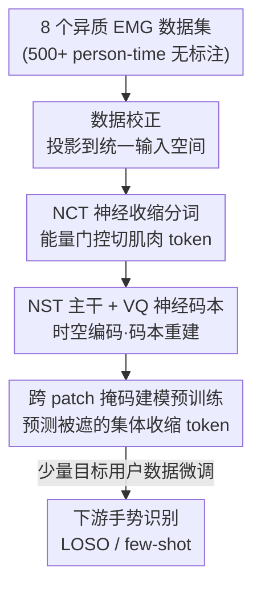

# Reading Your Actions: Learning Generalizable Action Representations via Pre-training AEMG

**会议**: CVPR 2026  
**论文**: [CVF Open Access](https://openaccess.thecvf.com/content/CVPR2026/html/Huang_Reading_Your_Actions_Learning_Generalizable_Action_Representations_via_Pre-training_AEMG_CVPR_2026_paper.html)  
**代码**: https://github.com/AEMG-series/AEMG  
**领域**: 自监督 / 表示学习（生理信号 EMG 基础模型）  
**关键词**: 表面肌电(EMG)、自监督预训练、向量量化、掩码建模、跨被试泛化

## 一句话总结
AEMG 把表面肌电信号（EMG）当成一门"语言"——用能量驱动的分词器把肌肉收缩切成"词"、把多通道协同切成"句子"，再用向量量化码本 + 掩码重建做自监督预训练，得到一个跨设备、跨被试、跨任务通用的 EMG 基础模型，在最严格的留一被试（LOSO）零样本手势识别上比六个 SOTA 平均高 5.79–9.25%。

## 研究背景与动机

**领域现状**：表面肌电（sEMG）是解码人体运动意图、做肌电人机接口（假肢控制、康复机器人、手势诊断）的核心信号源。一段 EMG 可抽象成实值矩阵 $I \in \mathbb{R}^{C \times T}$，$C$ 是随设备而变的电极通道数，$T$ 是采样点数。过去十年深度学习在单数据集的手势识别精度上做得很高（常 >95%）。

**现有痛点**：这些高精度大多是在"随机划分 / 被试内划分"下刷出来的虚高——一旦换成严格的留一被试交叉验证（LOSO-CV），精度常跌到 50% 以下。模型严重过拟合到与任务无关的个体/采集变量，换个新用户就崩。后来的无监督域适应（UDA）方法想对齐源域和目标域分布，但当跨被试存在显著概念漂移时收效有限。

**核心矛盾**：EMG 数据存在三重异质性——① 采集硬件差异巨大（电极类型、通道数、拓扑布局、采样率各不相同）；② 信号本身非平稳，跨被试/跨会话漂移严重；③ 缺一个把原始流解析成"生理上有意义、语义上连贯"的离散基元的标准方式。现有方法都建在"固定窗口、固定步长"的滑窗切片上，这种盲切会把一次完整肌肉收缩事件切碎，破坏其语义完整性，导致特征空间天然带歧义。

**本文目标**：用大规模多源 EMG 数据做自监督预训练，造一个"训练一次、到处可用"的通用肌电基础模型，解决跨设备、跨被试、跨任务的泛化与少样本快速适配。

**切入角度**：借鉴 LLM 的自监督预训练范式——既然 Transformer + 重建/掩码能从海量文本里学出通用表示，那能不能把"重建"概念搬到 EMG 上？关键观察是：虽然表面肌电高度个体化，但完成同一个动作时，底层的神经肌肉募集策略共享一套基本拓扑。于是可以把它当语言来建模。

**核心 idea**："EMG 即语言"——用能量门控把异步的肌肉激活爆发切成语义"词"、把多通道协同切成"句子"，构建迄今最大的跨被试 EMG 词表，再用向量量化码本 + 掩码重建学出通用的"肌电语法"。

## 方法详解

### 整体框架
AEMG（Any Electromyography）是一个面向多源异质 EMG 的自监督预训练框架，整条管线分五个环节：先把 8 个高度异质的公开数据集经数据校正投影到统一输入空间；再用神经收缩分词器 NCT 把连续信号按能量切成"肌肉 token"（即 EMG 的"词"，多通道协同成"句"）；交给 NST 主干网络编码时空与语义关系；用向量量化把 token 离散化进一个共享神经码本并做重建训练；最后用跨 patch 掩码建模在大规模无标注数据上预训练。预训练完成后，模型只需少量目标用户数据微调即可迁移到下游手势识别。

### 关键设计

**1. "EMG 即语言"范式与跨设备统一输入空间：用语言学视角直接化解非平稳与异质性**

针对"硬件异质 + 信号非平稳"这两个根本痛点，AEMG 不再走传统滑窗启发式，而是引入一个面向自主肌肉收缩的语言学视角：把异步的肌肉激活爆发看作语义"词（words）"、把多通道协同看作"句子（sentences）"，由此构建迄今最大的跨被试 EMG 词表。这个范式的妙处在于——肌肉收缩事件本身就是有起止的离散单元，按它来切天然消解了 sEMG 的非平稳性，并把表面形态与复杂手势语法内在地联系起来。配套的数据校正流水线把 8 个在主频带、电极类型、通道数、采样率上差异巨大的数据集（合计 500+ person-time 无标注数据）投影到统一输入空间，通过固定的通道映射函数 $R(\cdot)$ 把不一致的通道排列重排成预定义拓扑顺序，从而第一次让如此大规模、多样的无标注 EMG 能被聚合到一起做预训练。

**2. NCT 神经收缩分词器：能量门控把连续信号切成有生理语义的"肌肉 token"**

这是化解"盲切破坏语义完整性"痛点的核心。NCT 借鉴心电 QRS 检测思路，先用滑窗能量检测肌肉收缩活动：窗内能量定义为

$$E_w = \frac{1}{L_w}\sum_{t=1}^{L_w}\sum_{c=1}^{C_i} X_i(c,t)^2$$

当 $E_w > \theta$ 时该段被判为一次有效肌肉收缩，阈值 $\theta$ 按每个被试静息态噪声水平在短暂校准期内自适应设定。每个有效段就是一个神经 token $\mathbf{U}^{(k)} \in \mathbb{R}^{C_i \times L_k}$。为抑制被试间/通道间差异，每段再做 z-score 段内归一化 $\hat{U}^{(k)}(c,t) = \frac{U^{(k)}(c,t) - \mu^{(k)}(c)}{\sigma^{(k)}(c) + \epsilon}$。和"固定窗口、固定步长"盲切相比，NCT 切出来的每个 token 都对应一次完整、有生理意义的收缩事件，避免把有效收缩、静息噪声、动作间过渡混进同一片段，这正是后续码本学习质量高的根源。

**3. NST 主干 + VQ 神经码本：把个体化信号映射到 8192 个共享"运动原语"上重建**

NCT 切出的收缩单元仍被个体生理和采集条件带偏，无法直接泛化。NST（Neuro-Syntax Transformer）主干先用 1-D 卷积把原始多通道 token 投到潜在语义空间 $\mathbf{I}_t = \text{GELU}(\mathbf{W}_{\text{conv}} * \mathbf{X} + \mathbf{b}_{\text{conv}})$，再给每个收缩 token 动态注入一个联合时空条件空间——显式编码解剖来源（电极布局）、激活相位、时序顺序三类属性，线性融合后由 Transformer 自注意力捕捉长程神经肌肉关联。随后用向量量化把连续隐状态 $p_i$ 离散化：在 EMG 码本 $V = \{v_i\}_{i=1}^{k} \in \mathbb{R}^{k \times d}$ 中按 L2 距离 $z_i = \|l_2(p_i) - l_2(v_j)\|_2^2$ 找最近邻，再经解码器 $f_d$ 重建出 EMG 句子。整套 VQ 由三项损失驱动（用指数滑动平均稳定码本更新）：

$$\mathcal{L}_{VQ} = \sum_{l \in \mathcal{D}} \sum_{i=1}^{l} \Big( \underbrace{\|\hat{I}_i - I_i\|_2^2}_{\text{重建}} + \underbrace{\|\text{sg}(l_2(p_i)) - l_2(v_{z_i})\|_2^2}_{\text{词表学习}} + \underbrace{\|l_2(p_i) - \text{sg}(l_2(v_{z_i}))\|_2^2}_{\text{编码器承诺}} \Big)$$

其中 $\text{sg}$ 是停梯度算子。强制把千差万别的输入都映射到这套共享的生理原型上，模型就被逼着抽取跨被试可泛化的表示。最终码本收敛出 8192 个标准运动原语：实测同一码本索引严格聚到形态一致的收缩（如 Index 332 专门捕获爆发式屈肌募集的瞬态高幅冲发），且对波形几乎相同但时空上下文不同的段，NST 会动态分配到不同 token——体现出"语境相关的语义多义性"。

**4. 跨 patch 掩码建模预训练：遮住单个收缩 token，靠上下文预测它对应的集体收缩 token**

在码本和重建之上，预训练阶段遮住 EMG 句子里一部分单个肌肉收缩 token，让模型根据未遮上下文去预测这些被遮位置对应的"集体肌肉收缩 token"（即码本里的离散原型）。这一步逼模型显式建模跨电极位置的时空依赖与底层肌肉协同。有意思的是消融发现：NCT 视角下的掩码预测准确率反而比传统盲切更低——因为盲切会产生大量零填充或易预测的静噪 token，把预训练任务变简单了；而 NCT 强迫模型理解真实、复杂的时序语义和肌肉协同，正是这种"更难"的自监督任务让它学到更鲁棒、更可泛化的表示。

### 损失函数 / 训练策略
VQ 阶段用 $\mathcal{L}_{VQ}$（重建 + 词表学习 + 编码器承诺三项 MSE），码本用 EMA 更新稳定；预训练阶段用跨 patch 掩码建模目标（预测被遮位置的集体收缩 token）。下游用 LOSO-CV 范式评测：每个被试轮流作目标域，其余全部被试聚合为源域，是检验跨被试泛化最严格的标准。提供 AEMG-Base 与 AEMG-Large 两档规模。

## 实验关键数据

**自定义/关键指标说明**：**LOSO-CV**（留一被试交叉验证）=每次拿一个被试的全部数据测、其余被试训，最严苛的跨被试泛化设定；**Intra-Subject**=被试内训练的精度上界参考；**FT-X%**=用目标用户 X% 数据微调后的少样本精度。

### 主实验：零样本 LOSO 手势识别
四个手势分类基准上 AEMG 与六个 SOTA 对比（精度 %，越高越好）：

| 方法 | ULB-MLG | EMG-EPN | Ninapro DB4 | Toro-Ossaba | 平均 |
|------|---------|---------|-------------|-------------|------|
| Cross-Subject（无适配） | 62.35 | 77.06 | 48.50 | 82.05 | 67.49 |
| Normalization | 80.33 | 84.73 | 75.83 | 86.93 | 81.96 |
| MDD | 82.67 | 88.97 | 64.67 | 87.13 | 80.86 |
| CDEM | 83.00 | 86.95 | 81.33 | 84.55 | 83.96 |
| SCDEM（之前最佳） | 82.82 | 86.75 | 82.33 | 84.17 | 84.02 |
| **AEMG-Base（本文）** | 88.52 | 87.10 | 81.21 | 89.13 | 86.49 |
| **AEMG-Large（本文）** | **91.50** | **88.32** | **88.10** | **91.30** | **89.81** |
| Intra-Subject（被试内上界参考） | 93.36 | 98.11 | 90.50 | 88.82 | 92.70 |

AEMG-Large 平均 89.81%，比最强基线 SCDEM（84.02）高 5.79、比 VADA+DIRT-T（80.56）高 9.25，正好对应摘要的"5.79–9.25%"区间；在 Toro-Ossaba 上甚至超过被试内上界（91.30 vs 88.82）。

### 少样本适配（AEMG-Large）

| 微调数据量 | ULB-MLG | Ninapro DB4 |
|-----------|---------|-------------|
| FT-5% | 88.50 | 85.18 |
| FT-20% | 89.40 | 86.15 |
| FT-40% | 90.72 | 87.30 |
| FT-80% | 91.00 | 88.05 |

仅用 5% 目标用户数据，AEMG-Large 就达到全量微调约 90% 的性能——说明微调本质是把已经"通晓肌电语言"的模型适配到用户特定行为习惯，而非从零学起。

### 消融：NCT 视角 vs 传统盲切（Table 3）
去掉 NCT 的能量门控、改成固定大小/固定步长盲切，其余（VQ 重建、掩码预训练、下游评测）完全一致：盲切平均 82.15%，明显低于 NCT 视角（≈89.81）。值得注意的是，即便用次优的盲切，AEMG 整体架构仍能达到 82.15%，与多数 SOTA 持平或更优，说明架构本身也有优势。

### 关键发现
- **"难任务=好表示"反直觉现象**：NCT 视角下掩码预测准确率更低，下游精度反而更高——低预测准确率恰恰反映预训练任务更难（要理解真实时序语义而非重建静噪/填充），更难的自监督任务学到更鲁棒的表示。
- **NCT 在 VQ 重建阶段重建损失更低**：因为收缩 token 携带清晰生理语义，利于训练高质量、有意义的 EMG 词表；盲切混入噪声/过渡段，加大词表学习歧义。
- **码本可解释**：8192 个原语呈严格生理聚类（如爆发式屈肌 vs 持续低幅伸肌），且支持语境相关多义性。

## 亮点与洞察
- **"信号即语言"的范式迁移很漂亮**：把 LLM 的"分词 + 码本 + 掩码重建"整套搬到生理信号上，关键不是照搬，而是用能量门控让"分词"对齐生理事件，使语言隐喻真正成立。
- **能量门控分词替代滑窗**这一点可迁移到其他生理/传感信号（ECG、IMU、脑电）——凡是有"事件性爆发"的信号，按事件切都可能比按固定窗切学到更干净的离散表示。
- **"预训练越难、下游越好"的诊断信号**：用掩码预测准确率的高低反向判断自监督任务难度，是个实用的 sanity check。
- **统一输入空间 + 通道映射**让异构设备数据可聚合，是做"基础模型"绕不开的工程基石，值得复用。

## 局限与展望
- 评测集中在手势分类（4 个数据集），未覆盖假肢比例控制、连续运动估计等回归类肌电任务，"通用基础模型"的广度尚待验证。
- 能量阈值 $\theta$ 依赖每被试静息校准期，部署时仍需一小段校准，对"即插即用"略有约束。⚠️ 阈值设定与校准时长的鲁棒性论文未充分给出敏感性分析。
- 码本规模 8192 是经验值，主频带/被试分布更广时是否够用、会不会饱和未深入分析。
- NST 的"时空条件空间"（解剖来源/相位/顺序）的具体融合权重与必要性缺独立消融，难判断各属性贡献。

## 相关工作与启发
- **vs 传统单数据集深度模型**：它们在被试内刷高精度但 LOSO 下崩到 <50%，本质是给每个场景定制模型；AEMG 用大规模自监督预训练学通用表示，主打跨被试零样本/少样本。
- **vs 无监督域适配（UDA：MDD/CDEM/SCDEM/VADA）**：UDA 在固定窗口特征空间里做分布对齐，输入特征本身已被盲切破坏语义完整性，对齐效果受限；AEMG 先用 NCT 切出生理语义完整的 token，再学通用词表与运动语法，从源头消除歧义。
- **vs CTRL-labs 等超大规模数据范式**：同样借鉴 NLP 基础模型思路，但 AEMG 走"聚合多个异构公开数据集"这条更低成本、更可扩展的路径来逼近 EMG 基础模型。

## 评分
- 新颖性: ⭐⭐⭐⭐⭐ "EMG 即语言" + 能量门控分词 + VQ 码本 + 掩码重建，把 LLM 范式真正适配到生理信号，范式级创新
- 实验充分度: ⭐⭐⭐⭐ 四数据集 LOSO + 少样本 + NCT 消融扎实，但缺回归类肌电任务与时空条件空间的独立消融
- 写作质量: ⭐⭐⭐⭐ 动机—范式—方法链条清晰，语言隐喻贯穿；个别公式 OCR 噪声、部分细节在附录
- 价值: ⭐⭐⭐⭐⭐ 朝"训练一次、通用可用"的 EMG 基础模型迈出关键一步，对肌电人机接口落地意义大，且已开源

<!-- RELATED:START -->

## 相关论文

- [\[CVPR 2026\] Chain-of-Models Pre-Training: Rethinking Training Acceleration of Vision Foundation Models](com_pt_chain_of_models_pretraining.md)
- [\[ICML 2026\] NITP: Next Implicit Token Prediction for LLM Pre-training](../../ICML2026/self_supervised/nitp_next_implicit_token_prediction_for_llm_pre-training.md)
- [\[CVPR 2026\] Decouple Your Discovery and Memory in Continual Generalized Category Discovery](decouple_your_discovery_and_memory_in_continual_generalized_category_discovery.md)
- [\[ECCV 2024\] Efficient Image Pre-Training with Siamese Cropped Masked Autoencoders](../../ECCV2024/self_supervised/efficient_image_pre-training_with_siamese_cropped_masked_autoencoders.md)
- [\[CVPR 2026\] Suppressing Non-Semantic Noise in Masked Image Modeling Representations](suppressing_non-semantic_noise_in_masked_image_modeling_representations.md)

<!-- RELATED:END -->
