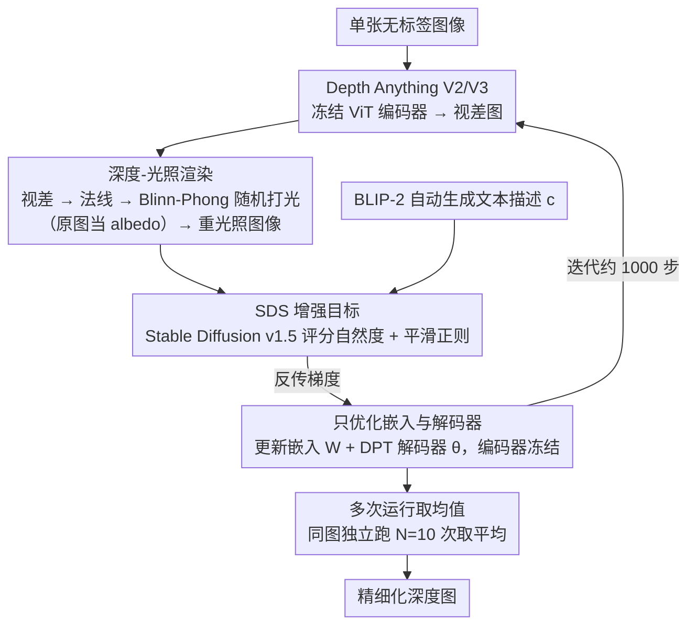

# Re-Depth Anything: Test-Time Depth Refinement via Self-Supervised Re-lighting

**会议**: CVPR 2026 Findings  
**arXiv**: [2512.17908](https://arxiv.org/abs/2512.17908)  
**作者**: Ananta R. Bhattarai, Helge Rhodin (Bielefeld University)  
**代码**: [GitHub](https://github.com/anantarb/Re-Depth-Anything)  
**领域**: 自监督  
**关键词**: 单目深度估计, 测试时优化, Score Distillation Sampling, 重光照, Depth Anything

## 一句话总结

提出 Re-Depth Anything，通过在推理时对预测深度图进行重光照增强并利用 2D 扩散模型的 SDS 损失进行自监督优化，在无标签的情况下精细化 Depth Anything V2/3 的深度预测。

## 背景与动机

Depth Anything V2 (DA-V2) 等基础模型虽然性能优异，但对与训练分布差距较大的真实图像仍存在误差（如光照偏差导致微结构丢失、平坦区域出现伪噪声）。现有测试时适应方法要么需要多帧时序信息，要么依赖特定外部先验（3D 网格/稀疏点）。而大规模 2D 扩散模型学到了丰富的物理世界先验，尚未被充分利用于深度估计的测试时精细化。

## 核心问题

如何利用 2D 扩散模型先验，在**单张图像**上进行**无标签**的深度图测试时精细化？

## 方法详解

### 整体框架

这篇论文要解决的是：拿一个已经训好的单目深度模型（Depth Anything V2/V3），在**推理时**、只给**一张无标签图像**的情况下，把它预测错的深度修得更准。核心做法是绕一个圈子——既然没有深度真值可以直接监督，那就把预测的深度图当成几何，给它打上一束随机的光、渲染成一张"重光照图像"，再问一个预训练的 2D 扩散模型：这张图看起来自然吗？如果重光照后的图像有违和感（比如平坦墙面上冒出莫名的凹凸、本该有纹理的球面被压平），说明底层深度有问题，扩散模型给出的梯度就会反向把深度推回合理的形状。整条链路是「深度 → 法线 → Blinn-Phong 重光照 → 扩散模型评分（SDS）→ 反传修正深度」，每一步都可微，对单张图反复迭代约一千步即可收敛。

### 关键设计

**1. 重光照而非光度重建：用增强代替逆渲染，回避病态性**

最自然的想法是用扩散先验去重建输入图像本身的光照和材质，再反推深度——但这等于在做逆渲染，光照、albedo、几何三者耦合，是出了名的病态问题，很容易陷入退化解。本文换了个角度：不去还原真实光照，而是**主动给深度图打上随机的新光**，把结果叠到原图上得到一张增强图像，让扩散模型只负责判断"这张被重新打光的图像是否物理合理"。这样扩散模型不必精确解释原图，只需提供一个"看着对不对"的软约束，几何被光照"探照"出来的瑕疵就会暴露并被纠正，从根上避开了逆渲染的不适定。

**2. 深度-光照渲染：把视差图变成一张可微的重光照图像**

要让扩散模型"看到"几何，先得把深度渲染成图像。从模型输出的视差图 $\hat{D}_{\text{disp}}$ 算出表面法线 $\mathbf{N}$，再用 Blinn-Phong 着色模型重新打光：

$$\hat{\mathbf{I}} = \tau\left(\beta_1 \max(\mathbf{N} \cdot \mathbf{l}, 0) \odot \tau^{-1}(\mathbf{I}) + \beta_2 \max(\mathbf{N} \cdot \mathbf{h}, 0)^\alpha\right)$$

其中 $\mathbf{l}$ 是随机采样的光照方向，$\beta_1, \beta_2$ 分别控制漫反射与镜面反射强度，$\tau(\cdot)=(\cdot)^{1/\gamma}$ 是色调映射（$\gamma=2.2$），而输入图像 $\mathbf{I}$ 直接被当作漫反射 albedo 的近似——省去了估计材质这一步。一个实际问题是 DA-V2 输出的是**归一化相对视差**而非绝对深度，好在法线只依赖局部梯度、对全局尺度不变，因此无需恢复绝对尺度，只要优化一个偏移参数 $b=ms$ 即可，实践中固定 $b=0.1$ 就足够。

**3. SDS 增强目标：让扩散模型对重光照图像的"自然度"打分**

每一步都重新随机采样光照参数 $\mathbf{l}$、$\beta_1$、$\beta_2$、$\alpha$，渲染出一张新的增强图像，再用 Score Distillation Sampling 损失衡量它在扩散模型眼里是否合理：

$$\mathcal{L} = \mathcal{L}_{\text{SDS}}(\hat{\mathbf{I}}, c) + \frac{\lambda_1}{hw} \sum_{i,j} \|\Delta \hat{D}_{\text{disp}}^{i,j}\|^2$$

第一项由 Stable Diffusion v1.5 给出，评估重光照图像的自然度并把梯度回传给深度；第二项是平滑正则，压住优化过程中容易冒出的深度噪声。其中文本条件 $c$ 不需要人工提供，而是用 BLIP-2 从输入图像自动生成一句描述，让扩散模型的判断锚定在正确的场景语义上。随机化光照方向是关键：不断换光等于从各个角度"扫描"几何，单一光照下藏得住的瑕疵在多方向照射下无所遁形。

**4. 只优化嵌入与解码器：保住编码器的几何先验**

直接把深度张量当自由变量去优化、或干脆全模型微调，实验里都会崩——前者缺乏结构约束，后者会破坏预训练学到的几何知识。本文只优化中间嵌入 $\mathbf{W}$ 与 DPT 解码器权重 $\theta$，把 ViT 编码器整个冻住：

$$\mathbf{W}^*, \theta^* = \arg\min_{\mathbf{W}, \theta} \mathcal{L}(\hat{\mathbf{I}}, c, \hat{D}_{\text{disp}})$$

冻结编码器保留了它学到的强几何先验，不至于被单图优化带偏；放开解码器权重让模型能做结构性的调整；而优化嵌入则提供了逐图像定制的自由度。三者配合，既不至于太死板（只改深度值修不动结构），也不至于太放纵（全微调把先验搞坏）。

**5. 多次运行取均值：抵消 SDS 的随机性**

SDS 损失本身方差很大，单次优化结果会因随机光照和扩散采样而抖动。因此对同一张图独立跑 $N=10$ 次优化再取均值，把噪声平均掉、留下稳定的结构性改善；实测只需 3 次运行就能拿到大部分收益，可按算力预算在质量和耗时之间权衡。

### 训练策略与实现细节

整套优化用 AdamW 跑 1000 次迭代，嵌入的学习率为 $10^{-3}$、DPT 权重的学习率为 $2\times10^{-6}$（解码器学得更慢以免破坏先验），平滑正则权重 $\lambda_1=1.0$，默认采用缩放正交投影。单次运行在 RTX 5000 上约 80 秒。

## 实验关键数据

| 数据集 | 方法 | AbsRel ↓ | RMSE ↓ | SI log ↓ | SqRel ↓ |
|--------|------|---------|--------|---------|---------|
| KITTI | DA-V2 | 0.305 | 7.01 | 33.6 | 2.49 |
| | **Ours + DA-V2** | **0.283** | **6.71** | **30.7** | **2.20** |
| | 相对提升 | 7.10% | 4.29% | 8.51% | 11.4% |
| ETH3D | DA-V2 | 0.113 | 0.955 | 15.1 | 0.391 |
| | **Ours + DA-V2** | **0.104** | **0.875** | **14.1** | **0.347** |
| | 相对提升 | 8.30% | 8.39% | 6.22% | 11.1% |

| 数据集 | 方法 | AbsRel ↓ | SqRel ↓ | Normal MSE ↓ |
|--------|------|---------|---------|-------------|
| CO3D | DA3 | 0.00251 | 0.000317 | 0.000479 |
| | **Ours + DA3** | **0.00238** | **0.000294** | **0.000409** |
| | 相对提升 | 4.83% | 7.39% | **14.65%** |

*在 DA3 上也取得一致提升，法线误差改善高达 14.7%*

## 亮点

- **重光照而非光度重建**：巧妙回避了逆渲染的病态性，将扩散先验用于"增强合理性检查"
- **不需要任何标签、多视图或额外数据**：纯粹的单图自监督
- **适用于不同 backbone**：在 DA-V2 和 DA3 上都有效
- **细节增强显著**：增强了球面纹理、阳台栏杆等细节，去除平坦面伪噪声
- **理论优雅**：将 DreamFusion 的 SfS+SDS 范式从 text-to-3D 迁移到深度精细化

## 局限与展望

- 偶尔出现幻觉边缘（如卡车上的贴纸被误认为几何特征）
- 天空区域可能被错误延伸几何
- 暗区域（如树木阴影中）可能过度平滑
- 10 次运行集成耗时约 13 分钟，对实时应用不友好
- 使用 Stable Diffusion v1.5 作为先验，可能已非最优选择

## 与相关工作的对比

- vs **DreamFusion/RealFusion**：这些方法做完整的 3D 重建+光度重建；本文只做重光照增强，避免了光度一致性的严苛要求
- vs **经典 SfS**：SfS 假设 albedo 恒定/光照已知，失败案例多；本文用扩散先验取代手工假设
- vs **Marigold**：Marigold 用扩散模型直接做深度估计；本文用扩散模型做测试时优化，与前馈方法互补
- vs **多帧 TTA**：本文的单图方案不需要时序信息，应用范围更广

## 启发与关联

- 重光照增强 + SDS 的范式可推广到法线估计、表面重建等几何任务
- "不重建而增强"是处理病态逆问题的重要策略转变
- 冻结编码器 + 优化嵌入+解码器的方案在其他基础模型适应中也可借鉴

## 评分

- 新颖性: ⭐⭐⭐⭐⭐ — 重光照 SDS 的自监督深度精细化是全新的
- 实验充分度: ⭐⭐⭐⭐ — 三个数据集 + DA-V2/DA3 双 backbone + 详细消融
- 写作质量: ⭐⭐⭐⭐⭐ — 动机清晰，方法优雅，分析透彻
- 价值: ⭐⭐⭐⭐ — 为基础模型的测试时精细化开辟了新路径

<!-- RELATED:START -->

## 相关论文

- [\[ICLR 2026\] Test-Time Efficient Pretrained Model Portfolios for Time Series Forecasting](../../ICLR2026/self_supervised/test-time_efficient_pretrained_model_portfolios_for_time_series_forecasting.md)
- [\[CVPR 2026\] A Stitch in Time: Learning Procedural Workflow via Self-Supervised Plackett-Luce Ranking](a_stitch_in_time_learning_procedural_workflow_via_self_supervised_plackett_luce_r.md)
- [\[ICML 2025\] Update Your Transformer to the Latest Release: Re-Basin of Task Vectors](../../ICML2025/self_supervised/update_your_transformer_to_the_latest_release_re-basin_of_task_vectors.md)
- [\[ICML 2025\] Test-Time Canonicalization by Foundation Models for Robust Perception](../../ICML2025/self_supervised/test-time_canonicalization_by_foundation_models_for_robust_perception.md)
- [\[ICML 2026\] Mitigating Label Shift in Tabular In-Context Learning via Test-Time Posterior Adjustment](../../ICML2026/self_supervised/mitigating_label_shift_in_tabular_in-context_learning_via_test-time_posterior_ad.md)

<!-- RELATED:END -->
