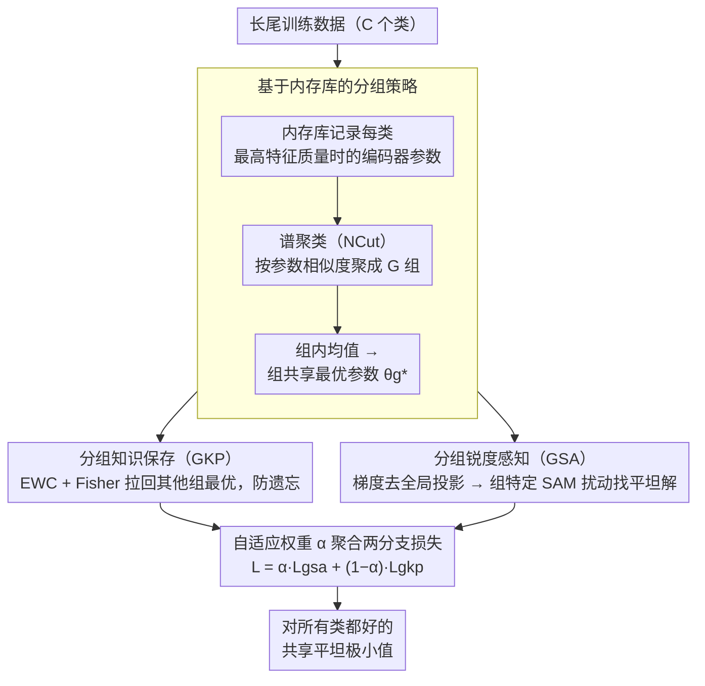

# Reframing Long-Tailed Learning via Loss Landscape Geometry

**会议**: CVPR 2026  
**arXiv**: [2603.21217](https://arxiv.org/abs/2603.21217)  
**代码**: [https://gkp-gsa.github.io/](https://gkp-gsa.github.io/)  
**领域**: 自监督  
**关键词**: 长尾学习、损失景观、尾类退化、持续学习、锐度感知最小化

## 一句话总结
从损失景观几何的角度重新审视长尾学习中的head-tail seesaw困境，发现尾类退化的根源是优化收敛到尖锐且远离尾类最优点的区域，提出基于持续学习思想的GKP（分组知识保存）和GSA（分组锐度感知）双模块框架，无需额外数据即在CIFAR-LT/ImageNet-LT/iNat2018四个基准上取得SOTA。

## 研究背景与动机

1. **领域现状**：长尾学习是计算机视觉的长期挑战。现有方法主要分三类：(1) 类别重平衡（重采样/重加权），(2) 信息增强（数据增强/合成），(3) 模块改进（专门网络设计）。近期趋势是引入外部数据或大模型来缓解，但在隐私敏感场景（如医学）不可行。
2. **现有痛点**：几乎所有方法都面临head-tail的seesaw困境——提升尾类性能必然损害头类性能，反之亦然。先前工作较少关注这个trade-off的深层原因。
3. **核心矛盾**：通过可视化损失景观发现两个关键现象——(a) "尾类性能退化"：标准训练的收敛点$\theta(t_2)$远离尾类最优点$\theta(t_1)$，模型过拟合头类同时遗忘尾类；(b) 模型收敛到尖锐极小值区域：相比只训练尾类收敛到的平坦区域，标准长尾训练收敛到更尖锐的区域，泛化性差。
4. **本文目标** (1) 防止尾类知识在训练过程中被遗忘；(2) 引导优化到平坦极小值区域以提升跨类泛化。
5. **切入角度**：将长尾学习重新表述为持续学习问题——头类梯度主导训练时，尾类知识不断被"遗忘"，类似于CL中的灾难性遗忘。用EWC风格的知识保存来防止遗忘，用SAM风格的锐度感知来寻找平坦区域。
6. **核心 idea**：把长尾看作从头到尾的持续学习，用分组知识保存防遗忘 + 分组锐度感知找平坦解，两者联合引导优化到对所有类都好的共享平坦极小值。

## 方法详解

### 整体框架
全文的出发点是把长尾学习改写成一个持续学习问题：头类梯度长期主导训练，尾类学到的东西会像旧任务一样被慢慢"遗忘"，同时优化又收敛到尖锐、远离尾类最优点的区域。围绕"防遗忘"和"找平坦解"两个目标，方法在训练前先用一套基于内存库的分组策略把全部 C 个类划成 G 组，训练时再走两条互补分支：GKP 分支借 EWC 思路约束当前组的优化不去抹掉其他组已学到的知识，GSA 分支用分组 SAM、在剔除头类主导方向后为各组找平坦极小值。两条分支的损失由一个随 epoch 调度的自适应权重 $\alpha$ 聚合。

### 关键设计

**1. 基于内存库的分组策略：给"持续学习"凑出任务边界**
长尾本身没有 CL 那种显式的任务划分，要把它当持续学习来做，第一步得回答"哪些类该被当成同一个任务一起优化"。本文既不逐类保存（计算量爆炸、又会过度约束优化），也不简单按头尾二分（太粗、忽略组内差异），而是看每个类"收敛到了哪"。训练过程中维护一个内存库 $\mathcal{M}$，动态记录每个类 $c$ 达到最高特征质量 $Q$（基于类间分离度与类内方差定义）那一刻的编码器参数 $\theta_{enc}^c$；随后用谱聚类（NCut）把这 C 份参数按相似度聚成 G 组，取组内均值

$$\theta_g^* = \frac{1}{|\mathcal{G}^g|}\sum_{c \in \mathcal{G}^g} \theta_{enc}^c$$

作为该组的共享最优参数。收敛参数相近的类天然有相似的优化需求，这样分出来的组比头尾二分更贴合"该一起优化"的内在结构，也直接给后面的 GKP / GSA 提供了"组"这个操作单位。

**2. 分组知识保存（GKP）：别让头类梯度把尾类的最优解冲掉**
长尾训练里尾类的最优参数会被头类主导的梯度一点点冲走，这恰好对应 CL 中新任务覆盖旧任务的灾难性遗忘。GKP 沿用 EWC 范式：当模型在第 $g$ 组上训练时，对所有其他组 $j \neq g$ 施加一个把参数往它们历史最优 $\theta_{j,i}^*$ 拉回的惩罚

$$\mathcal{L}_{gkp}^g = \frac{\lambda}{2}\sum_i \sum_{j \neq g} \frac{1}{|\mathcal{G}^j|} F_{j,i}(\theta_i - \theta_{j,i}^*)^2$$

其中 $F_{j,i}$ 是组 $j$ 的 Fisher 信息矩阵对角元，衡量哪些参数对该组真正重要；$1/|\mathcal{G}^j|$ 按组大小归一化，避免大组主导。这样优化当前组时不会顺手把别的组（尤其尾类组）已经学到的知识抹掉，遗忘被显式压住。

**3. 分组锐度感知（GSA）：把"找平坦解"的扰动方向从头类手里夺回来**
另一个病根是收敛到尖锐区域、泛化差，自然想用 SAM 去找平坦极小值；但 SAM 的全局扰动方向同样被头类梯度主导，对尾类那些高锐度区域根本不敏感。GSA 的关键一招是梯度分解：先算各组梯度 $\nabla_\theta \mathcal{L}_{D_g}(\theta)$，再把它在全局梯度方向上的投影减掉

$$\hat{\nabla}_\theta \mathcal{L}_{D_g}(\theta) = \nabla_\theta \mathcal{L}_{D_g}(\theta) - \text{Proj}_{\nabla_\theta \mathcal{L}_D(\theta)} \nabla_\theta \mathcal{L}_{D_g}(\theta)$$

得到去掉头类主导成分、属于该组自己的方向；再按组大小调出扰动半径 $\rho_g^*$，算出组特定的 SAM 扰动 $\hat{\epsilon}_g^*(\theta) = \sqrt{d}\rho_g^* \frac{\hat{\nabla}_\theta \mathcal{L}_{D_g}(\theta)}{\|\hat{\nabla}_\theta \mathcal{L}_{D_g}(\theta)\|_2}$。于是每组都沿自己的需求去找平坦解，尾类不再被头类方向裹挟。这一步的必要性在消融里很直白：直接拿投影分量（即头类主导方向）做 SAM，精度反而从 53.2 暴跌到 46.4。

### 损失函数 / 训练策略
- 总损失 $\mathcal{L} = \sum_{g=1}^G [\alpha \mathcal{L}_{gsa}^g + (1-\alpha)\mathcal{L}_{gkp}^g]$
- $\alpha$是按训练epoch调度的自适应参数
- 默认分组数 $G=4$
- ResNet-32 (CIFAR), ResNet-50/ResNeXt-50 (ImageNet-LT/iNat)
- Batch size 256, NVIDIA 3090 GPU

## 实验关键数据

### 主实验 - CIFAR100-LT

| 方法 | r=100 | r=50 | r=10 | Many | Med. | Few |
|------|-------|------|------|------|------|-----|
| CE Baseline | 38.3 | 43.9 | 55.7 | 65.2 | 37.1 | 9.1 |
| BCL (CVPR'22) | 51.9 | 56.6 | 64.9 | 67.2 | 53.1 | 32.9 |
| GBG (AAAI'24) | 52.3 | 57.2 | - | - | - | - |
| FeatRecon (ICLR'25) | 52.5 | 57.0 | 65.3 | - | - | - |
| LLM-AutoDA† | 51.0 | 54.8 | - | 66.6 | 50.6 | 33.1 |
| **本文** | **53.2** | **57.6** | **68.7** | 67.3 | **54.9** | **34.9** |

### 主实验 - ImageNet-LT & iNaturalist

| 方法 | ImageNet-LT (ResNet-50) | iNat2018 |
|------|-------------------------|----------|
| BCL | 56.0 | 71.8 |
| GBG | 57.6 | 71.9 |
| FeatRecon | 56.8 | 72.9 |
| LLM-AutoDA† | 57.5 | 74.2 |
| **本文** | **57.9** | **74.4** |

### 消融实验

| 配置 | Many | Med. | Few | All |
|------|------|------|-----|-----|
| BCL baseline | 67.2 | 53.1 | 32.9 | 51.9 |
| + GKP | 67.4 | 53.8 | 33.2 | 52.4 (+0.5) |
| + GSA | 67.3 | 54.0 | 34.1 | 52.7 (+0.8) |
| + GKP + GSA (完整) | 67.3 | **54.9** | **34.9** | **53.2** (+1.3) |

### 梯度分解重要性

| 扰动方向 | Many | Med. | Few | All |
|----------|------|------|-----|-----|
| SAM (全局梯度) | 66.3 | 53.0 | 34.5 | 52.1 |
| GSA-proj (投影分量) | 64.7 | 43.8 | 28.1 | 46.4 |
| **GSA (去除全局方向)** | **67.3** | **54.9** | **34.9** | **53.2** |

### 关键发现
- **GKP和GSA互补**：GKP主要提升Med类（+0.7），GSA主要提升Few类（+1.2），两者叠加效果大于单独使用，说明知识保存和平坦化解决的是不同层面的问题。
- **梯度分解至关重要**：使用投影分量（头类主导方向）做SAM扰动反而导致性能暴跌（53.2→46.4），证实了头类主导的全局梯度对尾类优化有害。只有去除全局方向后的组特有成分才是有益的。
- **G=4最优**：分组太少（G=2）过粗糙，分组太多（G=8+）增加了GKP的约束数量反而限制优化自由度。
- **无需外部数据即超LLM方法**：比LLM-AutoDA†（依赖大语言模型生成增强数据）高2.2%（CIFAR100-LT），证明从优化角度解决问题可以不依赖外部资源。
- **梯度相似性验证**：尾类的梯度相似性在baseline中训练后期下降（知识被遗忘），而本文方法全程维持高相似性，直接证实了GKP的知识保存效果。

## 亮点与洞察
- **从损失景观的角度重新理解长尾问题**：不再把长尾当作"类别不平衡"的数据问题，而是当作"优化轨迹偏离"的优化问题。这个视角转换打开了用CL和SAM方法论解决LT问题的大门，非常有启发性。
- **CL到LT的类比**非常精准：头类梯度主导下尾类知识被覆盖 ≈ 新任务覆盖旧任务。但长尾没有显式任务边界，通过memory-based grouping策略巧妙地构造了"伪任务划分"。
- **GSA的梯度分解技巧**：去除全局梯度投影来获得组特有的扰动方向，这个想法简单但效果巨大（+7.1% vs SAM-proj）。可以推广到任何需要在混合目标下做SAM的场景。

## 局限与展望
- Memory bank存储每个类的最优编码器参数$\theta_{enc}^c$在类别非常多时内存开销大（需存C份完整编码器参数）
- 分组策略依赖谱聚类，这个步骤本身引入超参数（G的选择、何时做聚类）
- Fisher信息矩阵的近似（对角化）可能不够精确，更好的重要性估计可能进一步提升GKP效果
- 目前只验证了图像分类，长尾检测/分割等密集预测任务的适用性未探索

## 相关工作与启发
- **vs SAM/FriendlySAM**: 标准SAM的全局扰动被头类主导对尾类无效；GSA通过梯度分解实现分组特定的扰动方向，是SAM在长尾场景下的原则性改进
- **vs BCL**: BCL是主要baseline（同backbone同loss），本文在BCL基础上纯靠GKP+GSA的优化策略就提升了1.3%，说明优化视角的改进是正交的、可叠加的
- **vs GBG (AAAI'24)**: GBG也关注梯度不平衡但用不同的平衡策略，本文从损失景观和知识保存两个角度切入更全面

## 评分
- 新颖性: ⭐⭐⭐⭐ 从损失景观角度重新定义长尾问题，CL→LT的迁移很有创意
- 实验充分度: ⭐⭐⭐⭐⭐ 4个数据集、多backbone、详细消融和分析（特征质量、梯度相似性、景观可视化）
- 写作质量: ⭐⭐⭐⭐ 动机分析充分，可视化丰富，方法推导清晰
- 价值: ⭐⭐⭐⭐ 提供了不依赖外部数据的长尾学习新范式，优化视角的insight对社区有普适价值

<!-- RELATED:START -->

## 相关论文

- [\[AAAI 2026\] BCE3S: Binary Cross-Entropy Based Tripartite Synergistic Learning for Long-tailed Recognition](../../AAAI2026/self_supervised/bce3s_binary_cross-entropy_based_tripartite_synergistic_learning_for_long-tailed.md)
- [\[NeurIPS 2025\] Long-Tailed Recognition via Information-Preservable Two-Stage Learning](../../NeurIPS2025/self_supervised/long-tailed_recognition_via_information-preservable_two-stage_learning.md)
- [\[CVPR 2026\] CHEEM: Continual Learning by Reuse, New, Adapt and Skip -- A Hierarchical Exploration-Exploitation Approach](cheem_continual_learning_by_reuse_new_adapt_and_skip_--_a_hierarchical_explorati.md)
- [\[CVPR 2026\] HyCal: A Training-Free Prototype Calibration Method for Cross-Discipline Few-Shot Class-Incremental Learning](hycal_training_free_prototype_calibration_for_cross_discipline_fscil.md)
- [\[ICML 2026\] The Geometry of Projection Heads: Conditioning, Invariance and Collapse](../../ICML2026/self_supervised/the_geometry_of_projection_heads_conditioning_invariance_and_collapse.md)

<!-- RELATED:END -->
