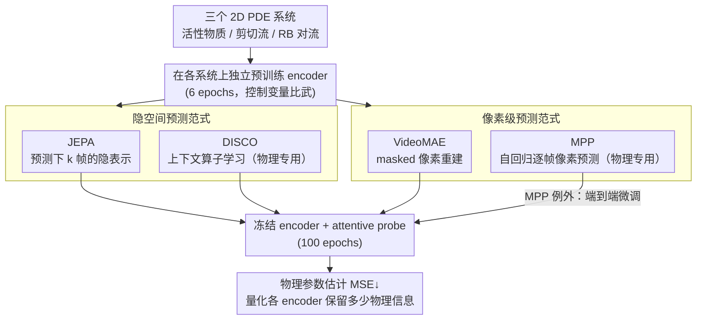

# Representation Learning for Spatiotemporal Physical Systems

**会议**: CVPR 2026  
**arXiv**: [2603.13227](https://arxiv.org/abs/2603.13227)  
**代码**: [GitHub](https://github.com/helenqu/physical-representation-learning)  
**领域**: 自监督/表示学习  
**关键词**: JEPA, 物理系统, 表示学习, 参数估计, VICReg

## 一句话总结

在三个 PDE 物理系统（活性物质、剪切流、Rayleigh-Bénard 对流）上系统比较四种自监督/物理建模方法，发现隐空间预测（JEPA）在物理参数估计任务上全面优于像素级预测（VideoMAE）——MSE 相对改善 28%~51%，且 10% 微调数据即可超越 VideoMAE 的 100% 数据表现。同时，专为物理建模设计的方法并非总是最优选择。

## 研究背景与动机

**领域现状**：机器学习在时空物理系统上的主流方法是"下一帧预测"式的代理建模（surrogate modeling），目标是学习一个精确的系统演化模拟器。代表工作包括 MPP、Poseidon 等物理基础模型，以及 DISCO 等算子学习方法。

**现有痛点**：自回归代理模型训练昂贵且存在累积误差。更重要的是，科学研究的实际需求往往不是逐帧预测，而是估计系统的物理参数（如 Reynolds 数、Prandtl 数等）——这些参数决定了系统的定性行为（层流 vs 湍流）。哪种学习范式最能保留物理意义信息，目前缺乏系统研究。

**核心矛盾**：像素级预测（MAE / 自回归模型）追求视觉细节的精确重建，但这些低级细节可能与高级物理语义无关。用于物理建模的方法虽然引入了物理归纳偏置，但在下游科学任务上是否真的优于通用方法尚无定论。

**本文目标** 比较通用自监督方法（JEPA vs VideoMAE）和物理建模方法（MPP vs DISCO）在学习物理相关表示方面的有效性，以物理参数估计作为定量评估手段。

**切入角度**：物理参数决定系统时间演化行为，因此参数估计误差直接量化了表示中包含多少物理信息。这比下一帧预测误差更能反映"模型是否理解了物理"。

**核心 idea**：JEPA 的隐空间预测目标天然过滤低级视觉细节、保留高级动力学结构，因此比像素级预测方法能学到更好的物理表示。

## 方法详解

### 整体框架

这篇论文本质是一场"控制变量的比武"：要回答的问题是——在时空物理系统上，哪种学习范式学到的表示最"懂物理"。为了让答案可量化，作者把所有方法都放进同一套评估协议里：先在某个物理系统上预训练一个 encoder，然后**冻结 encoder、只训练一个 attentive probe**去估计该系统的物理参数。参数估计误差越低，说明 encoder 的表示里保留的物理信息越多。比武的舞台是 The Well 数据集里的三个 2D PDE 系统：活性物质（待估参数 $\alpha$, $\zeta$）、剪切流（Reynolds 数、Schmidt 数）、Rayleigh-Bénard 对流（Rayleigh 数、Prandtl 数）。参赛选手分两类四种——通用自监督的 JEPA 与 VideoMAE，专为物理设计的 DISCO 与 MPP，它们的核心差异都落在"在隐空间预测，还是在像素空间重建/预测"这一条轴上。

### 关键设计

**1. JEPA 动力学版本：在隐空间里预测未来，而不是重建像素**

这是论文押注的主角，针对的痛点是像素级目标会逼模型把容量浪费在视觉纹理上、稀释掉物理语义。它给定 $k$ 帧上下文 $x_{t:t+k}$，目标是预测后 $k$ 帧 $x_{t+k:t+2k}$ 在**表示空间**里的样子——注意预测对象不是像素，而是 encoder 输出的隐向量。结构上由一个 encoder $f:\mathcal{X}\to\mathcal{Z}$（ConvNeXt）和一个 predictor $g:\mathcal{Z}\to\mathcal{Z}$（逆瓶颈 CNN）组成，训练时让 $g(f(x_i))$ 去对齐目标帧的表示 $f(x_{i+1})$。为了防止"两边都输出常数向量"这种平凡解，它用 VICReg 损失

$$\ell_{\text{VICReg}}\big(g(f(x_i)),\, f(x_{i+1})\big) = \lambda\, s + \mu\,[v(z_i)+v(z_{i+1})] + \nu\,[c(z_i)+c(z_{i+1})]$$

把三件事同时管住：不变性项 $s$ 负责对齐预测和目标，方差项 $v$ 维持每个维度的方差不塌缩，协方差项 $c$ 去掉维度之间的冗余相关（超参 $\lambda=2,\ \mu=40,\ \nu=2$）。因为目标是隐空间而非像素，encoder 没有动机去记忆纹理，只会保留"预测未来动力学所必需"的高级结构——而这恰好和物理参数高度对齐。

**2. VideoMAE 对照组：像素级 masked 重建，代表"另一条路"**

它是用来回答"那像素重建到底行不行"的对照实验。做法是经典的 masked autoencoding：随机遮住时空块，再从可见部分重建被遮的像素值，骨干用 ViT-tiny/16，遮挡采用时间 tube masking（所有帧共享同一套空间 mask），优化的是像素级 MSE 重建损失。它和 JEPA 的唯一关键区别就是"在哪里算损失"——VideoMAE 在像素空间，JEPA 在隐空间，从而把"重建像素 vs 预测表示"这个变量单独拎出来比较。

**3. 两个物理专用基线 DISCO 与 MPP：检验"专为物理设计"是否真的更强**

这一组的作用是给通用方法树立"领域知识"参照系，而且刻意各占一条技术路线。DISCO 走隐空间的算子学习路线，把 Transformer 的上下文学习能力和神经算子的物理归纳偏置结合起来，从一小段上下文窗口里推断出这条轨迹特定的演化算子，再用该算子积分求解。MPP 则走像素级的自回归基础模型路线，在海量物理数据上预训练、逐帧预测物理场的像素值。把它们和 JEPA/VideoMAE 摆在一起，"隐空间 vs 像素级"这条轴就横跨了通用与专用两侧，使得结论不只是 JEPA 赢 VideoMAE，而是能上升到"隐空间范式整体占优"。

### 损失函数 / 训练策略

JEPA 和 VideoMAE 在每个系统上各自独立预训练 6 epochs。MPP 因为公开预训练权重不含这三个数据集，改用已发布权重 + 端到端微调；DISCO 用 The Well 数据预训练。所有模型下游都微调 100 epochs，优化器 AdamW + cosine schedule。

## 实验关键数据

### 主实验

| 方法 | 活性物质 MSE↓ | 剪切流 MSE↓ | RB 对流 MSE↓ |
|------|-------------|------------|-------------|
| **JEPA** | **0.079** | **0.38** | **0.13** |
| VideoMAE | 0.160 | 0.67 | 0.18 |
| DISCO | 0.057 | 0.13 | 0.01 |
| MPP (端到端微调) | 0.230 | 0.59 | 0.08 |

### 数据效率实验（剪切流）

| 微调数据量 | JEPA | VideoMAE |
|-----------|------|---------|
| 10% (~3.2k) | 0.57 | 0.98 |
| 50% (~16k) | 0.40 | 0.75 |
| 100% (~32k) | 0.38 | 0.67 |

### 关键发现

- **JEPA 全面优于 VideoMAE**：三个系统上相对改善 51%（活性物质）、43%（剪切流）、28%（RB 对流），证明隐空间预测比像素重建更能保留物理信息
- **JEPA 数据效率极高**：仅用 10% 微调数据（~3.2k 样本），JEPA 的 MSE（0.57）已优于 VideoMAE 用 100% 数据（0.67），说明 JEPA 表示的物理信息密度更高
- **隐空间方法一致优于像素级方法**：DISCO（隐空间算子学习）和 JEPA（隐空间预测）分别是各自类别的最强模型；MPP（像素级自回归）和 VideoMAE（像素级重建）是较弱的。这与 NLP 领域 BERT（encoder-only）优于 GPT（自回归）在非生成任务上的类比一致
- **专用物理方法不总是最优**：MPP 虽然专为物理建模设计且经过端到端微调，在两个系统上不如仅冻结 encoder+probe 的 JEPA，说明自回归像素预测目标可能与下游物理理解任务不对齐
- **方法间存在系统特异性**：DISCO 在 RB 对流上表现极强（0.01），但 JEPA 在该系统上的优势相对 VideoMAE 最小（0.13 vs 0.18）——说明不同物理系统可能需要不同的归纳偏置

## 亮点与洞察

- **评估范式的转变**：从"预测未来帧"转向"估计物理参数"来评估表示学习的质量，这个视角转换对科学机器学习有深远意义。产生以下洞察——预测像素精确 ≠ 理解物理
- **隐空间预测作为物理表示学习的优越范式**：JEPA 不追求像素精度，反而能学到更好的物理表示。这可以解释为：像素级目标迫使模型分配容量来编码视觉纹理细节，稀释了对高级动力学结构（如对流模式、涡旋形成）的表达。隐空间预测通过跳过像素细节，让模型聚焦于"什么是预测未来所必需的"——而这恰好与物理参数高度相关
- **VICReg 防坍塌三要素的设计**：方差约束（防止维度坍塌）+ 协方差约束（防止维度冗余）+ 不变性约束（对齐预测和目标）的组合为 JEPA 提供了稳定的训练信号

## 局限与展望

- **评估系统有限**：仅三个 2D PDE 系统，未涉及 3D 湍流、多物理场耦合等更复杂场景
- **JEPA 未与 DISCO 直接对比条件**：DISCO 使用了物理归纳偏置（算子学习框架），JEPA 是完全通用的。如果给 JEPA 也加入物理归纳偏置（如物理约束损失），可能进一步缩小与 DISCO 的差距
- **未探索联合预训练**：所有 JEPA 和 VideoMAE 模型都在单个系统上独立预训练，跨系统联合预训练（类似基础模型思路）的效果未知
- **下游任务单一**：仅评估了参数估计，定性预测（如层流→湍流转变检测）、异常检测等其他科学任务未涉及
- **encoder 架构受限**：JEPA 用 ConvNeXt，VideoMAE 用 ViT-small——架构差异可能混淆结论，需要同一架构下的对比

## 相关工作与启发

- **vs VideoMAE**: VideoMAE 在像素空间重建，保留了大量低级视觉信息但稀释了物理语义。JEPA 在隐空间预测，过滤掉像素细节后保留更纯粹的物理结构信息
- **vs MPP (自回归物理基础模型)**: MPP 虽然在大量物理数据上预训练，但自回归目标泛化到参数估计任务时不如 JEPA。这呼应了 NLP 中 BERT vs GPT 在理解任务上的对比
- **vs DISCO (算子学习)**: DISCO 效果最强但需要物理归纳偏置。JEPA 作为完全通用的方法接近 DISCO 水平，提示隐空间预测范式本身可能已捕获部分算子结构

## 评分

- 新颖性: ⭐⭐⭐⭐ 首次系统比较自监督范式在物理参数估计上的表现
- 实验充分度: ⭐⭐⭐ 三个系统、四种方法，但评估任务单一
- 写作质量: ⭐⭐⭐⭐ 论证清晰，结论有洞察力
- 价值: ⭐⭐⭐⭐ 对科学机器学习的表示学习范式选择有重要指导意义

<!-- RELATED:START -->

## 相关论文

- [\[CVPR 2026\] SpHOR: A Representation Learning Perspective on Open-set Recognition for Identifying Unknown Classes in Deep Neural Networks](sphor_a_representation_learning_perspective_on_open-set_recognition_for_identify.md)
- [\[CVPR 2026\] TrackMAE: Video Representation Learning via Track, Mask, and Predict](trackmae_video_representation_learning_via_track_mask_and_predict.md)
- [\[CVPR 2026\] DiverseDiT: Towards Diverse Representation Learning in Diffusion Transformers](diversedit_towards_diverse_representation_learning_in_diffusion_transformers.md)
- [\[CVPR 2026\] D2Dewarp: Dual Dimensions Geometric Representation Learning Based Document Image Dewarping](d2dewarp_dual_dimensions_geometric_representation_learning_based_document_image_.md)
- [\[CVPR 2026\] MINE-JEPA: In-Domain Self-Supervised Learning for Mineral Exploration](mine-jepa_in-domain_self-supervised_learning_for_mine-like_object_classification.md)

<!-- RELATED:END -->
