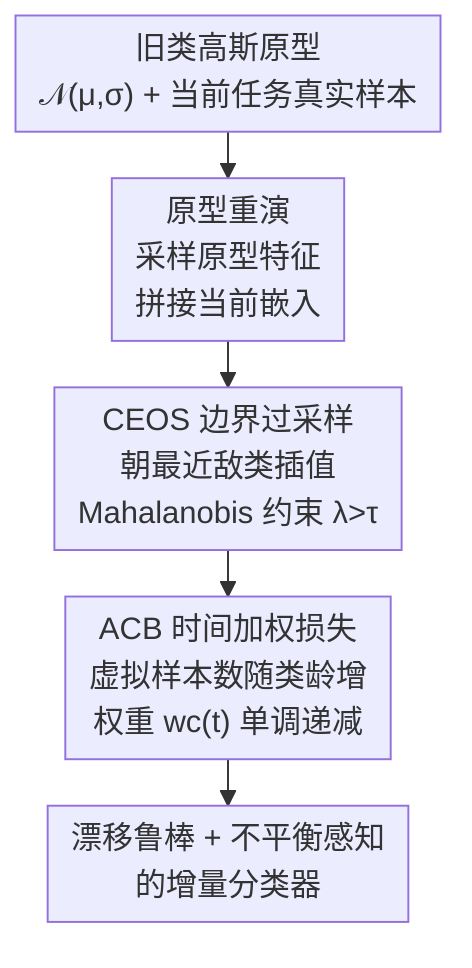

# Revisiting Prototype Rehearsal for Exemplar-Free Continual Learning: Manifold-Aware Boundary Sampling with Adaptive Class-Balanced Loss

**会议**: CVPR 2026 (Findings)  
**arXiv**: [2606.05695](https://arxiv.org/abs/2606.05695)  
**代码**: https://github.com/HXuSz11/ACB_CEOS_CVPR2026_Findings  
**领域**: 持续学习 / 类增量学习 / 表示学习  
**关键词**: 无样本类增量、原型重演、流形过采样、类不平衡、漂移补偿

## 一句话总结
针对"无样本类增量学习（EFCIL）里原型重演被漂移补偿方法吊打"这一现象，本文指出问题不在原型重演本身、而在它被实例化的方式（高斯采样脱离流形 + 旧类隐性不平衡），提出沿最近敌类方向做边界感知插值的 CEOS 过采样 + 随类龄递减权重的 ACB 损失，让原型重演重新追平甚至反超 SOTA 漂移补偿方法。

## 研究背景与动机
**领域现状**：无样本类增量学习（Exemplar-Free Class-Incremental Learning, EFCIL）要求模型在不存任何原始旧数据的前提下持续学新类，只能靠每类一个紧凑的"原型"（特征均值 $\bm{\mu}_c=\frac{1}{|\mathcal{D}_c|}\sum_x F(x)$）来记住历史。这条赛道分两派：**原型重演**（prototype rehearsal）在旧原型周围采合成特征混进当前任务一起训；**漂移补偿**（drift compensation）则不造样本，而是把过时原型重新对齐到不断演化的特征空间里。

**现有痛点**：近年 benchmark 一致显示漂移补偿（如 ADC、LDC）稳定碾压原型重演（如 PASS、PRAKA、EFC），于是社区逐渐认定"原型重演这条路天生更弱"。

**核心矛盾**：作者反对这个结论——差距不来自"原型重演"这个原理，而来自它**怎么被实例化**。现有重演有两个盲点：（i）把原型当成孤立的类摘要，绕开各类独立采样，**完全忽略附近敌类（nearest enemy）的几何信息**，而决策边界恰恰由敌类塑造；（ii）对一个**随时间累积的隐性不平衡**视而不见——每个旧类只有少量贴着单一原型的合成点，而每个新类带来成百个真实特征，即使数据流全局平衡，这种有效样本数的失配也会把分类器拽向近期任务。更糟的是编码器随新任务漂移后，从固定球形高斯里采的旧原型样本越来越"脱离流形"（off-manifold）。

**本文目标 + 切入角度**：把原型重演从"流形感知 + 不平衡感知"两个角度重做。论文甚至用两条定理形式化了这个隐患：Theorem 1 证明在极端不平衡（每旧类 $m\ll K$）下，$T\to\infty$ 时旧类的 softmax 后验 $p_{W_T}(y=c\mid x)\to 0$；Theorem 2 证明随漂移 $\delta_t\to\infty$，高斯合成样本与分类器权重的 logit 对齐 $\mathbb{E}[W_{T,c}^\top\tilde{x}]\to 0$。

**核心 idea**：用"朝最近敌类做受约束插值"代替"高斯噪声"来生成边界感知的旧类样本，并用"随类龄衰减的时间加权交叉熵"代替"静态权重"来纠正旧/新类的演化失衡。

## 方法详解
### 整体框架
方法在每个任务 $t$ 上做三件事，整套流程严格守在无样本预算内。**输入**是当前任务的真实样本 mini-batch 加上历史维护的逐类高斯原型 $\{\mathcal{N}(\mu_{t-1},\sigma_{t-1})\}$；**输出**是一个对旧类保持力强、且不被新类淹没的分类器。具体地：先从原型集合里随机采一批特征，与骨干 $F_t$ 抽到的当前任务嵌入拼在一起（原型重演）；接着对每个旧原型特征找它的 $k$ 个最近敌类特征，沿这个方向做带边界约束的插值，造出"撑到决策边界但不越界"的合成少数类样本（CEOS）；最后用一条随类龄调度的时间加权交叉熵训练——刚生成的原型权重大、随后逐渐衰减到几乎均匀（ACB Loss）。两个模块是互补的：CEOS 改"造什么样的样本"，ACB 改"这些样本在损失里占多大分量"。

### 关键设计

**1. CEOS（受约束扩张过采样）：让合成样本贴着边界、又不越界**

针对"高斯采样在原型周围扎堆、覆盖不到决策边界、还忽略敌类几何"这个痛点，CEOS 不再加各向同性噪声，而是把每个少数类原型 $\mathbf{p}$ 朝它在当前 mini-batch 里的最近敌类 $\mathbf{e}$（异类样本）做凸组合插值：

$$\tilde{\mathbf{x}}=\lambda\,\mathbf{p}+(1-\lambda)\,\mathbf{e},\qquad \lambda\in(\tau,1),\ \tau>\tfrac{1}{2}$$

合成点带原型的硬标签。约束 $\lambda>\tfrac{1}{2}$ 保证合成点落在线段 $\mathbf{p}\!\to\!\mathbf{e}$ 上、且离 $\mathbf{p}$ 比离 $\mathbf{e}$ 更近，于是支撑区"朝边界扩张但不跨过边界"。关键是 $\tau$ 不是拍脑袋取的：作者用马氏距离 $d_M(\mathbf{x},\mathbf{p})=\sqrt{(\mathbf{x}-\mathbf{p})^\top\Sigma^{-1}(\mathbf{x}-\mathbf{p})}$（$\Sigma$ 由当前 batch 估计）定义局部决策边界，要求合成点满足 $d_M(\tilde{\mathbf{x}},\mathbf{p})<d_M(\tilde{\mathbf{x}},\mathbf{e})$（仍在原型主导侧），解析地解出对 $\lambda$ 的下界：

$$\lambda>\frac{1}{2}+\frac{\Delta^\top\Sigma^{-1}\delta}{2\,\delta^\top\Sigma^{-1}\delta},\quad \Delta=\mathbf{e}-\mathbf{p},\ \delta=\tilde{\mathbf{x}}-\mathbf{p}$$

于是对每对 $(\mathbf{p},\mathbf{e})$ 都算出一个局部安全下界 $\tau_{(\mathbf{p},\mathbf{e})}$，再从 $\mathcal{U}(\tau_{(\mathbf{p},\mathbf{e})},1)$ 里采 $\lambda$（自适应混合系数）。这样既保证类一致性、又保留边界 margin——比 PRAKA 那种"随机挑一个旧原型来配对插值"更稳：随机配对常把合成点推进别的更近原型的邻域、反而压垮可分性，而 CEOS 只用最近敌类，把样本牢牢锚在正确一侧的边界附近。

**2. ACB 损失（自适应类平衡损失）：让新生原型先发力、再随时间让位给真实数据**

针对"旧/新类隐性不平衡随时间累积"这个痛点，ACB 给每个类一个**随类龄增长的虚拟样本数**，再用它反向缩放损失权重。对首次出现在任务 $t_c$ 的类 $c$，在任务 $t\geq t_c$ 时其虚拟样本数为

$$N_c(t)=\min\Bigl\{N_{\max},\,N_{\min}+(N_{\max}-N_{\min})\bigl(\tfrac{t-t_c}{T}\bigr)^{\gamma}\Bigr\}$$

对应的类平衡权重沿用 effective-number 形式 $w_c(t)=\frac{1-\beta}{1-\beta^{N_c(t)}}$（$0<\beta<1$，$\beta\to1$ 时 $w_c\approx1/N_c(t)$），它对 $N_c(t)$ 单调递减。直觉很清晰：原型刚被造出来时（类龄小、$N_c$ 小、权重大）正好最贴近当时的决策边界、最有代表性，就让它在损失里多发力；随着该类变老、后续任务积累了更丰富的真实监督，它的虚拟样本数爬升、权重衰减，影响力被温和地退火掉。最终损失就是带权交叉熵 $\mathcal{L}_{\text{ACB}}(t)=-\frac{1}{|\mathcal{B}|}\sum_{(x,y)\in\mathcal{B}}w_y(t)\log p_y(x)$，mini-batch $\mathcal{B}$ 同时含原型特征和当前任务特征。这把"稳定性 vs 可塑性"的权衡变成了一条有原则的时间调度，而不像 Focal loss 那样只看难度、看不到时间维度的失衡。

### 损失函数 / 训练策略
总损失 = 原型重演交叉熵（公式 4：一项拟合新类 $\mathcal{C}_t$、一项在 $\mathcal{C}_{\leq t}$ 上重演所有已见类）+ ACB 时间加权。骨干 ResNet-18 从零训练；CIFAR-100 / TinyImageNet 用 Adam、lr $1\times10^{-4}$、weight decay $2\times10^{-4}$、100 epoch；ImageNet-100 / CUB-200 骨干 lr $1\times10^{-5}$、头 lr $1\times10^{-4}$。真实/原型各 64 的双 batch；虚拟样本数界 $N_{\min}=100$、$N_{\max}=500$；CEOS 每原型只取 1 个敌类（$k=1$），从第二个任务起每 batch 注入 64 个合成样本。

## 实验关键数据

### 主实验
四个 benchmark、骨干从零训练、五次运行均值±标准差。指标为末任务平均准确率 $A_{\text{last}}$ 与其滑动均值（平均增量准确率）$A_{\text{inc}}$。

| 数据集 / 划分 | 指标 | 本文 (Ours) | 次优 SOTA | 提升 (pp) |
|--------------|------|------|----------|------|
| CIFAR-100 T=10 | $A_{\text{last}}$/$A_{\text{inc}}$ | **46.9 / 60.2** | LDC 45.4 / 59.5 | +1.5 / +0.7 |
| TinyImageNet T=20 | $A_{\text{last}}$/$A_{\text{inc}}$ | **31.8 / 44.3** | LDC 24.9 / 38.2 | +6.9 / +6.1 |
| TinyImageNet T=40 | $A_{\text{last}}$/$A_{\text{inc}}$ | **23.2 / 36.3** | LDC 15.3 / 29.7 | +7.9 / +6.6 |
| ImageNet-100 T=10 | $A_{\text{last}}$/$A_{\text{inc}}$ | **52.7 / 65.1** | EFC 50.9 / 61.3 | +1.8 / +3.8 |
| CUB-200 T=20 | $A_{\text{last}}$/$A_{\text{inc}}$ | **48.1 / 61.0** | EFC 46.1 / 59.3 | +2.0 / +1.7 |

关键观察：本文是原型重演阵营（表中‡标记），却在多数划分上**反超**漂移补偿 SOTA；任务越长优势越明显（TinyImageNet T=20 领先 LDC 高达 6.9/6.1 pp）。少数划分（CIFAR-100 T=20、ImageNet-100 的 $A_{\text{inc}}$）略逊 LDC 论文报告值，但作者自己复跑 LDC 公开代码在 ImageNet-100 T=10 只得 41.7/58.7，远低于其论文值，提示 LDC 报告数偏乐观。

### 消融实验
TinyImageNet，逐组件（Table 3）+ 采样策略对比（Table 4）：

| 配置 | T=10 $A_{\text{last}}$/$A_{\text{inc}}$ | T=20 $A_{\text{last}}$/$A_{\text{inc}}$ | 说明 |
|------|------|------|------|
| 纯 baseline（EFC） | 34.5 / 47.9 | 28.4 / 42.1 | 既无 CEOS 也无 ACB |
| + CEOS | 35.1 / 48.7 | 30.4 / 43.0 | 仅边界过采样 |
| + $\mathcal{L}_{\text{acb}}$ | 35.4 / 48.5 | 30.9 / 43.8 | 仅时间加权，单用即与 CEOS 相当 |
| + Focal loss | 34.9 / 48.2 | 29.4 / 42.7 | 普通不平衡补救，明显不如 ACB |
| CEOS + $\mathcal{L}_{\text{acb}}$（Full） | **35.8 / 49.0** | **31.8 / 44.3** | 两者协同最优 |

| 采样方式 (N) | T=10 $A_{\text{last}}$/$A_{\text{inc}}$ | T=20 $A_{\text{last}}$/$A_{\text{inc}}$ | 说明 |
|------|------|------|------|
| Gaussian (64) | 34.5 / 47.9 | 28.4 / 42.1 | 基线 |
| Gaussian (128) | 34.0 / 47.6 | 27.9 / 41.8 | 加样本反而掉 |
| Gaussian (256) | 33.3 / 47.8 | 27.2 / 41.4 | 继续单调下降 |
| Bi-interpolate (64, PRAKA) | 32.8 / 47.2 | 26.7 / 41.0 | 随机原型配对，最差 |
| CEOS (64) | **35.1 / 48.7** | **30.4 / 43.0** | 少量流形样本即最好 |

### 关键发现
- **多加高斯样本没用、甚至有害**：N 从 64→128→256，$A_{\text{last}}$ 单调下降（T=20：28.4→27.9→27.2）。说明瓶颈不只是旧/新数量失衡，更是"样本怎么填空间"——高斯假设局部球形、产出脱离流形或重叠的点。CEOS 只用 64 个流形样本就反超，印证边界对齐才是关键。
- **最近敌类数 $k=1$ 最好**：与静态不平衡数据里"敌类越多越好"的经验相反，EFCIL 里多敌类插值会引入模糊重叠特征、造成任务混淆；只取最近一个敌类把样本牢牢锚在边界、保持语义一致，对早期和后期任务都最优。
- **ACB 优于 Focal**：Focal 只按难度加权，捕捉不到"随时间累积的长尾"，所以只有边际提升；ACB 的时间维调度才对症。
- **几乎零额外开销**：建在轻量 EFC 之上，比 LwF 慢一点点，远快于 LDC（后者需额外 30 个投影头训练 epoch、每任务 >260 秒）；虽不显式做漂移补偿，实测原型漂移反而更小（Figure 3）。

## 亮点与洞察
- **"问题不在原理、在实例化"是漂亮的翻案叙事**：用两条渐近定理（softmax 后验趋零 + 高斯 logit 对齐趋零）把"原型重演为何变弱"形式化，再精准对症下两味药，逻辑闭环非常完整。
- **马氏距离解析求 $\tau$ 是真正把"不越界"做成了硬保证**：不像普通 mixup 靠经验阈值，这里每对原型-敌类都算出局部安全下界，理论上保证合成点落在原型主导侧——可迁移到任何"边界感知数据增强"场景。
- **虚拟样本数 + effective-number 权重把时间维度塞进类平衡**：把"原型刚生成时最可信"这一直觉编码成单调衰减权重，是个很通用的 stability-plasticity 调度器，可搬到其他重演式持续学习方法上。
- **最反直觉的"啊哈"**：在持续学习里，过采样"越多越好"的常识失效——少量但贴边界的样本远胜大量球形噪声，揭示了流形几何比样本数量更重要。

## 局限与展望
- 作者承认：方法仍假设原型在特征漂移后依然"足够有信息量"，且依赖存在有意义的敌类邻居做边界增强；在高度非平稳或样本稀疏的区域，插值偶尔会产出模糊样本。
- 自己发现的局限：只在 ResNet-18 从零训练上验证，未触及 Transformer / 大规模预训练骨干；$\tau$ 的马氏距离依赖当前 batch 估计 $\Sigma$，小 batch 或高维下协方差估计可能不稳；CIFAR-100 T=20 与 ImageNet-100 的 $A_{\text{inc}}$ 仍逊于 LDC 论文值（虽作者质疑其复现性），说明并非全面碾压。
- 改进思路：作者计划用不确定性/漂移感知的原型加权 + 随流形演化的自适应插值放松上述假设，并扩展到 Transformer 与多模态持续学习。

## 相关工作与启发
- **vs 漂移补偿（SDC / ADC / LDC）**：它们直接对齐过时原型来抗漂移，本文不显式补漂移、而是从"造更好的样本 + 改不平衡"入手，结果不仅追平还常反超，且开销低得多（LDC 要多训 30 epoch 投影头）——证明原型重演这条线远未被榨干。
- **vs 高斯式原型重演（PASS / EFC）**：它们在原型周围采球形高斯，本文指出这会脱离流形、且加样本无益反害；CEOS 用边界感知插值替代，少量样本即更优。
- **vs PRAKA（bi-interpolate）**：同样做原型-特征插值，但 PRAKA 随机选旧原型配对，易把点推进邻近类邻域压垮可分性；CEOS 强制只配最近敌类 + 马氏约束，保证不越界，消融上稳定优于它（T=20：30.4/43.0 vs 26.7/41.0）。
- **vs Focal loss**：同是抗不平衡，Focal 只看样本难度、看不到随时间累积的长尾；ACB 的时间加权才对症 EFCIL 的演化失衡。

## 评分
- 新颖性: ⭐⭐⭐⭐ "翻案 + 两定理形式化 + 马氏约束插值 + 时间加权"组合扎实，单个组件均有出处但拼装角度新。
- 实验充分度: ⭐⭐⭐⭐ 四 benchmark、多任务长度、五次运行、组件/采样/敌类数/时间复杂度消融齐全；但只用 ResNet-18 从零训练，骨干单一。
- 写作质量: ⭐⭐⭐⭐ 动机推导清晰、图 1/2 直观、定理与方法对应整齐；少数复现差异坦诚说明。
- 价值: ⭐⭐⭐⭐ 给原型重演阵营提供了低开销、可复用的 SOTA 方案，CEOS 与 ACB 都易迁移到其他重演式持续学习。

<!-- RELATED:START -->

## 相关论文

- [\[CVPR 2026\] Exemplar-Free Class Incremental Learning via Preserving Class-Discriminative Structure](exemplar-free_class_incremental_learning_via_preserving_class-discriminative_str.md)
- [\[CVPR 2026\] HyCal: A Training-Free Prototype Calibration Method for Cross-Discipline Few-Shot Class-Incremental Learning](hycal_training_free_prototype_calibration_for_cross_discipline_fscil.md)
- [\[AAAI 2026\] Expandable and Differentiable Dual Memories with Orthogonal Regularization for Exemplar-free Continual Learning](../../AAAI2026/self_supervised/expandable_and_differentiable_dual_memories_with_orthogonal_regularization_for_e.md)
- [\[ECCV 2024\] Exemplar-Free Continual Representation Learning via Learnable Drift Compensation](../../ECCV2024/self_supervised/exemplar-free_continual_representation_learning_via_learnable_drift_compensation.md)
- [\[ECCV 2024\] Revisiting Supervision for Continual Representation Learning](../../ECCV2024/self_supervised/revisiting_supervision_for_continual_representation_learning.md)

<!-- RELATED:END -->
