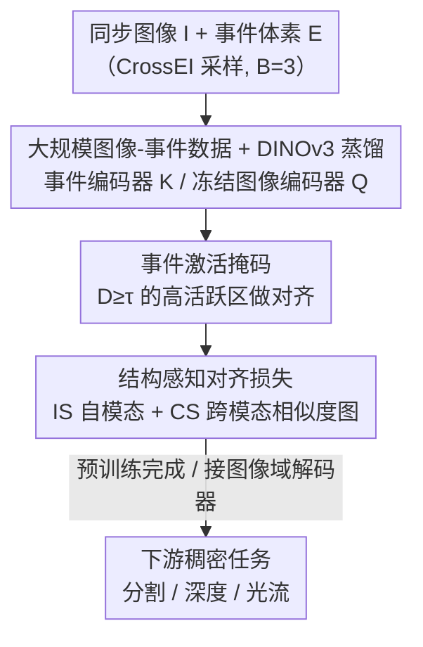

# Scaling Dense Event-Stream Pretraining from Visual Foundation Models

**会议**: CVPR 2026  
**论文**: [CVF Open Access](https://openaccess.thecvf.com/content/CVPR2026/html/Chen_Scaling_Dense_Event-Stream_Pretraining_from_Visual_Foundation_Models_CVPR_2026_paper.html)  
**代码**: https://github.com/zhiwen-xdu/ScaleEvent  
**领域**: 自监督表示学习 / 事件相机  
**关键词**: 事件流预训练, 跨模态知识蒸馏, 视觉基础模型, 结构感知对齐, 稠密感知

## 一句话总结
ScaleEvent 把 DINOv3 这类视觉基础模型（VFM）当作冻结教师，在约 50 万对同步「图像-事件」上做大规模跨模态稠密蒸馏，并用「事件激活掩码 + 结构感知损失」修正图像/事件之间因稀疏度和粒度差异导致的语义坍塌，得到可迁移到分割/深度/光流的细粒度事件表征，下游 RMSE 最多直降约 58%。

## 研究背景与动机
**领域现状**：事件相机（event camera）以超低延迟、高动态范围、低功耗著称，是稠密场景理解的有力传感器。但要做语义分割、深度、光流这类稠密任务，前提是先学到高质量、细粒度的事件表征。主流做法是用稠密事件标注做全监督训练。

**现有痛点**：事件流是异步、稀疏、不规则的点集，稠密标注极其昂贵且难以规模化。半监督/弱监督受限于伪标签质量；事件自监督（masked modeling、对比学习、自蒸馏）虽借鉴了图像域范式，但事件数据本身的稀缺、离散、稀疏让模型难以放大规模、也难设计出能稳定挖掘稠密模式的 pretext task。

**核心矛盾**：跨模态知识蒸馏（让事件学生去模仿图像教师）本可以绕开 pretext 设计、直接继承强语义先验，但图像是稠密、纹理丰富的，事件是稀疏、只在动态边缘有信号的——两者在**稀疏度和粒度上根本不匹配**。直接用 pixel/patch 级或 superpixel 级的刚性对应损失去对齐，会把不该绑在一起的特征过度耦合（over-coupling），导致事件表征的**语义坍塌**（semantic collapse），且分辨率越高越严重。

**本文目标**：在不需要任何标注的前提下，把事件表征预训练「scale up」——既扩大数据规模，又解决高分辨率下的语义坍塌。

**切入角度**：作者观察到，单看一个 patch，事件边缘碎片是杂乱的；但放大感受野后，这些碎片会汇聚成语义连贯的整体。VFM（DINOv3）本身就**现成提供**了一张刻画所有 token 两两相似度的「语义结构图」，这张图同时编码了局部亲和与全局依赖。

**核心 idea**：不去硬对齐「这个事件 patch ↔ 那个图像 patch」的脆弱对应，而是把蒸馏目标从 patch/superpixel 级别**抬升到语义结构级别**——让事件特征空间的相似度图去逼近 VFM 图像特征的相似度图，用更宽的感受野提供更强、更稳的监督。

## 方法详解

### 整体框架
ScaleEvent 是一个「冻结图像教师 + 可训练事件学生」的跨模态蒸馏框架，目标是预训练一个事件编码器 $F_{\theta_e}$，使它产出的细粒度 token 与 DINOv3 图像特征对齐。输入是同步采集的图像 $I\in\mathbb{R}^{H\times W\times 3}$ 与事件流；事件流先经 CrossEI 的运动自适应采样、再聚合成体素 $E\in\mathbb{R}^{H\times W\times B}$（$B=3$），从而与 VFM 输入兼容。图像走冻结的 DINOv3 编码器 $G_{\theta_i}$ 得到教师特征 $Q$，事件走结构相同、同样用 DINOv3 权重初始化的事件编码器得到学生特征 $K$。

蒸馏不是简单地逐 token 拉近：先用**事件激活掩码** $M$ 把对齐聚焦到信号集中的高活跃区域，再叠加**结构感知损失**（intra-modal + cross-modal），让事件的相似度几何向图像的语义结构看齐。预训练完成后，事件编码器直接接图像域的现成解码器（EoMT 分割 / DAv2 深度 / SEA-RAFT 光流）迁移到下游稠密任务。

### 关键设计

**1. 大规模同步图像-事件数据 + DINOv3 跨模态蒸馏 baseline：先把规模和教师立住**

事件自监督最大的瓶颈是数据规模不够、且要靠 pretext task 才能挖出稠密模式。作者放弃 event-only 路线，转而构建一个跨越多种条件（静止 vs 自运动、室内 vs 室外、真实 vs 仿真、不同传感器、不同分辨率）的同步图像-事件集合，从 10 多个数据集 + VID2E 仿真聚合而来，统一缩放/裁剪到 $640\times480$，最终约 50 万对图像-事件。教师选用 SOTA 视觉基础模型 DINOv3（ViT-S/B/L，patch=16，冻结），事件分支用相同结构并以 DINOv3 权重初始化。最朴素的蒸馏只是一项 L1 损失 $\mathcal{L}_{l1}(K,Q)=\frac{1}{N}\sum_n \lVert K_n-Q_n\rVert_1$，让事件 token 直接模仿图像 token。这一步的价值在于：学生「直接继承」了图像域的强语义先验，无需精巧 pretext，就能把训练规模做大——但单靠 L1 会在高分辨率下崩，于是引出后两个设计。

**2. 事件激活掩码：只在有信号的地方做监督**

事件体素里大量 patch 几乎没有事件，纹理空洞，硬去对齐这些空白区只会引入误导性监督。作者据此构造一张二值掩码，把蒸馏目标集中到「高活跃」区域。具体先沿时间轴对 patch 内事件计数得到密度图 $D(\mu,\nu)=\sum_{b=1}^{B}\sum_{(i,j)\in P(\mu,\nu)}\phi(E(i,j,b))$，其中 $\phi(\cdot)$ 把激活映射为非负计数（如取绝对值）；再用阈值 $\tau$ 二值化：$D(\mu,\nu)\ge\tau$ 取 1，否则取 0，论文取 $\tau=64$。掩码后的特征记作 $K^*=K\odot M$、$Q^*=Q\odot M$。这样监督只落在信号集中、运动纹理清晰的区域，既抑制了背景噪声，又强化了用于跨模态对齐的共同语义结构。

**3. 结构感知对齐损失：把目标从「对 patch」抬到「对相似度图」**

这是全文的核心。作者不再逼事件特征逐点等于图像特征，而是要求两者的**相似度图**一致——相似度图是一张无向加权图，节点是特征锚点、边是 token 两两的亲和度。它包含两项：自模态结构损失（intra-modal）惩罚事件自身相似度矩阵与图像自身相似度矩阵的差异，$\mathcal{L}_{is}=\frac{1}{N}\sum_n\lVert (K^*_n)(K^*_n)^{\top}-(Q^*_n)(Q^*_n)^{\top}\rVert_1$；跨模态结构损失（cross-modal）则让「事件→图像」的亲和分布去逼近「图像→图像」的亲和分布，$\mathcal{L}_{cs}=\frac{1}{N}\sum_n\lVert (K^*_n)(Q^*_n)^{\top}-(Q^*_n)(Q^*_n)^{\top}\rVert_1$，强迫每个事件特征对所有图像特征的相似度轮廓，去镜像它配对图像锚点的轮廓。

$$\mathcal{L}_{dis}=\mathcal{L}_{l1}(K^*,Q^*)+\lambda_{is}\mathcal{L}_{is}(K^*,Q^*)+\lambda_{cs}\mathcal{L}_{cs}(K^*,Q^*),\quad \lambda_{is}=10,\ \lambda_{cs}=4.$$

为什么有效：相似度图天然带来更宽的感受野——单个边缘碎片在 patch 级看不出语义，但在「它和谁相似」这张图里就被还原成连贯结构。用 VFM 现成的语义结构当桥，既绕开了图像/事件稀疏度不匹配带来的刚性误配，又在高分辨率下抑制了过度耦合导致的语义坍塌，从而让事件表征的局部可判别性得以保留。

### 损失函数 / 训练策略
预训练用 AdamW，初始学习率 $5\times10^{-6}$，momentum 0.9，weight decay $1\times10^{-4}$；全参数微调事件编码器，10 个 epoch（每 epoch 10 万对图像-事件），4 张 A6000，预训练阶段不做任何数据增强。下游迁移时所有解码器从各自发布的预训练权重初始化。

## 实验关键数据

### 主实验
语义分割（DDD17-Seg / DSEC-Semantic，全监督 Full 设置，mIoU %）与深度估计（DSEC-Depth，RMSE）上，ScaleEvent 全面超越事件预训练 SOTA：

| 任务 / 数据集 | 指标 | 之前 SOTA | 本文 (ViT-L/16) | 提升 |
|--------------|------|-----------|-----------------|------|
| 分割 DSEC-Semantic | mIoU ↑ | STP 62.05 | 69.65 | +7.6 |
| 分割 DDD17-Seg | mIoU ↑ | STP 63.29 | 65.08 | +1.8 |
| 深度 DSEC-Depth | RMSE ↓ | DepthAnyEvent-R 8.880 | 3.694 (ViT-S 也降至 4.564) | ↓约58% |
| 深度 DSEC-Depth | δ3 ↑ | — | 0.997 | — |

同 backbone（ViT-S/16）下把 DepthAnyEvent-R 的 DSEC-Depth RMSE 从 8.880 砍到 4.564；线性探测（冻结编码器）下分割 mIoU 仍达 58.42%，反超最优 RGB-transfer 方法 KWYAF 的 57.75%。

### 消融实验
Table 5 逐步加组件（ViT-L/16，分割 mIoU 与深度 RMSE）：

| 配置 | DSEC-Sem mIoU ↑ | DSEC-Depth RMSE ↓ | 说明 |
|------|------------------|--------------------|------|
| (a) 仅图像域预训练权重 | 64.31 | 4.424 | 不做事件蒸馏的起点 |
| (b) + 跨模态蒸馏 (L1) | 66.17 | 4.063 | baseline，规模化蒸馏已见效 |
| (c) + 激活掩码 Mask | 66.54 | 4.025 | 聚焦高活跃区，小幅提升 |
| (d) (c) + IS Loss | 69.20 | 3.792 | 自模态结构损失贡献最大 |
| (e) (c) + CS Loss（无 IS） | 68.68 | 3.870 | 跨模态结构损失单独也有效 |
| (f) Full（IS+CS） | 69.65 | 3.694 | 完整模型最佳 |

### 关键发现
- **结构感知损失是涨点主力**：从 (c) 到 (d) 加入 IS Loss，DSEC-Semantic mIoU 从 66.54 跳到 69.20（+2.66），是单步增益最大的一项；说明语义坍塌确实是事件蒸馏的核心瓶颈，结构级对齐对症下药。
- **IS 与 CS 互补**：单独用 IS（d）或单独用 CS（e）都能涨，但同时用（f）才达到最佳，两条结构约束分别管住「事件内部几何」和「事件→图像几何」。
- **分辨率越高语义坍塌越严重**：Fig.4 显示分辨率从 ×1 到 ×4 时 patch 级蒸馏的 PCA/相似度图越来越糊，而加掩码 + 结构正则后局部可判别性得以保留。
- **强数据效率**：仅用 1% 标注微调，DSEC-Depth RMSE 即达 4.983；5% 标注下分割 mIoU 62.82%，超过全监督的 OpenESS（57.21%）。

## 亮点与洞察
- **把蒸馏目标从「特征」换成「相似度图」**：这是最 elegant 的一招——它绕开了跨模态逐点对应必然带来的稀疏/稠密不匹配，用结构一致性替代刚性对应，思路可迁移到任何「稀疏模态 ↔ 稠密模态」的蒸馏（如点云↔图像、雷达↔图像）。
- **借 VFM 现成的语义结构当免费监督**：DINOv3 的 token 相似度本就编码了局部+全局依赖，作者不额外训练任何东西就把它当作「更宽感受野的教师」，几乎零成本地放大了监督信号。
- **激活掩码虽简单但对事件域很关键**：稀疏模态的「空白区监督」是隐形毒药，先把对齐区域筛干净再谈结构对齐，是务实而有效的工程洞察。

## 局限与展望
- 教师强依赖 DINOv3，VFM 自身的语义偏差/失败模式会被原样蒸馏进事件表征；换更弱的教师时方法收益可能缩水（论文未充分探讨教师消融）。
- 需要约 50 万对**同步**图像-事件，真实同步数据获取成本高，很大比例靠 VID2E 仿真合成，仿真-真实 gap 对最终表征的影响未深入分析。
- 阈值 $\tau=64$、$\lambda_{is}=10$、$\lambda_{cs}=4$ 等超参的设定依据论文未给敏感性曲线，跨数据集是否需要重调存疑 ⚠️。
- 方法面向稠密感知，对事件相机最擅长的高速/高动态极端场景（运动模糊、极暗）是否仍稳健，需更多专门评测。

## 相关工作与启发
- **vs 事件自监督（DMM/MEM/ECDDP/STP 等）**：它们靠 masked modeling、对比学习等 pretext 在 event-only 数据上挖稠密模式，受限于数据规模和 pretext 设计；本文走跨模态蒸馏，直接继承 VFM 语义先验，规模和细粒度都更强。
- **vs OpenESS（superpixel 级蒸馏）**：OpenESS 组合 SAM+CLIP 做 superpixel 级多模态对齐，但 superpixel 分组本身模糊、会放大错误引导；本文抬到语义结构级，相似度图比 superpixel 更稳。
- **vs EventSAM / DepthAnyEvent（任务特定蒸馏）**：前者蒸 SAM 拿 patch 级语义无关特征、后者蒸 DAv2 拿深度感知特征，目标都绑死某一任务、难规模化；本文是统一的稠密预训练框架，一个编码器同时迁移分割/深度/光流。
- **启发**：「稀疏模态向稠密模态蒸馏时，对齐二阶相似度结构而非一阶特征」这个原则，几乎可直接套用到任何模态稀疏度差异显著的跨模态预训练。

## 评分
- 新颖性: ⭐⭐⭐⭐⭐ 把蒸馏目标从特征对齐升级为相似度结构对齐，干净地解决了跨模态稀疏不匹配下的语义坍塌
- 实验充分度: ⭐⭐⭐⭐⭐ 覆盖分割/深度/光流三任务、LP/few-shot/Full 三协议、ViT-S/B/L 三规模，消融逐组件清晰
- 写作质量: ⭐⭐⭐⭐ 动机推导扎实、图示直观，但部分超参选取缺敏感性分析
- 价值: ⭐⭐⭐⭐⭐ 事件表征预训练显著刷新 SOTA 且数据效率高，框架对其他稀疏-稠密跨模态蒸馏有普适借鉴

<!-- RELATED:START -->

## 相关论文

- [\[CVPR 2026\] Scaling Parallel Sequence Models to Vision Foundation Models](scaling_parallel_sequence_models_to_vision_foundation_models.md)
- [\[CVPR 2026\] Exploring Visual Pretraining for Learning Language Intelligence](exploring_visual_pretraining_for_learning_language_intelligence.md)
- [\[CVPR 2026\] Chain-of-Models Pre-Training: Rethinking Training Acceleration of Vision Foundation Models](com_pt_chain_of_models_pretraining.md)
- [\[CVPR 2026\] Harnessing the Power of Foundation Models for Accurate Material Classification](harnessing_the_power_of_foundation_models_for_accurate_material_classification.md)
- [\[CVPR 2026\] Franca: Nested Matryoshka Clustering for Scalable Visual Representation Learning](franca_nested_matryoshka_clustering_for_scalable_visual_representation_learning.md)

<!-- RELATED:END -->
