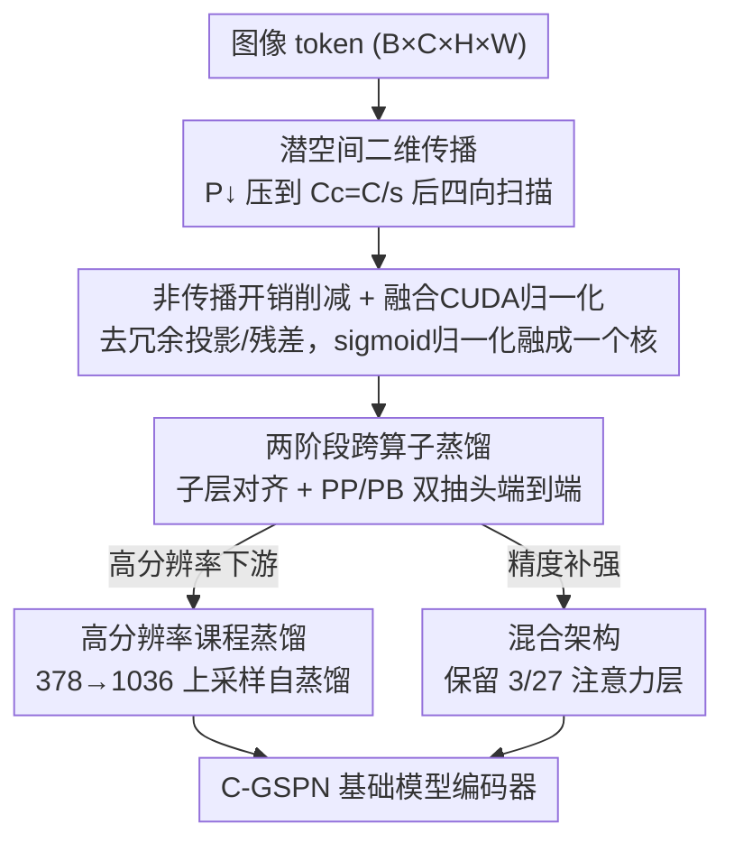

# Scaling Parallel Sequence Models to Vision Foundation Models

**会议**: CVPR 2026  
**论文**: [CVF Open Access](https://openaccess.thecvf.com/content/CVPR2026/html/Jiang_Scaling_Parallel_Sequence_Models_to_Vision_Foundation_Models_CVPR_2026_paper.html)  
**代码**: 无  
**领域**: 视觉基础模型 / 自监督表示学习  
**关键词**: 次二次算子、空间传播网络、跨算子蒸馏、高分辨率编码器、CLIP 预训练

## 一句话总结
本文把线性复杂度的二维空间传播网络 GSPN 改造成压缩潜空间版本 C-GSPN，并用两阶段跨算子蒸馏从注意力教师迁移知识，第一次把次二次算子推到 CLIP 级别的视觉基础模型预训练——1K 分辨率下块级延迟比 FlashAttention 快 2 倍、分割涨 2.1%，零样本精度逼近注意力基线。

## 研究背景与动机
**领域现状**：视觉基础模型（CLIP/SigLIP 这类）靠自注意力在海量图文对上做对比预训练，得到能广泛零样本迁移的通用编码器。但自注意力对 token 数是 $O(N^2)$ 复杂度，分辨率一升高 token 数暴涨，显存和延迟就被注意力主导。

**现有痛点**：为了把注意力做成次二次，主流有三条路——稀疏/局部窗口（Longformer、Swin）、核近似线性注意力（Performer、Linformer）、状态空间模型（S4、Mamba）。前两类把图像拍平成与结构无关的一维 token 序列，丢掉了二维空间连贯性这一视觉关键归纳偏置；Mamba 这类一维序列算子要硬塞进高分辨率视觉，又得额外补二维偏置或分层设计。更要命的是，这些算子**都没有被推到基础模型的数据与模型规模**——从头训一个 SigLIP-v2 要 400 亿图文对、2048 块 TPU，没人验证过次二次算子能不能撑起 CLIP 级预训练。

**核心矛盾**：GSPN（广义空间传播网络）原本是个理想候选——它直接在二维网格上沿四个方向做线扫描传播，线性复杂度、还不需要位置编码。但它有个硬件层面的隐疾：GSPN 按通道独立传播，每个 SM 上能驻留的 block 和寄存器有限，一旦 batch 或通道数变大，多余的切片被串行化，理论并行度失效，延迟出现尖峰（C 从 288 涨到 576 时延迟暴涨 11.57 倍）。于是「线性复杂度」在大规模下反而比注意力还慢。

**本文目标**：(1) 让 GSPN 在大 batch / 大通道下也保持平坦延迟；(2) 不从头训，而是从现成注意力教师把知识迁移到传播算子上；(3) 把这套东西真正跑到基础模型规模并保住零样本能力。

**核心 idea**：把传播搬进**压缩潜空间**绕开 GPU 并发墙（C-GSPN），再用**两阶段跨算子蒸馏**把注意力教师的表示迁过来——既省算力又保精度，第一次把次二次算子做成 CLIP 级编码器。

## 方法详解

### 整体框架
C-GSPN 的目标是「在 ViT 里把注意力子层换成一个又快又准的二维空间传播子层，并通过蒸馏把它训到基础模型规模」。整条管线分两大块：**算子改造**（让单层传播在高分辨率/大 batch 下飞快）和**蒸馏训练**（从注意力教师迁移 + 高分辨率课程迁移）。

先看背景算子。GSPN 对输入 $x\in\mathbb{R}^{H\times W\times C}$ 沿网格逐行传播，行内所有位置并行更新。以自上而下为例，第 $i$ 行通道 $c$ 的递推为

$$h_{i,:,c} = w_{i,c}\, h_{i-1,:,c} + \mathrm{Diag}(\lambda_{i,:,c})\, x_{i,:,c}, \qquad y_{i,:,c} = u_{i,:,c}\odot h_{i,:,c}$$

其中 $\lambda, w, u$ 都是输入相关参数，$w$ 必须行随机（每行归一化求和为 1）以满足稳定性—上下文条件：$w_{i,c}(j,k)=\sigma(\tilde w_{i,c}(j,k))/\sum_{k'\in N(j)}\sigma(\tilde w_{i,c}(j,k'))$。四个方向（上下、下上、左右、右左）各扫一遍，每像素每遍只需三个系数（三对角邻域），一次行扫描是 $O(H)$ 顺序步、行内 $W$ 元素并行，行列都扫的有效顺序深度是 $O(\sqrt{N})$。

C-GSPN 在此基础上做三件事改造算子、两件事做蒸馏，整体流向如下：

### 关键设计

**1. 潜空间二维传播：把传播搬进压缩通道空间绕开 GPU 并发墙**

GSPN 的瓶颈不是算法复杂度而是硬件并发——通道维 $C$ 一大，传播切片就被 SM 串行化。C-GSPN 的招很直接：先用一个逐空间位置的 $1\times1$ 卷积 $P_\downarrow:\mathbb{R}^C\to\mathbb{R}^{C_c}$ 把通道压到 $C_c=\lfloor C/s\rfloor$（压缩因子 $s>1$），所有传播参数 $u,\lambda,\tilde w$ 都**直接在潜通道空间里生成**（同样是 $1\times1$ 卷积预测的逐位置参数），四向扫描全程在 $C_c$ 个通道上跑，最后只用 $P_\uparrow:\mathbb{R}^{C_c}\to\mathbb{R}^C$ 上投影一次：$y_c=\mathrm{Prop2D}(x_c;u,\lambda,w),\ y=P_\uparrow(y_c)$。

这样有效传播网格从 $B\times C$ 缩到 $B\times C_c$，每个 SM 的压力骤降、不再触发串行化。实测 1K 分辨率下，相比原始空间核，潜空间传播在 $C=1152$ 时加速 54.46 倍、$B=32$ 时 55.74 倍，且延迟在通道/batch 上几乎平坦。一个被作者强调的额外红利：因为 $\tilde w$ 定义在潜通道里，那个行随机归一化（Eq. 2 的 sigmoid + 局部归一化）只在 $C_c$ 而非 $C$ 上算，权重归一化又白赚 38.9 倍加速。单层（layer）总加速达近 10 倍且不掉精度。

**2. 非传播开销削减 + 融合 CUDA 归一化核：把传播子层之外的「外壳」也削薄**

传播一旦变快，瓶颈就转移了。作者发现 GSPN 的总延迟在中低分辨率下其实被**非传播部分**主导——1K 下这些外壳比核传播本身贵 9.6 倍。这些外壳是从注意力模板继承来的冗余：(i) 传播核外围的内层残差路径、(ii) 继承自注意力的线性投影、(iii) 传播前把通道先扩张的中间上采样投影。三者逐个砍掉，累计把外壳延迟降约 5.5 倍（消融里：去线性投影几乎不掉精度、去内层残差掉一点、去通道扩张投影掉得最多）。

另一刀砍在归一化上：行随机归一化原本是 sigmoid 激活→局部规约→clamp→除法一串操作，每步都进出显存。作者把它们融成**一个自定义 CUDA 核**，一遍跑完，消掉中间显存流量和 kernel 启动开销，比 PyTorch 基线快 2.15 倍；叠加潜空间把 $C{=}1152$ 压到 $C_c{=}64$ 的结构性缩减，归一化总成本在 1K 下降 83.68 倍。算子改造三招合计让 C-GSPN 层在 1K 下相比原始 GSPN 提速 13.7 倍。

**3. 两阶段跨算子蒸馏：用 PP/PB 双抽头把注意力教师迁移到传播学生**

从头训基础模型不现实，所以从预训练注意力教师（SigLIP-v2 / OpenCLIP）蒸馏。但跨算子迁移很别扭：注意力靠显式两两交互一次性混合所有 token，GSPN 靠顺序局部传播把有效序列长度压到 $\sqrt{N}$，二者特征分布有 gap，注意力层权重不能直接搬。作者用渐进两阶段解决：

**Stage 1 子层级预训练**——逐块把 C-GSPN 传播子层对齐到教师的注意力子层。第 $i$ 块的教师和学生都吃**同一个**教师第 $i{-}1$ 块的输出 $h^{t,(i-1)}$，分别算出传播子层输出 $F^{s,(i)}$ 和注意力子层输出 $F^{t,(i)}$，最小化 $L^{(i)}_{prop}=\lVert F^{s,(i)}-F^{t,(i)}\rVert_2^2$。教师冻结、各块独立训练、块间不回传，于是每个传播子层都直接学它配对注意力子层的表示模式，给后续端到端一个强初始化。

**Stage 2 端到端蒸馏**——每块挂**两个抽头**：传播/注意力子层之后取 post-propagation (PP)、整块（含 MLP+norm）之后取 post-block (PB)。每个抽头用 MSE 对齐特征 + KL 对齐分布：$L_{PP}=\mathrm{MSE}(\hat V^s_{PP},V^t_{PP})+\lambda_1\mathrm{KL}(P(\hat V^s_{PP})\Vert P(V^t_{PP}))$，PB 同理，总损失 $L_{total}=\alpha L_{PP}+\beta L_{PB}$。关键直觉是分解迁移任务：PB 监督保住教师的块级变换（MLP 在师生间基本同构），PP 监督**直接逼迫 GSPN 子层去学注意力式的混合**，不让 MLP 把算子失配「吸收」掉——消融显示加 PP 抽头带来 3.1% 精度提升。两个抽头前都插一个轻量 MLP **适配器**当可学习桥梁（把 $V^s_{PP}\to\hat V^s_{PP}$），因为师生特征空间差异太大，原始空间直接比对会训练不稳；适配器把「直接特征匹配」变成「可学习特征对齐」，稳定了算子 gap 最大的 PP 抽头。

**4. 高分辨率课程蒸馏 + 混合注意力：把编码器无切片地迁到 1K–2K 并补回精度**

C-GSPN 不需要位置编码，升分辨率不用改架构、只改训练，因此能单遍推理高分辨率、避开 tiling 的边界伪影和全局上下文损失。但直接从 378 跳到 756 效果差。作者用**课程学习 + 上采样自蒸馏**：分辨率分级爬升（378→518→756→1036），每级把上一级 checkpoint 冻结当教师，把它的 PP/PB 特征**双线性上采样**到当前分辨率 $\tilde V^{t,(k)}=\mathrm{Up}(V^{t,(k-1)})$ 来监督学生，损失 $L^{(k)}_{hr}=\alpha L^{(k)}_{module}+\beta L^{(k)}_{block}$ 沿用 Stage 2 的 MSE+KL。纯对比损失够做分类但抓不住分割要的细粒度空间细节，这个自蒸馏正好补上：只用 3M 样本（每级 1M，相当于从头训 600M 的 1/200）就把 1036 分辨率密集任务做起来，比 ViT-Distill 训练快 2.40 倍。

此外受 MaTVLM 混合 Mamba-Transformer 启发，作者保留一小撮注意力层（27 层里留 3 层，即 1/9 注意力的混合架构）：少量注意力层注入长程两两混合，其余层保持高效传播，既避开全网二次成本又把精度补回来，落在成本—质量的最优前沿（2K 下仍比纯注意力快约 3.9 倍）。

### 损失函数 / 训练策略
- Stage 1：逐块独立的子层特征 MSE 对齐（教师冻结，块间不回传），作为初始化。
- Stage 2：端到端，PP/PB 双抽头各为 MSE + KL，$L_{total}=\alpha L_{PP}+\beta L_{PB}$，抽头前接适配器。
- 高分辨率：课程式分辨率爬升 + 上采样自蒸馏，$L_{hr}=\alpha L_{module}+\beta L_{block}$。
- 教师：OpenCLIP ViT-SO/14@378（主实验）/ SigLIP-v2（消融）；数据 600M 图文对。

## 实验关键数据

### 系统效率（A100，B=32，C=1152）
| 分辨率 | 指标 | Attention | FlashAttention | GSPN | C-GSPN(本文) |
|--------|------|-----------|----------------|------|--------------|
| 1036 | 子层延迟(ms) | 205.90 | 32.81 | 9.95 | **0.18** |
| 2058 | 子层延迟(ms) | OOM | 504.73 | OOM | **0.46** |
| 1036 | 块延迟(ms) | 238.18 | 68.93 | 133.12 | **36.60** |
| 2058 | 块延迟(ms) | OOM | 631.63 | OOM | **147.52** |
| 2058 | 吞吐(img/s) | OOM | 1.81 | OOM | **6.91** |

子层级最高比点积注意力快 1097×、比原始 GSPN 快 55.3×–86.9×；块级 2K 下比 FlashAttention 快 4.28×，吞吐在 1K/2K 比 FlashAttention 高 1.67×/3.82×。

### 多任务质量（教师 OpenCLIP SO/14@378，600M 图文对）
| 方法 | 参数 | Top-1 | ADE20K | COCO | 宏平均 |
|------|------|-------|--------|------|--------|
| OpenCLIP SO/14（教师） | 427M | 84.1 | 45.8 | 47.7 | 64.6 |
| ViT-Distill | 427M | 82.2 | 45.5 | 45.8 | 63.5 |
| GSPN | 477M | 80.5 | 45.3 | 44.3 | 62.7 |
| **C-GSPN（本文）** | **365M** | 81.3 | **46.0** | 45.0 | 63.3 |

C-GSPN 用少 15% 参数逼平 ViT→ViT 基线（63.3 vs 63.5），显著超原始 GSPN（62.7），分割上甚至超过教师（ADE20K +0.2%）。

### 消融实验
| 配置 | 现象 | 说明 |
|------|------|------|
| 对比损失 only | 最差 | 算力受限下纯 CL 不够 |
| +PB | 一般 | 只块级监督（旧方法） |
| +PB+PP | +3.1% | PP 直接监督传播子层，增益最大 |
| w/ 适配器 | 持续涨 | 跨算子特征桥，PP 处最关键 |
| 压缩率 12/18/72 | 18 最优 | 18 是精度—效率最佳平衡点 |
| 高分辨率 w/o KD → w/ KD | 1036 mIoU 43.5→45.8 | 上采样自蒸馏，且训练快 2.40× |
| 混合 3/27 注意力 | 一致涨点 | 少量注意力补长程混合，保速 |

### 关键发现
- **PP 抽头是蒸馏的胜负手**：旧蒸馏只监督块级（PB），让 MLP 把算子失配吸收了；直接在 GSPN 原始输出上加监督才逼传播子层真正学注意力式混合，单这一项 +3.1%。
- **瓶颈会转移**：传播变快后，延迟反被「非传播外壳 + 权重归一化」主导，必须连外壳一起削（5.5×）+ 融合 CUDA 核（2.15×）才有 13.7× 层级总加速。
- **去通道扩张投影掉点最多**：消融 (e) 里三刀中它对精度最伤，所以用 1/9 注意力混合来补回容量而不牺牲速度。
- **课程学习对高分辨率迁移是必需**：378→756 直接迁只有 70.2%，渐进 378→518→756 升到 80.4%（同样本预算）。

## 亮点与洞察
- **把「算法复杂度」和「硬件并发」分开看**：GSPN 理论线性却在大通道下慢，根因是 SM 并发墙而非 FLOPs——压到潜空间不是为了省算力，而是把传播切片数压到并发阈值以下，这种「为硬件而非为复杂度」的优化视角很值得迁移。
- **跨算子蒸馏的双抽头分解**：PP 管子层、PB 管整块，配上适配器把硬匹配变软对齐，是把注意力知识灌进非注意力算子的一套可复用配方，对 Mamba/SSM 蒸馏同样适用。
- **无位置编码 = 免改架构升分辨率**：因为 GSPN 天然在二维网格上传播、不依赖位置编码，高分辨率迁移只需调训练（课程 + 上采样自蒸馏），不用 tiling、无边界伪影，对密集预测部署很实用。
- 用 600M（vs SigLIP-v2 的 40B）就把次二次算子做到 CLIP 级，证明「蒸馏迁移」是绕开天价从头训的可行路径。

## 局限与展望
- 作者承认：C-GSPN 只换了注意力子层，**MLP 没动**——B=32、分辨率 ≥512 时 MLP 占块延迟的 52%，是下一个瓶颈，未来要做 MLP 压缩/核融合/低秩。
- 还需要一个强注意力教师做蒸馏，没验证完全从头训 C-GSPN 能否达到同等质量；迁移质量上限受教师约束。
- ⚠️ 大量延迟数字基于特定硬件（A100）和配置（B=32、C=1152），不同硬件并发阈值不同，加速比不能直接外推；混合架构 3/27 的最优比例也可能随规模变化。
- 仍保留 1/9 注意力层，意味着没有完全消除二次成本，只是把它压到很小份额。

## 相关工作与启发
- **vs FlashAttention**：FlashAttention 靠 IO 感知优化常数因子，但延迟仍随 token 二次增长（2K 子层 504ms）；C-GSPN 是把算子本身换成线性传播（2K 子层 0.46ms），是结构性而非常数级的改进。
- **vs 原始 GSPN**：同样四向二维传播，但 GSPN 在原始通道空间跑、保留注意力模板的冗余投影/残差，大 batch/通道下被并发墙拖垮；C-GSPN 压到潜空间 + 削外壳 + 融合核，层级快 13.7×，且第一次推到基础模型规模。
- **vs Mamba/状态空间模型**：SSM 是一维序列算子，塞进高分辨率视觉要补二维偏置；C-GSPN 原生在二维网格传播、免位置编码，空间连贯性更自然。
- **vs DeiT / 同构 ViT 蒸馏**：DeiT 做的是同算子 ViT→ViT 蒸馏；本文是跨算子（注意力→传播）蒸馏，必须靠 PP/PB 双抽头 + 适配器处理特征分布 gap。

## 评分
- 新颖性: ⭐⭐⭐⭐⭐ 第一次把次二次算子（GSPN）推到 CLIP 级基础模型预训练，潜空间传播 + 跨算子蒸馏配方都很新。
- 实验充分度: ⭐⭐⭐⭐ 系统效率/多任务/高分辨率/五组消融都覆盖，但主要绑定 A100 与单一教师，规模外推证据有限。
- 写作质量: ⭐⭐⭐⭐ 动机—瓶颈—方案逻辑清晰，图表丰富；部分细节（适配器结构、超参）放附录。
- 价值: ⭐⭐⭐⭐⭐ 给「高分辨率视觉编码器如何摆脱注意力二次成本」提供了可落地、可蒸馏的工程路径。

<!-- RELATED:START -->

## 相关论文

- [\[CVPR 2026\] Scaling Dense Event-Stream Pretraining from Visual Foundation Models](scaling_dense_event-stream_pretraining_from_visual_foundation_models.md)
- [\[CVPR 2026\] Robustness of Vision Foundation Models to Common Perturbations](robustness_of_vision_foundation_models_to_common_perturbations.md)
- [\[CVPR 2026\] Chain-of-Models Pre-Training: Rethinking Training Acceleration of Vision Foundation Models](com_pt_chain_of_models_pretraining.md)
- [\[CVPR 2026\] TALO: Pushing 3D Vision Foundation Models Towards Globally Consistent Online Reconstruction](talo_pushing_3d_vision_foundation_models_towards_globally_consistent_online_reco.md)
- [\[CVPR 2026\] Harnessing the Power of Foundation Models for Accurate Material Classification](harnessing_the_power_of_foundation_models_for_accurate_material_classification.md)

<!-- RELATED:END -->
