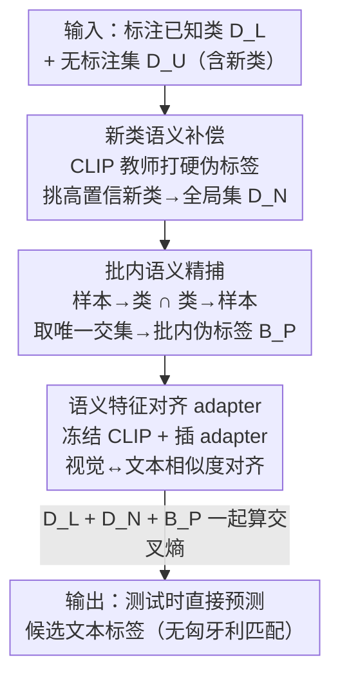

# SECOS: Semantic Capture for Rigorous Classification in Open-World Semi-Supervised Learning

**会议**: CVPR 2026  
**arXiv**: [2604.27596](https://arxiv.org/abs/2604.27596)  
**代码**: https://github.com/ganchi-huanggua/OSSL-Classification (有)  
**领域**: 自监督 / 开放世界半监督 / 广义类别发现  
**关键词**: 开放世界半监督, 广义类别发现, CLIP, 语义对齐, 伪标签

## 一句话总结
针对开放世界半监督学习（OWSSL）只会"聚类"、靠匈牙利匹配硬对齐才能算准确率的痛点，SECOS 用冻结的 CLIP 把新类样本的视觉特征"接地"到候选文本标签上，分两级（全局补偿 + 批内精捕）造出可信伪标签、再用 adapter 对齐视觉-语义空间，从而在测试时**不做任何后处理就能直接预测文本标签**，在 7 个数据集上即便对手用了匈牙利匹配仍领先最多 5.4%。

## 研究背景与动机

**领域现状**：开放世界半监督学习（OWSSL，也叫广义类别发现 GCD）的设定是：训练集里有标注的已知类样本 + 一堆无标注样本，而无标注样本里既有已知类也有**全新的、训练中从没给过标签的新类**。模型既要分对已知类，又要把新类样本组织成语义一致的簇。近期主流做法是借助预训练模型（DINO、CLIP）拿先验，用聚类或伪标签策略去利用新类样本。

**现有痛点**：作者指出这些方法压根没在做"严格分类"。它们训练时只盯着样本的视觉特征做聚类/对比，完全忽略新类样本里潜藏的语义信息；评测时几乎全靠**匈牙利匹配**把预测出的伪标签和真值做事后对齐——这一步极不稳定，哪怕一个 batch 里大量样本分错了，重排后也能刷出虚高准确率。更要命的是真实部署时根本没有带标签的测试集让你做匹配，这类方法在实战里直接失效。换句话说，它们输出的"标签"和候选文本标签之间**没有语义对应**，本质是聚类不是分类。

**核心矛盾**：作者把真正想要的任务命名为 **RC-OWSSL（Rigorous Classification in OWSSL）**——要求模型直接从候选标签集（已知类 + 新类的文本标签都在里面）里为每个样本挑出语义最相关的那个标签，和标准分类任务一致、不准事后处理。现有方法做不到的根本原因有两个：新类样本训练时**完全没有显式监督信号**；方法本身**缺少挖掘新类潜在语义信息的机制**。

**本文目标**：作者把它拆成两个研究问题。① 现有方法缺的核心成分是什么？答案是**语义接地（semantic grounding）**——把新类视觉特征和它的语言含义关联起来的能力。② 在新类完全无监督的情况下怎么捕获语义？答案是必须借助有视觉-文本先验的模型（CLIP）来算新类样本和候选标签的语义相似度，跨模态对齐后才能有效"捕获语义"。

**核心 idea**：用冻结的 CLIP 当"外部知识"，把无标注样本（尤其是新类）的视觉特征映射到候选文本标签上、造出带语义对应的伪标签作为显式监督信号，再用轻量 adapter 把视觉特征空间对齐到语义特征空间——让模型测试时无需匈牙利匹配就能直接吐出文本标签。

## 方法详解

### 整体框架
SECOS 要解决的是：新类样本一个监督信号都没有、已知类却有标注，直接训练会让 logits 严重偏向已知类、新类几乎全分错。它的整体思路是"先想办法给新类造出可信的监督信号，再把视觉空间对齐到语义空间"。输入是带标注的已知类集 $D_L$ 和无标注集 $D_U$（含已知+新类），主干是冻结的 CLIP，输出是测试时对每张图直接预测候选文本标签。

整个流程串成三段：先做 **Novel Class Semantic Compensation（新类语义补偿）**，用冻结 CLIP 教师给 $D_U$ 打硬伪标签，挑出高置信的新类样本攒成一个全局伪标注新类集 $D_N$（大小约等于 $D_L$），从全局层面把新类的监督强度补到和已知类平衡；再做 **Batch-Wise Semantic Recapture（批内语义精捕）**，在每个 batch 内用"样本→类"和"类→样本"两种互补置信视角交叉验证，挑出语义最明确的样本配上细粒度伪标签 $B_P$，把已知类被忽略的、新类没补全的语义都精捕回来；最后用 **Adapter for Semantic Feature Alignment（语义特征对齐 adapter）**，冻结 CLIP 文本/视觉编码器、只在视觉编码器里插轻量 adapter，把视觉特征投影到语义空间、和文本标签编码算相似度，用前两段造的监督信号（$D_L$、$D_N$、$B_P$）一起算交叉熵训练，建立"视觉结构↔语义含义"的显式对应。三段之间是层层加细的关系：第一段粗粒度补全局、第二段细粒度补批内、第三段把所有信号落到 adapter 上完成对齐。

### 关键设计

**1. 新类语义补偿：用全局高置信伪标签把新类监督补到和已知类平衡**

这一步针对最根本的痛点——$D_L$ 里只有已知类标签，新类全埋在 $D_U$ 里、监督信号严重失衡，直接训练 logits 会死死偏向已知类。SECOS 用一个冻结的 CLIP 教师 $\mathcal{T}$ 给 $D_U$ 中每个样本 $u_i$ 打硬伪标签 $\hat{y}_i$，按伪标签把样本分成 $k+n$ 个子集 $P_c$，**只保留属于新类 $C_N$ 的子集**。然后对每个新类，取该类置信度最高的前 $\phi\%$ 样本加入全局伪标注新类集 $D_N$。这里有个关键的量级控制：$\phi$ 设成约 50%，让 $|D_N|\approx|D_L|$——这样新类和已知类的监督强度在全局上拉平，同时新类内部的伪标签分布也大致均匀，从源头上压住偏向已知类的 logits bias。

为了让伪标签更准，作者还做了一个细节：候选集里的文本标签往往就是个短词（如 "cat"），语义太稀薄。于是用 LLM 为每个类生成描述性 prompt，经 CLIP 文本编码器编码后取平均，得到信息更丰富的精炼语义表示，再用它和图像特征算相似度——相当于给"接地"用的锚点做了语义增强。

**2. 批内语义精捕：用样本-类双向置信交叉验证，只留语义唯一明确的样本**

第一段是粗粒度的、只盯新类，会漏掉已知类被忽略的语义和新类没补全的部分。这一步在 batch 层面把细粒度语义捞回来。对 batch 里每个样本 $u_i$，定义两个标签集合：**intra-instance 集 $C_i^{intra}$**（样本视角）和 **inter-instance 集 $C_i^{inter}$**（类视角）。前者把 $u_i$ 对各类的置信度降序累加，直到累计置信度刚超过阈值 $\tau$（$\tau$ 取 batch 内所有样本最大置信度的 $\alpha$-分位数）就停，收的是"这个样本自己觉得像哪些类"；后者对每个类 $c$，把 batch 内所有样本对 $c$ 的置信度升序排，取 $\beta$-分位数当类专属阈值 $\theta_c$，当 $u_i$ 对 $c$ 的置信度超过 $\theta_c$ 就把 $c$ 收进来，收的是"从全 batch 看这个样本在类 $c$ 里够不够突出"。

精捕的核心判据是：**只挑 $|C_i^{intra}\cap C_i^{inter}|=1$ 的样本**，把那个唯一交集 $\hat{y}_i=C_i^{intra}\cap C_i^{inter}$ 当伪标签，得到批内伪标注集 $B_P$。两个视角同时只指向一个类，说明这个样本的语义既"自己确信"又"在群体里突出"，伪标签最可信。这其实是用双向置信分布做了一道严格过滤——交集多于一个就说明语义模糊、容易混类，直接丢掉。消融（Tab. 4）验证了这点：虽然这样筛剩的样本少很多，但伪标签精度高得多，训出来反而更好。

**3. 语义特征对齐 adapter：冻结 CLIP、只训 adapter 把视觉空间对齐到文本空间**

有了前两段造的监督信号，最后一步是把模型的视觉特征空间和语义特征空间真正对齐，让每个样本和它的文本标签建立显式对应。SECOS 选 CLIP 当主干（而非纯视觉模型），因为 CLIP 预训练时本就对齐了视觉和语义、更会"读懂"语义。做法是**冻结文本编码器**，把候选类描述编码成语义表示 $[E_{c_1},\dots,E_{c_{k+n}}]$；**冻结视觉编码器全部原参数**，在每个 attention block 之后、和后续 MLP **并联**插入轻量 adapter，三者构成一个 adapter 残差块、堆 $S$ 层。视觉特征前向写作

$$f^{(t+1)}(x)=h^{(t)}+\text{MLP}(h^{(t)})+\text{Adapter}(h^{(t)}),\quad h^{(t)}=f^{(t)}(x)+\text{Attention}(f^{(t)}(x))$$

最后经 projector 投影到语义维度得 $V_x=\text{Projector}(f^{(S)}(x))$。adapter 本身是个先降维再升维的瓶颈结构 $\text{Adapter}(z)=\gamma_{\text{param}}\cdot\mathcal{P}_u(\sigma(\mathcal{P}_d(\text{LayerNorm}(z))))$，$\mathcal{P}_d/\mathcal{P}_u$ 是降/升采样投影、$\sigma$ 是 GeLU、$\gamma_{\text{param}}$ 是缩放因子。训练时只更新 adapter 和 projector，推理时全冻结、直接算 $V_x$ 和各类文本编码的相似度作为 logits 预测标签。用并联 adapter 而非串联，是为了不改 CLIP 原前向通路、最大限度保住它的泛化能力。

### 损失函数 / 训练策略
对每个样本 $(x,y)$ 计算视觉特征 $V_x$ 与各类文本编码 $E_{c_i}$ 的内积相似度作为 logits，对真值/硬伪标签算交叉熵：

$$\mathcal{L}(x,y)=-\sum_{i=1}^{k+n}\mathbb{I}_{[i=y]}\log\big(\exp(\epsilon)\cdot\langle V_x,E_{c_i}\rangle\big)$$

其中 $\epsilon$ 是 CLIP 自带的 logits 缩放因子，$y$ 既可是真值也可是伪标签 $\hat{y}$。最终损失是三类带标签数据 $(x,y)\in B_L\cup B_N\cup B_P$（分别对应 $D_L$、$D_N$、批内精捕 $B_P$）上交叉熵之和。每张图还做强/弱两种增强视图、两视图损失相加。训练 100 epoch、batch size 32、AdamW（lr 1e-4、weight decay 1e-5）、LambdaLR 调度，超参 $\alpha=0.6$、$\beta=0.95$、$\phi=50$、adapter 降采样维度 10，单张 RTX 3090 即可。

## 实验关键数据

### 主实验
评测协议是关键看点：对比方法都按各自原协议用**匈牙利匹配**算聚类准确率 $ACC_{cluster}=\frac{1}{|D_{test}|}\sum\mathbb{I}(y_i=W(\bar{y}_i))$（$W$ 是最优重排），而 SECOS 直接拿预测标签和真值比算分类准确率 $ACC_{classify}=\frac{1}{|D_{test}|}\sum\mathbb{I}(y_i=\bar{y}_i)$。注意对同一算法必有 $ACC_{cluster}\geq ACC_{classify}$（匈牙利匹配会重排到全局最优），所以这是**让对手用更宽松的评测、SECOS 用更严格的评测**，仍领先才说明问题。K/N/A 分别为已知类/新类/全部准确率。

通用数据集（CLIP backbone）主结果：

| 数据集 | 指标 | SECOS | 次优 | 说明 |
|--------|------|-------|------|------|
| CIFAR100 | N (新类) | **82.6** | 79.5 (SimGCD-CLIP) | 新类大幅领先 |
| CIFAR100 | A (全部) | **84.7** | 81.6 (SimGCD-CLIP) | +3.1 |
| ImageNet100 | N | **89.8** | 86.8 (TP-OWSSL) | +3.0 |
| ImageNet100 | A | **91.7** | 88.0 (TextGCD) | +3.7 |
| CIFAR10 | A | 98.1 | 98.2 (TextGCD) | 仅次优、差 0.1 |

细粒度数据集主结果（A 准确率）：

| 数据集 | SECOS | 次优 | 备注 |
|--------|-------|------|------|
| CUB | **78.6** | 76.6 (TextGCD/TP-OWSSL) | 最佳 |
| Stanford Cars | **92.3** | 90.7 (TP-OWSSL) | 最佳 |
| Oxford Flowers | **90.0** | 87.3 (TP-OWSSL) | 最佳 |
| Oxford Pets | 95.4 | 95.5 (TextGCD) | 次优、差 0.1 |

相比专为细粒度 OWSSL 设计的 TP-OWSSL，SECOS 在细粒度上 N/A 平均提升 1.78%/1.95%，在通用数据集上提升达 7.37%/5.35%，说明对类间分布差异大或小的下游数据都稳。

### 消融实验
两段语义捕获的消融（CIFAR100 / CUB，N=新类语义补偿，B=批内精捕）：

| 配置 | CIFAR100 N | CIFAR100 A | CUB N | CUB A | 说明 |
|------|-----------|-----------|-------|-------|------|
| 仅 $D_L$ baseline | 14.4 | 50.7 | 22.6 | 51.2 | 新类几乎全错、logits 严重偏已知类 |
| + N | 80.4 | 83.9 | 74.5 | 77.5 | 全局补偿把新类准确率拉爆性提升 |
| + B | 76.7 | 82.3 | 69.1 | 74.6 | 单独批内精捕也大幅改善 |
| + N + B (Full) | **82.6** | **84.7** | **75.1** | **78.6** | 两段叠加最优 |

伪标签筛选策略消融（Tab. 4）：用原始交集 vs 只留唯一伪标签的过滤样本——CIFAR100 A 从 82.4→**84.7**，CUB A 从 75.3→**78.6**。过滤后样本数虽少很多，但语义更明确、伪标签精度更高，训练效果反而更好。

无教师消融（Tab. 5）：把教师换成学生 CLIP 的 EMA 副本，四个数据集平均仅掉 0.83%，仍超过所有依赖教师的现有方法。

### 关键发现
- **新类语义补偿（N）贡献最大**：仅 $D_L$ 时新类准确率只有 14.4%（CIFAR100），加上 N 直接飙到 80.4%——证明"新类无监督"才是 OWSSL 的核心瓶颈，全局补偿是雪中送炭。
- **伪标签密度有 trade-off**：$\phi$ 从 10→90 时，Known 准确率渐降、Novel 渐升、All 趋稳；当伪标新类样本数超过标注已知类样本数后，准确率和噪声之间出现权衡、整体趋于平稳，所以 $\phi\approx50$（使 $|D_N|\approx|D_L|$）是甜点。
- **adapter 降采样维度极不敏感**：维度从 2→64，All 准确率涨幅 <2% 且快速收敛，取 10 就够，性价比高、稳定性强。
- **批大小鲁棒**：batch size 从 8→64，CIFAR100 A 仅掉 0.35%、CUB 掉 1.41%。
- **强自学习能力**：去掉教师只掉 0.83%，说明 SECOS 的威力来自"充分榨取 CLIP 自身的语义"，而非依赖额外的强教师。

## 亮点与洞察
- **重新定义任务比刷点更狠**：作者一针见血指出现有 OWSSL"评测靠匈牙利匹配"是个皇帝新衣——真实部署没有带标签测试集让你重排，所以那些高准确率是虚的。提出 RC-OWSSL（直接预测文本标签、不准后处理）把问题拉回真实场景，这个 reframing 本身就是最大贡献。
- **"让对手用宽松评测、自己用严格评测仍赢"的实验设计很有说服力**：$ACC_{cluster}\geq ACC_{classify}$ 这个不等式是数学上必然的，作者明知吃亏还这么比并领先，把"我做的是真分类、你做的是聚类"这件事钉死了。
- **双向置信交叉验证筛伪标签可迁移**：intra（样本→类）∩ inter（类→样本）取唯一交集这招，本质是用两个正交视角互相否决模糊样本，思路可搬到任何需要从噪声伪标签里挑高可信子集的半监督/自训练任务。
- **LLM 扩写短标签做语义锚点**：把 "cat" 这种稀薄标签用 LLM 生成描述再平均编码，是个低成本提升 CLIP 零样本伪标签质量的实用 trick，可复用到任何 CLIP 文本侧。

## 局限与展望
- **作者承认**：SECOS 的性能天花板被 CLIP 的预训练质量和覆盖面锁死——CLIP 没见过/没对齐好的领域，语义接地就会失效。不过作者辩解说 RC-OWSSL 本就需要跨模态语义接地，这种依赖是这类方法共有的、属"必要之恶"。
- **自己发现的局限**：① 整套方法吃 CLIP 的零样本伪标签质量很重，在 CLIP 弱势的领域（医学、遥感、工业缺陷等开放词表外的细分类）大概率会崩，论文只在自然图像/常见细粒度数据集上验证；② 设定假设无标注集和测试集里**没有 OOD 样本、没有多标签**，每个样本恰好对应 $C$ 中一类——真实开放世界往往有分布外干扰，这个干净假设会限制实用性；③ 依赖已知新类数 $n$ 已知（候选集固定），类别数未知时怎么办没讨论。
- **改进思路**：把 OOD 检测/拒识机制接进批内精捕的"唯一交集"判据里，对找不到可信交集的样本主动标 unknown，可能让 SECOS 更接近真正的开放世界。

## 相关工作与启发
- **vs 传统 OWSSL/GCD（GCD、SimGCD、TIDA、OwMatch 等）**：它们做聚类 + 匈牙利匹配后处理，输出标签无语义对应、真实部署失效；SECOS 直接预测文本标签、无需匹配，把"聚类"升级成"严格分类"，这是任务层面的根本区别。
- **vs TextGCD / TP-OWSSL（同样基于 CLIP）**：它们也用 CLIP 但评测仍依赖匈牙利匹配（属聚类范式）；SECOS 用更严格的分类评测，在通用数据集上比 TP-OWSSL 高 5.35%（A），关键差异在于显式给新类造平衡的监督信号 + 双向置信筛伪标签。
- **vs 标准 adapter 微调（Houlsby adapter 等）**：SECOS 沿用并联 adapter 保泛化的思路，但创新不在 adapter 结构本身，而在"用什么监督信号去训它"——把两级语义捕获造的 $D_N$、$B_P$ 喂给 adapter，才是让 CLIP 在 OWSSL 下完成视觉-语义对齐的关键。

## 评分
- 新颖性: ⭐⭐⭐⭐ 重新定义 RC-OWSSL 任务 + 戳破匈牙利匹配虚高，任务 reframing 很有洞见；技术上是 CLIP+adapter+双级伪标签的组合，单点创新偏工程。
- 实验充分度: ⭐⭐⭐⭐⭐ 7 个数据集、两级消融、伪标签密度/维度/批大小/无教师全做了，且用更严苛的评测仍领先。
- 写作质量: ⭐⭐⭐⭐ 问题动机讲得很清楚，三模块逻辑清晰；公式符号略密、部分细节（如 LLM 扩写）一带而过。
- 价值: ⭐⭐⭐⭐ 把 OWSSL 拉回真实可部署场景的视角对社区有矫正意义，方法实用、单卡可复现，代码开源。

<!-- RELATED:START -->

## 相关论文

- [\[CVPR 2026\] PAF: Perturbation-Aware Filtering for Open-Set Semi-Supervised Learning](paf_perturbation-aware_filtering_for_open-set_semi-supervised_learning.md)
- [\[AAAI 2026\] Let the Void Be Void: Robust Open-Set Semi-Supervised Learning via Selective Non-Alignment](../../AAAI2026/self_supervised/let_the_void_be_void_robust_open-set_semi-supervised_learning_via_selective_non-.md)
- [\[CVPR 2026\] Semantic-Guided Global-Local Collaborative Prompt Learning for Few-Shot Class Incremental Learning](semantic-guided_global-local_collaborative_prompt_learning_for_few-shot_class_in.md)
- [\[CVPR 2026\] GaussianMatch: Semi-Supervised Regression with Pseudo-Label Filtering via Multi-View Gaussian Consistency](gaussianmatch_semi-supervised_regression_with_pseudo-label_filtering_via_multi-v.md)
- [\[CVPR 2026\] Learning Like Humans: Analogical Concept Learning for Generalized Category Discovery](learning_like_humans_analogical_concept_learning_for_generalized_category_discov.md)

<!-- RELATED:END -->
