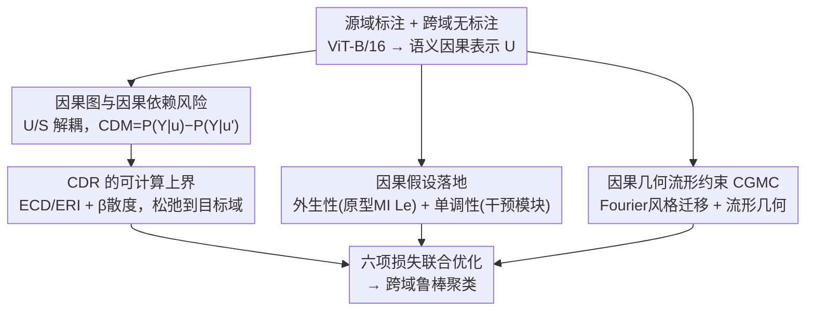

# Seeing Through the Shift: Causality-Inspired Robust Generalized Category Discovery

**会议**: CVPR 2026  
**论文**: [CVF Open Access](https://openaccess.thecvf.com/content/CVPR2026/html/Feng_Seeing_Through_the_Shift_Causality-Inspired_Robust_Generalized_Category_Discovery_CVPR_2026_paper.html)  
**代码**: 无  
**领域**: 自监督 / 表示学习  
**关键词**: 广义类别发现, 跨域泛化, 因果推断, 反事实风险, 流形约束

## 一句话总结
CausalGCD 把"跨域广义类别发现"重新建模成一个结构因果问题：用因果依赖风险（CDR）压住域相关的虚假捷径、再用因果几何流形约束（CGMC）锁住已知类与新类之间跨域不变的几何关系，在 SSB-C 与 DomainNet 两个含域偏移的基准上稳定超过 FREE、HiLo 等 SOTA 约 2 个百分点。

## 研究背景与动机
**领域现状**：广义类别发现（Generalized Category Discovery, GCD）要在只标注了部分已知类的情况下，对包含已知类与未见新类的无标注数据做聚类——既要发现新类，又不能把已知类认错。从早期两阶段优化（GCD）到单阶段参数化分类器（SimGCD、SPTNet、RLCD），这条线已经做得相当成熟。

**现有痛点**：几乎所有 GCD 方法都默认有标注集和无标注集来自同一分布。可现实里（医学影像、跨摄像头识别）无标注数据往往来自不同设备/环境，存在严重域偏移；一旦把这种带偏移的样本喂进去，模型在已知域上的精度都会被拖垮。已有的跨域尝试 HiLo 靠启发式的语义—域解耦 + PatchMix、CDAD-Net 靠对抗对齐，但都没碰到域偏移背后的因果机制，独立性假设和对抗不稳定性让它们脆弱。

**核心矛盾**：域偏移会同时干两件坏事——① 引入域相关的虚假线索，扭曲"语义特征→标签"这条本应不变的因果通路，让模型学到不稳定的捷径；② 充当混杂因子，搅乱已知类与未知类之间的关系结构（论文记为 R），而这层关系恰恰是发现新类的关键。现有方法把这两件事当成普通的分布对齐问题处理，治标不治本。

**切入角度**：作者画出跨域 GCD 的因果图，把潜在表示拆成语义因果因子 $U$ 和域特定因子 $S$，并假设 $S \perp U$、$S \perp Y \mid U$。于是"域偏移"= 对 $S$ 做干预（改变数据分布但保持机制 $P(Y\mid U)$ 不变），"新类涌现"= 对 $U$ 做大幅干预。混杂关系 $R \leftarrow S$ 则解释了为什么已知—未知关系会被域搅乱。

**核心 idea**：第一个为跨域 GCD 建结构因果模型——用一个可计算的"因果依赖风险"逼模型只依赖反事实下稳定的因果语义，再用流形约束保住已知/未知类的跨域不变几何关系，把"看穿域偏移"变成可优化、可评估、可辨识的目标。

## 方法详解

### 整体框架
CausalGCD 的输入是带标注的源域数据 $D_l$ 和混有已知+新类、可能来自不同域的无标注数据 $D_u$，输出是对 $D_u$ 的鲁棒聚类。骨干是 DINO 预训练的 ViT-B/16（只微调最后一个 transformer block），主干特征即语义因果表示 $U$。在 $U$ 之后接一个 MLP 干预模块（按 VIB 思路把分布建成可学习均值/方差的高斯）产生干预后的 $u'$，二者送进**因果依赖风险估计器**度量"干预前后预测如何变化"，并把无法直接计算的目标域风险松弛成可算上界。与此并行，原型级互信息最大化把**外生性/单调性**两条因果假设落到训练里，而 **CGMC** 通过 Fourier 风格迁移构造跨域样本、约束已知—未知类几何关系的跨域一致性。最终由六项损失联合优化。

### 关键设计

**1. 因果图与因果依赖风险 CDR：用反事实差度量"模型有没有依赖稳定的因果语义"**

针对"域相关虚假线索扭曲语义→标签通路"这个痛点，作者先定义一个反事实意义下的因果依赖度量：$\text{CDM} = P(Y=y\mid u) - P(Y=y\mid u')$，其中 $u$ 是干预前的不变因果表示、$u'$ 是干预后的表示。CDM 大说明预测对因果变量依赖强、CDM 小说明依赖弱或在走捷径。由此定义因果依赖风险 $\text{CDR}_Q(u,u') = -\text{CDM} := O_Q(u) - I_Q(u')$，把它拆成观测相关性风险 $O_Q(u)$ 与干预相关性风险 $I_Q(u')$：

$$O_Q(u) = \mathbb{E}_{(x,y)\sim Q}\big[\mathbb{E}_{u\sim P_Q(U\mid X=x)}\, P^g(Y\neq y\mid U=u)\big],\quad I_Q(u') = \mathbb{E}_{(x,y)\sim Q}\big[\mathbb{E}_{u'\sim P_Q(U'\mid X=x)}\, P^g(Y\neq y\mid U'=u')\big].$$

$O_Q$ 是观测分布下的预测风险、$I_Q$ 是语义干预后的风险，二者之差衡量模型对因果干预的敏感度。最小化 $\text{CDR}_Q(u,u')$ 等于让观测预测和干预预测尽量一致，从而压制域特定的虚假相关、把表示推向"干预下依然稳定"的域不变因果表示。这是全文的中枢——它不是再做一次分布对齐，而是用反事实差直接定义"是否依赖因果语义"这件事。

**2. CDR 的可计算上界：把无法直接算的目标域风险松弛成可优化代理**

痛点很现实：$\text{CDR}_Q$ 定义在目标域分布 $Q$ 上，而目标域没有标签，期望风险根本算不出来。作者用三步定理把它变成可算的量。先（定理 1）把目标域 CDR 按样本属于已知类还是新类拆成 $\pi_{Q\wedge P}$（已知类风险）+ $\pi_{Q\setminus P}$（新类发现风险）。再引入两个不需要目标标签的量——预期协同偏差 ECD $\varepsilon_Q(u)=\mathbb{E}_{g_1,g_2}\mathbb{E}_{(x,y)\sim Q}\mathbb{I}[g_1(u)\neq y]\,\mathbb{I}[g_2(u)\neq y]$（相关预测错误）与预期关系不一致 ERI $\delta_Q(u)=\mathbb{E}_{g_1,g_2}\mathbb{E}_{x\sim Q}\mathbb{I}[g_1(u)\neq g_2(u)]$（假设空间分歧），借 $\beta$-散度刻画分布失配、配合 Hölder 不等式得到（定理 2）一个用源域可算量 + 跨域散度表达的上界。最后（推论 1）用变分推断 + Hoeffding/Markov/Jensen 不等式，把期望风险与经验风险的差控制在表示变异度指数 $L_{KL} = -\log(\sigma_U) + \log(\sigma_{U'})$ 之内——KL 越小，经验 $\text{CDR}_{D_u}$ 越能忠实逼近期望 $\text{CDR}_Q$。⚠️ 完整证明在附录，正文只给结论，具体常数以原文为准。

**3. 因果假设落地：外生性靠原型互信息、单调性靠干预模块**

上面的辨识性依赖两条因果假设，作者把它们各自变成可训练的目标。**外生性**要求域因子 $S$ 不混杂 $U\to Y$，即 $P(Y\mid U,S)=P(Y\mid U)$；充分条件是最大化各类源/目标原型的互信息 $\max_G I(e^k_P, e^k_Q)$。实现上用软分配加权平均估计目标域原型 $e^k_Q=\frac{\sum_i p_{i,k} G(x_i)}{\sum_i p_{i,k}}$，再用一个原型对齐损失 $L_e$ 把同类原型拉近、把异类与新类原型推开（分母里的 $N(k)$ 覆盖其他已知类原型和所有新类原型），从而抬高 $I(e^k_P,e^k_Q)$、压住域噪声。**单调性**要求干预后不该增加对原标签的置信度（$\max P(Y=y\mid u)-P(Y=y\mid u')$），作者指出它在最小化 CDR 时自然被满足，无需额外项。另配一个分离损失 $L_{sep}=\kappa - \|u-u'\|_2^2$ 给干预强度兜底，强行拉开 $u$ 与 $u'$ 的语义间隔、避免纠缠和训练不稳。

**4. 因果几何流形约束 CGMC：锁住已知—未知类跨域不变的几何关系**

即便特征已经因果不变，发现新类还要靠已知类与未知类之间的关系结构，而域偏移会扭曲这层关系。CGMC 的做法是先用 Fourier 风格迁移造跨域样本：$\tilde{x}^u_i = \mathcal{F}^{-1}(A^l_i \cdot e^{jP^u_i})$——把源域样本的幅度（域风格）$A^l_i$ 拼到目标无标注样本的相位（语义）$P^u_i$ 上，得到只换了风格、保住语义的样本。再把原始与风格迁移样本各自的同类嵌入做协方差 $\Sigma_Z=\frac{1}{n}ZZ^\top$，取前 $m$ 个特征向量构成类别的几何流形 $C_G=\{\xi_1,\dots,\xi_m\}$，定义已知类 $k$ 与未知类 $r$ 的几何相关 $\text{Sim}_d(k,r)=\sum_{i=1}^m \langle \xi^k_{i,d}, \xi^r_{i,d}\rangle$。若语义结构稳定，则两域应有 $\text{Sim}_P(k,r)\approx\text{Sim}_Q(k,r)$，于是约束 $L_{cgmc}=\sum_{k\in Y_l}\sum_{r\in Y^{novel}_u}\big|\text{Sim}_P(k,r)-\text{Sim}_Q(k,r)\big|$ 直接最小化两域几何相关的差，消除域诱导的几何畸变，让新类发现依赖稳定的因果几何而非虚假域相关。

### 损失函数 / 训练策略
总目标为六项加权：$L = L_P + \lambda_1 L_Q + \lambda_2 L_{KL} + \lambda_3 L_e + \lambda_4 L_{cgmc} + \lambda_5 L_{sep}$。其中 $L_P$ 用源域真标签算经验 CDR、$L_Q$ 用目标域伪标签估 CDR、$L_{KL}$ 缩小期望与经验风险差、$L_e$ 落实外生性、$L_{cgmc}$ 是几何流形约束、$L_{sep}$ 保特征可分与训练稳定。权重取 $\lambda_{1\sim4}=0.5$、$\lambda_5=0.3$，$m=5$、$\kappa=0.5$；DINO ViT-B/16 只调最后一个 block，SGD 训 200 epoch、余弦退火（0.1→1e-4）、batch 128、8×RTX-4090，三种子取均值。

## 实验关键数据

### 主实验
评测在 SSB-C（SSB 加 9 类损坏 ×5 强度，clean 当源、corrupted 当目标）与 DomainNet（Real 当源，其余 5 域轮流当目标）上，指标为 Hungarian 对齐后的聚类 ACC，分 All/Old/New 报告。下表摘 DomainNet 的 All 与 SSB-C 的 Corrupted-All（%）：

| 设置 | 指标 | HiLo | FREE | CausalGCD |
|------|------|------|------|-----------|
| Real+Painting | Painting-All | 42.1 | 45.6 | **48.0** |
| Real+Sketch | Sketch-All | 19.4 | 22.5 | **24.3** |
| Real+Clipart | Clipart-All | 27.7 | 29.3 | **31.2** |
| CUB-C | Corrupted-All | 52.0 | 55.7 | **57.8** |
| Scars-C | Corrupted-All | 35.6 | 38.9 | **41.5** |
| FGVC-C | Corrupted-All | 31.2 | 35.0 | **37.2** |

作者总结：多数已有方法一旦引入域偏移就明显退化（甚至连已知域精度都被未见域样本拖累），而 CausalGCD 在 SSB-C 上对 FREE 在 CUB-C/Scars-C/FGVC-C 分别 +2.1/+2.6/+2.2，clean 域也有涨；DomainNet 上 Real+Painting 对 FREE 在 Painting +2.4、Real +2.2。

### 消融实验
在 DomainNet（Real→Painting）逐项去掉损失（%）：

| 配置 | Real-All | Painting-All | 说明 |
|------|----------|--------------|------|
| w/o $L_P$ | 63.4 | 42.8 | 去源域 CDR，掉点最狠 |
| w/o $L_Q$ | 64.5 | 42.4 | 去目标域 CDR，新类掉到 38.1 |
| w/o $L_e$ | 65.5 | 44.6 | 去外生性，已知类识别变差 |
| w/o $L_{KL}$ | 66.7 | 45.8 | 经验/期望风险不再桥接 |
| w/o $L_{cgmc}$ | 67.6 | 45.0 | 去几何约束，新类发现下滑 |
| w/o $L_{sep}$ | 68.2 | 46.3 | 去分离项，训练变不稳 |
| **Full** | **69.9** | **48.0** | 完整模型 |

### 关键发现
- 两个 CDR 损失（$L_P$/$L_Q$）贡献最大：去掉任一都让 Painting-All 从 48.0 掉到 42 左右，证明跨域优化因果风险是骨架。
- $L_e$（外生性）主要影响已知类识别——去掉后 Old 精度下降，说明它在稳住已知类的判别性。
- $L_{cgmc}$ 主要影响新类发现，验证几何关系一致性对未见类分离的作用。
- 用零样本显著性分割 IS-Net 抽出各域物体区域当"因果因子近似"，CausalGCD 学到的表示与因果因子的距离相关（distance correlation）在所有非 Real 域上都高于 FREE，说明它确实聚焦语义因果区域、抑制了虚假相关。

## 亮点与洞察
- **把"看穿域偏移"形式化成反事实差**：CDM/CDR 不是又一个对齐项，而是直接定义"预测是否依赖稳定因果语义"，给跨域 GCD 第一次提供了可优化/可评估/可辨识的因果目标。
- **理论链很完整**：定理 1 拆已知/新类风险 → 定理 2 给上界 → 推论 1 用 $L_{KL}=\log(\sigma_{U'})-\log(\sigma_U)$ 控制经验-期望差，把"目标域没标签所以算不了"这个死结一步步松弛成可算量，工程上很可借鉴。
- **Fourier 风格迁移 + 流形几何**这一招可迁移：用幅度换风格、相位保语义来造跨域样本，再用协方差主特征向量内积刻画类间几何相关，是一种轻量、可解释的"关系不变性"度量，未必只在 GCD 里有用。

## 局限与展望
- 框架挂着六项损失、五个权重外加 $m$、$\kappa$，调参面积大；正文称权重多取 0.5、敏感性在附录，但实际迁移到新数据集时的调参成本仍偏高。
- 单调性"在最小化 CDR 时自然满足"是一个论断而非显式约束，⚠️ 是否在所有训练阶段都成立、会不会出现违背，正文没给充分验证（以原文/附录为准）。
- CDR 的目标域估计依赖伪标签（$L_Q$ 用预测伪标签算），伪标签质量差时上界是否仍紧、误差如何传播，文中未深入讨论。
- 评测限于 SSB-C 与 DomainNet 这类分类基准，是否能推广到更开放、域数更多或细粒度更极端的真实场景仍待验证。

## 相关工作与启发
- **vs HiLo**: HiLo 靠语义—域解耦 + PatchMix 做跨域 GCD，但独立性假设和混合 patch 会引噪声；CausalGCD 用结构因果模型替代启发式解耦，把域偏移当成对 $S$ 的干预来建模，机制更清楚、稳定性更好。
- **vs CDAD-Net / FREE**: CDAD-Net 用熵驱动对抗学习，继承了对抗不稳定；FREE 走频域扰动做鲁棒发现，是最强 baseline。CausalGCD 不做对抗对齐而是优化反事实因果风险，在多数域对上稳定超过 FREE ~2 个点，且距离相关分析显示它更聚焦因果区域。
- **vs IRM / 因果域泛化（Lv et al.）**: 这些工作用不变风险/结构因果做域泛化，但面向闭集；本文是首个把因果图与完整风险公式带进"无标注含新类"的跨域 GCD，补上了开放世界这块空白。

## 评分
- 新颖性: ⭐⭐⭐⭐⭐ 首个为跨域 GCD 建结构因果模型并给出可计算因果依赖风险上界，角度新且自洽。
- 实验充分度: ⭐⭐⭐⭐ 两个含域偏移基准 + 逐项消融 + 距离相关/可视化分析，较扎实；但敏感性与伪标签影响多放附录。
- 写作质量: ⭐⭐⭐⭐ 因果叙事清晰、定理链完整；符号偏密、部分推导需回附录才看得全。
- 价值: ⭐⭐⭐⭐ 把因果推断落到开放世界类别发现，CDR/CGMC 两个组件具备迁移潜力。

<!-- RELATED:START -->

## 相关论文

- [\[CVPR 2026\] The Devil Is in Gradient Entanglement: Energy-Aware Gradient Coordinator for Robust Generalized Category Discovery](the_devil_is_in_gradient_entanglement_energy-aware_gradient_coordinator_for_robu.md)
- [\[CVPR 2026\] Learning Like Humans: Analogical Concept Learning for Generalized Category Discovery](learning_like_humans_analogical_concept_learning_for_generalized_category_discov.md)
- [\[CVPR 2026\] TAR: Token-Aware Refinement for Fine-grained Generalized Category Discovery](tar_token-aware_refinement_for_fine-grained_generalized_category_discovery.md)
- [\[CVPR 2026\] Decouple Your Discovery and Memory in Continual Generalized Category Discovery](decouple_your_discovery_and_memory_in_continual_generalized_category_discovery.md)
- [\[CVPR 2026\] OmniGCD: Abstracting Generalized Category Discovery for Modality Agnosticism](omnigcd_abstracting_generalized_category_discovery_for_modality_agnosticism.md)

<!-- RELATED:END -->
