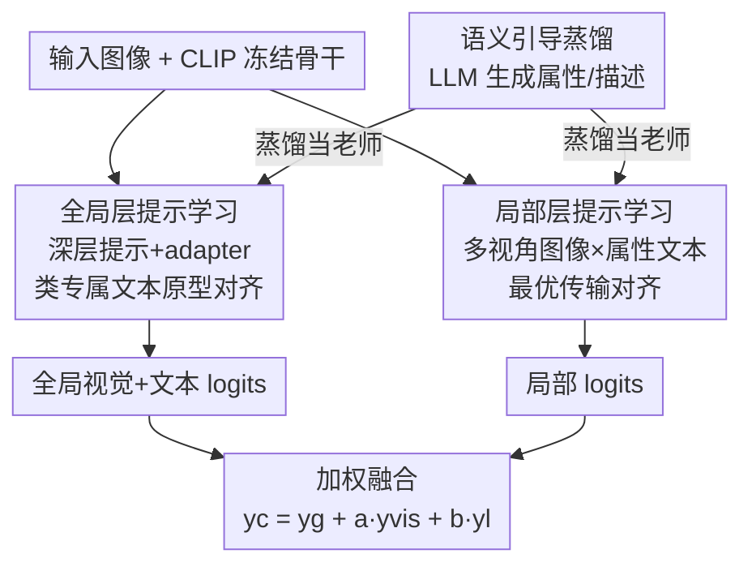

# Semantic-Guided Global-Local Collaborative Prompt Learning for Few-Shot Class Incremental Learning

**会议**: CVPR 2026  
**论文**: [CVF Open Access](https://openaccess.thecvf.com/content/CVPR2026/html/Yan_Semantic-Guided_Global-Local_Collaborative_Prompt_Learning_for_Few-Shot_Class_Incremental_Learning_CVPR_2026_paper.html)  
**代码**: 无  
**领域**: 小样本增量学习 / 提示学习 / 视觉语言模型  
**关键词**: FSCIL, 提示学习, CLIP, 最优传输, LLM 语义蒸馏

## 一句话总结
SGLC 把冻结的 CLIP 当骨干，用「全局视觉-文本原型对齐 + 局部属性-多视角最优传输对齐」双层提示学习适配 FSCIL，再让 LLM 生成的语义描述通过知识蒸馏给两层提示当老师，在 miniImageNet/CIFAR-100/CUB200 三个基准上全面超过此前 SOTA。

## 研究背景与动机
**领域现状**：小样本类增量学习（FSCIL）要求模型在 base session 用充足数据学好初始类后，后续每个 incremental session 只给极少样本（如 5-way 5-shot）就要把新类持续并入，同时不能忘掉旧类。早期主流做法是冻结浅层 backbone（ResNet-18）+ 部分微调，近年开始转向预训练 ViT / CLIP + 参数高效微调。

**现有痛点**：浅层 backbone 表征能力天花板低，对 base 类和新类都学不出有判别力的特征；而基于 CLIP 的提示学习方法（CoOp、MaPLe 等）虽然底子强，但它们只把可学习提示和图像做**单一对齐**——提示里往往只有类名（"a photo of a [class]"），没有把类内细粒度判别信息利用起来，少样本下极易过拟合，旧类提示又会在增量阶段被覆盖而遗忘。

**核心矛盾**：FSCIL 的根本张力是 stability（保住旧知识）与 plasticity（学好新知识）的两难。数据回放、元学习正则、动态结构等路线都只能部分缓解，没有从"表征对齐方式"上同时压住遗忘和过拟合。

**本文目标**：在不解冻 CLIP 主干的前提下，(1) 让对齐既有全局类级又有局部属性级，(2) 让新类提示可学、旧类原型冻结从而天然抗遗忘，(3) 给少样本提示引入外部语义监督防过拟合。

**切入角度**：人类认一个陌生类别靠的是判别性属性（颜色、形状），而不是光记住类名。作者据此把"类名对齐"升级成"属性对齐"，并用 LLM 把这些属性和描述自动产出。

**核心 idea**：用「全局原型对齐 + 局部属性最优传输对齐」的协同提示学习取代单一类名对齐，并用 LLM 语义描述蒸馏当辅助监督——既抗遗忘又抗过拟合。

## 方法详解

### 整体框架
SGLC 以冻结的 CLIP（ViT-B/16）为骨干，输入一张图像、输出它在已见所有类上的分类 logits。流程分三块协同：先由 **LLM 生成语义描述**（一组跨类通用判别属性 + 每个类的全局描述和属性描述）；再走 **全局层提示学习**（图像特征与"视觉原型 + 类专属文本原型"对齐）和 **局部层提示学习**（多视角图像特征与多个属性文本特征做最优传输对齐）两条并行支路；最后 **语义引导蒸馏**把 LLM 描述的特征当老师，约束全局/局部可学习文本提示。base session 里所有提示和 adapter 联合训练；增量阶段只更新当前新类的全局文本提示、局部视觉/文本提示，旧类原型全部冻结。推理时把全局视觉-文本 logits 和局部 logits 加权融合。

### 关键设计

**1. 全局层提示学习：深层提示+adapter 适配 + 类专属冻结原型抗遗忘**

针对"浅层骨干表征弱、单一类名对齐学不动"的痛点，作者在视觉和语言两个分支都插入可学习的**深层提示**（深度 $J=6$），并给视觉编码器加一个瓶颈式 **visual-adaptive adapter**：$f_{vo}=\sigma(f_v W_{down})W_{up}+f_v$，用残差方式校正视觉特征。为了不破坏 CLIP 原有知识，再用冻结的 zero-shot 视觉编码器做一致性约束 $L_{zs}=\lVert f^{zero}-f^{vo}\rVert_2^2$。

更关键的是文本侧不用 CoOp 那种全类共享的 class-agnostic 提示，而是**类专属提示** $P_{Tcls}=[T_{1cls}]\dots[T_{Mcls}][classname]$，每类一套。这样做有两个好处：类专属提示增强了类间判别性；更重要的是增量阶段**只训练当前类的提示、冻结旧类提示**，旧类文本原型永不改动，从机制上根除了灾难性遗忘。全局对齐用交叉熵 $L_{CE\text{-}G}=-\log\frac{\exp(\cos(f_{vo},t_i^T)/\tau)}{\sum_k \exp(\cos(f_{vo},t_k^T)/\tau)}$，同时还用 base 类特征均值构建视觉原型分类器 $\psi=[proto_1;\dots;proto_c]$ 给出 $y^{vis}$。

**2. 局部层提示学习：属性提示 + 多视角最优传输对齐抗过拟合**

针对"只对齐类名导致少样本过拟合到背景等无关因素"的痛点，作者把单模式对齐升级成局部多模式对齐。每个类构造多个**属性提示** $P_{att1}=[T_{s1}]\dots[T_{sM}][attribute1][classname]$、$P_{att2}=[\dots][attribute2][classname]$，属性（如颜色、形状）由 LLM 一次性挑出一组跨类通用的判别属性——比起对每个类聚类海量描述（如 [26]），这显著省算力和人工。图像侧则注入不同视觉提示得到多个视角特征 $\{f_v^n\}$。

由于不同属性常信息重叠（"白尾巴"同时含颜色和形状线索），简单地一对一余弦匹配会割裂语义，作者把图像特征集合和文本特征集合的距离重定义为**最优传输（OT）**问题：两模态各建经验分布 $P=\sum_n \frac1N \delta_{v_n}$、$Q=\sum_n \frac1N \delta_{t_n}$，用余弦距离构造代价矩阵 $C$，Sinkhorn 算法近似传输方案 $\tilde T$，得图像-类距离 $k=\sum_{m}\sum_{n}\tilde T_{mn}(1-C)_{mn}$，再走局部交叉熵 $L_{CE\text{-}L}=-\log\frac{\exp(k_i/\tau)}{\sum_j \exp(k_j/\tau)}$。OT 让模型聚焦类的内在语义而非背景，这是抗过拟合的核心。

**3. 语义引导蒸馏：LLM 描述当老师 + 视觉多样性损失防塌缩**

针对"少样本下文本原型仍会过拟合"，作者用 LLM 不仅生成整体类描述、还按属性生成针对性描述，然后把这些描述的特征蒸馏进可学习提示，而不是在推理时集成描述特征——这样既省存储（不必保留旧类描述）又过滤噪声，天然契合增量场景。蒸馏损失对全局和局部分别做 L2：$L_{Dist\text{-}G}=\frac1{C_n}\sum_i\lVert\tilde f_t^i-f_t^i\rVert_2^2$、$L_{Dist\text{-}L}=\frac1C(\sum_i\lVert\tilde f_{tl1}^i-f_{tl1}^i\rVert_2^2+\sum_i\lVert\tilde f_{tl2}^i-f_{tl2}^i\rVert_2^2)$，合为 $L_{Dist}=L_{Dist\text{-}G}+L_{Dist\text{-}L}$。

此外为防多视角局部图像特征塌缩、又不让它们偏离全局特征太远，引入视觉**多样性损失**：

$$L_{div}=\lVert f_{v1}-f_v\rVert_2^2+\lVert f_{v2}-f_v\rVert_2^2-\lVert f_{v1}-f_{v2}\rVert_2^2$$

前两项把局部视角拉近全局锚点、第三项把两个局部视角相互推开，从而在 OT 空间里维持视觉特征的异质性。

### 损失函数 / 训练策略
base session 总损失 $L_{base}=L_{CE}+\alpha L_{Dist}+\beta L_{div}+\gamma L_{zs}$，其中 $L_{CE}=L_{CE\text{-}G}+L_{CE\text{-}L}$；增量 session 去掉 zero-shot 一致性项：$L_{incre}=L_{CE}+\alpha L_{Dist}+\beta L_{div}$。CLIP-ViT/B-16 骨干，base 训 50 epoch（AdamW，lr 0.001），增量训 20 epoch（lr 0.0001），$\alpha=\gamma=500$、$\beta=50$，深层提示深度 6、全局提示长 2、局部提示长 8。

## 实验关键数据

### 主实验
三基准（miniImageNet/CIFAR-100 各 60 base+40 new，5-way 5-shot；CUB200 100+100，10-way 5-shot），报告 base session 精度 $A_{base}$、增量平均 $A_{navg}$、全程平均 $A_{avg}$。

| 数据集 | 指标 | SGLC | 之前最佳 | 提升 |
|--------|------|------|----------|------|
| miniImageNet | $A_{avg}$ | **95.12** | 93.62 (IVFL) | +1.50 |
| CUB200 | $A_{avg}$ | **80.18** | 79.12 (Approxima) | +1.06 |
| CIFAR100 | $A_{avg}$ | **84.57** | 81.38 (Approxima) | +3.19 |
| miniImageNet | $A_{navg}$ | **94.82** | 93.36 (BiMC) | +1.46 |
| CUB200 | $A_{base}$ | **87.05** | 86.46 (Approxima) | +0.59 |

论文指出此前 SOTA 往往只在单一数据集上强：重微调的 Approxima 在 CUB200/CIFAR100 好但 miniImageNet 偏弱；轻微调的 BiMC/IVFL 反之。SGLC 在每个数据集的每个 session 都拿最高精度，说明 stability 与 plasticity 兼顾。

### 消融实验
CUB200 上逐步叠加三大模块（Table 2，取 $A_{navg}$/$A_{avg}$）：

| 配置 | $A_{navg}$ | $A_{avg}$ | 说明 |
|------|-----------|-----------|------|
| baseline | 57.34 | 58.09 | 仅基线 |
| + Global-Level | 77.30 | 78.04 | 全局原型对齐，大幅起飞 |
| + Local-Level | 78.35 | 79.08 | 加局部 OT 对齐 +1.04 |
| + Semantic（Full） | **79.49** | **80.18** | 加语义蒸馏 +1.10 |

组件级消融（Table 3，CUB200，$A_{avg}$）：CLIP 58.09 → CoOp 69.47 → +deep-layer prompts 71.22 → +visual feature correction 70.72 → Full 72.53，说明深层提示和 adapter 视觉校正各有贡献。

### 关键发现
- 全局层是性能基石：从 baseline 到加全局对齐 $A_{avg}$ 直接 58→78，局部与语义各再叠约 1 个点，三者协同到 80.18。
- OT 对齐显著优于一对一余弦匹配（Figure 6），印证属性信息重叠时需要软分配。
- 属性数量并非越多越好：(color, shape) 的 $A_{avg}$=80.18 反而高于加 pattern/size 的 79.63/79.01，过多属性引入噪声。
- 类专属提示+冻结旧类提示比类无关提示更抗遗忘（Figure 4）。
- 参数极省：可训练参数仅 0.71M（占比 0.47%），远低于 Approxima 的 86.68M（100%）和 IVFL 的 5.84M（3.98%）。

## 亮点与洞察
- 把"局部属性-多视角图像对齐"建模为**最优传输**，巧妙化解了不同属性语义重叠、无法硬性一对一匹配的问题——这个建模思路可迁移到任何"多 part 文本 × 多 view 图像"的细粒度对齐任务。
- "冻结旧类文本原型、只学新类提示"用极简机制把抗遗忘做成结构性保证，而不是靠回放或正则硬压，是全文最干净的设计。
- 让 LLM 一次性产出**跨类通用属性**而非逐类聚类描述，既给提示注入语义先验又把算力/人工成本压到很低，且通过蒸馏避免推理期存储旧类描述，非常契合增量场景。
- 0.47% 可训练参数拿到全面 SOTA，说明 FSCIL 的瓶颈更多在"对齐方式"而非"调多少参数"。

## 局限与展望
- 三大模块、四项损失、$\alpha/\beta/\gamma$ 权重相差一个数量级（500/50/500），超参较多，迁移到新数据集可能需要重新调权重。
- 方法强依赖 LLM 生成的属性/描述质量，论文未充分讨论 LLM 幻觉或属性选错时的鲁棒性；属性集对所有类共享，对属性差异极大的开放域可能不够。
- 评测仍局限于 miniImageNet/CIFAR100/CUB200 三个经典小基准，缺少更大规模或更长 session 序列的压力测试。
- 多视角局部提示数固定为 2，视角数与 OT 求解成本的权衡未深入展开。

## 相关工作与启发
- **vs CoOp / MaPLe（提示学习）**：它们用类无关共享提示只对齐类名，FSCIL 下遗忘+过拟合都压不住；SGLC 用类专属提示+属性级局部对齐+冻结旧类原型，结构性地解决两难。
- **vs Approxima（重微调预训练 ViT）**：Approxima 在 CUB200/CIFAR100 强但 miniImageNet 弱、且 100% 参数可训；SGLC 仅 0.47% 参数三库全 SOTA，泛化更稳。
- **vs IVFL / BiMC（轻微调 + 回放）**：它们偏 plasticity、跨库不稳；SGLC 不靠回放、靠冻结原型与语义蒸馏同时守住 stability 与 plasticity。
- **vs 逐类聚类描述方法 [26]**：用 LLM 选一组通用判别属性替代逐类聚类海量描述，显著降算力与人工。

## 评分
- 新颖性: ⭐⭐⭐⭐ 全局-局部双层对齐 + 属性 OT + LLM 语义蒸馏的组合在 FSCIL 上是有新意的范式整合，单点技术多为已知模块拼装。
- 实验充分度: ⭐⭐⭐⭐ 三基准全面 SOTA，消融/超参/对齐策略/参数量分析齐全，但基准规模偏小、缺更长序列压测。
- 写作质量: ⭐⭐⭐⭐ 动机链清晰、公式完整、图表到位，符号略多但可读。
- 价值: ⭐⭐⭐⭐ 0.47% 参数拿全面 SOTA，对参数高效 FSCIL 有实用与方法论双重价值。

<!-- RELATED:START -->

## 相关论文

- [\[CVPR 2026\] Dual-Estimator: Decoupling Global and Local Semantic Shift for Drift Compensation in Class-Incremental Learning](dual-estimator_decoupling_global_and_local_semantic_shift_for_drift_compensation.md)
- [\[CVPR 2026\] Quantized Residuals to Continuous Prompts for Few-Shot Class Incremental Learning in Vision-Language Models](quantized_residuals_to_continuous_prompts_for_few-shot_class_incremental_learning.md)
- [\[CVPR 2026\] DGS: Dual Gradient and Semantic-Shift Guided Low-Rank Adaptation for Class Incremental Learning](dgs_dual_gradient_and_semantic-shift_guided_low-rank_adaptation_for_class_increm.md)
- [\[CVPR 2026\] HyCal: A Training-Free Prototype Calibration Method for Cross-Discipline Few-Shot Class-Incremental Learning](hycal_training_free_prototype_calibration_for_cross_discipline_fscil.md)
- [\[CVPR 2025\] SEC-Prompt: SEmantic Complementary Prompting for Few-Shot Class-Incremental Learning](../../CVPR2025/self_supervised/sec-promptsemantic_complementary_prompting_for_few-shot_class-incremental_learni.md)

<!-- RELATED:END -->
