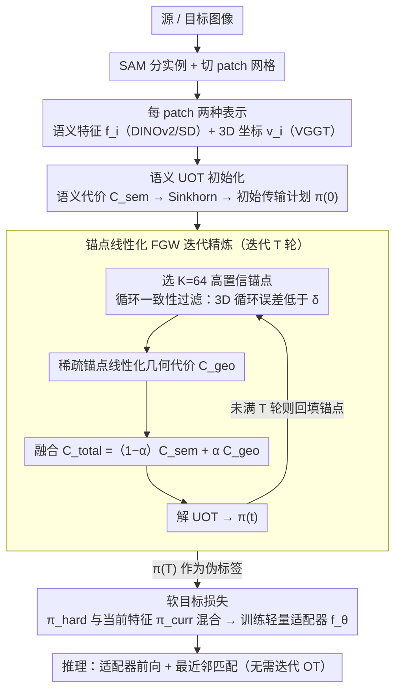

<!-- 由 src/gen_stubs.py 自动生成 -->
# Shape-of-You: Fused Gromov-Wasserstein Optimal Transport for Semantic Correspondence in-the-Wild

**会议**: CVPR2026  
**arXiv**: [2603.11618](https://arxiv.org/abs/2603.11618)  
**代码**: [Shape-of-You](https://github.com/im-jiin/Shape-of-You)  
**领域**: 自监督  
**关键词**: 语义对应, 最优传输, Gromov-Wasserstein, 3D几何约束, 伪标签, 基础模型

## 一句话总结

将语义对应问题重新建模为 Fused Gromov-Wasserstein (FGW) 最优传输问题，利用 3D 基础模型提供的几何结构约束来生成全局一致的伪标签，解决了传统最近邻匹配因局部性和 2D 外观歧义导致的几何不一致问题。

## 研究背景与动机

**语义对应的核心挑战**：在 in-the-wild 场景中，极端视角变化、光照差异和类内形状差异使得建立像素级语义对应极为困难，而全监督方法依赖昂贵的逐像素标注，可扩展性差。

**伪标签方法的固有缺陷**：当前无显式几何标注的方法（如 ASIC）依赖 DINO/SD 等基础模型的特征进行最近邻 (NN) 匹配生成伪标签，但 NN 匹配是局部操作，忽略了全局结构关系。

**2D 特征的几何歧义**：纯粹基于 2D 外观训练的模型无法反映物体真实的 3D 几何结构，导致语义上合理但几何上错误的对应（如对称部件、重复纹理区域的误匹配）。

**局部匹配无法保持结构一致性**：NN 匹配逐点独立决策，不保证匹配集合在全局上的几何连贯性，引入的训练噪声会降低模型性能。

**GW 计算瓶颈**：Gromov-Wasserstein 是二次规划的非凸问题，直接求解在计算上不可行，需要高效的近似方案。

**部分可见性与遮挡**：真实场景中物体常被遮挡或截断，平衡最优传输的硬边际约束（所有质量必须传输）不适用于这种部分匹配情况。

## 方法详解

### 整体框架

Shape-of-You (SoY) 要解决 in-the-wild 语义对应里"伪标签几何不一致"的老毛病。它走两阶段：第一阶段用 Fused Gromov-Wasserstein (FGW) 最优传输融合语义特征相似性和 3D 几何结构一致性，生成全局一致的高质量伪标签；第二阶段用软目标损失训练一个轻量适配器，推理时只需前向传播加最近邻匹配、无需再迭代求解 OT。输入侧，给定源/目标图像先用 SAM 分出实例区域并切成 patch 网格，每个 patch 取两种表示——DINOv2/SD 的语义特征 $\mathbf{f}_i \in \mathbb{R}^d$ 和 VGGT（3D 基础模型）提升出的 3D 坐标 $\mathbf{v}_i \in \mathbb{R}^3$。

### 关键设计

**1. 语义 UOT 初始化：用非平衡传输应对遮挡与非重叠**

真实场景里物体常被遮挡或截断，经典 OT 的硬边际约束（所有质量都得传走）在这种部分匹配下并不成立。第一阶段（t=0）先算语义代价矩阵 $C^{\text{sem}}_{ij} = 1 - \cos(\mathbf{f}_i^A, \mathbf{f}_j^B)$，再用非平衡最优传输（UOT）替代经典 OT——通过 KL 散度惩罚放松边际约束，允许部分质量不被传输，从而自然容纳遮挡和非重叠区域，用 Sinkhorn 求解得到初始传输计划 $\pi^{(0)}$。

**2. 锚点线性化的 FGW 迭代精炼：把 NP-hard 的二次 GW 近似成可解的线性 OT**

纯语义匹配会犯"语义合理但几何错误"的毛病（对称部件、重复纹理误匹配），而引入 Gromov-Wasserstein 的结构比较又是个非凸二次问题、直接解不可行。第二阶段（t>0）的做法是：先从上一轮 $\pi^{(t-1)}$ 选 K=64 个高置信度锚点对，且要求满足循环一致性（前向→反向的 3D 循环误差低于阈值 $\delta$）；再用稀疏锚点传输计划 $\hat{\pi}$ 替掉二次项里的一个 $\pi$，把 $O(N^2M^2)$ 的二次问题线性化成 $O(NMK)$ 的几何代价 $C^{\text{geo}}_{ij} = \frac{1}{K}\sum_{(a_A,a_B)\in\mathcal{A}} |D^A_{i,a_A} - D^B_{j,a_B}|$；归一化后按 $C^{\text{total}} = (1-\alpha)\tilde{C}^{\text{sem}} + \alpha\tilde{C}^{\text{geo}}$（$\alpha=0.3$）融合，再解 UOT 得 $\pi^{(t)}$。迭代 T 轮，锚点逐步变准，最终 $\pi^{(T)}$ 作为伪标签——全局结构约束就是这样被一点点注入的。

**3. 软目标损失：别把"语义相似但没被选中"的候选一棍子打死**

从 $\pi^{(T)}$ 直接取硬标签会过度惩罚那些语义上也合理、只是没进 top-k 的候选。本文从 $\pi^{(T)}$ 取 top-k 候选构成多热二值目标 $\pi^{\text{hard}}$，再用网络当前特征算 OT 得到语义软目标 $\pi^{\text{curr}}$（停止梯度），两者混合成 $\pi^{\text{soft}} = (1-\beta)\pi^{\text{hard}} + \beta\pi^{\text{curr}}$（$\beta=0.5$），让监督信号既锚定全局一致的伪标签、又保留对相似候选的宽容度。

### 损失函数

$$\mathcal{L}_{\text{total}} = \mathcal{L}_{\text{soft}} + \mathcal{L}_{\text{dense}}$$

- $\mathcal{L}_{\text{soft}}$：对称交叉熵损失，在预测相似度分布与 $\pi^{\text{soft}}$ 之间计算，含可学习温度参数 $\tau$
- $\mathcal{L}_{\text{dense}}$：标准密集对应损失，通过 soft-argmax 将梯度传播到所有特征图位置，加高斯噪声 $\epsilon$ 正则化

## 实验

### 主实验结果

| 方法 | SPair-71k PCK@0.1 | SPair-71k PCK@0.05 | AP-10k I.S. | AP-10k C.S. |
|------|-------------------|---------------------|-------------|-------------|
| ASIC | 36.9 | - | - | - |
| DINOv2 | 55.7 | - | - | - |
| DistillDIFT | 59.8 | 42.7 | 65.5 | 62.8 |
| DINOv2 + SD | 63.5 | 48.3 | 65.5 | 63.3 |
| **SoY (Ours)** | **67.9** | **50.8** | **68.0** | **65.8** |

在 SPair-71k 上以 67.9% PCK@0.1 超越零样本基线 DINOv2+SD 4.4 个百分点，18 个类别中 17 个达到最优或次优。AP-10k 零样本评估中三种设置均取得最优。

### 消融实验

| 伪标签策略 | Geometry-aware PCK_label@0.1 |
|-----------|----------------------------|
| Nearest Neighbor | 53.8% |
| Semantic OT | 54.5% |
| Fused OT (balanced) | 55.7% |
| **Fused UOT (ours)** | **56.1%** |

| 组件消融 | PCK@0.1 |
|---------|---------|
| Backbone (DINOv2+SD) 零样本 | 63.5 |
| Adapter + NN 标签 | 64.6 |
| Adapter + FGW 标签 | 66.8 |
| + relaxed c.c. + soft target loss | **67.9** |

### 关键发现

- **3D 几何距离是关键**：在 intra-structure 对比实验中，2D 距离 (65.7%) 和语义距离 (66.2%) 均不如 3D 几何距离 (67.6%)，2D 距离反而低于不用 GW 的基线 (66.5%)
- **几何约束对歧义场景尤为重要**：GW 项在 Geometry-aware 子集上提升 +2.3%p，而整体提升相对较小，证明 3D 约束主要解决几何歧义
- **各组件协同增效**：FGW 伪标签 (+2.0%p) > 循环一致性 (+0.2%p)，说明全局结构匹配远比局部后处理有效；软目标损失在 FGW 标签基础上进一步提升

## 亮点

- **问题建模新颖**：首次将语义对应建模为 FGW 最优传输问题，天然融合了跨域语义相似性（Wasserstein）和域内几何一致性（Gromov-Wasserstein）
- **锚点线性化高效实用**：通过 64 个锚点将 NP-hard 的二次 GW 问题近似为可用 Sinkhorn 求解的线性 OT，工程上可行
- **3D 基础模型的巧妙引入**：用 VGGT 将 2D 图像提升到 3D，为 GW 项提供有意义的几何度量，而非直接在 2D 坐标上计算距离
- **推理高效**：训练完成后推理仅需轻量适配器前向传播 + 最近邻匹配，无需迭代 OT 求解

## 局限性

- **依赖 3D 基础模型质量**：VGGT 在透明表面或平坦重建失败时会导致错误锚点
- **对称部件仍有困难**：如中等视角下对称汽车部件，可能导致锚点匹配错误
- **软目标可能过度平滑**：$\beta=0.5$ 的混合比例在某些情况下可能模糊几何信号
- **SAM 分割依赖**：伪标签生成依赖 SAM 的实例分割质量，分割不准会影响下游匹配

## 相关工作

- **无几何标注的语义对应**：ASIC（NN 伪标签）、SHIC（图像到形状）、DistillDIFT（特征蒸馏）——均依赖局部匹配或 2D 蒸馏，缺乏全局结构感知
- **最优传输用于结构匹配**：经典 Wasserstein OT 用于对应学习，GECO 引入非平衡 OT 进行几何一致特征学习——但未结合 Gromov-Wasserstein 的结构比较能力
- **3D 几何基础模型**：DUSt3R、MASt3R 需要多阶段，VGGT 单次前向预测多种 3D 属性——本文利用 VGGT 为 GW 提供几何先验
- **GW 近似方法**：图匹配、视频动作分割等领域的 GW 近似——本文的锚点线性化与 anchor-based GW surrogate 思路一致

## 评分

- 新颖性: ⭐⭐⭐⭐ (FGW 建模 + 3D 基础模型几何先验的组合是首创)
- 实验充分度: ⭐⭐⭐⭐ (两个数据集 + 详尽消融 + PCK_label 指标验证伪标签质量)
- 写作质量: ⭐⭐⭐⭐ (OT 背景清楚, 方法推导完整, 图表信息量大)
- 价值: ⭐⭐⭐⭐ (为无标注语义对应提供了新范式, 3D+OT 的思路可迁移到其他视觉匹配任务)

<!-- RELATED:START -->

## 相关论文

- [\[CVPR 2026\] An Optimal Transport-driven Approach for Cultivating Latent Space in Online Incremental Learning](an_optimal_transport_driven_approach_for_cultivating_latent_space_in_online_incr.md)
- [\[ICCV 2025\] MoSiC: Optimal-Transport Motion Trajectory for Dense Self-Supervised Learning](../../ICCV2025/self_supervised/mosic_optimal-transport_motion_trajectory_for_dense_self-supervised_learning.md)
- [\[CVPR 2026\] Can You Learn to See Without Images? Procedural Warm-Up for Vision Transformers](can_you_learn_to_see_without_images_procedural_warm-up_for_vision_transformers.md)
- [\[CVPR 2026\] SECOS: Semantic Capture for Rigorous Classification in Open-World Semi-Supervised Learning](secos_semantic_capture_for_rigorous_classification_in_open-world_semi-supervised.md)
- [\[ICML 2026\] PartCo: Part-Level Correspondence Priors Enhance Category Discovery](../../ICML2026/self_supervised/partco_part-level_correspondence_priors_enhance_category_discovery.md)

<!-- RELATED:END -->
