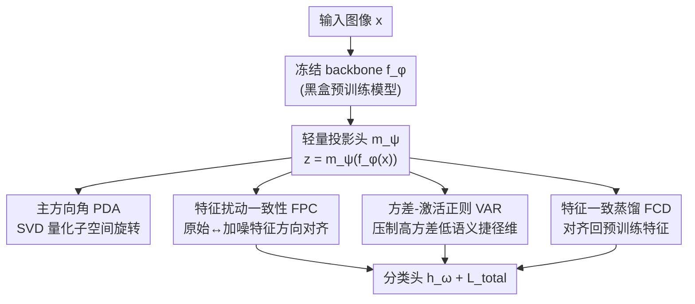

# Stabilizing Feature Geometry in Noisy Pretrained Models for Robust Downstream Tasks

**会议**: CVPR 2026  
**论文**: [CVF Open Access](https://openaccess.thecvf.com/content/CVPR2026/html/Zhang_Stabilizing_Feature_Geometry_in_Noisy_Pretrained_Models_for_Robust_Downstream_CVPR_2026_paper.html)  
**代码**: 无  
**领域**: 表示学习 / 预训练鲁棒性  
**关键词**: 灾难性继承、特征几何、主方向旋转、噪声预训练、黑盒微调

## 一句话总结
作者发现预训练噪声不仅会削弱特征谱能量、更会让主特征子空间发生「旋转」，提出用主方向角 PDA 量化这种旋转，并设计一个只在 backbone 后插轻量投影头、用扰动一致性 + 方差-激活正则 + 特征一致蒸馏三件套（FGS 框架）来稳住特征几何，在多个视觉 benchmark 上比之前的谱方法平均高至少 +1.53%。

## 研究背景与动机
**领域现状**：预训练-再微调（PT-FT）是当下视觉大模型的主流范式——先在 ImageNet-21K / LAION-5B / JFT-300M 这类海量数据上学到可迁移表示，再用少量监督适配下游。但这些大规模数据靠网络爬取+自动标注，不可避免地混入低质图像、错标/歧义标签、社会偏见等噪声。

**现有痛点**：噪声会被模型「吸收」并随特征一路带到下游，导致下游性能随噪声比例上升而崩塌，这种现象叫**灾难性继承（catastrophic inheritance）**——它不只出现在视觉模型上，OpenCLIP / BERT / GPT 都有。已有的少数研究（NMTune、LoRA 类适配）都从**谱（spectrum）视角**解释：噪声压低了奇异值谱里主成分的能量（spectral energy degradation, SED），于是它们想办法放大领头奇异值来「补回」表示强度。

**核心矛盾**：这些谱方法隐含了一个其实不成立的假设——**特征的主方向在噪声预训练下保持不变，只是能量变弱**。作者重新检验这个假设，发现一个被忽略的效应：**即使谱能量几乎没掉，轻度预训练噪声也会让主特征子空间发生明显旋转**。一旦主方向被背景等低语义信息占据，再去盲目放大领头奇异值反而会强化噪声模式。

**本文目标**：(1) 找到一个能定量刻画「主方向旋转」的几何指标；(2) 在拿不到干净参考模型、且 backbone 往往是黑盒不可回传梯度的现实约束下，把扭曲的特征几何「掰正」回来。

**切入角度**：用 SVD 看 clean 模型和 noisy 模型主子空间之间的**夹角**——作者实测发现这个角度随噪声比例单调上升，且与下游精度强负相关（Grad-CAM 也显示噪声模型把注意力从「狗」漂移到「铅笔」等背景），说明旋转是真因之一，而非单纯能量衰减。

**核心 idea**：用主方向角 PDA 诊断旋转，再用「不依赖干净模型、不动 backbone」的几何稳定化三件套去抑制旋转、稳住特征几何。

## 方法详解

### 整体框架
FGS（Feature Geometry Stabilization）的出发点是：既然干净模型不可得、backbone 又常是黑盒，那就**不碰 backbone**，只在冻结的预训练骨干 $f_\phi$ 与任务分类头 $h_\omega$ 之间插一个**轻量可学习投影模块** $m_\psi$，把继承下来的特征 $z = m_\psi(f_\phi(x))$ 重新塑形。投影头训练时不需要 backbone 的梯度，天然适配黑盒/受限架构。

围绕这个投影头叠三个互补的正则项，分别管住特征几何的三件事：**FPC** 让特征方向在扰动下保持局部稳定（直接对抗「旋转」）、**VAR** 压制高方差/高激活但低语义的「捷径维度」（防止噪声沿这些不稳定轴占据主方向，给 FPC 兜底）、**FCD** 把投影后的特征蒸馏回预训练特征（防止前两项把表示「掰过头」丢掉预训练语义）。三者协同，最终目标 = 交叉熵 + 三个正则项加权。

### 关键设计

**1. 主方向角 PDA：把「特征旋转」做成一个可量化的几何指标**

谱视角只看奇异值大小，看不到方向变化，所以「旋转」一直被忽略。PDA 直接量化 clean 模型 $P_0$ 与 noisy 模型 $P_\gamma$ 主子空间之间的夹角。设模型 $P_\gamma$ 对 $M$ 个样本提取的特征矩阵为 $F_\gamma \in \mathbb{R}^{M\times D}$，做 SVD：$F_\gamma = U_\gamma \Sigma_\gamma V_\gamma^\top$，取前 $k$ 个左奇异向量张成主子空间 $\mathcal{U}_\gamma = \text{span}(u_{\gamma,1},\dots,u_{\gamma,k})$。PDA 取两个子空间各主方向的平均主夹角：

$$\bar\theta_\gamma = \frac{1}{k}\sum_{i=1}^{k}\theta_i$$

其中 $\theta_i$ 是第 $i$ 个主方向上的主夹角，clean 模型自比为 $\bar\theta_0 = 0$。$\bar\theta_\gamma$ 越大说明主方向被噪声旋转得越狠。实测它随噪声比例（5%→30%）单调上升、且与下游精度强负相关，而同时谱能量几乎不变——这正是「能量没掉、方向却转了」的直接证据，为后面的稳定化提供了诊断依据。

**2. 特征扰动一致性 FPC：没有干净模型，就用「自扰动」逼出方向稳定性**

直接把 noisy 特征对齐到 clean 模型不可行（拿不到 clean 参考）。FPC 改成自给自足：给输入特征 $f = f_\phi(x)$ 注入受控噪声得到 $f^{noisy} = f + \epsilon$（$\epsilon$ 采自如椒盐噪声的预设分布），两路都过 $m_\psi$ 和 $h_\omega$ 得到 $z, z^{noisy}, h, h^{noisy}$，然后用余弦相似度强制原始与扰动版本在特征与预测上方向一致：

$$\mathcal{L}_{\mathrm{FPC}} = \frac{1}{B}\sum_{i=1}^{B}\big(1-\cos(\theta_{z,i}) + 1-\cos(\theta_{h,i})\big)$$

这个基于夹角的约束抑制噪声引起的方向漂移、把表示锚定在更稳定的子空间上——本质是在没有干净参考的前提下，用「对扰动不敏感」这一代理目标去对抗 PDA 揭示的旋转。消融里它是贡献最大的模块（高噪声下尤其明显）。

**3. 方差-激活正则 VAR：掐掉噪声最爱栖身的「捷径维度」**

模型倾向于依赖高方差/大激活的「捷径特征」（常是背景这类数据集相关的伪相关），噪声一旦对齐到这些不稳定方向，就会显著扭曲主方向。VAR 对每个特征维 $j$ 惩罚「方差 × 激活能量」的乘积：

$$\mathcal{L}_{\mathrm{VAR}} = \sum_{j=1}^{d}\Big(\frac{1}{B}\sum_{i=1}^{B}(z_{ij}-\mu_j)^2\Big)\Big(\frac{1}{B}\sum_{i=1}^{B}z_{ij}^2\Big)$$

其中 $\mu_j$ 是第 $j$ 维的 batch 均值。这样既高方差又高激活的维度被重点压制，防止它们主导谱结构、防止噪声沿这些轴占据主方向，是对 FPC 的兜底——FPC 管「方向别漂」，VAR 管「别让坏方向先变强」。

**4. 特征一致蒸馏 FCD：别为了掰正几何把预训练语义掰丢了**

FPC 和 VAR 都是「约束」，约束太狠会侵蚀预训练学到的语义。FCD 把投影特征 $z$ 蒸馏回预训练特征 $f$，用温度 $T$ 软化后最小化 KL 散度：

$$\mathcal{L}_{\mathrm{FCD}} = \frac{1}{B}\sum_{i=1}^{B}\mathrm{KL}\!\left(\mathrm{softmax}\!\left(\tfrac{f_i}{T}\right)\,\Big\|\,\mathrm{softmax}\!\left(\tfrac{z_i}{T}\right)\right)$$

它保留可迁移的预训练语义结构，只允许做局部子空间微调，防止表示在几何矫正中退化。三者协同，总目标为：

$$\mathcal{L}_{\mathrm{total}} = \mathcal{L}_{\mathrm{CE}} + \lambda_1\mathcal{L}_{\mathrm{FPC}} + \lambda_2\mathcal{L}_{\mathrm{VAR}} + \lambda_3\mathcal{L}_{\mathrm{FCD}}$$

其中 $\mathcal{L}_{\mathrm{CE}}$ 是标准交叉熵，$\lambda_1,\lambda_2,\lambda_3$ 平衡各项。

## 实验关键数据

设置：5 个真实噪声预训练大模型（ImageNet-21K 监督的 ResNetv2-152x2 / Swin-L、JFT-300M 半监督的 EfficientNet-B3、LAION-2B 对比的 ViT-L / ConvNext-L）+ 合成噪声的 ResNet-50（ImageNet-1K / YFCC15M，噪声 $\gamma\in\{0,5,10,20,30\}\%$）。8 个 in-domain（ID）数据集 + 4 个 DomainNet out-of-domain（OOD）域。基线：LP（线性探测）、MLP、NMTune（谱正则 SOTA）。

### 主实验（真实噪声大模型，平均精度）

| 模型 / 任务 | LP | MLP | NMTune (SOTA) | FGS (本文) |
|------|------|------|------|------|
| ResNetv2-152x2 · OOD | 0.4871 | 0.5126 | 0.5052 | **0.5408** |
| ResNetv2-152x2 · ID | 0.8461 | 0.8523 | 0.8511 | **0.8665** |
| Swin-L · OOD | 0.5733 | 0.5971 | 0.6215 | **0.6368** |
| Swin-L · ID | 0.8718 | 0.8876 | 0.8982 | **0.9074** |
| ViT-L · OOD | 0.7154 | 0.7359 | 0.7403 | **0.7662** |
| ConvNext-L · OOD | 0.7070 | 0.7320 | 0.7528 | **0.7668** |

OOD 上对 MLP / NMTune 的提升：ResNetv2-152x2 +2.82% / +3.56%，ViT-L +3.03% / +2.59%，Swin-L +3.97% / +1.53%。无论骨干已经多鲁棒（如 Swin-L），稳住特征几何都还能再涨。

### 消融实验（OOD，逐模块加入，DomainNetSketch 训练）

| 配置 | 关键现象 | 说明 |
|------|---------|------|
| MLP（基线） | 最低 | 无任何几何正则 |
| + 仅 FCD | 优于 MLP | 蒸馏单用收益有限 |
| + 仅 VAR | 优于 MLP | 压捷径维有效 |
| + 仅 FPC | 三者中单模块最强 | IN-1K 30% 噪声下比 VAR/FCD 高 1.29% / 0.88% |
| Full（FPC+VAR+FCD） | 全噪声档最高 | 三模块互补、协同增益 |

### 关键发现
- **FPC 贡献最大**：每个模块单独都超 MLP，但 FPC 在高噪声下增益最猛（YFCC15M 30% 噪声下比 VAR/FCD 高 0.62% / 0.56%），印证「对抗方向旋转」是核心矛盾，谱能量类约束只是辅助。
- **双噪声鲁棒**：预训练+下游都加噪时（CIFAR-100 下游噪声升到 50%），30% 预训练噪声下 FGS 的平均掉点比 NMTune **小 12–23%**，说明它能缓解噪声的叠加效应。
- **噪声注入类型有讲究**：FPC 用的扰动里，椒盐噪声最好，高斯/泊松也都涨；唯独「生成器合成噪声」反而掉点——⚠️ 作者解释为随机噪声结构无关、像正则化防过拟合，而生成噪声可能编码了训练数据里的有害偏置（以原文为准）。
- **t-SNE 可视化**：FGS 在 $\gamma=20\%$ 下明显提升类内紧致、类间可分。

## 亮点与洞察
- **把「被忽略的方向旋转」量化成 PDA**：这是全文的「啊哈」点——之前所有谱方法默认主方向不变，PDA 用 SVD 主夹角直接证伪了这个假设，且实测 PDA 与精度强负相关，把一个定性直觉变成可测指标。这种「先做一个诊断指标再据此设计方法」的范式很值得迁移到其他「继承类」问题。
- **黑盒友好**：冻结 backbone、只学投影头、不需要 backbone 梯度，对 LAION/JFT 这类闭源大模型特别实用——很多稳健化方法卡在「拿不到干净模型 / 动不了骨干」，这里两个约束都绕开了。
- **三件套的分工很清楚**：FPC 锚方向、VAR 掐坏轴、FCD 防丢语义，三者不是堆模块而是「主攻+兜底+护栏」的闭环，可拆解复用。
- **自扰动代理目标**：在没有干净参考时，用「对自身扰动一致」当代理来逼出方向稳定，是规避「需要 clean 模型」这一现实障碍的巧思。

## 局限与展望
- PDA 的诊断价值依赖能拿到 clean 模型来算夹角（实验里靠人工注入噪声构造 $P_0/P_\gamma$），但真实闭源预训练模型根本没有 clean 对照，所以 PDA 更多是「分析工具」而非「在线监控指标」，方法本身也确实绕开了它、不直接优化 PDA。
- 几何稳定化只在投影头层面做，backbone 内部继承的扭曲并未真正修复，受限于黑盒设定，上限可能被骨干本身锁住。
- ⚠️ 提升幅度多在 +1.5%~+4%（OOD），属于稳健但非颠覆性的增益；生成噪声反而掉点也提示扰动设计敏感，缺乏理论刻画「哪种扰动分布最优」。
- 可改进：把 PDA 直接做成可微正则项在线约束子空间旋转，或探索无需 clean 参考也能估计旋转方向的方法。

## 相关工作与启发
- **vs NMTune（谱正则 SOTA）**：NMTune 只放大领头奇异值补能量、默认主方向不变；本文指出方向会旋转，主方向被噪声占据时放大奇异值反而强化噪声。FGS 直接稳方向，在 OOD 上普遍超 NMTune 1.5%~3.5%。
- **vs 谱能量视角的灾难性继承研究**：之前把灾难性继承归因于谱能量压缩（SED）；本文论证 SED 与方向不稳定**共同**驱动继承，补上了被忽略的几何维度。
- **vs 下游去噪/微调鲁棒方法（如 TURN 两阶段、标签纠正/加权）**：那类只管微调阶段的噪声，无视来自预训练表示的扭曲；FGS 针对的是「继承自预训练」的方向扭曲，互补而非竞争。

## 评分
- 新颖性: ⭐⭐⭐⭐⭐ 用 PDA 揭示并量化被忽略的「主方向旋转」，把灾难性继承从谱视角推进到几何视角，视角切换扎实。
- 实验充分度: ⭐⭐⭐⭐ 5 个真实大模型 + 合成噪声 + 双噪声 + 噪声类型 + t-SNE，覆盖广；缺对 $\lambda$ 等超参与投影头容量的系统敏感性分析。
- 写作质量: ⭐⭐⭐⭐ 「先诊断后处方」叙事清晰，三模块分工明确；公式排版（缓存里）有断裂但逻辑可复原。
- 价值: ⭐⭐⭐⭐ 黑盒、不动 backbone、即插投影头，对用闭源预训练模型的实务者很实用，PDA 这一诊断范式也可迁移。

<!-- RELATED:START -->

## 相关论文

- [\[CVPR 2026\] From Feature Learning to Spectral Basis Learning: A Unifying and Flexible Framework for Efficient and Robust Shape Matching](from_feature_learning_to_spectral_basis_learning_a_unifying_and_flexible_framewo.md)
- [\[AAAI 2026\] Robust Tabular Foundation Models](../../AAAI2026/self_supervised/robust_tabular_foundation_models.md)
- [\[CVPR 2026\] OpenVision 2: A Family of Generative Pretrained Visual Encoders for Multimodal Learning](openvision_2_a_family_of_generative_pretrained_visual_encoders_for_multimodal_le.md)
- [\[CVPR 2026\] Reframing Long-Tailed Learning via Loss Landscape Geometry](reframing_long-tailed_learning_via_loss_landscape_geometry.md)
- [\[CVPR 2026\] Geometry-driven OOD Detectors Are Class-Incremental Learners](geometry-driven_ood_detectors_are_class-incremental_learners.md)

<!-- RELATED:END -->
