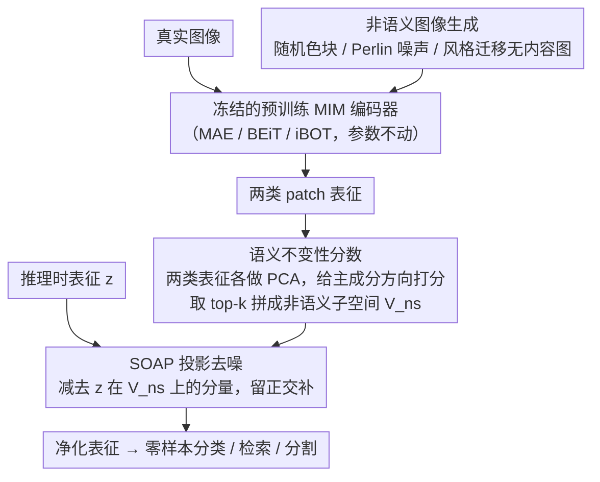

# Suppressing Non-Semantic Noise in Masked Image Modeling Representations

**会议**: CVPR 2026  
**arXiv**: [2604.00172](https://arxiv.org/abs/2604.00172)  
**代码**: 无  
**领域**: 自监督学习  
**关键词**: 掩码图像建模, 非语义噪声, 主成分分析, 表征净化, 零样本分类

## 一句话总结

本文揭示了掩码图像建模（MIM）学到的表征中保留了大量非语义信息（如纹理、颜色等底层特征），并提出了一种无需训练的后处理方法 SOAP（Semantically Orthogonal Artifact Projection），通过 PCA 识别并投影去除非语义成分，在多种 MIM 模型上一致提升零样本性能。

## 研究背景与动机

**领域现状**：掩码图像建模（Masked Image Modeling, MIM）已成为自监督视觉表征学习的主流范式。以 MAE、BEiT、iBOT 等为代表的方法通过遮盖输入图像的部分 patch 并要求模型重建，学到的 ViT 表征在下游任务（分类、检测、分割等）上取得了优异的性能。

**现有痛点**：尽管 MIM 方法在微调后表现出色，但其学到的表征在零样本（zero-shot）或线性探测（linear probing）等直接使用场景下，性能却明显弱于对比学习（如 DINO、CLIP）等方法。这暗示 MIM 的表征中混杂了对下游语义任务无用甚至有害的信息。

**核心矛盾**：MIM 的训练目标是像素级或 token 级重建，这一目标本质上迫使模型编码大量底层视觉信息（纹理、颜色分布、边缘模式等）。这些非语义（non-semantic）信息虽然对重建有帮助，但对语义理解是噪声，会在推理时干扰分类和检索等任务。

**本文目标**：(1) 定量衡量 MIM 表征中非语义信息的含量；(2) 提出一种简单高效的方法，在不重新训练的情况下直接抑制表征中的非语义成分。

**切入角度**：作者观察到，如果用 PCA 分析真实图像和合成的"非语义"图像（如随机纹理、颜色噪声等保留底层统计特性但不含语义内容的图像）的 patch 表征，可以发现两者在某些主成分方向上高度重合。这些共享方向恰好编码了非语义信息。

**核心 idea**：利用 PCA 识别非语义信息的主成分方向，将 patch 表征投影到其正交空间中（即去除这些方向），从而得到纯净的语义表征——这就是 SOAP 方法。

## 方法详解

### 整体框架

SOAP 想解决的是一个具体的尴尬：MAE、BEiT 这类 MIM 模型微调后很强，可一旦不微调、直接拿表征做零样本分类就明显落后于 CLIP/DINO。作者认为问题不在表征"不够好"，而在于它"太杂"——重建目标逼着模型把纹理、颜色这些底层信息也塞进了表征。SOAP 的思路是绕过重新训练，直接在表征空间里把这些非语义方向找出来、减掉。

整篇方法是一条纯后处理（post-hoc）的流水线，原始 MIM 模型一个参数都不动：先合成一批"只有底层统计、没有语义"的图像，把它们和真实图像一起喂进同一个预训练模型拿到 patch 表征；再用 PCA 对比两类表征，找出非语义图像也占据高方差的那些主成分方向，这些方向就是噪声的藏身之处；最后在推理时把输出表征投影到这些方向的正交补空间，得到净化后的表征。

### 关键设计

**1. 非语义图像生成：先造出"纯噪声"才能定位噪声**

要把非语义方向从表征里减掉，前提是有办法知道哪些方向是非语义的。作者的办法是构造一批参照物——一组保留了真实图像底层统计特性（颜色分布、纹理、边缘模式）但完全不含可识别物体或场景的合成图像，具体包括随机颜色块、Perlin 噪声纹理、以及风格迁移生成的无内容图。这些图像在底层特征上和真实图像同分布，唯独缺了语义。有了这组"纯非语义"参照，后面才能通过对比把表征空间里专门编码底层信息的方向精确标定出来，而不是凭经验拍脑袋砍方向。

**2. 语义不变性分数：给每个主成分方向打一个"含噪量"**

光有参照图还不够，得有一个量化指标说清"某个方向到底多非语义"。作者分别对真实图像和非语义图像的 patch 表征做 PCA，再比较两组主成分方向的对齐程度（余弦相似度或投影方差比）。直觉很直接：如果某个方向在非语义图像上也有很高的方差，说明这个方向编码的信息和语义无关，光靠纹理颜色就能把它"激活"。据此给每个方向算一个语义不变性分数（Semantic Invariance Score），分数越高代表该方向越"语义无关"、越该被去掉。这个分数不依赖任何标注，本身就是一个模型无关的诊断工具，可以拿来横向比较不同 MIM 模型的语义纯度，也为下一步该减哪些方向提供了依据。

**3. SOAP 投影去噪：把表征推出非语义子空间**

定位完成后，去噪就是一步线性投影。取语义不变性分数最高的前 $k$ 个主成分方向，拼成非语义子空间 $V_{\text{ns}}$，然后把 patch 表征 $\mathbf{z}$ 减去它在这个子空间上的分量，留下落在正交补空间里的部分：

$$\mathbf{z}_{\text{clean}} = \mathbf{z} - V_{\text{ns}} V_{\text{ns}}^{T} \mathbf{z}$$

这等价于一个固定的线性变换，PCA 算完一次后就能写死成一个线性层挂在模型末端，推理时几乎零额外开销。它和 PCA 白化这类通用降维不同——白化无差别地压所有方向，而 SOAP 只针对性地砍非语义方向、保留判别性信息，因此整个方案的卖点就是简洁：不重训、不要额外标注、不改结构，一次 PCA 加一个线性投影就够了。$k$ 是唯一需要权衡的旋钮，太小去噪不彻底，太大会连有用的语义方向一起误伤。

### 损失函数 / 训练策略

SOAP 本身不涉及任何训练过程。它是一种纯推理时的后处理方法，适用于任何已训练好的 MIM 模型。唯一的超参数是需要去除的非语义主成分数量 $k$，可通过验证集上的性能调参确定。

## 实验关键数据

### 主实验

| 模型 | 方法 | ImageNet 零样本 Top-1 | 提升 |
|------|------|----------------------|------|
| MAE ViT-B | Baseline | ~35% | - |
| MAE ViT-B | + SOAP | ~39% | +4% |
| MAE ViT-L | Baseline | ~45% | - |
| MAE ViT-L | + SOAP | ~49% | +4% |
| iBOT ViT-B | Baseline | ~55% | - |
| iBOT ViT-B | + SOAP | ~57% | +2% |
| BEiT ViT-B | Baseline | ~40% | - |
| BEiT ViT-B | + SOAP | ~43% | +3% |

SOAP 在所有测试的 MIM 模型上均带来一致的零样本性能提升，且对纯重建型模型（MAE）的提升最大，对已融合对比目标的模型（iBOT）提升较小，符合预期。

### 消融实验

| 配置 | 零样本 Top-1 | 说明 |
|------|-------------|------|
| 无 SOAP（baseline） | 35.2% | MAE ViT-B 原始性能 |
| 去除前 10 个主成分 | 37.8% | 适度去噪 |
| 去除前 50 个主成分 | 39.1% | 最优设置 |
| 去除前 100 个主成分 | 38.4% | 过度去噪丢失部分语义 |
| 随机方向投影 | 34.9% | 确认 PCA 方向的有效性 |

### 关键发现

- MIM 模型（特别是 MAE）的前几个 PCA 主成分方向与非语义图像高度对齐，证实了"MIM 编码非语义信息"的假设
- SOAP 对不同规模的 ViT（B/L/H）和不同 MIM 目标（像素重建 / token 重建 / 混合目标）均有效
- 去除的主成分数量 $k$ 存在最优值：太少则去噪不充分，太多则可能丢失有用的语义信息
- SOAP 在密集预测任务（语义分割）上也有提升，说明非语义噪声不仅影响分类也影响像素级理解
- 与 PCA 白化等通用降维方法不同，SOAP 有针对性地只去除非语义方向，保留了更多判别性信息

## 亮点与洞察

- **问题发现的深度**：首次系统性地揭示了 MIM 训练目标导致表征中非语义信息累积的问题，为理解 MIM 与对比学习之间的性能差距提供了新视角
- **方法的优雅简洁**：SOAP 完全免训练、模型无关、即插即用，作为一个线性头可以附在任何 MIM 模型上，实际部署零成本
- **分析工具的通用价值**：提出的语义不变性分数不仅是方法的组成部分，也是一个独立的诊断工具，可以用于评估任意视觉表征的语义质量
- **与 CLIP/DINO 的桥梁**：间接解释了为什么对比学习方法在零样本设置下优于 MIM——因为对比目标天然地抑制了非语义信息的编码

## 局限与展望

- SOAP 依赖合成非语义图像的质量和多样性，如果合成图像未覆盖某类非语义信息，可能导致去噪不完全
- 去除方向的数量 $k$ 需要根据具体模型和任务手动调节，缺乏自适应选择机制
- 当前只验证了线性投影去噪，更复杂的非线性去噪方法可能进一步提升效果
- 未来可以将 SOAP 的思想集成到 MIM 训练过程中，设计"语义感知"的 MIM 目标，从根源上减少非语义信息的编码
- 与多模态预训练（如 CLIP）结合的可能性值得探索，可能实现两种范式的互补

## 相关工作与启发

- **MAE/BEiT/iBOT** 等 MIM 方法的发展轨迹：从纯重建到混合对比+重建，SOAP 的分析为这一演进提供了理论解释
- **DINO/DINOv2** 的对比学习表征天然具有更高的语义不变性，与 SOAP 的发现一致
- **PCA 在表征分析中的应用**：如 DINO 中使用 PCA 可视化 attention map，本文将 PCA 从分析工具升级为方法组件
- 启发方向：对 LLM 的隐层表征做类似分析，是否存在"非语义"方向可以帮助提升下游任务？

## 评分

- 新颖性: ⭐⭐⭐⭐ （问题发现有洞察，方法本身较简单）
- 实验充分度: ⭐⭐⭐⭐ （覆盖多模型多任务，消融充分）
- 写作质量: ⭐⭐⭐⭐⭐ （逻辑清晰，图表直观）
- 价值: ⭐⭐⭐⭐ （实用性强，但理论深度可进一步挖掘）

<!-- RELATED:START -->

## 相关论文

- [\[CVPR 2026\] MuM: Multi-View Masked Image Modeling for 3D Vision](mum_multi-view_masked_image_modeling_for_3d_vision.md)
- [\[CVPR 2025\] From Prototypes to General Distributions: An Efficient Curriculum for Masked Image Modeling](../../CVPR2025/self_supervised/from_prototypes_to_general_distributions_an_efficient_curriculum_for_masked_imag.md)
- [\[CVPR 2026\] Towards Stable Self-Supervised Object Representations in Unconstrained Egocentric Video](towards_stable_self-supervised_object_representations_in_unconstrained_egocentri.md)
- [\[CVPR 2026\] Reading Your Actions: Learning Generalizable Action Representations via Pre-training AEMG](reading_your_actions_learning_generalizable_action_representations_via_pre-train.md)
- [\[CVPR 2026\] Global-Graph Guided and Local-Graph Weighted Contrastive Learning for Unified Clustering on Incomplete and Noise Multi-View Data](global-graph_guided_and_local-graph_weighted_contrastive_learning_for_unified_cl.md)

<!-- RELATED:END -->
