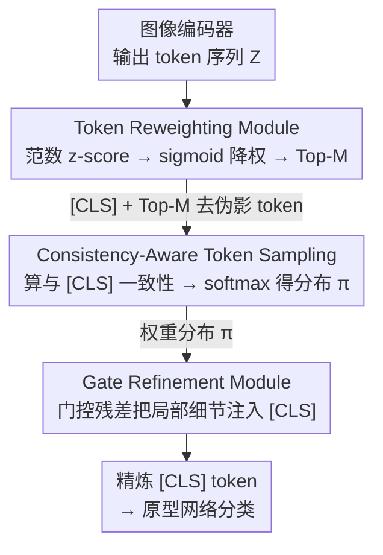

# TAR: Token-Aware Refinement for Fine-grained Generalized Category Discovery

**会议**: CVPR 2026  
**论文**: [CVF Open Access](https://openaccess.thecvf.com/content/CVPR2026/html/Yang_TAR_Token-Aware_Refinement_for_Fine-grained_Generalized_Category_Discovery_CVPR_2026_paper.html)  
**代码**: https://github.com/VectorYangYiStar/TAR  
**领域**: 自监督 / 表示学习  
**关键词**: 广义类别发现, 细粒度识别, 注意力伪影, Token 重加权, 即插即用

## 一句话总结
针对细粒度广义类别发现（GCD）里 ViT 的「注意力伪影」（少数高范数 token 把注意力吸走、让 [CLS] 过度依赖全局语义而忽略局部判别线索）问题，TAR 用一个即插即用的三模块流水线——先无参重加权剔除高范数 token，再按与 [CLS] 的一致性采样可靠局部 token，最后用门控把局部细节注入 [CLS]——在 CUB / Cars / Aircraft 等多个细粒度基准上稳定涨点。

## 研究背景与动机
**领域现状**：广义类别发现（GCD）的目标是在一个同时含已知类和未知类的无标注集合上，既能正确分类已知类、又能把未知类聚出来。主流做法用 DINO 预训练 ViT 或 CLIP 当骨干提特征，再接一个原型网络（prototypical network）做分类；在粗粒度数据集上已经表现不错。

**现有痛点**：但这些方法在细粒度场景（CUB 鸟、Stanford Cars、FGVC-Aircraft）上集体掉链子。它们对粗、细粒度用的是同一套处理策略——最后只把 **[CLS] token** 喂进原型网络做预测。而 [CLS] 编码的主要是**全局语义**，细粒度识别真正需要的是「翅膀纹路」「进气口形状」这种**局部判别线索**，这部分信息被丢掉了。

**核心矛盾**：作者把矛头指向 ViT 里一个已被前人观察到的现象——**注意力伪影（attention artifacts）**：注意力图上少数非语义/背景 token 会出现**异常高的范数**，形成虚假的注意力热点，把本该分给物体局部的注意力吸走，进而污染 [CLS] 的聚合表示。作者进一步实证：注意力图里伪影越多，模型在细粒度 GCD 上的精度越低。也就是说，「只用 [CLS] 分类」和「ViT 自带伪影」这两件事叠加，正是细粒度 GCD 失效的根因。

**本文目标**：在不重训骨干、不改 GCD 主框架的前提下，(1) 抑制注意力伪影，(2) 把被忽略的局部判别信息重新注回 [CLS]。

**切入角度**：既然伪影对应高范数 token，那就从 token 序列层面动手——不要只信 [CLS]，而要把**整条 token 序列**利用起来，从中筛出与全局语义一致、又携带局部细节的可靠 token。

**核心 idea**：用一个即插即用模块「重加权去伪影 → 一致性采样选可靠局部 token → 门控注入 [CLS]」替换「直接拿 [CLS] 分类」，让 [CLS] 在保留全局语义的同时吸收细粒度局部线索。

## 方法详解

### 整体框架
TAR（Token-Aware Refinement）是一个挂在现有 GCD 框架（如单模态 MOS、多模态 GET）骨干和原型网络之间的即插即用模块。输入是图像编码器输出的整条 token 序列 $Z=[z_0,z_1,\dots,z_n]\in\mathbb{R}^{B\times T\times D}$（$z_0$ 是 [CLS]，其余是特征 token），输出是一个被局部细节增强过的「精炼 [CLS] token」，再送进原来的原型网络分类。中间串三个模块：**TRM**（Token Reweighting Module）做无参去噪、剔除高范数伪影并保留 Top-M 重要 token；**CATS**（Consistency-Aware Token Sampling）按「与 [CLS] 的语义一致性」给保留下来的 token 算一个可靠性权重分布 $\pi$；**GRM**（Gate Refinement Module）用门控机制把 $\pi$ 加权聚合的局部信息以残差方式注入 [CLS]。整条链路只在分类前对 token 做一次「清洗—选择—融合」，骨干和 GCD 原有损失都不动。

### 关键设计

**1. Token Reweighting Module（TRM）：用无参 z-score 重加权把高范数伪影压下去**

针对「伪影=高范数 token 把注意力吸走」这个根因，TRM 不引入任何可学习参数，纯靠统计量做去噪。具体地，对除 [CLS] 外的特征 token $Z_f=[z_1,\dots,z_n]$，先量每个 token 嵌入的 $\ell_2$ 范数并做 z-score 标准化 $z^s_i=\frac{\|z_i\|-\mu}{\sigma}$（$\mu,\sigma$ 为该序列范数的均值和标准差），把范数量级拉到同一尺度，避免少数高范数 token 主导。再用一个 sigmoid 把 z-score 翻成权重 $w_i=\frac{1}{1+e^{\alpha z^s_i}}$（$\alpha$ 控制陡峭度）——范数越异常（$z^s_i$ 越大）权重越低，相当于对伪影**降权**。最后只保留权重排名 Top-M 的 token 并用权重缩放：$\widehat{Z}_f=\{\hat z_i=w_i\cdot z_i\mid i\in \mathrm{TopM}(w)\}$，再把 [CLS] 拼回去得到 $\widehat{Z}=z_0\cup\widehat{Z}_f$。因为全程无参，TRM 单独加进来不改变优化过程（消融里几乎不掉点），它的价值在于给后两个模块提供一条「largely artifact-free」的干净 token 序列。

**2. Consistency-Aware Token Sampling（CATS）：按与 [CLS] 的一致性挑出可靠局部 token**

去掉伪影只是第一步——剩下的局部 token 哪些真正可靠、值得用来补充细节，仍需判断。CATS 的思路是：[CLS] 聚合了全局上下文，那就用**与 [CLS] 的语义一致性**当可靠性标尺。它把 [CLS] 和每个重加权 token 投到同一空间算余弦相似度 $s_i=\cos(W_q z_0, W_k \hat z_i)$（$W_q,W_k$ 可学），再 softmax 归一化成采样/权重分布 $\pi_i=\frac{e^{s_i}}{\sum_j e^{s_j}}$，相似度高的局部 token 拿到更大权重。为防止分布**坍缩**到极少数 token，作者加了一项 KL 散度把 $\pi$ 往均匀先验 $U$ 拉（见训练策略）；为提鲁棒性又设计了一致性正则：给重加权序列注入高斯噪声得到扰动分布 $\pi^*$，用对称 KL $L_{con}=\frac{1}{2}[L_{KL}(\pi\|\pi^*)+L_{KL}(\pi^*\|\pi)]$ 逼两者一致，让 token 加权在扰动下保持不变。CATS 单独用（不接 GRM）只有有限增益，因为它只产出权重、还差一个稳定的聚合出口。

**3. Gate Refinement Module（GRM）：用门控残差把局部细节注入 [CLS] 而不冲掉全局语义**

有了可靠性分布 $\pi$，怎么把局部信息融进 [CLS] 又不让过量细节淹没全局语义？GRM 用一个可学门控做选择性注入：先按 $\pi$ 加权投影聚合局部表示 $a=\sum_i \pi_i W_{proj}\hat z_i$，再算门控系数 $\gamma=\alpha\,\sigma(W_g[z_0,a])+\beta$（$W_g$、$\alpha$、$\beta$ 可学，$\sigma$ 为 sigmoid），最后以**残差**方式更新 $z_0\leftarrow z_0+\gamma\cdot a$。门控系数 $\gamma$ 动态调节注入量——上下文相关时多注入、无关时少注入；残差形式则保证不破坏 [CLS] 原有语义、利于梯度流动，是「平滑精炼」而非「粗暴覆写」。消融显示，把 GRM 换成简单相加或 MLP 融合效果都明显更差（CUB All 76.1/76.3 vs GRM 78.4），说明这种自适应门控融合是把局部线索接回全局表示的关键。

### 损失函数 / 训练策略
TAR 在原 GCD 损失 $L_{gcd}$（分类交叉熵 + 有/无监督对比 + 均值熵最大化正则）之上，额外加两项 CATS 相关正则，总目标为
$$L_{total}=L_{gcd}+\lambda_{kl}L_{KL}(\pi\|U)+\lambda_{con}L_{con}.$$
其中 $L_{KL}(\pi\|U)=\sum_i \pi_i\log\pi_i+\log|\mathrm{supp}(U)|$ 防止采样分布坍缩到少数 token，$L_{con}$ 是上面的对称 KL 一致性正则。骨干统一用 ViT-B/16，训练 200 epoch、batch 128、初始学习率 0.1，单卡 RTX 4090；标注集取每类 50% 样本，其余作无标注集。⚠️ 论文给出的 $L_{KL}$ 表达式写法以原文为准。

## 实验关键数据

### 主实验
在三个通用细粒度数据集上，TAR 作为即插即用模块挂到两个不同骨干（单模态 MOS、多模态 GET）上都稳定涨点，尤其 Base 类提升明显：

| 骨干 / 数据集 | 指标 | Baseline | +TAR | 提升 |
|--------------|------|----------|------|------|
| GET · CUB | All | 77.0 | 78.4 | +1.4 |
| GET · Stanford Cars | All | 78.5 | 80.4 | +1.9 |
| GET · Stanford Cars | Base | 86.8 | 91.1 | +4.3 |
| GET · FGVC-Aircraft | Base | 59.6 | 64.8 | +5.2 |
| GET · 三集平均 | All | 71.4 | 73.0 | +1.6 |
| MOS · 三集平均 | Base | 73.4 | 75.8 | +2.4 |

更难的两个数据集上同样领先：

| 数据集 | 指标 | GET | GET+TAR |
|--------|------|-----|---------|
| Herbarium 19 | All | 49.7 | 49.8 |
| Herbarium 19 | Base | 64.5 | 66.1 |
| ImageNet-1k | All | 62.4 | 63.1 |
| ImageNet-1k | Base | 74.0 | 75.2 |

### 消融实验
在 CUB、以 GET 为 baseline 逐组件拆解（行号沿用原文 Table 3）：

| 配置 | All | Base | Novel | 说明 |
|------|-----|------|-------|------|
| (a) Baseline | 75.5 | 77.4 | 74.6 | 复现基线 |
| (i) Full TAR | 78.4 | 80.2 | 77.5 | 完整模型 |
| (e) w/o $L_{con}$ | 75.9 | 78.5 | 74.5 | 去一致性正则，All −2.5 |
| (f) w/o $L_{KL}$ | 75.3 | 78.5 | 75.3 | 去 KL 防坍缩，All −2.1 |
| (g) w/o TRM | 76.7 | 78.1 | 76.1 | 去重加权，All −1.7（Base −2.1） |
| (h) w/o GRM | 76.1 | 78.7 | 74.8 | 去门控融合，All −2.3（Novel −2.7） |

融合方式对比（CUB）：相加 76.1 / MLP 76.3 / GRM 78.4 All，门控融合明显占优。

### 关键发现
- **每个组件都不可或缺**：从完整模型拿掉任一模块都掉点；去 $L_{con}$ 掉得最多（All −2.5、Novel −3.0），说明一致性正则对 Novel 类的 token 一致性贡献最大。
- **TRM 无参却必要**：单独加 TRM 几乎不改变性能（因无可学参数），但作为去伪影前处理被移除时 Base 类掉 2.1，说明它主要在保护已知类的判别性。
- **TAR 对 Base 类增益尤其大**（Cars Base +4.3、FGVC Base +5.2），印证「去伪影 + 注回局部细节」对细粒度判别确实有效；同时在保留已知类知识的前提下也能涨 Novel。

## 亮点与洞察
- **把「注意力伪影」这个 ViT 表征缺陷和细粒度 GCD 失效挂上钩**，并给出「伪影越多→精度越低」的实证，问题定位干净利落，比泛泛说「细粒度难」更有说服力。
- **TRM 用纯统计、零参数去伪影**：范数 z-score + sigmoid 降权 + Top-M，不增加任何网络结构，是个可复用的轻量 token 去噪 trick。
- **「与 [CLS] 一致性」当 token 可靠性标尺 + 防坍缩 KL + 门控残差注入** 这套组合，本质是「不抛弃 [CLS]、而是用整条 token 序列去精炼 [CLS]」，思路可迁移到其他「只用 [CLS] 分类」的下游任务（检索、细粒度分类）。
- **即插即用、跨单/多模态骨干都涨点**，落地成本低。

## 局限与展望
- 作者承认 register-based 去伪影方法不能完全消除冗余信息，TAR 也只是「largely artifact-free」，更彻底的信息解耦仍是开放问题。
- 提升幅度在不少设置下偏温和（部分 All 仅 +0.4~+1.0），且 Novel 类增益普遍小于 Base 类——⚠️ 对「未知类发现」这一 GCD 核心诉求的实际帮助可能有限，更像在巩固已知类判别。
- TRM 的 Top-M、sigmoid 陡峭度 $\alpha$、两项正则权重 $\lambda_{kl}/\lambda_{con}$ 均为超参，论文未充分给出敏感性分析，跨数据集迁移时可能需要重调。
- 改进方向：把「一致性标尺」从单一 [CLS] 扩成多原型/多视角参考；或把 TRM 的无参去伪影换成可学但仍轻量的版本，兼顾去噪强度与判别保留。

## 相关工作与启发
- **vs 注册 token 去伪影（register tokens [4] / 推理期 register [10]）**：它们靠引入可训练或推理期 register token 吸收高范数残差来消伪影；TAR 不加 register，而是从 token 序列后端做「重加权—采样—门控」，并额外把局部信息注回 [CLS]，关注点从「消伪影」延伸到「补局部细节」。
- **vs GET / MOS（CVPR 2025 GCD SOTA）**：它们改的是骨干/多模态表示（GET 合成文本嵌入、MOS 用分割造场景无关图像）且仍用 [CLS] 分类；TAR 正交于它们，作为即插即用模块挂上去进一步涨点。
- **vs SimGCD / SPTNET 等参数化 GCD**：这些方法在原型分类、两阶段自适应上做文章，但都沿用「[CLS] 单 token 分类」范式；TAR 的差异在于明确指出该范式在细粒度下因伪影而失效，并用整条 token 序列来补救。

## 评分
- 新颖性: ⭐⭐⭐⭐ 把注意力伪影和细粒度 GCD 失效挂钩、用三模块即插即用流水线补救，问题定位与方案都较新颖。
- 实验充分度: ⭐⭐⭐⭐ 覆盖 5 个数据集 + 双骨干 + 逐组件消融 + 融合方式对比，较完整；但缺超参敏感性分析。
- 写作质量: ⭐⭐⭐⭐ 动机清晰、公式完整，个别拼写小错不影响理解。
- 价值: ⭐⭐⭐⭐ 即插即用、跨骨干涨点、成本低，对细粒度 GCD 实用；但 Novel 类增益偏小。

<!-- RELATED:START -->

## 相关论文

- [\[CVPR 2026\] The Devil Is in Gradient Entanglement: Energy-Aware Gradient Coordinator for Robust Generalized Category Discovery](the_devil_is_in_gradient_entanglement_energy-aware_gradient_coordinator_for_robu.md)
- [\[CVPR 2026\] Learning Like Humans: Analogical Concept Learning for Generalized Category Discovery](learning_like_humans_analogical_concept_learning_for_generalized_category_discov.md)
- [\[CVPR 2026\] Seeing Through the Shift: Causality-Inspired Robust Generalized Category Discovery](seeing_through_the_shift_causality-inspired_robust_generalized_category_discover.md)
- [\[CVPR 2026\] Decouple Your Discovery and Memory in Continual Generalized Category Discovery](decouple_your_discovery_and_memory_in_continual_generalized_category_discovery.md)
- [\[CVPR 2026\] OmniGCD: Abstracting Generalized Category Discovery for Modality Agnosticism](omnigcd_abstracting_generalized_category_discovery_for_modality_agnosticism.md)

<!-- RELATED:END -->
