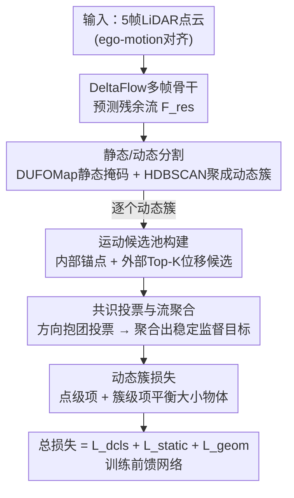

# TeFlow: Enabling Multi-frame Supervision for Self-Supervised Feed-forward Scene Flow Estimation

**会议**: CVPR 2026  
**arXiv**: [2602.19053](https://arxiv.org/abs/2602.19053)  
**代码**: [github.com/KTH-RPL/OpenSceneFlow](https://github.com/KTH-RPL/OpenSceneFlow)  
**领域**: 自监督学习 / 自动驾驶  
**关键词**: 场景流, 自监督, 多帧监督, 时序集成, 前馈网络, 点云

## 一句话总结

提出TeFlow——首个将多帧监督引入自监督前馈场景流估计的方法：通过时序集成策略构建运动候选池并基于共识投票聚合时序一致的监督信号，在Argoverse 2上Three-way EPE达3.57cm（媲美优化方法Floxels）同时保持实时推理（8s vs 24min），较SeFlow++提升22.3%。

## 研究背景与动机

**领域现状**：场景流估计LiDAR点云中每个点的3D运动。现有自监督方法分为两类：(1) **优化方法**（NSFP、EulerFlow）——利用多帧长时约束优化场景特定模型，精度高但延迟极大（小时到天级别）；(2) **前馈方法**（SeFlow、ZeroFlow）——单次前向推理高效，但训练目标仅来源于两帧点对应，容易受遮挡、噪声、稀疏观测影响产生不稳定的监督信号。

**核心矛盾**：多帧监督有潜力提供更稳定的训练信号，但朴素地将两帧目标扩展到多帧是无效的——帧间点对应剧烈变化，产生不一致的信号。如论文Figure 1b所示，两帧监督信号方向在时间上剧烈抖动，即使真实运动平滑，两帧估计也因遮挡和噪声而剧烈波动。

**现有尝试的不足**：ZeroFlow通过知识蒸馏从慢速"教师"生成伪标签，但需7.2 GPU月计算量。SeFlow改进两帧损失函数但仍受限于两帧信号天花板。多帧架构（Flow4D、DeltaFlow）在监督学习中有效，但在自监督下仍受两帧目标约束。

**TeFlow的切入**：不是设计更好的两帧损失，而是**挖掘多帧间时序一致的运动线索**——构建候选运动池+共识投票→产生稳定的多帧监督信号，让前馈模型首次在自监督下充分利用多帧架构的时序建模能力。

## 方法详解

### 整体框架

TeFlow要解决的核心问题是：自监督前馈场景流明明可以用多帧架构，却一直只能拿两帧点对应当监督信号，而两帧信号被遮挡和噪声搅得方向乱跳，根本喂不出稳定的训练目标。它的整体思路是把"找监督信号"这件事从单帧对应升级成多帧投票——网络本身用的是DeltaFlow多帧骨干，输入5帧经ego-motion对齐的LiDAR点云，预测残余流 $\mathcal{F}_{res}$；真正的新意全在监督端。

训练时先借外部模块把点云分成静态/动态两块（静态掩码来自DUFOMap，动态点的簇 $\mathcal{C}_j$ 由HDBSCAN预先聚好），然后对每一个动态簇单独走一遍时序集成：从多帧里凑出一池运动候选，靠共识投票把它们聚成一个可靠的监督目标 $\bar{\mathbf{f}}_{\mathcal{C}_j}$，再配上约束静态区域的损失和保证几何对齐的Chamfer损失一起训练。下面三个设计就是这条监督链路上的三个关键环节。

### 关键设计

**1. 运动候选池构建：给每个动态簇凑一池运动假设**

两帧监督之所以抖，是因为它只盯着相邻两帧的点对应，一旦某帧被遮挡或落到稀疏区域，估出来的运动方向就会突变。TeFlow的应对是不再依赖单一来源，而是为每个动态簇 $\mathcal{C}_j$ 攒出一池候选，让后续投票有得选。这池候选刻意混了两种性质相反的来源：一是**内部候选** $\hat{\mathbf{f}}_{\mathcal{C}_j}$，即当前网络对这个簇预测的平均流，它跟着模型走、不会乱跳，充当一个稳定的锚点；二是**外部候选** $\mathbf{f}^{t'}_{\mathcal{C}_j,k}$，从每一个时间帧 $t'$ 里用最近邻搜索挑出位移最大的Top-K个对应点，再按时间间隔归一化成可比的瞬时速度

$$\mathbf{f}^{t'}_{\mathcal{C}_j,k} = \frac{\mathcal{NN}(\mathbf{p}_k, \mathcal{P}_{t',d}) - \mathbf{p}_k}{t' - t}$$

这么配的道理是让两种来源互补：只有内部锚点训练会原地踏步、学不到新东西，只有外部候选又容易被噪声带偏；只挑位移最大的Top-K是为了过滤掉几乎不动的背景噪点，而除以时间间隔则保证来自不同帧、跨越不同时长的候选能放在同一把尺子上比较。

**2. 共识投票与流聚合：让多帧候选互相投票选出可靠目标**

凑出一池候选只是第一步，池子里仍混着不少噪声估计，直接平均反而会被异常值拖坏。TeFlow在这里借了"少数服从多数"的思路——让候选互相投票，方向上抱团的才算数。具体做法是先算一个共识矩阵衡量两两方向是否一致，再给每个候选配一份可靠性权重：

$$\mathbf{M}_{ab} = \mathbf{1}[\cos(\mathbf{f}_a, \mathbf{f}_b) > \tau_{cos}], \qquad w_i = \gamma^{m_i}\,(1 + \|\mathbf{f}_i\|_2^2)$$

权重里 $\gamma^{m_i}$（$\gamma=0.9$）是时间衰减，离当前帧越远的候选越不信任；$1+\|\mathbf{f}_i\|_2^2$ 则让位移大、信息量足的候选更有分量。每个候选的投票得分就是跟它方向一致的候选权重之和 $\mathbf{S} = \mathbf{M}\mathbf{w}$，得分最高的那个被选为共识赢家 $a^\dagger$，最终的监督目标取所有"和赢家方向一致"的候选的加权平均：

$$\bar{\mathbf{f}}_{\mathcal{C}_j} = \frac{\sum_b \mathbf{M}_{a^\dagger b}\, w_b\, \mathbf{f}_b}{\sum_b \mathbf{M}_{a^\dagger b}\, w_b}$$

这一步是整套方法稳不稳的关键：单个候选都不可靠，但被多数方向佐证、又按时间和幅度加权后的共识信号，比原来的两帧信号平滑得多（论文Figure 1b正是这个对比）。

**3. 动态簇损失：别让大物体的点数淹没小物体**

有了可靠目标还得公平地用。如果直接对所有动态点取平均L2损失，一辆车上的点动辄是一个行人的几十倍，梯度会被大物体主导，行人这类小目标根本学不动。TeFlow用一个两项相加的损失把尺度拉平：点级项照常对每个点算误差，簇级项则先在每个簇内部平均、再跨簇平均，相当于无论物体大小都只投一票：

$$\mathcal{L}_{dcls} = \frac{1}{|\mathcal{P}_\mathcal{C}|}\sum_j\sum_{\mathbf{p}_i \in \mathcal{C}_j}\|\hat{\mathbf{f}}_i - \bar{\mathbf{f}}_{\mathcal{C}_j}\|^2_2 + \frac{1}{N_c}\sum_j\Big(\frac{1}{|\mathcal{C}_j|}\sum_{\mathbf{p}_i \in \mathcal{C}_j}\|\hat{\mathbf{f}}_i - \bar{\mathbf{f}}_{\mathcal{C}_j}\|^2_2\Big)$$

两项缺一不可：消融显示只留点级项时行人类误差上涨53%（被大物体淹没），只留簇级项又因为放弃了逐点对齐让OTHER类误差暴增82%，两者相加才取到平衡（详见Table 5）。

### 一个完整示例：一个动态簇怎么拿到监督目标

以一帧里的一辆行驶中的车为例，看时序集成怎么把杂乱候选收成一个目标（数字为示意，帮助理解流程 ⚠️ 以原文为准）。HDBSCAN先把这辆车的点聚成一个动态簇 $\mathcal{C}_j$。候选池里先放一个内部候选——网络当前预测的簇平均流，方向大致朝前；再从其余4帧各挑Top-K个最大位移对应点作为外部候选，假设凑出十来个候选，其中大多数方向朝前、少数因为遮挡或近邻搜错了指向侧面或后方。

投票阶段，朝前的那批候选彼此 $\cos$ 相似度高、在共识矩阵里互相连通，各自的投票得分被对方的权重不断累加；那几个指向乱的候选孤立无援，得分很低。于是得分最高的"朝前"候选当选赢家 $a^\dagger$，最终监督目标只对与它方向一致的候选做加权平均——近帧、大位移的候选权重更高——侧向和后向的噪声候选被自动排除在外。这样这辆车整簇拿到的就是一个平滑、朝前、不受个别坏帧污染的监督流，而不是两帧方法里那个忽左忽右的抖动信号。

### 损失函数 / 训练策略

总损失：$\mathcal{L}_{total} = \mathcal{L}_{dcls} + \mathcal{L}_{static} + \mathcal{L}_{geom}$

- $\mathcal{L}_{static}$：静态点残余流趋零
- $\mathcal{L}_{geom}$：多帧Chamfer距离确保warped点云与邻帧几何对齐
- 训练配置：Adam优化器，lr=0.002，batch size=20，10×RTX 3080，15 epoch，约15-20小时

## 实验关键数据

### 主实验：Argoverse 2测试集排行榜

| 方法 | 类型 | #帧 | 运行时间/seq | Three-way EPE↓ | Dynamic Norm↓ | PED↓ |
|------|------|:---:|:---:|:---:|:---:|:---:|
| NSFP | 优化 | 2 | 60m | 6.06 | 0.422 | 0.722 |
| EulerFlow | 优化 | all | 1440m | 4.23 | 0.130 | 0.195 |
| Floxels | 优化 | 13 | 24m | 3.57 | 0.154 | 0.195 |
| ZeroFlow | 前馈 | 3 | 5.4s | 4.94 | 0.439 | 0.808 |
| SeFlow | 前馈 | 2 | 7.2s | 4.86 | 0.309 | 0.464 |
| SeFlow++ | 前馈 | 3 | 10s | 4.40 | 0.264 | 0.367 |
| **TeFlow** | **前馈** | **5** | **8s** | **3.57** | **0.205** | **0.253** |

- TeFlow EPE 3.57cm = Floxels（优化方法），但速度150×（8s vs 24min）
- 动态指标较SeFlow++提升22.3%，行人类别降31%

### 消融实验：帧数与损失项

| 损失组合 | Dynamic Norm Mean↓ | CAR↓ | PED↓ | Three-way EPE↓ |
|---------|:---:|:---:|:---:|:---:|
| 仅 $\mathcal{L}_{geom}$ | 0.386 | 0.317 | 0.297 | 8.85 |
| $\mathcal{L}_{geom} + \mathcal{L}_{static}$ | 0.458 | 0.321 | 0.481 | 6.37 |
| $\mathcal{L}_{dcls}$ only | 0.303 | 0.254 | 0.285 | 8.53 |
| $\mathcal{L}_{static} + \mathcal{L}_{dcls}$ | 0.313 | 0.233 | 0.296 | 4.84 |
| **全部三项** | **0.265** | **0.198** | **0.295** | **4.43** |

| 帧数 | Dynamic Norm Mean↓ | Three-way EPE Mean↓ |
|:---:|:---:|:---:|
| 2 (SeFlow) | 0.408 | 6.35 |
| 2 (TeFlow) | 0.353 | 5.98 |
| 4 | 0.283 | 4.57 |
| **5** | **0.265** | **4.43** |
| 6 | 0.269 | 4.55 |
| 8 | 0.300 | 5.40 |

### 关键发现

- 即使同为2帧，TeFlow也比SeFlow优13.5%→候选池+簇级损失的贡献
- 5帧为最优窗口，6帧开始性能微降，8帧明显退化→过远帧引入噪声
- 仅动态簇损失在动态物体上很强（Mean 0.303）但静态区域EPE 8.53→必须结合静态损失
- 候选池消融：仅内部（0.455）< 仅外部（0.321）< 两者结合（0.265）→内部锚定+外部证据互补
- nuScenes上同样SOTA：Dynamic Norm 0.395 vs SeFlow++ 0.509，行人误差降33.8%

## 亮点与洞察

- **核心insight精准**：多帧自监督的关键困难不是架构而是监督信号质量→时序一致性挖掘是正确的解法
- **候选池+投票机制优雅**：将不可靠的多源运动估计聚合为可靠信号，无需额外网络或复杂优化
- **簇级损失简单有效**：用一行额外代码解决大小物体不平衡问题，对行人等小物体提升幅度巨大
- **效率-精度帕累托最优**：在实时方法中精度最高，在高精度方法中速度最快，成功弥合了两类方法的鸿沟

## 局限与展望

- 依赖外部模块进行静态/动态分割（DUFOMap）和动态聚类（HDBSCAN）→分割错误可能级联传播
- 超过5帧后性能下降→共识机制对远距帧的利用还不够精细
- 候选归一化假设线性运动→曲线运动（如转弯车辆）的候选质量受限
- 未探索将时序集成策略应用于模型推理阶段（当前仅用于训练）

## 相关工作与启发

- **vs EulerFlow**：EulerFlow优化连续ODE精度极高（EPE 4.23）但需1440分钟→TeFlow 3.57cm仅需8秒→实际部署中TeFlow是唯一可行的高精度方案
- **vs SeFlow/SeFlow++**：改进两帧损失但受限于两帧信号天花板→TeFlow从信号源头提升质量
- **vs ZeroFlow**：知识蒸馏需7.2 GPU月生成伪标签→TeFlow完全端到端自监督
- **启发**：共识投票的多帧信号挖掘范式可迁移到其他自监督视觉任务（光流、深度估计）；簇级损失的思路对所有涉及物体尺度不平衡的3D感知任务有参考价值

## 评分

⭐⭐⭐⭐⭐ (5/5)

综合评价：精准定位了自监督前馈场景流的核心瓶颈（多帧监督信号不稳定），提出简洁优雅的时序集成解决方案。实验全面（Argoverse 2 + nuScenes + Waymo），消融透彻（帧数/损失组合/候选池/损失形式），定量定性结果均令人信服。首次在自监督前馈方法中达到优化方法精度的同时保持实时效率——开创了新的帕累托前沿。

<!-- RELATED:START -->

## 相关论文

- [\[CVPR 2026\] TimeBridge: Self-Supervised Video Representation Learning via Start-End Joint Embedding and In-Between Frame Prediction](timebridge_self-supervised_video_representation_learning_via_start-end_joint_emb.md)
- [\[CVPR 2025\] AutoSSVH: Automated Frame Sampling for Self-Supervised Video Hashing](../../CVPR2025/self_supervised/autossvh_exploring_automated_frame_sampling_for_efficient_self-supervised_video_.md)
- [\[CVPR 2026\] HCL-FF: Hierarchical and Contrastive Learning for Forward-Forward Algorithm](hcl-ff_hierarchical_and_contrastive_learning_for_forward-forward_algorithm.md)
- [\[CVPR 2026\] Towards Stable Self-Supervised Object Representations in Unconstrained Egocentric Video](towards_stable_self-supervised_object_representations_in_unconstrained_egocentri.md)
- [\[CVPR 2026\] Progressive Mask Distillation for Self-supervised Video Representation](progressive_mask_distillation_for_self-supervised_video_representation.md)

<!-- RELATED:END -->
