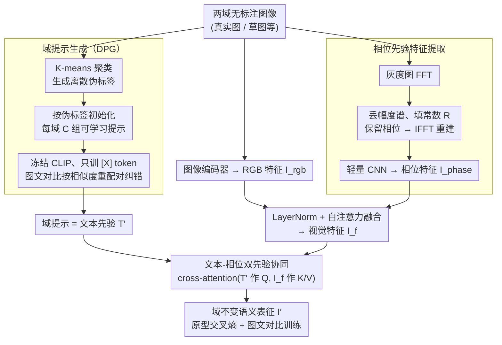

# Text-Phase Synergy Network with Dual Priors for Unsupervised Cross-Domain Image Retrieval

**会议**: CVPR 2026  
**arXiv**: [2603.12711](https://arxiv.org/abs/2603.12711)  
**代码**: 无  
**领域**: 跨域检索 / 自监督学习  
**关键词**: UCDIR, domain prompt, phase spectrum, text-phase dual priors, cross-domain alignment  

## 一句话总结

提出TPSNet，将CLIP学习的域提示（domain prompt）作为文本先验提供精细语义监督，同时引入相位谱特征作为相位先验来桥接域分布差异并保持语义完整性，通过文本-相位双先验的协同实现无监督跨域图像检索的显著提升。

## 研究背景与动机

**领域现状**：无监督跨域图像检索（UCDIR）旨在无标注数据条件下，在异构图像域之间（如真实图片和草图）检索语义相同的图像。核心困难是无标注 + 域分布差异两重挑战叠加。

**现有痛点**：（1）伪标签噪声——通过 K-means 聚类生成伪标签作为监督信号，但离散伪标签常不准确，导致域内表征学习和跨域对齐都受噪声干扰，类原型也不可靠；（2）跨域对齐导致语义退化——对抗训练、统计分布对齐等策略在消除域差异时会不可避免地损害语义信息，因为域特定特征和语义特征是纠缠的。

**核心 idea**：（1）用 CLIP 学习的域提示作为文本先验，比离散伪标签提供更丰富精确的语义监督；（2）用傅里叶变换分离出的相位谱作为相位先验——相位谱编码了结构和语义信息且对域偏移鲁棒——桥接域差异的同时保持语义完整。两条路径协同工作。

## 方法详解

### 整体框架

UCDIR 的两难在于：没有真标签时，能拿来当监督的只有 K-means 聚出来的离散伪标签，但它既噪声大又不够语义化；而对齐两个域时，传统对抗/统计对齐又会把语义一起抹掉。TPSNet 的思路是给这两件事各换一个更可靠的"先验"，再让它们协同。整篇网络分两段跑：先由 Domain Prompt Generation（DPG）为每个域学出一组类别提示，把聚类伪标签升级成 CLIP 文本空间里的连续语义信号；再由 Text-Phase Dual Priors Network（TPDP）一边用这组提示当**文本先验**牵引语义特征，一边把图像相位谱当**相位先验**来跨过域差异，最后用 cross-attention 把两路先验融成域不变的语义表征。

### 关键设计

**1. Domain Prompt Generation：把噪声伪标签换成 CLIP 文本先验**

直接拿 K-means 伪标签做监督，错配的样本会一路污染域内表征和类原型。DPG 不把伪标签当终点，而是当初始化的脚手架：先按伪标签给每个域准备 $C$ 个可学习提示模板（"An image of a $[X]^1\ldots[X]^M$"），然后冻结 CLIP、只训练其中的 $[X]$ token，用图文对比损失 $\mathcal{L}_{prompt}=\mathcal{L}_{i2t}+\mathcal{L}_{t2i}$ 去优化它们。关键在于对比时是按图文 cosine similarity 重新配对的——也就是说优化过程本身会把一部分配错的伪标签拉回正确类别。训练完，每个提示就成了一段编码精确类别语义的文本，比一个离散的整数标签携带的信息丰富得多，这也是后面文本先验的来源。

**2. Phase-Prior 特征提取：用相位谱的域不变性桥接域差**

要消除域差又不伤语义，得找一个"天生就跨域一致"的信号。傅里叶分析里，幅度谱主要承载风格、颜色这类域特定的低层统计，而相位谱编码的是结构和边缘——正是跨域共享的语义骨架。TPSNet 据此把灰度图做 FFT 得到 $F(u,v)=|A(u,v)|e^{j\phi(u,v)}$，然后丢掉幅度、用一个常数 $R$ 顶替：

$$F'(u,v) = R\,e^{j\phi(u,v)}$$

再 IFFT 重建出只保留相位的图像。这一步等于在输入端就把大半域特定因素剥掉了。重建图过一个轻量 CNN 得到相位特征 $I^{phase}$，与 RGB 特征经 LayerNorm + Self-Attention 融合成 $I^f$，让语义骨架和原始外观互补，而不是简单二选一。

**3. Text-Phase 双先验协同融合：让两路先验在注意力里互相牵引**

文本先验知道"应该是什么类别"，相位先验知道"哪些特征跨域稳定"，但二者分处语义空间和频率空间，需要一个机制把它们对齐到同一表征上。TPSNet 用 cross-attention 做这件事：以域提示文本特征 $T'$ 作 Query、融合视觉特征 $I^f$ 作 Key/Value，

$$I' = \text{CrossAttention}(T';\,I^f)$$

于是文本先验从语义维度给出"该往哪类靠"的方向，相位先验从特征维度保证"靠的时候不被域偏移带偏"，两者在注意力权重里互补增强。得到的 $I'$ 再以 prototype 交叉熵 $\mathcal{L}_{pce}$ 和带标签平滑的图文对比 $\mathcal{L}_{i2tce}$ 联合训练，类原型用动量更新 $\mathcal{P} \leftarrow m\mathcal{P} + (1-m)I'$ 保持稳定。

### 损失函数 / 训练策略

总损失 $\mathcal{L} = \alpha\mathcal{L}_{pce} + \beta\mathcal{L}_{i2tce}$，其中 $\mathcal{L}_{i2tce}$ 用标签平滑 $\sigma_j=(1-\epsilon)y_i+\epsilon/C$ 进一步稀释伪标签噪声。训练分两阶段：Stage 1 只优化 prompt token（即 DPG），Stage 2 再训练 TPDP 全部模块。

## 实验关键数据

### 主实验

**Office-Home（65类4域, 12个跨域场景）和DomainNet（7类6域）**：

| 方法 | Office-Home 平均P@1 | Office-Home 平均P@15 |
|------|-------------------|---------------------|
| DD | ~45 | ~35 |
| ProtoOT | ~50 | ~47 |
| ShieldIR | ~53 | ~50 |
| **TPSNet** | **显著SOTA** | **显著SOTA** |

### 消融实验

| 配置 | 效果 | 说明 |
|------|------|------|
| 仅伪标签（无域提示） | 基线 | 噪声large |
| +文本先验（域提示） | 显著↑ | 语义监督更精确 |
| +相位先验 | 进一步↑ | 域不变特征有帮助 |
| **双先验协同** | **最优** | 互补增强效果最佳 |

### 关键发现

- 文本先验单独就能显著提升——说明CLIP的语义信号比聚类伪标签丰富得多
- 相位先验在跨域差异大的场景中（如Art↔Clipart）提升更明显——验证了相位谱的域不变性假设
- 标签平滑对缓解伪标签噪声有效

## 亮点与洞察

- 文本先验+相位先验的双路径设计很有启发性——前者从语义空间、后者从频率空间分别提供互补的域不变信号。这种"多视角域不变性"比单一对齐策略更鲁棒。
- 用常数幅度+原始相位重建图像的操作虽然简单，但效果显著——相位确实编码了跨域一致的结构语义信息。

## 局限与展望

- 依赖K-means聚类初始化domain prompt，聚类质量对后续所有步骤影响较大
- 相位谱仅从灰度图提取，丢失了颜色信息中可能的域不变成分
- 数据集的域差异相对有限，更极端域偏移效果待验证

## 相关工作与启发

- **vs DD/CODA**: 直接用伪标签做域内对比和跨域对齐，TPSNet用domain prompt替代伪标签提供更好的语义监督
- **vs FDA/FUDA**: 在频域替换低频做域适应，TPSNet更进一步分离幅度/相位，利用相位的天然域不变性

## 评分

- 新颖性: ⭐⭐⭐⭐ 文本先验+相位先验的双路径设计在UCDIR中是新颖组合
- 实验充分度: ⭐⭐⭐⭐ 两个benchmark、12个跨域场景、消融充分
- 写作质量: ⭐⭐⭐ 结构清晰但图表较复杂
- 价值: ⭐⭐⭐ UCDIR是有意义问题，提升显著

<!-- RELATED:START -->

## 相关论文

- [\[CVPR 2026\] D2Dewarp: Dual Dimensions Geometric Representation Learning Based Document Image Dewarping](d2dewarp_dual_dimensions_geometric_representation_learning_based_document_image_.md)
- [\[CVPR 2026\] Is Parameter Isolation Better for Prompt-Based Continual Learning?](is_parameter_isolation_better_for_prompt-based_continual_learning.md)
- [\[CVPR 2026\] Semantic-Guided Global-Local Collaborative Prompt Learning for Few-Shot Class Incremental Learning](semantic-guided_global-local_collaborative_prompt_learning_for_few-shot_class_in.md)
- [\[CVPR 2026\] Graph Attention Prototypical Network for Robust Few-Shot Classification](graph_attention_prototypical_network_for_robust_few-shot_classification.md)
- [\[CVPR 2026\] GM-R²: Generative Matching Learning for Unsupervised Geometric Representation and Registration](gm-r2_generative_matching_learning_for_unsupervised_geometric_representation_and.md)

<!-- RELATED:END -->
