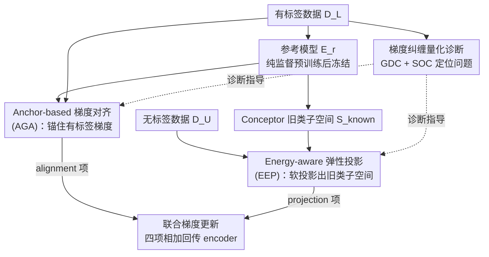

# The Devil Is in Gradient Entanglement: Energy-Aware Gradient Coordinator for Robust Generalized Category Discovery

**会议**: CVPR 2026  
**论文**: [CVF Open Access](https://openaccess.thecvf.com/content/CVPR2026/html/Zheng_The_Devil_Is_in_Gradient_Entanglement_Energy-Aware_Gradient_Coordinator_for_CVPR_2026_paper.html)  
**代码**: https://haiyangzheng.github.io/EAGC  
**领域**: 广义类别发现 / 自监督表示学习  
**关键词**: 广义类别发现, 梯度纠缠, 梯度投影, Conceptor 子空间, 即插即用

## 一句话总结
本文发现广义类别发现（GCD）里监督与无监督目标共享一套参数会产生「梯度纠缠」——无监督梯度污染监督方向、监督梯度又把新类表征拽进旧类子空间，于是提出即插即用的 EAGC：用一个纯监督参考模型把有标签样本的梯度锚住（AGA），同时把无标签梯度按能量自适应地软投影出旧类子空间（EEP），在四个 GCD baseline、五个数据集上平均把 All ACC 提升 3.2%、New ACC 提升 4.3%。

## 研究背景与动机
**领域现状**：GCD 的设定是有一份标注的「旧类」数据 $D_L$ 和一份混了旧类与新类的无标注数据 $D_U$，目标是把 $D_U$ 里的样本都归到正确（可能是新发现的）类别。主流参数化方法（SimGCD、LegoGCD、SPTNet）和非参数方法（SelEx）几乎都是把一个监督损失 $L_{sup}$ 和一个无监督/伪标签损失 $L_{unsup}$ 直接加权相加，端到端联合优化：$L_{GCD}=\alpha L_{sup}(D_L)+\beta L_{unsup}(D_U)$。

**现有痛点**：这种「直接相加」在旧类和新类之间总是难以两全。作者用两个量化指标把问题挖了出来——监督梯度的方向会随训练越来越被无监督梯度带偏（旧类判别力下降），同时新类的表征会被慢慢吸进旧类的特征子空间（新类彼此分不开）。

**核心矛盾**：$L_{sup}$ 来自干净标签、梯度方向稳定且一致；$L_{unsup}$ 来自伪标签/自监督，尤其训练早期噪声大、方向乱。两者共用一套参数 $\theta$ 时存在**监督不对称**：一方面噪声梯度 $g_U$ 扭曲了可靠梯度 $g_L$；另一方面因为旧类同时从有标签监督 $g_L$ 和无标签里的旧类样本 $g_U^{known}$ 两处得到梯度，旧类方向在优化里占主导，把新类表征往旧类子空间里拉。作者把这个现象命名为**梯度纠缠（Gradient Entanglement, GE）**。

**本文目标**：不改 backbone、不改原有损失，只在梯度层面动手术，分别压制 GE 的两种表现——(1) 稳住有标签样本的优化方向；(2) 把无标签梯度从旧类子空间推开，但别误伤本就属于旧类的无标签样本。

**切入角度**：把 GCD 当成一个**梯度冲突**问题来看，借鉴多任务学习/持续学习里的梯度投影思路，但针对 GCD 特有的「无标签集里旧类新类混杂」做自适应处理。

**核心 idea**：用一个冻结的纯监督参考模型当「锚」校正有标签梯度，再用 Conceptor 软子空间 + 能量自适应权重把无标签梯度弹性地投影出旧类子空间。

## 方法详解

### 整体框架
EAGC（Energy-Aware Gradient Coordinator）是一个**纯梯度层、即插即用**的协调器：训练前先在有标签数据上训一个参考模型 $E_r$ 并冻结，用它的特征构造旧类子空间 $S_{known}$；训练中对同一个 batch 里的有标签和无标签样本分别挂两个反向传播 hook，在特征级梯度 $\nabla_z L$ 回传到 encoder 之前就把它修正掉。整套方法不碰网络结构和原损失，只是把最终的特征级梯度从两项变成四项：

$$\nabla_z L_{GCD} = \nabla_z L_{sup} + \nabla_z L_{unsup} + \nabla_{z_l} g_{align} + \nabla_{z_u} g_{proj}.$$

其中前两项是 baseline 原本就有的梯度，后两项分别由 AGA（只作用在有标签样本上）和 EEP（只作用在无标签样本上）注入，用 batch 里的 `masklab` 掩码区分。

### 关键设计

**1. 梯度纠缠的量化诊断：GDC 与 SOC 把"为什么训不好"测出来**

以往大家只是经验上感到旧类/新类难两全，本文先把这个模糊感受变成两个可测的系数。第一个是**梯度方向偏移系数（Gradient Deviation Coefficient, GDC）**：设 $\hat g_L=\nabla_\theta L_{sup}$ 是「只用监督损失（$\beta=0$）」时的参考梯度，$g$ 是联合优化的真实梯度，则

$$\text{GDC} = 1 - \frac{\langle \hat g_L, g\rangle}{\lVert \hat g_L\rVert\,\lVert g\rVert} \in [0,2],$$

它本质是 1 减去两梯度的余弦相似度，值越大说明无标签数据把监督方向带得越偏。第二个是**子空间重叠系数（Subspace Overlap Coefficient, SOC）**：取旧类特征 $Z_{old}$ 的前 $k$ 个主成分 $U_k$，构造投影矩阵 $P_{old}=U_k U_k^\top$，再看新类特征 $Z_{new}$ 落在这个旧类子空间里的能量占比

$$\text{SOC} = \frac{\lVert Z_{new}P_{old}\rVert_F^2}{\lVert Z_{new}\rVert_F^2} \in [0,1],$$

值越大说明新类表征越被旧类子空间吞掉。作者在 SimGCD 上观察到：GDC 随训练单调上升（监督方向越来越被污染），SOC 在早期就猛涨并维持高位（新类一开始就被吸进去）。这两个指标既是问题诊断书，也直接对应后面两个模块各自要压低的目标——GDC 由 AGA 管，SOC 由 EEP 管。

**2. AGA（Anchor-based Gradient Alignment）：用冻结的参考模型把有标签梯度锚住**

这一项针对 GDC——有标签样本的优化方向被无标签噪声梯度带偏。做法是先在有标签子集上用普通交叉熵训一个参考模型 $E_r$（预测 $p_i=\sigma(f(E(x_i^l))/\tau_s)$，损失 $L_{cls}=\frac{1}{|B_L|}\sum_{i\in B_L}\ell(y_i^l,p_i)$），训完冻结，它给出旧类一组稳定的特征锚 $\hat z_i^l=E_r(x_i^l)$。GCD 训练时，对有标签样本的特征级梯度额外加一个**稳定项**：

$$\nabla_{z_l} L_{GCD} = \underbrace{\nabla_{z_l}L_{sup}+\nabla_{z_u}L_{unsup}}_{\text{扰动}} + \underbrace{\lambda_a(z^l-\hat z^l)}_{\text{稳定}},$$

即 $\nabla_{z_l}g_{align}=\lambda_a(z^l-\hat z^l)$，把当前特征 $z^l$ 往参考特征 $\hat z^l$ 拉。作者把它解释为特征空间里的一种**proximal（近端）正则**：在监督最优点 $\hat z$ 周围划出一个局部信任域，产生收缩效应，抑制有标签表征的语义漂移。和直接调大监督损失权重不同，AGA 是定向地把方向钉回参考模型，所以既稳住旧类判别边界，又因为表征更稳定可迁移，反而连带提升了新类发现。

**3. EEP（Energy-aware Elastic Projection）：按能量自适应地把无标签梯度投影出旧类子空间**

这一项针对 SOC——新类被旧类子空间吸走。它分三步。第一步**构造旧类子空间**：用 Conceptor 理论而非 PCA。PCA 是硬截断，只留主能量方向，会过度压缩、丢掉区分旧/新类的低能量细节；Conceptor 给的是软的、按能量加权的子空间

$$S_{known} = R(R+\eta^{-2}I)^{-1}, \quad R=\tfrac{1}{N}Z_{old}^\top Z_{old},$$

其中 aperture $\eta$ 控制子空间捕获的软硬程度（实验取 $\eta=2.0$）。第二步**软投影**：对无标签特征梯度做 $\nabla_{z_u}L_{unsup}\leftarrow \nabla_{z_u}L_{unsup}-\lambda_p(\nabla_{z_u}L_{unsup}\,S_{known})$，把落在旧类子空间里的梯度分量减掉。但无标签集里本来就混着旧类样本，对所有样本一刀切地投影会误伤旧类学习。于是第三步**能量自适应加权**：先定义某特征落在旧类子空间里的能量比

$$E_{old}(z_i)=\frac{z_i^\top S_{known}z_i}{\lVert z_i\rVert_2^2}\in[0,1],$$

再用有标签数据的平均能量比 $E_{old}^l$ 归一化，得到每个无标签样本的弹性权重

$$\tau_i = 1 - \frac{E_{old}(z_i^u)}{E_{old}^l}.$$

直觉是：和旧类子空间高度对齐（很可能是旧类）的样本 $\tau_i$ 小、投影弱；不对齐（很可能是新类）的样本 $\tau_i$ 大、投影强。最终弹性梯度投影为

$$\nabla_{z_u}g_{proj} = -\lambda_p\,(\tau\cdot\nabla_{z_u}L_{unsup}\,S_{known}).$$

这样既不过度压制无标签里的旧类样本，又能有效把真·新类表征从旧类子空间里解耦出来。

### 损失函数 / 训练策略
EAGC 不引入新损失，原 baseline 的 $L_{GCD}=\alpha L_{sup}+\beta L_{unsup}$ 原样保留，AGA/EEP 通过注册 backward hook 在反传时给特征级梯度加 $\lambda_a(z-\hat z)\cdot \text{masklab}$ 和 $-\lambda_p(\tau\cdot\nabla_z L_{unsup}S_{known})\cdot(1-\text{masklab})$ 两项。全程统一 $(\lambda_a,\lambda_p)=(0.7,0.5)$（在 CUB 上用 SimGCD 调出后所有数据集复用），$\eta=2.0$；参考模型训 30 epoch（CIFAR-100 因 80/20 划分易过拟合只训 3 epoch），$\tau_s=0.1$。Backbone 为 DINO 预训练的 ViT-B/16，训 200 epoch，结果取三个种子平均。

## 实验关键数据

### 主实验
在 CUB / Stanford-Cars / Aircraft（细粒度）+ CIFAR-100 / ImageNet-100（通用）五个数据集、四个 baseline 上即插即用。Average 列（五数据集平均 All/Old/New ACC）：

| Baseline | All | Old | New | +EAGC All | +EAGC Old | +EAGC New |
|----------|-----|-----|-----|-----------|-----------|-----------|
| SimGCD | 66.3 | 74.2 | 62.0 | 70.7 | 77.1 | 67.3 |
| LegoGCD | 68.8 | 77.0 | 64.9 | 70.5 | 77.7 | 66.8 |
| SPTNet | 70.2 | 77.5 | 65.9 | 71.2 | 76.7 | 68.4 |
| SelEx | 70.9 | 78.9 | 66.1 | 76.7 | 80.7 | 73.4 |

四 baseline 平均增益 All +3.2%、New +4.3%；其中 SelEx+EAGC 在 CUB 的 All ACC 涨 9.6%、New ACC 从 72.8 涨到 87.9。细粒度三数据集上平均增益更大（All +4.6%、New +6.1%）。换 DINOv2 backbone 后两个 baseline 在三个细粒度集上平均 All +6.2%、New +8.3%。

### 消融实验（CUB / Stanford-Cars，AGA vs EEP）

| 配置 | CUB All | CUB Old | CUB New | Cars All | Cars Old | Cars New |
|------|---------|---------|---------|----------|----------|----------|
| SimGCD（baseline） | 60.3 | 65.6 | 57.7 | 53.8 | 71.9 | 45.0 |
| + 仅 AGA | 65.6 | 71.1 | 62.9 | 62.2 | 75.9 | 55.6 |
| + 仅 EEP | 65.2 | 71.1 | 62.2 | 57.7 | 74.6 | 49.6 |
| + EAGC（全） | 66.5 | 71.0 | 64.3 | 62.9 | 76.0 | 56.6 |
| SelEx（baseline） | 73.6 | 75.3 | 72.8 | 58.5 | 75.6 | 50.3 |
| + EAGC（全） | 83.2 | 73.9 | 87.9 | 65.7 | 83.7 | 57.0 |

AGA 主要抬 Old ACC（SimGCD 上 +4.8%、SelEx 上 +3.0%），EEP 主要抬 New ACC（SimGCD 上 +4.6%、SelEx 上 +6.2%），两者互补，合起来最好。EEP 的能量自适应也被单独验证：在 SelEx 上把「能量自适应」换成「对所有无标签梯度一刀切投影」（w/o EEP 加权），All ACC 平均掉 4.2%、Old ACC 掉 4.7%，印证无差别投影会伤旧类学习。

### 梯度纠缠分析（GDC↓ / SOC↓，越低越好）
直接测两个诊断指标，验证 EAGC 真的解了它声称要解的问题：在 SimGCD 上平均把 GDC 降 46.8%、SOC 降 21.4%；在 SelEx 上 GDC 降 98.5%、SOC 降 18.1%。例如 CUB 上 SimGCD 的 GDC 0.2669→0.1525、SOC 0.6478→0.4923。

### 关键发现
- AGA 管 GDC（稳监督方向）、EEP 管 SOC（解新类子空间），消融与诊断指标一一对上，方法不是黑盒调参而是对症下药。
- 在越难的细粒度/越强的 baseline（SelEx）上增益越大——梯度纠缠在强 baseline 上依然存在且更值得治。
- 能量自适应权重 $\tau$ 是 EEP 的关键：去掉它（一刀切投影）会反伤旧类，证明「无标签集混了旧类」这个 GCD 特性必须显式处理。

## 亮点与洞察
- **把"训不好"翻译成两个可测系数（GDC/SOC）再分别对症**：先诊断后开药，模块设计有据可依，这种「定义指标→指标指导设计→再用指标验证」的闭环很值得迁移到别的联合优化问题。
- **纯梯度层、即插即用**：不动 backbone、不改损失，只挂两个 backward hook，能套到参数化和非参数化 GCD 上，工程成本极低却普遍涨点。
- **Conceptor 软子空间替代 PCA 硬截断**：用 $S_{known}=R(R+\eta^{-2}I)^{-1}$ 这种能量加权的软算子来刻画旧类方向，保留了区分旧/新的低能量细节，是这套投影能精细工作的基础。
- **能量比 $\tau_i$ 的弹性思想可迁移**：凡是「一个集合里混了你想保护和你想推开的两类样本」的场景（开放集、半监督），都能借鉴「按落在保护子空间里的能量比自适应决定干预强度」。

## 局限与展望
- 参考模型 $E_r$ 需要额外训一遍纯监督模型并全程冻结，带来额外训练开销和显存；旧类很少或标注极少时锚的质量可能不稳（作者在 CIFAR-100 上专门把参考模型只训 3 epoch 防过拟合，暗示锚对训练时长敏感）。⚠️ 论文未给完整的额外计算成本量化，以原文为准。
- 三个新超参 $\lambda_a,\lambda_p,\eta$ 虽统一取值，但只在 CUB+SimGCD 上调出后全局复用，跨域/跨 backbone 的最优值是否一致缺乏系统敏感性分析（正文只给了固定值）。
- LegoGCD/SPTNet 这类本身已较强的 baseline 上 New ACC 增益偏小甚至偶有微降（如 SPTNet Aircraft New 58.1→56.5），说明对不同 baseline 的梯度纠缠严重程度差异较大，收益不均衡。

## 相关工作与启发
- **vs Gradient Surgery（PCGrad，多任务）/ GPM（持续学习）**：它们也是梯度投影消解任务冲突，但都为全监督设定设计——把一个任务梯度投到另一个的法平面、或用 SVD 找核心子空间强制正交。本文的不同在于 GCD 特有的「无标签集旧类新类混杂」，所以不能硬正交，而要按样本能量做弹性软投影，这是 EEP 的核心区别。
- **vs SimGCD / LegoGCD / SPTNet / SelEx 等 GCD baseline**：它们改的是表征学习或聚类目标（损失/分类头/伪标签），本文不碰这些，只在它们之上做梯度协调，因而能正交叠加普遍涨点。
- **vs 其他即插即用 GCD 模块**：同为 plug-and-play，但本文是从**优化/梯度**视角切入并首次量化定义了梯度纠缠，视角新颖。

## 评分
- 新颖性: ⭐⭐⭐⭐⭐ 首次把 GCD 的旧/新类两难量化成 GDC/SOC 两个梯度纠缠指标，并从纯梯度层即插即用地对症下药。
- 实验充分度: ⭐⭐⭐⭐⭐ 四 baseline×五数据集 + DINOv2 + 消融 + GDC/SOC 诊断 + 投影策略评估，证据链完整自洽。
- 写作质量: ⭐⭐⭐⭐ 诊断→方法→验证的逻辑清晰，公式给得扎实；少数符号（Conceptor、能量比）需要对照原文细读。
- 价值: ⭐⭐⭐⭐⭐ 即插即用、不改原框架、普遍涨点，对 GCD 社区是低成本高收益的可复用组件。

<!-- RELATED:START -->

## 相关论文

- [\[CVPR 2026\] TAR: Token-Aware Refinement for Fine-grained Generalized Category Discovery](tar_token-aware_refinement_for_fine-grained_generalized_category_discovery.md)
- [\[CVPR 2026\] Seeing Through the Shift: Causality-Inspired Robust Generalized Category Discovery](seeing_through_the_shift_causality-inspired_robust_generalized_category_discover.md)
- [\[CVPR 2026\] Learning Like Humans: Analogical Concept Learning for Generalized Category Discovery](learning_like_humans_analogical_concept_learning_for_generalized_category_discov.md)
- [\[CVPR 2026\] DGS: Dual Gradient and Semantic-Shift Guided Low-Rank Adaptation for Class Incremental Learning](dgs_dual_gradient_and_semantic-shift_guided_low-rank_adaptation_for_class_increm.md)
- [\[CVPR 2026\] Decouple Your Discovery and Memory in Continual Generalized Category Discovery](decouple_your_discovery_and_memory_in_continual_generalized_category_discovery.md)

<!-- RELATED:END -->
