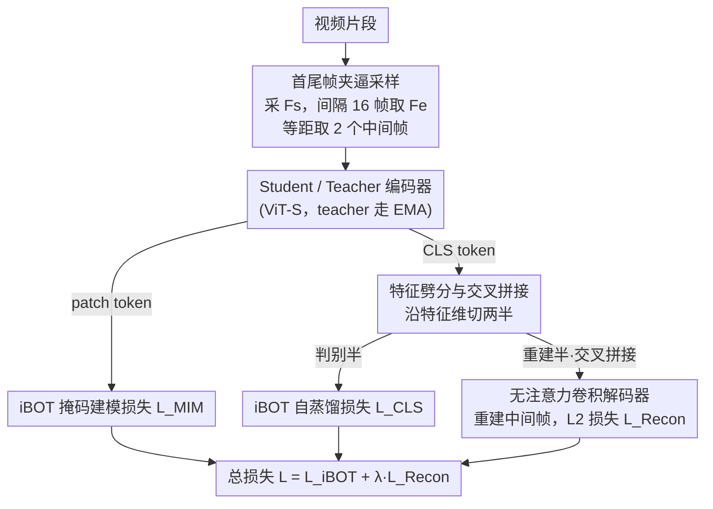

# TimeBridge: Self-Supervised Video Representation Learning via Start-End Joint Embedding and In-Between Frame Prediction

**会议**: CVPR 2026  
**论文**: [CVF Open Access](https://openaccess.thecvf.com/content/CVPR2026/html/Wang_TimeBridge_Self-Supervised_Video_Representation_Learning_via_Start-End_Joint_Embedding_and_CVPR_2026_paper.html)  
**代码**: 未公开  
**领域**: 视频理解 / 自监督学习  
**关键词**: 自监督视频表示, 联合嵌入, 中间帧重建, iBOT, 稠密视频预测

## 一句话总结
TimeBridge 在 iBOT 联合嵌入框架上加一个辅助任务——只给视频的首帧和尾帧，逼模型把中间几帧"补"出来，从而学到帧间真实的时间变换；在 DAVIS、VIP 等稠密视频预测基准上以 400 epoch 训练就刷新了 SOTA（DAVIS 73.5 J&F、VIP 47.5 mIoU）。

## 研究背景与动机

**领域现状**：视频自监督学习（SSL）当前有两条主流路线。一条是**联合嵌入**（joint embedding，如 iBOT/DINO），把同一图像/视频的不同视图在特征空间拉近；另一条是**预测式**（如 VideoMAE、MAE-ST），在像素空间重建被掩码的时空块。有意思的是，纯图像上训练的联合嵌入方法在很多视频基准上反而打平甚至超过专门为视频设计的预测方法。

**现有痛点**：联合嵌入方法天生对"变换本身不敏感"——它只要求两个视图在特征空间接近，并不关心从一帧到另一帧到底发生了什么变换。有人想用图像里那套"等变性约束"（equivariance）把增广变换显式建模进去，但视频里相邻帧之间的变换远比常规数据增广复杂：它是物体、观察者、光场三者之间一种**非线性、非局部**的相互作用，简单的增广等变约束根本兜不住。而掩码自编码那一派（VideoMAE 等）只重建局部块，对这种全局、非局部的场景演化同样力不从心。

**核心矛盾**：要么联合嵌入学不到时间变换，要么预测未来帧——但**预测未来本身是病态问题**（ill-posed），同一对起始状态可以演化出无穷多种合理未来，解空间太大，模型学不出确定的时间动态。

**本文目标**：给联合嵌入方法补上一个能显式捕捉时空对应关系的预测分量，同时避开"预测未来"的病态性。

**切入角度**：作者的关键观察是——**与其预测未来，不如"补中间"**。给定首帧 $F_s$ 和尾帧 $F_e$，去重建它们之间的若干中间帧。这并没有消除病态性，但把解空间大幅收窄：中间帧被两个端点"夹住"，可行解少得多；再多预测几帧还能刻画非线性演化、降低估计方差。

**核心 idea**：用"首尾帧 → 重建中间帧"这个辅助任务，强迫模型学会两端之间真实的时间变换，把它挂在 iBOT 上做视频预训练。

## 方法详解

### 整体框架

TimeBridge 是在 iBOT 自蒸馏框架上**加一条重建支路**。一句话概括整条管线：从视频里采一对相隔固定帧距的首尾帧 → 各自过 student/teacher 编码器拿到 [CLS] token 和 patch token → patch token 走原版 iBOT 的掩码建模损失，[CLS] token 沿特征维**劈成两半**，一半继续走 iBOT 的自蒸馏损失，另一半交叉拼接后喂给轻量解码器**重建中间帧**。最终损失是 iBOT 损失加上重建损失的线性组合。

整个方法的精髓在于：原版 iBOT 那条路保证表示不坍缩、学到语义判别性；新增的重建路逼着 [CLS] token 里编码进"两端之间怎么演化"的时间信息。两条路共用一套编码器，所以时间动态最终被压进了同一份表示里。

### 关键设计

**1. 首尾帧夹逼采样 + 中间帧重建：把"预测未来"换成"补中间"**

这是全篇的立身之本，直接针对"预测未来是病态问题"这个痛点。具体做法：从每个视频片段里随机选一个首帧 $F_s$，固定隔 16 帧取尾帧 $F_e$，再在两者之间等距采若干中间帧（默认 2 帧，落在第 5、10 帧位置）。模型只能看到 $F_s$ 和 $F_e$ 的特征，却要把中间帧重建出来——它必须推断出两端之间的时间演化才能完成任务。

为什么有效：预测未来时解空间无穷大，模型学不到确定动态；而中间帧被两个观测端点"夹住"，可行解被强约束，逼出来的是**具体的帧间变换**而非泛泛的语义。作者还特意预测多帧（而非一帧）来刻画非线性演化、降低估计方差——消融显示 1 帧明显欠拟合（71.3），2~3 帧最佳，再多反而下滑。重建的是**整帧 RGB 图像**（而非掩码 patch 或特征空间表示），这样才能捕捉到场景演化里那种非局部、全局结构性的变化，这也是它和最接近的 T-CoRe（在特征空间重建掩码表示）的根本分野。

**2. 特征劈分与交叉拼接：让两路任务各取所需，又把重建逼得更难**

辅助重建任务不能白占编码器容量，也不能干扰 iBOT 本身的判别学习。作者的处理是把每个 [CLS] token 沿特征维切成两段：$u_i^{cls} = [\hat{u}_i^{cls}, \tilde{u}_i^{cls}]$，前半 $\hat{u}$（维度 $B\times(d-d_{Recon})$）喂给 iBOT 的 [CLS] 自蒸馏损失，后半 $\tilde{u}$（维度 $B\times d_{Recon}$，称"重建 token"）专供中间帧重建。$d_{Recon}$ 经搜索定为 2048——太小重建信息不足，4096 又会挤占 iBOT 损失可用维度、引入冗余过拟合，反而掉点（72.4→70.9）。

更巧的是**交叉拼接**（cross-concatenation）：两个解码器分别吃 $[\tilde{u}_s^{cls}, \tilde{v}_e^{cls}]$ 和 $[\tilde{v}_s^{cls}, \tilde{u}_e^{cls}]$——也就是把 student 的首帧重建特征和 teacher 的尾帧重建特征混搭。对照的"串行拼接"（serial concatenation）是把四个重建 token 拼成一根长向量喂一个解码器。交叉拼接得到的特征向量彼此不同且**单独看是不完整的**，这让重建任务更难，逼编码器学出更丰富、信息量更大的表示。

**3. 无注意力卷积解码器：弱解码器逼出强编码器**

重建支路只是辅助手段，重点是让编码器学好，所以解码器要尽量"弱"。与 MAE 用带自注意力、或 SiamMAE 用交叉注意力的解码器不同，TimeBridge 的解码器**完全不用注意力**：输入先经线性层变成中间隐表示 $d_1$，再过三个上采样块（每块是 UpConv + BatchNorm + ReLU 逐级提分辨率），最后一个 UpConv + BN + Sigmoid 把输出归一化到合理范围，产出 $B\times3\times H\times W$ 的 RGB 帧；每帧与真值算 L2 损失，$L_{Recon}$ 取各帧损失的算术平均。

为什么这样有效：这背后是一个明确假设——**弱解码器需要强特征**，解码器越简单，重建的压力就越多地压回编码器，给编码器更强的学习信号。消融实锤了这一点：换成交叉注意力解码器只有 63.6 J&F、cross-self 注意力 64.4，而纯卷积解码器直接冲到 72.4，差距巨大。

### 损失函数 / 训练策略
总损失 $L = L_{iBOT} + \lambda L_{Recon}$，其中 $L_{iBOT} = L_{MIM} + L_{[CLS]}$（原版 iBOT 的掩码建模 + 自蒸馏），$\lambda$ 经搜索定为 1（$\lambda=0.1$ 时重建信号太弱崩到 36.6，$\lambda=5$ 又压垮 iBOT 损失掉到 56.1）。骨干用 ViT-Small（patch 8 / 16），在 Kinetics-400 上预训练，batch size 512，AdamW 优化、学习率 0.0005 余弦退火到 $10^{-6}$、前 10 epoch warmup，teacher 由 EMA 更新；首尾帧还配合 10 个 96×96 的 multi-crop 增广。

## 实验关键数据

### 主实验：稠密视频下游任务

冻结骨干 + 标签传播，对比 DAVIS（视频物体分割）、VIP（语义部件传播）、JHMDB（人体姿态传播）。本文仅 400 epoch，SiamMAE 需 2000 epoch。

| 数据集 | 指标 | 本文 (ViT-S/8, 400ep) | 之前 SOTA | 提升 |
|--------|------|------|----------|------|
| DAVIS 2017 | J&F | **73.5** | SiamMAE 71.4 (2000ep) | ↑2.1 |
| DAVIS 2017 | J_m | **70.6** | 68.4 | ↑2.2 |
| DAVIS 2017 | F_m | **76.5** | 74.5 | ↑2.0 |
| VIP | mIoU | **47.5** | 45.9 | ↑1.6 |
| JHMDB | PCK@0.1 | 59.2 | SiamMAE 61.9 | ↓2.7 |

ViT-S/16 上对比最接近的 T-CoRe（同为 400ep Kinetics），J&F 提升 2.3%、F_m 提升 3.2%。值得注意的是仅训 **100 epoch**（SiamMAE 的 5%）时，DAVIS、VIP 仍略胜 SiamMAE 满训版，说明方法效率很高。JHMDB 姿态任务上略逊，是本文一致的短板。

### 分类下游任务（线性探测，1-shot 单帧）

| 方法 | 骨干 | UCF101 | Kinetics-400 | HMDB51 |
|------|------|--------|--------------|--------|
| DINO | ViT-S/8 | 80.4% | 45.2% | 42.9% |
| iBOT | ViT-S/16 | 77.7% | 43.4% | 41.5% |
| T-CoRe | ViT-S/16 | 77.1% | 38.4% | 41.6% |
| **本文** | ViT-S/16 | 76.2% | 39.5% | 42.7% |
| **本文** | ViT-S/8 | **81.5%** | **49.2%** | **45.6%** |

MAE 系（DropMAE、CropMAE、RSP）在这种单帧分类协议下几乎崩溃（个位数准确率），说明它们学到的表示高度依赖时序输入；TimeBridge 在 Kinetics 上预训练却能与 ImageNet 预训练的 DINO/iBOT 打平甚至超越，泛化性更好。

### 消融实验（DAVIS 2017，J&F）

| 配置 | J&F | 说明 |
|------|-----|------|
| 1 中间帧 | 71.3 | 欠拟合 |
| **2 中间帧** | 72.4 | 默认（100ep）；400ep 时达 73.5 |
| 3 中间帧 | 72.6 | 100ep 略高，400ep 反降到 73.0 |
| 帧距 16 | 72.4 | 最优；32 掉到 71.2 |
| $d_{Recon}$=2048 | 72.4 | 4096 降到 70.9 |
| $\lambda$=1 | 72.4 | 0.1→36.6，5→56.1 |
| Patch 8 | 72.4 | Patch 16 仅 62.9 |
| 卷积解码器 | **72.4** | 交叉注意力仅 63.6 |

### 关键发现
- **解码器类型影响最大**：无注意力卷积解码器（72.4）碾压注意力解码器（63.6/64.4），印证"弱解码器逼强编码器"假设。
- **patch size 决定上限**：从 16 缩到 8，J&F 从 62.9 暴涨到 72.4；再缩到 7 边际收益消失（71.1），patch 4 算力不可承受。
- **损失权重 $\lambda$ 极其敏感**：偏离 1 太多任一方向都会让某条损失失衡而大幅掉点，说明两路任务需要精细平衡。
- 与 SiamMAE 不同，本文随机采样帧距（4~48）并不带来增益，说明在其设定下盲目扩大时间跨度反而无益。

## 亮点与洞察
- **"补中间"这个 reframing 很漂亮**：把病态的"预测未来"换成被两端夹逼的"插值中间帧"，在不破坏 SSL 无监督性质的前提下大幅收窄解空间——这个思路可迁移到任何需要学时间/序列动态又苦于未来不确定性的任务。
- **交叉拼接"故意制造不完整特征"**：用 student/teacher 跨视图混搭、让每个解码器只拿到残缺信息，把重建难度人为抬高来逼出更强表示，是一个很有借鉴价值的自监督设计 trick。
- **"弱解码器→强编码器"被实验强力背书**：63.6 vs 72.4 的巨大差距，给"SSL 中解码器该轻还是重"这个长期争论提供了清晰证据。
- 整个方法是**即插即用的辅助任务**，理论上可挂到任意联合嵌入框架（DINOv2 等）上，扩展性好。

## 局限与展望
- **姿态传播是明确短板**：JHMDB 上 PCK 一致低于 SiamMAE，作者未深入解释；可能"补中间帧"学到的是物体级演化、对关键点级精确定位帮助有限。
- **只验证了 ViT-S**：未在更大骨干（ViT-B/L）或 DINOv2 全套约束下验证，是否随规模继续领先未知。
- **依赖固定帧距**：随机帧距无益的结论可能与其重建目标耦合，换数据集（运动节奏不同）时帧距 16 是否仍最优存疑。⚠️
- **超参敏感**：$\lambda$、$d_{Recon}$、patch size 都需仔细搜索，迁移到新设置时调参成本不低。
- 作者把"扩展到其他嵌入方法、引入 DINOv2 额外约束"留作未来工作。

## 相关工作与启发
- **vs SiamMAE / VideoMAE（预测式 MAE）**: 它们重建掩码 patch、聚焦局部变换；本文重建整帧、捕捉非局部全局演化，且只需 1/5 训练量就追平甚至超越，在单帧分类上更是碾压（MAE 系几乎崩溃）。
- **vs T-CoRe（最接近的联合+预测混合方法）**: T-CoRe 在**特征空间**重建掩码表示，本文在**图像空间**重建完整时间演化场景，作者论证后者更能刻画场景动态的非局部本质，DAVIS/VIP 上全面领先。
- **vs iBOT（基座）**: 本文就是 iBOT + 一个中间帧重建辅助任务，把"对变换不敏感"的联合嵌入升级成"显式建模帧间时间变换"，是一次干净的能力增量。

## 评分
- 新颖性: ⭐⭐⭐⭐ "补中间帧"替代"预测未来"的 reframing 加交叉拼接设计，思路清晰且少见。
- 实验充分度: ⭐⭐⭐⭐ 稠密+分类双线评测、消融覆盖 6 个维度，但骨干仅限 ViT-S、姿态短板未深究。
- 写作质量: ⭐⭐⭐⭐ 动机推导（病态性→夹逼）讲得很透，方法与图对应清晰。
- 价值: ⭐⭐⭐⭐ 即插即用辅助任务 + 高训练效率，对视频 SSL 实践有直接参考价值。

<!-- RELATED:START -->

## 相关论文

- [\[CVPR 2026\] Progressive Mask Distillation for Self-supervised Video Representation](progressive_mask_distillation_for_self-supervised_video_representation.md)
- [\[CVPR 2026\] Towards Stable Self-Supervised Object Representations in Unconstrained Egocentric Video](towards_stable_self-supervised_object_representations_in_unconstrained_egocentri.md)
- [\[CVPR 2025\] AutoSSVH: Automated Frame Sampling for Self-Supervised Video Hashing](../../CVPR2025/self_supervised/autossvh_exploring_automated_frame_sampling_for_efficient_self-supervised_video_.md)
- [\[CVPR 2026\] TeFlow: Enabling Multi-frame Supervision for Self-Supervised Feed-forward Scene Flow Estimation](teflow_enabling_multi-frame_supervision_for_self-supervised_feed-forward_scene_f.md)
- [\[CVPR 2026\] TrackMAE: Video Representation Learning via Track, Mask, and Predict](trackmae_video_representation_learning_via_track_mask_and_predict.md)

<!-- RELATED:END -->
