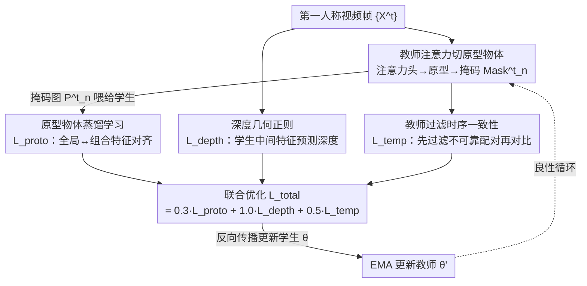

# Towards Stable Self-Supervised Object Representations in Unconstrained Egocentric Video

**会议**: CVPR 2026  
**论文**: [CVF Open Access](https://openaccess.thecvf.com/content/CVPR2026/html/Tan_Towards_Stable_Self-Supervised_Object_Representations_in_Unconstrained_Egocentric_Video_CVPR_2026_paper.html)  
**领域**: 自监督 / 表示学习  
**关键词**: 第一人称视频, 自监督, 物体发现, 时序一致性, 深度正则化

## 一句话总结
EgoViT 用一个师生 ViT 框架，从无标注的第一人称视频里联合优化「原型物体发现 + 深度几何正则 + 教师过滤的时序一致性」三个机制，让无监督物体发现 CorLoc 提升 +8.0%、语义分割 mIoU 提升 +4.8%。

## 研究背景与动机
**领域现状**：人的视觉智能是在第一人称的具身体验中"自监督"长出来的——通过持续观察物体如何移动、遮挡、再出现，我们习得了物体恒存性（object permanence）这类底层概念。但计算机视觉的主流自监督范式（DINO、iBOT、MAE 等）几乎都建立在静态第三人称图像、或受控环境下的短视频片段上，这些数据是"以物体为中心、背景干净、构图居中"的。

**现有痛点**：把这些方法直接搬到无约束第一人称视频（如 Walking Tours 这种边走边拍的长视频）上会失灵。第一人称视频有三个固有难点：密集的物体交互、剧烈遮挡、持续的自我运动（ego-motion）。主流自监督学的是 patch/帧级别的通用对应关系，根本没"物体身份"这个概念，在杂乱场景里没法稳定地把同一个物体跨帧关联起来；而 Slot Attention 这类以物体为中心的方法又假设输入近似静态，被第一人称视频的非平稳性直接破坏；基于运动分组的方法则分不清"物体真在动"还是"相机在动"。传统多目标跟踪（MOT）虽然能跟，但依赖预定义的类别检测器，发现不了新物体。

**核心矛盾**：第一人称视频的"时序丰富性"既是机会也是麻烦——正是不断变化的视角和遮挡，让"维持一致的物体表示"变得极难。现有自监督要么没有物体概念，要么经不起 ego-motion 的折腾。

**本文目标**：在没有任何人工标注的前提下，从无约束第一人称视频里学到**身份一致、跨时间持久**的类别无关物体表示。

**切入角度**：作者把学习焦点从"低层像素对应"转移到"发现并跟踪涌现的原型物体（proto-objects）"。灵感有二：一是 DINO 的注意力头本身就能涌现出物体检测器的功能；二是灵长类视觉系统靠**立体/深度信息**来稳定地建模动态世界。所以作者押注：稳定的物体表示能从外观、深度、时间三种互补信号的联合优化中**涌现**出来。

**核心 idea**：用"原型物体"作为表示单元，让一个动量更新的教师网络去发现并稳定它们，再用深度几何把表示锚定在物理结构上、用教师过滤掉不可靠的时序对应，三者形成一个良性循环（virtuous cycle），把初始的粗糙物体假设逐步打磨成持久表示。

## 方法详解

### 整体框架
EgoViT 是一个**师生（teacher-student）ViT 框架**：学生网络 $g_\theta$ 正常反向传播更新，教师网络 $g_{\theta'}$ 用学生参数的指数滑动平均（EMA）更新，因此始终比学生"更稳"。输入是一段第一人称视频帧 $\{X^t\}_{t=1}^{T}$，输出是端到端训练好的、能迁移到下游任务的物体表示。

整个流程围绕三个协同机制（外观、几何、时间）展开：先让教师用它最后一层的注意力头把每帧切出 $N$ 个"原型物体"掩码并喂给学生（外观）；同时让学生的中间特征去预测一张深度图，把表示锚到几何结构上（几何）；再用教师在时间窗口内过滤掉不可靠的跨帧配对、只在可靠对上做对比学习（时间）。三个损失加权求和后联合优化，构成一个"初始假设→逐步精炼→稳定表示"的循环。

### 关键设计

**1. 教师注意力切原型物体：用免参数的三步法从无标注帧里"凿"出物体候选**

要发现物体，得先有"哪块是物体"的候选区域，但没有标注、没有检测器。作者利用一个观察——ViT 注意力头能涌现出物体检测器的功能——让**动量教师**最后一层的 $N$ 个注意力头各自负责发现一个不同的原型物体（proto-object，指构成复杂场景的、潜在的、时序稳定的视觉基元）。对第 $t$ 帧第 $n$ 个原型，分三步：① **原型合成**——把该头的 query 嵌入 $q^t_n$ 和它的空间注意力图 $A^t_n$ 聚合成头专属的原型特征 $o^t_n = A^t_n \cdot q^t_n$，代表这个头当前在"找什么概念"；② **空间定位**——用 $o^t_n$ 和教师 backbone 输出的每个 patch 嵌入 $e^t$ 做余弦相似度，得到软分配图 $M^t_n = \mathrm{sim}(o^t_n, e^t)$，高亮外观匹配该概念的区域；③ **离散掩码**——用免参数的自适应阈值 $\mathrm{Mask}^t_n = \mathbb{1}(M^t_n > \mathbb{E}[M^t_n])$ 二值化，把高于均值的最显著区域切出来。掩码作用回原图得到 $P^t_n = X^t \odot \mathrm{Mask}^t_n$，再喂给学生编码器得到原型特征 $f_n$。妙处在于：阈值用"超过本图均值"这种动态、无超参的方式，避免了固定阈值在不同场景下失效，整个切割过程不引入任何可学参数。

**2. 原型物体蒸馏学习：让"整体"和"局部之和"在学生里互相对齐，逼出组合性理解**

切出原型只是第一步，还得让学生学到高质量的原型表示。作者用一个知识蒸馏目标 $L_{\text{proto}}$，强制学生内部两种表示一致：从**完整未遮挡输入**得到的全局特征 $f^t$，和从各原型物体特征加权聚合而来的**组合特征** $f^t_{\text{agg}} = \sum_n w^t_n f^t_n$，二者都去对齐教师对完整输入给出的稳定全局目标 $f'^t$。对齐用 softmax 输出间的交叉熵：

$$H(y', y) = -\sum_{i=1}^{C} \mathrm{softmax}\!\left(\frac{y'}{\tau_t}\right)_i \cdot \log \mathrm{softmax}\!\left(\frac{y}{\tau_s}\right)_i$$

其中 $\tau_t, \tau_s$ 是教师/学生温度，控制分布锐度。复合损失为：

$$L_{\text{proto}} = H(f', f) + H(f', f_{\text{agg}})$$

第一项 $H(f', f)$ 保证整体场景理解，第二项 $H(f', f_{\text{agg}})$ 把学习锚到物体级实体上——本质是逼模型学会"从局部零件重建整体理解"，即把组合性（compositionality）写进表示里。这比纯帧级蒸馏（如 DINO 只对齐全局特征）多了一条"局部之和应≈整体"的约束。

**3. 深度几何正则：用一张随手可得的深度图把表示按"物体在哪"锚到物理结构上**

光有外观线索，在持续 ego-motion 和杂乱背景下仍不足以把物体稳定地从背景里剥离。光流虽是经典运动线索，但计算贵、还常常拿不到。受灵长类靠几何感知稳定建模世界的启发，作者加了一个**辅助深度回归任务**：把学生编码器的中间特征 $m^t$ 喂进一个轻量解码器去预测深度图。深度正则损失 $L_{\text{depth}}$ 含两项——一个**尺度不变项**捕捉相对布局，一个**梯度一致项**保住物体边界，从而让优化只关注几何结构本身、忽略不可靠的绝对尺度与平移。关键工程点：训练时用现成单目估计器（Depth-Anything-V2）造伪深度作监督，但**推理时完全不需要任何几何输入**，所以是零额外推理成本的正则。消融里这一项是"协同的胶水"：去掉深度后即便有 P+T，性能也明显回落，因为没有稳定几何锚点，时序学习会被原型物体模糊的外观带偏。

**4. 教师过滤的时序一致性：先让稳定教师把"靠不住的跨帧配对"剪掉，再做对比学习**

把单帧学到的原型跨时间对齐，是第一人称视频最难的部分——遮挡、出框、外观剧变都会制造噪声配对，直接对齐反而有害。作者的创新是：用**稳定的动量教师主动过滤**掉不可靠对应，再喂给学生。对时间窗 $W$ 内任意两帧 $t, t'$（$|t-t'| \le W$）分两步：① **教师一致性过滤**——算教师对第 $n$ 个原型在两帧的特征余弦相似度，超过阈值才保留：$M^{(t,t')}_n = \mathbb{1}(\mathrm{sim}(z'^t_n, z'^{t'}_n) > \epsilon)$，$\epsilon$ 取 0.8（论文称跨数据集鲁棒），这一步把"物体被遮挡/离开画面/外观突变"的脏配对剪掉；② **时序对比**——只在过滤后的可靠对上做 InfoNCE，让学生在 $t'$ 的原型表示 $z^{t'}_n$ 靠近教师在 $t$ 的对应表示 $z'^t_n$（正样本），远离教师在 $t$ 的其它原型（负样本）：

$$L^{(t,t')}_{\text{temp}} = -\frac{1}{|P|}\sum_{n \in P} \log \frac{\exp(\mathrm{sim}(z^{t'}_n, z'^t_n)/\gamma)}{\sum_{k=1}^{K}\exp(\mathrm{sim}(z^{t'}_n, z'^t_k)/\gamma)}$$

其中 $P = \{n \mid M^{(t,t')}_n = 1\}$ 是有效原型集合，$\gamma$ 是温度。消融证明这个"过滤器"是时序自监督能不能用起来的关键：去掉过滤的 proto 级时序对齐 CorLoc 反而从 37.9% 掉到 33.2%，说明无约束视频里直接做时序匹配只会引入噪声。

### 损失函数 / 训练策略
三个机制联合优化：

$$L_{\text{total}} = \lambda_P L_{\text{proto}} + \lambda_D L_{\text{depth}} + \lambda_T L_{\text{temp}}$$

实验中 $\lambda_P, \lambda_D, \lambda_T = 0.3, 1.0, 0.5$。backbone 用从零初始化的 ViT-S/16，AdamW，有效 batch 192，学习率 5e-4 warmup 10 epoch 后 cosine 衰减到 1e-5，权重衰减从 0.04 线性增到 0.4，主模型训 320 epoch，消融用 40 epoch。教师全程 EMA 更新。

## 实验关键数据

### 主实验
所有模型（含 baseline）都在**同一段 65 分钟 WT-Zurich 第一人称视频**上从零自监督预训练，统一协议、统一复现，再在多个下游任务上评测线性探测/迁移性能。

| 任务 / 指标 | DINO (baseline) | DoRA | EgoViT-Zurich | EgoViT 相对 DINO |
|------|------|------|------|------|
| 语义分割 ADE20K mIoU | 21.2 | 21.6 | **26.0** | +4.8 |
| 实例分割 MS-COCO mAP | 20.6 | 20.4 | **24.3** | +3.7 |
| 视频物体分割 DAVIS (J&F)m | 53.8 | 53.8 | **54.3** | +0.5 |
| 无监督物体发现 VOC CorLoc | 37.2 | 24.1 | **45.2** | +8.0 |
| 分类 ImageNet 线性探测 | 30.9 | 29.6 | **34.0** | +3.1 |

用整个 Walking Tours 数据集训练的 EgoViT-WT-all 进一步把 CorLoc 拉到 50.2%、mIoU 拉到 30.6%，说明方法随数据量优雅扩展。长时跟踪 LaSOT 上（OSTrack 框架、只换 backbone），EgoViT 的 AUC 64.7 也明显高于 DINO 60.5、DoRA 61.7。

### 消融实验
| 配置 (D=深度, P=原型, T=时序) | k-NN | CorLoc | 说明 |
|------|------|------|------|
| 全去掉 (≈DINO) | 21.8 | 27.5 | 基线 |
| 仅 D | 22.2 | 34.6 | 深度单独已大幅涨 |
| 仅 P | 22.0 | 35.6 | 原型单独已大幅涨 |
| D+T | 22.5 | **37.9** | 最佳两组件组合 |
| P+T（缺 D） | 22.9 | 35.9 | 缺几何锚点，时序被带偏 |
| Full (D+P+T) | **23.2** | **38.3** | 三者互补，最优 |

| 时序策略 | 粒度 | 帧数 | CorLoc | 说明 |
|------|------|------|------|------|
| D+T 帧级 | Frame | 3 | 34.2 ↓ | 朴素帧级反而掉点 |
| D+T 无过滤 | Proto | 4 | 33.2 ↓ | 不过滤噪声更糟 |
| D+T 完整 | Proto | 4 | **37.9** | 教师过滤 + proto 级才有效 |

### 关键发现
- **深度是"协同胶水"而非简单加项**：P+T 缺了 D 只有 35.9% CorLoc，反而不如 D+T 的 37.9%。作者解释：没有稳定几何锚点"物体在哪"，时序学习会被原型模糊的外观误导。深度提供"where"、原型提供"what"、时序提供"how it persists"，三者缺一不可。
- **教师过滤是时序自监督能用起来的开关**：去掉过滤后 proto 级时序对齐 CorLoc 从 37.9% 掉到 33.2%，比不加时序还差——证实无约束视频里直接做时序匹配只会灌进噪声。
- **对深度质量/来源高度鲁棒**：高斯模糊深度（$\sigma_0$ 从 0.15 到 0.6）、换 MiDaS / Depth-Pro 估计器，CorLoc 都稳在 36–38.6%，说明模型靠的是粗结构线索而非精确几何，这放宽了对深度传感器精度的要求。
- **跨城市/光照稳定**：在 Zurich、Istanbul、Stockholm、Chiang Mai、Kuala Lumpur 五座城市（含黄昏/夜景）的 ~60 分钟视频上训练，k-NN 与 CorLoc 都只有轻微波动。

## 亮点与洞察
- **"原型物体"这个抽象层很聪明**：它既不是像素也不是预定义类别，而是从注意力头里涌现的可复用视觉基元，天然规避了"无检测器就发现不了新物体"和"slot attention 假设静态"两个坑，是把自监督从 patch 级抬到物体级的关键支点。
- **教师身兼三职**：既当原型掩码的"标注器"（切割），又当蒸馏的"稳定目标"（学习），还当时序配对的"裁判"（过滤）。一个 EMA 教师串起三个机制，省去了额外模块，也让"良性循环"自然成立。
- **深度做正则而非输入的设计很实用**：训练借伪深度、推理零几何依赖，等于白嫖了几何先验又不增加部署成本；加上对深度质量的鲁棒性，迁移到真实 RGB-D 或纯 RGB 场景都方便。
- **过滤优先于对比的思路可迁移**：在任何噪声大的时序/跨视图自监督里，"先用稳定网络剪枝不可靠正样本再做对比"都值得借鉴，比硬上对比损失再靠温度硬抗噪声更干净。

## 局限与展望
- **物体数 N 固定且由注意力头数决定**：每帧切 $N$ 个原型，场景里物体数远多于或少于 $N$ 时如何自适应、会不会一个头跟多个物体串味，论文没深入。
- **依赖单目深度估计器的偏置**：虽证明对深度质量鲁棒，但伪深度本身来自预训练估计器，估计器的系统性错误（如透明/反光物体）是否会传导进表示，未验证。
- **早期视觉歧义仍是瓶颈**：作者自承在物体外观模糊的早期阶段表示不稳，并把"引入 LLM 语义线索 / 多视角输入"列为未来方向——说明纯几何+时序在语义层面仍有天花板。
- **评测多为线性探测/迁移**：主结果是冻结 backbone 做下游，未充分展示在真实具身/在线场景里的持久跟踪表现；LaSOT 验证了长时跟踪但仍是离线 benchmark。

## 相关工作与启发
- **vs DoRA**（同样用 ViT 注意力做原型发现）：DoRA 把时序对应主要当作**空间数据增强**（造掩码视图喂给空间一致性损失），时间只是辅助；EgoViT 则引入直接的 proto-to-proto 时序对齐目标 $L_{\text{temp}}$，让**时间本身成为主监督轴**，并用深度正则把它稳住。结果上 EgoViT 在 CorLoc 上把 DoRA 的 24.1% 拉到 45.2%。
- **vs Slot Attention 系**：这类迭代精炼方法假设输入近似静态，被第一人称的非平稳性破坏；EgoViT 不假设静态，靠教师稳定性 + 时序过滤直接面对 ego-motion。
- **vs 运动分组 / 光流方法**：它们分不清物体真运动和相机运动，且光流贵；EgoViT 改用更廉价、传感器易得的深度作几何线索。
- **vs 传统 MOT**：MOT 依赖预定义类别检测器、发现不了新物体；EgoViT 是类别无关的开放世界发现。

## 评分
- 新颖性: ⭐⭐⭐⭐ 「原型物体 + 三机制协同 + 教师过滤时序」的组合在第一人称自监督里是新的，但单个组件（注意力当检测器、深度正则、师生 EMA）多有前作影子。
- 实验充分度: ⭐⭐⭐⭐⭐ 六类下游任务 + 组件/时序/深度三类消融 + 五城市/LaSOT 泛化，统一协议复现 baseline，相当扎实。
- 写作质量: ⭐⭐⭐⭐ 逻辑清晰、图示完整，公式记号偶有缩放符号噪声（缓存 OCR 所致），整体好读。
- 价值: ⭐⭐⭐⭐ 为具身智能"从无标注第一人称视频学持久物体表示"提供了可扩展的范式，+8.0% CorLoc 的提升有说服力。

<!-- RELATED:START -->

## 相关论文

- [\[CVPR 2026\] Finding Distributed Object-Centric Properties in Self-Supervised Transformers](finding_distributed_object-centric_properties_in_self-supervised_transformers.md)
- [\[CVPR 2026\] Progressive Mask Distillation for Self-supervised Video Representation](progressive_mask_distillation_for_self-supervised_video_representation.md)
- [\[CVPR 2026\] TimeBridge: Self-Supervised Video Representation Learning via Start-End Joint Embedding and In-Between Frame Prediction](timebridge_self-supervised_video_representation_learning_via_start-end_joint_emb.md)
- [\[CVPR 2025\] AutoSSVH: Automated Frame Sampling for Self-Supervised Video Hashing](../../CVPR2025/self_supervised/autossvh_exploring_automated_frame_sampling_for_efficient_self-supervised_video_.md)
- [\[CVPR 2026\] TeFlow: Enabling Multi-frame Supervision for Self-Supervised Feed-forward Scene Flow Estimation](teflow_enabling_multi-frame_supervision_for_self-supervised_feed-forward_scene_f.md)

<!-- RELATED:END -->
