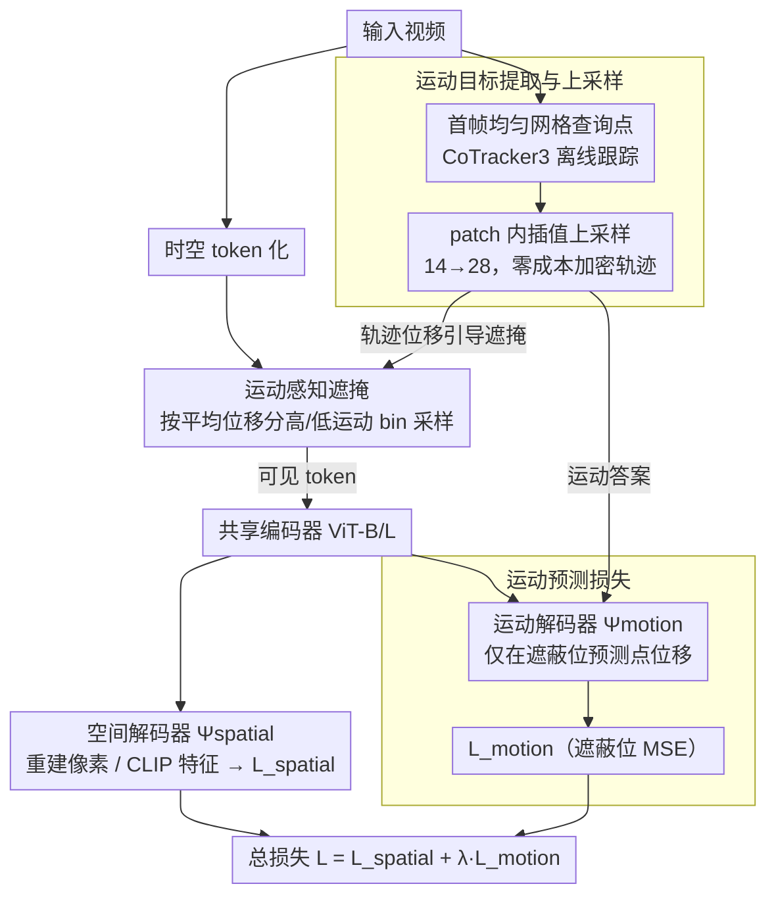

# TrackMAE: Video Representation Learning via Track, Mask, and Predict

**会议**: CVPR 2026  
**arXiv**: [2603.27268](https://arxiv.org/abs/2603.27268)  
**代码**: [https://github.com/rvandeghen/TrackMAE](https://github.com/rvandeghen/TrackMAE)  
**领域**: Self-Supervised Learning / Video Understanding  
**关键词**: Masked Video Modeling, Point Tracking, Motion Prediction, Self-Supervised Pretraining, Video Representation

## 一句话总结

在masked video modeling（MVM）框架中引入显式的运动信号：使用CoTracker3提取点轨迹作为额外的重建目标，并设计运动感知遮掩策略，联合学习空间重建和运动预测，在运动敏感基准（SSv2、FineGym）上显著超越现有视频自监督方法。

## 研究背景与动机

Masked Video Modeling（MVM）已成为简洁高效的视频自监督预训练范式——遮蔽80-95%的时空token后重建可见部分。然而，现有MVM存在核心缺陷：

**运动编码隐式化**：像素重建目标倾向于学习低级外观统计（颜色/纹理连续性），而非时序动态信息。由于视频的强时间冗余，像素重建任务往往通过空间相关性或短程一致性即可"走捷径"

**运动敏感任务表现差**：MVM方法在外观主导的数据集（K400、UCF101）上表现良好，但在需要精细时序建模的SSv2和FineGym上明显落后

**已有改进的局限性**：
   - 改进遮掩策略（如基于光流的遮掩）：仅隐式引入运动信息
   - 改进重建目标（如HOG、DINO、CLIP特征）：编码高级语义但不显式建模运动
   - MME虽使用轨迹信号，但依赖预计算光流、需要复杂预处理且对相机运动敏感

核心主张：**时序对应关系应作为预训练的一等公民信号**，与像素/特征目标互补而非竞争。

## 方法详解

### 整体框架

TrackMAE 想解决的是「像素重建走捷径、运动信号被隐式淹没」的问题，做法是把时序对应关系当成一个显式的、可监督的重建目标塞进标准 MVM。整体怎么转：一段视频先被切成时空 token 并遮掉绝大部分，可见 token 过共享编码器；离线的 CoTracker3 同时从原视频里抽出稀疏点轨迹，作为「运动答案」。解码端不再只有一个头，而是分叉成两个——空间解码器 $\Psi_{spatial}$ 负责把可见区还原成像素或 CLIP 特征，运动解码器 $\Psi_{motion}$ 负责在遮蔽位置预测点的位移轨迹。遮掩本身也不再纯随机，而是按轨迹位移的大小来决定哪些区域被看见。编码器架构完全不动，新增的只是一个轻量运动头和一套基于轨迹的采样规则。

### 关键设计

**1. 运动目标提取与上采样：让点轨迹成为零成本的监督信号**

像素重建之所以学不到时序动态，是因为它没有一个直接描述「怎么动」的标签；TrackMAE 把这个标签补上。具体做法是在首帧铺一张均匀网格查询点（网格边长 $G=H/p$，相当于每个 patch 中心放一个点），用 CoTracker3 把它们跟踪到后续帧，输出形状刻意对齐视频 token：$T/2 \times H/p \times W/p \times 2$，且预测的是帧间位移而非绝对坐标，这样运动头的输出能逐 token 对上监督目标。问题在于密集跟踪的开销与查询网格大小成正比，直接加密点数代价很高。作者的取巧之处是「上采样」：假设一个 patch 内邻近像素运动几乎一致，于是对稀疏轨迹做空间插值（$14\to28$，上采样因子 $\upsilon=2$），等效于每个 patch 跟踪 4 个点，却不增加任何跟踪成本。这个零成本的加密带来了 +1.7%/+1.9% 的提升，而且消融里它甚至优于真正用 56×56 密集网格去跟踪——说明 patch 内运动平滑这一假设确实成立。

**2. 运动预测损失：把轨迹重建做成与像素/特征并列的自监督目标**

有了运动标签，就需要一个目标函数逼着编码器去编码它。运动解码器 $\Psi_{motion}$ 只在被遮蔽的 token 位置预测点轨迹位移，损失也只在这些位置上算：

$$\mathcal{L}_{motion} = \frac{1}{|\mathcal{T}^{masked}|} \sum_{i \in \mathcal{T}^{masked}} \|\mathbf{m}_i - \hat{\mathbf{m}}_i\|_2^2$$

它与原本的空间重建损失线性相加构成总目标 $\mathcal{L} = \mathcal{L}_{spatial} + \lambda \cdot \mathcal{L}_{motion}$。权重 $\lambda$ 要看空间分支用的是什么目标：像素重建时取 $\lambda=1$，而换成 CLIP 特征重建时降到 $\lambda=0.25$，因为特征目标的梯度量级本就更大，不压一下运动项会被盖过。关键的实验观察是运动目标和 CLIP 特征高度互补——CLIP 编码「画面里有什么」，轨迹编码「它怎么动」，两者描述的是正交的信息，所以叠加时增益比与像素目标叠加更大（SSv2s 上 +4.0 vs +3.5）。

**3. 运动感知遮掩：用已有的轨迹信息顺手改掉纯随机 tube masking**

随机 tube masking 对高低运动区一视同仁，常把信息量低的静止背景留给编码器看。既然轨迹已经提取出来了，就可以零成本地复用它来引导遮掩。做法是把每个查询点在时间维度上的平均位移 $\bar{\mathbf{M}}$ 当作采样依据，按位移大小把所有位置切成「高运动」和「低运动」两个 bin，再用一个运动比例 $\rho_{motion}$ 控制从每个 bin 里各保留多少可见 token。默认 $\rho_{motion}=50\%$，即高低运动区等比例采样时最优，偏向任一边都会轻微掉点。这一项不引入任何额外计算（轨迹是现成的），稳定带来约 0.5% 的提升——收益不大，但几乎免费。

### 损失函数 / 训练策略

- 编码器：ViT-B/ViT-L
- 预训练数据：Kinetics-400（ViT-L用K700）
- 预训练800 epochs，遵循VideoMAE超参设置
- CoTracker3：离线模式，14×14网格，上采样因子 $\upsilon=2$
- 特征重建目标使用CLIP ViT-B提取
- 下游评估：线性探测和全量微调两种协议

## 实验关键数据

### 主实验

**线性探测** (Table 1, ViT-B, K400预训练)

| 方法 | 目标 | K400 | HMDB | SSv2 | GYM |
|------|------|------|------|------|-----|
| VideoMAE | Pixel | 20.7 | 37.7 | 17.5 | 23.9 |
| MGMAE | Pixel | 24.9 | 41.3 | 16.8 | 26.1 |
| MGM | Pixel | 19.8 | 40.3 | 21.7 | 25.8 |
| **TrackMAE** | **Pixel** | **25.7** | **40.6** | **23.6** | **29.0** |
| SIGMA | DINO | 47.5 | 52.3 | 20.8 | 30.1 |
| SMILE | CLIP | 56.2 | 53.4 | 23.7 | 30.2 |
| **TrackMAE** | **CLIP** | **55.2** | **53.1** | **27.3** | **31.8** |

运动敏感任务（SSv2、GYM）上TrackMAE大幅领先。

**全量微调** (Table 2)

| 方法 | Backbone | 目标 | SSv2 | K400 |
|------|----------|------|------|------|
| VideoMAE | ViT-B | Pixel | 68.5 | 80.0 |
| SMILE | ViT-B | CLIP | 72.1 | 83.1 |
| **TrackMAE** | **ViT-B** | **CLIP** | **72.8** | **83.9** |
| VideoMAE | ViT-L | Pixel | 74.0 | 85.2 |
| **TrackMAE** | **ViT-L** | **CLIP** | **75.7** | **86.7** |

### 消融实验

**重建目标组合** (Table 3, ViT-S)

| 目标 | K400s | SSv2s | 说明 |
|------|-------|-------|------|
| 仅轨迹 | 46.5 | 53.1 | 轨迹本身即为强信号 |
| 仅像素 | 46.0 | 52.2 | 基线 |
| 像素+轨迹 | 48.9 | 55.7 | 互补增益+2.9/+3.5 |
| 仅CLIP | 52.7 | 57.1 | 语义特征更强 |
| **CLIP+轨迹** | **55.8** | **61.1** | **互补增益+3.1/+4.0** |

**上采样效果** (Table 5)

| 网格大小 | 上采样 | K400s | SSv2s |
|----------|--------|-------|-------|
| 14×14 | 无 | 48.9 | 55.7 |
| 28×28 | 无 | 49.5 | 56.7 |
| 56×56 | 无 | 50.0 | 57.0 |
| 14×14 | 14→28 (υ=2) | **50.6** | **57.6** |

上采样(14→28)甚至优于直接使用56×56密集跟踪，且零额外成本。

### 关键发现

- 轨迹预测作为独立自监督任务已非常有效（46.5 on K400s），可独立编码有用的视频表示
- 运动轨迹与CLIP特征的互补性显著高于与像素目标的互补性（+4.0 vs +3.5 on SSv2s），因为CLIP编码"什么在那儿"而轨迹编码"怎么移动"
- 等比例采样高/低运动区域（ρ=50%）最优，偏向任一方都会轻微下降
- 上采样技巧在零成本下获得了与4×密集跟踪接近的效果，说明patch内运动的平滑性假设成立
- TrackMAE在ViT-L上展示了良好的缩放性质（SSv2: 75.7%, K400: 86.7%）

## 亮点与洞察

1. **运动作为一等公民**：对比MME等方法用光流间接构建轨迹信号，TrackMAE直接使用现代点跟踪器（CoTracker3）提取高质量轨迹，避免预计算光流的复杂预处理和相机运动敏感性
2. **简洁而有效的设计**：整个方法仅增加一个轻量级轨迹解码器和运动感知遮掩，不改变编码器架构
3. **上采样技巧的巧妙性**：利用空间平滑性假设将稀疏轨迹零成本"升密"，性能甚至超过真实密集跟踪
4. **特征目标互补性分析**：CLIP与轨迹的互补性最强（+4.0%），为高层语义 + 运动信号的联合学习提供了有力佐证
5. **完全在线提取**：轨迹从RGB视频在线提取（而非MME的预计算光流），简化了训练流程

## 局限与展望

- CoTracker3的运行开销：虽然采用离线模式和稀疏网格，但仍增加了训练时间
- 仅验证了ViT-B/L，对更大模型（如ViT-H/Giant）和更大数据集的缩放行为未知
- 运动感知遮掩的收益有限（仅约0.5%），可能需要更精细的采样策略
- 首帧初始化查询点的方式可能遗漏在后续帧才出现的物体运动
- 未探索轨迹预测在其他下游任务（如视频目标跟踪、动作定位）上的迁移能力

## 相关工作与启发

- 与SMILE的关键区别：SMILE通过合成运动（copy-paste+随机路径）注入运动感知，TrackMAE使用真实像素运动的轨迹信号
- 与Tracktention的区别：Tracktention将轨迹注入注意力层实现时序一致特征，TrackMAE将轨迹作为重建目标学习运动语义
- CoTracker3的广泛应用趋势：点跟踪器正成为视频理解的通用工具（注意力路由、密集特征学习、自监督预训练）
- 方法思路可推广：任何来自预训练模型的"免费"信号都可作为MVM的辅助预测目标

## 评分

- **新颖性**: ⭐⭐⭐⭐ — 将点轨迹引入MVM预训练直觉清晰，但核心思想较为自然
- **实验充分度**: ⭐⭐⭐⭐⭐ — 覆盖6个基准、线性探测+微调、全面消融、ViT-B/L两种规模
- **写作质量**: ⭐⭐⭐⭐ — 结构清晰，动机分析到位，对比公平
- **价值**: ⭐⭐⭐⭐ — 在运动敏感基准上的提升实质性，CoTracker3成本仍是实用性的主要顾虑

<!-- RELATED:START -->

## 相关论文

- [\[ECCV 2024\] ViC-MAE: Self-Supervised Representation Learning from Images and Video with Contrastive Masked Autoencoders](../../ECCV2024/self_supervised/vic-mae_self-supervised_representation_learning_from_images_and_video_with_contr.md)
- [\[CVPR 2026\] Representation Learning for Spatiotemporal Physical Systems](representation_learning_for_spatiotemporal_physica.md)
- [\[ECCV 2024\] Self-supervised Video Copy Localization with Regional Token Representation](../../ECCV2024/self_supervised/self-supervised_video_copy_localization_with_regional_token_representation.md)
- [\[CVPR 2026\] DiverseDiT: Towards Diverse Representation Learning in Diffusion Transformers](diversedit_towards_diverse_representation_learning_in_diffusion_transformers.md)
- [\[CVPR 2026\] D2Dewarp: Dual Dimensions Geometric Representation Learning Based Document Image Dewarping](d2dewarp_dual_dimensions_geometric_representation_learning_based_document_image_.md)

<!-- RELATED:END -->
