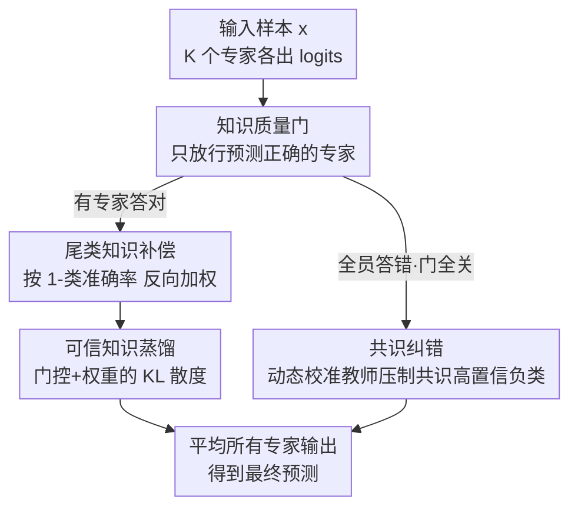

# Trust-calibrated Collaborative Learning for Long-Tailed Visual Recognition

**会议**: CVPR 2026  
**论文**: [CVF Open Access](https://openaccess.thecvf.com/content/CVPR2026/html/Zhou_Trust-calibrated_Collaborative_Learning_for_Long-Tailed_Visual_Recognition_CVPR_2026_paper.html)  
**领域**: 长尾视觉识别 / 多专家协同学习  
**关键词**: 长尾识别, 多专家模型, 互蒸馏, 信任校准, 共识纠错

## 一句话总结
针对长尾识别中多专家「互蒸馏」会把单个专家的错误扩散到全员（偏差传播）、甚至全员一起高置信度认错（错误固化）的问题，本文提出 TCL：用「知识质量门 + 尾类知识补偿」只让预测对的专家传播知识、并放大稀有正确知识，再用「共识纠错模块」检测并压制全员一致看错的高置信负类，把 CIFAR100-LT 的 Top-1 从 57.2% 提到 58.7%。

## 研究背景与动机
**领域现状**：真实世界的数据几乎都是长尾分布——少数头部类占了绝大多数样本，海量尾部类各只有寥寥几张。解决长尾识别主要有三条路：数据层（重采样）、损失层（Focal/LDAM 等重加权/调margin）、模型层（多专家集成）。其中**多专家集成**因为能靠多个互补分类器投票而拿到 SOTA，而专家之间靠**互蒸馏（Mutual Knowledge Distillation, M-KD）**来协作交流，是 SHIKE、NCL、MDCS 等近年最强模型的核心机制。

**现有痛点**：现有多专家方法默认「专家产出的所有知识都是有益的」，于是在互蒸馏时**无差别地**互相传递预测分布。但作者追问：通过互蒸馏传递的知识真的都可靠吗？答案是否定的——互蒸馏会退化成「错误放大器」，引入两个致命问题。其一是**偏差传播（Bias Propagation）**：某个专家在一个尾类样本上预测错了，这条错误知识会通过蒸馏污染其他专家，把偏差扩散到整个集成。其二是**错误固化（Error Consolidation）**：当所有专家不约而同地、且高置信度地把同一个尾类样本预测成同一个错误类时，互蒸馏会强化这个「共识错误」，产生一个**与监督纠正信号方向相反**的误导梯度，与监督损失打架（梯度冲突），让模型陷入「协作死锁」、难以收敛。

**核心矛盾**：互蒸馏带来的「协作收益」和「错误扩散风险」是绑在一起的——你想让专家多交流（提升协作），就不得不容忍错误也跟着一起传。现有方法只享受了前者、没防住后者。

**本文目标**：把多专家协作从「无差别知识传递」升级为「信任校准的协作」，具体拆成两件事——(1) 在蒸馏入口处拦住错误知识、同时别因为拦得太严而饿死本就稀缺的尾类正确知识；(2) 当全员一起认错、门全关上导致死锁时，主动注入一个对齐监督信号的纠正梯度把模型拽回正轨。

**核心 idea**：给互蒸馏装一道「信任阀门」——只有预测正确的专家才有资格传播知识（质量门），并按类准确率反向加权放大稀有正确知识（尾类补偿）；再用一个动态校准教师压制全员共识的高置信负类（共识纠错），把无差别协作变成可信协作。

## 方法详解

### 整体框架
TCL（Trust-Calibrated Collaborative Learning）建立在一个 K 专家（论文用 K=3）多专家骨干上：骨干前几层共享、后几层每个专家独立以保证多样性（沿用 SHIKE 的架构），每个专家 $k$ 输出 logits $z^k$。在普通的监督分类损失之外，TCL 加了两个核心模块串在训练流程里：

1. **可信知识编排（TKO, Trustworthy Knowledge Orchestration）**——管「专家之间怎么传知识」。它先用**知识质量门**判断每个专家这一题答对没有，只让答对的专家往外传；再用**尾类知识补偿**给稀有但答对的类更大蒸馏权重；最后用**可信知识蒸馏**（带门控和权重的 KL 散度）完成专家间协作优化。
2. **共识纠错（CEC, Consensus Error Calibration）**——管「全员一起认错怎么办」。当所有专家都答错、质量门全关导致 TKO 失效时，CEC 检测出那些被全员一致高置信打分的错误类（共识高置信负类），用一个**动态校准教师**把它们的 logits 压下去，产生一个对齐 ground-truth 的「校准梯度」。

最终预测是所有专家输出取平均。整体数据流如下：

### 关键设计

**1. 知识质量门：只让答对的专家有发言权，从源头掐断错误传播**

偏差传播的根源在于现有互蒸馏「无差别」——错的也照样传。质量门（Knowledge Quality Gate, KQG）的做法极其直接：把每个专家变成一个开关，**只有当它在当前样本上预测正确时，它的知识才被允许传给别人**。对样本 $x_i$（标签 $y_i$），专家 $k$ 先算出概率分布 $p_i^k=\mathrm{softmax}(z_i^k)$，再定义正确性指示器：

$$\mathbb{I}_i^k = \begin{cases} 1, & \arg\max(p_i^k) = y_i, \\ 0, & \text{otherwise.} \end{cases}$$

$\mathbb{I}_i^k$ 当作二元开关：答对（=1）门开、知识可传；答错（=0）门关、堵住扩散。这样错误预测就没机会污染其他专家，偏差传播和错误固化在入口处就被截断。它和旧方法最大的区别是把「传不传」从无条件变成了**以答对为前提**，简单但切中要害。

**2. 尾类知识补偿：给稀有但正确的知识加权，别让质量门饿死尾类**

质量门有个副作用：尾类样本本来就答对得少，一加门控，尾类的正确知识参与蒸馏的机会更被压缩了，相当于「越穷越没人理」。补偿机制（Tail-Class Knowledge Compensation, TKC）用**类准确率反向加权**来纠偏——准确率越低的类，蒸馏权重越大，从而放大稀有正确知识的影响力。它维护一份每类准确率的滑动平均 $\alpha_C=\{\alpha_1,\dots,\alpha_C\}$（用指数移动平均更新），类 $c$ 的反向权重先取 $w'_c=\sqrt{1-\alpha_c}$，再归一化使均值为 1：

$$w_c = \frac{w'_c}{\sum_{j=1}^{C} w'_j} \cdot C.$$

这里用平方根是为了**平滑权重分布**——避免给特别难的类一个爆炸性的极端权重而破坏训练稳定性。消融里这个「平滑」很关键：直接用未平滑的反向准确率（InA，范围 [0.46,1.52]）All 只有 58.5%，而平滑版（SInA，范围 [0.67,1.24]）能到 58.7%，权重范围越极端反而越差。

**3. 可信知识蒸馏：把门控和补偿权重一起塞进 KL 蒸馏**

有了门 $\mathbb{I}_i^k$ 和权重 $w_c$，专家间的协作优化通过带权门控的 KL 散度实现。对类别 $c$ 的样本 $x_i$，专家 $k$ 蒸馏给专家 $j$ 的损失为：

$$\mathcal{L}_{TKO}^{k\to j}(x_i) = \mathbb{I}_i^k \cdot w_c \cdot D_{KL}(p_i^k \| p_i^j),$$

总 TKO 损失对所有有序专家对求和 $\mathcal{L}_{TKO}(x_i)=\sum_{k}\sum_{j\neq k}\mathcal{L}_{TKO}^{k\to j}(x_i)$。门 $\mathbb{I}_i^k$ 保证只有答对的专家 $k$ 能往外传，权重 $w_c$ 则增强尾类可靠知识的传播强度——两者合起来既挡住了偏差传播，又给尾类更公平的发声机会。

**4. 共识纠错：当全员一起认错、门全关死锁时，注入对齐监督的校准梯度**

TKO 有个边界情况：当一道难题**所有专家都答错**时，质量门全部关闭，专家间彻底断联，模型卡在「协作死锁」里出不来。CEC（Consensus Error Calibration）专治这个。它先定义**共识高置信负类**——那些平均 logits 超过真实类的非目标类。对样本 $x_i$ 先算 K 个专家的平均 logits $\bar{z}_i=\frac{1}{K}\sum_k z_i^k$，再取集合 $\mathcal{N}_i=\{c \mid c\neq y_i \text{ 且 } \bar{z}_i[c] > \bar{z}_i[y_i]\}$，即「全员一致地把它排在真值前面」的错误类。

接着构造一个**动态校准教师** $\tilde{z}_i^T$，把这些共识负类的 logits 压到平均水平、把目标类压成一个小负数 $\kappa$（设为 -30）、其余保持原样：

$$\tilde{z}_i^T[c] = \begin{cases} \bar{z}_i^{\text{avg}}, & c \in \mathcal{N}_i, \\ \kappa, & c = y_i, \\ \bar{z}_i[c], & \text{otherwise}. \end{cases}$$

其中 $\bar{z}_i^{\text{avg}}$ 是平均 logits 向量的均值。这里用「软压制」（压到均值）而非直接压到最小值，是为了避免优化困难；把目标类设成 $\kappa$ 则是为了**保护真值类的学习不被这次校准干扰**，同时保留其他负类之间原有的竞争关系。每个专家作为学生，也把自己的目标类 logit 设成 $\kappa$、其余保留：$\tilde{z}_i^{S_k}[c]=\kappa$（$c=y_i$）否则 $z_i^k[c]$。教师、学生都过 softmax 后算 KL：$\mathcal{L}_{CEC}(x_i)=\sum_k D_{KL}(\tilde{p}_i^T \| \tilde{p}_i^{S_k})$。

这个损失会产生一个**与监督信号对齐的内部校准梯度**：当集成收敛到一个共识错误时，这个梯度把参数从错误的「一致同意」上推开，打破错误固化、把模型引向正确收敛。消融对比里，直接压到最小值（Cncs-min）只有 58.0%，软压制（CEC）能到 58.7%，验证了软策略的价值。

### 损失函数 / 训练策略
总损失整合三项：监督分类损失、TKO 损失、CEC 损失。分类损失采用带 logit adjustment 的形式以缓解分类偏差：$\mathcal{L}_{CLS}=\sum_k -\log\frac{e^{z_i^k[y_i]+\delta_k\tau_k}}{\sum_j e^{z_i^k[j]+\delta_k\tau_j}}$，其中 $\tau=\log\frac{N}{C}$ 是基于类频率的语义调整，$\delta_k$ 控制每个专家的调整程度。

关键的训练 trick 在 $\delta$ 的选择上：现有方法走两个极端——要么给专家分配差异极大的 $\delta=\{-0.5,1.0,2.5\}$ 强行让它们各管头/中/尾类（伤害蒸馏稳定性），要么统一 Balanced Softmax $\delta=\{1.0,1.0,1.0\}$（限制互补学习）。本文走中间路线，用**轻微差异化**的 $\delta=\{0.9,1.0,1.1\}$，既维持互蒸馏稳定又保留有益多样性。总目标为 $\mathcal{L}_{Total}=\mathcal{L}_{CLS}+\mathcal{L}_{TKO}+\beta\mathcal{L}_{CEC}$，$\beta$ 平衡 CEC 贡献（最优 0.02）。

## 实验关键数据

### 主实验
在 5 个标准长尾 benchmark（CIFAR10/100-LT、ImageNet-LT、Places-LT、iNaturalist 2018）上全面对比，TCL 全部刷到最好。CIFAR100-LT（IF=100）的逐 split 结果：

| 方法 | 多专家 | Many | Medium | Few | All |
|------|--------|------|--------|-----|-----|
| ProCo（单模型，专攻尾类） | × | 70.1 | 53.4 | 36.4 | 54.2 |
| SHIKE† | ✓ | 73.4 | 56.5 | 36.0 | 56.3 |
| MDCS† | ✓ | 72.9 | 56.3 | 33.7 | 55.4 |
| **TCL** | ✓ | **75.5** | **59.3** | **38.3** | **58.7** |

大规模数据集（Top-1 准确率）：

| 方法 | ImageNet-LT (R50) | ImageNet-LT (RX50) | Places-LT | iNat 2018 |
|------|------|------|------|------|
| SHIKE | 59.7 | 59.6 | 41.9 | 75.4 |
| MDCS | 60.7 | 61.8 | 42.4 | 75.6 |
| DO | 60.4 | - | 42.8 | 75.8 |
| **TCL** | **61.6** | **63.0** | **44.2** | **76.9** |

TCL 在 CIFAR100-LT 比上一代 SOTA 多专家 SHIKE/MDCS 高 2.4%/3.3%，且在**尾类（Few=38.3%）上提升最猛**，甚至超过专攻尾类的 ProCo 1.9%；ImageNet-LT 用 ResNeXt-50 比 SHIKE 高 3.4%。

### 消融实验
逐组件消融（CIFAR100-LT IF=100，All 准确率）：

| KQG | TKC | CEC | Many | Medium | Few | All |
|-----|-----|-----|------|--------|-----|-----|
| × (baseline) | × | × | 71.4 | 58.6 | 34.7 | 55.9 |
| M-KD（无差别互蒸馏） | × | × | 73.6 | 57.8 | 35.7 | 56.7 |
| ✓ | × | × | 74.9 | 58.0 | 35.6 | 57.2 |
| ✓ | ✓ | × | 75.8 | 57.7 | 36.2 | 57.6 |
| ✓ | × | ✓ | 75.5 | 58.7 | 36.6 | 58.0 |
| ✓ | ✓ | ✓ (Full) | 75.5 | 59.3 | 38.3 | 58.7 |

### 关键发现
- **无差别互蒸馏（M-KD）的增益是「虚胖」**：从 baseline 55.9% 到 56.7% 看似涨了，但增益全堆在 Many（71.4→73.6）、Medium 反而掉了（58.6→57.8），暴露出它把偏差也一起放大了。换成知识质量门后 Many 还涨、Medium/Few 不再被拖累。
- **CEC 专补尾类**：对比第 4 行（无 CEC）和第 6 行（Full），Few 从 36.2 跳到 38.3（+2.1），是各组件里对尾类贡献最大的——因为全员认错最常发生在尾类样本上，正是 CEC 的主场。
- **软压制 > 硬压制**：CEC 把共识负类压到「均值」（58.7%）优于压到「最小值」Cncs-min（58.0%）；尾类补偿权重也是平滑后的窄范围 SInA[0.67,1.24]（58.7%）优于未平滑的宽范围 InA[0.46,1.52]（58.5%），印证「极端权重伤稳定性」。
- **$\delta$ 差异化要适度**：$\delta=\{0.9,1.0,1.1\}$（58.7%）显著好于强分工 $\delta=\{-0.5,1.0,2.5\}$（56.7%，Few 暴跌到 31.7）和统一 $\delta=\{1.0,1.0,1.0\}$（57.6%）——强行让专家各管一段会牺牲尾类和蒸馏稳定性。
- **$\beta$ 敏感性**：$\beta=0.02$ 最优（58.7%），过大（0.5→56.3，Few 暴跌到 31.2）说明校准信号压过分类主目标会反噬。

## 亮点与洞察
- **把「协作」和「错误扩散」解耦**，是这篇最漂亮的视角：以前大家默认多专家互蒸馏越多越好，本文指出协作收益和错误风险是绑定的，并精准命名了偏差传播 + 错误固化两个失效模式——光这个问题刻画就很有价值。
- **质量门 + 补偿是一对「拮抗设计」**：质量门收紧（只让对的传）必然误伤本就稀缺的尾类正确知识，补偿机制反向加权把它再放回来。一收一放的组合拳，比单独任何一个都稳，体现了「副作用要配套解」的工程思维。
- **CEC 解决的是 TKO 的边界失效**：当门全关、TKO 罢工时，正是错误最顽固的时候，CEC 用动态校准教师把全员共识的错误类按下去——这种「为自己模块的失效兜底」的设计很值得借鉴，可迁移到任何带门控/过滤的协作蒸馏框架。
- **目标类设 $\kappa=-30$ 保护真值学习**是个容易忽略的细节 trick：校准时如果把目标类也跟着搅动，会干扰它本来的学习，置成固定小负数相当于「冻结真值这一维、只动错误类」。

## 局限与展望
- **作者未公开局限**：缓存正文未见专门的局限讨论章节。
- 自己看到的局限：(1) 质量门用 $\arg\max$ 硬判断「答对/答错」，对接近边界的「差一点对」样本是非黑即白的，可能浪费掉「方向基本对、只是没压过头类」的软知识；(2) 整套机制依赖 ground-truth label 来判定正确性和构造校准教师，**只能用于训练阶段的全监督设定**，迁移到半监督/无标注长尾会失效；(3) 每个 batch 要算正确性指示器、维护每类准确率 EMA、检测共识负类集合，相比朴素互蒸馏有额外开销，论文未报训练成本对比；(4) 提升幅度（CIFAR100-LT +1.5~2.4%）扎实但不惊艳，尾类绝对准确率（38.3%）仍偏低，长尾远未被解决。
- 改进思路：把质量门从硬 $\arg\max$ 换成基于置信度/margin 的软门控；把共识负类检测扩展到 top-k 而非「超过真值」这一条线；探索不依赖标签的「自洽性」信号来近似正确性，使方法能用于半监督长尾。

## 相关工作与启发
- **vs SHIKE / NCL（无差别互蒸馏）**：它们证明了互蒸馏对多专家协作的价值，但默认所有知识可靠、无条件互传。本文直接指出这正是偏差传播/错误固化的祸根，给互蒸馏加上信任阀门，在同样的多专家骨干（甚至复用 SHIKE 架构）上把 CIFAR100-LT 从 56.3% 提到 58.7%。
- **vs MDCS / SADE / ACE（多样性/分工路线）**：这些方法靠 logit adjustment 或数据子集让专家各管一段频段来提多样性，但强异质性反而阻碍有效互蒸馏。本文反其道而行——用**轻微** $\delta$ 差异保留多样性的同时**维持蒸馏稳定**，并把重点放在「传得对不对」而非「分得开不开」。
- **vs ProCo / BCL（对比学习单模型）**：它们靠特征空间的对比/重平衡专攻尾类，TCL 作为多专家方法在尾类（Few=38.3%）上反超专攻尾类的 ProCo（36.4%）1.9%，说明「可信协作」这条路对尾类的潜力不输精心设计的对比学习。
- **vs ECL（重加权蒸馏）**：ECL 也想解决知识传递里的不平衡，但仍是「无差别蒸馏 + 重加权损失」，没有从「该不该传」的源头过滤；TCL 的质量门是更彻底的入口管控。

## 评分
- 新颖性: ⭐⭐⭐⭐ 「互蒸馏会放大错误」的问题刻画（偏差传播+错误固化）和「信任校准」的解法视角都很清晰，质量门/补偿/共识纠错三件套互相咬合，但每个单点机制（门控、反向加权、教师压制 logits）本身都不算全新。
- 实验充分度: ⭐⭐⭐⭐⭐ 5 个长尾 benchmark + 多骨干全面刷 SOTA，逐组件/CEC变体/权重/δ/β/专家组合 6 张消融表把每个设计选择都验证到了，论证扎实。
- 写作质量: ⭐⭐⭐⭐ 问题动机讲得很有说服力（配 Fig.1 的 bias propagation / error consolidation 示意），方法公式完整；扣分在未设专门局限讨论、部分公式排版（缓存里）较乱。
- 价值: ⭐⭐⭐⭐ 给多专家长尾识别提供了即插即用、不改骨干就能涨点的可信协作范式，尾类提升明显；对任何用互蒸馏做协作的框架都有「先过滤再传」的方法论启发。

<!-- RELATED:START -->

## 相关论文

- [\[AAAI 2026\] BCE3S: Binary Cross-Entropy Based Tripartite Synergistic Learning for Long-tailed Recognition](../../AAAI2026/self_supervised/bce3s_binary_cross-entropy_based_tripartite_synergistic_learning_for_long-tailed.md)
- [\[CVPR 2026\] Reframing Long-Tailed Learning via Loss Landscape Geometry](reframing_long-tailed_learning_via_loss_landscape_geometry.md)
- [\[NeurIPS 2025\] Long-Tailed Recognition via Information-Preservable Two-Stage Learning](../../NeurIPS2025/self_supervised/long-tailed_recognition_via_information-preservable_two-stage_learning.md)
- [\[CVPR 2026\] Free-Grained Hierarchical Visual Recognition](free-grained_hierarchical_visual_recognition.md)
- [\[CVPR 2026\] CUE: Concept-Aware Multi-Label Expansion to Mitigate Concept Confusion in Long-Tailed Learning](cue_concept-aware_multi-label_expansion_to_mitigate_concept_confusion_in_long-ta.md)

<!-- RELATED:END -->
