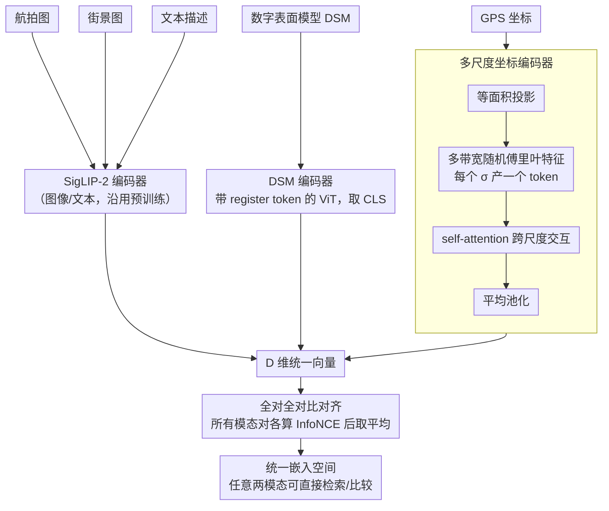

# UniGeoCLIP: Unified Geospatial Contrastive Learning

**会议**: CVPR 2026  
**arXiv**: [2604.11668](https://arxiv.org/abs/2604.11668)  
**代码**: [https://gastruc.github.io/unigeoclip](https://gastruc.github.io/unigeoclip)  
**领域**: 自监督  
**关键词**: 地理空间表示学习, 对比学习, 多模态, 坐标编码, 统一嵌入空间

## 一句话总结
UniGeoCLIP 首次通过纯对比学习将五种互补的地理空间模态（航拍图、街景图、数字表面模型、文本、GPS 坐标）对齐到统一嵌入空间，并提出多尺度坐标编码器提升空间表示能力。

## 研究背景与动机

**领域现状**：地理空间表示学习分三种范式——嵌入场（坐标→向量）、多模态融合（多传感器→单一表示）、对比对齐（如 GeoCLIP/SatCLIP 对齐坐标和卫星图）。

**现有痛点**：(1) 嵌入场是静态快照无法建模动态；(2) 融合模型将所有模态压缩为单一表示，无法跨模态检索/比较；(3) 现有对比方法只对齐两种模态（通常是坐标+卫星图），忽略了文本、街景、地形等重要模态。

**核心矛盾**：不同地理空间模态提供互补信息（航拍看布局、街景看立面、地形看高程、文本描述语义），但缺乏将它们统一到同一空间的框架。

**核心 idea**：全对全对比学习——五种模态互相对比（非通过中心 pivot），构建真正统一的嵌入空间。加上新的多尺度坐标编码器克服原始坐标嵌入的表达瓶颈。

## 方法详解

### 整体框架
UniGeoCLIP 想做的事是把同一个地点的五种异质观测——航拍图、街景图、数字表面模型（DSM）、文本描述、GPS 坐标——压进同一个 $D$ 维空间，让它们彼此之间都能直接检索和比较。做法上，每种模态先各自过一个专属编码器（图像和文本沿用 SigLIP-2 的编码器，DSM 用一个独立的 ViT，GPS 坐标用新设计的多尺度编码器），把它们都映射成同一维度的向量；然后不挑"主模态"，而是让所有模态两两之间都做对比对齐。训练完成后，任意两种模态的嵌入落在同一空间里，可以直接算相似度。

### 关键设计

**1. 全对全对比对齐：不靠 pivot，每对模态都直接对齐**
像 ImageBind 这类多模态对齐方法通常选一个"中心模态"（往往是图像）当 pivot，其他模态都只跟它对齐，间接获得彼此的可比性。问题是一旦 pivot 模态本身质量差，误差会级联传染给所有挂在它下面的模态——在地理空间场景里图像未必是最可靠的锚点。UniGeoCLIP 干脆取消 pivot：对每个 batch，把五种模态的 $D$ 维嵌入两两配对，对每个有序方向 $m\mapsto n$（以 $f^m$ 为锚点、在 batch 内检索匹配的 $f^n$）都算一个 InfoNCE 损失，再对所有模态对取**平均**（统一权重，$\frac{1}{M^2}\sum_{(m,n)}\mathcal{L}_{m\mapsto n}$）一起优化。这样任意两种模态（哪怕是 DSM 和文本这种从不经过图像中转的组合）都被显式拉到一起，嵌入空间是"全连通"而非"星型"的，弱模态不再受单一锚点的好坏牵制。

**2. 多尺度坐标编码器（Scaled Lat-Lon Encoder）：让坐标同时表达大洲级和街区级结构**
经纬度直接编码的老问题是尺度单一：随机傅里叶特征的带宽 $\sigma$ 一旦定死，低 $\sigma$ 只能捕获大尺度的缓慢变化、高 $\sigma$ 只能捕获街区级的高频细节，二选一。这里先用等面积投影把经纬度映射到平面（消除高纬度的面积畸变），再用一组带宽各异的随机傅里叶特征矩阵分别编码，每个 $\sigma$ 产出一个 token——低频 token 管大洲/区域级结构，高频 token 管街区级结构。这些 token 经过 self-attention 做跨尺度交互（而不是简单拼接），让不同尺度的信息互相参考，最后平均池化成 $D$ 维嵌入。效果上等价于给坐标搭了一座多尺度金字塔，一次覆盖从大洲到街区的全部空间频率。

**3. DSM 编码器：补上其他模态看不到的高程几何**
航拍和街景都是 RGB 投影，本质上丢掉了垂直方向的几何，而数字表面模型（DSM）恰好记录了地形和建筑的高程。由于没有现成的大规模 DSM 预训练权重可借，这里从头训练一个带 register token 的 ViT，取 CLS token 作为该模态的嵌入。register token 用来吸收全局信息、避免高范数伪影污染 patch 表示，让单个 CLS token 能更干净地概括整张高程图。

### 损失函数 / 训练策略
训练目标是对所有有序模态对的 InfoNCE 损失取平均：$\mathcal{L}=\frac{1}{M^2}\sum_{(m,n)\in\mathcal{M}^2}\mathcal{L}_{m\mapsto n}$，其中 $\mathcal{L}_{m\mapsto n}$ 用余弦相似度和温度 $\tau$ 的标准 InfoNCE，负样本取自同 batch 内其他位置的样本——各对采用**统一权重**，不需要逐对调权。初始化上，图像和文本编码器从 SigLIP-2 权重接力，DSM 和 GPS 编码器从头训练。
> ⚠️ 温度 $\tau$、$\sigma_k$ 的取值与数量 $K$、self-attention 块数 $B$ 等超参以原文为准。

## 实验关键数据

### 主实验

| 任务 | 指标 | UniGeoCLIP | 单模态对比 | 提升 |
|------|------|------------|-----------|------|
| 土地利用分类 | Acc | 提升 | GeoCLIP/SatCLIP | 一致优 |
| 跨模态检索 | Recall@K | 大幅优 | 单对方法 | 新能力 |
| 社会经济推断 | R² | 提升 | 坐标基线 | 显著 |

### 消融实验

| 配置 | 分类精度 | 说明 |
|------|---------|------|
| 5 模态全对全 | 最优 | 完整模型 |
| Pivot (仅通过图像) | 次优 | 间接对齐损失 |
| 2 模态 (坐标+航拍) | 下降 | 信息不完整 |
| 单尺度坐标编码 | 下降 | 空间分辨率受限 |

### 关键发现
- 五模态联合对齐一致优于两两对齐的简单组合
- 全对全 vs pivot 对齐差距在弱模态（如 DSM）上最为明显
- 多尺度坐标编码器在地理定位任务上显著优于标准傅里叶特征

## 亮点与洞察
- **真正的统一嵌入空间**：任意模态组合都可以直接比较和检索，这是单纯融合模型无法做到的
- **多尺度坐标编码**：用 self-attention 实现跨尺度信息交互，比简单拼接更优雅

## 局限与展望
- 需要所有五种模态共定位的训练数据
- 时间维度未被建模
- 未来可扩展到时序卫星图像和动态监测

## 相关工作与启发
- **vs GeoCLIP/SatCLIP**: 仅对齐坐标和一种图像，UniGeoCLIP 对齐五种模态
- **vs ImageBind/UniBind**: 依赖 pivot 的间接对齐，UniGeoCLIP 全对全

## 评分
- 新颖性: ⭐⭐⭐⭐ 首次五模态地理空间对比学习
- 实验充分度: ⭐⭐⭐⭐ 多种下游任务评估
- 写作质量: ⭐⭐⭐⭐ 框架清晰
- 价值: ⭐⭐⭐⭐ 为地理空间 AI 提供了通用表示基础

<!-- RELATED:START -->

## 相关论文

- [\[NeurIPS 2025\] Self-Supervised Contrastive Learning is Approximately Supervised Contrastive Learning](../../NeurIPS2025/self_supervised/self-supervised_contrastive_learning_is_approximately_supervised_contrastive_lea.md)
- [\[CVPR 2025\] UniSTD: Towards Unified Spatio-Temporal Learning Across Diverse Disciplines](../../CVPR2025/self_supervised/unistd_towards_unified_spatio-temporal_learning_across_diverse_disciplines.md)
- [\[ICML 2026\] Statistical Consistency and Generalization of Contrastive Representation Learning](../../ICML2026/self_supervised/statistical_consistency_and_generalization_of_contrastive_representation_learnin.md)
- [\[ICLR 2026\] Maximizing Incremental Information Entropy for Contrastive Learning](../../ICLR2026/self_supervised/maximizing_incremental_information_entropy_for_contrastive_learning.md)
- [\[ICLR 2026\] Difficult Examples Hurt Unsupervised Contrastive Learning: A Theoretical Perspective](../../ICLR2026/self_supervised/difficult_examples_hurt_unsupervised_contrastive_learning_a_theoretical_perspect.md)

<!-- RELATED:END -->
