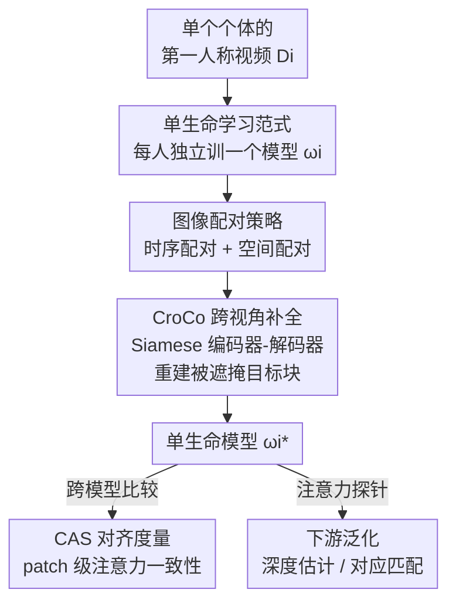

# Unique Lives, Shared World: Learning from Single-Life Videos

**会议**: CVPR 2026  
**论文**: [CVF OpenAccess](https://openaccess.thecvf.com/content/CVPR2026/html/Han_Unique_Lives_Shared_World_Learning_from_Single-Life_Videos_CVPR_2026_paper.html)  
**代码**: 无（项目页 https://sites.google.com/view/learn-from-single-life）  
**领域**: 自监督 / 表示学习  
**关键词**: 单生命学习、第一人称视频、跨视角补全、几何表示、表示对齐

## 一句话总结
只用「一个人一辈子（实际是几小时到 38 小时）的第一人称视频」就能自监督训练出一个几何感知的视觉编码器，论文进一步发现不同人各自独立训练出来的模型会收敛到高度一致的几何表示，并且这种「单生命」表示能迁移到深度估计等下游任务、性能与同等时长的多样网络视频不相上下。

## 研究背景与动机

**领域现状**：当下视觉表示学习的主流信条是「规模 + 多样性」——把来自互联网各处、互不相关的海量图片/视频聚合起来训练一个通用编码器（DINOv2、CLIP 等），并以此获得强泛化能力。

**现有痛点**：这种范式和生物的学习方式截然不同。人和动物并不是从一堆随机采样、来源不相干的图像里学习，而是从「自己亲身经历」这一条高度冗余、连续的视觉流里学。这条流里同一个场景被反复、从不同角度看到，但它窄、单调、来自单一个体。主流方法从没认真问过：单一个体的一段经历，到底够不够学出一个好的视觉表示？

**核心矛盾**：「数据多样性」被默认成不可或缺的前提，而个体经历被认为太狭窄。但作者指出一个被忽视的事实——虽然每个人的视觉经历各不相同，它们却都源自、且受制于同一个物理世界：3D 欧氏几何、物体恒存性这些结构性属性，会在所有视觉数据上留下一致的烙印。换句话说，多样性也许不是几何学习的必要条件，**共享的世界结构**才是真正的信号源。

**本文目标**：提出并验证「单生命（single-life）学习范式」——只用一个人的第一人称视频训练一个独立模型，然后回答两个问题：(i) 不同人各自独立训出的模型，几何理解是否一致（对齐性）；(ii) 单生命模型能否泛化到没见过的环境和下游几何任务（泛化性）。

**切入角度**：作者受两点启发。其一是 Platonic Representation Hypothesis（柏拉图表示假说，大模型在网络尺度数据上会收敛到对现实的同一种表示），作者把它收窄成 **Shared World Hypothesis（共享世界假说）**：既然所有「生命」都扎根于同一物理现实，那么从各自经历里学到的几何表示就应当收敛到功能上相似的结构。其二是婴儿在学会语义之前就已经发展出几何感知和 3D 空间意识——这暗示几何表示可以在「无语言监督」下从原始视觉经历里长出来。

**核心 idea**：用一段第一人称视频里**自然出现的多视角**作为自监督信号（跨视角补全），单独为每个人训一个模型；不靠数据聚合，而靠「同一个世界的共享几何」来获得一致且可泛化的表示。

## 方法详解

### 整体框架
论文的「方法」其实是一套研究框架，而非一个新网络。它的输入是某一个个体 $i$ 的第一人称视频集合 $D_i$（一个「life」），输出是一个独立训练的视觉编码器 $f_{\omega_i}$；再在多个个体上重复，得到一组互不共享数据、各自从随机初始化训出的模型 $\{\omega_1^*,\dots,\omega_n^*\}$。整条 pipeline 是：从单生命视频里**采样图像对** → 用 **CroCo 跨视角补全**目标自监督训练编码器 → 得到单生命模型 → 一路用提出的 **CAS 指标**度量不同模型之间的几何对齐、另一路用注意力探针评估下游泛化。

形式化上，每个个体单独优化自己的一套参数，互不聚合：

$$\omega_i^* = \arg\min_{\omega_i} \mathcal{L}(f_{\omega_i}, D_i).$$

这与「聚合一切来源训一个通用模型」的主流范式形成直接对照。

### 关键设计

**1. 单生命学习范式：把「一个人的一段经历」当作自给自足的数据源**

主流自监督的隐含前提是数据必须多样，而作者要正面挑战这个前提。范式的定义很干净：一个「life」就是某个个体采集到的第一人称视频流 $D_i$（连续流不一定有，就用同一个人拍的视频集合代替）；对每个个体从随机初始化单独训一个模型，绝不跨个体聚合数据。这样得到一组**互不重叠、各自独立**的模型，才能干净地回答「对齐」和「泛化」两个问题——如果模型之间出现一致性，那一定来自世界本身的共享结构，而不是来自共享的训练数据。这一点和此前「从视频流学习」的工作（如小批量、按帧序学习）的关注点不同：作者**不关心**在线、连续、按时间顺序的学习过程，只关心「单一生命这一份数据是否足够」以及「不同生命学到的表示有多像」。

**2. CroCo 跨视角补全：用第一人称视频里天然的多视角当几何监督信号**

要从第一人称视频里学几何，需要一个能利用「同一场景多视角」的目标。作者直接采用 CroCo（Cross-View Completion）这一被验证擅长学几何的自监督目标，但**关键改动在数据来源**：不再用合成、精心策划的海量图像对，而是用单个个体视觉经历里采到的图像对。架构是 Siamese 编码器-解码器 Transformer：给一对源图 $x_s$ 和目标图 $x_t$，都切成不重叠的 patch，目标图按高比例随机遮掩、只留少量可见块 $\tilde p_t$；权重共享的 ViT 编码器分别编码 $z_s = E_\omega(p_s)$ 和 $z_t = E_\omega(\tilde p_t)$；解码器里目标特征（加 mask token）作为 query $Q$、源特征作为 $K,V$ 做交叉注意力来重建被遮掩的目标块 $\hat p_t = D_\varepsilon(z_s, z_t)$，端到端用像素 MSE 优化：

$$\mathcal{L}_{\text{CroCo}} = \lVert \hat p_t - p_t^{\text{masked}} \rVert^2.$$

之所以有效：要补全另一视角下被遮掩的内容，模型必须真正理解两视角之间的 3D 空间变换，这天然逼出几何对应能力；而这个交叉注意力图在第 4 个设计里又被复用来度量模型间对齐，一举两得。作者也引用 ZeroCo 的发现——跨视角补全在对应任务上明显强于 DINOv2 这类对比方法，说明它「编码了更丰富的几何信息」。

**3. 时序 + 空间双配对策略：把真实第一人称视频里嘈杂的视角变化转成可学的图像对**

CroCo 的成败系于图像对的质量：两视角无重叠则任务退化为单图重建，完全相同又变得平凡。可真实第一人称视频带来两个麻烦——视角不是均匀采样的（只覆盖人活动时的功能子集），且场景本身是动态的（物体移动、光照变化），模型必须学会区分「几何视角变化」和「外观/动态变化」。作者用两路信号配对来对症下药。**时序配对**利用视频的连续性：时间上邻近的帧大概率有非平凡的视角重叠，无需任何额外标注，且首次被用到长程第一人称视频上。**空间配对**则受**本体感觉（proprioception）**启发——生物即使隔了很久也能凭身体位姿意识到「我在从另一个角度看同一个场景」；作者用相机位姿和 3D 点云（有的话）来找这种帧对，具体以两帧可见 3D 点云之间的 **Jaccard 指数**衡量重叠度来筛选。实验证实两者并集最强（正如人类同时整合连续运动和大幅度视角变化的识别），但仅凭随手可得的时序配对就已经相当有效。

**4. Correspondence Alignment Score（CAS）：一个免训练、patch 级的模型对齐度量**

要验证「不同生命训出的模型是否收敛到一致几何理解」，需要一把不依赖额外训练、还能捕捉**局部几何对应**的尺子。已有的跨模型相似度（如基于互最近邻的 Platonic 指标）把整张图当作一个实例比较，对几何/局部关系不敏感。作者把互 $k$ 近邻分数扩展到 patch 级：对每个模型，把解码器各层交叉注意力按 $A = \frac{1}{d}\sum_{b=1}^{d} q_b^\top k_b$ 聚合成跨注意力图 $A_i, A_j \in \mathbb{R}^{N\times N}$；对源图里每个 patch $p$，取目标图中注意力最高的 top-$k$ 集合 $\text{TopK}_{A_i}(p)$，两个模型的互对应比例为

$$\text{MTopK}_{A_i,A_j}(p) = \frac{1}{k}\,\lvert \text{TopK}_{A_i}(p) \cap \text{TopK}_{A_j}(p) \rvert.$$

CAS 再在测试图对集合 $T$ 和所有 patch 上平均：

$$\text{CAS}(\omega_i^*, \omega_j^*) = \frac{1}{|T|}\sum_{(x_s,x_t)\in T}\frac{1}{N}\sum_{p=1}^{N}\text{MTopK}_{A_i,A_j}(p).$$

CAS 取值 $0$（无对齐）到 $1$（完全对齐），继承了 $k$-nn 指标的对称性、对注意力数值变化的鲁棒性、以及免训练等性质；与旧的整图级相似度相比，它对「不同模型在图像间诱导出的 patch 级关系」敏感，因此更适合度量几何/局部的模型对齐。这把尺子本身就是论文的一个独立工具贡献。

### 损失函数 / 训练策略
训练目标只有 CroCo 的像素重建 MSE（见设计 2 公式）。数据上共训练 **20 个单生命模型 + 5 个对照模型**；下游评估时在冻结编码器上接一个轻量单注意力块作 readout（attentive probing），深度任务默认用这种探针协议而非全量微调。

## 实验关键数据

### 主实验：单生命 vs 同等/多样数据基线

| 任务 / 设定 | 指标 | 单生命模型 | 对照（多样数据） | 结论 |
|--------|------|------|----------|------|
| 与 CroCo 公开 checkpoint 对齐（CAS） | CAS↑ | 临界 30 分钟~2 小时后强对齐 | K400 30h 为上界 | 单生命逼近多样数据上界 |
| 非生命视频（LaTeX 录屏 / 固定室内 / 监控 / Minecraft）对齐 | CAS↑ | 近乎为零 | — | 仅「长视频」不够，第一人称视角才是关键 |
| NYU-Depth-v2 深度（30h ALD vs 30h K400） | $\delta_1$↑ | ALD 持平甚至反超 | 同尺寸 K400 | 30h 单生命 ≈ 30h 多样数据 |
| HPatches 零样本对应 | AEPE↓ | ALD 持平/反超 | 同尺寸 K400 | 几何对应同样有竞争力 |
| ScanNet 深度（更难、位姿多样） | AbsRel↓ | WT 一小时内与之持平 | K400 占优 | 困难基准上多样数据仍有优势 |

注：完整 K400（约 850 小时）设定了性能天花板，但仅 30 小时的单一 ALD 生命已能与 30 小时 K400 打平。⚠️ 论文主要以折线图（Fig.4/7/8/9）呈现，上表数字为对其文字结论的归纳，具体数值以原文图为准。

### 配对策略消融

| 配对策略 | 相对 Augmented Pairing 的深度增益 | 说明 |
|------|---------|------|
| 空间 + 时序并集 | 最高 | 整合连续运动 + 大幅视角变化，最强 |
| 时序配对（单用） | 次高、且非常稳 | 无需任何标注，随手可得却很有效 |
| 空间配对（单用） | 正增益 | 依赖位姿/点云的 Jaccard 重叠筛选 |
| 随机配对 | 接近/略超基线 | ALD 上意外有效（人常长时间停同一处，随机也撞上重叠视角） |
| Augmented Pairing | 0%（基线） | 同图 2D 变换造对，缺真实视角变化 |

### 关键发现
- **对齐有「临界时长」**：与 CroCo 对齐在大约 30 分钟（Walking Tours）、1 小时（ALD）、2 小时（HD-Epic）后才显著涌现；WT 因 CroCo 多训于户外场景而对齐最快——这是 Shared World 假说的直接证据。
- **第一人称视角是必需品，不是「长视频」**：非生命对照视频（录屏、固定监控、游戏画面）对齐近零，说明仅有时长和连续性不够，必须有人移动、交互带来的特征性运动与视角。
- **同环境模型聚成簇**：CAS 矩阵呈块对角结构、MDS 投影里模型按数据集聚类（室内厨房 vs 户外漫步各成一团），而 30h K400 落在各簇中心——说明所有生命学到共享几何基础，但领域属性也会留下各自的烙印。
- **对齐与泛化强相关**：对齐得分高的模型往往下游泛化也好，二者的 scaling 趋势一致，互为佐证。
- **不限于 CroCo**：换成 DINOv2（对比式、单图掩码+蒸馏）在单生命上同样学到可泛化几何表示——NYU-Depth-v2 上 DINOv2 $\delta_1=0.562\pm0.026$ 略高于 CroCo 的 $0.538\pm0.001$，但 HPatches 上 CroCo（AEPE $19.4\pm0.38$）反超 DINOv2（$21.2\pm4.16$），说明范式与具体自监督结构解耦。

## 亮点与洞察
- **把「数据多样性」从必要条件降级为加速器**：最颠覆的洞察是——多样数据只是让学习「起步更快」，而单一长程生命里密集、结构化的信号足以学到同样好、甚至更细腻的几何先验。这直接质疑了「规模+多样性」教条。
- **复用注意力图一物两用**：CroCo 解码器的交叉注意力既是训练时的几何监督通道，又被原封不动拿来构造 CAS 度量模型对齐——不需要额外探针或训练就能比较两个独立模型，这个设计很省且自洽。
- **本体感觉启发的空间配对**：把「人凭身体位姿知道自己换了角度看同一场景」翻译成「用相机位姿+点云 Jaccard 重叠筛帧对」，是一个把认知科学直觉落到工程指标上的漂亮转译。
- **可迁移思路**：CAS 这种 patch 级、免训练的对齐度量，可推广到任何需要比较两个独立视觉模型「局部几何一致性」的场景（如评估不同预训练 checkpoint 是否学到同一套对应关系），不限于单生命设定。

## 局限与展望
- **「单生命」目前仍是概念性的**：作者自承最长 38 小时仍比人一辈子的完整视觉经历短几个数量级，范式只是「可行性验证」，尚未真正逼近「一个人一生」的规模。
- **只覆盖几何/结构任务**：实验集中在深度估计、对应匹配等几何任务，没有验证语义表示（识别、检测）——而几何恰是婴儿早于语义学会的部分，语义能否同样从单生命里长出来是开放问题。
- **困难基准上仍输给多样数据**：在 ScanNet 这种位姿/环境高度多样的基准上，K400 多样数据仍有明显优势，说明单生命对「分布外几何多样性」的覆盖还不够。
- **依赖额外传感信号做空间配对**：空间配对要相机位姿和 3D 点云（来自 Aria 眼镜等多传感平台），在没有这类标定的普通第一人称视频上只能退回时序配对。
- **改进方向**：扩大单生命规模、探索语义表示的涌现、以及系统比较哪种自监督结构最擅长从多视角学几何。

## 相关工作与启发
- **vs DoRA**：DoRA 同样从单条长视频学，但用激进数据增强 + IID 采样学**语义**表示（分割/检测），不学几何、也不比较不同视频间的表示；本文反过来聚焦几何、并首次正面研究「不同生命的表示有多像」。
- **vs CroCo / Siamese MAE**：本文沿用它们的跨视角补全架构，但把数据从合成/精选的网络尺度图像对，换成单个个体第一人称视频里采的对——核心改动在「数据从哪来」而非网络本身。
- **vs Platonic Representation Hypothesis**：柏拉图假说讲网络尺度大模型收敛到统一现实表示；本文把它收窄成 Shared World 假说，证明即使在「单人有限数据」这种极端受限设定下，独立模型也会因共享世界几何而收敛。
- **vs 第一人称视频几何工作（ego-motion / 相机估计）**：以往主要做轨迹/相机估计，目标是预测运动；本文把第一人称流当作学**可泛化特征表示**的自监督信号源，目标完全不同。

## 评分
- 新颖性: ⭐⭐⭐⭐⭐ 提出全新的「单生命学习」范式 + Shared World 假说 + patch 级免训练对齐度量 CAS，问题设定本身就很原创。
- 实验充分度: ⭐⭐⭐⭐ 20 个单生命 + 多对照、跨室内外三套数据、对齐与泛化双维度、还验证了 DINOv2 通用性；但多以折线图呈现、缺少更硬的语义任务覆盖。
- 写作质量: ⭐⭐⭐⭐⭐ 用「问题-回答」串起实验，假说-证据链条清晰，CAS 定义严谨。
- 价值: ⭐⭐⭐⭐⭐ 若可扩展，将冲击「规模+多样性」教条，对具身学习、模型个性化、低数据régime表示学习有方向性意义。

<!-- RELATED:START -->

## 相关论文

- [\[CVPR 2026\] SECOS: Semantic Capture for Rigorous Classification in Open-World Semi-Supervised Learning](secos_semantic_capture_for_rigorous_classification_in_open-world_semi-supervised.md)
- [\[CVPR 2026\] VT-Intrinsic: Physics-Based Decomposition of Reflectance and Shading using a Single Visible-Thermal Image Pair](vt-intrinsic_physics-based_decomposition_of_reflectance_and_shading_using_a_sing.md)
- [\[CVPR 2026\] Beyond the Static World: Continual Category Discovery under Visual Drift](beyond_the_static_world_continual_category_discovery_under_visual_drift.md)
- [\[CVPR 2025\] CheXWorld: Image World Modeling for Radiograph Representation Learning](../../CVPR2025/self_supervised/chexworld_exploring_image_world_modeling_for_radiograph_representation_learning.md)
- [\[ICML 2025\] AdaWorld: Learning Adaptable World Models with Latent Actions](../../ICML2025/self_supervised/adaworld_learning_adaptable_world_models_with_latent_actions.md)

<!-- RELATED:END -->
