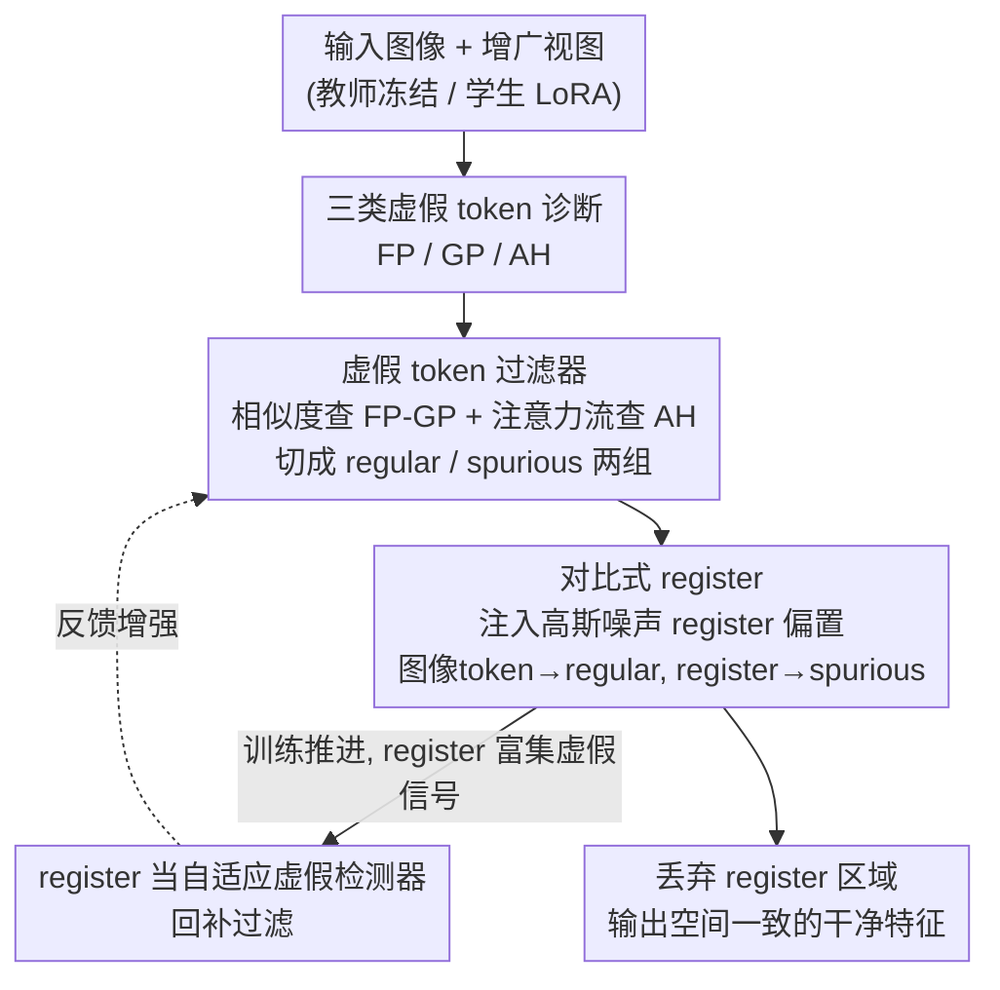

# UniRefiner: Teaching Pre-trained ViTs to Self-Dispose Dross via Contrastive Register

**会议**: CVPR 2026  
**arXiv**: [2605.19622](https://arxiv.org/abs/2605.19622)  
**代码**: https://congpeiqiu.github.io/UniRefiner (项目主页)  
**领域**: 自监督 / 表示学习  
**关键词**: ViT 特征精炼, 虚假 token, register token, 自蒸馏, 稠密预测

## 一句话总结
UniRefiner 把大规模预训练 ViT（甚至 EVA-CLIP-8B、InternViT-6B）特征图里多达 40% 的"虚假 token"系统地分成三类，用一个多路检测器把它们筛出来，再通过"对比式 register"在 LoRA 自蒸馏中把虚假信号显式驱赶到 register 区域、把干净语义留在图像区域，仅用 5k 图像、几个 epoch 微调，就让原本不擅长稠密任务的视觉-语言大模型在 ADE20K 分割上反超 DINOv2（EVA-CLIP-8B 达 51.9% mIoU，+9.4%）。

## 研究背景与动机
**领域现状**：ViT 预训练在视觉中心（DINO 系）和视觉-语言（CLIP/EVA-CLIP/SigLIPv2/InternViT）两条线都很成熟，是分割、深度估计、可控生成（如 REPA 用 DINOv2 特征监督扩散模型）等稠密任务的主力 backbone。

**现有痛点**：尽管视觉-语言大模型参数量极大、世界知识丰富，但稠密预测任务里大家仍然默认退回到纯视觉专用 backbone。原因是 VLM 的特征图"空间不一致"——大量 token 的 embedding 与它所在的空间位置对不上，作者称之为虚假 token（spurious token）。这些 token 严重污染了稠密任务所需的逐位置表示质量。

**核心矛盾**：以往工作（如 register、DVT）把虚假 token 狭义地理解为"高范数离群点"，于是只针对单一类型、或对所有 token 一视同仁地处理。但在大模型里这种污染又多又杂：EVA-CLIP-8B 超过 40% 的 token 都是虚假的，且形态各异，单纯去离群点根本不够。问题的根子是"对虚假 token 缺乏完整刻画 + 缺乏一种能把它们精准定位并定向清除的机制"。

**本文目标**：(1) 先把"什么样的 token 算虚假"讲清楚——给出面向稠密任务的统一定义和分类；(2) 设计一个通用、后置（post-hoc）、不改结构的精炼框架，教模型自己处理掉这些 token。

**切入角度**：作者重新定义虚假 token——只要一个 token 没能编码"与自身空间位置对齐的语义"，它就是虚假的。这个更宽的定义把问题暴露得更彻底，也让作者得以系统地归纳出三种基本类型。

**核心 idea**：先诊断（三类虚假 token + 多路检测器筛出来），再治疗（对比式 register：显式地把虚假信号"对齐"到可丢弃的 register token、把干净语义"对齐"到图像 token），让 ViT 学会自己把杂质倒掉。

## 方法详解

### 整体框架
UniRefiner 是一个后置精炼框架：冻结一个预训练 ViT 当教师，用 LoRA 初始化一个学生分支（孪生结构），在仅 5k 张图、约两个 epoch 内把学生 ViT 微调成"会自我清杂质"的版本，整个过程不改 ViT 结构。一次前向里发生四件事：① **虚假 token 分类**给出 FP/GP/AH 三种类型的行为定义（这是诊断基础，发生在分析阶段）；② **虚假 token 过滤器**对教师在增广视图上的输出做多路检测，把 token 切成"regular（要保留）"和"spurious（要丢弃）"两组；③ 在学生输入四周注入高斯噪声 patch 作为 register 偏置，得到图像 token 和 register token，再用**对比式 register 蒸馏**把图像 token 对齐到教师的 regular token、把 register token 对齐到教师的 spurious token；④ 随着训练推进，学到的 register 本身富集了虚假内容，于是被**反过来当作自适应虚假检测器**回补到第②步的过滤里，形成闭环。最终丢弃 register 区域、保留图像区域，就得到了空间一致的干净特征。

### 关键设计

**1. 三类虚假 token 的统一刻画：把"空间不对齐"拆成可检测的三种行为**

作者不再把虚假 token 当成单一的高范数离群点，而是从"该 token 是否忠实表达自身位置内容"出发，归纳出三种递进的失败模式。**Fixed Pattern (FP) token**：跨完全无关的图像几乎不变，像固定模板，携带极少视觉特有信息；检测靠"和一张无关参考图的任意 token 高度相似"——$\Gamma_{\text{fp}}=\{i\mid \max_{j\in\Gamma_{ref}}\cos(\bm{Z}_s[i],\bm{Z}_{ref}[j])\ge\tau_{\text{fp}}\}$。**Global Proxy (GP) token**：会随图变化，但描述的是整张场景的全局上下文而非自身局部内容；通过把源图和参考图拼成复合图，识别"和复合场景内 token 高相似、却又不满足 FP 那种跨图不变"的 token。**Attention Hijackee (AH) token**：本身不是静态异常，而是在自注意力里被更具判别性的邻居反复"覆写"了语义——它很少被别的 token 当作信息来源，却不断吸收强邻居的信息。它无法用特征相似度检测，必须看注意力流的不对称性（见设计 2）。这套分类是后面一切的根基：正因为虚假 token 异质且海量（EVA-CLIP-8B >40%），只有先认清它们才能对症下药。

**2. 虚假 token 过滤器：相似度查 FP/GP、注意力流查 AH 的多路检测**

针对三类 token 性质不同，过滤器走两条互补路径。**FP/GP 走相似度路径**：把增广视图 $\bm{X}'$ 与独立采样的参考图沿随机轴拼成复合图 $\bm{X}'_{cat}$，喂给教师得到特征，用同一阈值 $\tau_{\text{fp-gp}}$ 联合判定——"与复合图内任意 token 过相似（抓 GP 的全局代理性）"或"与参考图任意 token 过相似（抓 FP 的跨图不变性）"，满足其一即判虚假。**AH 走注意力流路径**：AH 的异常来自成对交互（源 token 本身并不异常），余弦相似度失效，于是改用跨层注意力流。定义 **hijack score** 为某 token 被其他 token 选作信息源的平均注意力入流：$h_j=\frac{1}{L}\sum_l\sum_i \bm{A}^l[i,j]$，其中 $\bm{A}^l=\mathrm{softmax}(\bm{Q}^l{\bm{K}^l}^\top/\sqrt{d})$。$h_j$ 很小说明该 token 几乎不被当作有意义的信息源（高入流低被引用），正是被劫持的特征；按 $\Gamma_{\text{ah}}=\{i\mid h_i\le\mu_h+\tau_{\text{ah}}\sigma_h\}$ 用均值方差做自适应阈值选出。最终 $\Gamma_{\text{spu}}=\Gamma_{\text{fg-gp}}\cup\Gamma_{\text{ah}}$，其补集即 regular 集合 $\Gamma_{\text{regu}}$。这条多路检测给后续蒸馏提供了可靠的、而非被杂质污染的教师监督。

**3. 对比式 register：把虚假信号"显式驱赶"到可丢弃区域，而不是被动指望它被吸收**

以往的 register 方法（DVT 等）只是被动地拼上一些 register token、盼着它们顺手吸收异常；但大模型里虚假信号太多，无约束的 register 很快被淹没（图 3b）。UniRefiner 的关键洞察是给 register 加**显式学习目标**。具体先做 **register 偏置注入**：在输入图四周拼一圈高斯噪声 patch 作为后置 register 偏置，注入后特征图从 $H\times W$ 扩到 $(H+2N_{reg})\times(W+2N_{reg})$，$N_{reg}=\lceil \min(W,H)/r_{reg}\rceil$。这样做有三个好处——无需改结构、对任意分辨率灵活、高斯随机性还能防止 register 坍缩。然后做**对比蒸馏的双向对齐**：学生前向得到图像区 $\bm{Z}$ 与 register 区 $\bm{Z}_{reg}$，用 ROI-Align 抽出与裁剪视图对齐的图像特征 $\bm{Z}_{\bm{X}'}^{\text{roi}}$，分别让图像 token 对齐教师的 regular token（保住位置对齐的语义）、让每个 register token 对齐与它最相似的那个 spurious 教师 token（把虚假信息收进 register）。两条通路把虚假 token 稳定地"分流"进 register 区域，干净语义则留在主表示流里——这正是"教模型该留什么、该丢什么"，而不是听天由命。

**4. register 反哺过滤：把学到的 register 当自适应虚假检测器闭环**

训练推进时，学生 ViT 不断把虚假 token 迁移进 register 区，register 自身就越来越"富含虚假内容"。作者顺势把这些学到的 register 反过来当成自适应虚假检测器：复合特征里任一 token 只要与某个 register token 余弦相似度超过阈值 $\tau_{\text{reg}}$，就被额外标记为虚假——$\Gamma_{\text{reg}}^{X'}=\{i\mid\max_j\cos(\bm{Z}^{\text{cat}}_{\bm{X}'}[i],\bm{Z}_{reg}[j])\ge\tau_{\text{reg}}\}$，用来补充设计 2 里的虚假集合。这形成一个良性闭环：register 学得越好 → 检测越准 → 监督越干净 → register 学得更好。消融显示去掉这一项虽不致命但确有掉点。

### 损失函数 / 训练策略
训练遵循"对扰动不变"原则（视觉内容在空间扰动下表示应稳定），用随机 resized crop 作为扰动 $\tau$ 生成 N 个裁剪视图做孪生自蒸馏；教师冻结，学生仅训练 LoRA（rank 8）。三个损失都基于 InfoNCE：

$$\mathcal{L}_{\text{regu}}=\frac{1}{|\Gamma_{\text{regu}}^{X'}|}\sum_i \mathcal{L}_{NCE}(\bm{Z}_{\bm{X}'}^{\text{roi}}[i],\bm{Z}^{\text{cat}}_{\bm{X}'}[i]),\quad i\in\Gamma_{\text{regu}}^{X'}$$

$\mathcal{L}_{\text{regu}}$ 让学生图像 token 保住教师的位置对齐语义；$\mathcal{L}_{\text{spu}}$ 把每个 register token 对齐到与之最相似的虚假教师 token（按 $l=\arg\max_{j\in\Gamma_{\text{spu}}}\cos(\bm{Z}_{reg}[i],\bm{Z}^{\text{cat}}_{\bm{X}'}[j])$ 配对），把虚假信号收进 register；再加一项**均匀性损失** $\mathcal{L}_{\text{uni}}=\frac{1}{|\bm{Z}_{\bm{X}'}^{\text{roi}}|}\sum_i\log\sum_j\exp(\bm{Z}_{\bm{X}'}^{\text{roi}}[i]^\top\bm{Z}_{reg}[j]/\tau_{\text{uni}})$，最大化图像 token 与 register token 的散度、防止杂质回流污染主表示。总目标 $\mathcal{L}=\mathcal{L}_{\text{regu}}+\lambda_{\text{spu}}\mathcal{L}_{\text{spu}}+\lambda_{\text{uni}}\mathcal{L}_{\text{uni}}$。收敛极快：SigLIPv2-So400m 在 4×H100 上约 5 分钟、EVA-CLIP-8B 在 8×H100 上约 20 分钟。

## 实验关键数据

### 主实验

线性探测下的稠密预测（分割 mIoU↑ / 深度 RMSE↓），UniRefiner 对各类预训练范式、各种规模都一致大幅提升：

| Backbone | ADE20K mIoU | CityScapes mIoU | VOC mIoU | NYUd RMSE↓ |
|----------|-------------|-----------------|----------|------------|
| DINOv2 G/14 | 49.1 | 71.5 | 84.2 | 0.347 |
| DINOv2 + UniRefiner | 50.6 | 73.4 | 85.4 | 0.308 |
| SigLIPv2 So/16 | 45.6 | 63.4 | 77.8 | 0.469 |
| SigLIPv2 + UniRefiner | **49.8** | 67.9 | 82.1 | 0.387 |
| EVA-CLIP 8B/14 | 42.5 | 69.5 | 69.6 | 0.512 |
| EVA-CLIP + UniRefiner | **51.9** (+9.4) | 74.6 | 83.6 | 0.359 |

最亮点：原本偏弱的 EVA-CLIP-8B 精炼后 ADE20K 达 51.9% mIoU，反超专用视觉模型 DINOv2-Giant（49.1%）；更小的 SigLIPv2-So 精炼后 49.8% 也超过更大的 DINOv2-Giant，说明这些 VLM 的空间能力此前被虚假 token 严重压制。深度估计提升更明显（深度更看重空间完整性）。

零样本开放词表分割（基于 VLM 特征，MaskCLIP 协议，8 benchmark 平均）：

| Backbone | Avg mIoU |
|----------|----------|
| CLIP G/14 | 28.6 |
| CLIP + UniRefiner | 31.4 |
| SigLIPv2 So/16 | 28.4 |
| SigLIPv2 + UniRefiner | 36.3 |
| EVA-CLIP 8B/14 | 21.6 |
| EVA-CLIP + UniRefiner | 34.3 |

EVA-CLIP-8B 在 Cityscapes 上提升 +19% mIoU、整体接近翻三倍，且保住了原有的视觉-语言对齐能力。此外把 REPA 里的 DINOv2 换成精炼后的 SigLIPv2，ImageNet 256² 生成 FID 从 2.21→1.96，也优于 DINOv2 版（2.02）。

### 消融实验

Register 设计消融（SigLIPv2-So，ADE20K 线性探测）：

| 配置 | mIoU | mACC | 说明 |
|------|------|------|------|
| Full Model | 49.8 | 62.9 | 完整模型 |
| 可学习 register（替高斯噪声） | 47.9 | 60.1 | 退回 DVT 式 register，掉 1.9 |
| w/o $\mathcal{L}_{\text{uni}}$ | 45.8 | 59.0 | 去均匀性损失，掉 4.0 |
| w/o $\mathcal{L}_{\text{spu}}$ | 45.0 | 58.5 | 去虚假对齐损失，掉 4.8 |

虚假 token 过滤器的渐进消融（图 8 定性+定量）：去掉 register 检测器 $\Gamma_{\text{reg}}$ 有掉点但模型仍可用；再去掉 AH 过滤，"公交车"的 token 会侵占整片道路区域；再去掉 FP-GP 过滤，虚假 token 几乎吞掉所有图像 token，分割崩溃、甚至比原始 baseline 还差。

### 关键发现
- **贡献最大的是两个对比损失**：去掉 $\mathcal{L}_{\text{spu}}$（虚假对齐）掉 4.8、去掉 $\mathcal{L}_{\text{uni}}$（均匀性）掉 4.0，远大于把高斯 register 换成可学习 register 的 1.9——说明"显式驱赶虚假 + 显式分离图像/register"才是性能核心，而不仅是 register 形式。
- **FP-GP 过滤是底线**：它一旦缺失，虚假 token 会反客为主导致分割比 vanilla 还差，印证了"必须做完整多路过滤、单一类型处理不够"。
- **模型越大收益越大**：EVA-CLIP-8B 虚假 token 比例最高（>40%），精炼后提升也最猛（ADE20K +9.4，开放词表近三倍），佐证大 VLM 的空间潜力此前被严重低估。
- PCA 可视化（图 9）显示精炼后虚假 token 被赶到图像边界的 register 区、与正常图像 token 分离，直接验证了"register 当杂质收集器"的机制。

## 亮点与洞察
- **把"虚假 token"从模糊概念升级成可操作的诊断学**：FP/GP/AH 三分类各配一个可计算的判据（FP 跨图相似、GP 复合图全局相似、AH 注意力入流低），让"特征图为什么脏"第一次变得可检测、可干预，这套 taxonomy 本身就有迁移价值。
- **register 从"被动吸纳"变"主动驱赶"**：最巧妙的是用对比蒸馏给 register 指定明确目标——图像 token 对齐 regular、register 对齐 spurious，再用 uniformity 把两者推开。这把一个原本玄学的 trick 变成了有监督信号的清晰机制。
- **闭环自检测**：让训练中富集虚假信号的 register 反过来当检测器，是一个低成本的自我增强设计，思路可迁移到任何"先检测后清除、且清除产物可复用为检测器"的场景。
- **极低成本撬动大模型潜力**：仅 5k 图、几个 epoch、只训 LoRA，就让 8B VLM 在稠密任务反超专用视觉模型——对"如何榨取已有基础模型的隐藏能力"是一个很有性价比的范式。

## 局限与展望
- **依赖教师自身的虚假判据可靠性**：检测阈值（$\tau_{\text{fp}}$、$\tau_{\text{ah}}$、$\tau_{\text{reg}}$ 等）较多，论文用均值方差做了部分自适应，但跨数据域/分辨率的阈值鲁棒性、以及误把真实小物体 token 判为虚假的风险，文中未充分量化。
- **检测开销**：FP/GP 需要拼复合图并多次前向、AH 需要存储跨层注意力图，相比纯前向有额外计算与显存成本，尤其在 8B 模型上；论文报告训练快，但对推理期是否需要这套过滤说明不足。
- **评测以线性探测/training-free 协议为主**：是否在全量微调、检测/实例分割等更复杂头部下仍保持同等增益，缺乏验证。
- 可改进方向：把三类判据统一进一个可学习的轻量检测头以减少超参；探索是否能在预训练阶段就抑制虚假 token 而非后置修补。

## 相关工作与启发
- **vs DVT / register（Darcet 等）**: 他们把虚假 token 当高范数离群点、用无约束 register 被动吸收或只针对单一类型处理；本文给出 FP/GP/AH 完整分类，并用对比目标显式驱赶虚假、保留语义，针对大 VLM 海量异质虚假 token 才有效。
- **vs 去噪式精炼（DenoisingViT 等 [37,5,24]）**: 同样基于"扰动不变"原则做自蒸馏，但本文先分离 regular/spurious 再蒸馏，让监督来自可靠 token 而非被杂质污染的全体 token，这是它能在大模型上奏效的关键差异。
- **vs 专用视觉 backbone（DINOv2）路线**: 业界默认稠密任务用 DINO 系；本文证明精炼后的 VLM（EVA-CLIP-8B/SigLIPv2）可在稠密任务反超 DINOv2，同时保住视觉-语言对齐与世界知识，启发"统一一个 backbone 同时做稠密+开放词表"的可能。
- **启发**: REPA 用 DINOv2 特征监督扩散；把它换成精炼后的 SigLIPv2 即提升生成质量，说明"特征空间纯净度"是表示质量的可迁移代理指标，可用于挑选/改造生成模型的特征监督源。

## 评分
- 新颖性: ⭐⭐⭐⭐⭐ 虚假 token 三分类 + 对比式 register 主动驱赶 + register 反哺检测，是一套自洽且原创的诊断-治疗框架。
- 实验充分度: ⭐⭐⭐⭐ 覆盖 5 个 backbone、分割/深度/开放词表/生成多任务，消融清晰；但偏线性探测协议、阈值鲁棒性与推理开销验证不足。
- 写作质量: ⭐⭐⭐⭐⭐ 先诊断后治疗的叙事顺，公式与图（FP/GP/AH 示意、PCA、过滤消融）紧扣机制。
- 价值: ⭐⭐⭐⭐⭐ 用极低成本解锁 8B 级 VLM 的稠密潜力并反超专用模型，对复用现有大模型有直接实用价值。

<!-- RELATED:START -->

## 相关论文

- [\[ICLR 2026\] Fly-CL: A Fly-Inspired Framework for Enhancing Efficient Decorrelation and Reduced Training Time in Pre-trained Model-based Continual Representation Learning](../../ICLR2026/self_supervised/fly-cl_a_fly-inspired_framework_for_enhancing_efficient_decorrelation_and_reduce.md)
- [\[CVPR 2026\] Reading Your Actions: Learning Generalizable Action Representations via Pre-training AEMG](reading_your_actions_learning_generalizable_action_representations_via_pre-train.md)
- [\[CVPR 2026\] Chain-of-Models Pre-Training: Rethinking Training Acceleration of Vision Foundation Models](com_pt_chain_of_models_pretraining.md)
- [\[NeurIPS 2025\] Self-Supervised Contrastive Learning is Approximately Supervised Contrastive Learning](../../NeurIPS2025/self_supervised/self-supervised_contrastive_learning_is_approximately_supervised_contrastive_lea.md)
- [\[CVPR 2026\] UniGeoCLIP: Unified Geospatial Contrastive Learning](unigeoclip_geospatial_contrastive.md)

<!-- RELATED:END -->
