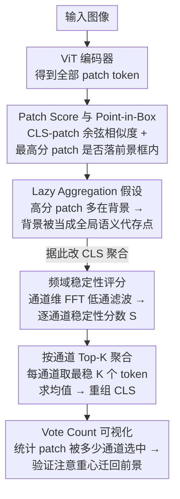

# Vision Transformers Need More Than Registers

**会议**: CVPR 2026  
**arXiv**: [2602.22394](https://arxiv.org/abs/2602.22394)  
**代码**: [https://github.com/ChengShiest/LAST-ViT](https://github.com/ChengShiest/LAST-ViT)  
**领域**: 自监督  
**关键词**: Vision Transformer, Lazy Aggregation, Register Token, DINO, Dense Feature Alignment

## 一句话总结
这篇论文认为 ViT 在标签监督、文本监督和自监督下普遍存在的 dense feature 伪影，本质上不是单纯的 high-norm token 问题，而是模型在粗粒度监督和全局注意力共同作用下学会了用背景 patch 充当全局语义捷径；作者据此提出 LaSt-ViT，用频域稳定性引导的选择性聚合替代原始 CLS 聚合，在 12 个基准上稳定改善定位、分割和开放词汇任务。

## 研究背景与动机
ViT 现在已经不只是分类 backbone，而是很多下游视觉系统的通用特征提取器。问题在于，一旦把这些特征拿去做定位、分割、开放词汇检测这类需要 spatially aligned dense feature 的任务，就会发现它们经常“看错地方”。

已有工作分别从不同现象切入过这个问题。
- 在 label supervision 下，有工作指出 ViT 的 dense feature 对前景不敏感。
- 在 text supervision 下，CLIP 式 ViT 的 patch-text 对齐往往很差，影响 zero-shot dense prediction。
- 在 self-supervision 下，DINO 系列又暴露出 high-norm token / artifact token，会破坏 object discovery。

作者认为，这几类问题虽然表面上不一样，但背后很可能是同一个机制在不同训练范式下的不同表现。现有方法大多只是在某一个设置里“打补丁”，例如给 DINO 加 register token，可以把一部分异常全局信息转移出去，却没有解释清楚为什么这些异常 token 会出现，也没有解释为什么换成文本监督或标签监督时还会出现类似现象。

论文的核心动机可以概括为三层。
- 第一层，作者想给不同监督范式下的 artifact 找到一个统一可比较的定义，而不是每个社区各说各话。
- 第二层，作者想判断 register token 到底是在解决根因，还是只是在搬运症状。
- 第三层，作者希望提出一个不依赖特定训练目标、能直接在预训练阶段抑制 artifact 的统一方案。

作者的关键观察是：对于只接受图像级监督信号的 ViT，CLS token 只需要对整张图的语义负责，却不需要显式保证每个 patch 都对得上前景语义。在这种设定下，模型最省事的做法不是老老实实从前景 patch 里抽取全局语义，而是借助全局自注意力，把少量前景信息扩散到大量背景 patch 上，再让 CLS 从这些“背景捷径”里完成语义聚合。作者把这种行为称为 lazy aggregation。

这个解释之所以有说服力，是因为它同时解释了两个现象。
- 为什么背景 patch 往往拥有很高的 patch score：因为它们被模型当成了全局语义的代存点。
- 为什么 register 只能缓解不能根治：因为它只是提供了新的全局信息存储位置，但没有改变模型依赖捷径聚合的倾向。

用一句更精炼的话说，本文要解决的问题不是“怎么把异常 token 挪走”，而是“怎么阻止 ViT 从一开始就学会用背景作为全局语义捷径”。

## 方法详解
本文的方法分成两部分：先用一套统一诊断工具证明 lazy aggregation 确实存在，再据此设计一个新的 CLS 聚合机制，让全局表征更多依赖真正稳定、与前景相关的 patch。作者刻意没有一上来就改 loss，而是先把“我们到底在看什么”重新定义清楚——因为没有统一度量，就无法把 supervised、text-supervised、self-supervised 三个体系放在同一张桌子上比较。

### 整体框架
整条 pipeline 的思路可以这样串起来：先用标准 ViT encoder 得到所有 patch token 表示 $\mathbf{x}_{patch} \in \mathbb{R}^{N \times D}$，再定义一个 Patch Score 衡量每个 patch 与全局 CLS 的相似度，借此判断模型把哪些位置当成了“代表整张图语义”的关键 patch。一旦发现高分 patch 反复落在背景而非前景，作者就用 Point-in-Box (PiB) 指标把这个观察量化下来，直接统计最高分 patch 是否位于标注框内。诊断坐实之后，方法侧的改动只有一处：训练时不再让 CLS 无差别地吸收所有 patch，而是先为每个 patch 的每个通道算一个稳定性分数，再按通道挑出 Top-K 最稳定的 token 做聚合，重新组装出 CLS 表征。

从输入输出看，LaSt-ViT 没有重写 ViT 主干，也没有加复杂的新监督分支，它做的事情更像是“重新规定 CLS 从哪些 patch 取信息、按什么原则取信息”。正因为改动只落在聚合方式上，它才能原样迁移到监督、文本监督和自监督三类预训练范式中。

### 关键设计

**1. Patch Score 与 Point-in-Box：把三个社区的 artifact 放进同一把尺子**

不同监督范式各说各话的根源，是大家连“异常”都没有统一定义。作者用 CLS 与 patch 的余弦相似度作为统一探针，定义 patch score 为 $\mathcal{S}_p = \frac{\mathbf{x}_{patch} \cdot Q_{CLS}}{\lVert \mathbf{x}_{patch} \rVert_2 \lVert Q_{CLS} \rVert_2}$，分数越高说明该 patch 越接近全局语义表示。直觉上，如果 dense feature 是健康的，最能代表整图语义的区域应该落在主体对象附近；可一旦高分 patch 总待在背景，就说明模型在抄近路。为了让这个判断不止停留在定性观察，作者进一步提出 PiB，直接统计最高 patch score 是否落在前景框内——它足够直接，而且能在不同架构、不同预训练范式之间对齐，于是成了贯穿全文的核心诊断量。

**2. Lazy Aggregation 假设：artifact 的根因不是 high-norm，而是背景捷径**

有了统一尺子，作者用训练动态、掩码实验和结构干预来追问 artifact 究竟是怎么形成的。最有说服力的一组对照是：去掉高分 patch 几乎不伤分类精度、有时还微涨，而去掉低分 patch 精度却大幅下滑——这直接推翻了“高分 patch = 关键前景”的直觉，反而说明那些位置更像冗余但高相关的背景代存点。如果它们真是前景关键位置，删掉就该掉点，现实恰好相反。更关键的是时间维度：ViT 的 PiB 在训练很早期就偏低，并几乎贯穿整个训练保持不变，而分类精度还在持续上升。这说明 artifact 不是后期偶发的副产物，而是优化路径里一开始就被学到、之后再没被纠正的稳定策略。lazy aggregation 因此既解释了背景为何高分（被当成全局语义代存点），也解释了 register 为何只能缓解（换了存储容器，没改走捷径的倾向）。

**3. 频域稳定性评分：用“通道是否稳定”筛出前景候选 token**

诊断指向背景捷径后，方法的第一步是想办法把可靠的前景 patch 识别出来，而且不能依赖额外的前景标注。作者的直觉来自一个统计规律：前景区域在深层特征上语义更一致，沿通道维度变化更平滑；背景语义杂，低通滤波后变化更大。于是对每个 patch 在通道维度做一维 FFT，乘上高斯低通权重 $\mathbf{g}$，再逆变换得到低频版本 $\hat{\mathbf{x}}_{patch}$，并据此给每个 patch 的每个通道打稳定性分数：

$$\mathbf{S}_{i,j} = \frac{\hat{\mathbf{x}}_{patch}[i,j]}{|\hat{\mathbf{x}}_{patch}[i,j] - \mathbf{x}_{patch}[i,j]| + \varepsilon}$$

分母是低通前后的差异：某个通道在滤波后几乎不变，说明它携带的信息更“稳定”，更可能属于被持续共享的主体语义，而不是背景里的杂散高频线索。这相当于不用监督信号，就给“哪些 patch 值得信任”提供了一个自然的排序依据。

**4. 按通道 Top-K 聚合：让 CLS 只吸收最可靠的局部证据**

有了稳定性分数，作者就用它替换掉原始的 CLS 聚合。关键不是再写一个新的 pooling 公式，而是引入“选择性”：对第 $j$ 个通道，先取稳定性分数最高的集合 $\mathcal{I}_K(j)$，再只对这 K 个 token 求均值作为该通道的 CLS 值，即 $\mathcal{Q}_{CLS}[j] = \frac{1}{K}\sum_{i \in \mathcal{I}_K(j)} \mathbf{x}_{patch}[i,j]$。这里特意做的是 channel-wise 选择而非整 token 筛选——同一个 patch 未必在所有通道都可靠，逐通道挑选既保住了表征的细粒度，又避免整图平均把大量背景噪声灌进 CLS。和 register 的对照很清晰：register 是新增一个存储位，给捷径换个容器；LaSt-ViT 是直接卡住 CLS 的信息来源，减少走捷径的机会，因此更接近治本。

**5. Vote Count 可视化：验证 CLS 的注意重心确实迁回前景**

最后一个设计是用来证明前面那套机制不是黑盒 trick。作者统计每个 patch 被多少个通道的 Top-K 集合选中，得到 vote count $v_i = \sum_{j=1}^{D} \mathbf{1}\{i \in \mathcal{I}_K(j)\}$，票数越高代表这个 patch 在越多语义通道上被认作可靠证据。可视化显示，高票 patch 与前景区域高度对齐，并且会随前景证据的多少自适应增减——这直观说明 LaSt-ViT 真的把 CLS 的注意力从背景代存点拉回到了主体上，而不只是换了一种数值更好看的聚合。

### 损失函数 / 训练策略
本文没有引入一个全新的监督目标，而是保持原训练范式不变，把改动集中在 CLS 聚合方式上。

- 在 fully supervised 场景下，仍然使用标准图像分类监督。
- 在 text-supervised 场景下，仍然使用 CLIP 式图文对比学习。
- 在 self-supervised 场景下，仍然沿用 DINO 类自监督训练。

因此，LaSt-ViT 更像一种通用 aggregation module，而不是某个只服务于单一任务的新 loss。这个设计很实用，因为它把方法收益集中在“前景语义对齐”这件事上，而不是依赖额外标注或复杂多任务训练。

作者还做了两类关键验证，进一步支撑动机。
- 增大 patch size，减少背景 token 占比后，PiB 从 0.44 升到 0.52，但分类 top-1 从 62% 降到 55%。这说明粗粒度监督确实促成了背景捷径，同时也说明直接粗化 patch 不是好解法。
- 把全局注意力换成 window attention 后，PiB 持续上升，但 top-1 持续下降。例如 ViT-Small 在全部层都用窗口注意力时，PiB 从 50.1 提到 59.8，而 top-1 从 72.3 降到 63.9。说明全局依赖既带来识别收益，也让背景更容易吸收前景语义。

## 实验关键数据
论文的实验不是只围绕一个任务展开，而是覆盖三种训练范式和多个 dense downstream task。作者最想证明的不是“又一个 benchmark 上刷了分”，而是“只要 artifact 被抑制，ViT 的 dense behavior 会在多个任务上同步变好”。

### 主实验
先看作者最核心的 artifact 指标 Point-in-Box。这个表最能直接说明 LaSt-ViT 是否真的打到了根因。

| 训练范式 / 模型 | 基线 PiB | LaSt-ViT PiB | 提升 |
|------|------:|------:|------:|
| Supervised ViT | 42.7 | 55.1 | +12.4 |
| DINO-v1 | 44.5 | 69.7 | +25.2 |
| CLIP ViT | 39.8 | 50.1 | +10.3 |
| ResNet 参考 | 68.4 / 71.1 / 53.9 | - | - |

这个结果很关键，因为它同时说明三件事。
- 第一，artifact 不是某个单独训练范式的问题。
- 第二，LaSt-ViT 带来的不是边角收益，而是对前景对齐能力的显著修正。
- 第三，DINO-v1 上的提升最大，说明自监督 ViT 在 object-centric dense feature 上尤其容易受 lazy aggregation 影响。

再看 self-supervised 领域最相关的 object discovery 结果。

| 方法 | FPS | VOC07 CorLoc | VOC12 CorLoc | COCO CorLoc |
|------|------:|------:|------:|------:|
| DINO-seg | 29.4 | 45.8 | 46.2 | 42.1 |
| LOST | 29.4 | 61.9 | 64.0 | 50.7 |
| DINO + LaSt-ViT | 55.9 | 64.4 | 67.6 | 51.6 |

这张表说明 LaSt-ViT 的收益不只是“Patch Score 看起来更合理”，而是真的能转化为无监督目标发现性能。尤其值得注意的是，它不仅比 DINO-seg 高很多，也超过了 LOST，同时速度更快，不需要额外的重型特征分解步骤。

作者还展示了 fully supervised 和 text-supervised 下的 dense task 提升，说明方法是统一有效的。

| 任务 | 基线 | LaSt-ViT | 提升 |
|------|------:|------:|------:|
| VOC12 coarse segmentation, ViT-B/16 supervised | 22.3 mIoU | 32.8 | +10.5 |
| VOC12 coarse segmentation, ViT-S/16 supervised | 29.5 mIoU | 41.9 | +12.4 |
| VOC12 coarse segmentation, ViT-S/16 DINO | 47.7 mIoU | 55.1 | +7.4 |
| CLIP ViT-B/16 on VOC20 segmentation | 49.0 mIoU | 75.0 | +26.0 |
| F-ViT ViT-B/16 on OV-COCO novel AP50 | 117.5 | 133.3 | +15.8 |

虽然这些结果跨任务跨指标，但它们指向同一个结论：一旦 CLS 不再过度依赖背景捷径，ViT 的 dense representation 会整体变得更可用。

### 消融实验
本文的消融围绕两个问题展开：一是 K 应该取多少，二是 LaSt-ViT 的提升是否只是某种 pooling 偏置。

先看 label-supervised 场景下的 K 消融。

| 配置 | IN1K Top-1 | VOC07 CorLoc | VOC12 CorLoc | 说明 |
|------|------:|------:|------:|------|
| Attention-Pool | 59.1 | 14.1 | 28.7 | 原始聚合 |
| Mean-Pool | 64.3 | 15.3 | 29.6 | 简单平均 |
| LaSt-ViT, K=1 | 64.6 | 30.4 | 35.6 | 极强筛选 |
| LaSt-ViT, K=7 | 64.8 | 32.1 | 37.6 | 最优折中 |
| LaSt-ViT, K=49 (Full) | 64.9 | 15.8 | 30.3 | 接近退化为全量聚合 |

这里最有意思的点是：当 K 变得过大时，定位收益明显退化。也就是说，作者的方法有效并不是因为换了一种 pooling 公式，而是因为“选择性”本身在起作用。K 太大以后，又把背景 token 放回来了。

再看 text-supervised 场景下的消融。

| 配置 | IN1K | VOC mIoU | COCO mIoU | 说明 |
|------|------:|------:|------:|------|
| Attention-Pool | 55.8 | 10.7 | 3.3 | 原始 CLIP 聚合 |
| Max-Pool | 53.1 | 71.9 | 12.2 | 天然压背景，但分类变差 |
| LaSt-ViT, K=1 | 53.5 | 72.7 | 13.5 | 过于激进 |
| LaSt-ViT, K=49 | 55.8 | 75.8 | 18.5 | 最优 |
| LaSt-ViT, K=98 | 56.2 | 75.9 | 18.0 | 接近最优 |
| LaSt-ViT, K=196 (Full) | 55.3 | 13.5 | 4.8 | 基本失效 |

这组结果进一步表明，LaSt-ViT 不是简单地做“更稀疏的 pooling”，而是通过筛掉不稳定背景 token，保留了对密集预测更有价值的局部证据。尤其 K=196 时几乎回到失败状态，说明 full aggregation 本身就是问题来源。

### 关键发现
- 去掉 high-score patch 对分类几乎没伤害，说明高分 patch 不等于关键前景，而更像被 CLS 利用的背景捷径。
- artifact 从训练早期就出现，PiB 几乎不随训练后期改善，说明这是优化路径里的早期习惯，而不是后期过拟合副作用。
- register token 能去掉 high-norm 现象，但 PiB 仍然很低，因此 high-norm 只是 lazy aggregation 的表现，不是根因。
- 限制全局依赖或减少背景 token 都能提高 PiB，但会牺牲分类精度，说明问题不能靠硬性削弱模型能力来解决，而要改聚合机制。
- Top-K 不是越大越好；当 K 接近全量 token 时，dense task 性能显著退化，证明选择性聚合是核心。

## 亮点与洞察
- 这篇论文最强的地方不是提出了一个复杂新模块，而是把多个社区分散讨论的 artifact 现象统一到了 lazy aggregation 这个解释框架里。这个框架足够简单，却能同时解释 supervised、CLIP、DINO 三个体系的异常。
- 作者把“register 是否有效”这个问题重新表述成“ViT 是否还在走背景捷径”。这个视角比只盯着高范数 token 更深入，因为它直接关注表征形成机制。
- 频域稳定性这个切入点很巧妙。它不是显式做前景监督，却利用前景语义通常更一致、背景语义更杂这一统计特征，给 CLS 聚合引入了一个自然的筛选依据。
- channel-wise Top-K 也很值得借鉴。很多 token 筛选方法按 token 整体打分，这篇工作提醒我们：不同通道可能对应不同语义子空间，逐通道选择会更细腻。
- 从研究方法上看，这篇论文是“先诊断、再建模、最后统一验证”的典型范式，论证链相对完整，适合作为分析型 paper 的写法参考。

## 局限与展望
- 论文的理论解释仍然偏经验归纳。作者用大量现象支持 lazy aggregation，但没有给出更严格的优化层面推导，例如为什么 CLS 在早期训练中会优先收敛到背景捷径。
- 频域稳定性假设默认“前景语义更平滑、背景更杂”，这在自然图像里通常成立，但在纹理主导或多实例复杂场景下未必总成立。
- 方法主要围绕 CLS 聚合展开，因此更适合依赖全局 token 的 ViT 变体。对于没有显式 CLS、或 heavily token-mixing 的架构，能否直接迁移还需要验证。
- 实验虽然广，但真正针对 self-supervised 的核心结果主要集中在 DINO-v1 object discovery。若能进一步覆盖 DINOv2、MAE、iBOT 等更强自监督骨干，会更有说服力。
- 文中强调 register 不够，但没有系统比较“register + LaSt-ViT”是否互补。若两者能配合，可能会得到更强的工程方案。

## 相关工作与启发
- **vs Register**: Register 的思路是给模型额外的全局存储槽，减少异常高范数 token 留在 patch map 上；本文则认为这只是转移症状，没有改变背景捷径形成机制。LaSt-ViT 直接改 CLS 的聚合来源，因此更接近治本。
- **vs CLIP dense alignment 系列方法**: 很多方法在下游额外做 patch-text 对齐或改最后几层 attention；本文把问题前移到预训练表征形成阶段，思路更基础，也更统一。
- **vs token pruning / token selection**: pruning 关注的是冗余和效率，而本文关注的是语义来源是否健康。两者可以结合，先用 LaSt-ViT 矫正语义，再做更可信的 token 裁剪。
- **对 self-supervised 的启发**: 自监督 ViT 的 object-centric 性能不一定只由 teacher-student loss 决定，CLS 如何聚合 patch 同样关键。今后做 DINO 类方法时，完全可以把 aggregation bias 当成独立设计维度。
- **对我的启发**: 如果一个 backbone 的全局表征是通过不健康的 shortcut 形成的，那么下游很多 dense task 问题都只是症状。以后分析 foundation model 时，应该优先审视“全局语义从哪里来”，而不是只看下游头部设计。

## 评分
- 新颖性: ⭐⭐⭐⭐⭐ 统一提出 lazy aggregation 这一根因解释，把 register 现象和跨范式 artifact 串成了一个更完整的故事。
- 实验充分度: ⭐⭐⭐⭐☆ 覆盖 12 个 benchmark、三种监督范式，范围很广；但自监督主线还可以再补更现代的 backbone。
- 写作质量: ⭐⭐⭐⭐☆ 诊断逻辑清楚，实验组织也有说服力；不过部分方法直觉仍略强于严格推导。
- 价值: ⭐⭐⭐⭐⭐ 这不仅是一个提升 dense feature 的技巧，更是一个理解 ViT 全局语义形成机制的分析框架。

<!-- RELATED:START -->

## 相关论文

- [\[CVPR 2026\] Can You Learn to See Without Images? Procedural Warm-Up for Vision Transformers](can_you_learn_to_see_without_images_procedural_warm-up_for_vision_transformers.md)
- [\[CVPR 2026\] DiverseDiT: Towards Diverse Representation Learning in Diffusion Transformers](diversedit_towards_diverse_representation_learning_in_diffusion_transformers.md)
- [\[CVPR 2026\] Finding Distributed Object-Centric Properties in Self-Supervised Transformers](finding_distributed_object-centric_properties_in_self-supervised_transformers.md)
- [\[CVPR 2025\] SATA: Spatial Autocorrelation Token Analysis for Enhancing the Robustness of Vision Transformers](../../CVPR2025/self_supervised/sata_spatial_autocorrelation_token_analysis_for_enhancing_the_robustness_of_visi.md)
- [\[CVPR 2026\] Robustness of Vision Foundation Models to Common Perturbations](robustness_of_vision_foundation_models_to_common_perturbations.md)

<!-- RELATED:END -->
